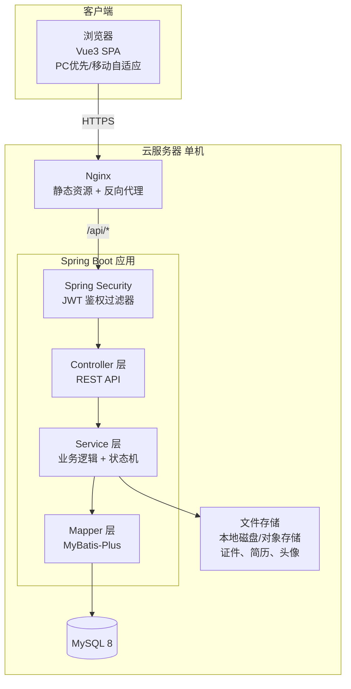
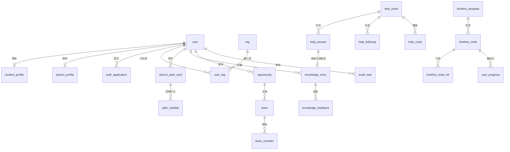
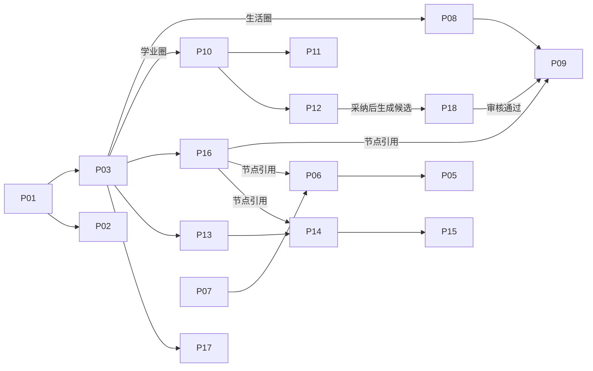
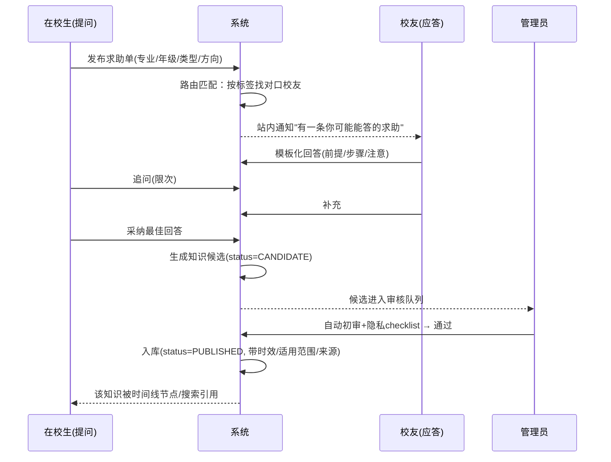
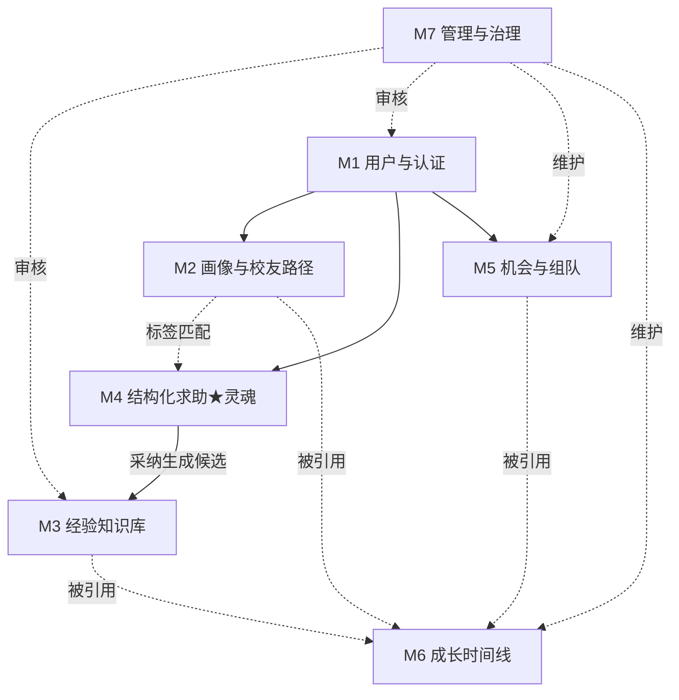

# 00 总体架构与技术设计（地基文档）

> 本文是全项目的"单一事实来源"（Single Source of Truth）。所有模块设计、数据库、接口、界面、代码都必须与本文的**命名、实体、API 规范、权限矩阵**对齐。改动本文需走变更记录。
> 系统：新疆大学校友圈与双圈成长导航平台　|　版本：v3　|　定位见 [[功能修改方案_v3]]

---

## 1. 技术选型

原则：**选熟不选新**，5 人一学期可交付，主流、文档全、无高风险技术。

| 层 | 技术 | 说明 |
|---|---|---|
| 前端 | Vue 3 + Vite + TypeScript | 组合式 API |
| UI 组件 | Element Plus | 表单/表格/弹窗齐全，省 UI 工时 |
| 前端状态 | Pinia | 登录态、用户信息、双圈上下文 |
| 路由 | Vue Router | 页面跳转与路由守卫（鉴权） |
| HTTP | Axios | 统一封装拦截器（带 token、统一错误处理） |
| 后端 | Spring Boot 3 (Java 17) | 分层：Controller/Service/Mapper |
| 持久层 | MyBatis-Plus | 单表 CRUD 省代码，复杂查询手写 SQL |
| 数据库 | MySQL 8.0 | InnoDB，utf8mb4 |
| 认证 | JWT + Spring Security | 无状态 token，RBAC |
| 搜索 | MySQL 全文索引（FULLTEXT + ngram） | 本期够用；Elasticsearch 列为未来扩展 |
| 缓存（可选） | Redis | 存"即将截止机会"等热点、验证码；本期可不做 |
| 构建/部署 | Maven + Nginx（前端静态） + 单机 Jar | 单体部署，一台云服务器 |
| 版本控制 | Git（GitHub: xju-SE/SE） | 已配好，见配置管理 |

**刻意不做**：微服务、分布式、消息队列、AI 大模型——保持单体，规避"关键词堆砌"雷区。

---

## 2. 系统总体架构

三层 + 单体后端，前后端分离。



**部署视图**：一台 2 核 4G 云服务器；Nginx 托管前端打包产物并把 `/api` 反代到 8080 的 Spring Boot；MySQL 同机或独立；上传文件存本地 `/data/upload`（演示期）或对象存储。

**分层职责**：Controller 只做参数校验与转发；Service 承载业务规则、事务、**所有状态机流转**；Mapper 只做数据存取。跨模块调用走 Service 接口，不允许 Controller 直接调别的模块 Mapper（保证低耦合）。

---

## 3. 全局数据模型（所有模块共享的实体地图）

**核心实体清单（约 25 张表，E-R 主干）**：

| # | 表名 | 中文 | 归属模块 | 关键外键 |
|---|---|---|---|---|
| 1 | `user` | 用户账号 | M1 | — |
| 2 | `student_profile` | 在校生档案 | M1/M2 | user_id |
| 3 | `alumni_profile` | 毕业生档案 | M1/M2 | user_id |
| 4 | `auth_application` | 认证申请 | M1/M7 | user_id |
| 5 | `tag` | 标签（专业/年级/问题类型/成长） | 全局 | — |
| 6 | `user_tag` | 用户-标签 | M2 | user_id, tag_id |
| 7 | `alumni_path_card` | 校友路径卡 | M2 | user_id |
| 8 | `path_visibility` | 路径卡字段可见性 | M2 | path_card_id |
| 9 | `knowledge_entry` | 知识条目 | M3 | author_id, source_help_id |
| 10 | `knowledge_feedback` | 三态评价/纠错 | M3 | entry_id, user_id |
| 11 | `help_ticket` | 求助单 | M4 | asker_id |
| 12 | `help_answer` | 回答 | M4 | ticket_id, responder_id |
| 13 | `help_followup` | 追问 | M4 | ticket_id |
| 14 | `help_route` | 求助路由通知 | M4 | ticket_id, matched_user_id |
| 15 | `opportunity` | 机会 | M5 | publisher_id |
| 16 | `team` | 队伍 | M5 | leader_id, opportunity_id |
| 17 | `team_member` | 队伍成员 | M5 | team_id, user_id |
| 18 | `referral_ticket` | 内推申请单（Could） | M5 | referrer_id, applicant_id |
| 19 | `timeline_template` | 时间线模板 | M6 | — |
| 20 | `timeline_node` | 时间线节点 | M6 | template_id |
| 21 | `timeline_node_ref` | 节点关联（只存ID） | M6 | node_id |
| 22 | `user_progress` | 个人进度 | M6 | user_id, node_id |
| 23 | `audit_task` | 审核任务 | M7 | target_id, reviewer_id |
| 24 | `report` | 举报 | M7 | reporter_id |
| 25 | `notification` | 站内通知 | 全局 | user_id |

**E-R 主干（核心关系，模块文档再各自细化字段）**：



**关键设计约定（全模块必须遵守）**：
- **软删除**：所有业务表带 `deleted TINYINT DEFAULT 0`（MyBatis-Plus 逻辑删除）。
- **审计字段**：所有表带 `created_at`、`updated_at`；内容表带 `created_by`。
- **并发控制**：可并发编辑的表（`knowledge_entry`）带 `version INT`（乐观锁 @Version）。
- **"只存 ID"**：`timeline_node_ref` 用 `(ref_type, ref_id)` 引用其他模块对象，**绝不复制内容**（体现低耦合）。
- **枚举统一**：所有状态/类型用后端枚举 + 数据库 `VARCHAR/TINYINT`，取值见各模块状态机。

---

## 4. 全局 API 规范

- **风格**：RESTful，前缀 `/api/v1`。资源用名词复数：`/api/v1/help-tickets`。
- **统一响应体**：
  ```json
  { "code": 0, "message": "success", "data": { } }
  ```
  `code=0` 成功；非 0 见错误码表。
- **分页响应**：`data: { "records": [], "total": 120, "page": 1, "size": 10 }`。
- **认证**：登录返回 JWT；后续请求头 `Authorization: Bearer <token>`。前端 Axios 拦截器统一注入。
- **鉴权**：后端 `@PreAuthorize` 按角色 + 资源属主校验（**接口级鉴权，不只前端隐藏**）。
- **错误码分段**：`1xxxx` 认证/权限，`2xxxx` 参数校验，`3xxxx` 业务规则（如"求助单已关闭不可回答"），`4xxxx` 资源不存在，`5xxxx` 服务器错误。
- **HTTP 方法**：GET 查、POST 增、PUT 全量改、PATCH 状态流转（如 `PATCH /help-tickets/{id}/adopt`）、DELETE 软删。

---

## 5. 角色与权限矩阵

| 角色 | 代码 | 说明 |
|---|---|---|
| 访客 | `GUEST` | 未登录，仅可看公共只读内容 |
| 在校生 | `STUDENT` | 认证后完整使用 |
| 毕业生 | `ALUMNI` | 认证后可填路径卡、答疑、发内推 |
| 管理员 | `ADMIN` | 学院老师/团队成员，治理端 |

| 功能 | GUEST | STUDENT | ALUMNI | ADMIN |
|---|:-:|:-:|:-:|:-:|
| 浏览生活圈公共FAQ、已发布知识（只读） | ✅ | ✅ | ✅ | ✅ |
| 注册 / 登录 | ✅ | — | — | — |
| 提交身份认证 | — | ✅ | ✅ | — |
| 发布求助单 / 追问 / 采纳 | ❌ | ✅ | ✅ | ✅ |
| 回答求助（带校友标识） | ❌ | ✅ | ✅ | ✅ |
| 填写/维护校友路径卡 | ❌ | ❌ | ✅ | — |
| 维护在校生画像与标签 | ❌ | ✅ | — | — |
| 报名机会 / 发起·加入队伍 | ❌ | ✅ | ✅ | — |
| 发布机会（内推类需审核） | ❌ | ❌ | ✅ | ✅ |
| 订阅时间线 / 标记个人进度 | ❌ | ✅ | ✅ | — |
| 审核认证 / 知识候选 / 处理举报 | ❌ | ❌ | ❌ | ✅ |
| 维护机会、时间线模板、标签体系 | ❌ | ❌ | ❌ | ✅ |
| 运营数据统计 | ❌ | ❌ | ❌ | ✅ |

**认证前只读分层**：`GUEST` 与"已注册未认证"用户可访问生活圈公共 FAQ、已发布知识条目（读）；写操作（发求助、填画像、看校友隐私字段）要求对应角色认证通过。

---

## 6. 界面清单与导航地图

**双圈是"视图层"**：顶部切换"生活圈 / 学业圈"，只改变首页仪表盘的内容过滤（`scene=LIFE|STUDY`），不改变业务数据与路由结构。

**页面清单（约 18 个主页面，≥5 界面要求远超）**：

| 编号 | 页面 | 角色 | 归属 |
|---|---|---|---|
| P01 | 登录/注册 | GUEST | M1 |
| P02 | 身份认证申请 | STUDENT/ALUMNI | M1 |
| P03 | **首页仪表盘**（双圈切换） | 全 | 视图层 |
| P04 | 个人中心/画像编辑 | STUDENT | M2 |
| P05 | 校友路径卡编辑（去向类型分支） | ALUMNI | M2 |
| P06 | 校友路径浏览 + 去向统计 | 全 | M2 |
| P07 | 路径推荐（输入条件→推荐） | STUDENT | M2 |
| P08 | 知识库列表 + 搜索 | 全 | M3 |
| P09 | 知识条目详情（三态评价/纠错） | 全 | M3 |
| P10 | 求助单列表（本专业高频） | 登录 | M4 |
| P11 | 发布求助单 | STUDENT | M4 |
| P12 | 求助单详情（模板化回答/追问/采纳） | 登录 | M4 |
| P13 | 机会列表（类型筛选/即将截止） | 全 | M5 |
| P14 | 机会详情 + 报名 | 登录 | M5 |
| P15 | 组队广场 + 队伍详情 | 登录 | M5 |
| P16 | 成长时间线（未决策默认/分化路线） | STUDENT | M6 |
| P17 | 站内通知中心 | 登录 | 全局 |
| P18 | **管理后台**（认证/候选审核、举报、模板、统计） | ADMIN | M7 |

**导航地图**：



---

## 7. 核心闭环端到端时序（系统灵魂，重点演示）



---

## 8. 模块划分与依赖关系



依赖只通过 **用户ID / 标签 / 状态 / 关联ID / 候选队列** 弱耦合，无模块直接改另一模块的数据。

---

## 9. 命名与术语表（全员强制统一，防扣分）

| 中文 | 英文/代码 | 禁止叫 |
|---|---|---|
| 求助单 | help ticket | 帖子、提问帖 |
| 回答 | answer | 楼层、回帖 |
| 追问 | follow-up | 评论 |
| 采纳 | adopt | 点赞、最佳 |
| 知识条目 | knowledge entry | 帖子、文章 |
| 知识候选 | knowledge candidate | 草稿 |
| 三态评价 | feedback(USEFUL/OUTDATED/NEED_UPDATE) | 点赞 |
| 校友路径卡 | alumni path card | 名片、动态 |
| 机会 | opportunity | 广告、帖子 |
| 队伍 | team | 群 |
| 时间线节点 | timeline node | 关卡 |
| 首页仪表盘 | dashboard | 广场、信息流 |

---

## 10. 落地实施顺序（迭代，指导编码）

| 迭代 | 目标（可独立演示） | 涉及模块 |
|---|---|---|
| 迭代一 | **核心闭环**：注册登录+认证(简) → 发求助 → 路由通知 → 回答 → 采纳 → 生成候选 → 审核入库 → 知识库搜索可见 | M1(简) + M4 + M3 + M7(候选审核) |
| 迭代二 | 校友路径卡+去向统计+路径推荐；机会与组队；时间线浏览+进度 | M2 + M5 + M6 |
| 迭代三 | 双圈仪表盘聚合、通知中心、管理统计、隐私可见性、并发/越权加固、测试 | 视图层 + M7 + 全局 |

> 编码从**迭代一的最短闭环**开始：先把"求助→采纳→候选→审核→入库→搜索"这条链打通并演示，它一通，全项目的技术骨架就立住了。
