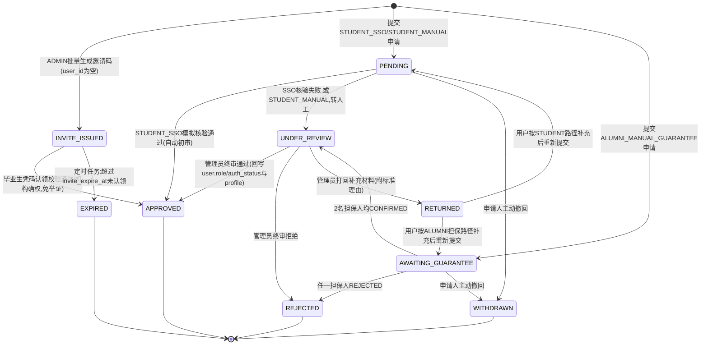

# 01 模块 M1 用户与认证 详细设计

> ⚠️ 本文为 v3 设计基线。实现已按 **v3.1 reconcile** 收敛，字段/接口/状态机差异**以 `backend/src/main/resources/schema.sql` 与 `docs/impl/00c_静态审查报告.md` 第五节为准**；本文与实现冲突处以后者为权威。见 [[09_设计修订说明]]。

> 对齐基线：[[00_总体架构与技术设计]]（技术选型 §1、全局数据模型 §3、全局API规范 §4、角色与权限矩阵 §5、界面清单 §6、命名与术语表 §9）。本文件字段、接口、角色代码均与地基文档严格一致，不重复定义地基已裁决的全局规则，仅在必要处引用。

---

## 1. 模块职责与边界

M1 负责全平台的**账号生命周期**与**身份可信度建立**：注册、登录、JWT 签发与刷新、基于 Spring Security 的 RBAC（`GUEST`/`STUDENT`/`ALUMNI`/`ADMIN`）鉴权基础设施、分级身份认证（在校生学号核验 / 毕业生邀请码或人工担保）、账号级隐私设置。M1 是全项目的地基模块：`user`、`student_profile`、`alumni_profile`、`auth_application` 四张表的读写入口都在本模块，其他模块只通过 `user_id`、`role`、`auth_status` 只读依赖，不直接操作这四张表。

**明确不做**：
- 不做认证材料的人工审核动作本身（审核队列的呈现、批量操作、隐私 checklist 属 M7，M1 只提供 `auth_application` 数据与 `AuthApplicationService` 审核回调接口）。
- 不做学生画像标签、成长标签体系维护（`tag`/`user_tag`/校友路径卡属 M2，`student_profile`/`alumni_profile` 中与画像展示、路径推荐相关的扩展字段由 M2 文档在本文件字段基础上追加，不在本文件重复设计）。
- 不对接真实学校统一身份认证系统与真实教务数据源（课程演示期用**模拟核验**，接口预留、内部标注 mock，符合地基"条件与假定"）。
- 不做站内通知的呈现与列表（`notification` 全局表由全局/M7 维护，M1 仅作为通知的触发方来源之一，如担保确认请求）。

---

## 2. 功能需求清单

| FR编号 | 功能名 | 角色 | 输入 | 处理逻辑 | 输出 | 优先级 |
|---|---|---|---|---|---|---|
| FR-M1-01 | 用户注册 | GUEST | 用户名(学号/邮箱)、密码、确认密码、邮箱、身份意向(STUDENT/ALUMNI) | 校验用户名/邮箱唯一性 → BCrypt 加密密码 → 创建 `user`(role=意向值, auth_status=UNVERIFIED) → 按 role 创建空 `student_profile`/`alumni_profile` 占位记录 | 用户信息 + JWT access/refresh token | Must |
| FR-M1-02 | 登录 | GUEST | 用户名、密码 | 校验密码 → 校验 `status=ACTIVE` → 签发 JWT | access/refresh token、用户信息(role/auth_status) | Must |
| FR-M1-03 | Token 刷新 | STUDENT/ALUMNI/ADMIN | refresh token | 校验签名与有效期、未在黑名单 | 新 access token | Must |
| FR-M1-04 | 登出 | 已登录 | — | 前端丢弃 token（无状态设计，本期不做服务端黑名单） | 成功提示 | Should |
| FR-M1-05 | 查看当前用户信息 | 已登录 | — | 聚合 `user` + 对应 profile 摘要字段 | 用户信息 DTO | Must |
| FR-M1-06 | 修改基本信息 | 已登录 | 昵称、头像、手机号 | 格式校验 → 更新 `user` | 更新后信息 | Must |
| FR-M1-07 | 修改隐私设置 | 已登录 | contact_visibility、profile_visibility | 枚举校验 → 更新 `user` 隐私字段 | 更新结果 | Should |
| FR-M1-08 | 提交在校生认证申请 | STUDENT(auth_status≠VERIFIED) | 学号、真实姓名、学院、专业、年级 | 创建 `auth_application`(apply_method=STUDENT_SSO) → 调用模拟统一身份认证核验 → 通过则自动 APPROVED，失败转 UNDER_REVIEW | 申请状态 | Must |
| FR-M1-09 | 提交毕业生认证申请(邀请码) | ALUMNI(auth_status≠VERIFIED) | 邀请码 | 匹配 `status=INVITE_ISSUED` 且未过期的记录 → 写入 user_id → 直接 APPROVED（机构确权，免本人举证） | 申请状态 | Must |
| FR-M1-10 | 提交毕业生认证申请(人工+担保) | ALUMNI(auth_status≠VERIFIED) | 邮箱/学号、毕业年份、专业、佐证材料、担保人1/2(同专业已认证用户) | 创建 `auth_application`(apply_method=ALUMNI_MANUAL_GUARANTEE, status=AWAITING_GUARANTEE) → 向 2 名担保人发站内通知 | 申请状态 | Must |
| FR-M1-11 | 担保人确认/拒绝 | STUDENT/ALUMNI(auth_status=VERIFIED) | 申请ID、同意/拒绝 | 更新对应 `guarantorN_status`；两人均 CONFIRMED → 转 UNDER_REVIEW；任一 REJECTED → 整单 REJECTED | 确认结果 | Must |
| FR-M1-12 | 查看认证进度 | 申请人 | — | 查询本人 `auth_application` 列表/详情及状态说明 | 状态详情 | Must |
| FR-M1-13 | 撤回 / 重新提交认证申请 | 申请人 | （重新提交时同 FR-08/10 表单） | PENDING/AWAITING_GUARANTEE 前允许撤回(→WITHDRAWN)；RETURNED 状态允许编辑重新提交(→回到审核前状态) | 操作结果 | Should |
| FR-M1-14 | 批量生成毕业生邀请码 | ADMIN | 数量、专业、届别(可选绑定姓名/学号)、有效期 | 批量插入 `auth_application`(applicant_role=ALUMNI, apply_method=ALUMNI_INVITE_CODE, status=INVITE_ISSUED, user_id=NULL) | 邀请码列表 | Must |
| FR-M1-15 | 认证终审(通过/拒绝/退回) | ADMIN | 申请ID、决定、理由 | 校验当前 status=UNDER_REVIEW → CAS 更新 status → APPROVED 时回写 `user.role/auth_status` 与对应 profile；由 M7 Controller 调用本模块 `AuthApplicationService` | 审核结果 | Must（跨 M7，见§8） |
| FR-M1-16 | 认证前只读权限校验 | GUEST / 已注册未认证 | 任意请求 | Spring Security 过滤器链：读端点 `permitAll`；写端点 `hasRole(...) AND authGuard.isVerified()` | 200 放行 / 403+错误码 10003 | Must |
| FR-M1-17 | 禁用 / 启用账号 | ADMIN | 用户ID、原因 | 更新 `user.status` | 操作结果 | Could |

---

## 3. 数据表设计

统一约定（与地基§3一致）：所有表含 `deleted TINYINT NN DEFAULT 0`、`created_at DATETIME NN DEFAULT CURRENT_TIMESTAMP`、`updated_at DATETIME NN DEFAULT CURRENT_TIMESTAMP ON UPDATE CURRENT_TIMESTAMP`（下表省略重复书写，仅在末尾统一列出）。本模块四张表均非"可并发编辑"表（并发编辑保护仅 `knowledge_entry` 需要），不加 `version`；`auth_application` 的审核动作用状态 CAS（`UPDATE ... WHERE status=?`）防止双人重复审核，见§9。

### 3.1 `user`（用户账号）

| 字段名 | 类型 | 长度 | 约束 | 默认 | 说明 |
|---|---|---|---|---|---|
| id | BIGINT | — | PK, AUTO_INCREMENT | — | 主键 |
| username | VARCHAR | 50 | NN, UK | — | 登录名，学号或邮箱，注册后不可改 |
| password_hash | VARCHAR | 100 | NN | — | BCrypt 密文 |
| role | VARCHAR | 20 | NN | — | 枚举：`STUDENT`/`ALUMNI`/`ADMIN`；注册时按身份意向确定，不入库 `GUEST`（未登录态在应用层体现，见§6.2） |
| auth_status | VARCHAR | 20 | NN | `UNVERIFIED` | 枚举：`UNVERIFIED`/`PENDING`/`VERIFIED`/`REJECTED`；与 `role` 正交，决定是否可执行写操作 |
| nickname | VARCHAR | 50 | NN | — | 昵称，默认取用户名前缀 |
| avatar_url | VARCHAR | 255 | — | NULL | 头像地址 |
| email | VARCHAR | 100 | UK | NULL | 邮箱 |
| phone | VARCHAR | 20 | — | NULL | 手机号（可选） |
| contact_visibility | VARCHAR | 20 | NN | `SAME_MAJOR` | 枚举：`PUBLIC`/`SAME_MAJOR`/`PRIVATE`；隐私设置——联系方式对外可见范围 |
| profile_visibility | VARCHAR | 20 | NN | `SAME_MAJOR` | 枚举同上；隐私设置——身份信息(真实姓名/学号/学院专业)对外可见范围 |
| status | VARCHAR | 20 | NN | `ACTIVE` | 枚举：`ACTIVE`/`DISABLED`；ADMIN 可禁用账号 |
| last_login_at | DATETIME | — | — | NULL | 最近登录时间 |

> 说明：`real_name`/`student_no` 等强隐私字段**不放在 `user` 表**，只存在 `student_profile`/`alumni_profile` 中，且始终不受 `profile_visibility=PUBLIC` 放宽（见§6.4 隐私规则），避免"设为公开"误放出敏感认证材料。

### 3.2 `student_profile`（在校生档案）

| 字段名 | 类型 | 长度 | 约束 | 默认 | 说明 |
|---|---|---|---|---|---|
| id | BIGINT | — | PK, AUTO_INCREMENT | — | 主键 |
| user_id | BIGINT | — | NN, UK, FK→user.id | — | 一对一 |
| real_name | VARCHAR | 50 | NN | — | 真实姓名（认证材料，默认仅本人/ADMIN 可见） |
| student_no | VARCHAR | 20 | NN, UK | — | 学号 |
| college | VARCHAR | 100 | — | NULL | 学院 |
| major | VARCHAR | 100 | NN | — | 专业（供 M2 标签匹配 / M4 求助路由匹配使用） |
| grade | VARCHAR | 10 | NN | — | 年级，如"2023级" |
| admission_year | YEAR | — | NN | — | 入学年份 |
| expected_graduation_year | YEAR | — | — | NULL | 预计毕业年份 |
| sso_verified | TINYINT | — | NN | 0 | 是否通过(模拟)统一身份认证核验 |

> M2 在此表基础上追加成长画像相关字段（GPA 区间、兴趣标签关联等），本文件只设计认证所需的身份字段，避免跨模块重复定义。

### 3.3 `alumni_profile`（毕业生档案）

| 字段名 | 类型 | 长度 | 约束 | 默认 | 说明 |
|---|---|---|---|---|---|
| id | BIGINT | — | PK, AUTO_INCREMENT | — | 主键 |
| user_id | BIGINT | — | NN, UK, FK→user.id | — | 一对一 |
| real_name | VARCHAR | 50 | NN | — | 真实姓名 |
| student_no | VARCHAR | 20 | — | NULL | 在校学号（如认证材料含有，人工审核佐证用） |
| college | VARCHAR | 100 | — | NULL | 毕业学院 |
| major | VARCHAR | 100 | NN | — | 毕业专业（供 M2/M4 匹配） |
| graduation_year | YEAR | — | NN | — | 毕业年份 |
| verify_method | VARCHAR | 20 | NN | — | 枚举：`INVITE_CODE`/`MANUAL_GUARANTEE`；本人通过的认证方式 |
| invited_by_user_id | BIGINT | — | FK→user.id | NULL | 若 `INVITE_CODE` 方式，记录发码的学院/辅导员(ADMIN)账号 |

> M2 在此表基础上追加去向类型分支字段（深造/就业展开字段）、路径卡关联，本文件不重复设计。

### 3.4 `auth_application`（认证申请）

| 字段名 | 类型 | 长度 | 约束 | 默认 | 说明 |
|---|---|---|---|---|---|
| id | BIGINT | — | PK, AUTO_INCREMENT | — | 主键 |
| user_id | BIGINT | — | FK→user.id | NULL | 申请人；`INVITE_ISSUED`（邀请已发放未认领）阶段为空 |
| applicant_role | VARCHAR | 20 | NN | — | 枚举：`STUDENT`/`ALUMNI`，申请认证的目标身份 |
| apply_method | VARCHAR | 30 | NN | — | 枚举：`STUDENT_SSO`/`STUDENT_MANUAL`/`ALUMNI_INVITE_CODE`/`ALUMNI_MANUAL_GUARANTEE` |
| real_name | VARCHAR | 50 | — | NULL | 申请时填写的真实姓名快照，通过后回写 profile |
| student_no | VARCHAR | 20 | — | NULL | 学号快照 |
| college | VARCHAR | 100 | — | NULL | 学院快照 |
| major | VARCHAR | 100 | — | NULL | 专业快照 |
| grade | VARCHAR | 10 | — | NULL | 年级快照（STUDENT） |
| graduation_year | YEAR | — | — | NULL | 毕业年份快照（ALUMNI） |
| invite_code | VARCHAR | 32 | UK | NULL | 邀请码（仅 `ALUMNI_INVITE_CODE`），唯一索引允许多 NULL |
| invite_code_issuer_id | BIGINT | — | FK→user.id | NULL | 邀请码生成人(ADMIN) |
| invite_expire_at | DATETIME | — | — | NULL | 邀请码有效期（仅 `INVITE_ISSUED` 阶段有意义） |
| guarantor1_user_id | BIGINT | — | FK→user.id | NULL | 担保人1（仅 `ALUMNI_MANUAL_GUARANTEE`） |
| guarantor1_status | VARCHAR | 20 | — | NULL | 枚举：`PENDING`/`CONFIRMED`/`REJECTED` |
| guarantor2_user_id | BIGINT | — | FK→user.id | NULL | 担保人2 |
| guarantor2_status | VARCHAR | 20 | — | NULL | 枚举同上 |
| evidence_files | VARCHAR | 500 | — | NULL | 佐证材料 URL，JSON 数组字符串 |
| sso_result | VARCHAR | 20 | — | NULL | 枚举：`SUCCESS`/`FAILED`/`SKIPPED`（模拟统一身份认证结果，仅 `STUDENT_SSO`） |
| status | VARCHAR | 20 | NN | `PENDING` | 枚举：`INVITE_ISSUED`/`PENDING`/`AWAITING_GUARANTEE`/`UNDER_REVIEW`/`RETURNED`/`APPROVED`/`REJECTED`/`WITHDRAWN`/`EXPIRED`，见§4 状态机 |
| reviewer_id | BIGINT | — | FK→user.id | NULL | 终审管理员 |
| review_comment | VARCHAR | 500 | — | NULL | 审核意见/退回理由（支持 M7 维护的标准理由模板） |
| submitted_at | DATETIME | — | — | NULL | 提交时间（`INVITE_ISSUED` 未认领时为空） |
| reviewed_at | DATETIME | — | — | NULL | 终审时间 |

> 设计要点：毕业生邀请码机制**不新增表**——邀请码本身就是一条 `status=INVITE_ISSUED`、`user_id=NULL` 的 `auth_application` 记录（辅导员批量生成=批量预创建）；毕业生认领时按 `invite_code` 匹配并原地更新 `user_id`、`status=APPROVED`，符合地基"只存ID、不复制内容、不无谓新增表"的低耦合约定。`audit_task`（M7）通过 `target_type='AUTH_APPLICATION', target_id=auth_application.id` 引用本表，不复制字段。

---

## 4. 状态机

`auth_application.status` 状态机（覆盖在校生/毕业生两条分级认证路径）：



**终态说明**：`APPROVED`/`REJECTED`/`WITHDRAWN`/`EXPIRED` 为终态；`REJECTED` 后用户如需再次尝试，需发起**新的** `auth_application` 记录（不复用旧记录，保留完整审核历史留痕）。

---

## 5. API 接口清单

前缀 `/api/v1`；统一响应体 `{code, message, data}`；错误码分段沿用地基 §4（`1xxxx` 认证/权限、`2xxxx` 参数校验、`3xxxx` 业务规则、`4xxxx` 资源不存在、`5xxxx` 服务器错误）。本模块常用错误码：`10001` 用户名或密码错误、`10002` token 失效/过期、`10003` 未通过身份认证不可执行写操作、`10004` 账号已禁用、`30001` 用户名/邮箱已存在、`30002` 邀请码无效/已使用/已过期、`30003` 认证申请当前状态不允许该操作、`30004` 担保人不满足条件(需同专业且已认证)、`40002` 认证申请不存在。

| 方法 | 路径 | 说明 | 关键入参 | 返回 data 结构 | 所需角色 |
|---|---|---|---|---|---|
| POST | `/api/v1/auth/register` | 注册 | username, password, email, identityType(STUDENT/ALUMNI) | `{userId, accessToken, refreshToken}` | GUEST |
| POST | `/api/v1/auth/login` | 登录 | username, password | `{accessToken, refreshToken, user: UserDTO}` | GUEST |
| POST | `/api/v1/auth/refresh` | 刷新 token | refreshToken | `{accessToken}` | STUDENT/ALUMNI/ADMIN |
| POST | `/api/v1/auth/logout` | 登出 | — | `null` | STUDENT/ALUMNI/ADMIN |
| GET | `/api/v1/users/me` | 查看当前用户信息 | — | `UserDTO`(含role/auth_status/profile摘要) | STUDENT/ALUMNI/ADMIN |
| PUT | `/api/v1/users/me` | 修改基本信息 | nickname, avatarUrl, phone | `UserDTO` | STUDENT/ALUMNI/ADMIN |
| PATCH | `/api/v1/users/me/privacy` | 修改隐私设置 | contactVisibility, profileVisibility | `UserDTO` | STUDENT/ALUMNI/ADMIN |
| GET | `/api/v1/users/guarantor-candidates` | 查询可担保人候选(同专业已认证) | major, keyword | `{records:[UserBriefDTO]}` | STUDENT/ALUMNI |
| PATCH | `/api/v1/users/{id}/status` | 启用/禁用账号 | status, reason | `UserDTO` | ADMIN |
| POST | `/api/v1/auth-applications` | 提交认证申请(三种分级路径统一入口，按applyMethod分支) | applyMethod, 对应表单字段(见§2 FR-08/09/10) | `AuthApplicationDTO` | STUDENT/ALUMNI |
| GET | `/api/v1/auth-applications/me` | 查看我的认证申请历史 | page, size | 分页 `{records, total, page, size}` | STUDENT/ALUMNI |
| GET | `/api/v1/auth-applications/{id}` | 查看申请详情 | — | `AuthApplicationDTO` | 本人/ADMIN |
| PATCH | `/api/v1/auth-applications/{id}/withdraw` | 撤回申请 | — | `AuthApplicationDTO` | 本人 |
| PATCH | `/api/v1/auth-applications/{id}/resubmit` | RETURNED后补充重新提交 | 更新后的表单字段 | `AuthApplicationDTO` | 本人 |
| PATCH | `/api/v1/auth-applications/{id}/guarantee` | 担保人确认/拒绝 | approve(boolean) | `AuthApplicationDTO` | STUDENT/ALUMNI(需 auth_status=VERIFIED) |
| GET | `/api/v1/invite-codes/{code}/check` | 认证申请前预检邀请码有效性 | — | `{valid, major, expireAt}` | ALUMNI |
| POST | `/api/v1/invite-codes/batch` | 批量生成毕业生邀请码 | count, major, graduationYear, expireAt | `{records:[code]}` | ADMIN |
| PATCH | `/api/v1/auth-applications/{id}/approve` | 认证终审通过(M7治理端调用) | comment | `AuthApplicationDTO` | ADMIN |
| PATCH | `/api/v1/auth-applications/{id}/reject` | 认证终审拒绝 | comment | `AuthApplicationDTO` | ADMIN |
| PATCH | `/api/v1/auth-applications/{id}/return` | 打回补充材料 | comment | `AuthApplicationDTO` | ADMIN |

> `approve`/`reject`/`return` 三个终审接口的 Controller 挂载于 M7 管理后台路由分组，但实现直接调用本模块 `AuthApplicationService`（见§8），此处列出是为了完整覆盖 `auth_application` 全生命周期，避免读者跨文件拼接。

---

## 6. 关键算法与业务规则

### 6.1 在校生认证（学号 + 模拟统一身份认证核验）

```
提交 STUDENT_SSO 申请(studentNo, realName, college, major, grade):
  1. 校验 user.role == STUDENT 且 user.auth_status != VERIFIED，否则 30003
  2. 校验 studentNo 格式(学号规则:数字,固定位数)，否则 20001
  3. 创建 auth_application(applicant_role=STUDENT, apply_method=STUDENT_SSO,
       real_name/student_no/college/major/grade=快照, status=PENDING, submitted_at=now)
  4. result = mockSsoVerify(studentNo, realName)
     // 模拟实现：内置"学号-姓名"种子对照表 + 学号格式校验，
     // 标注为演示期 mock，接口签名与真实统一身份认证对接预留一致
  5. 若 result == SUCCESS:
       auth_application.sso_result = SUCCESS; status = APPROVED; reviewed_at = now
       写入/更新 student_profile(real_name, student_no, college, major, grade, sso_verified=1)
       user.auth_status = VERIFIED
       仍异步创建一条 audit_task(target_type=AUTH_APPLICATION, target_id=applicationId,
         result=AUTO_APPROVED) 留痕，满足"自动初审"可追溯（不阻塞用户，不进入人工队列）
     否则:
       auth_application.sso_result = FAILED; status = UNDER_REVIEW
       创建 audit_task(target_type=AUTH_APPLICATION, target_id=applicationId) 进入 M7 人工审核队列
  6. 返回 AuthApplicationDTO(status, 若APPROVED附带"认证成功"提示；若UNDER_REVIEW附带"已转人工审核"提示)
```

### 6.2 毕业生认证——路径A：学院/辅导员邀请码（机构确权，免本人举证）

```
（前置）ADMIN 批量生成邀请码:
  批量插入 auth_application(applicant_role=ALUMNI, apply_method=ALUMNI_INVITE_CODE,
    status=INVITE_ISSUED, user_id=NULL, invite_code=随机32位, invite_code_issuer_id=当前ADMIN,
    major/graduation_year=生成时指定, invite_expire_at=生成时指定)

毕业生认领邀请码(inviteCode):
  1. 校验 user.role == ALUMNI 且 auth_status != VERIFIED，否则 30003
  2. SELECT auth_application WHERE invite_code=inviteCode AND status='INVITE_ISSUED' FOR UPDATE
     不存在 → 40002；存在但 invite_expire_at < now → 置 EXPIRED 并返回 30002
  3. UPDATE auth_application SET user_id=当前用户, status='APPROVED',
       real_name=用户填写核对值, submitted_at=now, reviewed_at=now
       WHERE id=? AND status='INVITE_ISSUED'   -- CAS，防止并发重复认领
  4. 影响行数=0(已被抢先认领) → 30002；=1 → 继续
  5. 写入 alumni_profile(real_name, major, graduation_year, verify_method=INVITE_CODE,
       invited_by_user_id=invite_code_issuer_id)
  6. user.auth_status = VERIFIED
  7. 返回 APPROVED，不经过人工队列（机构侧已确权）
```

### 6.3 毕业生认证——路径B：邮箱/学号 + 人工审核 + 同专业2人担保

```
提交 ALUMNI_MANUAL_GUARANTEE 申请(email/studentNo, major, graduationYear, evidenceFiles,
                                   guarantor1UserId, guarantor2UserId):
  1. 校验 user.role == ALUMNI 且 auth_status != VERIFIED，否则 30003
  2. 校验 guarantor1/2 != 当前用户，且两者均满足:
       user.auth_status == VERIFIED AND (student_profile.major == major OR alumni_profile.major == major)
     不满足 → 30004
  3. 创建 auth_application(apply_method=ALUMNI_MANUAL_GUARANTEE, status=AWAITING_GUARANTEE,
       major/graduation_year=快照, evidence_files=已上传文件URL数组,
       guarantor1_user_id/guarantor2_user_id, guarantor1_status=PENDING, guarantor2_status=PENDING)
  4. 向 guarantor1、guarantor2 各发一条 notification(担保确认请求，带申请人姓名/专业/届别)

担保人响应(applicationId, approve):
  1. 校验当前用户是 guarantor1_user_id 或 guarantor2_user_id 之一，且对应 *_status == PENDING
  2. 更新对应 guarantorN_status = approve ? CONFIRMED : REJECTED
  3. 若任一为 REJECTED → status = REJECTED, review_comment = "担保人拒绝担保"
     若两者均 CONFIRMED → status = UNDER_REVIEW（进入 M7 人工终审队列，创建 audit_task）
     否则（还有担保人未响应）→ 保持 AWAITING_GUARANTEE

（定时任务）担保超时:
  每日扫描 status=AWAITING_GUARANTEE 且 submitted_at 超过 N=3 天仍有 *_status=PENDING 的记录
  → 站内通知申请人"可更换担保人"，不自动改变状态（留给用户主动撤回重提）

人工终审(UNDER_REVIEW → APPROVED/REJECTED/RETURNED):
  ADMIN 核对 evidence_files 与快照字段一致性、担保人身份 →
    APPROVED: 写入 alumni_profile(verify_method=MANUAL_GUARANTEE), user.auth_status=VERIFIED
    REJECTED: 记录 review_comment（标准理由模板，M7维护）
    RETURNED: 记录 review_comment，用户可在 P02 编辑后调用 resubmit 回到 AWAITING_GUARANTEE
```

### 6.4 认证前只读分层（GUEST 与"已注册未认证"权限一致对待）

- **角色（role）与认证状态（auth_status）正交**：`role` 表示用户注册时选择的身份类型（STUDENT/ALUMNI/ADMIN），`auth_status` 表示该身份是否已核验。二者任一环节缺失都不放行写操作。
- 未携带有效 JWT 的请求，由 Spring Security `AnonymousAuthenticationFilter` 赋予匿名身份，应用语义上等同 `GUEST`；**数据库不持久化 `GUEST` 角色值**。
- 读端点（生活圈公共 FAQ、已发布知识条目等，归属 M3）在其 `SecurityConfig` 中配置 `permitAll()`，对匿名与已登录但未认证用户一视同仁放行。
- 写端点统一要求 `@PreAuthorize("hasAnyRole('STUDENT','ALUMNI','ADMIN') and @authGuard.isVerified(authentication)")`：`authGuard.isVerified()` 读取 JWT claim 中的 `authStatus`，非 `VERIFIED` 一律拒绝并返回 `10003`，即使角色声明已是 STUDENT/ALUMNI（已注册未认证用户在写操作上与 GUEST 权限等价，只是多了"账号设置""认证申请"两类专属端点）。
- `ADMIN` 账号不经由公开注册流程创建（初始化脚本或上级 ADMIN 通过内部接口创建），创建时 `auth_status` 直接置 `VERIFIED`。

### 6.5 JWT 设计与刷新

- Header：`alg=HS256`；Payload claims：`sub=userId`、`role`、`authStatus`、`iat`、`exp`、`jti`。
- Access token 有效期 2 小时；Refresh token 有效期 7 天，签发时其哈希存于内存/DB（本期简化为随登录会话记录，不做 Redis 强依赖）。
- `role`/`authStatus` 变化（如认证通过、被禁用）后，旧 access token 在剩余有效期内仍可能带旧 claim——写操作的 `authGuard.isVerified()` 校验以 token claim 为准，因此**审核通过后需引导用户重新登录/刷新 token** 以生效（P02 界面在认证通过提示中包含"请重新登录以解锁完整功能"）。

---

## 7. 界面设计

### P01 登录/注册（角色 GUEST，归属 M1）

- **布局要素**：
  - 顶部 Tab：登录 / 注册。
  - 登录区：用户名(学号/邮箱)、密码、登录按钮、注册入口。
  - 注册区：身份意向单选（"我是在校生" / "我是毕业生"，决定后续 P02 分支表单）、用户名、密码、确认密码、邮箱、协议勾选。
  - 底部：「暂不认证，先逛逛」入口——跳过认证直接进入只读模式。
- **关键交互**：注册成功自动登录并跳转 P02，提示"完成身份认证解锁发求助/填画像等完整功能，认证前可先浏览公共内容"；点击"先逛逛"直接进 P03（写操作按钮统一置灰，hover 提示跳转 P02）。
- **校验规则**：用户名/邮箱唯一性异步校验；密码 ≥8 位且含字母与数字；邮箱格式；身份意向必选。
- **跳转去向**：登录成功 → P03；注册成功 → P02（或"先逛逛" → P03 只读态）。
- **负责人**：[占位]

### P02 身份认证申请（角色 STUDENT/ALUMNI，归属 M1）

- **布局要素**：
  - 顶部认证状态卡片：按 `auth_application` 最新状态（UNVERIFIED 引导发起 / PENDING /AWAITING_GUARANTEE 展示进度 / UNDER_REVIEW / RETURNED 展示理由与"重新提交" / REJECTED 展示理由与"重新申请" / APPROVED 展示"已认证"）。
  - 主表单区按 `role` 分支：
    - `role=STUDENT`：学号、真实姓名、学院、专业、年级 → 提交后即时反馈"核验中/已通过/已转人工"。
    - `role=ALUMNI`：二级 Tab「邀请码认证」/「人工审核+担保」。
      - 邀请码：输入框 + 实时校验按钮（调用 `/invite-codes/{code}/check`）。
      - 人工+担保：邮箱/学号、毕业年份、专业、佐证材料上传（图片/PDF，≤5MB）、担保人1/2 选择器（调用 `guarantor-candidates`，仅展示同专业且 `auth_status=VERIFIED` 的候选）。
  - 担保确认状态区（申请人视角只读展示担保人1/2 当前状态）。
- **关键交互**：材料上传组件带进度条与格式校验；担保邀请发出后前端轮询/手动刷新展示 `guarantorN_status`；RETURNED 状态表单预填上次数据供编辑。
- **校验规则**：学号格式；必填项非空；担保人不可为本人且不可重复选择；佐证材料大小/格式限制；邀请码 32 位字符格式。
- **跳转去向**：认证通过 → 提示"请重新登录以生效" → P03；未认证前可直接返回 P03（只读）。
- **负责人**：[占位]

> P01/P02 均为表单类页面，非列表/信息流，不涉及"仪表盘化、无信息流"纪律的约束对象；该纪律适用于 P03 首页仪表盘。

---

## 8. 与其他模块的接口

**M1 依赖谁**：
- M7：`auth_application` 的终审动作最终落在 M7 治理端 Controller，但更新逻辑在 M1 `AuthApplicationService` 内完成；M1 通过发布 Spring 事件 `AuthApplicationSubmittedEvent` 解耦触发 `audit_task` 创建，不直接写 M7 的表。
- 全局 `notification` 表：担保确认请求、认证结果通知由 M1 触发插入，展示与已读态维护属全局/M7。

**被谁依赖**（只读依赖 `user_id`/`role`/`auth_status`/`major`/`grade`，不直接查表，统一走 Service）：
- M2：`student_profile`/`alumni_profile` 的 `major`/`grade`/`graduation_year` 供标签匹配、路径推荐；要求 `alumni_profile` 对应用户 `auth_status=VERIFIED` 才允许填写路径卡。
- M4：`isVerified(userId)` 校验发布求助单/回答的前置条件；`student_profile.major`/`grade` 作为求助-校友路由匹配的标签基础。
- M5：`getRole(userId)`==ALUMNI 且已认证才允许发布机会。
- M6：`student_profile.major`/`grade` 决定成长时间线模板匹配。
- M7：审核队列列表需展示申请人 `UserDTO` 摘要；调用 `AuthApplicationService.approve/reject/returnForSupplement`。
- 全局：`JwtAuthenticationFilter`/`AuthGuard` 被所有模块 Controller 复用，是唯一的鉴权入口。

**对外暴露的 Service 方法签名（Java）**：

```java
public interface UserService {
    UserDTO getById(Long userId);
    UserDTO getCurrentUser();
    UserDTO register(RegisterRequest request);
    void updateProfile(Long userId, UpdateProfileRequest request);
    void updatePrivacySetting(Long userId, PrivacySettingRequest request);
    boolean isVerified(Long userId);
    Role getRole(Long userId);
    List<UserBriefDTO> searchGuarantorCandidates(String major, String keyword);
    void disableUser(Long userId, String reason);
    void enableUser(Long userId);
}

public interface AuthApplicationService {
    AuthApplicationDTO submit(Long userId, SubmitAuthApplicationRequest request);
    AuthApplicationDTO getById(Long id);
    PageResult<AuthApplicationDTO> pageForReview(AuthApplicationQuery query); // 供 M7 审核列表调用
    AuthApplicationDTO withdraw(Long id, Long userId);
    AuthApplicationDTO resubmit(Long id, Long userId, ResubmitAuthApplicationRequest request);
    AuthApplicationDTO confirmGuarantee(Long id, Long guarantorUserId, boolean approve);
    AuthApplicationDTO approve(Long id, Long reviewerId, String comment);   // 供 M7 终审通过调用
    AuthApplicationDTO reject(Long id, Long reviewerId, String comment);   // 供 M7 终审拒绝调用
    AuthApplicationDTO returnForSupplement(Long id, Long reviewerId, String comment); // 供 M7 打回调用
    boolean validateInviteCode(String code);
    List<String> batchCreateInviteCodes(BatchInviteCodeRequest request);
}

public interface AuthTokenService {
    TokenPair login(String username, String password);
    TokenPair refresh(String refreshToken);
    void logout(Long userId);
}
```

---

## 9. 编码实现要点

**Controller**：
- `AuthController`：`register`/`login`/`refresh`/`logout`。
- `UserController`：`me`（查/改）、`me/privacy`、`guarantor-candidates`、`{id}/status`（ADMIN）。
- `AuthApplicationController`：`submit`/`me`（列表）/`{id}`（详情）/`withdraw`/`resubmit`/`guarantee`。
- `InviteCodeController`：`{code}/check`、`batch`（ADMIN）。
- 终审三个接口（`approve`/`reject`/`return`）挂在 M7 的 `AdminAuthApplicationController`，直接调用 `AuthApplicationService` 对应方法，Controller 归属 M7 代码目录但复用 M1 的 Service Bean。

**Service**：
- `UserServiceImpl`：注册（含用户名/邮箱唯一性校验、BCrypt 加密、按 role 创建空 profile 占位）、隐私设置、封禁。
- `AuthApplicationServiceImpl`：三条分级认证路径的核心逻辑（§6.1-6.3），内部依赖 `SsoMockService`（模拟统一身份认证，学号+姓名种子表校验）、`NotificationService`（担保确认通知，跨模块接口）、`InviteCodeAllocator`（批量生成邀请码字符串，保证唯一）。
- `JwtTokenProvider`：签发/校验/刷新 JWT，读写 claim（`role`/`authStatus`）。
- `AuthGuard`：`@Component("authGuard")`，供 `@PreAuthorize` SpEL 调用 `isVerified(Authentication)`。

**Mapper**：`UserMapper`、`StudentProfileMapper`、`AlumniProfileMapper`、`AuthApplicationMapper`，均继承 MyBatis-Plus `BaseMapper`，启用逻辑删除（`deleted`）。

**Security 组件**：
- `SecurityConfig`：声明 `permitAll()` 路径（登录/注册/公共读端点白名单，公共读端点清单由 M3/全局维护，M1 只声明自身白名单）、启用 `@EnableMethodSecurity` 支持 `@PreAuthorize`。
- `JwtAuthenticationFilter`（`OncePerRequestFilter`）：解析 `Authorization: Bearer <token>`，校验成功后写入 `SecurityContext`（`GrantedAuthority=ROLE_{role}`），并将 `authStatus` 存入自定义 `Authentication` 实现供 `AuthGuard` 读取。
- `JwtAuthenticationEntryPoint`/`JwtAccessDeniedHandler`：将 401/403 统一转换为标准响应体 `{code:10002 或 10003, message, data:null}`，不使用 Spring 默认错误页。

**事务边界**：
- `register`：单事务内插入 `user` + 按 role 插入空 `student_profile`/`alumni_profile` 占位记录。
- `submit`（认证申请提交）：事务内插入/更新 `auth_application`（含 INVITE_ISSUED 认领的 CAS 更新），事务提交后发布 `AuthApplicationSubmittedEvent`（`@TransactionalEventListener(phase = AFTER_COMMIT)` 由 M7 监听并创建 `audit_task`），避免跨模块直接依赖 M7 Mapper。
- `approve`/`reject`/`returnForSupplement`：单个 `@Transactional` 方法内完成 `auth_application` 状态更新 + `user.role/auth_status` 回写 + `student_profile`/`alumni_profile` 写入，保证一致性；失败整体回滚。
- `confirmGuarantee`：事务内更新担保状态并判断是否转 `UNDER_REVIEW`/`REJECTED`。

**并发控制**：`auth_application` 审核类更新一律用状态 CAS（`UPDATE auth_application SET status=? WHERE id=? AND status=期望的前置状态`，影响行数=0 时返回 `30003`），代替乐观锁字段，防止两名管理员同时终审同一条申请、或邀请码被并发重复认领。

**文件上传**：认证佐证材料（学生证/毕业证/邮箱截图等）存本地磁盘 `/data/upload/auth/{userId}/{applicationId}/` 或对象存储，`evidence_files` 只存相对路径 JSON 数组；访问需短期签名 URL，仅本人与 ADMIN 可读，防止隐私材料被越权访问。

**定时任务**（`@Scheduled`）：
1. 邀请码过期扫描（每日）：`status=INVITE_ISSUED AND invite_expire_at < now` → 置 `EXPIRED`。
2. 担保超时提醒（每日）：`status=AWAITING_GUARANTEE` 且提交超过 3 天仍有 `guarantorN_status=PENDING` → 站内通知申请人。
3. 审核队列积压提醒（每日，联动 M7）：`status=UNDER_REVIEW` 超过阈值天数未处理 → 通知 ADMIN，避免开学季堆积导致"一键通过"。
