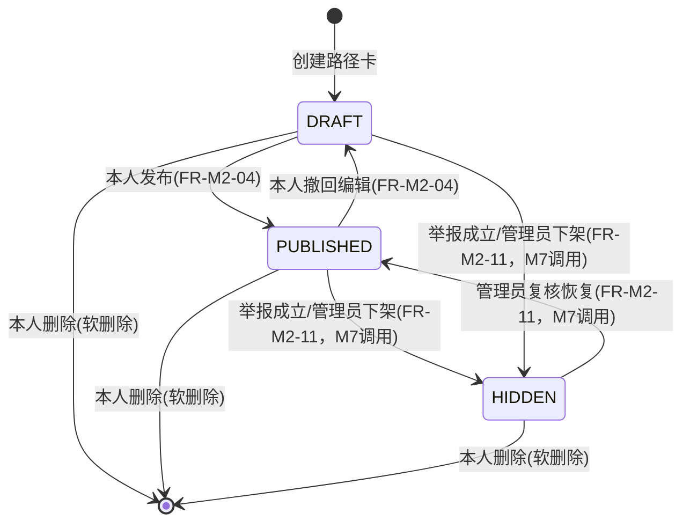

# 02 模块 M2 成长画像与校友路径 详细设计

> ⚠️ 本文为 v3 设计基线。实现已按 **v3.1 reconcile** 收敛，字段/接口/状态机差异**以 `backend/src/main/resources/schema.sql` 与 `docs/impl/00c_静态审查报告.md` 第五节为准**；本文与实现冲突处以后者为权威。见 [[09_设计修订说明]]。

## 1. 模块职责与边界

M2 负责两类主体的结构化画像与"去向"数据资产：①在校生的成长画像与标签（专业/年级/GPA/兴趣/目标城市行业等，支撑标签匹配与推荐）；②毕业生的校友路径卡（`alumni_path_card`），按"去向类型"分支记录深造/就业等结构化细节，并提供字段级可见性控制、按专业聚合的去向统计（带最低样本门槛保护）、以及输入条件即可产出推荐路径与匹配校友的规则引擎。本模块只负责画像与路径数据本身的存储、可见性计算、统计聚合与推荐计算；**不负责**：身份认证与角色判定（M1）、成长标签体系与专业/行业标签字典的增删维护（全局标签维护归属 M7，本模块只读引用）、求助单的发布与路由通知投递（M4，M2 仅对外暴露 `user_tag` 只读查询供 M4 匹配）、路径卡因举报被下架的举报受理流程与人工复核界面（M7，M2 只暴露下架/恢复的 Service 能力供 M7 调用）、时间线节点如何编排引用校友路径（M6，M2 只提供按可见性脱敏后的只读数据）。

## 2. 功能需求清单

| FR编号 | 功能名 | 角色 | 输入 | 处理逻辑 | 输出 | 优先级 |
|---|---|---|---|---|---|---|
| FR-M2-01 | 维护在校生画像 | STUDENT | 目标城市、目标行业标签、GPA、GPA满分制、简介、头像（专业/年级为认证结果只读带入，不可在本接口修改） | 校验 GPA∈[0, gpaScale]；目标行业须为 `tag(type=INDUSTRY)` 有效值；写入 `student_profile` | 画像详情 | Must |
| FR-M2-02 | 维护成长标签 | STUDENT/ALUMNI | 标签ID列表（来源 `tag`，`tag_type∈{INTEREST,GROWTH}`） | 去重；数量上限（≤10）；覆盖式写入 `user_tag`（`tag_source=SELF`） | 当前标签列表 | Must |
| FR-M2-03 | 新建/编辑校友路径卡 | ALUMNI | 毕业阶段、专业、毕业年份、毕业GPA、去向类型、对应分支字段、经验总结 | 按 `destination_type` 做分支必填校验（见6.1）；乐观锁更新（`version`） | 路径卡详情 | Must |
| FR-M2-04 | 发布/撤回路径卡 | ALUMNI | pathCardId、目标状态 | 状态机流转校验（见4）：仅 `DRAFT` 可发布，仅 `PUBLISHED` 可撤回 | 新状态 | Must |
| FR-M2-05 | 配置字段级可见性 | ALUMNI | pathCardId、`{field_group: visibility}` 列表 | 仅允许该卡片当前 `destination_type` 下实际存在的 `field_group`；`visibility∈{SELF,SAME_MAJOR,PUBLIC}` | 可见性配置列表 | Must |
| FR-M2-06 | 浏览校友路径卡列表 | STUDENT/ALUMNI/ADMIN（须登录） | 专业、去向类型、毕业年份区间筛选 | 仅返回 `status=PUBLISHED`；按6.2规则计算每张卡对当前访问者可见的摘要字段 | 分页卡片摘要列表 | Must |
| FR-M2-07 | 查看路径卡详情 | STUDENT/ALUMNI/ADMIN（须登录） | pathCardId | 按6.2逐字段分组计算可见性 | 脱敏后详情（不可见字段返回 `null` 并标注隐藏原因） | Must |
| FR-M2-08 | 按专业聚合去向统计 | STUDENT/ALUMNI/ADMIN（须登录） | majorTagId | 按6.3样本门槛与二级维度 k-匿名规则聚合 | 去向类型分布，或"样本不足，仅供参考"降级提示 | Must |
| FR-M2-09 | 路径推荐 | STUDENT | 专业（默认带入）、年级、GPA区间、兴趣标签、目标城市、目标行业 | 按6.4规则引擎过滤排序 | 推荐路径列表（含匹配分/匹配理由）+ 匹配校友列表 | Must |
| FR-M2-10 | 展示贡献者标识与计数 | 全（须登录） | alumniUserId | 只读展示 `alumni_profile.is_contributor_badge / helped_count / adopted_count`（缓存字段，由 M4 采纳事件与 M7 审核事件异步更新，本模块不做写入逻辑） | 标识 + 计数 | Should |
| FR-M2-11 | 路径卡举报下架/复核恢复（供 M7 调用） | ADMIN | pathCardId、reason | `PUBLISHED/DRAFT → HIDDEN` 或 `HIDDEN → PUBLISHED`，记录操作人与原因 | 新状态 | Must |

## 3. 数据表设计

> 说明：`user_id` 外键指向 M1 的 `user` 表；`tag` 为全局基础表，主体维护权归属 M7（标签体系维护），本文档仅列出 M2 依赖的字段与枚举取值范围供对齐，若与全局数据字典冲突以后者为准。除 `user_tag` 外，本模块所有表均含 `deleted / created_at / updated_at`；仅 `alumni_path_card` 存在管理员（举报下架/复核）与本人（编辑）的并发写入场景，故仅该表加 `version` 乐观锁字段。

### 3.1 student_profile（在校生档案）

| 字段名 | 类型(MySQL) | 长度 | 约束 | 默认 | 说明 |
|---|---|---|---|---|---|
| id | BIGINT | — | PK | AUTO_INCREMENT | 主键 |
| user_id | BIGINT | — | FK→user.id, NN, UK | — | 一个用户至多一份在校生档案 |
| student_no | VARCHAR | 30 | NN, UK | — | 学号（认证时写入，此后只读） |
| college | VARCHAR | 50 | NN | — | 学院 |
| major_tag_id | BIGINT | — | FK→tag.id, NN | — | 专业标签（`tag.tag_type=MAJOR`），认证写入后本表内不可改 |
| enroll_year | SMALLINT | 4 | NN | — | 入学年份，如 2023 |
| grade_level | TINYINT | — | NN | — | 年级层级，取值：1=大一,2=大二,3=大三,4=大四,5=研一,6=研二,7=研三,8=博一,9=博二,10=博三及以上（系统按 `enroll_year`+当前学年定时任务每年9月批量重算，不由用户手填） |
| gpa | DECIMAL | (3,2) | NULL | — | 当前GPA，范围 `[0, gpa_scale]` |
| gpa_scale | TINYINT | — | NN | 4 | GPA满分制，取值：4、5 |
| target_city | VARCHAR | 50 | NULL | — | 目标城市（前端下拉，值来自城市字典，保证口径一致） |
| target_industry_tag_id | BIGINT | — | FK→tag.id, NULL | — | 目标行业标签（`tag.tag_type=INDUSTRY`） |
| bio | VARCHAR | 500 | NULL | — | 个人简介 |
| avatar_url | VARCHAR | 255 | NULL | — | 头像地址 |
| deleted | TINYINT | — | NN | 0 | 软删除，0=正常，1=已删除 |
| created_at | DATETIME | — | NN | CURRENT_TIMESTAMP | 创建时间 |
| updated_at | DATETIME | — | NN | CURRENT_TIMESTAMP | 更新时间 |

### 3.2 alumni_profile（毕业生档案）

| 字段名 | 类型(MySQL) | 长度 | 约束 | 默认 | 说明 |
|---|---|---|---|---|---|
| id | BIGINT | — | PK | AUTO_INCREMENT | 主键 |
| user_id | BIGINT | — | FK→user.id, NN, UK | — | 一个用户至多一份毕业生档案 |
| college | VARCHAR | 50 | NN | — | 毕业学院 |
| major_tag_id | BIGINT | — | FK→tag.id, NN | — | 最高学历毕业专业标签（`tag.tag_type=MAJOR`） |
| grad_year | SMALLINT | 4 | NN | — | 最高学历毕业年份 |
| degree_type | ENUM | — | NN | — | 学历层次，取值：`BACHELOR`(本科)、`MASTER`(硕士)、`PHD`(博士) |
| is_contributor_badge | TINYINT | — | NN | 0 | 贡献者认证标识，0=无，1=有（由 M7 审核后调用 FR-M2-10 对应接口写入） |
| helped_count | INT | — | NN | 0 | 已帮助学弟学妹计数（缓存字段，来源 M4 求助采纳事件异步累加） |
| adopted_count | INT | — | NN | 0 | 被采纳次数（缓存字段，来源 M4） |
| honor_cert_url | VARCHAR | 255 | NULL | — | 学院/团委荣誉证明附件地址 |
| bio | VARCHAR | 500 | NULL | — | 个人简介 |
| avatar_url | VARCHAR | 255 | NULL | — | 头像地址 |
| deleted | TINYINT | — | NN | 0 | 软删除 |
| created_at | DATETIME | — | NN | CURRENT_TIMESTAMP | 创建时间 |
| updated_at | DATETIME | — | NN | CURRENT_TIMESTAMP | 更新时间 |

### 3.3 tag（全局基础表，只读引用）

| 字段名 | 类型(MySQL) | 长度 | 约束 | 默认 | 说明 |
|---|---|---|---|---|---|
| id | BIGINT | — | PK | AUTO_INCREMENT | 主键 |
| tag_type | ENUM | — | NN | — | 标签类型，取值：`MAJOR`(专业)、`GRADE`(年级)、`INDUSTRY`(行业)、`INTEREST`(兴趣)、`GROWTH`(成长)、`QUESTION_TYPE`(问题类型，M4使用) |
| tag_name | VARCHAR | 50 | NN | — | 标签名称 |
| parent_id | BIGINT | — | FK→tag.id, NULL | — | 父标签ID，支持层级（如行业下细分方向） |
| sort_order | INT | — | NN | 0 | 排序权重 |
| deleted | TINYINT | — | NN | 0 | 软删除 |
| created_at | DATETIME | — | NN | CURRENT_TIMESTAMP | 创建时间 |
| updated_at | DATETIME | — | NN | CURRENT_TIMESTAMP | 更新时间 |

唯一约束：`uk_type_name_parent(tag_type, tag_name, parent_id)`。维护端点（增删改）见 M7 详细设计，本模块只消费 `GET /api/v1/tags?type=` 只读查询。

### 3.4 user_tag（用户-标签）

| 字段名 | 类型(MySQL) | 长度 | 约束 | 默认 | 说明 |
|---|---|---|---|---|---|
| id | BIGINT | — | PK | AUTO_INCREMENT | 主键 |
| user_id | BIGINT | — | FK→user.id, NN | — | 用户 |
| tag_id | BIGINT | — | FK→tag.id, NN | — | 标签 |
| tag_source | ENUM | — | NN | SELF | 标签来源，取值：`SELF`(本人自选)、`SYSTEM`(系统按行为打标)、`ADMIN`(管理员/学院背书打标，如竞赛获奖) |
| deleted | TINYINT | — | NN | 0 | 软删除 |
| created_at | DATETIME | — | NN | CURRENT_TIMESTAMP | 创建时间 |
| updated_at | DATETIME | — | NN | CURRENT_TIMESTAMP | 更新时间 |

唯一约束：`uk_user_tag(user_id, tag_id)`。本表被 M4 求助-校友路由匹配只读引用（见第8节）。

### 3.5 alumni_path_card（校友路径卡）

| 字段名 | 类型(MySQL) | 长度 | 约束 | 默认 | 说明 |
|---|---|---|---|---|---|
| id | BIGINT | — | PK | AUTO_INCREMENT | 主键 |
| user_id | BIGINT | — | FK→user.id, NN | — | 校友 |
| degree_stage | ENUM | — | NN | — | 该路径卡对应的毕业阶段，取值：`UNDERGRAD`(本科毕业)、`MASTER`(硕士毕业)、`PHD`(博士毕业)。同一用户同一阶段只保留一条主记录 |
| major_tag_id | BIGINT | — | FK→tag.id, NN | — | 该阶段毕业专业（`tag.tag_type=MAJOR`），可能与深造后专业不同，独立于 `alumni_profile.major_tag_id` |
| grad_year | SMALLINT | 4 | NN | — | 该阶段毕业年份 |
| gpa_at_graduation | DECIMAL | (3,2) | NULL | — | 该阶段毕业时GPA，供路径推荐做"GPA相近度"匹配 |
| gpa_scale | TINYINT | — | NN | 4 | GPA满分制，取值：4、5 |
| destination_type | ENUM | — | NN | — | 去向类型（统一口径枚举），取值：`POSTGRAD`(深造)、`EMPLOY`(就业)、`CIVIL_SERVICE`(考公)、`ABROAD`(出国)、`ENTREPRENEUR`(创业)、`FLEXIBLE`(灵活就业)、`OTHER`(其他)。仅 `POSTGRAD`/`EMPLOY` 展开下方分支字段，其余类型仅使用通用字段 |
| employ_city | VARCHAR | 50 | NULL | — | 【EMPLOY分支】工作城市，仅 `destination_type=EMPLOY` 时必填 |
| employ_industry_tag_id | BIGINT | — | FK→tag.id, NULL | — | 【EMPLOY分支】行业标签（`tag.tag_type=INDUSTRY`），仅 `EMPLOY` 时必填 |
| employ_company | VARCHAR | 100 | NULL | — | 【EMPLOY分支】公司名称，仅 `EMPLOY` 时必填 |
| employ_position | VARCHAR | 100 | NULL | — | 【EMPLOY分支】岗位名称，仅 `EMPLOY` 时必填 |
| postgrad_target_school | VARCHAR | 100 | NULL | — | 【POSTGRAD分支】目标院校，仅 `destination_type=POSTGRAD` 时必填 |
| postgrad_target_major | VARCHAR | 100 | NULL | — | 【POSTGRAD分支】目标专业，仅 `POSTGRAD` 时必填 |
| postgrad_admission_type | ENUM | — | NULL | — | 【POSTGRAD分支】录取方式，取值：`EXAM`(初试考研)、`RECOMMEND`(保研免试)。仅 `POSTGRAD` 时必填 |
| postgrad_score_breakdown | JSON | — | NULL | — | 【POSTGRAD分支】初试各科成绩构成，如 `{"政治":68,"英语":75,"数学":132,"专业课":128,"总分":403}`；`postgrad_admission_type=EXAM` 时必填，`=RECOMMEND` 时可空 |
| postgrad_interview_experience | TEXT | — | NULL | — | 【POSTGRAD分支】复试经历（文字描述：形式、小论文/机试内容、时间线） |
| postgrad_prep_duration_months | TINYINT | — | NULL | — | 【POSTGRAD分支】备考时长（月），范围 `[0,60]` |
| postgrad_prep_materials | TEXT | — | NULL | — | 【POSTGRAD分支】备考资料（教材/网课/机构） |
| summary | VARCHAR | 300 | NULL | — | 一句话经验总结 |
| advice_text | TEXT | — | NULL | — | 给学弟学妹的详细建议 |
| status | ENUM | — | NN | DRAFT | 状态，取值：`DRAFT`(草稿)、`PUBLISHED`(已发布)、`HIDDEN`(因举报下架)。仅 `PUBLISHED` 参与浏览列表与聚合统计 |
| version | INT | — | NN | 1 | 乐观锁版本号，每次更新 +1，作为去向修订留痕的最小实现（不单独建历史表） |
| deleted | TINYINT | — | NN | 0 | 软删除 |
| created_at | DATETIME | — | NN | CURRENT_TIMESTAMP | 创建时间 |
| updated_at | DATETIME | — | NN | CURRENT_TIMESTAMP | 更新时间 |

唯一约束：`uk_user_stage(user_id, degree_stage)`。索引：`idx_major_status(major_tag_id, status)` 供列表筛选与统计聚合使用。

**分支字段完整性由应用层（Service）在保存/发布时校验，数据库层不对分支字段设 NOT NULL**（因为同一列在不同 `destination_type` 下是否必填不同，无法用单一列约束表达），校验规则见第6.1节。

**统计口径说明**：`path_visibility` 只控制"详情页/列表页展示给谁看"，不影响 FR-M2-08 聚合统计的计算范围——聚合统计基于全部 `status=PUBLISHED` 的记录直接按 `destination_type` 分组计数（聚合本身已脱敏，不等同于曝光个人明细），即使某张卡的所有字段可见性都设为 `SELF`，其去向类型仍计入统计分母/分子。

### 3.6 path_visibility（路径卡字段可见性）

| 字段名 | 类型(MySQL) | 长度 | 约束 | 默认 | 说明 |
|---|---|---|---|---|---|
| id | BIGINT | — | PK | AUTO_INCREMENT | 主键 |
| path_card_id | BIGINT | — | FK→alumni_path_card.id, NN | — | 所属路径卡 |
| field_group | ENUM | — | NN | — | 字段分组，取值：`BASIC`(毕业阶段/专业/毕业年份/GPA/一句话总结)、`EMPLOY_LOCATION`(工作城市+行业)、`EMPLOY_DETAIL`(公司+岗位)、`POSTGRAD_TARGET`(目标院校+专业+录取方式)、`POSTGRAD_SCORE`(初试成绩构成)、`POSTGRAD_INTERVIEW`(复试经历)、`POSTGRAD_PREP`(备考时长+资料)、`ADVICE`(详细建议)。只创建与当前卡片 `destination_type` 相关的分组行，`BASIC`/`ADVICE` 为通用必选分组 |
| visibility | ENUM | — | NN | SAME_MAJOR | 可见级别，取值：`SELF`(仅本人可见)、`SAME_MAJOR`(同专业登录用户可见)、`PUBLIC`(全平台登录用户可见)。**注：GUEST 在任何级别下均不可见**（认证前只读分层不含校友路径卡） |
| deleted | TINYINT | — | NN | 0 | 软删除 |
| created_at | DATETIME | — | NN | CURRENT_TIMESTAMP | 创建时间 |
| updated_at | DATETIME | — | NN | CURRENT_TIMESTAMP | 更新时间 |

唯一约束：`uk_card_group(path_card_id, field_group)`。

## 4. 状态机

仅 `alumni_path_card` 存在状态流转，其余本模块实体（`student_profile`/`alumni_profile`/`user_tag`/`path_visibility`/`tag`）无状态机。



约束：`HIDDEN` 状态只能由 ADMIN 恢复，本人不可直接从 `HIDDEN` 改回 `PUBLISHED`，防止绕过治理；`HIDDEN` 卡片不出现在 FR-M2-06 列表与 FR-M2-08 统计中。

## 5. API 接口清单

统一响应体 `{code, message, data}`；分页响应 `data: {records, total, page, size}`；鉴权按角色 + 资源属主（后端 `@PreAuthorize` 接口级鉴权）。

| 方法 | 路径 | 说明 | 关键入参 | 返回data结构 | 所需角色 |
|---|---|---|---|---|---|
| GET | /api/v1/student-profiles/me | 获取本人在校生画像 | — | StudentProfileVO | STUDENT |
| PUT | /api/v1/student-profiles/me | 编辑本人画像 | gpa, gpaScale, targetCity, targetIndustryTagId, bio, avatarUrl | StudentProfileVO | STUDENT |
| GET | /api/v1/user-tags/me | 获取本人成长标签 | — | List\<TagVO\> | STUDENT/ALUMNI |
| PUT | /api/v1/user-tags/me | 覆盖式更新本人成长标签 | tagIds:[] | List\<TagVO\> | STUDENT/ALUMNI |
| GET | /api/v1/alumni-profiles/me | 获取本人毕业生档案 | — | AlumniProfileVO | ALUMNI |
| PUT | /api/v1/alumni-profiles/me | 编辑本人毕业生档案 | college, majorTagId, gradYear, degreeType, bio, avatarUrl | AlumniProfileVO | ALUMNI |
| POST | /api/v1/alumni-path-cards | 新建路径卡（默认DRAFT） | degreeStage, majorTagId, gradYear, gpaAtGraduation, destinationType, 对应分支字段 | AlumniPathCardVO | ALUMNI |
| PUT | /api/v1/alumni-path-cards/{id} | 编辑路径卡（乐观锁） | 同上 + version | AlumniPathCardVO | ALUMNI(本人) |
| DELETE | /api/v1/alumni-path-cards/{id} | 软删除路径卡 | — | null | ALUMNI(本人)/ADMIN |
| PATCH | /api/v1/alumni-path-cards/{id}/publish | 发布：DRAFT→PUBLISHED | — | {status} | ALUMNI(本人) |
| PATCH | /api/v1/alumni-path-cards/{id}/withdraw | 撤回：PUBLISHED→DRAFT | — | {status} | ALUMNI(本人) |
| PATCH | /api/v1/alumni-path-cards/{id}/hide | 举报下架（供M7调用） | reason | {status} | ADMIN |
| PATCH | /api/v1/alumni-path-cards/{id}/restore | 复核恢复 | — | {status} | ADMIN |
| GET | /api/v1/alumni-path-cards/{id}/visibility | 获取字段级可见性配置 | — | List\<PathVisibilityVO\> | ALUMNI(本人) |
| PUT | /api/v1/alumni-path-cards/{id}/visibility | 更新字段级可见性配置 | List\<{fieldGroup, visibility}\> | List\<PathVisibilityVO\> | ALUMNI(本人) |
| GET | /api/v1/alumni-path-cards | 分页浏览路径卡（按可见性脱敏） | majorTagId, destinationType, gradYearFrom, gradYearTo, page, size | {records, total, page, size} | STUDENT/ALUMNI/ADMIN |
| GET | /api/v1/alumni-path-cards/{id} | 查看路径卡详情（按可见性脱敏） | — | AlumniPathCardDetailVO | STUDENT/ALUMNI/ADMIN |
| GET | /api/v1/major-destination-stats | 按专业聚合去向统计 | majorTagId | MajorDestinationStatsVO{totalCount, sampleSufficient, distribution[]} | STUDENT/ALUMNI/ADMIN |
| POST | /api/v1/path-recommendations | 生成路径推荐 | majorTagId, gradeLevel, gpaRangeMin, gpaRangeMax, interestTagIds[], targetCity, targetIndustryTagId | {recommendations:[{pathCardSummary, matchScore, matchReasons[]}], matchedAlumni:[{userId, nickname, badge, adoptedCount}], lowSampleWarning} | STUDENT |

**错误码（本模块在全局分段内的具体值）**：
- `20201` 参数校验：GPA 超出 `[0, gpaScale]`
- `20202` 参数校验：`destination_type` 对应的分支必填字段缺失或与所选分支不符（如选 EMPLOY 却缺 employ_city）
- `20203` 参数校验：`field_group` 不属于该卡片当前 `destination_type` 的合法分组
- `30201` 业务规则：路径卡未处于 `PUBLISHED` 状态，非本人/非ADMIN不可查看
- `30202` 业务规则：状态流转非法（如对 `HIDDEN` 卡片调用 publish）
- `30203` 业务规则：乐观锁冲突，`version` 不匹配（并发编辑）
- `40201` 资源不存在：路径卡不存在或已删除
- `40202` 资源不存在：画像不存在（未完成认证或未初始化画像）

## 6. 关键算法与业务规则

### 6.1 去向类型分支必填校验（创建/编辑/发布路径卡时执行）

```
function validateDestinationBranch(card):
    switch card.destinationType:
        case EMPLOY:
            requireNotEmpty(card.employCity, card.employIndustryTagId,
                            card.employCompany, card.employPosition)
            // postgrad_* 分支字段允许为空，保存时统一清空非当前分支字段，避免脏数据残留
            clearFields(card, POSTGRAD_FIELDS)
        case POSTGRAD:
            requireNotEmpty(card.postgradTargetSchool, card.postgradTargetMajor,
                            card.postgradAdmissionType)
            if card.postgradAdmissionType == EXAM:
                requireNotEmpty(card.postgradScoreBreakdown)
            // RECOMMEND(保研) 时 scoreBreakdown 可空
            clearFields(card, EMPLOY_FIELDS)
        default: // CIVIL_SERVICE / ABROAD / ENTREPRENEUR / FLEXIBLE / OTHER
            clearFields(card, EMPLOY_FIELDS + POSTGRAD_FIELDS) // 仅用通用字段，不展开分支明细
    if any check fails: throw BizError(20202)
```

### 6.2 字段级可见性计算（GET 列表/详情时执行）

```
function resolveVisibleFields(card, viewer):
    if viewer.id == card.userId or viewer.role == ADMIN:
        return card.allFields   // 本人与管理员始终全量可见（管理员用于举报复核）
    if card.status != PUBLISHED:
        throw BizError(30201)
    viewerMajorTagId = viewer.role == STUDENT ? studentProfile(viewer.id).majorTagId
                                                : alumniProfile(viewer.id).majorTagId
    result = {}
    for group in existingFieldGroups(card):
        vis = pathVisibility(card.id, group).visibility  // 缺省行为 SAME_MAJOR
        visible = (vis == PUBLIC)
                  or (vis == SAME_MAJOR and viewerMajorTagId == card.majorTagId)
                  // vis == SELF → 恒为 false（对他人不可见）
        result[group] = visible ? fieldsOf(card, group) : null  // 前端渲染为"该信息未公开"
    return result
```

### 6.3 按专业聚合去向统计（含最低样本门槛与二级维度 k-匿名）

```
function getMajorDestinationStats(majorTagId):
    cards = query alumni_path_card
            WHERE major_tag_id = majorTagId AND status = PUBLISHED AND deleted = 0
    total = count(cards)
    if total < 20:
        return { majorTagId, totalCount: total,
                 sampleSufficient: false,
                 message: "样本不足，仅供参考",
                 distribution: [] }   // 不返回任何具体计数/百分比，防止用极小分母反推个体
    groups = groupBy(cards, destinationType)
    distribution = []
    for (type, list) in groups:
        distribution.append({ destinationType: type,
                               count: list.size,
                               percentage: round(list.size / total, 2) })
    return { majorTagId, totalCount: total, sampleSufficient: true, distribution }

// 二级维度下钻（如 EMPLOY 下的行业分布、POSTGRAD 下的院校分布）：
function getSubDimensionStats(majorTagId, destinationType, dimension /* INDUSTRY|SCHOOL */):
    subGroups = groupBy(filter(cards, destinationType), dimension)
    for bucket in subGroups:
        if bucket.count < 5:              // 二级维度 k-匿名阈值，比一级门槛更严格
            mergeInto(bucket, "OTHER")     // 合并为"其他"，防止定位到具体个人
    return subGroups
```

### 6.4 路径推荐规则引擎（输入条件 → 过滤排序 → 推荐路径 + 匹配校友）

```
function recommendPaths(input):
    // input = {majorTagId, gradeLevel, gpaRangeMin, gpaRangeMax,
    //          interestTagIds[], targetCity, targetIndustryTagId}

    // 第一层：候选池构建（硬性专业过滤）
    pool = query alumni_path_card
           WHERE major_tag_id = input.majorTagId AND status = PUBLISHED AND deleted = 0
    if pool.size == 0:
        pool = query alumni_path_card                       // 冷启动放宽：同学院跨专业
               WHERE college = collegeOf(input.majorTagId) AND status = PUBLISHED
    lowSampleWarning = countOf(pool by input.majorTagId) < 20   // 复用6.3门槛，口径统一

    // 第二层：打分（不做硬性剔除，避免结果为空）
    for card in pool:
        score = 0
        reasons = []
        if card.majorTagId == input.majorTagId:
            score += W_MAJOR; reasons.add("专业相同")
        if input.targetIndustryTagId and card.destinationType == EMPLOY
           and card.employIndustryTagId == input.targetIndustryTagId:
            score += W_INDUSTRY; reasons.add("行业匹配")
        if input.targetCity and card.destinationType == EMPLOY
           and card.employCity == input.targetCity:
            score += W_CITY; reasons.add("目标城市匹配")
        if containsInterestSignal(input.interestTagIds, POSTGRAD_TAG)
           and card.destinationType == POSTGRAD:
            score += W_INTENT; reasons.add("深造意向匹配")
        if input.gpaRangeMin != null and card.gpaAtGraduation != null
           and input.gpaRangeMin <= card.gpaAtGraduation <= input.gpaRangeMax:
            score += W_GPA; reasons.add("GPA相近")
        interestOverlap = jaccard(input.interestTagIds, userTagsOf(card.userId, INTEREST))
        score += W_INTEREST * interestOverlap
        if alumniProfile(card.userId).isContributorBadge:
            score += W_TRUST_BONUS                              // 贡献者信任加权
        score += W_TRUST_LOG * log(1 + alumniProfile(card.userId).adoptedCount)
        card.matchScore = score
        card.matchReasons = reasons

    // 第三层：多样性去重 + 排序取TopN
    ranked = sortDesc(pool, by=matchScore)
    diversified = []
    seenCompanyOrSchool = Set()
    for card in ranked:
        key = card.destinationType == EMPLOY ? card.employCompany : card.postgradTargetSchool
        if key in seenCompanyOrSchool: continue        // 同公司/同院校最多出现一次，避免同质化
        seenCompanyOrSchool.add(key)
        diversified.append(card)
        if diversified.size >= TOP_N: break             // TOP_N = 10

    // 第四层：按去向类型分组，保证多样展示
    recommendations = groupByDestinationTypeTakeTop(diversified, perGroup=3)
    matchedAlumni = distinctAlumniOf(recommendations)
    return { recommendations, matchedAlumni, lowSampleWarning }
```

## 7. 界面设计

### P04 个人中心/画像编辑（STUDENT）
- **布局要素**：①顶部身份卡——头像/姓名/学号/专业/年级（均为认证结果只读展示）；②基础信息编辑区——GPA、GPA满分制、目标城市、目标行业（下拉，来自 `tag`）；③成长标签区——多选标签（`tag_type∈{INTEREST,GROWTH}`），支持搜索，数量上限提示；④底部保存按钮。
- **关键交互**：GPA 输入实时校验范围；专业/年级字段禁用并提示"如需修改请联系管理员认证信息"；标签选择器支持模糊搜索与已选回填；保存成功 toast 提示。
- **校验规则**：GPA ∈ [0, gpaScale]；目标行业须为 `tag` 合法枚举值（不可自由文本）；成长标签数量 ≤10。
- **跳转去向**：保存后停留本页；提供入口跳转 P06（看校友路径对标自己）与 P07（发起路径推荐）。
- **负责人**：[占位]

### P05 校友路径卡编辑（去向类型分支，ALUMNI）
- **布局要素**：①本人路径卡列表（同一用户可对不同 `degree_stage` 各维护一条，"新增一条路径卡"入口）；②基础信息段（毕业阶段/专业/毕业年份/毕业GPA）；③去向类型单选器（深造/就业/考公/出国/创业/灵活就业/其他）；④条件展开区——选中 `POSTGRAD` 展开目标院校/目标专业/录取方式/初试成绩构成（支持增删行的科目-分数键值对表格）/复试经历/备考时长/备考资料；选中 `EMPLOY` 展开城市/行业/公司/岗位；⑤经验总结与详细建议文本框；⑥字段级可见性设置区——逐个字段分组选择"本人/同专业/公开"；⑦底部"保存草稿"/"发布"按钮。
- **关键交互**：切换去向类型联动展开/收起对应分支字段区；发布前前端与后端双重校验分支必填字段（见6.1）；可见性默认 `SAME_MAJOR`，可逐项调整。
- **校验规则**：去向类型必选；`EMPLOY` 分支下城市/行业/公司/岗位必填；`POSTGRAD` 分支下目标院校/专业/录取方式必填，`录取方式=初试考研` 时成绩构成必填；备考时长 ∈ [0,60] 月。
- **跳转去向**：发布成功跳转 P06 本人路径卡详情；取消编辑返回 P06。
- **负责人**：[占位]

### P06 校友路径浏览 + 去向统计（全，须登录）
- **布局要素**（仪表盘化、非信息流）：①顶部筛选栏——专业/去向类型/毕业年份区间；②去向统计卡片区——按去向类型分布图，样本 <20 时只显示"样本不足，仅供参考"与总样本数、不渲染百分比；③路径卡结构化网格（非瀑布流广场式）——每卡展示当前用户可见的字段，不可见字段显示"该信息未公开"占位；④点击进入详情区，本人卡片额外显示"编辑"入口。
- **关键交互**：筛选变化实时刷新统计与列表；统计图表下钻查看二级维度分布（行业/院校），小于5人的分桶合并显示"其他"；未登录访客整体不可见，提示"认证后查看"。
- **校验规则**：筛选参数须为合法 `tag`/枚举值；样本充足性判断完全由后端 `sampleSufficient` 标志驱动，前端不做本地估算。
- **跳转去向**：跳 P07 发起路径推荐；本人卡片"编辑"跳 P05；详情内"联系该校友"跳 M4 的 P11（发布求助单，预填目标校友标签）。
- **负责人**：[占位]

### P07 路径推荐（输入条件→推荐，STUDENT）
- **布局要素**：①条件输入表单——专业（默认带入认证专业，只读）、年级（默认带入）、GPA 区间选择器、兴趣标签多选、目标城市输入、目标行业下拉；②"一键带入我的画像"按钮（从 P04 取值自动填充）；③"生成推荐"按钮；④结果区——按去向类型分 Tab 展示推荐路径卡片，每卡显示匹配分与匹配理由标签（如"专业相同""行业匹配""GPA相近"）及对应匹配校友；⑤样本不足提示条。
- **关键交互**：结果按 `destination_type` 分组 Tab，避免同质化堆叠；点击"联系该校友"跳转发起求助单并预填该校友标签。
- **校验规则**：专业必填（默认带入不可清空）；GPA区间/兴趣标签/目标城市行业均可选，留空时规则引擎自动放宽对应过滤层。
- **跳转去向**：推荐结果卡片点击进入 P06 对应详情；"联系校友"跳 P11。
- **负责人**：[占位]

## 8. 与其他模块的接口

**依赖谁**：
- M1：依赖 `user.id` 与角色（STUDENT/ALUMNI），认证通过后才允许创建 `student_profile`/`alumni_path_card`；`student_no`/`major_tag_id` 等认证结果字段由 M1 认证流程写入初值。
- 全局标签体系：只读依赖 `tag` 表，维护（增删改）归属 M7。

**被谁依赖**：
- M4（结构化求助-校友路由匹配）：通过 `user_id` 只读调用本模块暴露的 `listUserTags` / `hasMajorTag`，按标签匹配对口校友并投递路由通知。
- M6（成长时间线）：节点若引用校友路径作为"参考路径"，通过 `timeline_node_ref(ref_type='ALUMNI_PATH_CARD', ref_id=path_card_id)` 只存ID，展示时调用本模块 `getVisiblePathCard` 按访问者身份取脱敏后的数据，不复制内容。
- M7（管理与治理）：举报处理调用 `hidePathCardByReport`/`restorePathCard` 完成下架/复核恢复；审核通过贡献者认证材料后调用 `grantContributorBadge` 写入标识。
- 双圈首页仪表盘（视图层）：调用 `getMajorDestinationStats` 展示"本专业去向速览"卡片。

**对外暴露的 Service 方法签名（Java）**：

```java
public interface StudentProfileService {
    StudentProfileDTO getProfile(Long userId);
    boolean existsProfile(Long userId);              // 供M1判断认证后是否需引导完善画像
    List<TagDTO> listUserTags(Long userId);
}

public interface AlumniPathCardService {
    boolean hasMajorTag(Long userId, Long majorTagId);            // 供M4/M6判断专业归属
    PathCardVisibleDTO getVisiblePathCard(Long pathCardId, Long viewerId);  // 供M6节点引用
    void hidePathCardByReport(Long pathCardId, Long adminOperatorId, String reason); // 供M7调用
    void restorePathCard(Long pathCardId, Long adminOperatorId);            // 供M7调用
    MajorDestinationStatsDTO getMajorDestinationStats(Long majorTagId);     // 供M6/首页仪表盘调用
}

public interface AlumniProfileService {
    void grantContributorBadge(Long alumniUserId, String honorCertUrl);    // 供M7审核通过后调用
    void incrementHelpedCount(Long alumniUserId);                          // 供M4采纳事件调用
    void incrementAdoptedCount(Long alumniUserId);                         // 供M4采纳事件调用
}
```

## 9. 编码实现要点

- **Controller**：`StudentProfileController`（GET/PUT `/student-profiles/me`）、`AlumniProfileController`（GET/PUT `/alumni-profiles/me`）、`UserTagController`（GET/PUT `/user-tags/me`）、`AlumniPathCardController`（CRUD + `/publish` `/withdraw` `/hide` `/restore` `/visibility`）、`MajorDestinationStatsController`、`PathRecommendationController`。均只做参数校验与转发，不含业务规则。
- **Service**：`StudentProfileServiceImpl`、`AlumniPathCardServiceImpl`（核心：6.1分支校验、状态机流转、乐观锁更新）、`PathVisibilityServiceImpl`（6.2可见性计算）、`MajorDestinationStatsServiceImpl`（6.3聚合与k-匿名）、`PathRecommendationServiceImpl`（6.4规则引擎，纯读操作不落库，计算结果不持久化）。跨模块调用（如读取 M4 的采纳事件）一律走对方 Service 接口，不直连其 Mapper。
- **Mapper**：`StudentProfileMapper`/`AlumniProfileMapper`/`AlumniPathCardMapper`（MyBatis-Plus `BaseMapper` + 自定义 `GROUP BY destination_type` 聚合SQL与二级维度下钻SQL）/`PathVisibilityMapper`/`UserTagMapper`；`TagMapper` 归属 M7 包，本模块通过 `TagQueryService`（M7暴露的只读接口）访问，不越界持有其 Mapper。
- **事务边界**：`AlumniPathCardServiceImpl.saveAndPublish()` 用 `@Transactional`：①按6.1校验分支字段完整性 →②更新 `alumni_path_card` 主表（`WHERE id=? AND version=?`，受影响行数为0则抛 `30203` 并发冲突）→③按当前 `destination_type` 重建 `path_visibility` 对应分组行（先删除该卡不再适用的分组、再 upsert 现有分组）→ 三步任一失败整体回滚。
- **乐观锁**：`alumni_path_card.version` 用 MyBatis-Plus `@Version` 注解；更新失败时前端提示"该路径卡已被更新，请刷新后重试"（对应"两个用户同时改同一条记录谁赢"验收场景，需保留双账号并发编辑测试用例）。
- **越权防护**：所有 `/me` 与 `/{id}` 编辑类接口在 Service 层校验 `resource.userId == currentUser.id`（或 `currentUser.role==ADMIN`），并配合 `@PreAuthorize` 角色注解，防止改 URL 中的 `id` 水平越权；`GET /alumni-path-cards/{id}` 详情接口对非本人访问强制走6.2脱敏逻辑，禁止在 Controller 层短路。
- **文件上传**：`avatar_url`、`honor_cert_url` 复用全局统一文件上传服务，本模块表内只落地 URL 字符串。
- **定时任务**：`grade_level` 由 `@Scheduled` 每年9月批量按 `enroll_year` 重算写回 `student_profile`；`MajorDestinationStats` 数据量增大后可加 `@Scheduled` 定时预计算缓存（本期数据量小，直接查询即可，预留任务位）。
- **权限注解**：`@PreAuthorize("hasRole('ALUMNI')")` 用于路径卡编辑相关接口；`@PreAuthorize("hasRole('STUDENT')")` 用于画像编辑与路径推荐接口；浏览/统计类接口 `@PreAuthorize("isAuthenticated()")`（GUEST 不可访问，对应权限矩阵"看校友隐私字段需认证"）。
