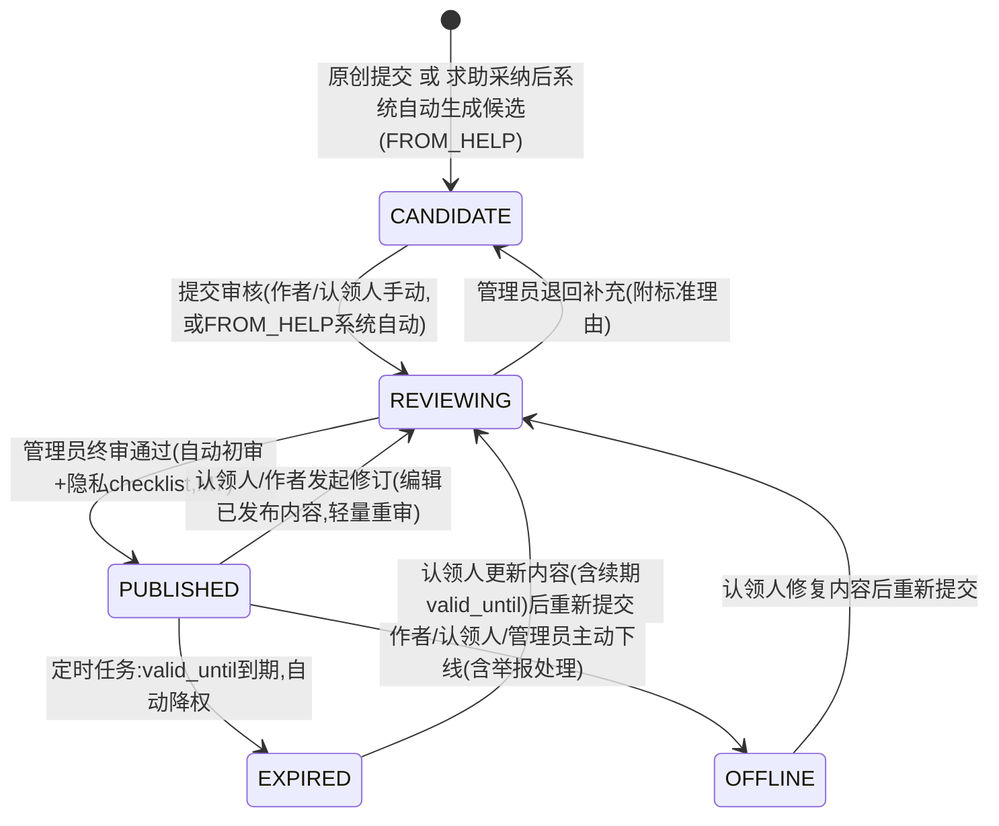

# 03 模块 M3 经验知识库 详细设计

> ⚠️ 本文为 v3 设计基线。实现已按 **v3.1 reconcile** 收敛，字段/接口/状态机差异**以 `backend/src/main/resources/schema.sql` 与 `docs/impl/00c_静态审查报告.md` 第五节为准**；本文与实现冲突处以后者为权威。见 [[09_设计修订说明]]。

> 对齐基线：[[00_总体架构与技术设计]]（技术选型 §1、全局数据模型 §3、全局API规范 §4、角色与权限矩阵 §5、界面清单 §6、命名与术语表 §9）。本文件字段、接口、角色代码均与地基文档严格一致，不重复定义地基已裁决的全局规则，仅在必要处引用。

---

## 1. 模块职责与边界

M3 负责全平台**结构化经验知识资产**的沉淀、治理与检索：知识条目（`knowledge_entry`）的 CRUD、五分类（生活/课程/竞赛/考研就业/公共信息导航）、基于 MySQL FULLTEXT（ngram 分词）的全文搜索、`CANDIDATE→REVIEWING→PUBLISHED→EXPIRED/OFFLINE` 生命周期状态机、三态评价与纠错（`knowledge_feedback`：USEFUL/OUTDATED/NEED_UPDATE）、时效与适用范围标注（`valid_until`/`applicable_scope`）、来源标注（原创 `ORIGINAL` / 求助采纳转化 `FROM_HELP`）、内容认领更新机制、过期与差评驱动的自动降权定时任务。M3 是"知识沉淀闭环"的终点站与复用起点：接收 M4 采纳后生成的知识候选，产出可被 M6 成长时间线节点只读引用、被全局搜索命中的可信内容资产。

**明确不做**：
- 不做知识候选的人工审核动作本身（审核队列呈现、批量通过/退回、隐私 checklist 属 M7；M3 只提供 `knowledge_entry` 数据与 `KnowledgeEntryService` 的审核回调方法，与 M1 `AuthApplicationService` 供 M7 调用的模式一致）。
- 不做求助单、回答、追问的产生与展示（那是 M4 的职责）；M3 只在 M4"采纳"动作发生时被动接收一次同事务内的服务调用，通过 `source_help_id` 只读引用 `help_ticket`，不复制其内容。
- 不做时间线节点对知识条目的引用维护（M6 的 `timeline_node_ref` 只存 `(ref_type='KNOWLEDGE_ENTRY', ref_id)`，M3 只提供只读的摘要查询方法，不感知自己被哪些节点引用了多少次，仅提供计数查询接口供 M6/统计调用）。
- **不自存高时效信息**：报到时间、选课截止、政策公告等一律不作为常规经验正文入库，只能以 `category=PUBLIC_INFO_NAV`（公共信息导航）类目 + 强制外链官方来源的形式呈现，正文仅作导航说明，绝不承载会过期的具体时间/数值本身（详见 §6.1）。
- 不做贡献者激励标识、"已帮助 N 位学弟学妹"计数、荣誉证明的展示与归档（该激励机制归入 M2/M7，M3 仅在详情页只读引用其展示字段，不重复存储）。
- 不做真实的官方外链可达性巡检（如自动检测 404），本期只做人工填写校验，链接失效由后续三态评价的 `OUTDATED` 纠错兜底。

---

## 2. 功能需求清单

| FR编号 | 功能名 | 角色 | 输入 | 处理逻辑 | 输出 | 优先级 |
|---|---|---|---|---|---|---|
| FR-M3-01 | 创建知识条目（原创） | STUDENT/ALUMNI/ADMIN（已认证） | title、category、content、applicableScope、validUntil、externalUrl/externalSourceName（仅 PUBLIC_INFO_NAV 必填） | 校验必填项与"公共信息导航强制外链"规则（§6.1）→ 创建 `knowledge_entry`（status=CANDIDATE, source_type=ORIGINAL, author_id=当前用户, version=0） | 条目详情 | Must |
| FR-M3-02 | 采纳生成知识候选（系统内部触发） | 系统（触发方：M4 采纳动作） | help_ticket_id、help_answer_id、authorId（回答人） | M4 `AnswerService.adopt()` 同事务内直接调用 `KnowledgeEntryService.createFromHelpAdoption(...)`：组装初始内容 → 创建 `knowledge_entry`(status=CANDIDATE, source_type=FROM_HELP, source_help_id=ticketId) → 自动提交审核（§6.3） | 生成的 `entryId`，供 M4 回写 `help_answer.knowledge_entry_id` | Must |
| FR-M3-03 | 编辑知识条目 | 作者/认领人/ADMIN | id、version、更新字段 | 校验编辑权限与状态可编辑性（§6.2）→ 校验乐观锁 version → 更新；若原状态为 PUBLISHED 则视为"发起修订"直接转 REVIEWING | 条目详情 | Must |
| FR-M3-04 | 提交审核 | 作者/认领人 | id | 校验 status=CANDIDATE → REVIEWING，事务提交后发布事件供 M7 创建 `audit_task` | 状态结果 | Must |
| FR-M3-05 | 知识候选终审通过 | ADMIN | id、comment | CAS 校验 status=REVIEWING → PUBLISHED，`published_at`（首发）/`last_reviewed_at` 写入，`weight_score` 重置为 100 | 条目详情 | Must（跨 M7，见§8） |
| FR-M3-06 | 知识候选终审退回 | ADMIN | id、comment | CAS 校验 status=REVIEWING → CANDIDATE，记录 `review_comment`（标准理由模板，M7 维护） | 条目详情 | Must（跨 M7） |
| FR-M3-07 | 手动下线 | 作者/认领人/ADMIN | id、reason | 校验 status ∈ {PUBLISHED, EXPIRED} → OFFLINE（含举报处理场景，ADMIN 可强制下线任意状态） | 条目详情 | Should |
| FR-M3-08 | 内容认领更新 | STUDENT/ALUMNI（已认证） | id | 校验条目当前可认领（无人认领 / 原认领人超时未维护，§6.4）→ 写入 `claimed_by_user_id`/`claimed_at` | 条目详情 | Must |
| FR-M3-09 | 知识条目列表（分类筛选） | 全角色（含 GUEST） | category（可选）、page、size | 仅返回 PUBLISHED（登录用户额外可见本人贡献/认领的其他状态条目）→ 按 `weight_score` DESC、`published_at` DESC 排序 | 分页列表 | Must |
| FR-M3-10 | 全文搜索 | 全角色（含 GUEST） | keyword、category（可选）、page、size | MySQL FULLTEXT（ngram）`MATCH...AGAINST`，短关键词兜底 LIKE（§6.6）；按相关度+权重排序 | 分页列表（附 relevance） | Must |
| FR-M3-11 | 查看知识条目详情 | 全角色（含 GUEST） | id | 校验可见权限（非 PUBLISHED 仅作者/认领人/ADMIN 可见，否则 40011）→ `view_count`+1（节流防刷）→ 聚合三态计数 | 详情 DTO | Must |
| FR-M3-12 | 提交/更新三态评价 | STUDENT/ALUMNI/ADMIN（已认证） | id、feedbackType（USEFUL/OUTDATED/NEED_UPDATE）、comment | upsert `knowledge_feedback`（entry_id+user_id 唯一）→ 同事务原子更新 `knowledge_entry` 对应计数字段（§6.5） | 评价结果 | Must |
| FR-M3-13 | 查看三态评价统计 | 全角色（含 GUEST） | id | 返回 usefulCount/outdatedCount/needUpdateCount 与当前登录用户已提交的评价类型 | 统计 DTO | Should |
| FR-M3-14 | 我的知识贡献列表 | 作者/认领人 | status（可选）、page、size | 查询 `author_id=me OR claimed_by_user_id=me`，各状态混合展示 | 分页列表 | Should |
| FR-M3-15 | 软删除知识条目 | 作者（限非 PUBLISHED）/ADMIN | id | 作者仅可删自己贡献的非 PUBLISHED 条目；ADMIN 任意状态可删 → `deleted=1` | 操作结果 | Should |
| FR-M3-16 | 定时任务：过期自动降权 | 系统 | — | 每日扫描 `valid_until < 今天` 的 PUBLISHED 条目 → 转 EXPIRED 并降权，通知认领人/作者（§6.7） | — | Must |
| FR-M3-17 | 定时任务：三态反馈驱动降权与预警 | 系统 | — | 每日按 `outdated_count`/`need_update_count` 占比调整 `weight_score`，超阈值触发预警通知（§6.8） | — | Should |
| FR-M3-18 | 定时任务：长期未维护释放认领 | 系统 | — | 每周扫描认领超 60 天未更新的 EXPIRED/OFFLINE 条目，释放认领供他人接手（§6.9） | — | Could |

---

## 3. 数据表设计

统一约定（与地基§3一致）：所有表含 `deleted TINYINT NN DEFAULT 0`、`created_at DATETIME NN DEFAULT CURRENT_TIMESTAMP`、`updated_at DATETIME NN DEFAULT CURRENT_TIMESTAMP ON UPDATE CURRENT_TIMESTAMP`（下表省略重复书写，仅在末尾统一列出）。`knowledge_entry` 是地基§3明确点名的**可并发编辑表**，带 `version INT`（乐观锁 `@Version`）；`author_id` 兼任地基所述"内容表带 `created_by`"的语义（内容创建人即原始作者），不另设 `created_by` 字段，避免两列恒等的冗余。`knowledge_feedback` 为"一人一条、可修改"的评价记录，不加 version，其并发一致性由 `entry_id+user_id` 唯一约束 + upsert 语义保证（见§6.5），状态类更新（审核流转、认领、下线）统一用状态 CAS，不占用乐观锁字段（与 M1 `auth_application` 同一分工原则）。

### 3.1 `knowledge_entry`（知识条目）

| 字段名 | 类型 | 长度 | 约束 | 默认 | 说明 |
|---|---|---|---|---|---|
| id | BIGINT | — | PK, AUTO_INCREMENT | — | 主键 |
| title | VARCHAR | 200 | NN | — | 标题 |
| category | VARCHAR | 30 | NN | — | 枚举：`LIFE`(生活)/`COURSE`(课程)/`COMPETITION`(竞赛)/`GRAD_EXAM_EMPLOYMENT`(考研就业)/`PUBLIC_INFO_NAV`(公共信息导航) |
| content | TEXT | — | NN | — | 正文（Markdown 纯文本）；`category=PUBLIC_INFO_NAV` 时仅存导航说明（建议≤200字），不承载具体时效数值 |
| external_url | VARCHAR | 500 | — | NULL | 官方外链地址；`category=PUBLIC_INFO_NAV` 时 NN（应用层强制），其余类目必须为 NULL |
| external_source_name | VARCHAR | 100 | — | NULL | 外链官方来源名称（如"教务处教学服务中心"），配合 `external_url` 展示，规则同上 |
| applicable_scope | VARCHAR | 300 | — | NULL | 适用范围描述文本（专业/年级/方向组合，如"计算机类；2022级及以后；考研方向"）；NULL 表示通用不限 |
| valid_until | DATE | — | — | NULL | 有效期至；NULL 表示长期有效经验（不参与§6.7过期降权） |
| source_type | VARCHAR | 20 | NN | — | 枚举：`ORIGINAL`(原创)/`FROM_HELP`(求助采纳转化) |
| source_help_id | BIGINT | — | FK→help_ticket.id | NULL | `source_type=FROM_HELP` 时必填，记录来源求助单，只存 ID 不复制内容 |
| author_id | BIGINT | — | NN, FK→user.id | — | 原始贡献者（原创作者，或求助被采纳时的回答人） |
| claimed_by_user_id | BIGINT | — | FK→user.id | NULL | 当前认领更新人；NULL 表示无人认领（默认由 author 维护） |
| claimed_at | DATETIME | — | — | NULL | 认领时间 |
| status | VARCHAR | 20 | NN | `CANDIDATE` | 枚举：`CANDIDATE`/`REVIEWING`/`PUBLISHED`/`EXPIRED`/`OFFLINE`，见§4 |
| reviewer_id | BIGINT | — | FK→user.id | NULL | 最近一次审核人 |
| review_comment | VARCHAR | 500 | — | NULL | 审核意见/退回理由（支持 M7 维护的标准理由模板） |
| published_at | DATETIME | — | — | NULL | 首次发布时间（后续修订重审通过不改写此值，保留首发追溯） |
| last_reviewed_at | DATETIME | — | — | NULL | 最近一次审核通过时间（区分首发与修订） |
| view_count | INT | — | NN | 0 | 浏览量 |
| useful_count | INT | — | NN | 0 | 冗余计数（来自 `knowledge_feedback` 聚合，避免列表页实时聚合查询） |
| outdated_count | INT | — | NN | 0 | 同上，"已过时"计数 |
| need_update_count | INT | — | NN | 0 | 同上，"需更新"计数 |
| weight_score | DECIMAL | 6,2 | NN | 100.00 | 排序权重分，定时任务据时效与三态反馈动态调整（§6.7/6.8），越高越靠前 |
| version | INT | — | NN | 0 | 乐观锁（`@Version`），编辑并发保护 |

### 3.2 `knowledge_feedback`（三态评价/纠错）

| 字段名 | 类型 | 长度 | 约束 | 默认 | 说明 |
|---|---|---|---|---|---|
| id | BIGINT | — | PK, AUTO_INCREMENT | — | 主键 |
| entry_id | BIGINT | — | NN, FK→knowledge_entry.id | — | 被评价的知识条目 |
| user_id | BIGINT | — | NN, FK→user.id | — | 评价人 |
| feedback_type | VARCHAR | 20 | NN | — | 枚举：`USEFUL`(有用)/`OUTDATED`(已过时)/`NEED_UPDATE`(需更新) |
| comment | VARCHAR | 300 | — | NULL | 纠错说明/建议（`OUTDATED`/`NEED_UPDATE` 时建议填写） |

> 唯一约束 `UK(entry_id, user_id)`：每个用户对每条条目仅保留一条当前有效评价，重复提交按更新处理（upsert，见§6.5），不产生评价明细列表意义上的"多条评论"，语义上是"评价"而非论坛式留言。

---

## 4. 状态机

`knowledge_entry.status` 状态机：



**终态说明**：本状态机**无绝对终态**——`PUBLISHED` 是正常长期状态，`EXPIRED`/`OFFLINE` 均可经认领人编辑修订回到 `REVIEWING` 重新流转，这正是"内容认领更新机制"的核心诉求：过期或下线不等于报废，只是降权/隐藏，等待认领人救活。真正的记录终结通过与 `status` 正交的 `deleted` 软删标记实现（作者仅可在非 `PUBLISHED` 状态下删除自己贡献的条目；ADMIN 任意状态均可删除，如彻底违规内容），不在本状态图中体现。

---

## 5. API 接口清单

前缀 `/api/v1`；统一响应体 `{code, message, data}`；错误码分段沿用地基 §4（`1xxxx` 认证/权限、`2xxxx` 参数校验、`3xxxx` 业务规则、`4xxxx` 资源不存在、`5xxxx` 服务器错误）。本模块常用错误码：`10003` 未通过身份认证不可执行写操作（复用 M1）、`30011` 知识条目当前状态不允许该操作（如 REVIEWING 中编辑、非 REVIEWING 终审）、`30012` 该条目已被他人认领、`30013` 公共信息导航类目校验失败（未填外链 / 非该类目却填了外链）、`30014` 该来源求助单尚未采纳或已生成过候选（防重复生成）、`40011` 知识条目不存在、`40012` 来源求助单不存在。

| 方法 | 路径 | 说明 | 关键入参 | 返回 data 结构 | 所需角色 |
|---|---|---|---|---|---|
| GET | `/api/v1/knowledge-entries` | 列表 + 分类筛选 | category, status(仅ADMIN/本人生效), page, size | 分页 `{records:[KnowledgeEntryBriefDTO], total, page, size}` | 全角色（含GUEST，仅见PUBLISHED） |
| GET | `/api/v1/knowledge-entries/search` | 全文搜索（FULLTEXT ngram） | keyword(必填), category(可选), page, size | 分页（同上，附 `relevance`） | 全角色（含GUEST） |
| GET | `/api/v1/knowledge-entries/{id}` | 详情 | — | `KnowledgeEntryDTO` | 全角色（非PUBLISHED限作者/认领人/ADMIN，否则40011） |
| POST | `/api/v1/knowledge-entries` | 创建原创知识条目 | title, category, content, applicableScope, validUntil, externalUrl, externalSourceName | `KnowledgeEntryDTO` | STUDENT/ALUMNI/ADMIN |
| PUT | `/api/v1/knowledge-entries/{id}` | 编辑（含对已发布内容发起修订） | version, title, category, content, applicableScope, validUntil, externalUrl, externalSourceName | `KnowledgeEntryDTO` | 作者/认领人/ADMIN |
| DELETE | `/api/v1/knowledge-entries/{id}` | 软删除 | — | `null` | 作者(限非PUBLISHED)/ADMIN |
| PATCH | `/api/v1/knowledge-entries/{id}/submit` | 提交审核 | — | `KnowledgeEntryDTO` | 作者/认领人 |
| PATCH | `/api/v1/knowledge-entries/{id}/claim` | 认领内容更新 | — | `KnowledgeEntryDTO` | STUDENT/ALUMNI |
| PATCH | `/api/v1/knowledge-entries/{id}/offline` | 手动下线 | reason | `KnowledgeEntryDTO` | 作者/认领人/ADMIN |
| PATCH | `/api/v1/knowledge-entries/{id}/approve` | 知识候选终审通过（M7治理端调用） | comment | `KnowledgeEntryDTO` | ADMIN |
| PATCH | `/api/v1/knowledge-entries/{id}/return` | 知识候选终审退回 | comment | `KnowledgeEntryDTO` | ADMIN |
| GET | `/api/v1/knowledge-entries/mine` | 我的贡献/认领列表 | status(可选), page, size | 分页 `{records, total, page, size}` | STUDENT/ALUMNI/ADMIN |
| POST | `/api/v1/knowledge-entries/{id}/feedbacks` | 提交/更新三态评价 | feedbackType, comment | `KnowledgeFeedbackDTO` | STUDENT/ALUMNI/ADMIN |
| GET | `/api/v1/knowledge-entries/{id}/feedbacks/summary` | 查看三态评价统计 | — | `{usefulCount, outdatedCount, needUpdateCount, myFeedbackType}` | 全角色（含GUEST） |

> `approve`/`return` 两个终审接口的 Controller 挂载于 M7 管理后台路由分组，但实现直接调用本模块 `KnowledgeEntryService`（与 M1 认证终审接口同一模式）；`createFromHelpAdoption` 不作为独立 HTTP 端点暴露——它是 M4 `AnswerService.adopt()` 在同一事务内的**同进程 Java 方法调用**（见§6.3、§8），不经过网络与前端。

---

## 6. 关键算法与业务规则

### 6.1 分类与外链类目校验规则（"高时效信息不自存"红线）

```
校验规则(创建/编辑时,Service层强制,不只前端表单校验):
  IF category == 'PUBLIC_INFO_NAV':
      external_url 必填且为合法URL格式(http/https),否则 30013
      external_source_name 必填
      content 限制为导航说明性文本(前端提示≤200字,后端不做硬截断)，
        不得包含"XX月XX日截止""今年XX政策"等具体可过期数值——本期不做NLP自动检测，
        由M7审核checklist人工把关(功能修改方案定义的"三秒可判断"隐私checklist可并行扩展一条时效checklist)
      valid_until 允许为空(链接本身持续指向官方最新页面，系统不对链接内容的时效负责)
  ELSE (LIFE / COURSE / COMPETITION / GRAD_EXAM_EMPLOYMENT):
      external_url、external_source_name 必须为空，否则 30013("非公共信息导航类目不可填写外链")
      valid_until 建议但不强制填写：学习方法/备考经验/通用避坑类可长期有效留空；
        若内容明显具有"本学期""今年"等时间敏感表述，应由作者改投 PUBLIC_INFO_NAV 类目，
        M7 审核环节对此类误分类一律退回(review_comment 提示"该内容属高时效信息，请改投公共信息导航并附官方链接")
```

### 6.2 编辑与"发起修订"规则

```
update(id, userId, version, fields):
  entry = findById(id)
  校验 userId ∈ {entry.author_id, entry.claimed_by_user_id} 或 role=ADMIN，否则 40301(无权限)
  校验 entry.version == version，否则 40901(乐观锁冲突，提示前端刷新重试)
  IF entry.status == 'REVIEWING':
      拒绝，返回 30011("审核排队中不可编辑，请等待审核结果或联系管理员")
  ELIF entry.status == 'CANDIDATE':
      更新字段，status 保持 CANDIDATE，version+1
  ELIF entry.status IN ('EXPIRED', 'OFFLINE'):
      更新字段，status 保持不变(仍需调用 submit 接口才进入 REVIEWING)，version+1
  ELIF entry.status == 'PUBLISHED':
      更新字段并立即置 status='REVIEWING'（"修订"视为轻量重审，不回退到CANDIDATE从头排队）
      标记 review_kind=REVISION（区别于 review_kind=NEW，供M7审核队列展示区分"新候选"与"内容修订"）
      version+1
      // 修订提交后该条目短暂退出PUBLISHED检索范围(status变为REVIEWING即不在搜索/列表命中范围内)，
      // 符合"宁缺勿错"的可信度优先原则；课程项目范围内不做新旧内容并行展示的影子副本
```

### 6.3 求助采纳生成知识候选（与 M4 的跨模块协作）

```
// 由 M4 的 HelpAnswerService.adopt(ticketId, answerId) 在同一个 @Transactional 方法内
// 以 Java 方法直接调用（进程内调用，非HTTP，事务传播级别 REQUIRED 复用外层事务）：
KnowledgeEntryService.createFromHelpAdoption(ticketId, answerId, authorId=回答人ID):
  1. 校验 ticketId 对应求助单存在且该 answerId 已被标记采纳，否则 40012
  2. 校验不存在 source_help_id=ticketId 的知识条目（一个求助单只生成一条候选），否则 30014
  3. 组装初始 content = 回答的"适用前提/操作步骤/注意事项"结构化字段拼接
     （只读取M4的AnswerDTO，不修改M4数据）
  4. 创建 knowledge_entry(
       status=CANDIDATE, source_type=FROM_HELP, source_help_id=ticketId, author_id=authorId,
       category=按求助单的问题类型标签映射的初始建议值(作者可在候选阶段修改),
       applicable_scope=按求助单专业/年级标签拼接的初始建议值)
  5. 自动调用内部 submitForReview(entryId, systemTriggered=true)
       → status=REVIEWING, review_kind=NEW_FROM_HELP
       // 采纳后自动提交审核而非停留CANDIDATE等作者二次确认，是为了减少
       // "采纳了但没人点提交"导致的候选流失，保证"求助→采纳→候选→审核→入库"闭环不空转
  6. 事务提交后发布 Spring 事件，由 M7 监听创建 audit_task(target_type=KNOWLEDGE_ENTRY)
  7. 返回 entryId，供 M4 回写 help_answer.knowledge_entry_id（只存ID，不复制内容）
```

### 6.4 内容认领机制

```
claim(entryId, userId):
  entry = findById(entryId)
  校验 userId 对应用户 role∈{STUDENT,ALUMNI} 且 auth_status=VERIFIED，否则 10003
  校验 entry.status ∈ {PUBLISHED, EXPIRED, OFFLINE}（CANDIDATE/REVIEWING阶段由作者自行维护，无需认领）
  IF entry.claimed_by_user_id IS NULL:
      允许认领
  ELIF entry.claimed_by_user_id == userId:
      幂等，仅刷新 claimed_at（视为续期维护）
  ELIF entry.status == 'EXPIRED' AND now() - entry.claimed_at > 60天:
      允许他人抢占认领（原认领人超时未维护）
  ELSE:
      拒绝，返回 30012("该条目已被他人认领")
  UPDATE claimed_by_user_id=userId, claimed_at=now() WHERE id=entryId AND claimed_by_user_id IS(旧值)  -- CAS防并发抢占冲突
  若认领人≠author，站内通知原author"你的知识条目《标题》已被XX认领维护"
```

### 6.5 三态评价 upsert 与计数原子更新

```
submitFeedback(entryId, userId, feedbackType, comment):
  校验 entry.status IN ('PUBLISHED', 'EXPIRED')（仅对曾公开过的内容开放评价），否则 30011
  existing = SELECT * FROM knowledge_feedback WHERE entry_id=? AND user_id=?
  BEGIN TRANSACTION
    IF existing 不存在:
        INSERT knowledge_feedback(entry_id, user_id, feedback_type, comment)
        UPDATE knowledge_entry SET {feedbackType对应计数列} = {计数列}+1 WHERE id=entryId  -- SQL级+1，非"读出再写回"
    ELSE IF existing.feedback_type != feedbackType:
        UPDATE knowledge_feedback SET feedback_type=?, comment=? WHERE id=existing.id
        UPDATE knowledge_entry SET {旧类型计数列}={旧类型计数列}-1, {新类型计数列}={新类型计数列}+1 WHERE id=entryId
    ELSE:
        UPDATE knowledge_feedback SET comment=? WHERE id=existing.id   -- 同类型仅更新纠错说明
  COMMIT
  返回最新 KnowledgeFeedbackDTO
```

### 6.6 FULLTEXT（ngram）全文搜索

```sql
-- DDL（初始化脚本执行一次，MySQL 8.0 InnoDB）：
ALTER TABLE knowledge_entry
  ADD FULLTEXT INDEX ft_title_content (title, content) WITH PARSER ngram;
-- my.cnf 需设置 ngram_token_size=2（适配中文双字切分，默认最小2字，需重启MySQL生效）

-- 查询（MyBatis-Plus 自定义 SQL）：
SELECT *, MATCH(title, content) AGAINST(#{keyword} IN NATURAL LANGUAGE MODE) AS relevance
FROM knowledge_entry
WHERE deleted = 0 AND status = 'PUBLISHED'
  AND (#{category} IS NULL OR category = #{category})
  AND MATCH(title, content) AGAINST(#{keyword} IN NATURAL LANGUAGE MODE)
ORDER BY relevance DESC, weight_score DESC, published_at DESC
LIMIT #{size} OFFSET #{offset}

-- 短关键词兜底：keyword长度<2时ngram可能零匹配，退化为仅对title做LIKE匹配
--（不对content做LIKE，避免全表扫描性能问题）：
SELECT * FROM knowledge_entry
WHERE deleted=0 AND status='PUBLISHED' AND title LIKE CONCAT('%', #{keyword}, '%')
ORDER BY weight_score DESC, published_at DESC
```

### 6.7 定时任务：过期自动降权（每日）

```
@Scheduled(cron = "0 30 2 * * ?")
scanExpiredEntries():
  FOR entry IN SELECT id, claimed_by_user_id, author_id, title FROM knowledge_entry
               WHERE deleted=0 AND status='PUBLISHED'
                 AND valid_until IS NOT NULL AND valid_until < CURDATE():
      affected = UPDATE knowledge_entry SET status='EXPIRED', weight_score = weight_score * 0.3
                 WHERE id=entry.id AND status='PUBLISHED'   -- CAS，防止与其他并发操作重复处理
      IF affected == 1:
          notify(entry.claimed_by_user_id ?: entry.author_id,
                 "你贡献/认领的知识条目《" + entry.title + "》已过期，建议更新后重新提交审核")
          log("knowledge_entry {id} expired by valid_until, weight decayed")  -- 定时任务日志需可追溯
```

### 6.8 定时任务：三态反馈驱动降权与预警（每日）

```
@Scheduled(cron = "0 0 3 * * ?")
scanFeedbackDrivenWeight():
  FOR entry IN SELECT * FROM knowledge_entry WHERE deleted=0 AND status IN ('PUBLISHED', 'EXPIRED'):
      total = entry.useful_count + entry.outdated_count + entry.need_update_count
      IF total >= 3:
          outdatedRatio = entry.outdated_count / total
          IF outdatedRatio >= 0.5:
              newWeight = GREATEST(entry.weight_score * 0.6, 10)
              notify(entry.claimed_by_user_id ?: entry.author_id,
                     "《" + entry.title + "》收到较多\"已过时\"反馈，建议核实更新")（每条目每日至多一次，防骚扰）
          ELSE IF entry.need_update_count >= 3:
              newWeight = GREATEST(entry.weight_score * 0.8, 20)
          ELSE:
              newWeight = LEAST(entry.weight_score * 1.02, 100)  -- 无负面反馈时权重缓慢恢复上限
      ELSE:
          newWeight = LEAST(entry.weight_score * 1.02, 100)
      UPDATE knowledge_entry SET weight_score = newWeight WHERE id = entry.id
```

### 6.9 定时任务：长期未维护释放认领（每周）

```
@Scheduled(cron = "0 0 4 ? * MON")
releaseStaleClaims():
  UPDATE knowledge_entry
  SET claimed_by_user_id = NULL, claimed_at = NULL
  WHERE deleted=0 AND status IN ('EXPIRED', 'OFFLINE')
    AND claimed_by_user_id IS NOT NULL
    AND claimed_at < NOW() - INTERVAL 60 DAY
  -- 释放后该条目重新开放给任意认证用户认领（见§6.4），避免"占坑不维护"
```

---

## 7. 界面设计

### P08 知识库列表 + 搜索（角色 全，归属 M3）

- **布局要素**：
  - 顶部继承首页 P03 仪表盘的双圈过滤（`scene=LIFE|STUDY`）作为进入时的默认分类倾向，但知识库本身横跨双圈，进入后可手动切换/清除该继承过滤。
  - 搜索栏：关键字输入框（全文搜索）+ 分类下拉（生活/课程/竞赛/考研就业/公共信息导航/全部）+ "仅看长期有效"过滤开关（排除 EXPIRED）。
  - 结构化分类导航（**非信息流瀑布**）：默认按分类 Tab + `weight_score`/发布时间排序展示 PUBLISHED 列表；每条卡片展示标题、分类标签、来源标识（原创 / 来自求助采纳）、适用范围摘要、时效状态（长期有效 / 有效期至XX / 已过期灰化提示）、三态评价小计图标。
  - `category=PUBLIC_INFO_NAV` 卡片带"外链"视觉标识。
  - "我的贡献"入口（登录用户可见，跳转 §5 `mine` 接口对应的管理列表）。
  - 分页/加载更多。
- **关键交互**：分类切换与关键字搜索联动同一列表，不额外弹窗；已过期条目仍展示但置灰 + "已过期，认领更新"按钮（未认领时显示）；EXPIRED/OFFLINE 条目默认不进入公共列表（仅通过"我的贡献"或作者/认领人/ADMIN 直接访问详情可见）；未认证 GUEST 可完整浏览与搜索（只读，无认领/评价按钮，hover 提示"登录后可评价/认领"）。
- **校验规则**：关键字长度≤200；分类必须是枚举值之一；page/size 边界校验（size≤50）。
- **跳转去向**：点击条目卡片 → P09；点击"我的贡献" → 我的贡献管理列表（复用 P09 编辑表单）；`PUBLIC_INFO_NAV` 卡片外链图标 → 新窗口跳转 `external_url`。
- **负责人**：[占位]

### P09 知识条目详情（三态评价/纠错）（角色 全，归属 M3）

- **布局要素**：
  - 头部：标题、分类标签、来源标识（原创贡献者昵称 / "源自求助单#XX采纳，回答人XX"，可跳 M4 求助单详情摘要）、时效提示条（长期有效 / 有效期至XX / ⚠已过期建议核实）、适用范围说明、认领状态（未认领显示"我要认领维护"按钮；已认领显示认领人昵称+认领时间）。
  - 正文内容区（Markdown 渲染）；若 `category=PUBLIC_INFO_NAV` 则展示"前往官方页面查看最新信息"大按钮 + `external_url`/`external_source_name` + 简短导航说明，不展示大段正文。
  - 三态评价区：USEFUL/OUTDATED/NEED_UPDATE 三个按钮 + 各自计数，已评价高亮当前用户选择；点击 OUTDATED/NEED_UPDATE 展开纠错说明输入框（`comment`）。
  - 若作者/认领人/ADMIN 查看非 PUBLISHED 状态：显示状态条（CANDIDATE/REVIEWING/EXPIRED/OFFLINE）与对应操作按钮（提交审核/编辑/下线）。
  - 只读展示"该知识被 N 个成长时间线节点引用"（调用 M6 提供的只读计数接口，不在本页做业务操作）。
- **关键交互**：三态评价单选、可切换但不支持撤销（课程范围内简化）；未登录/未认证用户点击评价或认领按钮 → 提示登录并跳转 P01；`PUBLIC_INFO_NAV` 的"前往官方页面"点击计入与 `view_count` 同一统计口径。
- **校验规则**：纠错说明 `comment` ≤300字；三态互斥单选。
- **跳转去向**：认领成功 → 留在本页刷新状态；编辑 → 复用创建表单组件的编辑态；"前往官方页面" → 外部新窗口；时间线引用提示 → P16（Could，可反查跳转）。
- **负责人**：[占位]

> P08/P09 均遵守"仪表盘化、无信息流"纪律：列表页以分类结构 + 搜索为主入口，不做纯时间倒序的无差别信息流；已过期/被判定过时的内容降权而非消失，配合认领机制引导"修复"而非"刷新"。

---

## 8. 与其他模块的接口

**M3 依赖谁**：
- M1：`UserService.isVerified(userId)`/`getRole(userId)` 校验创建/编辑/认领/评价等写操作前置条件；`UserService.getById` 获取作者/认领人的昵称/头像摘要供详情页展示（贡献者激励标识、"已帮助N位学弟学妹"计数属 M2/M7，M3 只读引用，不重复存储）。
- M4：`help_ticket`/`help_answer` 的采纳事件触发 `KnowledgeEntryService.createFromHelpAdoption(...)`（§6.3）；详情页"源自求助单#XX"的跳转摘要依赖 `HelpTicketService.getBrief(ticketId)`。
- 全局 `notification`：认领提醒、过期提醒、反馈预警通知由 M3 触发插入，展示/已读态维护属全局/M7。

**被谁依赖**（只读依赖 `entryId`/`status`/`category`，不直接查表，统一走 Service）：
- M4：`AnswerService.adopt()` 调用本模块 `createFromHelpAdoption` 生成候选，并将返回的 `entryId` 回写 `help_answer.knowledge_entry_id`（只存ID）。
- M6：`timeline_node_ref` 以 `(ref_type='KNOWLEDGE_ENTRY', ref_id=knowledge_entry.id)` 只读引用已发布知识条目；渲染节点详情时调用 `KnowledgeEntryService.getBrief(id)` 获取标题/摘要，不复制内容。
- M7：知识候选审核队列依赖 `pageForReview`/`approve`/`returnToCandidate`；举报处理依赖 `offline` 强制下线。
- 全局搜索/首页仪表盘：仅调用本模块 `search`/`list` 只读聚合展示，不直接查表。

**对外暴露的 Service 方法签名（Java）**：

```java
public interface KnowledgeEntryService {
    KnowledgeEntryDTO create(Long authorId, CreateKnowledgeEntryRequest request);
    KnowledgeEntryDTO createFromHelpAdoption(Long helpTicketId, Long helpAnswerId, Long authorId); // 供 M4 采纳时调用
    KnowledgeEntryDTO getById(Long id, Long viewerUserId);
    KnowledgeEntryBriefDTO getBrief(Long id); // 供 M6/搜索聚合等轻量只读引用
    PageResult<KnowledgeEntryBriefDTO> list(KnowledgeEntryQuery query);
    PageResult<KnowledgeEntryBriefDTO> search(String keyword, String category, PageRequest page);
    PageResult<KnowledgeEntryDTO> pageForReview(KnowledgeEntryQuery query); // 供 M7 审核队列调用
    PageResult<KnowledgeEntryDTO> pageMine(Long userId, String status, PageRequest page);
    KnowledgeEntryDTO update(Long id, Long userId, Integer version, UpdateKnowledgeEntryRequest request);
    KnowledgeEntryDTO submitForReview(Long id, Long userId);
    KnowledgeEntryDTO approve(Long id, Long reviewerId, String comment);          // 供 M7 终审通过调用
    KnowledgeEntryDTO returnToCandidate(Long id, Long reviewerId, String comment); // 供 M7 退回调用
    KnowledgeEntryDTO claim(Long id, Long userId);
    KnowledgeEntryDTO offline(Long id, Long operatorId, String reason);
    void delete(Long id, Long operatorId);
    boolean existsPublished(Long id);
    long countByRef(Long entryId); // 供 M6 展示"被N个时间线节点引用"
}

public interface KnowledgeFeedbackService {
    KnowledgeFeedbackDTO submitFeedback(Long entryId, Long userId, FeedbackType type, String comment);
    FeedbackSummaryDTO getSummary(Long entryId, Long viewerUserId);
}
```

---

## 9. 编码实现要点

**Controller**：
- `KnowledgeEntryController`：`list`/`search`/`{id}`（查）/`create`/`update`/`delete`/`submit`/`claim`/`offline`/`mine`。
- `KnowledgeFeedbackController`（或作为 `KnowledgeEntryController` 的子路径方法）：`{id}/feedbacks`（提交/更新）、`{id}/feedbacks/summary`。
- 终审两个接口（`approve`/`return`）挂在 M7 的 `AdminKnowledgeEntryController`，Controller 归属 M7 代码目录但复用 M3 的 `KnowledgeEntryService` Bean，与 M1 认证终审接口同一模式。

**Service**：
- `KnowledgeEntryServiceImpl`：CRUD、状态机流转（§4/§6.2）、认领（§6.4）、来源转化（§6.3）。
- `KnowledgeFeedbackServiceImpl`：upsert + 计数联动（§6.5），直接注入 `KnowledgeEntryMapper` 做原子 `SET count=count+1` 的 UPDATE，不做"读出再写回"以避免并发覆盖。
- `ExternalLinkValidator`：`category=PUBLIC_INFO_NAV` 强制外链规则校验（§6.1），Service 层强制，防止绕过前端表单破坏"高时效信息不自存"治理红线。
- `KnowledgeEntryWeightScheduler`：`@Scheduled` 定时任务所在类（§6.7/6.8/6.9），与 CRUD Service 职责分离，独立可测试。

**Mapper**：`KnowledgeEntryMapper`、`KnowledgeFeedbackMapper`，均继承 MyBatis-Plus `BaseMapper`，启用逻辑删除（`deleted`）；`KnowledgeEntryMapper` 自定义 XML/注解 SQL 实现 FULLTEXT 查询（§6.6）与状态 CAS 更新。

**事务边界**：
- `create`/`update`：单事务，`update` 依赖 MyBatis-Plus `@Version` 注解自动做乐观锁冲突检测（`OptimisticLockException` 转 40901）。
- `submitForReview`：事务内更新 `status`；事务提交后通过 `@TransactionalEventListener(phase = AFTER_COMMIT)` 发布事件，由 M7 监听创建 `audit_task`，避免 M3 直接写 M7 的 Mapper（与 M1 `AuthApplicationSubmittedEvent` 同一解耦模式）。
- `createFromHelpAdoption`：由 M4 `AnswerService.adopt()` 在同一 `@Transactional` 方法内以 Java 直接调用（事务传播级别 `REQUIRED` 复用外层事务），保证"采纳成功"与"候选生成"要么同时成功要么同时回滚；内部复用 `submitForReview` 的私有逻辑。
- `submitFeedback`：单事务内完成 `knowledge_feedback` upsert 与 `knowledge_entry` 计数字段的原子更新（§6.5）。
- `approve`/`returnToCandidate`/`offline`/`claim`：均用状态 CAS（`UPDATE ... WHERE id=? AND status=期望前置状态`），影响行数=0 时返回 `30011`/`30012`，防止并发重复操作（与 M1 审核类接口一致模式）。

**并发控制**：内容编辑走 `knowledge_entry.version` 乐观锁；审核流转（submit/approve/return/offline）与认领（claim）走状态 CAS，二者分工与 M1 完全一致——"内容编辑用乐观锁，状态流转用 CAS"。

**文件上传**：本模块不涉及独立文件上传；正文为纯文本 Markdown，若需配图复用全局图片上传组件，`content` 内以 Markdown 图片语法引用 URL，本期不做设计。

**定时任务**（`@Scheduled`，单机 cron 即可，符合地基单体部署技术选型，无需分布式锁）：
1. 过期自动降权扫描（每日 02:30）——见§6.7。
2. 三态反馈驱动降权与预警扫描（每日 03:00）——见§6.8。
3. 长期未维护释放认领（每周一 04:00）——见§6.9。

**其他实现要点**：
- FULLTEXT 索引 DDL 纳入初始化 SQL 脚本；`ngram_token_size=2` 需在 MySQL 配置文件设置（需重启生效），README 需注明部署前置条件。
- `weight_score` 用 `DECIMAL(6,2)` 而非 `FLOAT`，避免多轮乘法降权累积浮点误差影响排序稳定性。
- `category=PUBLIC_INFO_NAV` 的时效红线校验在 Service 层（`ExternalLinkValidator`）而非仅前端表单，防止越权 API 调用绕过治理规则。
