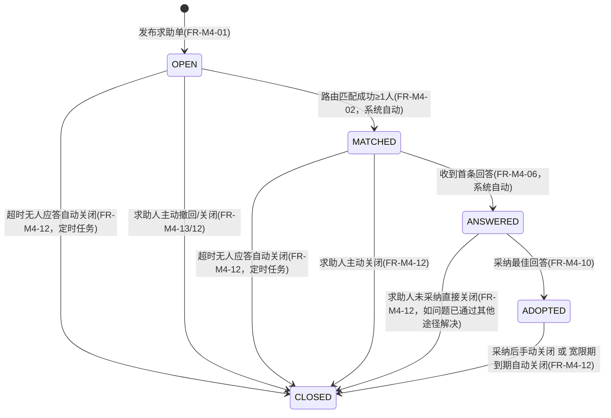

# 04 模块 M4 结构化求助 详细设计

> ⚠️ 本文为 v3 设计基线。实现已按 **v3.1 reconcile** 收敛，字段/接口/状态机差异**以 `backend/src/main/resources/schema.sql` 与 `docs/impl/00c_静态审查报告.md` 第五节为准**；本文与实现冲突处以后者为权威。见 [[09_设计修订说明]]。

> 对齐基线：[[00_总体架构与技术设计]]（技术选型 §1、全局数据模型 §3、全局API规范 §4、角色与权限矩阵 §5、界面清单 §6、核心闭环时序 §7、命名与术语表 §9）。本文件字段、接口、角色代码均与地基文档严格一致；`tag`/`user`/`student_profile`/`alumni_profile` 等他模块表只读引用其既有定义（详见 [[01_M1_用户与认证_详细设计]] [[02_M2_成长画像与校友路径_详细设计]]），不重复设计。
>
> **本模块是全系统"核心闭环"的枢纽**（地基 §7"系统灵魂"演示链路：发求助→路由通知→回答→采纳→生成候选→审核入库），实现优先级最高，编码顺序上应最先打通。

---

## 1. 模块职责与边界

M4 负责结构化求助的完整生命周期：在校生（主要场景）或已认证毕业生按"专业/年级/问题类型/目标方向"发布求助单 `help_ticket`；系统在求助单创建时自动执行**求助-校友路由匹配**，按标签打分选出 TopK 对口校友/学长写入 `help_route` 并产生站内通知，保证"发布后短时间内至少触发一次匹配通知"；符合条件的用户以"前提/步骤/注意事项"三段式模板提交 `help_answer`；求助人可在限次范围内对某条回答发起 `help_followup` 追问，回答人可回复；求助人从多条回答中采纳一条最佳回答，触发知识候选生成（调用 M3，`status=CANDIDATE`，`source=FROM_HELP`）；求助单按 `OPEN→MATCHED→ANSWERED→ADOPTED→CLOSED` 状态机流转直至归档。

**明确不做**：
- 不做知识候选的审核、发布、三态评价（M3/M7）——M4 只负责在采纳时刻调用 M3 暴露的创建方法并传入原始素材，候选此后的生命周期与 M4 无关。
- 不做成长标签、专业/年级/问题类型标签本身的增删维护（`tag` 体系维护归属 M7，M4 只读引用，见 3.0）；不做校友画像、路径卡、贡献者计数的存储（M2），M4 仅在采纳发生时调用 M2 暴露的计数方法。
- 不做认证与角色鉴权本身（M1），M4 只调用 `isVerified`/`getRole` 作为发布/回答前置校验。
- 不做站内通知中心的呈现、已读列表、订阅偏好设置界面（全局/P17，归属全局与 M7），M4 只作为 `notification` 表的主要生产者之一负责写入，不负责其展示端。
- 不做举报受理与人工下架复核流程本身（M7），M4 仅暴露 `hideTicket`/`restoreTicket` 供 M7 调用（对齐 M2 `hidePathCardByReport` 的既有模式）。

---

## 2. 功能需求清单

| FR编号 | 功能名 | 角色 | 输入 | 处理逻辑 | 输出 | 优先级 |
|---|---|---|---|---|---|---|
| FR-M4-01 | 发布求助单 | STUDENT（主）/ALUMNI/ADMIN | 问题类型标签、目标方向标签（可选）、标题、详情内容 | 校验发布人 `isVerified`；专业/年级字段从发布人档案（M2）只读快照写入（ALUMNI 无在读年级，`grade_tag_id` 置空）；写入 `help_ticket(status=OPEN)`；同步触发 FR-M4-02 | 求助单详情 | Must |
| FR-M4-02 | 求助-校友路由匹配（系统自动） | 系统 | 新建/重试的求助单 | 按 6.2 算法构建候选池→打分→排序取TopK→写 `help_route`→逐条产生 `notification`；成功匹配≥1人则 `status: OPEN→MATCHED` | 路由记录 + 通知 | Must |
| FR-M4-03 | 路由重试与兜底升级（定时任务） | 系统 | 全部 `status∈{OPEN,MATCHED}` 且长时间零应答的求助单 | 每30分钟扫描；按 6.5 规则逐级放宽候选池并追加新一批 `help_route`（`batch_no`+1），避免同一人被重复通知 | 新增路由记录 + 通知 | Should |
| FR-M4-04 | 浏览求助单列表（本专业高频，仪表盘化） | 登录用户 | 问题类型筛选、状态筛选、专业（默认本人专业）、排序方式 | 默认按本人 `major_tag_id` 过滤；聚合"本专业待解决数/已解决数/平均响应时长"统计卡；结构化表格列表分页返回 | 统计卡 + 分页列表 | Must |
| FR-M4-05 | 查看求助单详情 | 登录用户 | ticketId | 返回求助单信息 + 全部 `help_answer`（含各自 `help_followup` 线程）+ 当前用户可执行操作位（是否可答/可追问/可采纳） | 详情聚合 VO | Must |
| FR-M4-06 | 提交模板化回答 | STUDENT/ALUMNI/ADMIN（须认证） | precondition、steps[]、cautions | 校验求助单 `status∈{OPEN,MATCHED,ANSWERED}`；校验同一人未对该单重复作答（`uk_ticket_responder`）；写入 `help_answer`；`status: MATCHED→ANSWERED`（若首条回答）；通知求助人 | 回答详情 | Must |
| FR-M4-07 | 编辑本人回答 | 回答人 | answerId、precondition/steps/cautions | 校验 `is_adopted=0` 且本人属主；覆盖更新 | 回答详情 | Should |
| FR-M4-08 | 提交追问（限次） | 求助人 | answerId、content | 校验当前用户是该单 `asker_id`；校验该 answer 下 `sender_role=ASKER` 的追问计数 < `MAX_FOLLOWUP_PER_ANSWER`（见 6.3）；写入 `help_followup(sender_role=ASKER)`；通知回答人 | 追问详情 | Must |
| FR-M4-09 | 回复追问 | 回答人 | answerId、content | 校验当前用户是该 answer 的 `responder_id`；写入 `help_followup(sender_role=RESPONDER)`（不计入限次）；通知求助人 | 追问详情 | Must |
| FR-M4-10 | 采纳最佳回答 | 求助人 | answerId | 校验当前用户是 `asker_id` 且求助单 `status=ANSWERED`；`help_answer.is_adopted=1`；`help_ticket.adopted_answer_id` 写入；`status: ANSWERED→ADOPTED`；触发 FR-M4-11；调用 M2 计数方法 | 采纳结果 | Must |
| FR-M4-11 | 采纳后生成知识候选（调用M3） | 系统 | 已采纳的 answerId | 事务提交后异步调用 M3 `createCandidateFromHelp`，`status=CANDIDATE`，`source=FROM_HELP`，来源回填 `source_help_id=ticket_id` | 知识候选ID（异步） | Must |
| FR-M4-12 | 关闭求助单 | 求助人 / 系统 | ticketId、关闭原因 | 手动：`status∈{OPEN,MATCHED,ANSWERED,ADOPTED}→CLOSED`；系统：超时无应答或采纳后宽限期到期自动关闭（见 6.5） | 新状态 | Must |
| FR-M4-13 | 撤回求助单 | 求助人 | ticketId | 仅 `status∈{OPEN,MATCHED}` 且暂无 `help_answer` 时允许；软删除 | 操作结果 | Could |

---

## 3. 数据表设计

### 3.0 依赖的全局/他模块表（只读引用，不在本模块重复定义）

| 表名 | 归属 | 本模块用途 |
|---|---|---|
| `user` | M1 | `asker_id`/`responder_id`/`matched_user_id`/通知 `user_id` 的外键指向 |
| `tag` | 全局（详见 M2 文档 3.3） | 本模块引用 `tag_type∈{MAJOR, GRADE, QUESTION_TYPE, GROWTH}` 四类只读枚举值 |
| `student_profile` / `alumni_profile` | M2 | 发布求助单时快照专业/年级来源；不在本模块修改 |

### 3.1 help_ticket（求助单）

| 字段名 | 类型(MySQL) | 长度 | 约束 | 默认 | 说明 |
|---|---|---|---|---|---|
| id | BIGINT | — | PK | AUTO_INCREMENT | 主键 |
| asker_id | BIGINT | — | FK→user.id, NN | — | 发布人 |
| asker_role_snapshot | ENUM | — | NN | — | 发布时角色快照，取值：`STUDENT`、`ALUMNI`、`ADMIN`（用于路由匹配排除逻辑与候选池分支） |
| major_tag_id | BIGINT | — | FK→tag.id, NN | — | 专业标签（`tag.tag_type=MAJOR`），发布时从发布人档案快照写入，此后不随本人档案变更而改写 |
| grade_tag_id | BIGINT | — | FK→tag.id, NULL | — | 年级标签（`tag.tag_type=GRADE`），发布时按发布人 `student_profile.grade_level` 映射快照写入；`asker_role_snapshot=ALUMNI` 时为 NULL（毕业生无在读年级） |
| question_type_tag_id | BIGINT | — | FK→tag.id, NN | — | 问题类型标签（`tag.tag_type=QUESTION_TYPE`） |
| target_direction_tag_id | BIGINT | — | FK→tag.id, NULL | — | 目标方向标签（`tag.tag_type=GROWTH`，如"考研""考公""求职""出国""创业"等成长方向），可选 |
| title | VARCHAR | 100 | NN | — | 标题 |
| content | TEXT | — | NN | — | 问题详情 |
| status | ENUM | — | NN | OPEN | 状态，取值：`OPEN`(待匹配/待回答)、`MATCHED`(已路由匹配，等待回答)、`ANSWERED`(已有回答)、`ADOPTED`(已采纳最佳回答)、`CLOSED`(已关闭/归档) |
| close_reason | ENUM | — | NULL | — | 关闭原因，取值：`ADOPTED_DONE`(采纳后正常关闭)、`ASKER_CANCELLED`(求助人主动放弃)、`TIMEOUT_NO_ANSWER`(超时无人应答自动关闭)、`RESOLVED_ELSEWHERE`(已通过其他途径解决) |
| adopted_answer_id | BIGINT | — | FK→help_answer.id, NULL | — | 已采纳回答的冗余缓存字段，避免详情页每次 `WHERE is_adopted=1` 回表查询 |
| view_count | INT | — | NN | 0 | 浏览计数（供列表"高频"排序参考） |
| version | INT | — | NN | 1 | 乐观锁版本号：状态流转存在"求助人手动操作"与"定时任务自动关闭/重试路由"并发写入同一行的场景，需 CAS 保护 |
| deleted | TINYINT | — | NN | 0 | 软删除 |
| created_at | DATETIME | — | NN | CURRENT_TIMESTAMP | 创建时间 |
| updated_at | DATETIME | — | NN | CURRENT_TIMESTAMP | 更新时间 |

索引：`idx_major_status(major_tag_id, status)` 供 P10 "本专业高频"列表过滤；`idx_question_type(question_type_tag_id)` 供匹配算法与统计。

### 3.2 help_answer（回答，三段式模板）

| 字段名 | 类型(MySQL) | 长度 | 约束 | 默认 | 说明 |
|---|---|---|---|---|---|
| id | BIGINT | — | PK | AUTO_INCREMENT | 主键 |
| ticket_id | BIGINT | — | FK→help_ticket.id, NN | — | 所属求助单 |
| responder_id | BIGINT | — | FK→user.id, NN | — | 回答人 |
| responder_role_snapshot | ENUM | — | NN | — | 回答时角色快照，取值：`STUDENT`、`ALUMNI`、`ADMIN`（供前端渲染"校友标识"：`ALUMNI`必标；`STUDENT`若年级高于求助单 `grade_tag_id` 对应年级则标"学长/学姐"） |
| precondition | TEXT | — | NN | — | 【三段式-前提】适用前提/背景条件 |
| steps | JSON | — | NN | — | 【三段式-步骤】有序步骤数组，如 `["第一步...","第二步..."]` |
| cautions | TEXT | — | NULL | — | 【三段式-注意事项】 |
| is_adopted | TINYINT | — | NN | 0 | 是否被采纳，0=否，1=是。同一 `ticket_id` 下至多一条为 1 |
| adopted_at | DATETIME | — | NULL | — | 采纳时间 |
| deleted | TINYINT | — | NN | 0 | 软删除 |
| created_at | DATETIME | — | NN | CURRENT_TIMESTAMP | 创建时间 |
| updated_at | DATETIME | — | NN | CURRENT_TIMESTAMP | 更新时间 |

唯一约束：`uk_ticket_responder(ticket_id, responder_id)`（同一人对同一求助单只保留一条回答，允许编辑覆盖，不允许重复提交）。索引：`idx_ticket(ticket_id)`；`idx_responder_qtype(responder_id)` 配合 `help_ticket.question_type_tag_id` 联合查询，供 6.2 算法统计"该候选人历史同类问题被采纳次数"。

### 3.3 help_followup（追问）

| 字段名 | 类型(MySQL) | 长度 | 约束 | 默认 | 说明 |
|---|---|---|---|---|---|
| id | BIGINT | — | PK | AUTO_INCREMENT | 主键 |
| ticket_id | BIGINT | — | FK→help_ticket.id, NN | — | 所属求助单（冗余存储，避免每次经 `target_answer_id` 二次 JOIN） |
| target_answer_id | BIGINT | — | FK→help_answer.id, NN | — | 追问针对的具体回答（同一求助单下不同回答各自独立追问线程） |
| sender_id | BIGINT | — | FK→user.id, NN | — | 发送人 |
| sender_role | ENUM | — | NN | — | 发送方角色，取值：`ASKER`(求助人追问)、`RESPONDER`(回答人回复)。限次校验只统计 `ASKER` |
| content | TEXT | — | NN | — | 追问/回复内容 |
| follow_up_seq | INT | — | NN | — | 序号：该 `target_answer_id` 下 `sender_role=ASKER` 的追问按提交顺序从1递增编号，用于前端展示"第N次追问"与限次提示 |
| deleted | TINYINT | — | NN | 0 | 软删除 |
| created_at | DATETIME | — | NN | CURRENT_TIMESTAMP | 创建时间 |
| updated_at | DATETIME | — | NN | CURRENT_TIMESTAMP | 更新时间 |

索引：`idx_answer(target_answer_id, created_at)` 供按时间顺序渲染追问线程与限次计数。

### 3.4 help_route（求助-校友路由匹配记录）★验收关键表

| 字段名 | 类型(MySQL) | 长度 | 约束 | 默认 | 说明 |
|---|---|---|---|---|---|
| id | BIGINT | — | PK | AUTO_INCREMENT | 主键 |
| ticket_id | BIGINT | — | FK→help_ticket.id, NN | — | 所属求助单 |
| matched_user_id | BIGINT | — | FK→user.id, NN | — | 被匹配到的候选人（校友或学长） |
| match_score | DECIMAL | (6,2) | NN | — | 匹配总分（见 6.2 打分公式），用于排序留痕与效果复盘 |
| match_reasons | JSON | — | NN | — | 匹配理由数组，如 `["专业相同","目标方向匹配","该类问题曾被采纳2次"]`，前端渲染为标签 chips |
| route_type | ENUM | — | NN | — | 候选池来源层级，取值：`SAME_MAJOR_ALUMNI`(同专业校友)、`SAME_MAJOR_SENIOR_STUDENT`(同专业高年级学长)、`FALLBACK_COLLEGE_ALUMNI`(同学院跨专业校友兜底)、`FALLBACK_PLATFORM_ALUMNI`(全平台校友兜底)、`FALLBACK_ADMIN`(管理员兜底，见 6.5) |
| batch_no | TINYINT | — | NN | 1 | 路由批次号，1=创建时即时匹配，2及以上=定时重试/升级匹配追加批次（FR-M4-03） |
| rank_no | TINYINT | — | NN | — | 本批次内按分数排序的名次（1起） |
| notify_status | ENUM | — | NN | PENDING | 通知发送状态，取值：`PENDING`、`SENT`、`FAILED` |
| notified_at | DATETIME | — | NULL | — | 通知发出时间 |
| has_responded | TINYINT | — | NN | 0 | 该候选人此后是否针对本单提交了 `help_answer`（用于路由效果统计与"响应率"复盘），由回答提交事件回写 |
| responded_at | DATETIME | — | NULL | — | 首次响应时间 |
| deleted | TINYINT | — | NN | 0 | 软删除 |
| created_at | DATETIME | — | NN | CURRENT_TIMESTAMP | 创建时间 |
| updated_at | DATETIME | — | NN | CURRENT_TIMESTAMP | 更新时间 |

唯一约束：`uk_ticket_user(ticket_id, matched_user_id)`（同一人对同一求助单只产生一条路由记录，避免重复通知同一人）。索引：`idx_ticket_batch(ticket_id, batch_no)` 供 FR-M4-03 判断是否需要升级批次。

### 3.5 notification（站内通知/订阅推送，全局表）

> 归属"全局"（见地基实体清单 #25），由 M1（认证/担保通知）、M4（求助路由/追问/采纳通知）等多方共同生产，呈现/已读态维护与通知中心（P17）归属全局与 M7。本文档给出完整字段级设计，供各触发方模块统一遵循；`type`/`ref_type` 用 `VARCHAR` 而非数据库原生 `ENUM`，便于后续新增触发方模块登记新取值而无需 `ALTER TABLE`（对齐地基 §3"所有状态/类型用后端枚举 + 数据库 VARCHAR/TINYINT"的表述）。

| 字段名 | 类型(MySQL) | 长度 | 约束 | 默认 | 说明 |
|---|---|---|---|---|---|
| id | BIGINT | — | PK | AUTO_INCREMENT | 主键 |
| user_id | BIGINT | — | FK→user.id, NN | — | 接收人 |
| type | VARCHAR | 40 | NN | — | 通知业务类型（后端枚举 + 数据库VARCHAR）。**本模块登记的取值**：`HELP_ROUTE_MATCHED`(你可能能解答一条求助)、`HELP_TICKET_ANSWERED`(你的求助收到新回答)、`HELP_FOLLOWUP_RECEIVED`(收到追问/回复)、`HELP_ANSWER_ADOPTED`(你的回答被采纳)。其余取值由各自触发模块登记（如 M1 的 `AUTH_GUARANTOR_REQUEST`） |
| ref_type | VARCHAR | 30 | NN | — | 关联对象类型。本模块取值：`HELP_TICKET`、`HELP_ANSWER` |
| ref_id | BIGINT | — | NN | — | 关联对象ID（配合 `ref_type` 定位跳转目标，即 P12） |
| title | VARCHAR | 100 | NN | — | 通知标题 |
| content | VARCHAR | 300 | NN | — | 通知摘要内容 |
| channel | ENUM | — | NN | IN_APP | 投递渠道，取值：`IN_APP`(站内通知，Must)、`PUSH`(订阅推送，Could，本期预留接口，无真实推送通道时仅记录不实际投递) |
| push_status | ENUM | — | NN | NOT_APPLICABLE | 推送渠道状态，取值：`NOT_APPLICABLE`(channel=IN_APP时)、`PENDING`、`SENT`、`FAILED` |
| is_read | TINYINT | — | NN | 0 | 是否已读 |
| read_at | DATETIME | — | NULL | — | 已读时间 |
| deleted | TINYINT | — | NN | 0 | 软删除 |
| created_at | DATETIME | — | NN | CURRENT_TIMESTAMP | 创建时间 |
| updated_at | DATETIME | — | NN | CURRENT_TIMESTAMP | 更新时间 |

索引：`idx_user_unread(user_id, is_read, created_at)` 供通知中心按未读优先、时间倒序查询。

---

## 4. 状态机

仅 `help_ticket` 存在状态流转；`help_answer`/`help_followup`/`help_route`/`notification` 无独立状态机（各自只有布尔/枚举状态位，随宿主流程一次性写入或被动更新，不构成多态流转图）。



约束：
- `OPEN→MATCHED` 与 `MATCHED→ANSWERED` 均为系统自动流转，不可人工跳过或倒退。
- 一旦进入 `ADOPTED`，`help_answer.is_adopted` 与 `help_ticket.adopted_answer_id` 同一事务内写定，不可更换已采纳回答（如需更换须先撤销采纳，本期不支持，保持状态机简单可控，对应地基"刻意不做"过度复杂化）。
- `CLOSED` 为终态，不支持 `reopen`；确需继续求助，引导用户新建求助单。
- 所有跳转在 `help_ticket.version` 乐观锁保护下执行，防止"求助人手动关闭"与"定时任务自动关闭"竞态双写。

---

## 5. API 接口清单

统一响应体 `{code, message, data}`；分页响应 `data: {records, total, page, size}`；鉴权按角色 + 资源属主（后端 `@PreAuthorize` 接口级鉴权）。

| 方法 | 路径 | 说明 | 关键入参 | 返回data结构 | 所需角色 |
|---|---|---|---|---|---|
| POST | /api/v1/help-tickets | 发布求助单 | questionTypeTagId, targetDirectionTagId?, title, content | HelpTicketVO | STUDENT/ALUMNI/ADMIN(须已认证) |
| GET | /api/v1/help-tickets | 分页浏览求助单（本专业高频，仪表盘化） | majorTagId(默认本人专业), questionTypeTagId?, status?, sortBy(LATEST\|NEARLY\_TIMEOUT\|UNANSWERED\_FIRST), page, size | {records, total, page, size, statCard:{openCount, resolvedCount, avgResponseHours}} | 登录用户 |
| GET | /api/v1/help-tickets/{id} | 求助单详情（含回答与追问线程） | — | HelpTicketDetailVO{ticket, answers:[{answer, followups[]}], myActions:{canAnswer,canFollowUp,canAdopt}} | 登录用户 |
| DELETE | /api/v1/help-tickets/{id} | 撤回求助单 | — | null | 求助人本人 |
| PATCH | /api/v1/help-tickets/{id}/close | 关闭求助单 | closeReason | {status} | 求助人本人 |
| GET | /api/v1/help-tickets/{id}/routes | 查看路由匹配记录（诊断/复盘） | — | List\<HelpRouteVO\> | 求助人本人/ADMIN |
| POST | /api/v1/help-tickets/{id}/answers | 提交模板化回答 | precondition, steps[], cautions | HelpAnswerVO | STUDENT/ALUMNI/ADMIN(须已认证) |
| PUT | /api/v1/help-answers/{id} | 编辑本人回答 | precondition, steps[], cautions | HelpAnswerVO | 回答人本人(未被采纳前) |
| POST | /api/v1/help-answers/{id}/followups | 提交追问/回复（按当前用户身份自动判定 sender_role） | content | HelpFollowupVO | 求助人本人(追问) / 回答人本人(回复) |
| GET | /api/v1/help-answers/{id}/followups | 查看某回答下的追问线程 | — | List\<HelpFollowupVO\> | 登录用户 |
| PATCH | /api/v1/help-answers/{id}/adopt | 采纳该回答为最佳回答 | — | {ticketStatus, adoptedAnswerId} | 求助人本人 |

**错误码（本模块在全局分段内的具体值）**：
- `20401` 参数校验：`questionTypeTagId`/`targetDirectionTagId` 非合法 `tag` 枚举值
- `20402` 参数校验：`steps` 为空数组或追问/回答内容超长
- `30401` 业务规则：求助单当前状态不可提交回答（如已 `ADOPTED`/`CLOSED`）
- `30402` 业务规则：该回答下追问次数已达上限（`MAX_FOLLOWUP_PER_ANSWER`）
- `30403` 业务规则：非求助人本人不可采纳/关闭/撤回该求助单
- `30404` 业务规则：非本人回答不可编辑，或该回答已被采纳不可再编辑
- `30405` 业务规则：乐观锁冲突，`version` 不匹配（并发关闭/采纳竞态）
- `40401` 资源不存在：求助单/回答/追问不存在或已删除

---

## 6. 关键算法与业务规则

### 6.1 发布求助单时的档案快照写入

```
function createHelpTicket(askerId, input):
    require userService.isVerified(askerId)                     // 前置：M1认证
    role = userService.getRole(askerId)                          // STUDENT/ALUMNI/ADMIN
    if role == STUDENT:
        profile = studentProfileService.getProfile(askerId)      // M2
        majorTagId = profile.majorTagId
        gradeTagId = gradeLevelToTagId(profile.gradeLevel)        // 按10档年级枚举映射至 tag(type=GRADE)
    else: // ALUMNI 或 ADMIN 发起求助（权限矩阵允许）
        majorTagId = alumniMajorTagIdOf(askerId)                  // 取毕业专业作为快照
        gradeTagId = null                                         // 毕业生无在读年级，不参与"学长年级差"打分维度
    validateTag(input.questionTypeTagId, type=QUESTION_TYPE)
    if input.targetDirectionTagId != null:
        validateTag(input.targetDirectionTagId, type=GROWTH)
    ticket = insert help_ticket(askerId, role, majorTagId, gradeTagId,
                                 input.questionTypeTagId, input.targetDirectionTagId,
                                 input.title, input.content, status=OPEN)
    publishEvent(HelpTicketCreatedEvent(ticket.id))               // 解耦触发 6.2，事务提交后异步执行
    return ticket
```

### 6.2 求助-校友路由匹配算法（标签打分 / 排序 / 取TopK）★验收核心

**权重常量**（可配置，默认值如下，均为 Service 层常量，非硬编码魔法数）：

| 常量 | 默认值 | 含义 |
|---|---|---|
| `W_MAJOR` | 40 | 专业相同加分 |
| `W_ALUMNI_IDENTITY` | 15 | 候选人为校友（ALUMNI）身份加分 |
| `W_GRADE_GAP` | 5 | 学长年级差每级加分（封顶3级，避免博士生匹配大一新生） |
| `W_DIRECTION` | 20 | 目标方向标签（GROWTH）命中加分 |
| `W_EXPERTISE` | 6 | 历史同问题类型被采纳次数，每次加分（封顶5次） |
| `W_TRUST` | 3 | 历史累计被采纳总次数的信任加权系数（对数缩放，防止头部用户垄断） |
| `K` | 5 | 每批次通知的TopK人数 |
| `MAX_GRADE_GAP_COUNTED` | 3 | 年级差计分上限级数 |
| `MIN_POOL_SIZE` | 3 | 候选池小于该规模即触发下一级兜底放宽 |

```
function routeHelpTicket(ticketId, batchNo=1, alreadyNotifiedUserIds=[]):
    ticket = helpTicketMapper.selectById(ticketId)

    // ── 第一步：候选池构建（分层，逐级放宽，直到达到 MIN_POOL_SIZE 或穷尽） ──
    pool = []; routeType = null
    if ticket.askerRoleSnapshot == ALUMNI:
        pool = queryVerifiedUsers(role=ALUMNI, majorTagId=ticket.majorTagId)   // M2.hasMajorTag 过滤
        routeType = SAME_MAJOR_ALUMNI
    else:
        alumniPool  = queryVerifiedUsers(role=ALUMNI, majorTagId=ticket.majorTagId)         // M2.hasMajorTag
        seniorPool  = queryVerifiedUsers(role=STUDENT, majorTagId=ticket.majorTagId,
                                          gradeLevelOf(u) > gradeLevelOf(ticket.gradeTagId)) // M2.getProfile
        pool = alumniPool ∪ seniorPool
        routeType = MIXED // 逐条记录时按各自来源分别标注 SAME_MAJOR_ALUMNI / SAME_MAJOR_SENIOR_STUDENT
    pool = pool - ticket.askerId - alreadyNotifiedUserIds     // 排除自己与已通知过的人

    if pool.size < MIN_POOL_SIZE:
        pool2 = queryVerifiedUsers(role=ALUMNI, college=collegeOf(ticket.majorTagId)) - pool - ticket.askerId - alreadyNotifiedUserIds
        pool = pool ∪ pool2; mark(pool2, FALLBACK_COLLEGE_ALUMNI)
    if pool.size < MIN_POOL_SIZE:
        pool3 = queryVerifiedUsers(role=ALUMNI) - pool - ticket.askerId - alreadyNotifiedUserIds   // 全平台校友
        pool = pool ∪ pool3; mark(pool3, FALLBACK_PLATFORM_ALUMNI)
    if pool.isEmpty():
        insert help_route(ticketId, matchedUserId=ADMIN_QUEUE_USER, routeType=FALLBACK_ADMIN,
                           matchScore=0, batchNo, rankNo=1, notifyStatus=PENDING)
        notify(ADMIN_QUEUE, type=HELP_ROUTE_MATCHED, refType=HELP_TICKET, refId=ticketId)
        return   // 极端兜底：保证"≥1次匹配通知"验收标准恒成立

    // ── 第二步：逐候选打分 ──
    for u in pool:
        score = 0; reasons = []
        if hasMajorTag(u.id, ticket.majorTagId):
            score += W_MAJOR; reasons.add("专业相同")
        if u.role == ALUMNI:
            score += W_ALUMNI_IDENTITY; reasons.add("校友身份")
        else: // 同专业高年级学长
            gap = min(gradeLevelOf(u) - gradeLevelOf(ticket.gradeTagId), MAX_GRADE_GAP_COUNTED)
            score += gap * W_GRADE_GAP; reasons.add("高年级学长")
        if ticket.targetDirectionTagId != null:
            growthTagIds = listUserTags(u.id).filter(tagType=GROWTH).map(tagId)   // M2.listUserTags
            if ticket.targetDirectionTagId in growthTagIds:
                score += W_DIRECTION; reasons.add("目标方向匹配")
        pastAdoptedSameType = helpAnswerMapper.countAdopted(responderId=u.id, questionTypeTagId=ticket.questionTypeTagId) // M4自有表
        score += min(pastAdoptedSameType, 5) * W_EXPERTISE
        if pastAdoptedSameType > 0: reasons.add("该类问题曾被采纳" + pastAdoptedSameType + "次")
        totalAdopted = helpAnswerMapper.countAdopted(responderId=u.id)          // M4自有表，信任加权，不依赖M2缓存计数
        score += round(W_TRUST * log(1 + totalAdopted), 2)
        u.score = score; u.reasons = reasons; u.routeType = routeTypeOf(u)

    // ── 第三步：排序取TopK ──
    ranked = sortDesc(pool, by=score)
    topK = ranked.take(K)

    // ── 第四步：落库 + 发通知 ──
    for (rank, u) in enumerate(topK, start=1):
        insert help_route(ticketId, matchedUserId=u.id, matchScore=u.score, matchReasons=u.reasons,
                           routeType=u.routeType, batchNo=batchNo, rankNo=rank, notifyStatus=PENDING)
        ok = notificationService.send(userId=u.id, type=HELP_ROUTE_MATCHED,
                                       refType=HELP_TICKET, refId=ticketId,
                                       title="有一条你可能能解答的求助", content=ticket.title)
        update help_route set notifyStatus = ok ? SENT : FAILED, notifiedAt = now()

    if batchNo == 1 and topK.notEmpty():
        casUpdate help_ticket set status = MATCHED where id=ticketId and status=OPEN and version=ticket.version
```

### 6.3 限次追问校验规则

```
function submitFollowUp(answerId, senderId, content):
    answer = helpAnswerMapper.selectById(answerId)
    ticket = helpTicketMapper.selectById(answer.ticketId)
    if senderId == ticket.askerId:
        role = ASKER
        askerCount = helpFollowupMapper.count(targetAnswerId=answerId, senderRole=ASKER, deleted=0)
        if askerCount >= MAX_FOLLOWUP_PER_ANSWER (=3):
            throw BizError(30402)
        seq = askerCount + 1
    elif senderId == answer.responderId:
        role = RESPONDER; seq = null   // 回复不计入限次，seq仅对ASKER编号
    else:
        throw BizError(30403)
    insert help_followup(ticket.id, answerId, senderId, role, content, followUpSeq=seq)
    notify(role==ASKER ? answer.responderId : ticket.askerId,
           type = role==ASKER ? HELP_FOLLOWUP_RECEIVED : HELP_TICKET_ANSWERED,
           refType=HELP_ANSWER, refId=answerId)
```

### 6.4 采纳与知识候选生成

```
function adoptAnswer(ticketId, answerId, operatorId):
    ticket = helpTicketMapper.selectById(ticketId)
    if operatorId != ticket.askerId: throw BizError(30403)
    if ticket.status != ANSWERED: throw BizError(30401)
    answer = helpAnswerMapper.selectById(answerId)
    if answer.ticketId != ticketId: throw BizError(40401)

    @Transactional:
        update help_answer set is_adopted=1, adopted_at=now() where id=answerId
        casUpdate help_ticket set status=ADOPTED, adopted_answer_id=answerId, version=version+1
                  where id=ticketId and version=ticket.version   // 乐观锁，若失败抛30405

    // 事务提交后异步执行（@TransactionalEventListener(AFTER_COMMIT)），避免下游模块故障回滚采纳本身
    onCommit:
        knowledgeEntryService.createCandidateFromHelp(          // 调用 M3（forward契约，见§8）
            sourceHelpTicketId = ticketId,
            precondition = answer.precondition, steps = answer.steps, cautions = answer.cautions,
            authorId = answer.responderId, status = CANDIDATE, source = FROM_HELP)
        if getRole(answer.responderId) == ALUMNI:
            alumniProfileService.incrementHelpedCount(answer.responderId)   // M2
            alumniProfileService.incrementAdoptedCount(answer.responderId)  // M2
        helpRouteMapper.markResponded(ticketId, answer.responderId)         // 若该回答人本身是路由命中者，回写 has_responded
        notify(ticket.askerId, type=HELP_ANSWER_ADOPTED, refType=HELP_ANSWER, refId=answerId) // 提示求助人自己
        notify(answer.responderId, type=HELP_ANSWER_ADOPTED, refType=HELP_ANSWER, refId=answerId)
```

### 6.5 状态机自动流转与路由重试兜底（定时任务）

```
// 任务一：HelpRouteRetryJob，每30分钟
for ticket in helpTicketMapper.selectByStatusIn([OPEN, MATCHED])
                              where hoursSince(created_at) in {2, 6, 24}:   // 分级复查时间点
    notifiedUserIds = helpRouteMapper.listMatchedUserIds(ticket.id)
    respondedCount = helpAnswerMapper.count(ticketId=ticket.id)
    if respondedCount == 0:
        nextBatch = helpRouteMapper.maxBatchNo(ticket.id) + 1
        routeHelpTicket(ticket.id, batchNo=nextBatch, alreadyNotifiedUserIds=notifiedUserIds)
        // 逐批放宽候选池（见6.2第一步分层逻辑），保证长时间零应答的单子持续获得新一轮匹配通知

// 任务二：HelpTicketAutoCloseJob，每日
for ticket in helpTicketMapper.selectByStatusIn([OPEN, MATCHED, ANSWERED])
                              where daysSince(created_at) > 7 and adopted_answer_id is null:
    casUpdate help_ticket set status=CLOSED, close_reason=TIMEOUT_NO_ANSWER, version=version+1
              where id=ticket.id and version=ticket.version
    notify(ticket.askerId, type=HELP_TICKET_ANSWERED, content="求助单因长期无应答已自动关闭，可重新发布")

for ticket in helpTicketMapper.selectByStatus(ADOPTED)
                              where daysSince(adopted_at of adopted_answer) > 3:   // 采纳后宽限期
    casUpdate help_ticket set status=CLOSED, close_reason=ADOPTED_DONE, version=version+1
              where id=ticket.id and version=ticket.version
```

> **验收标准对齐**：路由匹配（6.2）在求助单创建请求的同一次调用链内以事件方式同步/近实时执行（毫秒~秒级），远优于"发布后N小时内"的要求；即使候选池在冷启动阶段为空，6.2 第一步的三级放宽 + `FALLBACK_ADMIN` 兜底也保证**恒定产生至少一条 `help_route` 与一条 `notification`**。定时任务（6.5任务一）解决的是"已通知但长期无人应答"的二次升级问题，属于响应率优化而非通知触达本身的兜底。

---

## 7. 界面设计

### P10 求助单列表（本专业高频，非信息流，登录用户）
- **布局要素**（仪表盘化）：①顶部统计卡区——"本专业待解决求助数"/"本专业已解决数"/"平均响应时长"三张数据卡（默认按当前用户 `major_tag_id` 聚合）；②问题类型 Tab 筛选条（按 `tag(QUESTION_TYPE)` 频次从高到低排列，体现"本专业高频"）；③结构化表格列表（非瀑布流卡片）——列：标题/问题类型标签/目标方向标签/状态/回答数/发布时间；支持状态筛选（全部/待回答/已解决）与排序（最新/即将超时/无人回应优先）；④"发布求助"入口按钮。
- **关键交互**：切换问题类型 Tab 与状态筛选实时刷新表格与统计卡；列表分页（非无限滚动），每页固定条数。
- **校验规则**：筛选参数须为合法 `tag`/枚举值；未登录用户（GUEST）整体不可访问，提示"登录后查看"。
- **跳转去向**：点击列表行进入 P12；"发布求助"按钮跳 P11。
- **负责人**：[占位]

### P11 发布求助单（角色：STUDENT为主，ALUMNI/ADMIN依权限矩阵同样可发布）
- **布局要素**：①顶部身份快照区——专业、年级（只读展示，来自本人档案；ALUMNI 发布时年级栏显示"毕业生（无在读年级）"）；②问题类型下拉（`tag(QUESTION_TYPE)`，必选）；③目标方向下拉（`tag(GROWTH)`，可选，留空表示不限方向）；④标题输入框；⑤详情内容多行文本框；⑥发布按钮。
- **关键交互**：问题类型/目标方向支持搜索式下拉；发布前给出"将同步通知对口校友/学长"的提示，管理预期。
- **校验规则**：问题类型必选且须为合法枚举；标题非空≤100字；发布人须已通过认证（`isVerified`），否则跳转 P02。
- **跳转去向**：发布成功跳转 P12（本单详情，展示"匹配中/已匹配X人"状态）。
- **负责人**：[占位]

### P12 求助单详情（回答/追问/采纳，登录用户）
- **布局要素**：①顶部求助单信息区——标题/详情/专业/年级/问题类型/目标方向标签/当前状态徽标；②路由匹配状态条（仅求助人可见，Should）——"已通知X位校友/学长"，点击展开 `help_route` 简要列表（诊断用）；③回答列表区——每条回答按三段式（前提/步骤/注意事项）结构化展示，回答人姓名旁标注"校友"/"学长学姐"徽标；每条回答下方为追问线程（时间正序，`ASKER`与`RESPONDER`气泡区分显示），求助人侧显示"剩余追问次数：N"；④求助人专属操作区——每条未采纳回答旁的"采纳为最佳回答"按钮（仅 `status=ANSWERED` 时可见）；⑤符合条件用户（未答过）的"提交回答"入口（三段式表单）。
- **关键交互**：提交回答表单强制三段式分栏填写（前提/步骤支持动态增删行/注意事项）；采纳后弹出提示"已生成知识候选，进入审核队列"；追问输入框在达到限次后禁用并提示"本回答追问次数已达上限"。
- **校验规则**：非求助人不可见采纳按钮；已被采纳的回答不可再追问发起新一轮（但历史线程仍只读展示）；同一人不可对同一求助单重复提交回答（已提交则显示为"编辑我的回答"）。
- **跳转去向**：采纳成功后停留本页展示"已采纳"状态；求助单关闭后本页转为只读归档视图。
- **负责人**：[占位]

---

## 8. 与其他模块的接口

**依赖谁**：
- M1：`UserService.isVerified(userId)`（发布/回答前置校验）、`getRole(userId)`（角色判定，决定候选池分支与"校友标识"渲染）、`getById(userId)`（通知/列表展示用户摘要）。
- M2：`StudentProfileService.getProfile(userId)`（获取 `majorTagId`/`gradeLevel` 供快照与匹配用）、`AlumniPathCardService.hasMajorTag(userId, majorTagId)`（专业匹配判断）、`AlumniProfileService.listUserTags`（读取 `tag_type=GROWTH` 标签做目标方向匹配，M2 §8 已声明"供M4只读调用"）、`AlumniProfileService.incrementHelpedCount/incrementAdoptedCount(userId)`（采纳后写回校友计数缓存，M2 §8 已声明"供M4采纳事件调用"）。
- M3：`KnowledgeEntryService.createCandidateFromHelp(...)`（采纳后生成知识候选；M3 详细设计尚未落笔时按此契约预留，字段对齐地基 E-R "`help_answer ||--o| knowledge_entry : 采纳生成候选`"与实体清单 `knowledge_entry.source_help_id`）。
- 全局 `NotificationService.send(userId, type, refType, refId, title, content)`：路由匹配、追问、采纳三类事件均通过它写入 `notification` 表，本模块不直接操作全局通知呈现逻辑。

**被谁依赖**：
- M3：知识候选的 `source_help_id` 回填引用 `help_ticket.id`，供审核端/知识详情页追溯来源（"查看原始求助"跳转 P12）。
- M7：治理端（P18）审核知识候选时调用本模块 `HelpTicketService.getSummary(ticketId)` 只读展示来源摘要；求助单/回答被举报时复用本模块暴露的 `hideTicket`/`restoreTicket`（对齐 M2 `hidePathCardByReport` 既有模式）。
- 双圈首页仪表盘（视图层）：调用 `getMyCollegeOpenTicketStats(userId)` 展示"本专业待解决求助"卡片（学业圈）。
- 通知中心 P17（全局）：展示本模块产生的 `notification` 记录（`type∈{HELP_ROUTE_MATCHED, HELP_TICKET_ANSWERED, HELP_FOLLOWUP_RECEIVED, HELP_ANSWER_ADOPTED}`）。

**对外暴露的 Service 方法签名（Java）**：

```java
public interface HelpTicketService {
    HelpTicketDTO createTicket(Long askerId, CreateHelpTicketRequest request);
    HelpTicketDetailDTO getDetail(Long ticketId, Long viewerId);
    Page<HelpTicketDTO> listTickets(HelpTicketQuery query, Long viewerId);
    void withdraw(Long ticketId, Long operatorId);
    void close(Long ticketId, Long operatorId, CloseReason reason);
    HelpTicketSummaryDTO getSummary(Long ticketId);                 // 供M7审核端只读展示来源
    void hideTicket(Long ticketId, Long adminOperatorId, String reason);   // 供M7举报处理调用
    void restoreTicket(Long ticketId, Long adminOperatorId);              // 供M7调用
    TicketStatCardDTO getMyCollegeOpenTicketStats(Long userId);      // 供首页仪表盘调用
}

public interface HelpAnswerService {
    HelpAnswerDTO submitAnswer(Long ticketId, Long responderId, SubmitAnswerRequest request);
    HelpAnswerDTO editAnswer(Long answerId, Long operatorId, SubmitAnswerRequest request);
    void adopt(Long ticketId, Long answerId, Long operatorId);
    int countAdopted(Long responderId, Long questionTypeTagId);      // 供6.2匹配算法调用（可questionTypeTagId为null查全部）
}

public interface HelpRouteService {
    void routeHelpTicket(Long ticketId, int batchNo, List<Long> alreadyNotifiedUserIds); // 核心匹配算法6.2入口
    List<HelpRouteDTO> listRoutes(Long ticketId);
}
```

---

## 9. 编码实现要点

- **Controller**：`HelpTicketController`（发布/列表/详情/撤回/关闭/路由记录查看）、`HelpAnswerController`（提交/编辑/采纳）、`HelpFollowupController`（提交追问/回复、查看线程）。均只做参数校验、`@PreAuthorize` 角色注解与转发，不含业务规则。
- **Service**：`HelpTicketServiceImpl`（6.1快照写入、状态机流转、乐观锁关闭）；`HelpRouteServiceImpl`（6.2核心匹配算法，监听 `HelpTicketCreatedEvent` 异步执行，避免拖慢发布请求的响应时延）；`HelpAnswerServiceImpl`（模板化回答校验、6.4采纳逻辑、跨模块事件触发）；`HelpFollowupServiceImpl`（6.3限次校验）。跨模块调用一律走对方 Service 接口（`StudentProfileService`/`AlumniPathCardService`/`AlumniProfileService`/`KnowledgeEntryService`），不越界直连其 Mapper。
- **Mapper**：`HelpTicketMapper`（MyBatis-Plus `BaseMapper` + 自定义"本专业待解决数/平均响应时长"聚合SQL）、`HelpAnswerMapper`（自定义 `countAdopted(responderId, questionTypeTagId)` 供6.2打分复用，避免重复JOIN逻辑分散在多处）、`HelpFollowupMapper`、`HelpRouteMapper`（自定义 `listMatchedUserIds`/`maxBatchNo`/`markResponded`）。
- **事务边界**：`adoptAnswer()` 用 `@Transactional` 只覆盖"更新 `help_answer.is_adopted` + CAS 更新 `help_ticket.status/adopted_answer_id`"这一最小核心写操作；调用 M3 生成候选、调用 M2 更新计数、发送通知三步统一放入 `@TransactionalEventListener(phase = AFTER_COMMIT)` 异步执行，任一步失败仅记录日志 + 写入补偿重试队列，不回滚已完成的采纳动作（避免下游模块故障导致用户侧"采纳"操作失败，符合低耦合原则）。
- **乐观锁**：`help_ticket.version` 用 MyBatis-Plus `@Version`；`close()`/`adopt()`/`HelpTicketAutoCloseJob` 均走 `WHERE id=? AND version=?`，受影响行数为0则捕获并转 `30405`（对应"求助人手动关闭"与"定时任务自动关闭"并发场景的测试用例）。
- **越权防护**：`adopt`/`close`/`withdraw`/发起追问 均在 Service 层校验 `currentUser.id == ticket.askerId`；回复追问校验 `currentUser.id == answer.responderId`；编辑回答校验 `currentUser.id == answer.responderId && answer.isAdopted == 0`；均配合 `@PreAuthorize("isAuthenticated()")` 兜底，防止改 URL 中的 `id` 水平越权。
- **定时任务**：`HelpRouteRetryJob`（`@Scheduled(fixedRate = 30*60*1000)`，6.5任务一，处理零应答升级重试）、`HelpTicketAutoCloseJob`（`@Scheduled(cron="0 0 2 * * ?")` 每日凌晨，6.5任务二，超时自动关闭 + 采纳后宽限期自动关闭）。两任务均需在循环体内对单条记录做乐观锁 CAS 更新，避免与用户手动操作竞态覆盖。
- **事件解耦**：`HelpTicketCreatedEvent`（创建后触发首次路由匹配）、`HelpAnswerAdoptedEvent`（采纳后触发M3候选生成/M2计数/通知，`AFTER_COMMIT` 监听），对齐 M1 `AuthApplicationSubmittedEvent` 已确立的解耦风格，全项目事件命名与监听时机保持一致。
- **JSON字段**：`help_answer.steps`、`help_route.match_reasons` 使用 MyBatis-Plus `JacksonTypeHandler` 或 `fastjson2` 自动映射 `List<String>` ↔ `JSON` 列，Controller 层直接收发结构化数组，无需手动序列化。
