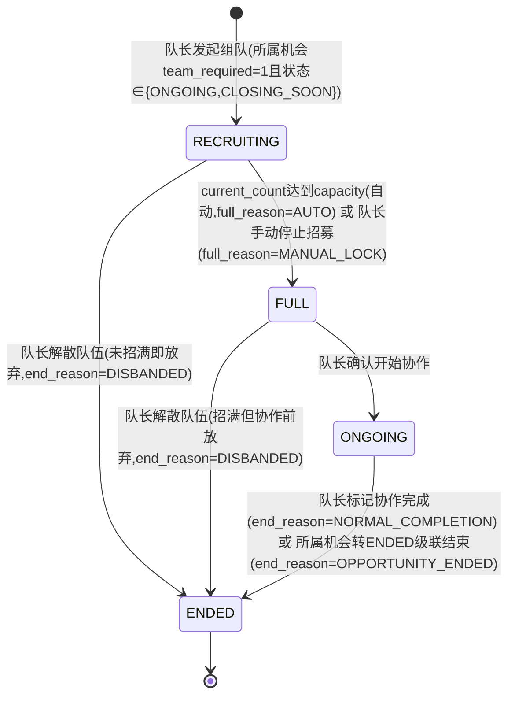
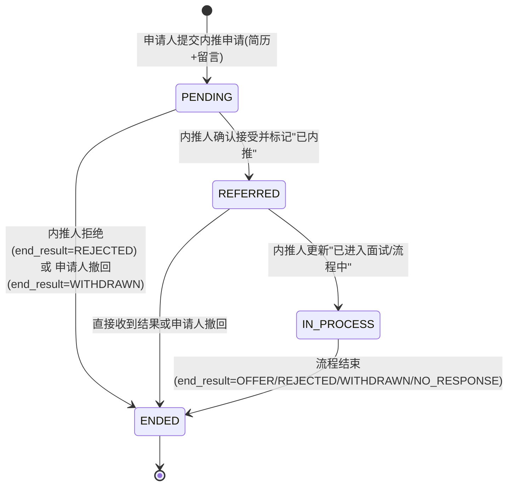

# 05 模块 M5 机会与组队 详细设计

> ⚠️ 本文为 v3 设计基线。实现已按 **v3.1 reconcile** 收敛，字段/接口/状态机差异**以 `backend/src/main/resources/schema.sql` 与 `docs/impl/00c_静态审查报告.md` 第五节为准**；本文与实现冲突处以后者为权威。见 [[09_设计修订说明]]。

> 对齐基线：[[00_总体架构与技术设计]]（技术选型 §1、全局数据模型 §3、全局API规范 §4、角色与权限矩阵 §5、界面清单 §6、命名与术语表 §9）。本文件字段、接口、角色代码均与地基文档严格一致，不重复定义地基已裁决的全局规则，仅在必要处引用。

---

## 1. 模块职责与边界

M5 负责**机会信息聚合与组队撮合**两件事：机会（`opportunity`）的发布、类型化展示（竞赛/大创/实习/讲座）、以截止时间驱动的四态生命周期（`ONGOING→CLOSING_SOON→CLOSED→ENDED`）；队伍（`team`/`team_member`）的发起、招募、审批加入、协作进度四态流转（`RECRUITING→FULL→ONGOING→ENDED`）；以及从公共机会状态机中拆出的**内推申请单**（`referral_ticket`，Could/本期可选）——申请人向内推人发起的私密进度追踪单据，不进入机会的公共展示与状态机。M5 是"高决策成本、强信息差"场景的信息入口与协作撮合器，被 M6 成长时间线只读引用（如"大三上关注考研/实习机会"节点链接到具体机会列表）。

**明确不做**：
- 不做机会的真实报名全流程与材料收集系统。常规机会（不组队、不内推）的"报名"以**热度计数 + 跳转官方外链**为主，系统不重造企业/赛事方自己的报名系统，与 M3"高时效信息不自存、外链官方为准"的治理原则一致（详见 §6.3）。
- 不做内推的公开展示与其状态机复用机会的状态机。`referral_ticket` 独立建模、独立可见性（仅申请人/内推人/ADMIN 可见），不出现在全局 E-R 主干图与机会公共列表中，体现"从公共机会状态机拆出"的裁决，本期标注 Could，可仅完成设计不落地代码。
- 不做队伍内部的协作工具（任务看板、群聊、文件协作等）。`team_member` 只承载"是谁在队里、什么角色、审批状态"的名单与审批关系，不做群组功能，符合命名术语表"队伍 team，禁止叫群"的裁决。
- 不做机会/队伍的标签体系与结构化匹配推荐。机会的适用范围（`applicable_scope`）为自由文本，不复用 M2/M4 的 `tag`/`user_tag` 结构化标签体系，避免跨模块强耦合；若后续需要"按标签推荐机会"，由 M2/M6 按只读引用扩展，不在本文件设计范围内。
- 不做机会/队伍的运营数据统计报表呈现（数据由本模块提供只读聚合接口，统计维护属 M7）。
- 不做真实企业内推渠道对接、真实岗位数据抓取（课程演示期机会与内推数据均为人工录入/模拟数据，符合地基"条件与假定"）。

---

## 2. 功能需求清单

| FR编号 | 功能名 | 角色 | 输入 | 处理逻辑 | 输出 | 优先级 |
|---|---|---|---|---|---|---|
| FR-M5-01 | 发布机会 | ALUMNI/ADMIN（已认证） | title、type、description、applicableScope、location、externalUrl、teamRequired、referralAvailable、startTime、deadline、eventEndTime、organizerName | 校验角色与认证 → `referralAvailable=1` 时校验 `role=ALUMNI 且 type=INTERNSHIP` → 计算 `archive_at` → 按发布人角色设置 `audit_status`（ADMIN 直接 `APPROVED`，ALUMNI 为 `PENDING` 待审）→ 插入 `opportunity` | 机会详情（含审核状态提示） | Must |
| FR-M5-02 | 编辑机会 | 发布人/ADMIN | 同上字段（部分） | 校验编辑权限与当前状态（`ENDED` 不可编辑）→ 重新计算 `archive_at` → 更新 | 机会详情 | Must |
| FR-M5-03 | 机会终审（审核通过/拒绝） | ADMIN | id、comment | CAS 校验 `audit_status=PENDING` → `APPROVED`/`REJECTED`，记录 `review_comment` | 机会详情 | Must（跨 M7，见§8） |
| FR-M5-04 | 手动结束机会 | 发布人/ADMIN | id、reason | 校验当前状态非 `ENDED` → CAS 转 `ENDED`（`end_reason=MANUAL_ENDED` 或 `CANCELLED`）→ 级联结束关联队伍（§6.7） | 机会详情 | Should |
| FR-M5-05 | 机会强制下线/维护（治理） | ADMIN | id、reason | 不受发布人/当前状态限制，任意状态可强制转 `ENDED` 或软删除，用于举报处理与内容治理 | 操作结果 | Must（跨 M7） |
| FR-M5-06 | 机会列表（类型筛选/即将截止） | 全角色（含 GUEST） | type（可选）、closingSoon（可选）、keyword（可选）、page、size | 仅返回 `audit_status=APPROVED`（登录用户额外可见本人发布的其他审核状态）→ 默认排除 `CLOSED`/`ENDED`（可切换查看）→ 按状态优先级+`deadline` 排序 | 分页列表 | Must |
| FR-M5-07 | 机会详情查看 | 全角色（含 GUEST） | id | 校验可见权限（非 `APPROVED` 仅发布人/ADMIN 可见，否则 40021）→ `view_count`+1 | 详情 DTO | Must |
| FR-M5-08 | 简单报名信令（非组队/非内推类） | STUDENT/ALUMNI | id | 校验 `team_required=0 且 referral_available=0` 且机会处于 `ONGOING`/`CLOSING_SOON` → `apply_count`+1（非强一致去重，热度计数） | 最新 `apply_count` | Must |
| FR-M5-09 | 定时任务：机会状态推进 | 系统 | — | 每日/每N分钟按 `deadline`/`archive_at` 推进 `ONGOING→CLOSING_SOON→CLOSED→ENDED`（§6.2） | — | Must |
| FR-M5-10 | 定时任务：机会 ENDED 级联结束关联队伍 | 系统 | — | 机会转 `ENDED` 时，其下非终态队伍统一转 `ENDED`（`end_reason=OPPORTUNITY_ENDED`）（§6.7） | — | Must |
| FR-M5-11 | 发起队伍 | STUDENT/ALUMNI（已认证） | opportunityId、name、description、requiredRoles、capacity | 校验机会 `team_required=1` 且 `audit_status=APPROVED` 且状态 ∈ {ONGOING,CLOSING_SOON} → 创建 `team`（status=RECRUITING）+ 创建队长 `team_member`（APPROVED） | 队伍详情 | Must |
| FR-M5-12 | 编辑队伍信息 | 队长 | id、name、description、requiredRoles、capacity | 校验操作人=队长 → 更新（`capacity` 不可小于当前已批准人数） | 队伍详情 | Should |
| FR-M5-13 | 申请加入队伍 | STUDENT/ALUMNI（已认证） | teamId、applyMessage | 校验队伍 `RECRUITING` 且所属机会 ∈ {ONGOING,CLOSING_SOON} → upsert `team_member`（PENDING） | 申请结果 | Must |
| FR-M5-14 | 审批加入申请（通过/拒绝） | 队长 | teamId、userId、决定 | 校验操作人=队长 → CAS 更新 `current_count`（防超员）→ 更新 `team_member.status`；满员自动转 `FULL` | 审批结果 | Must |
| FR-M5-15 | 退出队伍 | 已批准成员（非队长） | teamId | 校验 `status=APPROVED` 且非队长 → 转 `QUIT`，`current_count`-1，视情况回退 `FULL→RECRUITING` | 操作结果 | Should |
| FR-M5-16 | 移除成员 | 队长 | teamId、userId | 校验操作人=队长 → 转 `REMOVED`，`current_count`-1，视情况回退 | 操作结果 | Should |
| FR-M5-17 | 队伍状态流转（停止招募/开始协作/标记结束） | 队长 | teamId | `lock`：RECRUITING→FULL（`full_reason=MANUAL_LOCK`）；`start`：FULL→ONGOING；`end`：任意非终态→ENDED（`end_reason=NORMAL_COMPLETION`/`DISBANDED`） | 队伍详情 | Must |
| FR-M5-18 | 组队广场列表 | 登录（STUDENT/ALUMNI/ADMIN） | opportunityId（可选）、status（可选）、keyword、page、size | 默认展示 `RECRUITING`，可切换查看其他状态 | 分页列表 | Must |
| FR-M5-19 | 队伍详情（含成员列表） | 登录 | id | 聚合队伍信息 + 成员列表（队长额外可见 `PENDING` 待审批申请） | 详情 DTO | Must |
| FR-M5-20 | 我发起/加入的队伍列表 | 登录 | status（可选）、page、size | 查询 `leader_id=me OR EXISTS team_member(user_id=me)` | 分页列表 | Should |
| FR-M5-21 | 申请内推（Could） | STUDENT/ALUMNI（已认证） | opportunityId（可选）、referrerId（未关联机会时必填）、companyName、positionName、resumeUrl、applicantNote | 校验内推人已认证 ALUMNI；若关联机会需 `referral_available=1` → 创建 `referral_ticket`（PENDING） | 内推申请单详情 | Could |
| FR-M5-22 | 内推人更新进度（标记已内推/流程中/结束，Could） | 内推人 | id、决定、referrerNote、endResult | CAS 校验当前状态推进（§6.8） | 内推申请单详情 | Could |
| FR-M5-23 | 查看我的内推申请单（私密，Could） | 申请人/内推人/ADMIN | status（可选） | 按申请人视角/内推人视角分别查询本人相关记录，第三方不可见 | 分页列表/详情 | Could |
| FR-M5-24 | 申请人撤回内推申请（Could） | 申请人 | id | 校验状态非 `ENDED` → 转 `ENDED`（`end_result=WITHDRAWN`） | 操作结果 | Could |

---

## 3. 数据表设计

统一约定（与地基§3一致）：所有表含 `deleted TINYINT NN DEFAULT 0`、`created_at DATETIME NN DEFAULT CURRENT_TIMESTAMP`、`updated_at DATETIME NN DEFAULT CURRENT_TIMESTAMP ON UPDATE CURRENT_TIMESTAMP`（下表省略重复书写，仅在末尾统一列出）。地基§3仅点名 `knowledge_entry` 为"可并发编辑表"，本模块四张表均**不加 `version`**：`opportunity`/`team` 内容字段仅由单一发布人/队长编辑，并发风险低，走普通更新+归属校验；所有状态类流转（审核、状态机推进、成员审批）统一用**状态 CAS**（`UPDATE ... WHERE ... AND status=期望前置值`），队伍成员名额竞争额外对 `current_count` 做 CAS 双重保护（§6.5），与 M1 `auth_application`、M3 审核类操作同一分工原则。`opportunity.publisher_id`、`team.leader_id`、`team_member.user_id`、`referral_ticket.applicant_id` 分别兼任地基所述"内容表带 `created_by`"的语义（创建人即记录主体），不另设 `created_by` 字段，避免恒等冗余列，与 M3 `author_id` 的处理方式一致。

### 3.1 `opportunity`（机会）

| 字段名 | 类型 | 长度 | 约束 | 默认 | 说明 |
|---|---|---|---|---|---|
| id | BIGINT | — | PK, AUTO_INCREMENT | — | 主键 |
| title | VARCHAR | 200 | NN | — | 标题 |
| type | VARCHAR | 20 | NN | — | 枚举：`COMPETITION`(竞赛)/`INNOVATION`(大创)/`INTERNSHIP`(实习)/`LECTURE`(讲座) |
| publisher_id | BIGINT | — | NN, FK→user.id | — | 发布人（ALUMNI 或 ADMIN，已认证） |
| organizer_name | VARCHAR | 100 | — | NULL | 主办方名称快照（企业/学院/团委等），区别于系统账号 `publisher_id`，供不代表机构的个人校友发布时补充信任信息 |
| description | TEXT | — | NN | — | 详情正文 |
| applicable_scope | VARCHAR | 300 | — | NULL | 适用范围自由文本（专业/年级/身份要求），NULL 表示不限 |
| location | VARCHAR | 100 | — | NULL | 地点（线下地址或"线上"） |
| external_url | VARCHAR | 500 | — | NULL | 官方详情/报名外链 |
| team_required | TINYINT | — | NN | 0 | 是否支持组队；1 时报名主入口为"发起/加入队伍" |
| referral_available | TINYINT | — | NN | 0 | 是否支持内推申请；仅 `type=INTERNSHIP` 且 `publisher` 角色为 ALUMNI 时允许置 1，发布人即默认内推人（§6.1） |
| start_time | DATETIME | — | — | NULL | 活动举办时间（讲座/比赛日期）；NULL 表示无固定时间（如常年滚动实习/内推） |
| deadline | DATETIME | — | NN | — | 报名截止时间，驱动状态机的核心字段 |
| event_end_time | DATETIME | — | — | NULL | 活动实际结束时间；为空则按 `deadline + 归档窗口` 自动推算 `archive_at` |
| archive_at | DATETIME | — | NN | — | 归档时间：`=event_end_time` 或 `deadline+ARCHIVE_DAYS`（默认14天），创建/编辑时计算并落库，供定时任务索引扫描（§6.2） |
| status | VARCHAR | 20 | NN | `ONGOING` | 枚举：`ONGOING`/`CLOSING_SOON`/`CLOSED`/`ENDED`，见§4.1 |
| end_reason | VARCHAR | 20 | — | NULL | 枚举：`AUTO_ARCHIVED`/`MANUAL_ENDED`/`CANCELLED`；仅 `ENDED` 态有值 |
| audit_status | VARCHAR | 20 | NN | `APPROVED` | 枚举：`PENDING`/`APPROVED`/`REJECTED`；与 `status` 正交（同 M1 `role`/`auth_status` 模式）——ADMIN 发布默认 `APPROVED`，ALUMNI 发布默认 `PENDING` 待 M7 审核 |
| review_comment | VARCHAR | 300 | — | NULL | 审核意见/退回理由 |
| apply_count | INT | — | NN | 0 | 简单报名（非组队/非内推类）热度计数，非强一致去重（§6.3） |
| view_count | INT | — | NN | 0 | 浏览量 |

> 说明：`status` 是"机会对外招募时间窗口"的状态机（严格四态，见§4.1）；`audit_status` 是"该条内容是否通过平台审核可公开展示"的正交开关，二者独立，避免为满足"审核前不可见"需求而在四态状态机之外强行叠加第五态，破坏地基裁决的状态机结构。

### 3.2 `team`（队伍）

| 字段名 | 类型 | 长度 | 约束 | 默认 | 说明 |
|---|---|---|---|---|---|
| id | BIGINT | — | PK, AUTO_INCREMENT | — | 主键 |
| opportunity_id | BIGINT | — | NN, FK→opportunity.id | — | 所属机会（仅 `team_required=1` 的机会下可创建） |
| leader_id | BIGINT | — | NN, FK→user.id | — | 队长（创建人） |
| name | VARCHAR | 100 | NN | — | 队伍名称 |
| description | TEXT | — | — | NULL | 招募说明（方向/分工/要求） |
| required_roles | VARCHAR | 300 | — | NULL | 招募角色/技能要求文本，如"前端1名、UI1名" |
| capacity | INT | — | NN | — | 人数上限（含队长），取值 2–20 |
| current_count | INT | — | NN | 1 | 当前人数（含队长），冗余计数，创建时=1 |
| status | VARCHAR | 20 | NN | `RECRUITING` | 枚举：`RECRUITING`/`FULL`/`ONGOING`/`ENDED`，见§4.2 |
| full_reason | VARCHAR | 20 | — | NULL | 枚举：`AUTO`(自动满员)/`MANUAL_LOCK`(队长提前锁定停招)；仅 `FULL` 态有值 |
| end_reason | VARCHAR | 20 | — | NULL | 枚举：`NORMAL_COMPLETION`/`DISBANDED`/`OPPORTUNITY_ENDED`；仅 `ENDED` 态有值 |
| started_at | DATETIME | — | — | NULL | 进入 `ONGOING` 时间 |
| ended_at | DATETIME | — | — | NULL | 进入 `ENDED` 时间 |

### 3.3 `team_member`（队伍成员）

| 字段名 | 类型 | 长度 | 约束 | 默认 | 说明 |
|---|---|---|---|---|---|
| id | BIGINT | — | PK, AUTO_INCREMENT | — | 主键 |
| team_id | BIGINT | — | NN, FK→team.id | — | 所属队伍 |
| user_id | BIGINT | — | NN, FK→user.id | — | 成员 |
| role_in_team | VARCHAR | 20 | NN | — | 枚举：`LEADER`/`MEMBER` |
| status | VARCHAR | 20 | NN | `PENDING` | 枚举：`PENDING`/`APPROVED`/`REJECTED`/`QUIT`/`REMOVED`；队长记录创建即为 `APPROVED` |
| apply_message | VARCHAR | 300 | — | NULL | 申请加入时的自我介绍/意向说明 |
| applied_at | DATETIME | — | NN | — | 申请/创建时间 |
| reviewed_at | DATETIME | — | — | NULL | 审批时间 |
| reviewed_by | BIGINT | — | FK→user.id | NULL | 审批人（通常为队长） |

> 唯一约束 `UK(team_id, user_id)`：同一用户对同一队伍仅保留一条当前关系记录；`REJECTED`/`QUIT` 后允许重新申请（原地 upsert 回 `PENDING`，见§6.5），不产生历史流水表意义上的多条记录，与 M3 `knowledge_feedback` 的 upsert 语义一致。

### 3.4 `referral_ticket`（内推申请单，Could/本期可选）

| 字段名 | 类型 | 长度 | 约束 | 默认 | 说明 |
|---|---|---|---|---|---|
| id | BIGINT | — | PK, AUTO_INCREMENT | — | 主键 |
| opportunity_id | BIGINT | — | FK→opportunity.id | NULL | 关联机会（可为空，支持内推人私下发起的内推邀约，不强制绑定公开机会） |
| referrer_id | BIGINT | — | NN, FK→user.id | — | 内推人（已认证 ALUMNI） |
| applicant_id | BIGINT | — | NN, FK→user.id | — | 申请人 |
| company_name | VARCHAR | 100 | NN | — | 内推公司/单位名称快照（即使关联 `opportunity`，也独立快照，避免机会被编辑/下线后内推单历史失真） |
| position_name | VARCHAR | 100 | NN | — | 内推岗位名称快照 |
| resume_url | VARCHAR | 255 | NN | — | 简历附件地址 |
| applicant_note | VARCHAR | 500 | — | NULL | 申请人自我介绍/求内推留言 |
| referrer_note | VARCHAR | 500 | — | NULL | 内推人反馈/进度备注，私密，仅双方与 ADMIN 可见 |
| status | VARCHAR | 20 | NN | `PENDING` | 枚举：`PENDING`/`REFERRED`/`IN_PROCESS`/`ENDED`，见§4.3 |
| end_result | VARCHAR | 20 | — | NULL | 枚举：`OFFER`/`REJECTED`/`WITHDRAWN`/`NO_RESPONSE`；仅 `ENDED` 态有值 |
| referred_at | DATETIME | — | — | NULL | 转 `REFERRED` 的时间 |
| ended_at | DATETIME | — | — | NULL | 转 `ENDED` 的时间 |

> 设计要点：本表**不出现在全局 E-R 主干图中**（地基§3的 erDiagram 只画到 `team_member`，未画 `referral_ticket` 的关系线），这正是"从公共机会状态机拆出独立建模"的体现——内推是申请人与内推人之间的私密单据，可选关联某条公共机会（获取公司/岗位快照初值），但其可见性、状态机与生命周期完全独立于 `opportunity`，不受机会 `ENDED`/删除影响（历史内推记录靠自身字段自包含，不依赖机会仍然存在）。

---

## 4. 状态机

本模块含三条独立状态机：机会（对外时间窗口）、队伍（协作进度）、内推申请单（私密流程，Could）。三者通过 `opportunity_id` 弱关联，但状态互不直接绑定——机会 `ENDED` 通过§6.7的应用层调用级联结束队伍，而非状态机层面耦合。

### 4.1 `opportunity.status`

```mermaid
stateDiagram-v2
    [*] --> ONGOING: 发布(ADMIN自动通过;ALUMNI需audit_status先转APPROVED方可公开)
    ONGOING --> CLOSING_SOON: 定时任务:距deadline<=阈值(默认72小时)
    CLOSING_SOON --> CLOSED: 定时任务:now>=deadline
    ONGOING --> CLOSED: 定时任务兜底:阈值调整等原因导致跳过CLOSING_SOON窗口时直接判定
    CLOSED --> ENDED: 定时任务:now>=archive_at(event_end_time或deadline+归档窗口) 或 发布人/ADMIN手动结束
    ONGOING --> ENDED: 发布人/ADMIN手动提前结束(如活动取消)
    CLOSING_SOON --> ENDED: 同上
    ENDED --> [*]
```



**终态说明**：`ENDED` 为唯一终态，`end_reason` 区分自动归档（`AUTO_ARCHIVED`）与人工提前结束（`MANUAL_ENDED`/`CANCELLED`）。`audit_status`（`PENDING`/`APPROVED`/`REJECTED`）与本状态机正交，`REJECTED` 的机会不进入本状态机的公开流转（不展示、不可报名/组队/内推），只有发布人与 ADMIN 可见。

### 4.2 `team.status`



**终态说明**：`ENDED` 为唯一终态；`FULL→RECRUITING` 的隐式回退（成员退出/被移除且 `full_reason=AUTO` 时空出名额）不在本图中作为正式跃迁展示，作为业务规则在§6.5/6.6 说明——因为它只是"人满自动 FULL"这一自动判定条件不再成立时的镜像回退，不改变状态机的语义骨架。

### 4.3 `referral_ticket.status`（Could/本期可选）



**终态说明**：`ENDED` 为唯一终态，`end_result` 细分最终结果，供个人查看与（可选）后续统计使用，不影响主状态机流转。

---

## 5. API 接口清单

前缀 `/api/v1`；统一响应体 `{code, message, data}`；错误码分段沿用地基 §4。本模块常用错误码：`10003` 未通过身份认证不可执行写操作（复用 M1）、`30021` 机会当前状态不允许该操作、`30022` 机会不支持组队、`30023` 机会不支持内推申请（或角色/类型不满足内推开启条件）、`30024` 队伍当前状态不允许该操作、`30025` 队伍已满员、`30026` 用户已在该队伍中或已有待处理申请、`30027` 无权限操作（非队长/非本人/非发布人）、`30028` 该机会审核未通过暂不可见、`30029` 内推申请单当前状态不允许该操作、`40021` 机会不存在、`40022` 队伍不存在、`40023` 队伍成员关系不存在、`40024` 内推申请单不存在。

**机会**

| 方法 | 路径 | 说明 | 关键入参 | 返回 data 结构 | 所需角色 |
|---|---|---|---|---|---|
| GET | `/api/v1/opportunities` | 机会列表（类型筛选/即将截止） | type, closingSoon, keyword, page, size | 分页 `{records:[OpportunityBriefDTO], total, page, size}` | 全角色（含GUEST，仅见APPROVED） |
| GET | `/api/v1/opportunities/{id}` | 机会详情 | — | `OpportunityDTO` | 全角色（非APPROVED限发布人/ADMIN，否则40021/30028） |
| POST | `/api/v1/opportunities` | 发布机会 | title, type, description, applicableScope, location, externalUrl, teamRequired, referralAvailable, startTime, deadline, eventEndTime, organizerName | `OpportunityDTO` | ALUMNI/ADMIN |
| PUT | `/api/v1/opportunities/{id}` | 编辑机会 | 同上（部分字段） | `OpportunityDTO` | 发布人/ADMIN |
| DELETE | `/api/v1/opportunities/{id}` | 软删除机会 | — | `null` | 发布人/ADMIN |
| PATCH | `/api/v1/opportunities/{id}/end` | 手动结束 | reason | `OpportunityDTO` | 发布人/ADMIN |
| PATCH | `/api/v1/opportunities/{id}/apply` | 简单报名信令（非组队/非内推类） | — | `{applyCount}` | STUDENT/ALUMNI |
| PATCH | `/api/v1/opportunities/{id}/approve` | 机会终审通过（M7治理端调用） | comment | `OpportunityDTO` | ADMIN |
| PATCH | `/api/v1/opportunities/{id}/reject` | 机会终审拒绝 | comment | `OpportunityDTO` | ADMIN |
| PATCH | `/api/v1/opportunities/{id}/force-end` | 强制下线（举报处理） | reason | `OpportunityDTO` | ADMIN |

**队伍**

| 方法 | 路径 | 说明 | 关键入参 | 返回 data 结构 | 所需角色 |
|---|---|---|---|---|---|
| GET | `/api/v1/teams` | 组队广场列表（按机会/类型/状态筛选） | opportunityId, status, keyword, page, size | 分页 `{records:[TeamBriefDTO], total, page, size}` | 登录 |
| GET | `/api/v1/teams/{id}` | 队伍详情（含成员列表） | — | `TeamDTO` | 登录 |
| POST | `/api/v1/opportunities/{opportunityId}/teams` | 发起队伍 | name, description, requiredRoles, capacity | `TeamDTO` | STUDENT/ALUMNI（已认证） |
| PUT | `/api/v1/teams/{id}` | 编辑队伍信息 | name, description, requiredRoles, capacity | `TeamDTO` | 队长 |
| PATCH | `/api/v1/teams/{id}/lock` | 停止招募（→FULL） | — | `TeamDTO` | 队长 |
| PATCH | `/api/v1/teams/{id}/start` | 开始协作（FULL→ONGOING） | — | `TeamDTO` | 队长 |
| PATCH | `/api/v1/teams/{id}/end` | 标记结束/解散 | reason | `TeamDTO` | 队长 |
| POST | `/api/v1/teams/{id}/members` | 申请加入队伍 | applyMessage | `TeamMemberDTO` | STUDENT/ALUMNI（已认证） |
| GET | `/api/v1/teams/{id}/members` | 成员列表（队长额外见待审批） | status | `{records:[TeamMemberDTO]}` | 登录 |
| PATCH | `/api/v1/teams/{id}/members/{userId}/approve` | 审批通过 | — | `TeamMemberDTO` | 队长 |
| PATCH | `/api/v1/teams/{id}/members/{userId}/reject` | 审批拒绝 | — | `TeamMemberDTO` | 队长 |
| DELETE | `/api/v1/teams/{id}/members/{userId}` | 退出/移除成员 | — | `null` | 本人（退出）/队长（移除） |
| GET | `/api/v1/teams/mine` | 我发起/加入的队伍 | status, page, size | 分页 `{records, total, page, size}` | STUDENT/ALUMNI |

**内推申请单（Could/本期可选）**

| 方法 | 路径 | 说明 | 关键入参 | 返回 data 结构 | 所需角色 |
|---|---|---|---|---|---|
| POST | `/api/v1/referral-tickets` | 申请内推 | opportunityId, referrerId, companyName, positionName, resumeUrl, applicantNote | `ReferralTicketDTO` | STUDENT/ALUMNI（已认证） |
| GET | `/api/v1/referral-tickets/mine` | 我作为申请人的内推申请列表 | status, page, size | 分页 | STUDENT/ALUMNI |
| GET | `/api/v1/referral-tickets/referred-by-me` | 我作为内推人收到的申请列表 | status, page, size | 分页 | ALUMNI |
| GET | `/api/v1/referral-tickets/{id}` | 内推申请单详情（私密） | — | `ReferralTicketDTO` | 申请人/内推人/ADMIN |
| PATCH | `/api/v1/referral-tickets/{id}/refer` | 标记已内推 | referrerNote | `ReferralTicketDTO` | 内推人 |
| PATCH | `/api/v1/referral-tickets/{id}/progress` | 更新进度（流程中） | referrerNote | `ReferralTicketDTO` | 内推人 |
| PATCH | `/api/v1/referral-tickets/{id}/end` | 标记结束（含结果） | endResult, note | `ReferralTicketDTO` | 内推人（任意结果）/申请人（仅WITHDRAWN） |

> `approve`/`reject`/`force-end` 三个接口的 Controller 挂载于 M7 管理后台路由分组，但实现直接调用本模块 `OpportunityService`，与 M1/M3 认证与知识候选终审接口同一模式（见§8、§9）。内推相关全部接口标注 Could，本期若未落地代码，仅保留本节设计供后续实现参照。

---

## 6. 关键算法与业务规则

### 6.1 机会发布与审核门（角色正交于机会状态机）

```
create(publisherId, request):
  role = UserService.getRole(publisherId)
  校验 role IN (ALUMNI, ADMIN) 且 UserService.isVerified(publisherId), 否则 10003/30027
  IF request.referralAvailable == true:
      校验 role == ALUMNI 且 request.type == 'INTERNSHIP', 否则 30023
        ("仅已认证校友发布的实习类机会可开启内推申请入口")
  校验 request.deadline > now(), 否则 20001
  archiveAt = computeArchiveAt(request.eventEndTime, request.deadline)   -- 见6.2
  auditStatus = (role == ADMIN) ? 'APPROVED' : 'PENDING'
  status = computeStatusByTime(deadline, archiveAt, now())              -- 按时间即时计算,不因审核状态而不同
  INSERT opportunity(..., audit_status=auditStatus, status=status, archive_at=archiveAt)
  IF auditStatus == 'PENDING':
      事务提交后发布 OpportunitySubmittedEvent(AFTER_COMMIT),
      由 M7 监听创建 audit_task(target_type=OPPORTUNITY)（与M1/M3同一解耦模式）
  返回 OpportunityDTO(若PENDING附带"待审核,审核通过后对外可见"提示)
```

**可见性规则**：`list()`/`search()` 默认过滤 `audit_status='APPROVED' AND deleted=0`；`PENDING`/`REJECTED` 状态的机会仅发布人本人与 ADMIN 可通过详情接口查看（其余请求返回 `40021`），不进入公共列表，与 M3"非 PUBLISHED 仅作者/ADMIN 可见"同一模式。

### 6.2 机会状态定时任务推进

```
computeArchiveAt(eventEndTime, deadline):
  RETURN eventEndTime != null ? eventEndTime : deadline + INTERVAL 14 DAY   -- ARCHIVE_DAYS默认14,可配置

@Scheduled(fixedRate = 600000)  // 每10分钟
advanceOpportunityStatus():
  now = now()
  UPDATE opportunity SET status='CLOSING_SOON'
    WHERE deleted=0 AND status='ONGOING'
      AND deadline <= now + INTERVAL 72 HOUR                              -- CLOSING_SOON_HOURS默认72,可配置
  UPDATE opportunity SET status='CLOSED'
    WHERE deleted=0 AND status IN ('ONGOING','CLOSING_SOON') AND deadline <= now
  FOR opp IN SELECT id FROM opportunity
             WHERE deleted=0 AND status='CLOSED' AND archive_at <= now:
      affected = UPDATE opportunity SET status='ENDED', end_reason='AUTO_ARCHIVED'
                 WHERE id=opp.id AND status='CLOSED'                       -- CAS防重复处理
      IF affected == 1:
          TeamService.endAllByOpportunity(opp.id, reason='OPPORTUNITY_ENDED')  -- 见6.7
          log("opportunity {id} archived to ENDED")                       -- 定时任务日志需可追溯
```

### 6.3 报名 / 组队 / 内推的入口分流规则

```
决定机会详情页的"参与入口"（前端渲染依据,后端仅做各自校验,不互斥,可并存）：
  IF team_required == 1:
      主入口 = "发起/加入队伍"（引导至 P15,创建/申请 team）
  IF referral_available == 1:
      附加入口 = "申请内推"（创建 referral_ticket，与 team_required 可并存，
                            如"实习需组队完成项目,同时发布人提供内推名额"）
  IF team_required == 0 AND referral_available == 0:
      主入口 = "我要报名"
        PATCH /opportunities/{id}/apply → apply_count+1
        // apply_count 是热度计数,不做服务端强一致去重（同一用户重复点击允许多次计数），
        // 前端用登录用户的本地状态做"已报名"提示优化用户体验，不作为业务权威凭证；
        // 若 external_url 存在，报名同时跳转外部官方页面完成真实投递——
        // 系统不重造企业/赛事方的报名收集系统，与 M3"高时效信息不自存、外链官方为准"同一治理原则
  三类入口的共同前置条件：opportunity.audit_status=='APPROVED' 且 status IN ('ONGOING','CLOSING_SOON')，
  否则 30021（已截止/已结束）或 30028（审核未通过）
```

### 6.4 发起队伍

```
createTeam(opportunityId, leaderId, request):
  opp = OpportunityService.getById(opportunityId)
  校验 opp.team_required == 1, 否则 30022
  校验 opp.audit_status == 'APPROVED' 且 opp.status IN ('ONGOING','CLOSING_SOON'), 否则 30028/30021
  校验 UserService.isVerified(leaderId), 否则 10003
  校验 2 <= request.capacity <= 20, 否则 20001
  INSERT team(opportunity_id, leader_id, name, description, required_roles,
              capacity, current_count=1, status='RECRUITING')
  INSERT team_member(team_id, user_id=leaderId, role_in_team='LEADER',
                      status='APPROVED', applied_at=now(), reviewed_at=now(), reviewed_by=leaderId)
  返回 TeamDTO
```

### 6.5 申请加入与审批（并发抢最后一个名额的 CAS 保护）

```
apply(teamId, userId, applyMessage):
  team = findById(teamId)
  opp  = OpportunityService.getById(team.opportunity_id)
  校验 team.status == 'RECRUITING' 且 opp.status IN ('ONGOING','CLOSING_SOON'), 否则 30024/30021
  existing = SELECT * FROM team_member WHERE team_id=? AND user_id=?
  IF existing 不存在:
      INSERT team_member(status='PENDING', role_in_team='MEMBER', apply_message=?, applied_at=now())
  ELIF existing.status IN ('REJECTED', 'QUIT', 'REMOVED'):
      UPDATE existing SET status='PENDING', apply_message=?, applied_at=now(),
             reviewed_at=NULL, reviewed_by=NULL                            -- 允许重新申请
  ELSE:  -- PENDING 或 APPROVED
      拒绝，返回 30026("已在队伍中或已有待处理申请")

approve(teamId, userId, operatorId):
  team = findById(teamId)
  校验 operatorId == team.leader_id, 否则 30027
  校验 team.status == 'RECRUITING', 否则 30024
  member = SELECT * FROM team_member WHERE team_id=? AND user_id=? AND status='PENDING'
  不存在 → 40023
  affected = UPDATE team SET current_count = current_count + 1
             WHERE id=teamId AND current_count < capacity                  -- CAS防超员
  IF affected == 0: 返回 30025("队伍已满员")
  UPDATE team_member SET status='APPROVED', reviewed_at=now(), reviewed_by=operatorId WHERE id=member.id
  IF (team.current_count + 1) == team.capacity:
      UPDATE team SET status='FULL', full_reason='AUTO' WHERE id=teamId AND status='RECRUITING'
  通知 userId "加入申请已通过"

reject(teamId, userId, operatorId):
  校验 operatorId == team.leader_id, 否则 30027
  UPDATE team_member SET status='REJECTED', reviewed_at=now(), reviewed_by=operatorId
  WHERE team_id=teamId AND user_id=userId AND status='PENDING'
  通知 userId "加入申请未通过"（允许日后重新申请）
```

### 6.6 队伍状态流转（停招 / 开始协作 / 结束 / 退出与回退）

```
lock(teamId, operatorId):     -- RECRUITING → FULL（人未满,队长提前锁定）
  校验 operatorId==leader_id 且 status=='RECRUITING'，否则 30027/30024
  UPDATE team SET status='FULL', full_reason='MANUAL_LOCK' WHERE id=teamId AND status='RECRUITING'

start(teamId, operatorId):    -- FULL → ONGOING
  校验 operatorId==leader_id 且 status=='FULL'，否则 30027/30024
  UPDATE team SET status='ONGOING', started_at=now() WHERE id=teamId AND status='FULL'

end(teamId, operatorId, reason):  -- 任意非终态 → ENDED（解散/协作完成）
  校验 operatorId==leader_id 且 status IN ('RECRUITING','FULL','ONGOING')，否则 30027/30024
  UPDATE team SET status='ENDED', end_reason=reason, ended_at=now()
  WHERE id=teamId AND status IN ('RECRUITING','FULL','ONGOING')
  通知所有 APPROVED 成员"队伍已结束"

quit(teamId, userId):          -- 成员主动退出（队长不可退出,只能end整个队伍）
  member = SELECT * FROM team_member WHERE team_id=? AND user_id=? AND status='APPROVED'
  校验 member.role_in_team != 'LEADER', 否则 30027
  UPDATE team_member SET status='QUIT' WHERE id=member.id
  UPDATE team SET current_count=current_count-1 WHERE id=teamId
  IF team.status=='FULL' AND team.full_reason=='AUTO':
      UPDATE team SET status='RECRUITING', full_reason=NULL WHERE id=teamId  -- 自动满员的回退因空位而失效
      -- full_reason='MANUAL_LOCK' 时不回退：队长主动锁定招募的决定不因他人退出而撤销

remove(teamId, userId, operatorId):  -- 队长移除成员，逻辑同 quit，仅操作人与目标不同
  校验 operatorId==leader_id，否则 30027
  （其余步骤同 quit，team_member.status 置 'REMOVED'）
```

### 6.7 定时任务：机会 ENDED 级联结束关联队伍

```
TeamService.endAllByOpportunity(opportunityId, reason):
  UPDATE team SET status='ENDED', end_reason=reason, ended_at=now()
  WHERE opportunity_id=opportunityId AND status IN ('RECRUITING','FULL','ONGOING')
  FOR 每个被结束的队伍:
      通知队长与全体APPROVED成员"所属机会已结束，队伍自动归档"
```

### 6.8 内推申请单流转（Could/本期可选）

```
apply(applicantId, request):
  校验 UserService.isVerified(applicantId), 否则 10003
  IF request.opportunityId 存在:
      opp = OpportunityService.getById(request.opportunityId)
      校验 opp.referral_available==1 且 opp.status IN ('ONGOING','CLOSING_SOON'), 否则 30023/30021
      referrerId = opp.publisher_id  -- 发布人即默认内推人
      companyName/positionName 建议预填 opp.organizer_name/opp.title，申请人可编辑覆盖
  ELSE:
      referrerId = request.referrerId
      校验该用户 role=='ALUMNI' 且已认证, 否则 30027
  INSERT referral_ticket(status='PENDING', opportunity_id, referrer_id=referrerId,
                         applicant_id=applicantId, company_name, position_name,
                         resume_url, applicant_note)
  通知 referrerId "收到新的内推申请"

refer(ticketId, referrerId, referrerNote):     -- PENDING → REFERRED
  校验操作人==referrer_id 且 status=='PENDING', 否则 30027/30029
  UPDATE referral_ticket SET status='REFERRED', referrer_note=?, referred_at=now()
  WHERE id=ticketId AND status='PENDING'       -- CAS

progress(ticketId, referrerId, referrerNote):  -- REFERRED → IN_PROCESS
  校验操作人==referrer_id 且 status=='REFERRED', 否则 30027/30029
  UPDATE referral_ticket SET status='IN_PROCESS', referrer_note=? WHERE id=ticketId AND status='REFERRED'

end(ticketId, operatorId, endResult, note):     -- 任意非终态 → ENDED
  IF operatorId == referrer_id: 允许任意 endResult(OFFER/REJECTED/NO_RESPONSE等)
  ELIF operatorId == applicant_id: 仅允许 endResult=='WITHDRAWN'
  ELSE: 返回 30027
  校验 status IN ('PENDING','REFERRED','IN_PROCESS'), 否则 30029
  UPDATE referral_ticket SET status='ENDED', end_result=endResult, referrer_note=COALESCE(?, referrer_note), ended_at=now()
  WHERE id=ticketId AND status IN ('PENDING','REFERRED','IN_PROCESS')
```

**私密可见性规则**（贯穿本节所有查询接口）：任意 `referral_ticket` 的读操作均限定 `WHERE referrer_id=当前用户 OR applicant_id=当前用户`，ADMIN 仅在举报/纠纷处理场景下可越权查看单条详情（需记录访问日志），其余第三方（含同队伍成员）一律不可见，这是"私密进度 + 独立可见性"裁决的落地。

---

## 7. 界面设计

### P13 机会列表（类型筛选/即将截止）（角色 全，归属 M5）

- **布局要素**：
  - 顶部类型筛选 Tab：全部 / 竞赛 / 大创 / 实习 / 讲座。
  - "即将截止"专区（结构化区块，非信息流）：单独列出 `status=CLOSING_SOON` 的机会，首页仪表盘 P03 的"即将截止机会"卡片即链接到本页对应筛选态，呼应地基"反贴吧"仪表盘化原则。
  - 关键字搜索框；"显示已截止/已结束"开关（默认关闭，即默认过滤 `CLOSED`/`ENDED`）。
  - 列表卡片：标题、类型标签、发布主体（`organizer_name` 或发布人昵称）、截止时间倒计时、是否支持组队图标、是否支持内推图标（`referral_available=1` 时展示）。
  - 已登录用户可见"我发布的机会"入口（含 `PENDING`/`REJECTED` 状态，跳个人管理列表）。
- **关键交互**：类型筛选与关键字搜索联动同一列表；"支持组队"图标点击直接跳转 P15 并按 `opportunityId` 预筛选；GUEST 可完整浏览与筛选（只读，报名/组队/内推按钮 hover 提示"登录后可参与"）。
- **校验规则**：关键字长度≤200；`page`/`size` 边界校验（`size`≤50）。
- **跳转去向**：卡片点击 → P14；组队图标 → P15。
- **负责人**：[占位]

### P14 机会详情 + 报名（角色 登录，归属 M5）

- **布局要素**：
  - 详情信息区：类型标签、发布主体、适用范围、地点、活动时间、截止倒计时、正文、官方外链按钮（若有）。
  - 参与入口区（按§6.3 分流规则渲染）：
    - `team_required=1`："发起队伍" + "查看已有队伍" 按钮，均跳 P15。
    - `referral_available=1`：额外"申请内推"按钮，弹出简历上传（PDF/DOC，≤10MB）+ 留言输入框，提交生成 `referral_ticket`（Could）。
    - 均为 0 时："我要报名"按钮（点击计数 + 若有 `external_url` 同时新窗口跳转）。
  - 发布人/ADMIN 视角：额外"编辑"/"手动结束"按钮；`audit_status=PENDING` 时显示"审核中，通过后对外可见"提示条；`REJECTED` 时显示 `review_comment`。
- **关键交互**：`status ∈ {CLOSED, ENDED}` 时报名/组队/内推入口全部置灰，显示"报名已截止"/"活动已结束"；内推提交成功后留在本页展示"已提交，等待内推人处理"提示（内推申请单本期不单列页面，通过个人中心/通知只读查看）。
- **校验规则**：简历文件格式/大小；内推留言 ≤500 字。
- **跳转去向**：组队入口 → P15；内推提交 → 停留本页；编辑 → 复用发布表单组件编辑态。
- **负责人**：[占位]

### P15 组队广场 + 队伍详情（角色 登录，归属 M5）

- **布局要素**：
  - 组队广场列表区：筛选（按机会 `opportunityId`/按类型/仅看 `RECRUITING`）+ 关键字。
  - 队伍卡片：名称、所属机会（可反查跳 P14）、当前人数/上限、招募角色说明、状态标签。
  - 队伍详情区：成员列表（昵称+角色+状态）+ 加入申请入口（未加入用户显示"申请加入"按钮及自我介绍输入框）+ 队长专属审批区（`PENDING` 申请列表，批准/拒绝按钮）+ 队长专属状态操作按钮（停止招募/开始协作/标记结束）。
  - 已批准的非队长成员可见"退出队伍"按钮。
- **关键交互**：从 P14 带 `opportunityId` 跳转时默认预筛选该机会下的队伍列表，并展示"发起新队伍"入口；非队长用户申请提交后按钮变为"审批中"禁用态，直至队长处理。
- **校验规则**：队伍名称 ≤100 字；`capacity` 取值 2–20 且不得小于当前已批准人数；自我介绍 ≤300 字。
- **跳转去向**：发起队伍成功 → 留在详情页；机会名称 → P14。
- **负责人**：[占位]

> P15 沿用地基页面清单"组队广场"这一既有命名（与地基§6"界面清单"逐字一致），但交互设计仍是结构化的筛选列表 + 详情页，不做论坛式动态流/时间轴瀑布，遵守"仪表盘化、无信息流"纪律；"广场"仅为页面标题词，非本模块架构概念（本模块的架构性功能命名统一使用"机会""队伍"，不使用"帖子/楼层/广场/动态"描述数据模型或业务流程）。

---

## 8. 与其他模块的接口

**M5 依赖谁**：
- M1：`UserService.isVerified(userId)`/`getRole(userId)` 校验发布机会（ALUMNI/ADMIN）、发起/加入队伍（STUDENT/ALUMNI）、申请内推（已认证）的前置条件；`UserService.getById` 获取发布人/队长/成员/内推人昵称摘要供界面展示。
- 全局 `notification`：机会即将截止提醒、队伍审批结果、内推进度更新通知由 M5 触发插入，展示/已读态维护属全局/M7。
- M7：机会审核队列（`audit_status=PENDING`）依赖 M7 治理端调用本模块 `approve`/`reject`；举报处理（强制下线机会/队伍）调用 `forceEnd`/`endAllByOpportunity`。

**被谁依赖**（只读依赖 `opportunityId`/`status`，不直接查表，统一走 Service）：
- M6：`timeline_node_ref` 以 `(ref_type='OPPORTUNITY', ref_id=opportunity.id)` 只读引用机会节点（如"大三上关注考研/实习机会"节点链接到具体机会列表），调用 `OpportunityService.getBrief(id)` 获取标题/截止时间摘要，不复制内容。
- M7：审核队列依赖 `pageForReview`/`approve`/`reject`；举报处理依赖 `forceEnd`。
- 首页仪表盘（视图层）：调用 `OpportunityService.listClosingSoon(limit)` 只读聚合展示"即将截止机会"卡片，不直接查表。

**对外暴露的 Service 方法签名（Java）**：

```java
public interface OpportunityService {
    OpportunityDTO create(Long publisherId, CreateOpportunityRequest request);
    OpportunityDTO update(Long id, Long operatorId, UpdateOpportunityRequest request);
    OpportunityDTO getById(Long id, Long viewerUserId);
    OpportunityBriefDTO getBrief(Long id); // 供 M6/首页仪表盘只读引用
    PageResult<OpportunityBriefDTO> list(OpportunityQuery query);
    PageResult<OpportunityBriefDTO> listClosingSoon(int limit); // 供 P03 首页仪表盘卡片
    PageResult<OpportunityDTO> pageForReview(OpportunityQuery query); // 供 M7 审核队列调用
    OpportunityDTO approve(Long id, Long reviewerId, String comment);
    OpportunityDTO reject(Long id, Long reviewerId, String comment);
    OpportunityDTO end(Long id, Long operatorId, String reason);
    OpportunityDTO forceEnd(Long id, Long adminId, String reason); // 供 M7 举报处理调用
    void applySignal(Long id, Long userId); // 简单报名信令,apply_count+1
    void delete(Long id, Long operatorId);
    boolean isTeamRequired(Long id);
    boolean isReferralAvailable(Long id);
}

public interface TeamService {
    TeamDTO createTeam(Long opportunityId, Long leaderId, CreateTeamRequest request);
    TeamDTO updateTeam(Long id, Long operatorId, UpdateTeamRequest request);
    TeamDTO getById(Long id);
    PageResult<TeamBriefDTO> list(TeamQuery query); // 组队广场
    PageResult<TeamBriefDTO> pageMine(Long userId, String status, PageRequest page);
    TeamDTO lock(Long id, Long operatorId);
    TeamDTO start(Long id, Long operatorId);
    TeamDTO end(Long id, Long operatorId, String reason);
    void endAllByOpportunity(Long opportunityId, String reason); // 供机会ENDED定时任务级联调用
}

public interface TeamMemberService {
    TeamMemberDTO apply(Long teamId, Long userId, String applyMessage);
    TeamMemberDTO approve(Long teamId, Long userId, Long operatorId);
    TeamMemberDTO reject(Long teamId, Long userId, Long operatorId);
    void quit(Long teamId, Long userId);
    void remove(Long teamId, Long userId, Long operatorId);
    List<TeamMemberDTO> listMembers(Long teamId, String status);
}

public interface ReferralTicketService { // Could,本期可选实现
    ReferralTicketDTO apply(Long applicantId, ApplyReferralRequest request);
    ReferralTicketDTO getById(Long id, Long viewerUserId);
    PageResult<ReferralTicketDTO> pageAsApplicant(Long applicantId, String status, PageRequest page);
    PageResult<ReferralTicketDTO> pageAsReferrer(Long referrerId, String status, PageRequest page);
    ReferralTicketDTO refer(Long id, Long referrerId, String referrerNote);
    ReferralTicketDTO progress(Long id, Long referrerId, String referrerNote);
    ReferralTicketDTO end(Long id, Long operatorId, String endResult, String note);
}
```

---

## 9. 编码实现要点

**Controller**：
- `OpportunityController`：`list`/`search`/`{id}`（查）/`create`/`update`/`delete`/`end`/`apply`。
- `AdminOpportunityController`（挂载于 M7 路由分组）：`{id}/approve`/`{id}/reject`/`{id}/force-end`，Controller 归属 M7 代码目录但复用本模块 `OpportunityService` Bean，与 M1/M3 终审接口同一模式。
- `TeamController`：`list`（组队广场）/`{id}`（详情）/`create`（挂 `opportunities/{opportunityId}/teams`）/`update`/`lock`/`start`/`end`/`mine`。
- `TeamMemberController`（或作为 `TeamController` 子路径方法）：`{id}/members`（申请/列表）、`{id}/members/{userId}/approve`、`{id}/members/{userId}/reject`、`DELETE {id}/members/{userId}`（退出/移除）。
- `ReferralTicketController`（Could，本期若不落地实现可仅保留接口定义不注册路由）：`create`/`mine`/`referred-by-me`/`{id}`/`refer`/`progress`/`end`。

**Service**：
- `OpportunityServiceImpl`：CRUD、发布审核门（§6.1）、可见性过滤、报名信令（§6.3）。
- `OpportunityStatusScheduler`：`@Scheduled` 状态推进（§6.2）与机会 ENDED 级联触发（调用 `TeamService.endAllByOpportunity`），与 CRUD Service 职责分离，独立可测试，命名/分离方式与 M3 `KnowledgeEntryWeightScheduler` 一致。
- `TeamServiceImpl`：发起队伍（§6.4）、状态流转（§6.6）。
- `TeamMemberServiceImpl`：申请/审批（含 §6.5 的双重 CAS）、退出/移除。
- `ReferralTicketServiceImpl`（Could）：§6.8 流转逻辑，若本期不实现可仅保留接口与空实现桩，供后续迭代直接补全。

**Mapper**：`OpportunityMapper`、`TeamMapper`、`TeamMemberMapper`、`ReferralTicketMapper`，均继承 MyBatis-Plus `BaseMapper`，启用逻辑删除（`deleted`）；状态 CAS 更新与 `current_count` 原子更新用自定义注解 SQL 实现（`UPDATE ... WHERE ... AND status=?`，避免"读出再写回"）。

**事务边界**：
- `create`（机会）：单事务插入；`auditStatus=PENDING` 时事务提交后通过 `@TransactionalEventListener(phase = AFTER_COMMIT)` 发布事件，由 M7 监听创建 `audit_task`，避免本模块直接写 M7 的 Mapper（与 M1 `AuthApplicationSubmittedEvent`、M3 知识候选提交事件同一解耦模式）。
- `createTeam`：单事务内完成 `team` 插入 + 队长 `team_member` 插入。
- `approve`（成员审批）：单个 `@Transactional` 方法内完成 `team.current_count` 的 CAS 更新 + `team_member.status` 更新 + 必要时 `team.status→FULL` 的连带更新，任一失败整体回滚。
- `advanceOpportunityStatus`/`endAllByOpportunity`：定时任务按批次分事务提交（不用一个大事务锁全表），每条状态迁移各自 CAS，避免长事务阻塞在线请求。

**并发控制**：机会/队伍/内推申请单的状态类流转（审核、状态机推进、`lock`/`start`/`end`、`refer`/`progress`）统一用状态 CAS；队伍成员名额竞争（`approve` 时可能有并发审批）额外对 `team.current_count` 做 `WHERE current_count < capacity` 的 CAS 防超员。三张状态表均不引入乐观锁 `version` 字段（地基§3 仅点名 `knowledge_entry` 需要），与 M1/M3 先例分工一致——"内容编辑走归属校验的普通更新，状态流转走 CAS"。

**文件上传**：`referral_ticket.resume_url` 简历文件存本地磁盘 `/data/upload/referral/{applicantId}/{ticketId}/` 或对象存储，仅接受 PDF/DOC(X)，≤10MB；访问需短期签名 URL，仅申请人/内推人/ADMIN 可读，与 M1 认证材料同一保护模式。

**定时任务**（`@Scheduled`）：
1. 机会状态推进（每10分钟，`fixedRate=600000`）：`ONGOING→CLOSING_SOON→CLOSED→ENDED`（§6.2），阈值 `OPPORTUNITY_CLOSING_SOON_HOURS`（默认72）、`OPPORTUNITY_ARCHIVE_DAYS`（默认14）通过配置项外置，便于调参演示。
2. 机会 ENDED 级联结束关联队伍（随任务1内联调用，非独立 cron，见§6.7）。
3.（Could）内推超时提醒（每日）：`status=PENDING` 超过 N 天未被内推人处理 → 站内通知内推人，不自动变更状态，与 M1 担保超时提醒（§6.3）同一模式。
