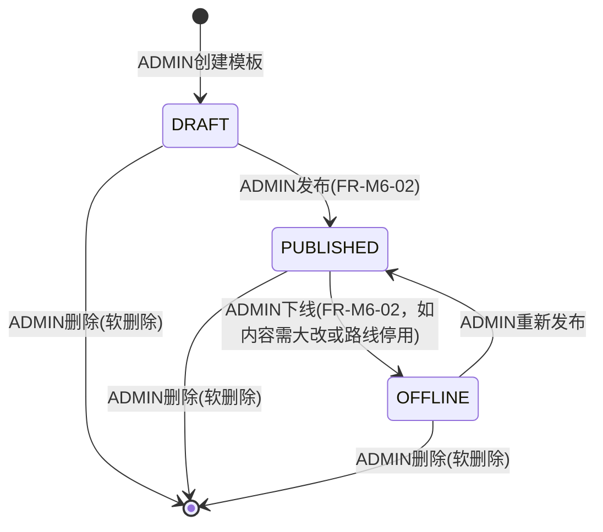
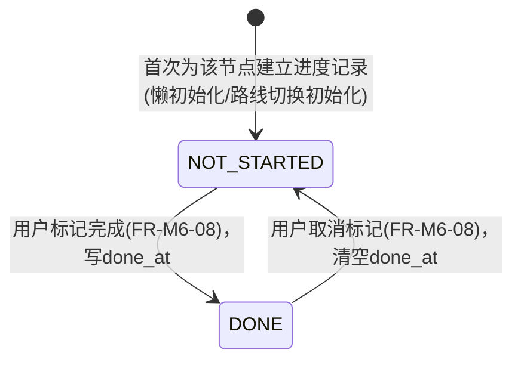

# 06 模块 M6 成长时间线 详细设计

> ⚠️ 本文为 v3 设计基线。实现已按 **v3.1 reconcile** 收敛，字段/接口/状态机差异**以 `backend/src/main/resources/schema.sql` 与 `docs/impl/00c_静态审查报告.md` 第五节为准**；本文与实现冲突处以后者为权威。见 [[09_设计修订说明]]。

> 对齐基线：[[00_总体架构与技术设计]]（技术选型 §1、全局数据模型 §3、全局API规范 §4、角色与权限矩阵 §5、界面清单 §6、命名与术语表 §9）。本文件字段、接口、角色代码均与地基文档严格一致，不重复定义地基已裁决的全局规则，仅在必要处引用；`student_profile`（M2 §3.1 已给出完整字段）、`alumni_path_card`（M2）、`knowledge_entry`（M3）、`opportunity`（M5）等他模块表只读引用其既有定义，不重复设计。

---

## 1. 模块职责与边界

M6 负责把"专业 × 发展路线"的成长规划从一份静态导览图，升级为一份持续对照真实时间、主动提醒的**动态成长导航**：按 `major_tag_id × route_type`（`UNDECIDED`/`POSTGRAD`/`EMPLOY`/`COMPETITION`/`CIVIL`）维护时间线模板 `timeline_template`；模板下按学期阶段（`stage`）与建议完成时点（`suggested_time`）编排有序节点 `timeline_node`；节点若需引导用户查看具体的经验、路径或机会，只通过 `timeline_node_ref` 存 `(ref_type, ref_id)` 只读引用 M2 校友路径卡、M3 知识条目、M5 机会，绝不复制其正文；每个在校生对每个节点各自维护一条个人进度 `user_progress`（`NOT_STARTED`/`DONE`）。本模块的核心差异化能力是把"当前日期"与"按入学年份换算出的建议截止日期"逐节点比对，自动识别已逾期未完成的节点，并按逾期时长、节点重要度、与当前学期的邻近度综合算出"补救优先级"排序，供 P16 页面与首页仪表盘消费，实现"看路径、查经验、问问题、找机会、跟时间线"里"跟时间线"这一环。

**明确不做**：
- 不做在校生画像、专业/年级/入学年份本身的存储与维护（M1/M2），本模块只读 `student_profile.major_tag_id`/`enroll_year` 作为模板解析与学期换算的输入，不写入这两个字段。
- 不做校友路径卡、知识条目、机会本身的内容存储、状态机流转与可见性计算（M2/M3/M5），本模块只存它们的 `(ref_type, ref_id)`，展示时调用各自模块暴露的只读摘要方法（`getVisiblePathCard`/`getBrief`/`getBrief`），不复制、不缓存其正文字段。
- 不做时间线模板/节点的人工审核流程：本模块模板由 ADMIN 直接维护并发布，不经过 M7 审核队列，区别于 M3 知识候选、M5 机会的审核模式——因为模板的作者本身就是治理方（ADMIN），不存在"内容提交者 vs 独立审核者"的二元角色，故 `timeline_template` 只有简单的 `DRAFT/PUBLISHED/OFFLINE` 自助发布态，无需 `audit_task`。
- 不做成长标签体系维护：`route_type` 是本模块内部专属的封闭枚举（4 条分化路线 + 1 条默认线），与 M2 `alumni_path_card.destination_type`、M4 `tag(type=GROWTH)` 语义相关但不共用同一取值域——后两者描述"已发生的去向"或"求助的目标方向"，本模块描述"正在进行中、有时间刻度的成长路线"，服务对象与生命周期不同，不做强行复用。
- 不覆盖研究生/博士阶段的成长导航：`timeline_node.stage` 只覆盖本科四年共 8 个学期（大一上~大四下）；已升学为研究生等非本科阶段的用户不在 P16 的服务范围内（前端提示"当前时间线仅覆盖本科阶段"）。
- 不做站内通知的呈现与列表（全局/M7），本模块仅作为"仍未决策路线的临界提醒""补救优先级预警"等通知的触发方之一负责写入。

---

## 2. 功能需求清单

| FR编号 | 功能名 | 角色 | 输入 | 处理逻辑 | 输出 | 优先级 |
|---|---|---|---|---|---|---|
| FR-M6-01 | 维护时间线模板 | ADMIN | majorTagId(可空)、routeType、name、description | 校验 `routeType` 合法枚举；`majorTagId` 为空表示全专业通用模板，Service 层查重同 `routeType` 下已存在的通用模板则拒绝（§6.2）→ 创建/编辑 `timeline_template`(status=DRAFT) | 模板详情 | Must |
| FR-M6-02 | 发布/下线时间线模板 | ADMIN | templateId、目标状态、reason(下线时) | 状态机流转校验（见§4.1）：仅 `DRAFT`/`OFFLINE` 可发布，仅 `PUBLISHED` 可下线 | 新状态 | Must |
| FR-M6-03 | 维护时间线节点 | ADMIN | templateId、stage、title、description、suggestedTime、orderNo、importance | 校验 `stage` 合法枚举、`suggestedTime∈[1,20]`；建议按§6.1约定的 stage 归属做软提示（非强校验）→ 增/改/删 `timeline_node` | 节点详情 | Must |
| FR-M6-04 | 维护节点关联引用 | ADMIN | nodeId、`[{refType, refId, refOrder}]` | 校验 `refType∈{ALUMNI_PATH_CARD,KNOWLEDGE_ENTRY,OPPORTUNITY}`；按 `refType` 调用对应模块 `existsXxx`/`getBrief` 校验 `refId` 存在，否则 40601 → 覆盖式重建 `timeline_node_ref` | 引用列表 | Must |
| FR-M6-05 | 查看我的成长时间线（动态导航聚合视图） | STUDENT | — | 解析当前专业/路线对应模板（§6.2）→ 首次访问且当前处于 `UNDECIDED` 覆盖学期时懒初始化进度（§6.6）→ 逐节点计算建议截止日期与是否逾期（§6.4）→ 聚合进度、逾期标记、总体完成率 | 时间线聚合 VO | Must |
| FR-M6-06 | 预览分化路线内容（决策前对比） | STUDENT | routeType | 只读解析该 `routeType` 对应模板节点列表，不写入任何 `user_progress` | 节点列表（不含个人进度） | Should |
| FR-M6-07 | 选择/切换发展路线 | STUDENT | routeType(∈{POSTGRAD,EMPLOY,COMPETITION,CIVIL}) | 解析目标模板（§6.2）→ 为其全部节点批量 upsert `user_progress(NOT_STARTED)`（已存在则保持不变，§6.3）| 切换结果 + 初始化节点数 | Must |
| FR-M6-08 | 标记/切换节点个人进度 | STUDENT | nodeId、status(NOT_STARTED/DONE) | 校验节点属于本人当前解析出的有效模板 → upsert `user_progress`，`DONE` 时写 `done_at`，回切 `NOT_STARTED` 时清空 | 进度详情 | Must |
| FR-M6-09 | 逾期节点动态判定（系统，随FR-05/FR-10触发，非独立入口） | 系统 | userId | 对每个 `NOT_STARTED` 节点按§6.4 换算建议截止日期并与当前日期比对，标记 `isOverdue`/`daysOverdue` | 逾期标记（嵌入FR-05返回体） | Must |
| FR-M6-10 | 生成补救优先级提示 | 系统 | userId | 对已逾期未完成节点按"逾期分档 × 节点重要度 + 学期邻近度加成"打分排序取 TopN（§6.5） | 补救优先级列表 | Must |
| FR-M6-11 | 查看整体完成度统计（个人视角） | STUDENT | — | 按当前有效模板统计 `总节点数/已完成数/完成率`，并按 `stage` 分组统计 | 完成度统计 | Should |
| FR-M6-12 | 查看专业级时间线完成度统计（供运营） | ADMIN | majorTagId、routeType | 聚合该 `major×route_type` 下全部用户的节点完成率分布，供 M7/首页仪表盘调用 | 统计 DTO | Could |
| FR-M6-13 | 节点引用计数只读查询（供他模块调用） | 系统 | refType、refId | 统计引用该对象的 `timeline_node_ref` 条数 | `count:long` | Should |

---

## 3. 数据表设计

> 说明：本模块四张表均含 `deleted TINYINT NN DEFAULT 0`、`created_at DATETIME NN DEFAULT CURRENT_TIMESTAMP`、`updated_at DATETIME NN DEFAULT CURRENT_TIMESTAMP ON UPDATE CURRENT_TIMESTAMP`（下表省略重复书写，末尾统一列出）。**均不加 `version` 乐观锁**：`timeline_template`/`timeline_node`/`timeline_node_ref` 只由 ADMIN 单一角色维护，不存在"内容编辑"与"他人并发写同一行"交织的场景（区别于地基§3点名的 `knowledge_entry`）；`user_progress` 只由用户本人写自己的记录，同一行不可能有第二个写者，故也不需要 CAS/乐观锁保护，直接 upsert 即可。所有状态/类型字段按地基§3约定用 `VARCHAR` + 后端枚举实现，不使用数据库原生 `ENUM` 类型。

### 3.1 `timeline_template`（时间线模板）

| 字段名 | 类型 | 长度 | 约束 | 默认 | 说明 |
|---|---|---|---|---|---|
| id | BIGINT | — | PK, AUTO_INCREMENT | — | 主键 |
| major_tag_id | BIGINT | — | FK→tag.id | NULL | 专业标签（`tag.tag_type=MAJOR`）；**NULL 表示"全专业通用模板"**，专供 `UNDECIDED` 默认线，及分化路线尚未逐专业定制时的兜底版本使用（解析算法见§6.2） |
| route_type | VARCHAR | 20 | NN | — | 枚举：`UNDECIDED`(未决策默认通用线)/`POSTGRAD`(考研)/`EMPLOY`(就业)/`COMPETITION`(竞赛)/`CIVIL`(考公) |
| name | VARCHAR | 100 | NN | — | 模板名称，如"计算机科学与技术—考研路线" |
| description | VARCHAR | 300 | NULL | — | 模板简介：适用人群、路线定位说明 |
| status | VARCHAR | 20 | NN | `DRAFT` | 枚举：`DRAFT`(草稿)/`PUBLISHED`(已发布，对学生可见)/`OFFLINE`(已下线)，见§4.1 |

唯一约束：`uk_major_route(major_tag_id, route_type)`（覆盖 `major_tag_id` 非 NULL 的场景）。`major_tag_id IS NULL` 的"全专业通用模板"因 MySQL 唯一索引不去重多个 NULL 值，由 Service 层保存前显式查重（同 `route_type` 下已存在一条 `major_tag_id IS NULL` 记录则拒绝新建，见§6.2 校验规则），与 M2 `alumni_path_card` 分支字段"数据库层无法表达、应用层兜底校验"同一处理原则。索引：`idx_route_status(route_type, status)` 供解析算法与列表筛选。

### 3.2 `timeline_node`（时间线节点）

| 字段名 | 类型 | 长度 | 约束 | 默认 | 说明 |
|---|---|---|---|---|---|
| id | BIGINT | — | PK, AUTO_INCREMENT | — | 主键 |
| template_id | BIGINT | — | FK→timeline_template.id, NN | — | 所属模板 |
| stage | VARCHAR | 20 | NN | — | 学期阶段枚举（对应本科 8 学期）：`FRESHMAN_FALL`(大一上)/`FRESHMAN_SPRING`(大一下)/`SOPHOMORE_FALL`(大二上)/`SOPHOMORE_SPRING`(大二下)/`JUNIOR_FALL`(大三上)/`JUNIOR_SPRING`(大三下)/`SENIOR_FALL`(大四上)/`SENIOR_SPRING`(大四下)。内容编排约定（Service 层软校验、非硬约束）：`UNDECIDED` 模板节点应落在 `FRESHMAN_FALL~SOPHOMORE_FALL`（大一共性任务：选课/社团/四六级/分流准备）；`POSTGRAD`/`EMPLOY`/`COMPETITION`/`CIVIL` 分化模板节点应落在 `SOPHOMORE_SPRING~SENIOR_SPRING`（呼应"分化路线到大二下、大三上才需选"） |
| title | VARCHAR | 100 | NN | — | 节点标题，如"完成本学期选课""四六级报名" |
| description | VARCHAR | 500 | NULL | — | 行动指引说明（节点自身文案，非对 M2/M3/M5 内容的复制） |
| suggested_time | SMALLINT | — | NN | — | 建议完成周次：该 `stage` 对应学期开学起第 N 周为建议完成时点，范围 `[1,20]`；配合 `stage` 与用户 `enroll_year` 换算出绝对建议截止日期（§6.4） |
| order_no | INT | — | NN | 0 | 同一 `stage` 内的展示顺序，数值越小越靠前（即节点的"order"属性） |
| importance | VARCHAR | 20 | NN | `RECOMMENDED` | 枚举：`KEY`(关键，必做)/`RECOMMENDED`(推荐，选做)；用于§6.5 补救优先级打分的权重维度 |

索引：`idx_template_stage(template_id, stage, order_no)` 供按模板取节点并排序渲染。

### 3.3 `timeline_node_ref`（节点关联，只存引用）

| 字段名 | 类型 | 长度 | 约束 | 默认 | 说明 |
|---|---|---|---|---|---|
| id | BIGINT | — | PK, AUTO_INCREMENT | — | 主键 |
| node_id | BIGINT | — | FK→timeline_node.id, NN | — | 所属节点 |
| ref_type | VARCHAR | 20 | NN | — | 枚举：`ALUMNI_PATH_CARD`(引用 M2 校友路径卡)/`KNOWLEDGE_ENTRY`(引用 M3 知识条目)/`OPPORTUNITY`(引用 M5 机会) |
| ref_id | BIGINT | — | NN | — | 被引用对象主键（按 `ref_type` 分别对应 `alumni_path_card.id`/`knowledge_entry.id`/`opportunity.id`）；**跨表引用，不建数据库级 FK**，存在性由应用层按 `ref_type` 分别调用对应模块 Service 校验（与 M4 `notification.ref_id` 同一处理方式） |
| ref_order | SMALLINT | — | NN | 1 | 同一节点下多条引用的展示顺序 |

唯一约束：`uk_node_ref(node_id, ref_type, ref_id)`，避免重复引用同一对象。

### 3.4 `user_progress`（个人进度）

| 字段名 | 类型 | 长度 | 约束 | 默认 | 说明 |
|---|---|---|---|---|---|
| id | BIGINT | — | PK, AUTO_INCREMENT | — | 主键 |
| user_id | BIGINT | — | FK→user.id, NN | — | 用户（STUDENT） |
| node_id | BIGINT | — | FK→timeline_node.id, NN | — | 对应节点 |
| status | VARCHAR | 20 | NN | `NOT_STARTED` | 枚举：`NOT_STARTED`(未开始)/`DONE`(已完成)，见§4.2 |
| done_at | DATETIME | — | NULL | — | 标记完成时间；`status` 由 `DONE` 切回 `NOT_STARTED` 时清空 |

唯一约束：`uk_user_node(user_id, node_id)`（同一用户对同一节点仅一条当前进度记录，upsert 语义，与 M3 `knowledge_feedback` 一致）。索引：`idx_user_status(user_id, status)` 供§6.4/6.5 逾期与补救算法批量查询本人未完成节点。

---

## 4. 状态机

本模块含两条独立、轻量的状态流转：模板发布态（ADMIN 维护）、个人进度态（用户自助勾选）。`timeline_node`/`timeline_node_ref` 无独立状态机，其可见性完全跟随所属 `timeline_template.status`（非 `PUBLISHED` 模板下的节点不对学生可见）。

### 4.1 `timeline_template.status`



约束：仅 `status=PUBLISHED` 的模板参与§6.2模板解析与学生可见；`DRAFT`/`OFFLINE` 模板及其节点仅 ADMIN 可预览编辑，不出现在 FR-M6-05/06 的解析结果中。

### 4.2 `user_progress.status`



约束：双向可切换，无终态；节点若已逾期（§6.4）但用户随后补做并标记 `DONE`，该节点立即退出§6.5补救优先级列表（判定条件为 `status=NOT_STARTED`）。

---

## 5. API 接口清单

统一响应体 `{code, message, data}`；分页响应 `data: {records, total, page, size}`；鉴权按角色 + 资源属主（后端 `@PreAuthorize` 接口级鉴权）。

**模板/节点/引用维护（ADMIN）**

| 方法 | 路径 | 说明 | 关键入参 | 返回data结构 | 所需角色 |
|---|---|---|---|---|---|
| GET | /api/v1/timeline-templates | 模板列表 | majorTagId?, routeType?, status?, page, size | {records, total, page, size} | ADMIN |
| POST | /api/v1/timeline-templates | 新建模板(默认DRAFT) | majorTagId?, routeType, name, description | TimelineTemplateVO | ADMIN |
| PUT | /api/v1/timeline-templates/{id} | 编辑模板基本信息 | name, description | TimelineTemplateVO | ADMIN |
| PATCH | /api/v1/timeline-templates/{id}/publish | 发布 | — | {status} | ADMIN |
| PATCH | /api/v1/timeline-templates/{id}/offline | 下线 | reason | {status} | ADMIN |
| DELETE | /api/v1/timeline-templates/{id} | 软删除模板 | — | null | ADMIN |
| GET | /api/v1/timeline-templates/{id}/nodes | 查看模板节点列表(按stage+orderNo排序) | — | List\<TimelineNodeVO\> | ADMIN/STUDENT(仅PUBLISHED) |
| POST | /api/v1/timeline-templates/{id}/nodes | 新增节点 | stage, title, description, suggestedTime, orderNo, importance | TimelineNodeVO | ADMIN |
| PUT | /api/v1/timeline-nodes/{id} | 编辑节点 | 同上 | TimelineNodeVO | ADMIN |
| DELETE | /api/v1/timeline-nodes/{id} | 软删除节点 | — | null | ADMIN |
| GET | /api/v1/timeline-nodes/{id}/refs | 查看节点关联引用 | — | List\<TimelineNodeRefVO\> | ADMIN/STUDENT(仅PUBLISHED) |
| PUT | /api/v1/timeline-nodes/{id}/refs | 覆盖式更新节点关联引用 | List\<{refType, refId, refOrder}\> | List\<TimelineNodeRefVO\> | ADMIN |
| GET | /api/v1/timeline-stats/by-major | 专业级完成度统计（供运营） | majorTagId, routeType | MajorTimelineStatsVO | ADMIN |

**学生端时间线（STUDENT）**

| 方法 | 路径 | 说明 | 关键入参 | 返回data结构 | 所需角色 |
|---|---|---|---|---|---|
| GET | /api/v1/timeline/me | 查看我的成长时间线（动态导航聚合视图） | — | MyTimelineVO{majorTagId, routeType, stages:[{stage, nodes:[{node, progressStatus, suggestedDate, isOverdue, daysOverdue}]}], overallProgress:{totalNodes,doneNodes,percentage}} | STUDENT |
| GET | /api/v1/timeline/me/summary-card | 首页仪表盘摘要卡 | — | {routeType, overallPercentage, topRemediationHint} | STUDENT |
| GET | /api/v1/timeline/route-preview | 预览某分化路线内容（决策前对比） | routeType | List\<TimelineNodeVO\>（不含个人进度） | STUDENT |
| PATCH | /api/v1/timeline/me/route | 选择/切换发展路线 | routeType | {routeType, initializedNodeCount} | STUDENT |
| PATCH | /api/v1/timeline-nodes/{id}/progress | 标记/切换节点个人进度 | status(NOT_STARTED/DONE) | UserProgressVO | STUDENT |
| GET | /api/v1/timeline/me/remediation | 查看补救优先级提示列表 | — | List\<RemediationHintVO{node, suggestedDate, daysOverdue, priorityTier, priorityScore}\> | STUDENT |
| GET | /api/v1/timeline/me/progress-summary | 查看整体完成度统计（按stage分组） | — | {overallProgress, byStage:[{stage,totalNodes,doneNodes}]} | STUDENT |

**错误码（本模块在全局分段内的具体值）**：
- `20601` 参数校验：`routeType` 非合法枚举
- `20602` 参数校验：`stage` 非合法枚举 / `suggestedTime` 超出 `[1,20]` / `orderNo` 为负
- `30601` 业务规则：该 `major_tag_id × route_type` 组合尚未配置 `PUBLISHED` 模板
- `30602` 业务规则：模板/节点当前非 `PUBLISHED` 状态，非 ADMIN 不可查看
- `30603` 业务规则：`routeType=UNDECIDED` 不可通过"选择/切换路线"接口提交（`UNDECIDED` 为系统默认态，不可由用户主动选入）
- `40601` 资源不存在：模板/节点/引用不存在或已删除，或引用的 `ref_id` 在对应模块不存在

---

## 6. 关键算法与业务规则

### 6.1 学期日历换算（stage + enrollYear → 绝对日期）

```
// 学期起始月日常量（秋季学期9月1日，春季学期3月1日）
TERM_START = { FALL: (month=9, day=1), SPRING: (month=3, day=1) }

// 每个 stage 相对 enrollYear 的年份偏移与所属学期（秋/春）
STAGE_META = {
  FRESHMAN_FALL:    { yearOffset: 0, term: FALL   },
  FRESHMAN_SPRING:  { yearOffset: 1, term: SPRING },
  SOPHOMORE_FALL:   { yearOffset: 1, term: FALL   },
  SOPHOMORE_SPRING: { yearOffset: 2, term: SPRING },
  JUNIOR_FALL:      { yearOffset: 2, term: FALL   },
  JUNIOR_SPRING:    { yearOffset: 3, term: SPRING },
  SENIOR_FALL:      { yearOffset: 3, term: FALL   },
  SENIOR_SPRING:    { yearOffset: 4, term: SPRING },
}

function termStartDateOf(stage, enrollYear):
    meta = STAGE_META[stage]
    (month, day) = TERM_START[meta.term]
    return Date(enrollYear + meta.yearOffset, month, day)

function computeSuggestedDate(stage, suggestedTime, enrollYear):
    // suggestedTime: 该学期开学起第N周(1起)为建议完成时点
    return termStartDateOf(stage, enrollYear) + (suggestedTime - 1) * 7 天

function currentStageOf(today, enrollYear):
    // 反查today落在8个学期窗口的哪一个；早于FRESHMAN_FALL起点则钳位为FRESHMAN_FALL，
    // 晚于SENIOR_SPRING窗口结束(约半年后)则视为"已毕业/超龄"，不进入本模块服务范围
    stages = [FRESHMAN_FALL...SENIOR_SPRING]  // 按 termStartDateOf 升序
    for i in range(stages except last):
        if termStartDateOf(stages[i], enrollYear) <= today < termStartDateOf(stages[i+1], enrollYear):
            return stages[i]
    if today < termStartDateOf(FRESHMAN_FALL, enrollYear): return FRESHMAN_FALL
    if today >= termStartDateOf(SENIOR_SPRING, enrollYear) + 6个月: return GRADUATED  // 超出服务范围
    return SENIOR_SPRING
```

### 6.2 模板解析（major × route_type → 具体模板，含通用兜底）

```
function resolveTemplate(majorTagId, routeType):
    specific = SELECT * FROM timeline_template
               WHERE major_tag_id = majorTagId AND route_type = routeType
                 AND status = 'PUBLISHED' AND deleted = 0
    if specific 存在: return specific
    generic = SELECT * FROM timeline_template
              WHERE major_tag_id IS NULL AND route_type = routeType
                AND status = 'PUBLISHED' AND deleted = 0
    if generic 存在: return generic
    throw BizError(30601)   // 该专业该路线尚未配置且无通用兜底

// 模板维护时的查重（FR-M6-01，专为NULL场景补DB唯一索引之不足）
function validateUniqueOnCreate(majorTagId, routeType):
    if majorTagId is NULL:
        exists = SELECT COUNT(*) FROM timeline_template
                 WHERE major_tag_id IS NULL AND route_type=routeType AND deleted=0
        if exists > 0: throw BizError(30001-同名占用, 提示"该路线已存在全专业通用模板")
    // majorTagId非空场景由 uk_major_route 数据库唯一索引兜底，命中重复插入直接转标准错误提示
```

### 6.3 路线解析与切换（不新增第5张表，借 `user_progress` 批次隐式记录当前路线）

设计要点：`UNDECIDED` 模板节点固定落在 `FRESHMAN_FALL~SOPHOMORE_FALL`，4 条分化模板节点固定落在 `SOPHOMORE_SPRING~SENIOR_SPRING`（§3.2 编排约定），二者学期区间不重叠，因此"用户当前生效的分化路线"可以直接由其 `user_progress` 记录关联到的模板 `route_type` 反查得到，无需为"当前路线"单独建表：

```
function resolveConfirmedRoute(userId):
    // 取该用户名下"非UNDECIDED"模板中，最近一次建立进度记录的 route_type
    row = SELECT tt.route_type
          FROM user_progress up
          JOIN timeline_node tn ON up.node_id = tn.id
          JOIN timeline_template tt ON tn.template_id = tt.id
          WHERE up.user_id = userId AND up.deleted = 0 AND tt.route_type != 'UNDECIDED'
          ORDER BY up.created_at DESC LIMIT 1
    return row?.route_type  // null 表示尚未选择分化路线，仍处于/停留在 UNDECIDED

function resolveEffectiveRouteAndTemplate(userId, student):
    currentStage = currentStageOf(today(), student.enrollYear)
    if currentStage IN {FRESHMAN_FALL, FRESHMAN_SPRING, SOPHOMORE_FALL}:
        routeType = 'UNDECIDED'   // 尚在共性阶段，恒定使用默认线，不理会是否已提前选择分化路线之外的情况
    else:
        confirmed = resolveConfirmedRoute(userId)
        routeType = confirmed ?: null   // null 表示"已到决策窗口但用户仍未选择"，前端提示"请选择发展路线"
    if routeType is null: return {routeType: null, template: null}
    template = resolveTemplate(student.majorTagId, routeType)
    return {routeType, template}

// FR-M6-07 选择/切换发展路线
function confirmRoute(userId, routeType):
    if routeType == 'UNDECIDED': throw BizError(30603)   // UNDECIDED不可被主动选入，仅为系统默认态
    student = studentProfileService.getProfile(userId)   // M2只读
    template = resolveTemplate(student.majorTagId, routeType)  // 找不到则30601
    nodes = timelineNodeMapper.listByTemplate(template.id)
    @Transactional:
        for node in nodes:
            upsert user_progress(userId, node.id) 若不存在则 INSERT(status='NOT_STARTED')
                                                    若已存在则跳过(保留原有进度,支持"回头再选同一路线"幂等)
    return {routeType, initializedNodeCount: nodes.size}
    // 注：允许用户先后选择不同分化路线(如POSTGRAD后改EMPLOY)，旧路线的user_progress历史记录不删除、
    // 仅不再被 resolveConfirmedRoute 的"最近一条"规则选中，作为个人历史轨迹保留，不影响解析正确性
```

### 6.4 建议时间换算与逾期判定（动态比对核心）

```
function annotateOverdue(node, progressStatus, student):
    if progressStatus == 'DONE': return { isOverdue: false, daysOverdue: 0 }
    suggestedDate = computeSuggestedDate(node.stage, node.suggestedTime, student.enrollYear)
    daysOverdue = daysBetween(suggestedDate, today())
    return {
        suggestedDate,
        isOverdue: daysOverdue > 0,
        daysOverdue: max(daysOverdue, 0)
    }

// FR-M6-05 聚合视图组装
function getMyTimeline(userId):
    student = studentProfileService.getProfile(userId)
    {routeType, template} = resolveEffectiveRouteAndTemplate(userId, student)
    if template is null:
        return { routeType: null, needsRouteDecision: true }   // 提示"请选择发展路线"
    if routeType == 'UNDECIDED' and 该用户从未有过 UNDECIDED 模板的 user_progress 记录:
        lazyInitProgress(userId, template)   // §6.6 首次访问懒初始化
    nodes = timelineNodeMapper.listByTemplate(template.id)  // 按 stage, order_no 排序
    progressMap = userProgressMapper.mapByUser(userId)      // node_id -> {status, doneAt}
    stages = groupBy(nodes, node.stage)
    result = []
    for (stage, stageNodes) in stages (按stage自然学期顺序):
        items = []
        for node in stageNodes:
            progress = progressMap.get(node.id) ?: {status:'NOT_STARTED'}
            overdueInfo = annotateOverdue(node, progress.status, student)
            items.append({node, progressStatus: progress.status, ...overdueInfo})
        result.append({stage, nodes: items})
    overallProgress = { totalNodes: nodes.size,
                         doneNodes: count(progressMap where status='DONE'),
                         percentage: round(doneNodes/totalNodes, 2) }
    return { majorTagId: student.majorTagId, routeType, stages: result, overallProgress }
```

### 6.5 补救优先级算法（逾期分档 × 节点重要度 + 学期邻近度）

```
// 逾期分档基础分（越紧迫分越高，但过久未做的"陈年旧账"权重收敛，避免无意义地霸榜）
function urgencyTier(daysOverdue):
    if daysOverdue <= 14:  return {tier:'URGENT',  base:100}
    if daysOverdue <= 60:  return {tier:'HIGH',    base:70}
    if daysOverdue <= 180: return {tier:'MEDIUM',  base:40}
    return {tier:'LOW', base:10}   // 超过半年，标注"补救窗口可能已过，建议评估是否仍需操作"

IMPORTANCE_WEIGHT = { KEY: 1.5, RECOMMENDED: 1.0 }
RECENCY_BONUS = 10   // 节点所属stage为当前stage或上一个stage时的加成

function computeRemediation(userId):
    student = studentProfileService.getProfile(userId)
    {routeType, template} = resolveEffectiveRouteAndTemplate(userId, student)
    if template is null: return []
    currentStage = currentStageOf(today(), student.enrollYear)
    previousStage = stageBefore(currentStage)
    nodes = timelineNodeMapper.listByTemplate(template.id)
    progressMap = userProgressMapper.mapByUser(userId)
    hints = []
    for node in nodes:
        progress = progressMap.get(node.id) ?: {status:'NOT_STARTED'}
        if progress.status == 'DONE': continue
        overdueInfo = annotateOverdue(node, progress.status, student)
        if not overdueInfo.isOverdue: continue         // 只处理已逾期未完成节点
        tier = urgencyTier(overdueInfo.daysOverdue)
        recency = (node.stage == currentStage or node.stage == previousStage) ? RECENCY_BONUS : 0
        score = tier.base * IMPORTANCE_WEIGHT[node.importance] + recency
        hints.append({ node, suggestedDate: overdueInfo.suggestedDate,
                        daysOverdue: overdueInfo.daysOverdue,
                        priorityTier: tier.tier, priorityScore: score })
    sortDesc(hints, by=priorityScore, tieBreak=[daysOverdue ASC, node.orderNo ASC])
    return hints.take(TOP_N = 5)   // 首页/P16提示区仅展示前5条，避免信息过载
```

### 6.6 首次访问懒初始化（UNDECIDED 默认线）

```
function lazyInitProgress(userId, undecidedTemplate):
    nodes = timelineNodeMapper.listByTemplate(undecidedTemplate.id)
    @Transactional:
        for node in nodes:
            INSERT IGNORE user_progress(userId, node.id, status='NOT_STARTED')
    // 学生首次打开P16即自动获得一份"通用大一时间线"，无需任何前置操作，
    // 呼应"大一新生不该被迫先选考研/就业才能用时间线"的产品裁决
```

### 6.7 节点引用计数（供 M2/M3/M5 详情页调用）

```
function countByRef(refType, refId):
    return SELECT COUNT(*) FROM timeline_node_ref
           WHERE ref_type = refType AND ref_id = refId AND deleted = 0
    // 供 M3 P09"该知识被N个时间线节点引用"、M2/M5 同类展示调用，本模块只做只读聚合，
    // 不感知调用方展示逻辑
```

---

## 7. 界面设计

### P16 成长时间线（未决策默认/分化路线，角色 STUDENT，归属 M6）

- **布局要素**（仪表盘化、结构化时间轴，非信息流）：
  - 顶部路线状态卡：展示当前专业（只读带入）与当前生效路线（`UNDECIDED` 显示"通用成长线"；已选路线显示对应中文名）；若 `currentStage` 已进入 `SOPHOMORE_SPRING` 及以后且仍未选择分化路线，展示醒目提示条"该确定你的发展方向了"+"选择路线"按钮。
  - 补救优先级提示区（独立醒目卡片区，红/橙色分级标签）：展示 §6.5 计算出的 TopN 已逾期节点，每条标注"已逾期N天"+ `priorityTier` 标签 + "去完成"跳转按钮。
  - 时间线主体：按 `stage`（大一上→大四下）分组的横向/纵向阶段轴，每个 stage 下按 `order_no` 排列节点卡片；每卡展示 `title`/`description`/建议完成周次对应的具体日期区间/进度勾选框（`NOT_STARTED`↔`DONE` 切换）/逾期红点标记；若节点带 `timeline_node_ref`，展示"查看考研经验"/"参考校友路径"/"关注该机会"等 chips，点击跳转对应模块详情页。
  - 路线预览/切换入口：未决策用户可点击"对比查看四条路线"预览分化模板内容（不写入个人进度）；已选路线用户仍可"更换路线"（二次确认弹窗，提示"原路线进度将保留为历史记录，不会丢失"）。
  - 顶部/侧边总体进度条：展示 §6.4/FR-M6-11 的总节点完成率与分阶段完成率。
- **关键交互**：勾选/取消勾选进度实时 PATCH 并刷新逾期与补救提示区；点击关联引用 chip 跳转对应模块详情页，不在本页做业务操作；`SOPHOMORE_FALL` 及以前的节点若逾期未完成，仍展示但不进入"补救优先级"TopN（由§6.5的 `LOW` 分档与学期邻近度共同压低排序），避免过度打扰。
- **校验规则**：`selectRoute` 提交的 `routeType` 必须是 4 个分化枚举之一（`UNDECIDED` 不可提交）；节点进度切换仅限本人当前解析出的有效模板下的节点，跨模板/他人节点操作返回 40601。
- **跳转去向**：`KNOWLEDGE_ENTRY` 引用 → P09；`ALUMNI_PATH_CARD` 引用 → P06；`OPPORTUNITY` 引用 → P14；"选择路线"确认后停留本页刷新。
- **负责人**：[占位]

> 模板/节点/引用的维护界面挂载于 P18 管理后台（见 M7 文档），Controller 归属 M7 路由分组但复用本模块 Service Bean，与 M1/M3/M5 终审类接口同一模式；P16 本身严格遵守"仪表盘化、无信息流"纪律——以阶段结构 + 补救提示为主入口，不做时间倒序的无差别信息流。

---

## 8. 与其他模块的接口

**M6 依赖谁**：
- M1：`UserService.isVerified(userId)`/`getRole(userId)` 校验个人时间线相关接口的前置条件（须 STUDENT 且已认证）。
- M2：`StudentProfileService.getProfile(userId)` 只读获取 `majorTagId`/`enrollYear`，供模板解析（§6.2）与学期日历换算（§6.1）；`AlumniPathCardService.getVisiblePathCard(pathCardId, viewerId)`（M2 §8 已声明"供 M6 节点引用"）渲染 `ALUMNI_PATH_CARD` 引用摘要；`AlumniPathCardService.getMajorDestinationStats`（M2 §8 已声明"供M6/首页仪表盘调用"）可选用于节点旁展示去向速览。
- M3：`KnowledgeEntryService.getBrief(id)`/`existsPublished(id)`（M3 §8 已声明"供 M6/搜索聚合等轻量只读引用"）渲染 `KNOWLEDGE_ENTRY` 引用摘要与新增引用时的存在性校验。
- M5：`OpportunityService.getBrief(id)`（M5 §8 已声明"供 M6/首页仪表盘只读引用"）渲染 `OPPORTUNITY` 引用摘要与存在性校验。
- 全局 `tag`：只读校验 `major_tag_id`（模板维护时）合法性。

**被谁依赖**：
- M2/M3/M5：详情页展示"被 N 个成长时间线节点引用"时调用本模块 `TimelineNodeRefService.countByRef(refType, refId)`（§6.7），例如 M3 §7 P09 "只读展示该知识被 N 个成长时间线节点引用（调用 M6 提供的只读计数接口）"正是此契约。
- M7：运营数据统计（P18）调用本模块 `getMajorTimelineStats` 展示各专业时间线完成度；模板/节点/引用的维护类接口挂在 M7 管理后台路由分组但复用本模块 Service。
- 双圈首页仪表盘（视图层）：调用 `getMySummaryCard(userId)` 展示"我的成长时间线进度"卡片（呼应地基§7"跟时间线"这一目标导向环节）。

**对外暴露的 Service 方法签名（Java）**：

```java
public interface TimelineTemplateService {
    TimelineTemplateDTO create(Long adminId, CreateTimelineTemplateRequest request);
    TimelineTemplateDTO update(Long id, Long adminId, UpdateTimelineTemplateRequest request);
    TimelineTemplateDTO publish(Long id, Long adminId);
    TimelineTemplateDTO offline(Long id, Long adminId, String reason);
    void delete(Long id, Long adminId);
    PageResult<TimelineTemplateDTO> page(TimelineTemplateQuery query);
    TimelineTemplateDTO resolve(Long majorTagId, String routeType);   // §6.2 解析，含通用兜底
    MajorTimelineStatsDTO getMajorTimelineStats(Long majorTagId, String routeType);  // 供 M7/首页仪表盘
}

public interface TimelineNodeService {
    TimelineNodeDTO createNode(Long templateId, Long adminId, CreateTimelineNodeRequest request);
    TimelineNodeDTO updateNode(Long id, Long adminId, UpdateTimelineNodeRequest request);
    void deleteNode(Long id, Long adminId);
    List<TimelineNodeDTO> listNodesOfTemplate(Long templateId);
}

public interface TimelineNodeRefService {
    List<TimelineNodeRefDTO> listRefs(Long nodeId);
    void replaceRefs(Long nodeId, Long adminId, List<NodeRefItem> refs);
    long countByRef(String refType, Long refId);   // 供 M2/M3/M5 详情页调用展示"被N个节点引用"
}

public interface UserProgressService {
    MyTimelineDTO getMyTimeline(Long userId);                          // §6.4 聚合视图
    TimelineSummaryCardDTO getMySummaryCard(Long userId);              // 供首页仪表盘
    RouteConfirmResultDTO confirmRoute(Long userId, String routeType); // §6.3
    List<TimelineNodeDTO> previewRoute(Long userId, String routeType); // FR-M6-06，不写入进度
    UserProgressDTO markProgress(Long nodeId, Long userId, String status);
    List<RemediationHintDTO> getRemediationHints(Long userId);         // §6.5
    ProgressSummaryDTO getProgressSummary(Long userId);                // FR-M6-11
}
```

---

## 9. 编码实现要点

- **Controller**：`TimelineTemplateController`（模板 CRUD + `publish`/`offline`，`@PreAuthorize("hasRole('ADMIN')")`，挂载于 M6 自身路由，非审核类"终审"接口，无需像 M3/M5 那样挂靠 M7 目录——权限矩阵"维护…时间线模板…"本就是 ADMIN 自有维护能力）、`TimelineNodeController`（节点 CRUD）、`TimelineNodeRefController`（引用维护）、`TimelineTemplateStatsController`（`by-major` 统计）、`MyTimelineController`（`/timeline/me` 系列聚合、路线预览/切换、进度标记、补救提示，`@PreAuthorize("hasRole('STUDENT')")`）。均只做参数校验与转发，不含业务规则。
- **Service**：`TimelineTemplateServiceImpl`（CRUD、发布状态机、§6.2解析算法、§6.2NULL场景查重）；`TimelineNodeServiceImpl`（节点CRUD，`stage`/`suggestedTime`范围校验）；`TimelineNodeRefServiceImpl`（引用增删改+§6.7计数，按`ref_type`路由到`AlumniPathCardService`/`KnowledgeEntryService`/`OpportunityService`各自的`existsXxx`/`getBrief`做存在性校验，不越界直连其Mapper）；`UserProgressServiceImpl`（核心：§6.3路线解析切换、§6.4逾期比对、§6.5补救打分、§6.6懒初始化）；`TimelineCalendarUtil`（§6.1学期日历换算的纯函数工具类，独立可单元测试，不依赖数据库）。
- **Mapper**：`TimelineTemplateMapper`/`TimelineNodeMapper`/`TimelineNodeRefMapper`/`UserProgressMapper`，均继承 MyBatis-Plus `BaseMapper`，启用逻辑删除（`deleted`）；`UserProgressMapper` 自定义 `mapByUser(userId)` 一次性查出该用户全部进度供聚合视图批量比对，避免逐节点单条查询。
- **事务边界**：`confirmRoute()` 用 `@Transactional` 批量 `INSERT IGNORE` 该路线模板全部节点的 `user_progress`（§6.3），任一失败整体回滚；`markProgress()` 单条 upsert，无需事务包裹多表；模板 `publish`/`offline` 为单行状态 CAS，无需事务。
- **并发控制**：模板/节点/引用维护类操作用状态 CAS（`UPDATE ... WHERE id=? AND status=期望前置态`）防止重复发布/下线；`user_progress` 因"同一行只有本人一个写者"，用 `INSERT ... ON DUPLICATE KEY UPDATE` 语义的 upsert 即可，不需要乐观锁或状态 CAS。
- **越权防护**：`markProgress`/`getMyTimeline`/`confirmRoute`/`getRemediationHints` 均在 Service 层校验 `nodeId` 所属模板确为该用户当前 `resolveEffectiveRouteAndTemplate` 解出的模板，防止越权标记他人时间线或非当前生效路线下的节点进度。
- **跨模块只读调用**：渲染 `timeline_node_ref` 摘要与新增引用时的存在性校验，一律通过 `AlumniPathCardService.getVisiblePathCard`/`KnowledgeEntryService.getBrief,existsPublished`/`OpportunityService.getBrief` 调用，不直连对方 Mapper，保持地基"跨模块调用走 Service 接口"的低耦合约定。
- **定时任务**：本期不设强制定时任务——逾期判定与补救优先级均为 `GET /timeline/me`、`GET /timeline/me/remediation` 请求时按§6.1/6.4/6.5 实时计算（数据量小，单用户单次计算成本低）。若后续数据量增大，可预留 `@Scheduled` 每日预计算并写入缓存（如 Redis 或物化统计表）的扩展位，本期不实现。
- **无 `deleted` 之外的软状态歧义**：`timeline_template.status=OFFLINE` 与 `deleted=1` 语义不同——`OFFLINE` 是"内容仍在，暂不对学生展示"（ADMIN 可随时重新 `publish`），`deleted=1` 是"记录永久移除"，二者组合校验须在所有查询条件中显式区分（`WHERE deleted=0 AND status='PUBLISHED'`），避免混淆导致误判。
