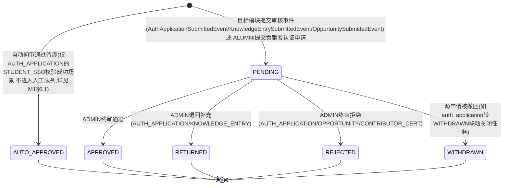
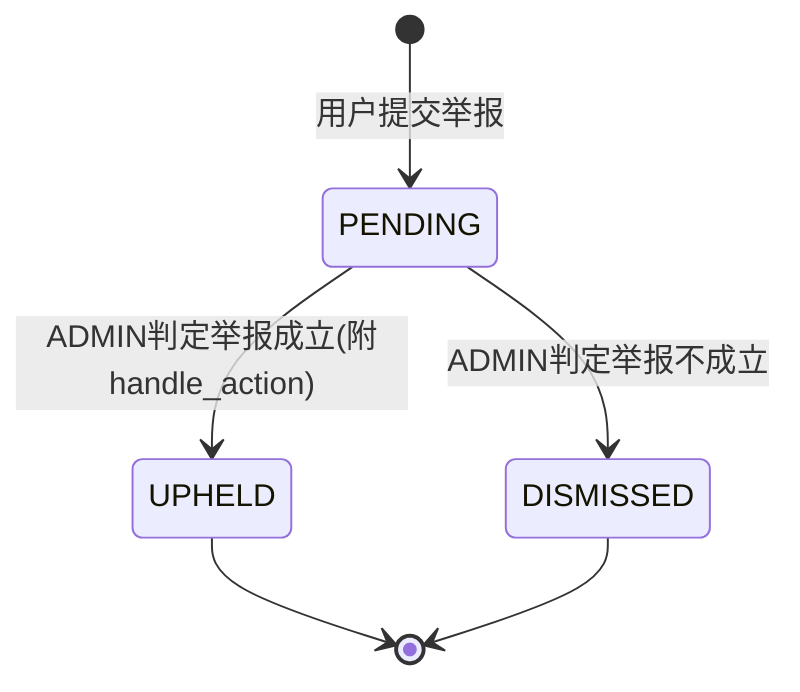
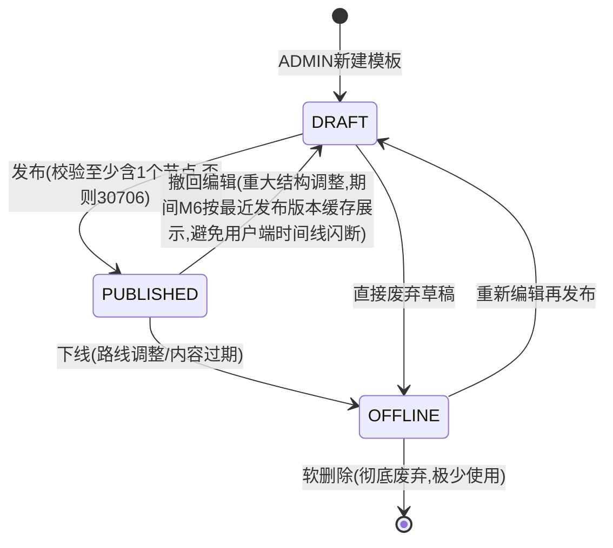

# 07 模块 M7 平台管理与内容治理 详细设计

> ⚠️ 本文为 v3 设计基线。实现已按 **v3.1 reconcile** 收敛，字段/接口/状态机差异**以 `backend/src/main/resources/schema.sql` 与 `docs/impl/00c_静态审查报告.md` 第五节为准**；本文与实现冲突处以后者为权威。见 [[09_设计修订说明]]。

> 对齐基线：[[00_总体架构与技术设计]]（技术选型 §1、全局数据模型 §3、全局API规范 §4、角色与权限矩阵 §5、界面清单 §6、命名与术语表 §9）。本文件字段、接口、角色代码均与地基文档严格一致。`auth_application`（M1）/`knowledge_entry`（M3）/`opportunity`（M5）/`alumni_path_card`/`alumni_profile`（M2）/`help_ticket`（M4）等他模块表本文件只受控调用其既有 Service 方法完成审核/治理动作，不重复设计字段（详见 [[01_M1_用户与认证_详细设计]] [[02_M2_成长画像与校友路径_详细设计]] [[03_M3_经验知识库_详细设计]] [[03_M4_结构化求助_详细设计]] [[05_M5_机会与组队_详细设计]]）。`tag`（地基实体清单 #5）字段定义见 M2 §3.3，该文档已明确"维护端点（增删改）见 M7 详细设计"，本文件只设计其治理端 CRUD，不重复定义字段。`timeline_template`/`timeline_node`/`timeline_node_ref`（地基实体清单 #19-21，名义归属 M6）因 M6 详细设计尚未落笔，本文件按治理端"维护"视角先行给出字段级设计供两模块对齐，M6 落笔时以此为准、不重复定义；`timeline_node_ref` 只做维护态的"关联/取消关联"设计，节点的"当前时间 vs 建议时间比对""补救优先级"等运行时消费逻辑属 M6 设计范围，本文件不涉及；`user_progress`（#22）纯属 M6 运行时数据，与治理端维护无关，本文件不设计。

---

## 1. 模块职责与边界

M7 是全平台的治理与运营中枢，只服务 `ADMIN` 角色、只对应页面 P18（管理后台）。职责收敛为四类：①**统一审核**——用一张队列表 `audit_task` 承接 M1 认证申请、M3 知识候选、M5 机会发布、本模块贡献者认证四类终审动作，对认证申请提供"自动初审+边缘案例转人工"的留痕与人工终审入口，对知识候选提供"三秒可判断"隐私 checklist 与结构化字段自动预检，并统一提供批量通过/退回；②**举报受理**——统一举报入口 `report`，按目标类型分发调用 M2/M3/M4/M5/M1 已暴露的下架/下线/封禁能力，不重复实现内容治理动作本身；③**基础数据维护**——标签体系（`tag`）的增删改、时间线模板与节点（`timeline_template`/`timeline_node`/`timeline_node_ref`）的维护、机会官方内容的直接发布入口（复用 M5 既有 CRUD，不新增字段）；④**运营统计与贡献者激励**——聚合各模块只读指标产出运营看板，定义并度量"高峰期最大日审核吞吐量"非功能指标，承接贡献者认证材料的提交与审核（认证结果写回 M2 `alumni_profile`）。

**明确不做**：
- 不做认证核验、知识条目生命周期、机会状态机、路径卡可见性、求助路由等各模块自身的业务规则实现——本模块只在其"提交审核"节点接入统一队列，在其"终审"节点转发调用，业务判断权在各自模块（如 SSO 模拟核验算法在 M1、公共信息导航外链红线在 M3）。
- 不做求助单/回答/追问/机会/路径卡/知识条目内容本身的存储与展示（各归属模块），本模块只持有审核任务与举报单两张自有表，以及标签、时间线模板/节点三张治理端维护表。
- 不做队伍（`team`）的治理下架——本期举报范围收敛到公开可读内容（求助单/知识条目/路径卡/机会）与账号本身，队伍缺少既成的 ADMIN 强制下线能力（M5 `TeamService.end()` 仅限队长操作），队伍纠纷本期按人工线下协调处理，不纳入 `report.target_type` 枚举，避免设计出没有底层能力支撑的空中楼阁功能。
- 不做贡献者激励的自动化阈值判定（如"满 5 次自动发标识"）——本期为人工审核制，避免无人工把关的荣誉标识被刷量滥用，与"认证徽章被武器化"的治理红线一致。
- 不做标准理由模板的可视化维护界面——理由模板本期为后端常量枚举（§9 `ReasonTemplate`），随代码发布迭代，不做数据库表与前端维护页，避免为一个低频配置项引入额外表与界面（课程周期范围克制）。

---

## 2. 功能需求清单

| FR编号 | 功能名 | 角色 | 输入 | 处理逻辑 | 输出 | 优先级 |
|---|---|---|---|---|---|---|
| FR-M7-01 | 统一审核队列 | ADMIN | targetType（可选）、status（默认PENDING）、keyword、page、size | 按条件筛选 `audit_task`，聚合 `applicant_id` 对应 `UserDTO` 摘要与目标实体标题摘要（分别调用 M1/M3/M5 的 getSummary/getBrief） | 分页列表（附各 `targetType` 待处理数小计） | Must |
| FR-M7-02 | 审核任务详情 | ADMIN | taskId | 聚合 `audit_task` + 目标实体完整详情（调用对应模块 `getById`/`getDetail`）+ `pre_check_result` 预检提示 | 详情 VO | Must |
| FR-M7-03 | 认证申请人工终审 | ADMIN | taskId、decision(APPROVE/RETURN/REJECT)、reasonCode（可选）、comment | 校验 `target_type=AUTH_APPLICATION` 且 `status=PENDING` → CAS更新 `audit_task` → 调用 M1 `AuthApplicationService.approve/reject/returnForSupplement` | 审核结果 | Must |
| FR-M7-04 | 知识候选终审（隐私checklist驱动） | ADMIN | taskId、checklistResult{hasRealName,hasContact,hasLocatableCombo}、decision（仅三项均未勾选时ADMIN可选APPROVE/RETURN）、reasonCode（可选）、comment | 校验 `target_type=KNOWLEDGE_ENTRY` → 三项checklist任一勾选则**强制**忽略ADMIN传入的decision转RETURN+对应标准理由 → 调用 M3 `KnowledgeEntryService.approve/returnToCandidate` | 审核结果 | Must |
| FR-M7-05 | 知识候选自动完整性/隐私预检（系统触发） | 系统 | `audit_task` 创建事件（`target_type=KNOWLEDGE_ENTRY`） | 正则扫描 title+content 识别手机号/邮箱/微信QQ号/身份证号模式 + 结构化字段完整性校验（§6.2）→ 写入 `pre_check_result` | `pre_check_result`（供人工审核页预填checklist提示，不替代人工判断） | Must |
| FR-M7-06 | 批量通过 | ADMIN | targetType（仅KNOWLEDGE_ENTRY/OPPORTUNITY）、ids[]、comment（可选，缺省用标准模板） | 逐条独立事务执行 `decide(APPROVE)`；`AUTH_APPLICATION`/`CONTRIBUTOR_CERT` 类型直接拒绝批量操作（30702） | `{successCount, failCount, details[]}` | Must |
| FR-M7-07 | 批量退回 | ADMIN | targetType（仅KNOWLEDGE_ENTRY/OPPORTUNITY）、ids[]、reasonCode、comment（可选） | 同上，decision=RETURN/REJECT | `{successCount, failCount, details[]}` | Must |
| FR-M7-08 | 机会终审 | ADMIN | taskId、decision(APPROVE/REJECT)、comment | 校验 `target_type=OPPORTUNITY` 且 `status=PENDING` → 调用 M5 `OpportunityService.approve/reject` | 审核结果 | Must |
| FR-M7-09 | 提交举报 | 登录用户（含未认证，不含GUEST） | targetType、targetId、reasonType、description、evidenceUrls[] | 校验 targetType 合法枚举与 targetId 存在性（调用对应模块只读方法）→ 去重：同一 reporter 对同一 target 已有 `PENDING` 记录时合并更新说明而非新建（30707提示）→ 创建/更新 `report`（PENDING） | 举报结果 | Must |
| FR-M7-10 | 举报队列/详情（治理端） | ADMIN | status（可选）、targetType（可选）、page、size / reportId | 分页列表/聚合目标内容摘要 | 分页列表/详情VO | Must |
| FR-M7-11 | 处理举报 | ADMIN | reportId、decision(UPHELD/DISMISSED)、handleAction（UPHELD时必填）、handleComment | 校验 `status=PENDING` → CAS更新 `report` → `UPHELD` 时按 targetType 分发调用对应模块治理方法（§6.4） | 处理结果 | Must |
| FR-M7-12 | 查看我提交的举报记录 | 举报人 | status（可选）、page、size | 查询本人 `reporter_id=me` 的举报及处理结果 | 分页列表 | Should |
| FR-M7-13 | 标签维护（新增/编辑/停用） | ADMIN | tagType、tagName、parentId（可选）/ id+更新字段 / id（停用） | 校验 `uk_type_name_parent` 唯一（30704）→ 增/改/软删；停用被引用中的标签需二次确认（不强制阻止，只提示影响范围） | 标签详情/操作结果 | Must |
| FR-M7-14 | 标签管理列表（含使用计数） | ADMIN | tagType（可选）、keyword、page、size | 聚合各标签被 `user_tag`/`help_ticket` 等引用的次数（只读聚合，不改写来源表） | 分页列表 | Should |
| FR-M7-15 | 时间线模板维护 | ADMIN | name、majorTagId（可选）、routeType、gradeLevelFrom/To、description / id+version+更新字段 / id（发布/下线） | 创建/编辑（乐观锁）/ `DRAFT→PUBLISHED`（校验≥1个节点，§6.7）/ `PUBLISHED→OFFLINE` | 模板详情 | Must |
| FR-M7-16 | 时间线节点维护（含关联引用） | ADMIN | templateId、nodeName、gradeLevel、term、nodeType、suggestedAction、isKeyNode、sortOrder / nodeId+更新字段 / 删除 / refType+refId（关联） | 增/改/删节点（校验所属模板非OFFLINE，否则30705）；`attachNodeRef`/`detachNodeRef` 维护 `timeline_node_ref`（只存ID，不复制内容） | 节点详情/列表 | Must |
| FR-M7-17 | 机会内容管理入口 | ADMIN | 复用 M5 `POST/PUT /api/v1/opportunities` 表单字段 | P18 内嵌该入口，ADMIN 直接调用 M5 既有创建/编辑接口发布官方机会（`audit_status` 自动为 `APPROVED`，见M5 §6.1），不新增字段与接口 | 机会详情 | Should |
| FR-M7-18 | 申请贡献者认证 | ALUMNI（已认证） | honorCertUrl、note | 校验角色 ALUMNI 且 `auth_status=VERIFIED`（30709）→ 创建 `audit_task`(target_type=CONTRIBUTOR_CERT, target_id=userId, payload={honorCertUrl,note}, status=PENDING)；表单入口标注"预计耗时：约2分钟" | 申请结果 | Should |
| FR-M7-19 | 贡献者认证审核 | ADMIN | taskId、decision(APPROVE/REJECT)、comment | 校验 `target_type=CONTRIBUTOR_CERT` 且 `status=PENDING` → APPROVE：调用 M2 `AlumniProfileService.grantContributorBadge(userId, honorCertUrl)`；REJECT：仅记录理由并通知申请人 | 审核结果 | Should |
| FR-M7-20 | 运营数据统计看板 | ADMIN | dateFrom/dateTo（可选，默认近7日） | 聚合用户/认证/知识库/求助/机会/组队/举报核心指标（§6.6）+ 审核吞吐量趋势 | 统计VO | Must |
| FR-M7-21 | 定时任务：审核吞吐量快照与积压预警 | 系统 | — | 每日23:55按 target_type 统计当日已决策数与待处理积压，超阈值通知ADMIN群体（§6.5） | — | Should |

---

## 3. 数据表设计

统一约定（与地基§3一致）：所有表含 `deleted TINYINT NN DEFAULT 0`、`created_at DATETIME NN DEFAULT CURRENT_TIMESTAMP`、`updated_at DATETIME NN DEFAULT CURRENT_TIMESTAMP ON UPDATE CURRENT_TIMESTAMP`（下表省略重复书写，仅在末尾统一列出）。本模块表均非"多方并发编辑同一份内容"场景（审核/举报的流转均为单一ADMIN一次性决定，模板/节点为治理端低并发场景），状态类流转（审核决定、举报处理）统一用**状态 CAS**（`UPDATE ... WHERE id=? AND status=期望前置状态`），与 M1/M3/M5 同一分工原则；`timeline_template` 因存在多名ADMIN协作维护同一模板结构的可能，单独加 `version` 乐观锁。

### 3.0 依赖的全局/他模块表（只读引用或受控调用，不在本模块重复定义字段）

| 表名 | 归属 | 本模块用途 |
|---|---|---|
| `user` | M1 | `applicant_id`/`reviewer_id`/`reporter_id`/`handler_id` 的外键指向 |
| `auth_application` | M1 | `audit_task.target_type=AUTH_APPLICATION` 的目标记录，终审动作转发调用 `AuthApplicationService` |
| `knowledge_entry` | M3 | `audit_task.target_type=KNOWLEDGE_ENTRY` 的目标记录；`report.target_type=KNOWLEDGE_ENTRY` 的举报目标 |
| `opportunity` | M5 | `audit_task.target_type=OPPORTUNITY` 的目标记录；`report.target_type=OPPORTUNITY` 的举报目标；机会内容管理入口直接调用其CRUD |
| `alumni_path_card` | M2 | `report.target_type=ALUMNI_PATH_CARD` 的举报目标，处理成立时调用 `AlumniPathCardService.hidePathCardByReport` |
| `help_ticket` | M4 | `report.target_type=HELP_TICKET` 的举报目标，处理成立时调用 `HelpTicketService.hideTicket` |
| `alumni_profile` | M2 | `is_contributor_badge`/`helped_count`/`adopted_count`/`honor_cert_url` 由本模块审核通过后调用 `grantContributorBadge` 写入，本模块不重复存储 |
| `tag` | 全局（字段定义见 M2 §3.3） | 表主体归属全局基础表，**维护端点（增删改）归属本模块**，本模块新建 `TagMapper` 持有该表，对外暴露只读 `TagQueryService` 供 M2/M4/M5/M6 等只读依赖 |

### 3.1 `audit_task`（统一审核任务）

| 字段名 | 类型 | 长度 | 约束 | 默认 | 说明 |
|---|---|---|---|---|---|
| id | BIGINT | — | PK, AUTO_INCREMENT | — | 主键 |
| target_type | VARCHAR | 20 | NN | — | 目标类型（VARCHAR而非原生ENUM，对齐地基"类型用后端枚举+数据库VARCHAR"，便于扩展）。当前登记值：`AUTH_APPLICATION`(认证申请，对应任务描述"AUTH")/`KNOWLEDGE_ENTRY`(知识候选，对应任务描述"KNOWLEDGE_CANDIDATE")/`OPPORTUNITY`(机会发布)/`CONTRIBUTOR_CERT`(贡献者认证) |
| target_id | BIGINT | — | NN | — | 目标记录ID：`AUTH_APPLICATION`→`auth_application.id`；`KNOWLEDGE_ENTRY`→`knowledge_entry.id`；`OPPORTUNITY`→`opportunity.id`；`CONTRIBUTOR_CERT`→`user.id`（申请认证的校友本人，无独立申请实体） |
| applicant_id | BIGINT | — | NN, FK→user.id | — | 冗余存储申请人/主体用户ID，避免队列列表按 `target_type` 分别 JOIN 不同表才能取得申请人信息 |
| review_kind | VARCHAR | 20 | NN | `NEW` | 枚举：`NEW`(新申请/新候选)/`REVISION`(内容修订重审，如 M3 已发布内容修订)/`AUTO`(自动初审通过留痕，仅 `AUTH_APPLICATION` 使用，不进入人工队列) |
| status | VARCHAR | 20 | NN | `PENDING` | 枚举：`PENDING`/`AUTO_APPROVED`/`APPROVED`/`RETURNED`/`REJECTED`/`WITHDRAWN`，见§4.1 |
| payload | JSON | — | NULL | — | 任务附加数据。按 `target_type` 语义不同：`CONTRIBUTOR_CERT` 存申请材料 `{honorCertUrl, note}`；其余类型通常为空（正文数据以目标表自身字段为准，避免复制，对齐地基"只存ID/不复制内容"原则的变体） |
| pre_check_result | JSON | — | NULL | — | 系统自动完整性/隐私预检结果（§6.2），仅 `KNOWLEDGE_ENTRY` 类型写入有意义值，供人工审核详情页预填提示，不替代人工判断 |
| checklist_result | JSON | — | NULL | — | 人工"三秒可判断"隐私 checklist 勾选结果，仅 `KNOWLEDGE_ENTRY` 使用，如 `{"hasRealName":false,"hasContact":false,"hasLocatableCombo":false}` |
| reviewer_id | BIGINT | — | FK→user.id | NULL | 终审管理员，`PENDING` 阶段为空 |
| decision | VARCHAR | 20 | NULL | — | 枚举：`APPROVE`/`RETURN`/`REJECT`，审核动作本身（与 `status` 语义上对应但独立存储，避免统计口径需对 `status` 做二次映射） |
| decision_reason_code | VARCHAR | 30 | NULL | — | 标准理由模板编码（§9 `ReasonTemplate` 枚举，如 `PRIVACY_REAL_NAME`/`PRIVACY_CONTACT`/`PRIVACY_LOCATABLE_COMBO`/`INCOMPLETE_FIELD`/`OUT_OF_SCOPE`/`DUPLICATE`/`OTHER`） |
| decision_comment | VARCHAR | 500 | NULL | — | 审核意见补充说明，与理由模板叠加展示 |
| submitted_at | DATETIME | — | NN | — | 任务产生时间（等价于目标实体提交审核时间） |
| reviewed_at | DATETIME | — | NULL | — | 终审决定时间 |

> 设计要点：**同一 `(target_type, target_id)` 允许存在多条历史 `audit_task` 记录**（每次提交/重新提交各产生一条，`RETURNED` 后重新提交不复用旧行），与 M1 "`REJECTED` 后需发起新 `auth_application` 记录留痕"同一原则；查询"当前有效任务"取 `ORDER BY submitted_at DESC LIMIT 1`。索引：`idx_target(target_type, target_id)`、`idx_status_type(status, target_type)` 供队列筛选、`idx_applicant(applicant_id)`。

### 3.2 `report`（举报）

| 字段名 | 类型 | 长度 | 约束 | 默认 | 说明 |
|---|---|---|---|---|---|
| id | BIGINT | — | PK, AUTO_INCREMENT | — | 主键 |
| reporter_id | BIGINT | — | NN, FK→user.id | — | 举报人 |
| target_type | VARCHAR | 20 | NN | — | 枚举：`HELP_TICKET`/`KNOWLEDGE_ENTRY`/`ALUMNI_PATH_CARD`/`OPPORTUNITY`/`USER`（举报账号本身，如虚假信息/骚扰行为） |
| target_id | BIGINT | — | NN | — | 目标记录ID；`USER` 时为被举报账号 `user.id` |
| reason_type | VARCHAR | 20 | NN | — | 枚举：`PRIVACY_LEAK`(隐私泄露)/`FALSE_INFO`(虚假信息)/`INAPPROPRIATE_CONTENT`(不良内容)/`SPAM_AD`(广告骚扰)/`OTHER`(其他) |
| description | VARCHAR | 500 | NULL | — | 举报说明 |
| evidence_urls | VARCHAR | 500 | NULL | — | 证据截图URL，JSON数组字符串（同 `auth_application.evidence_files` 模式） |
| status | VARCHAR | 20 | NN | `PENDING` | 枚举：`PENDING`/`UPHELD`(成立)/`DISMISSED`(不成立)，见§4.2 |
| handler_id | BIGINT | — | FK→user.id | NULL | 处理人（ADMIN） |
| handle_action | VARCHAR | 20 | NULL | — | 枚举：`NONE`/`CONTENT_HIDDEN`/`CONTENT_OFFLINE`/`USER_DISABLED`；仅处理后有值 |
| handle_comment | VARCHAR | 500 | NULL | — | 处理说明 |
| handled_at | DATETIME | — | NULL | — | 处理时间 |

> 索引：`idx_target(target_type, target_id, status)` 供同一对象重复举报的去重合并检测（§6节FR-09），`idx_status(status)` 供治理端队列筛选。

### 3.3 `tag`（全局基础表，字段定义见 M2 §3.3，本处仅登记维护职责）

字段级设计见 [[02_M2_成长画像与校友路径_详细设计]] §3.3（`tag_type`/`tag_name`/`parent_id`/`sort_order` 等），本文件不重复列出，仅设计其增删改 CRUD 与使用计数聚合（§5、§6.7）。`TagMapper` 物理归属本模块代码目录（M2 §9 已注明"`TagMapper` 归属 M7 包"），本模块对外暴露只读 `TagQueryService`（见§8）供其余模块只读依赖，避免 M2/M4/M5/M6 各自持有 `TagMapper` 造成维护职责分裂。

### 3.4 `timeline_template`（时间线模板，地基实体清单#19，名义归属M6，本处为治理端CRUD预留字段设计）

| 字段名 | 类型 | 长度 | 约束 | 默认 | 说明 |
|---|---|---|---|---|---|
| id | BIGINT | — | PK, AUTO_INCREMENT | — | 主键 |
| name | VARCHAR | 100 | NN | — | 模板名称，如"计算机类·默认通用(大一)""计算机类·考研路线" |
| major_tag_id | BIGINT | — | FK→tag.id | NULL | 适用专业（`tag.tag_type=MAJOR`）；NULL 表示跨专业通用模板 |
| route_type | VARCHAR | 20 | NN | — | 枚举：`UNDECIDED`(未决策默认通用)/`POSTGRAD`(考研)/`EMPLOYMENT`(就业)/`COMPETITION`(竞赛)/`CIVIL_SERVICE`(考公)，对应"未决策默认通用+四条分化路线"的裁决 |
| grade_level_from | TINYINT | — | NN | — | 适用起始年级层级（对齐 M2 `student_profile.grade_level` 1-10档） |
| grade_level_to | TINYINT | — | NN | — | 适用结束年级层级 |
| description | VARCHAR | 300 | NULL | — | 模板说明 |
| status | VARCHAR | 20 | NN | `DRAFT` | 枚举：`DRAFT`/`PUBLISHED`/`OFFLINE`，见§4.3 |
| version | INT | — | NN | 0 | 乐观锁（多名ADMIN协作编辑同一模板结构时的并发保护） |
| created_by | BIGINT | — | NN, FK→user.id | — | 创建人（ADMIN） |

### 3.5 `timeline_node`（时间线节点，地基实体清单#20，同上归属说明）

| 字段名 | 类型 | 长度 | 约束 | 默认 | 说明 |
|---|---|---|---|---|---|
| id | BIGINT | — | PK, AUTO_INCREMENT | — | 主键 |
| template_id | BIGINT | — | NN, FK→timeline_template.id | — | 所属模板 |
| node_name | VARCHAR | 100 | NN | — | 节点名称，如"报名四六级""确定考研/就业方向" |
| grade_level | TINYINT | — | NN | — | 对应年级层级（对齐 M2 1-10档），决定该节点建议出现的年级阶段 |
| term | VARCHAR | 20 | NN | — | 枚举：`FIRST_HALF`(上学期)/`SECOND_HALF`(下学期) |
| node_type | VARCHAR | 20 | NN | — | 枚举：`TASK`(任务)/`MILESTONE`(里程碑)/`REMINDER`(提醒) |
| suggested_action | VARCHAR | 300 | NN | — | 建议动作说明文本 |
| is_key_node | TINYINT | — | NN | 0 | 是否关键节点（供 M6"补救优先级"计算加权使用，本模块只负责标注不负责计算） |
| sort_order | INT | — | NN | 0 | 同一年级学期内节点排序 |

> 本表不单独加 `version`：治理端节点级编辑属低并发场景（课程项目规模下极少出现两名ADMIN同时改同一节点），沿用普通更新 + 归属校验，与 M5 `team` 主表"内容仅由单一主体编辑，并发风险低"同一简化原则；粗粒度并发保护由所属 `timeline_template.version` 承担。

### 3.6 `timeline_node_ref`（节点关联，地基实体清单#21，只存ID，同上归属说明）

| 字段名 | 类型 | 长度 | 约束 | 默认 | 说明 |
|---|---|---|---|---|---|
| id | BIGINT | — | PK, AUTO_INCREMENT | — | 主键 |
| node_id | BIGINT | — | NN, FK→timeline_node.id | — | 所属节点 |
| ref_type | VARCHAR | 20 | NN | — | 枚举：`KNOWLEDGE_ENTRY`/`OPPORTUNITY`/`ALUMNI_PATH_CARD`（只存ID，不复制内容，对齐地基"只存ID"约定） |
| ref_id | BIGINT | — | NN | — | 关联对象ID |
| sort_order | INT | — | NN | 0 | 同一节点下多个关联对象的展示顺序 |

---

## 4. 状态机

本模块含三条独立状态机：审核任务（跨四类目标统一流转）、举报（单步判定）、时间线模板（治理端生命周期）。`timeline_node`/`timeline_node_ref` 无独立状态机，随所属 `timeline_template` 的状态间接生效（`OFFLINE` 模板下的节点不可编辑，见§6.7）。

### 4.1 `audit_task.status`



**终态说明**：全部为终态，本表不支持"重新打开"某条 `audit_task`——`RETURNED` 后目标实体重新提交审核会产生**新一条** `audit_task` 记录（见§3.1设计要点），与 M1 "同一原则"保持一致，天然形成完整的多轮审核历史留痕，无需额外历史表。

### 4.2 `report.status`



**终态说明**：不设 `PROCESSING` 中间态——举报处理是ADMIN的一次性原子决定（同 M1/M3/M5 的CAS终审模式），不需要"领取中"这一独立状态；若确需防止两名ADMIN同时处理同一举报，由 `WHERE id=? AND status='PENDING'` 的CAS更新本身保证（影响行数=0即代表已被处理，见§9）。

### 4.3 `timeline_template.status`



---

## 5. API 接口清单

前缀 `/api/v1`；统一响应体 `{code, message, data}`；分页响应 `data: {records, total, page, size}`；错误码分段沿用地基§4。本模块常用错误码：`20701` 参数校验：`targetType` 非法枚举值、`20702` 参数校验：`reasonType` 非法枚举值或 checklist 字段缺失、`30701` 该审核任务当前状态不允许该操作（非PENDING）、`30702` 该 `targetType` 不支持批量操作（如 `AUTH_APPLICATION`/`CONTRIBUTOR_CERT`）、`30703` 隐私 checklist 任一项已勾选，系统已强制转为退回、`30704` 标签命名在同类型同父级下已存在、`30705` 时间线模板已下线（`OFFLINE`）不可编辑节点、`30706` 时间线模板发布前置条件不满足（无节点）/乐观锁冲突、`30707` 该举报目标已存在待处理记录（已合并说明至既有举报）、`30708` 举报当前状态不允许该操作（非PENDING）、`30709` 贡献者认证申请人角色/认证状态不满足条件、`40701` 审核任务不存在、`40702` 举报不存在、`40703` 标签不存在、`40704` 时间线模板/节点不存在。

**(a) 终审接口索引**（挂载于本模块 Controller，Service 归属对应模块，业务规则详见各模块自身文档，此处仅完整列出路由避免读者跨文件拼接）：

| 方法 | 路径 | 说明 | 所需角色 | 业务规则详见 |
|---|---|---|---|---|
| PATCH | `/api/v1/auth-applications/{id}/approve` | 认证终审通过 | ADMIN | M1 §5/§6.1 |
| PATCH | `/api/v1/auth-applications/{id}/reject` | 认证终审拒绝 | ADMIN | M1 §5/§6.1 |
| PATCH | `/api/v1/auth-applications/{id}/return` | 认证打回补充 | ADMIN | M1 §5/§6.3 |
| PATCH | `/api/v1/knowledge-entries/{id}/approve` | 知识候选终审通过 | ADMIN | M3 §5/§6.2 |
| PATCH | `/api/v1/knowledge-entries/{id}/return` | 知识候选终审退回 | ADMIN | M3 §5/§6.2 |
| PATCH | `/api/v1/opportunities/{id}/approve` | 机会终审通过 | ADMIN | M5 §5/§6.1 |
| PATCH | `/api/v1/opportunities/{id}/reject` | 机会终审拒绝 | ADMIN | M5 §5/§6.1 |
| PATCH | `/api/v1/opportunities/{id}/force-end` | 机会强制下线（举报处理复用） | ADMIN | M5 §5/§6.7 |
| PATCH | `/api/v1/alumni-path-cards/{id}/hide` | 路径卡举报下架 | ADMIN | M2 §5 |
| PATCH | `/api/v1/alumni-path-cards/{id}/restore` | 路径卡复核恢复 | ADMIN | M2 §5 |
| PATCH | `/api/v1/help-tickets/{id}/hide` | 求助单举报下线（补充路由：M4 §5 API清单未登记该端点，仅在§8暴露 `hideTicket` Service方法，本文件按治理端视角补全其HTTP路由，Controller物理落位同经M1/M3/M5确立的模式） | ADMIN | M4 §8 |
| PATCH | `/api/v1/help-tickets/{id}/restore` | 求助单举报下线恢复（补充路由，说明同上） | ADMIN | M4 §8 |
| PATCH | `/api/v1/users/{id}/status` | 账号封禁/启用（严重举报成立） | ADMIN | M1 §5 |

**(b) 本模块自有接口**：

*统一审核队列*

| 方法 | 路径 | 说明 | 关键入参 | 返回data结构 | 所需角色 |
|---|---|---|---|---|---|
| GET | `/api/v1/audit-tasks` | 统一审核队列列表 | targetType?, status?(默认PENDING), keyword?, page, size | `{records:[AuditTaskBriefDTO], total, page, size, countByType:{}}` | ADMIN |
| GET | `/api/v1/audit-tasks/{id}` | 审核任务详情 | — | `AuditTaskDetailDTO`（含目标实体摘要+`pre_check_result`） | ADMIN |
| PATCH | `/api/v1/audit-tasks/{id}/decide` | 单条终审决定 | decision, reasonCode?, comment?, checklistResult?(仅KNOWLEDGE_ENTRY) | `AuditTaskDTO` | ADMIN |
| PATCH | `/api/v1/audit-tasks/batch-decide` | 批量终审决定 | targetType, ids[], decision, reasonCode?, comment? | `{successCount, failCount, details:[]}` | ADMIN |

*举报*

| 方法 | 路径 | 说明 | 关键入参 | 返回data结构 | 所需角色 |
|---|---|---|---|---|---|
| POST | `/api/v1/reports` | 提交举报 | targetType, targetId, reasonType, description?, evidenceUrls?[] | `ReportDTO` | STUDENT/ALUMNI/ADMIN |
| GET | `/api/v1/reports` | 举报队列（治理端） | status?, targetType?, page, size | `{records:[ReportDTO], total, page, size}` | ADMIN |
| GET | `/api/v1/reports/{id}` | 举报详情 | — | `ReportDTO`（含目标内容摘要） | ADMIN |
| PATCH | `/api/v1/reports/{id}/handle` | 处理举报 | decision(UPHELD/DISMISSED), handleAction?, handleComment? | `ReportDTO` | ADMIN |
| GET | `/api/v1/reports/mine` | 我提交的举报 | status?, page, size | `{records, total, page, size}` | STUDENT/ALUMNI/ADMIN |

*标签体系维护*

| 方法 | 路径 | 说明 | 关键入参 | 返回data结构 | 所需角色 |
|---|---|---|---|---|---|
| GET | `/api/v1/tags` | 标签只读查询（供各模块下拉选择） | tagType? | `List<TagDTO>` | 全角色（含GUEST部分表单场景） |
| GET | `/api/v1/admin/tags` | 标签管理列表（含使用计数） | tagType?, keyword?, page, size | `{records:[TagUsageDTO], total, page, size}` | ADMIN |
| POST | `/api/v1/admin/tags` | 新增标签 | tagType, tagName, parentId? | `TagDTO` | ADMIN |
| PUT | `/api/v1/admin/tags/{id}` | 编辑标签 | tagName?, parentId?, sortOrder? | `TagDTO` | ADMIN |
| DELETE | `/api/v1/admin/tags/{id}` | 停用（软删）标签 | — | `null` | ADMIN |

*时间线模板/节点维护*

| 方法 | 路径 | 说明 | 关键入参 | 返回data结构 | 所需角色 |
|---|---|---|---|---|---|
| GET | `/api/v1/admin/timeline-templates` | 模板列表 | routeType?, majorTagId?, status?, page, size | `{records, total, page, size}` | ADMIN |
| POST | `/api/v1/admin/timeline-templates` | 新建模板 | name, majorTagId?, routeType, gradeLevelFrom, gradeLevelTo, description? | `TimelineTemplateDTO` | ADMIN |
| PUT | `/api/v1/admin/timeline-templates/{id}` | 编辑模板 | version, name?, majorTagId?, routeType?, gradeLevelFrom?, gradeLevelTo?, description? | `TimelineTemplateDTO` | ADMIN |
| PATCH | `/api/v1/admin/timeline-templates/{id}/publish` | 发布模板 | — | `TimelineTemplateDTO` | ADMIN |
| PATCH | `/api/v1/admin/timeline-templates/{id}/offline` | 下线模板 | — | `TimelineTemplateDTO` | ADMIN |
| POST | `/api/v1/admin/timeline-templates/{templateId}/nodes` | 新增节点 | nodeName, gradeLevel, term, nodeType, suggestedAction, isKeyNode?, sortOrder? | `TimelineNodeDTO` | ADMIN |
| PUT | `/api/v1/admin/timeline-nodes/{id}` | 编辑节点 | 同上字段 | `TimelineNodeDTO` | ADMIN |
| DELETE | `/api/v1/admin/timeline-nodes/{id}` | 删除节点 | — | `null` | ADMIN |
| POST | `/api/v1/admin/timeline-nodes/{id}/refs` | 关联引用对象（只存ID） | refType, refId | `TimelineNodeRefDTO` | ADMIN |
| DELETE | `/api/v1/admin/timeline-node-refs/{id}` | 取消关联 | — | `null` | ADMIN |
| GET | `/api/v1/timeline-templates/{id}/nodes` | 查看模板下节点（供M6只读引用） | — | `List<TimelineNodeDTO>` | 登录用户 |

*贡献者认证*

| 方法 | 路径 | 说明 | 关键入参 | 返回data结构 | 所需角色 |
|---|---|---|---|---|---|
| POST | `/api/v1/contributor-cert-applications` | 申请贡献者认证（入口标注"预计耗时：约2分钟"） | honorCertUrl, note? | `AuditTaskDTO` | ALUMNI |

*运营数据统计*

| 方法 | 路径 | 说明 | 关键入参 | 返回data结构 | 所需角色 |
|---|---|---|---|---|---|
| GET | `/api/v1/admin/stats/overview` | 运营数据总览 | dateFrom?, dateTo? | `OperationOverviewDTO` | ADMIN |
| GET | `/api/v1/admin/stats/audit-throughput` | 审核吞吐量趋势（含峰值估算对照） | dateFrom?, dateTo? | `AuditThroughputStatsDTO` | ADMIN |

---

## 6. 关键算法与业务规则

### 6.1 统一审核任务的产生与分发（事件监听模式）

```
@Component
class AuditTaskEventListener:
  @TransactionalEventListener(phase = AFTER_COMMIT)  // 目标模块事务已提交后,在新事务内创建audit_task
  onAuthApplicationSubmitted(event: AuthApplicationSubmittedEvent):
      IF event.autoApproved:
          auditTaskService.recordAutoApproved(target_type='AUTH_APPLICATION', target_id=event.applicationId,
                                               applicant_id=event.userId)   // review_kind=AUTO,不进人工队列
      ELSE:
          auditTaskService.createTask(target_type='AUTH_APPLICATION', target_id=event.applicationId,
                                       applicant_id=event.userId, review_kind='NEW')

  @TransactionalEventListener(phase = AFTER_COMMIT)
  onKnowledgeEntrySubmitted(event: KnowledgeEntrySubmittedEvent):
      task = auditTaskService.createTask(target_type='KNOWLEDGE_ENTRY', target_id=event.entryId,
                                          applicant_id=event.authorId,
                                          review_kind = event.isRevision ? 'REVISION' : 'NEW')
      preCheckService.runPreCheck(task.id, 'KNOWLEDGE_ENTRY', event.entryId)   // 见6.2,同步执行并写回

  @TransactionalEventListener(phase = AFTER_COMMIT)
  onOpportunitySubmitted(event: OpportunitySubmittedEvent):
      auditTaskService.createTask(target_type='OPPORTUNITY', target_id=event.opportunityId,
                                   applicant_id=event.publisherId, review_kind='NEW')
```

> 设计要点：三个监听方法均在目标模块事务**已提交后**的新事务内执行（`AFTER_COMMIT`），因此本模块创建 `audit_task` 失败不会回滚目标模块的提交动作（如"知识候选已创建成功"不应因 `audit_task` 写入失败而回滚），失败仅记录日志走补偿重试，与 M1/M3/M5 已确立的跨模块事件解耦风格完全一致。

### 6.2 知识候选结构化字段自动完整性/隐私预检

```
function runPreCheck(taskId, targetType='KNOWLEDGE_ENTRY', entryId):
    entry = KnowledgeEntryService.getById(entryId, viewerUserId=null)
    text = entry.title + entry.content

    hasPhonePattern    = regexMatch(text, PHONE_REGEX)       // 1[3-9]\d{9} 等手机号模式
    hasEmailPattern    = regexMatch(text, EMAIL_REGEX)
    hasIdNumberPattern = regexMatch(text, ID_CARD_REGEX)     // 18位身份证号模式
    hasContactKeyword  = containsAny(text, ["微信","加我","QQ","扣扣"]) AND containsDigitsNear(text, len>=5)

    fieldsComplete = notBlank(entry.title) AND notBlank(entry.content) AND isValidCategory(entry.category)
                     AND (entry.category != 'PUBLIC_INFO_NAV'
                          OR (notBlank(entry.externalUrl) AND notBlank(entry.externalSourceName)))
                     // 完整性口径与M3 §6.1"公共信息导航强制外链"红线保持一致,不重复定义规则本身,只做自动化前置提示

    result = {
        contactSignal: hasPhonePattern OR hasEmailPattern OR hasContactKeyword,
        idNumberSignal: hasIdNumberPattern,
        fieldsComplete: fieldsComplete,
        missingFields: fieldsComplete ? [] : listMissingFields(entry)
    }
    UPDATE audit_task SET pre_check_result = result WHERE id = taskId
    // result 仅作为审核详情页checklist的"预勾选建议"与醒目提示,最终判断权始终在人工(见6.3),
    // 不允许系统直接依据本结果自动退回——"三秒可判断"的落地是"降低人工判断成本"而非"替代人工判断"
```

### 6.3 "三秒可判断"隐私 checklist 与强制退回规则

```
function decide(taskId, reviewerId, decision, checklistResult, reasonCode, comment):
    task = auditTaskMapper.selectById(taskId)
    校验 task.status == 'PENDING', 否则 30701

    IF task.target_type == 'KNOWLEDGE_ENTRY' AND checklistResult != null:
        IF checklistResult.hasRealName OR checklistResult.hasContact OR checklistResult.hasLocatableCombo:
            // 三项checklist任一勾选 → 强制退回,忽略ADMIN实际传入的decision(即使误选"通过"也拦截)
            decision = 'RETURN'
            reasonCode = mapChecklistToReasonCode(checklistResult)   // 优先级: hasRealName > hasContact > hasLocatableCombo
            comment = comment ?: ReasonTemplate.of(reasonCode).text

    affected = UPDATE audit_task
               SET status = mapDecisionToStatus(decision), reviewer_id = reviewerId, decision = decision,
                   decision_reason_code = reasonCode, decision_comment = comment,
                   checklist_result = checklistResult, reviewed_at = now()
               WHERE id = taskId AND status = 'PENDING'          -- CAS,防止两名ADMIN同时决定同一任务
    IF affected == 0: throw BizError(30701)

    dispatch(task.target_type, task.target_id, reviewerId, decision, reasonCode, comment)   // 见6.4分发表的审核分支
    notify(task.applicant_id, type='AUDIT_TASK_DECIDED', refType=task.target_type, refId=task.target_id,
           content = decision=='APPROVE' ? "你的申请/内容已通过审核" : "你的申请/内容被退回：" + comment)
    return AuditTaskDTO(task)
```

### 6.4 审核决定与举报处理的分发规则（策略路由）

```
// 审核终审分发(供6.3 decide()调用)
dispatchAuditDecision(targetType, targetId, reviewerId, decision, reasonCode, comment):
    switch targetType:
      case 'AUTH_APPLICATION':
        decision=='APPROVE' → AuthApplicationService.approve(targetId, reviewerId, comment)
        decision=='RETURN'  → AuthApplicationService.returnForSupplement(targetId, reviewerId, comment)
        decision=='REJECT'  → AuthApplicationService.reject(targetId, reviewerId, comment)
      case 'KNOWLEDGE_ENTRY':
        decision=='APPROVE' → KnowledgeEntryService.approve(targetId, reviewerId, comment)
        decision=='RETURN'  → KnowledgeEntryService.returnToCandidate(targetId, reviewerId, comment)
        // KNOWLEDGE_ENTRY无独立REJECT语义,仅APPROVE/RETURN,与M3状态机(退回可反复修订,不做一次性报废)一致
      case 'OPPORTUNITY':
        decision=='APPROVE' → OpportunityService.approve(targetId, reviewerId, comment)
        decision=='REJECT'  → OpportunityService.reject(targetId, reviewerId, comment)
      case 'CONTRIBUTOR_CERT':
        decision=='APPROVE' → AlumniProfileService.grantContributorBadge(targetId, task.payload.honorCertUrl)
        decision=='REJECT'  → 无对端调用,仅本表留痕(§6.3已notify申请人)

// 举报处理分发(供FR-M7-11调用)
dispatchReportAction(targetType, targetId, adminId, handleAction, reason):
    switch targetType:
      case 'HELP_TICKET':        HelpTicketService.hideTicket(targetId, adminId, reason)
      case 'KNOWLEDGE_ENTRY':     KnowledgeEntryService.offline(targetId, adminId, reason)
      case 'ALUMNI_PATH_CARD':    AlumniPathCardService.hidePathCardByReport(targetId, adminId, reason)
      case 'OPPORTUNITY':         OpportunityService.forceEnd(targetId, adminId, reason)
      case 'USER':                UserService.disableUser(targetId, reason)
```

> 设计要点：`decide()` 中"更新 `audit_task` 状态"与"调用目标模块 Service 方法变更目标实体状态"在**同一个物理事务**内完成——目标模块 Service 方法自身声明 `@Transactional(propagation=REQUIRED)`，被本方法的外层事务直接吸收，二者要么同时提交要么同时回滚。这与"提交侧"（§6.1，用 `AFTER_COMMIT` 事件异步解耦）刻意采用不同的一致性策略：提交侧是**目标模块主动产生事件、本模块被动响应**，允许最终一致；终审侧是**本模块主动发起、目标模块被动执行**的同步调用，ADMIN 点一次"通过"预期立即生效且不可出现"任务已通过但目标实体仍是审核中"的中间态，因此选择强一致的同步事务传播，而非为了模块解耦牺牲这一原子性。

### 6.5 "高峰期最大日审核吞吐量"非功能指标定义

**定义（Peak Daily Audit Throughput，PDAT）**：在设计给定的单任务人工处理耗时基准与高峰期在线ADMIN人力配置下，单个自然日内系统可完成的终审决策（`APPROVED`/`RETURNED`/`REJECTED`，不含 `AUTO_APPROVED`）`audit_task` 总数上限。

**公式**：

```
PDAT = Σ_type ( admin_online_count × daily_available_minutes_per_admin × 60 ÷ avg_decision_seconds[type] )
```

**基准值**（演示期假定，作为 Service 层可配置常量，便于答辩时调参展示）：

| target_type | 单任务平均处理耗时（人工） | 说明 |
|---|---|---|
| `AUTH_APPLICATION` | 90秒 | 已经过 M1 SSO 自动初审分流，进入人工队列的均为边缘案例，需人工核对佐证材料 |
| `KNOWLEDGE_ENTRY` | 150秒 | 含"三秒可判断"隐私checklist勾选 + 内容通读 + 结构化字段核对 |
| `OPPORTUNITY` | 60秒 | 内容相对标准化，人工只需核对外链与主办方真实性 |
| `CONTRIBUTOR_CERT` | 60秒 | 核对荣誉证明材料与已有 `helped_count`/`adopted_count` 是否匹配 |

**典型高峰期算例**（开学季，2名ADMIN在线，每人每日可投入审核时长45分钟）：`PDAT ≈ 2 × 45 × 60 ÷ 130(四类加权平均秒数) ≈ 41 条/日`（四类合计）；`AUTO_APPROVED`（学号自动核验通过的在校生认证）不占用该人力预算，理论上无审核人力上限约束（仅受系统QPS限制，非本指标关注范围）。

**验收口径**：通过 `audit_task.reviewed_at` 按自然日分组统计 `status IN ('APPROVED','RETURNED','REJECTED')` 的数量，与公式估算值比对；压力测试场景下（模拟并发提交N条待审）验证系统在45分钟审核窗口内的实际决策数不低于 PDAT 估算值的80%（预留UI/接口本身瓶颈的验收保护带）。

### 6.6 运营数据统计口径

```
getOverview(dateFrom, dateTo):
    // 原则：优先复用§8已暴露的各模块分页方法的 total 字段,不为纯统计目的要求其他模块新增专用计数接口,
    // 是"低耦合"原则在统计场景下的具体应用(与M3"全局搜索/首页仪表盘只调用list/search只读聚合"同一思路)
    userTotal        = UserService按role分组统计(缓存或轻量COUNT,由M1提供)
    authApprovedRate = AuthApplicationService.pageForReview(status='APPROVED').total
                        / (同上APPROVED.total + REJECTED.total)
    knowledgeByStatus= KnowledgeEntryService.list(status=each).total  逐状态取
    helpResolveRate  = HelpTicketService.listTickets(status='ADOPTED'/'CLOSED' close_reason='ADOPTED_DONE').total
                        / HelpTicketService.listTickets(全部).total
    opportunityCount = OpportunityService.list(audit_status='APPROVED').total
    teamCount        = TeamService.list(全部).total
    reportHandledStat= COUNT(report WHERE status IN ('UPHELD','DISMISSED') AND handled_at BETWEEN dateFrom,dateTo),
                       中位处理时长 = MEDIAN(handled_at - created_at)
    contributorBadgeCount = COUNT(audit_task WHERE target_type='CONTRIBUTOR_CERT' AND status='APPROVED')
    auditThroughputTrend  = §6.5 每日decided数量按天序列(近N日)
    RETURN OperationOverviewDTO{...}
```

### 6.7 标签停用的引用检查规则

```
disable(tagId):
    usageCount = COUNT(user_tag WHERE tag_id=tagId) + COUNT(help_ticket WHERE major_tag_id=tagId OR grade_tag_id=tagId
                       OR question_type_tag_id=tagId OR target_direction_tag_id=tagId) + ...(其余引用tag_id的表按同一模式累加)
    IF usageCount > 0:
        返回提示"该标签仍被 {usageCount} 处引用,停用后不影响历史数据展示,但不再可选,是否继续?"(前端二次确认,非阻断)
    UPDATE tag SET deleted=1 WHERE id=tagId
    // 停用即软删除,历史引用记录中的tag_id保持不变(只是tag本身在下拉中不再可选),不做级联清空,避免破坏历史数据完整性
```

### 6.8 时间线模板发布前置校验与节点维护限制

```
publish(templateId):
    校验 EXISTS(timeline_node WHERE template_id=templateId), 否则 30706("模板至少需要一个节点方可发布")
    CAS更新 timeline_template SET status='PUBLISHED' WHERE id=templateId AND status='DRAFT'

addNode/updateNode/removeNode(templateId或nodeId, ...):
    template = timeline_template当前状态
    校验 template.status != 'OFFLINE', 否则 30705("已下线的模板不可编辑节点,请先重新编辑草稿")
    // PUBLISHED态模板允许直接增删改节点(视为"小步快跑"式内容维护,不强制先退回DRAFT),
    // 与M3"修订视为轻量重审"不同的是:本表面向ADMIN自身维护,不涉及第三方审核流程,无需额外状态流转
```

### 6.9 批量操作的部分失败处理原则

```
batchDecide(targetType, ids, reviewerId, decision, reasonCode, comment):
    校验 targetType IN ('KNOWLEDGE_ENTRY','OPPORTUNITY'), 否则 30702("该类型不支持批量操作")
    results = []
    FOR id IN ids:                      // 逐条独立事务,不用一个大事务包住整批
        TRY:
            results.add(success: decide(id, reviewerId, decision, null, reasonCode, comment))
        CATCH BizError e:
            results.add(failure(id, e.code))   // 单条失败不影响其余条目继续处理
    RETURN {successCount: count(success), failCount: count(failure), details: results}
```

---

## 7. 界面设计

### P18 管理后台（角色 ADMIN，归属 M7）

页面内以顶部 Tab 划分五个功能区，遵循地基"仪表盘化、无信息流"纪律——各 Tab 均为结构化列表/表单，不做时间倒序的无差别信息流；默认视图不是"全部审核历史"而是"待处理队列优先"，减少 ADMIN 逐条翻页成本。

**Tab① 统一审核队列**
- **布局要素**：顶部按 `target_type` 分组的待处理数徽标（认证/知识候选/机会/贡献者认证各一个数字）；筛选栏（类型/状态/关键字）；结构化表格列表（申请人/类型/提交时间/`review_kind`/预检提示图标）；`KNOWLEDGE_ENTRY` 行额外展示 `pre_check_result` 的红色警示图标（疑似含联系方式/身份证号）；支持勾选多行触发批量通过/退回（仅 `KNOWLEDGE_ENTRY`/`OPPORTUNITY` 显示批量按钮）。
- **关键交互**：点击行进入详情弹层——`KNOWLEDGE_ENTRY` 详情内固定展示"三秒可判断"隐私 checklist 三项勾选框（真实姓名/联系方式/可反向定位组合），任一勾选即输入框禁用"通过"按钮并自动填充标准理由预览；`AUTH_APPLICATION` 详情展示 `sso_result`（若为 `FAILED`，展示失败原因辅助人工判断，见M1 §6.1）；`CONTRIBUTOR_CERT` 详情展示申请人 `helped_count`/`adopted_count`/荣誉证明附件预览。
- **校验规则**：checklist任一勾选强制转退回（前端禁用"通过"按钮，双重防呆）；批量操作仅允许同 `target_type`；理由模板必选或填写补充说明。
- **跳转去向**：详情内"查看原文"按钮跳转对应只读页面（`AUTH_APPLICATION`→P02本人视角摘要/`KNOWLEDGE_ENTRY`→P09/`OPPORTUNITY`→P14）；审核通过/退回后停留本页刷新队列，不跳出（连续处理下一条）。
- **负责人**：[占位]

**Tab② 举报处理**
- **布局要素**：筛选栏（状态/类型）；结构化表格（举报人/类型/理由类型/提交时间/状态）；详情区展示举报说明、证据截图、目标内容摘要（复用对应模块 `getBrief`/`getSummary`）。
- **关键交互**：处理表单——"举报成立"需选择处理动作（隐藏内容/强制下线/封禁账号，按 `target_type` 自动过滤可选动作集合）；"举报不成立"仅需填写说明。同一目标存在多条历史举报时聚合展示"该对象历史被举报N次"辅助判断。
- **校验规则**：`handleAction` 在"成立"时必选；处理说明非空。
- **跳转去向**：处理完成后停留本页；"查看原文"按钮跳对应内容详情页（只读）。
- **负责人**：[占位]

**Tab③ 标签与时间线模板维护**
- **布局要素**：左侧标签管理（按 `tag_type` 分组树形列表 + 使用计数 + 新增/编辑/停用按钮）；右侧时间线模板管理（模板列表按 `route_type` 分组 + 状态徽标 `DRAFT`/`PUBLISHED`/`OFFLINE`），点击模板进入节点编辑区（按年级×学期二维网格展示节点，支持拖拽调整 `sort_order`，每个节点可"关联引用"弹窗选择知识条目/机会/路径卡，只记录ID）。
- **关键交互**：停用被引用标签时二次确认弹窗展示影响范围；模板发布前校验至少1个节点，不满足时按钮置灰并提示；节点关联引用支持按标题关键字搜索目标模块内容（复用 M3/M5/M2 的搜索/列表只读接口）。
- **校验规则**：标签命名同类型同父级下唯一；模板年级区间 `gradeLevelFrom ≤ gradeLevelTo`；节点 `gradeLevel` 须落在所属模板年级区间内。
- **跳转去向**：均停留本页（治理端自维护，无对外跳转）。
- **负责人**：[占位]

**Tab④ 贡献者认证审核**
- **布局要素**：待审列表（申请人昵称/已帮助N人/被采纳次数/荣誉证明附件预览缩略图/提交时间）；已认证贡献者名录（只读展示，供ADMIN核查是否有异常刷量迹象）。
- **关键交互**：审核通过后即时提示"已写入贡献者标识，个人主页可见"；拒绝需填写理由。
- **校验规则**：理由必填（拒绝时）。
- **跳转去向**：停留本页。
- **负责人**：[占位]

**Tab⑤ 运营数据统计**
- **布局要素**：核心指标卡片区（用户总数/认证通过率/知识库条目分布/求助解决率/机会与组队数/举报处理时长中位数/贡献者数量）；审核吞吐量趋势图（近7/30日每日已决策数折线，叠加 §6.5 估算的 PDAT 参考线，直观展示"是否逼近峰值吞吐"）；队列积压告警区（若当日待处理数超过阈值，红色提示条）。
- **关键交互**：日期范围切换实时刷新；点击某类型积压提示直接跳转 Tab①对应筛选态。
- **校验规则**：日期范围合法（`dateFrom ≤ dateTo`）。
- **跳转去向**：积压提示 → Tab①；无对外页面跳转。
- **负责人**：[占位]

---

## 8. 与其他模块的接口

**M7 依赖谁**：
- M1：`AuthApplicationService.approve/reject/returnForSupplement/pageForReview`（认证终审与统计）；`UserService.isVerified/getRole/getById/disableUser/enableUser`（前置校验、展示摘要、账号处置）。
- M2：`AlumniPathCardService.hidePathCardByReport/restorePathCard`（举报处理）；`AlumniProfileService.grantContributorBadge`（贡献者认证审核通过后写入）；展示"已帮助N人/被采纳次数"需 M2 在 `AlumniProfileService` 追加只读 `getBrief(userId)` 方法（M2现有接口未暴露该读方法，待M2侧补充，与M4已依赖M2 `getProfile`/`listUserTags` 同一惯例，属前向声明的跨模块契约）。
- M3：`KnowledgeEntryService.approve/returnToCandidate/offline/pageForReview/getById`（知识候选终审、举报下线、统计）。
- M4：`HelpTicketService.hideTicket/restoreTicket`（举报处理，需在M4侧补充暴露对应HTTP路由，Service方法M4 §8已声明"供M7举报处理调用"）。
- M5：`OpportunityService.approve/reject/forceEnd/pageForReview/getById/create/update`（机会终审、举报强制下线、机会内容管理入口直接复用）。
- 全局 `NotificationService`：审核结果、举报处理结果通知均由本模块触发插入。

**被谁依赖**（只读依赖 `taskId`/`tag`/`timeline_template`/`timeline_node`，不直接查表，统一走 Service）：
- M1/M3/M5：通过发布 `AuthApplicationSubmittedEvent`/`KnowledgeEntrySubmittedEvent`/`OpportunitySubmittedEvent` 被本模块的 `AuditTaskEventListener` 监听消费（被动关系，事件契约已在各自模块§9声明）。
- M2/M4/M5：只读依赖本模块 `TagQueryService.listByType/getById` 获取标签枚举值（M2 §3.3 已声明"维护端点见M7"）。
- M6（未来）：只读依赖本模块 `timeline_template`/`timeline_node`/`timeline_node_ref` 的维护数据，用于渲染成长时间线与计算"当前时间 vs 建议时间"比对（M6 详细设计落笔时对齐本文件§3.4-3.6）。

**对外暴露的 Service 方法签名（Java）**：

```java
public interface AuditTaskService {
    AuditTaskDTO createTask(String targetType, Long targetId, Long applicantId, String reviewKind); // 供AuditTaskEventListener内部调用
    AuditTaskDTO recordAutoApproved(String targetType, Long targetId, Long applicantId);             // 供M1自动初审留痕调用
    PageResult<AuditTaskBriefDTO> pageQueue(AuditTaskQuery query);
    AuditTaskDetailDTO getById(Long id);
    AuditTaskDTO decide(Long id, Long reviewerId, Decision decision, ChecklistResult checklistResult,
                        String reasonCode, String comment);
    BatchResultDTO batchDecide(String targetType, List<Long> ids, Long reviewerId, Decision decision,
                               String reasonCode, String comment);
    PreCheckResultDTO runPreCheck(Long taskId, String targetType, Long targetId);
    AuditThroughputStatsDTO getThroughputStats(LocalDate from, LocalDate to);
}

public interface ReportService {
    ReportDTO submit(Long reporterId, SubmitReportRequest request);
    PageResult<ReportDTO> pageForAdmin(ReportQuery query);
    PageResult<ReportDTO> pageMine(Long reporterId, String status, PageRequest page);
    ReportDTO getById(Long id);
    ReportDTO handle(Long id, Long adminId, ReportDecision decision, String handleAction, String handleComment);
}

public interface TagQueryService { // 只读，供 M2/M4/M5/M6 等全模块依赖，TagMapper物理归属本模块
    List<TagDTO> listByType(String tagType);
    TagDTO getById(Long id);
    boolean exists(Long id);
}

public interface TagAdminService {
    TagDTO create(CreateTagRequest request);
    TagDTO update(Long id, UpdateTagRequest request);
    void disable(Long id);
    PageResult<TagUsageDTO> pageWithUsageCount(TagQuery query);
}

public interface TimelineTemplateService {
    TimelineTemplateDTO create(Long adminId, CreateTimelineTemplateRequest request);
    TimelineTemplateDTO update(Long id, Integer version, UpdateTimelineTemplateRequest request);
    TimelineTemplateDTO publish(Long id);
    TimelineTemplateDTO offline(Long id);
    PageResult<TimelineTemplateDTO> list(TimelineTemplateQuery query);
    TimelineTemplateDTO getById(Long id);                    // 供M6只读引用（未来）
    TimelineNodeDTO addNode(Long templateId, CreateTimelineNodeRequest request);
    TimelineNodeDTO updateNode(Long nodeId, UpdateTimelineNodeRequest request);
    void removeNode(Long nodeId);
    List<TimelineNodeDTO> listNodes(Long templateId);        // 供M6只读引用（未来）
    TimelineNodeRefDTO attachNodeRef(Long nodeId, String refType, Long refId);
    void detachNodeRef(Long refRecordId);
}

public interface ContributorCertService {
    AuditTaskDTO apply(Long alumniUserId, ApplyContributorCertRequest request); // 内部委托AuditTaskService.createTask(target_type=CONTRIBUTOR_CERT)
}

public interface OperationStatsService {
    OperationOverviewDTO getOverview(LocalDate from, LocalDate to);
    AuditThroughputStatsDTO getPeakThroughputEstimate(); // 对应§6.5 PDAT公式计算
}
```

---

## 9. 编码实现要点

**Controller**：
- `AuditTaskController`：`queue`（列表）/`{id}`（详情）/`{id}/decide`/`batch-decide`。
- `AdminAuthApplicationController`（挂载本模块路由分组，Service归属M1）、`AdminKnowledgeEntryController`（Service归属M3）、`AdminOpportunityController`（Service归属M5）：`{id}/approve`/`{id}/reject`/`{id}/return`等，均直接复用对应模块已声明的Service Bean，本模块只负责路由挂载与`@PreAuthorize("hasRole('ADMIN')")`统一鉴权，不重复实现业务逻辑。
- `AdminAlumniPathCardController`/`AdminHelpTicketController`（后者为本文件新增补全路由，见§5(a)说明）：`{id}/hide`/`{id}/restore`，同上模式。
- `ReportController`：`submit`（普通用户）/`mine`（普通用户）/`queue`/`{id}`/`{id}/handle`（ADMIN）。
- `TagController`（普通只读）/`AdminTagController`：`list`/`{id}`增删改。
- `AdminTimelineTemplateController`/`AdminTimelineNodeController`：模板与节点CRUD、发布/下线、关联引用。
- `ContributorCertController`：`apply`（ALUMNI）。
- `AdminOperationStatsController`：`overview`/`audit-throughput`。

**Service**：
- `AuditTaskServiceImpl`：队列查询、`decide`（§6.3）、`batchDecide`（§6.9）；内部按 `target_type` 分发到策略实现（`Map<String, AuditTargetHandler>`，每个 handler 封装对目标模块Service的调用，新增 `target_type` 时只需注册新 handler，不改动 `decide` 主流程，符合开闭原则）。
- `PreCheckServiceImpl`：§6.2 正则扫描与完整性校验，独立类便于单元测试（纯函数式输入输出，无副作用外的DB写）。
- `ReportServiceImpl`：提交去重（§6节FR-09）、处理分发（§6.4 `dispatchReportAction`）。
- `TagAdminServiceImpl`/`TagQueryServiceImpl`：CRUD 与使用计数聚合（§6.7），二者拆分接口但共享同一 `TagMapper`，只读接口对外暴露给其余模块、写接口仅本模块内部Controller调用。
- `TimelineTemplateServiceImpl`：模板/节点/关联CRUD、发布前置校验（§6.8）。
- `ContributorCertServiceImpl`：内部委托 `AuditTaskService.createTask`，不单独持有Mapper。
- `OperationStatsServiceImpl`：§6.6 聚合逻辑，优先复用各模块既有分页接口的 `total` 字段，不新增跨模块专用计数方法。
- `AuditThroughputScheduler`：`@Scheduled` 定时任务所在类（§6.5/§9定时任务列表），与 CRUD Service 分离，独立可测试，命名风格与 M3 `KnowledgeEntryWeightScheduler`、M5 `OpportunityStatusScheduler` 一致。
- `AuditTaskEventListener`：§6.1 三个 `@TransactionalEventListener(phase=AFTER_COMMIT)` 方法。

**Mapper**：`AuditTaskMapper`、`ReportMapper`、`TagMapper`（物理归属本模块代码目录，字段定义见M2 §3.3）、`TimelineTemplateMapper`、`TimelineNodeMapper`、`TimelineNodeRefMapper`，均继承 MyBatis-Plus `BaseMapper`，启用逻辑删除（`deleted`）；`AuditTaskMapper`/`ReportMapper` 自定义状态CAS更新SQL；`TagMapper` 自定义使用计数聚合SQL（跨 `user_tag`/`help_ticket` 等表的 `COUNT` 查询）。

**事务边界**：
- `decide()`：单个 `@Transactional` 方法内完成"`audit_task` 状态CAS更新" + "调用目标模块Service变更目标实体状态"，二者复用同一物理事务（`propagation=REQUIRED`），任一环节失败整体回滚（§6.4设计要点已展开对比"提交侧异步、终审侧同步"的架构取舍）。
- `batchDecide()`：循环内逐条独立调用 `decide()`，每条各自事务边界，单条失败不影响其余（§6.9），与 M5 定时任务"按批次分事务提交"同一原则。
- `AuditTaskEventListener` 三方法：各自 `@TransactionalEventListener(phase=AFTER_COMMIT)` 独立事务，与源事件所在事务解耦。
- `handle()`（举报）：`@Transactional` 内完成 `report` 状态CAS更新 + 分发调用目标模块治理方法，同`decide()`一致的同步强一致策略（治理动作需要立即生效）。

**并发控制**：`audit_task`/`report` 的状态流转统一用状态CAS（`WHERE id=? AND status='PENDING'`），影响行数=0时分别抛`30701`/`30708`；`timeline_template` 因存在多ADMIN协作编辑场景，单独使用 MyBatis-Plus `@Version` 乐观锁（`30706`）；`timeline_node`/`timeline_node_ref` 走普通更新+模板状态前置校验（§6.8），不引入乐观锁，与地基§3"仅`knowledge_entry`点名需要乐观锁"的既有分工保持克制，避免过度设计。

**文件上传**：举报证据截图（`report.evidence_urls`）、贡献者认证荣誉证明（`audit_task.payload.honorCertUrl`）复用全局统一文件上传服务与短期签名URL访问模式，与 M1 认证材料、M5 内推简历同一保护策略（仅当事人与ADMIN可读）。

**标准理由模板**（不建表，纯后端常量，随代码迭代）：

```java
public enum ReasonTemplate {
    PRIVACY_REAL_NAME("检测到可能包含真实姓名，请脱敏后重新提交"),
    PRIVACY_CONTACT("检测到可能包含手机号/邮箱/微信QQ等联系方式，请删除后重新提交"),
    PRIVACY_LOCATABLE_COMBO("检测到多项信息组合可反向定位到个人（如班级+姓名+宿舍号等），请脱敏后重新提交"),
    INCOMPLETE_FIELD("结构化字段填写不完整，请补充后重新提交"),
    OUT_OF_SCOPE("内容不属于本类目治理范围（如高时效信息未走公共信息导航外链），请调整后重新提交"),
    DUPLICATE("与已发布内容高度重复"),
    OTHER("见管理员补充说明");
    private final String text;
}
```

**定时任务**（`@Scheduled`，单机cron，符合地基单体部署技术选型）：
1. 审核吞吐量快照与积压预警（每日23:55，`0 55 23 * * ?`）——见§6.5，按 `target_type` 记录当日 `decided` 数与 `pending` 积压，超阈值（`pending > decided × 2` 且 `pending > 20`）通知ADMIN群体。
2. 与 M1 已声明的"审核队列积压提醒（联动M7）"共用同一通知渠道，避免同一预警场景由两个模块各自重复发送。

**越权防护**：本模块全部接口 `@PreAuthorize("hasRole('ADMIN')")`（`reports`/`contributor-cert-applications` 的提交/查看自己记录接口除外，按普通登录用户+资源属主校验）；`decide`/`handle` 在Service层二次校验目标 `audit_task`/`report` 确实处于可操作状态，不依赖前端隐藏按钮作为唯一防线。
