# M1 用户与认证 实现说明与画图指引

> 代码位置：`backend/src/main/java/com/xju/sem/module/user/`
> 对应设计：`docs/design/01_M1_用户与认证_详细设计.md`；数据列以 `backend/src/main/resources/schema.sql` 为准。
> 说明：schema.sql 是经 M2 reconcile 后的权威版本，与 M1 详设文档存在字段差异（如 `auth_application` 用 `apply_role`/`verify_method`/`major_text`/`auto_approved`/`reject_reason`，profile 用 `major_tag_id`/`enroll_year`/`grade_level`）。本实现一律以 schema.sql 为准，并在"关键实现点"标注取舍。

---

## 1. 模块功能说明（做什么、核心流程，白话）

M1 是全平台的地基模块，负责"账号从注册到可信身份建立"的完整生命周期，管着四张身份表（`user`/`student_profile`/`alumni_profile`/`auth_application`）的唯一读写入口，其他模块只通过 Service 只读它们的 `role`/`auth_status`/`major_tag_id` 等，不直接碰表。

核心做四件事：

1. **账号**：注册（用户名/邮箱唯一 + BCrypt 加密 + 记 `role`/`auth_status=UNVERIFIED`）、登录（BCrypt 校验 + 账号状态校验 + 签发 JWT）、当前用户信息聚合、隐私设置（联系方式/画像可见范围）。
2. **分级身份认证**：这是 M1 的重头戏，三条路径共用一张 `auth_application` 表、一个提交入口、一套状态机——
   - **在校生学号核验（STUDENT_SSO）**：填学号+姓名，查模拟学籍库 `mock_student_roster`，命中即"自动通过"（`auto_approved=1`），当场把 `user.auth_status` 置 `VERIFIED` 并回写 `student_profile`；没命中就转人工。
   - **毕业生邀请码认领（ALUMNI_INVITE_CODE）**：辅导员/管理员先批量预生成一批 `status=INVITE_ISSUED、user_id=NULL` 的记录（邀请码本身就是一条 `auth_application`，不新增表）；毕业生凭码"认领"，用**状态 CAS**（`WHERE status='INVITE_ISSUED'`）防并发重复认领，命中即机构确权免举证、直接通过。
   - **毕业生人工+双担保（ALUMNI_MANUAL_GUARANTEE）**：选两名"同专业且已认证"的担保人，系统给他们发站内通知；担保确认后进人工终审队列。
3. **认证进度查询与流转**：我的申请列表/详情、撤回、退回后补充重新提交、担保人确认/拒绝。
4. **对外契约**：给 M7 治理端提供 `approve/reject/returnForSupplement`（终审做状态机流转、`user.auth_status→VERIFIED`、把 `major_text` 解析成 `major_tag_id` 回写档案）；给全模块提供 `UserService.getBrief/isVerified/getRole`。

安全上：无状态 JWT + 方法级 `@PreAuthorize`。"已登录但未认证"的用户在写操作上等同访客——由地基 `AuthGuard.isVerified()` 拦截，只留"账号设置""认证申请"两类专属端点给他们。

---

## 2. 代码结构（写了哪些类/职责，一句话一个）

**entity（4 张表 + 1 张模拟库，均以 schema.sql 列为准）**
- `User`：账号（username/passwordHash/role/authStatus/status/两个 visibility），继承 `BaseEntity`。
- `StudentProfile`：在校生档案（realName/studentNo/college/majorTagId/enrollYear/gradeLevel…）。
- `AlumniProfile`：毕业生档案（realName/college/majorTagId/gradYear/degreeType…）。
- `AuthApplication`：认证申请（applyRole/verifyMethod/majorText/inviteCode/guarantor1Id/guarantor2Id/status/autoApproved/rejectReason）。
- `MockStudentRoster`：模拟学籍库（PK=studentNo，无 id/deleted，不继承 BaseEntity）。

**mapper（继承 BaseMapper）**
- `UserMapper`/`StudentProfileMapper`/`AlumniProfileMapper`/`AuthApplicationMapper`/`MockStudentRosterMapper`：基础 CRUD。
- `MajorTagMapper`：只读 `@Select` 查全局 `tag` 表，把专业文本解析成 `major_tag_id`（受控的跨模块只读例外，见 §4）。

**dto**
- 入参：`RegisterRequest`/`LoginRequest`/`RefreshRequest`/`UpdateProfileRequest`/`PrivacySettingRequest`/`StatusUpdateRequest`/`SubmitAuthApplicationRequest`/`ResubmitAuthApplicationRequest`/`BatchInviteCodeRequest`/`AuthApplicationQuery`。
- 出参：`UserDTO`/`UserBriefDTO`（跨模块契约）/`AuthApplicationDTO`/`InviteCodeCheckDTO`/`TokenPair`/`LoginResponse`/`RegisterResponse`。

**event**
- `AuthApplicationSubmittedEvent(appId, autoApproved)`：提交/担保确认后发布，M7 于 AFTER_COMMIT 监听建 `audit_task`。

**service / service.impl**
- `UserService` / `UserServiceImpl`：注册、信息聚合、隐私设置、担保候选检索、封禁、`getBrief/isVerified/getRole`。
- `AuthApplicationService` / `AuthApplicationServiceImpl`：三条认证路径 + 邀请码 + 终审状态机（模块核心）。
- `AuthTokenService` / `AuthTokenServiceImpl`：登录签发、刷新、登出。
- `SsoMockService`：模拟统一身份认证核验（查 `mock_student_roster`，学号+姓名匹配）。
- `MajorTagResolver`：`major_text→major_tag_id`，查不到给默认标签 id。
- `InviteCodeAllocator`：生成 32 位唯一邀请码。
- `RefreshTokenProvider`：独立签发/解析 refresh token（不改地基 `JwtUtil`）。

**controller**
- `AuthController`：`/auth/register|login|refresh|logout`。
- `UserController`：`/users/me`（查/改/隐私）、`/users/guarantor-candidates`、`/users/{id}/status`。
- `AuthApplicationController`：`/auth-applications` 提交/我的/详情/撤回/重提/担保确认。
- `InviteCodeController`：`/invite-codes/{code}/check`、`/invite-codes/batch`。
- （终审 `approve/reject/return` 的 Controller 归 M7，直接调本模块 Service，M1 不建。）

**constant**
- `AuthConst`：各枚举列取值常量（RoleName/AuthStatus/UserStatus/Visibility/VerifyMethod/AppStatus/DegreeType）。
- `Role`：对外返回的角色枚举。

---

## 3. 建议在论文中绘制的软件工程图

### 图 3-1【M1 用例图】
- **图类型**：用例图
- **放报告哪一章**：第 4 章 需求分析 · M1 功能建模
- **要画什么（元素清单）**：
  - 参与者：`访客GUEST`、`在校生STUDENT`、`毕业生ALUMNI`、`管理员ADMIN`、`担保人（已认证用户）`；外部系统 `模拟统一身份认证(mock SSO)`、`站内通知服务`。
  - 用例：注册、登录、刷新令牌、查看/修改个人信息、修改隐私设置、提交在校生认证、提交毕业生邀请码认证、提交毕业生担保认证、担保确认/拒绝、查看认证进度、撤回申请、重新提交、批量生成邀请码、认证终审(通过/拒绝/退回)、启停账号。
- **怎么画**：GUEST 连"注册/登录"；STUDENT/ALUMNI 连认证相关全部用例；担保人连"担保确认/拒绝"；ADMIN 连"批量生成邀请码/认证终审/启停账号"。"提交在校生认证" `<<include>>` "模拟身份核验"；"提交担保认证""认证终审" `<<include>>` "发送站内通知"。"注册" `<<extend>>` "自动登录"。
- **工具建议**：drawio（UML 用例模板）或 Visio。

### 图 3-2【M1 领域类图】
- **图类型**：类图
- **放报告哪一章**：第 5 章 详细设计 · M1 数据与领域模型
- **要画什么**：
  - 实体类：`User`、`StudentProfile`、`AlumniProfile`、`AuthApplication`、`MockStudentRoster`，字段与可见性按 §2/schema。
  - 关系：`User 1—0..1 StudentProfile`、`User 1—0..1 AlumniProfile`（认证后才创建）、`User 1—* AuthApplication`、`AuthApplication *—0..1 User(担保人×2)`。
  - 服务/接口层：`UserService`、`AuthApplicationService`、`AuthTokenService` 三个接口 + 各 Impl；辅助 `SsoMockService`、`MajorTagResolver`、`InviteCodeAllocator`、`RefreshTokenProvider`。
- **怎么画**：上半部画实体类及一对一/一对多关联（注明 `major_tag_id` 是指向 M2 `tag` 的外键，用依赖虚线跨包）；下半部画 Service 接口→Impl 的实现关系，Impl 依赖 Mapper 与辅助组件（组合/依赖箭头）；`AuthApplicationServiceImpl` 用依赖虚线指向跨模块 `NotificationService`（«external»）。
- **工具建议**：PowerDesigner（可正向工程）或 drawio。

### 图 3-3【`auth_application` 状态机图】（务必绘制，见 §4 mermaid）
- **图类型**：状态图
- **放报告哪一章**：第 5 章 详细设计 · M1 认证申请状态机
- **要画什么**：状态 `INVITE_ISSUED/PENDING/AWAITING_GUARANTEE/UNDER_REVIEW/RETURNED/APPROVED/REJECTED/WITHDRAWN/EXPIRED`，迁移条件见 §4。
- **怎么画**：直接照抄 §4 的 mermaid（drawio 支持粘贴 mermaid，或按迁移表手绘）。终态用带圈实心点。
- **工具建议**：drawio / Visio。

### 图 3-4【在校生 SSO 认证时序图】
- **图类型**：时序图
- **放报告哪一章**：第 5 章 详细设计 · 关键流程
- **要画什么（泳道/对象）**：`STUDENT` → `AuthApplicationController` → `AuthApplicationServiceImpl` → `AuthApplicationMapper` / `SsoMockService(mock_student_roster)` / `MajorTagResolver(tag)` / `StudentProfileMapper` / `UserMapper` → `ApplicationEventPublisher` ⇢ `M7 审计监听器`。
- **怎么画**：提交 → insert `PENDING` → `ssoMockService.verify()` 查学籍库 → 命中分支：update `APPROVED`+`auto_approved=1`、resolve 专业标签、upsert `student_profile`、`user.auth_status=VERIFIED`、`publishEvent(autoApproved=true)`；未命中分支：update `UNDER_REVIEW`、`publishEvent(false)`。事件用异步虚线箭头指向 M7（AFTER_COMMIT 建 audit_task）。
- **工具建议**：drawio（sequence）或 PlantUML。

### 图 3-5【毕业生邀请码认领时序图（并发 CAS）】
- **图类型**：时序图
- **放报告哪一章**：第 5 章 · 并发控制示例
- **要画什么**：两个 `ALUMNI` 并发认领同一码 → `AuthApplicationServiceImpl.submit` → `UPDATE auth_application SET user_id,status='APPROVED' WHERE invite_code=? AND status='INVITE_ISSUED'`。
- **怎么画**：并排两条 lifeline 同时发 CAS update；DB 侧标注"影响行数=1 的先到者成功、=0 的后到者返回 30001 冲突"。突出"用状态 CAS 而非乐观锁字段"。
- **工具建议**：drawio / PlantUML。

### 图 3-6【认证提交-审计闭环 DFD】
- **图类型**：数据流图（DFD，1 层）
- **放报告哪一章**：第 4/5 章 · 模块间数据流
- **要画什么**：外部实体 `用户`/`ADMIN`；处理 `P1 提交认证`、`P2 终审`、`P3 审计留痕(M7)`、`P4 通知(全局)`；数据存储 `D1 auth_application`、`D2 user/profile`、`D3 audit_task`、`D4 notification`、`D5 mock_student_roster`、`D6 tag`。
- **怎么画**：用户→P1→读 D5/D6、写 D1/D2；P1—(AuthApplicationSubmittedEvent)→P3 写 D3；ADMIN→P2 读写 D1、回写 D2；P2/P1→P4 写 D4。事件流用虚线标注"AFTER_COMMIT 异步"。
- **工具建议**：Visio（DFD 模板）或 drawio。

### 图 3-7【注册-登录鉴权活动图】（可选）
- **图类型**：活动图
- **放报告哪一章**：第 5 章 · 鉴权流程
- **要画什么**：泳道 `前端`/`SecurityFilterChain`/`AuthController`/`Service`。
- **怎么画**：请求带 token→`JwtAuthenticationFilter` 解析→写 `SecurityContext`→白名单直放/`@PreAuthorize` 判 `hasRole + authGuard.isVerified`→分支 200 放行 / 10003 未认证 / 10001 未登录。
- **工具建议**：drawio。

---

## 4. 关键实现点（状态机、事务/异步、关键算法，配合代码讲清）

### 4.1 `auth_application` 状态机（对应 `AuthApplicationServiceImpl`）

```mermaid
stateDiagram-v2
    [*] --> INVITE_ISSUED: ADMIN batchCreateInviteCodes 预生成(user_id=NULL)
    [*] --> PENDING: submit STUDENT_SSO(先落 PENDING)
    [*] --> UNDER_REVIEW: submit STUDENT_MANUAL(直接转人工)
    [*] --> AWAITING_GUARANTEE: submit ALUMNI_MANUAL_GUARANTEE

    PENDING --> APPROVED: SSO 命中 roster 自动通过(auto_approved=1,回写profile+user)
    PENDING --> UNDER_REVIEW: SSO 未命中,转人工
    PENDING --> WITHDRAWN: 申请人撤回

    INVITE_ISSUED --> APPROVED: 毕业生 CAS 认领(机构确权,回写profile+user)
    INVITE_ISSUED --> EXPIRED: (设计预留:定时任务超期;schema 无 expire 列,本期不落地)

    AWAITING_GUARANTEE --> UNDER_REVIEW: 担保人确认(转人工终审)
    AWAITING_GUARANTEE --> REJECTED: 担保人拒绝
    AWAITING_GUARANTEE --> WITHDRAWN: 申请人撤回

    UNDER_REVIEW --> APPROVED: ADMIN 终审通过(回写 user.auth_status=VERIFIED + profile)
    UNDER_REVIEW --> REJECTED: ADMIN 终审拒绝
    UNDER_REVIEW --> RETURNED: ADMIN 打回补充

    RETURNED --> APPROVED: resubmit STUDENT_SSO 重新命中
    RETURNED --> PENDING: resubmit STUDENT_SSO(过程态)
    RETURNED --> UNDER_REVIEW: resubmit STUDENT_MANUAL / SSO 未命中
    RETURNED --> AWAITING_GUARANTEE: resubmit ALUMNI_MANUAL_GUARANTEE

    APPROVED --> [*]
    REJECTED --> [*]
    WITHDRAWN --> [*]
    EXPIRED --> [*]
```

**所有审核类迁移一律用状态 CAS**：`casStatus(id, from, to, reason)` = `UPDATE auth_application SET status=to[,reject_reason=reason] WHERE id=? AND status=from`（MyBatis-Plus `update(entity, LambdaUpdateWrapper)`，逻辑删除条件自动追加）。影响行数=0 说明状态已被他人变更（并发双人终审 / 邀请码被抢先认领），抛 `STATE_CONFLICT(30001)`。这样**不引入乐观锁 version 字段**即可防并发，符合"本模块四表非并发编辑表"的地基约定。

### 4.2 事务边界与异步事件

- `register`：单 `@Transactional`，只插 `user`（不建空 profile 占位——见 4.5）。
- `submit`：单 `@Transactional` 完成 insert/CAS-update `auth_application` +（自动通过时）回写 profile/user；方法内 `ApplicationEventPublisher.publishEvent(AuthApplicationSubmittedEvent)`，Spring 在**事务提交后**投递给 M7 的 `@TransactionalEventListener(phase=AFTER_COMMIT)`，M7 据此建 `audit_task`（`autoApproved=true` 直接 AUTO_APPROVED 留痕，false 入人工队列）。M1 全程不碰 M7 的表。
- `approve/reject/returnForSupplement`：各自单 `@Transactional`，CAS 状态 + 回写 `user.auth_status` + upsert profile 一起成功或整体回滚。
- 事件发布点：SSO（命中/未命中都发）、邀请码认领（发 `autoApproved=true` 留痕）、担保确认转 UNDER_REVIEW（发 `false`）。担保 `submit` 阶段**不发**（未进审核队列，等担保确认）。
- 站内通知（`NotificationService.send`）用 `try/catch` 包裹，失败只告警不回滚认证主流程。

### 4.3 在校生 SSO 自动核验（`SsoMockService` + `handleStudentSso`）

`verify(studentNo, realName)`：查 `mock_student_roster`（PK=studentNo），命中且姓名一致则返回学籍记录（含 `college/major_name/enroll_year` 供档案回写），否则 null。命中即当场 `APPROVED + auto_approved=1`、`upsertStudentProfile`（`enroll_year` 直接取自学籍库，`grade_level = clamp(当前年份 - enroll_year + 1, 1, 10)`）、`user.auth_status=VERIFIED`。接口签名与真实统一身份认证对接预留一致，未来替换 Impl 即可。

### 4.4 `major_text → major_tag_id` 解析（`MajorTagResolver` + `MajorTagMapper`）

`student_profile.major_tag_id` / `alumni_profile.major_tag_id` 是**非空**外键，但申请表里只有 `major_text` 文本。终审/自动通过回写档案时：`MajorTagMapper` 只读 `SELECT id FROM tag WHERE tag_type='MAJOR' AND tag_name=? AND deleted=0` 做精确名称匹配；查不到给默认标签 id（`sem.auth.default-major-tag-id`，缺省 1），避免非空约束失败。tag 表归属 M2、本模块**仅只读匹配、不写不持有 Tag 实体**，属受控的跨模块只读例外（无 `TagService` 契约时的兜底）。

### 4.5 与 schema.sql 对齐带来的关键取舍（重要）

schema.sql 是 M2 reconcile 后的权威版本，与 M1 详设有差异，实现按 schema 落地并记录如下取舍：

1. **不建空 profile 占位**：`student_profile`/`alumni_profile` 的身份关键列（`major_tag_id`/`enroll_year`/`grade_level`/`grad_year`/`degree_type`）均非空无默认，无法插"空占位"。故 profile 记录**推迟到认证通过时才 upsert**（此时才有真实数据）。未认证用户无 profile，与"认证后才可写画像"一致。
2. **担保状态列缺失的简化**：schema 的 `auth_application` 只有 `guarantor1_id/guarantor2_id`，**没有** `guarantor1_status/guarantor2_status`，无法持久化"半确认"。故实现为：任一担保人**确认**即推进到 `UNDER_REVIEW`（人工终审兜底把关），任一担保人**拒绝**即整单 `REJECTED`；两名担保人仍被记录并各收一条通知。这是 schema 驱动的简化，人工终审是最终权威门槛。
3. **无 `reviewer_id`/`expire`/`grad_year` 列**：终审人 `reviewerId` 仅日志留痕不落库；邀请码无有效期列，故不做过期（`EXPIRED` 为设计预留态，`invite_expire_at` 待 schema 补列后启用）；毕业生 `grad_year`/`degree_type` 无来源列，回写时默认当前年份 / `BACHELOR`（可后续由 M2 完善档案时修订）。
4. **`user` 表无 email/nickname/phone 列**：注册不落 email；"修改基本信息"作用于 profile 的 `avatar_url`/`bio`（`UpdateProfileRequest`）。隐私可见范围枚举取 schema 的 `SELF/SAME_MAJOR/PUBLIC`（非详设的 PRIVATE）。
5. **错误码**：统一用地基 `ResultCode`（`BAD_CREDENTIALS/ACCOUNT_DISABLED/NOT_VERIFIED/STATE_CONFLICT/DUPLICATE/NOT_FOUND/PARAM_INVALID/PARAM_MISSING/FORBIDDEN/BIZ_ERROR` 等），不新造码段。

### 4.6 JWT 与鉴权

- Access token 复用地基 `JwtUtil.generate(userId, role, authStatus)`；refresh token 由 `RefreshTokenProvider` 用同密钥、`sem.jwt.refresh-expire-days` 更长有效期、带 `typ=refresh` 声明独立签发（**不改动地基共享类**，避免影响其它模块）。
- `refresh` 时按 refresh token 里的 userId **回读用户最新 `role/authStatus`** 再签发 access token，保证认证通过后刷新即生效。
- 写端点方法级 `@PreAuthorize("hasAnyRole(...) and @authGuard.isVerified()")`；认证申请提交端点只要求 `hasAnyRole('STUDENT','ALUMNI')`（未认证用户正是为拿认证而来，不能要求已认证）；担保确认端点要求 `@authGuard.isVerified()`；终审/生成邀请码要求 `hasRole('ADMIN')`。

---

## 附：对外暴露与依赖的跨模块契约

**M1 对外提供（供他模块按此签名调用）**
- `UserService.getBrief(Long) : UserBriefDTO`、`isVerified(Long)`、`getRole(Long) : Role`。
- `AuthApplicationService.approve(Long appId, Long reviewerId)`、`reject(Long, Long, String)`、`returnForSupplement(Long, Long, String)`（M7 治理端 Controller 调用）。
- 事件 `com.xju.sem.module.user.event.AuthApplicationSubmittedEvent(appId, autoApproved)`（M7 于 AFTER_COMMIT 监听建 audit_task）。

**M1 依赖（他模块提供）**
- `com.xju.sem.module.notification.service.NotificationService.send(userId, type, title, content, refType, refId)`：担保确认请求、认证结果通知。以 `ObjectProvider` 弱注入，缺失时降级为不发送，不阻断认证主流程。
- 全局 `tag` 表（M2）：只读名称匹配解析专业标签。
