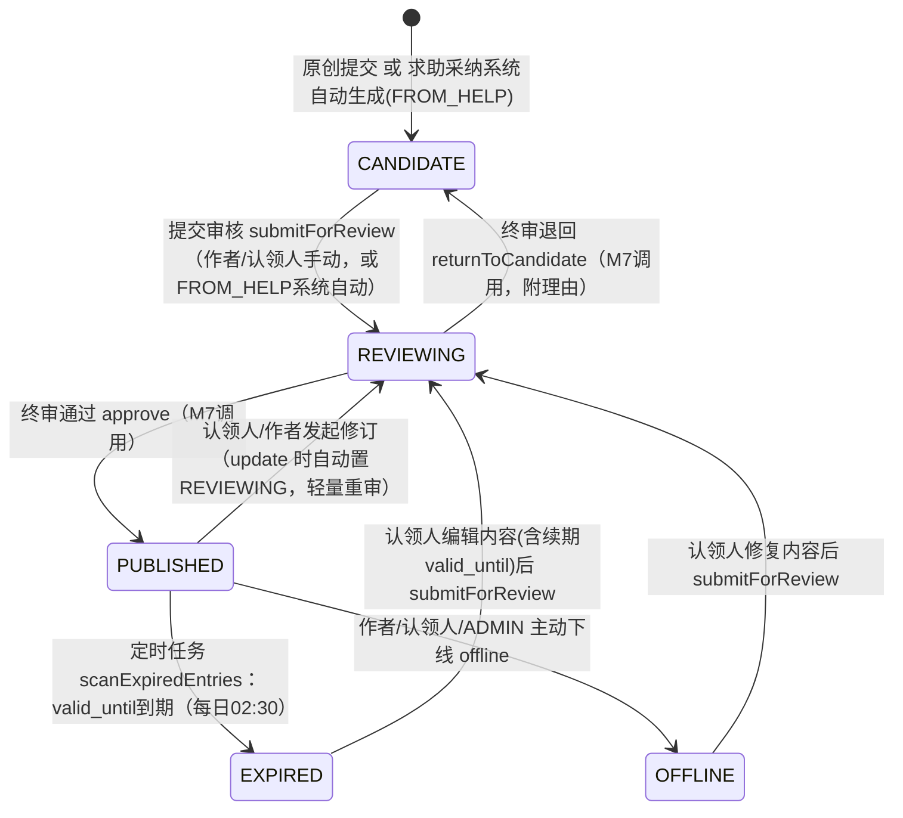

# M3 经验知识库 实现说明与画图指引

> 对应代码目录：`backend/src/main/java/com/xju/sem/module/knowledge/`
> 对应设计基线：`docs/design/03_M3_经验知识库_详细设计.md`（以下简称"03文档"），并已按
> `docs/design/08_集成与一致性报告.md`/`09_设计修订说明.md` 的裁决与 `backend/src/main/resources/schema.sql`
> 的实际列（精确列以 schema.sql 为准）做了对齐与必要简化，差异详见 §4「假设与简化」。

---

## 1. 模块功能说明（做什么、核心流程）

M3 是平台"知识沉淀闭环"的终点站与复用起点，管理一种资产——**知识条目**（`knowledge_entry`）。
用大白话说，它做三件事：

1. **让经验能被写下来、被信任地公开**：学生/校友可以原创贡献一条知识条目（生活/课程/竞赛/
   考研就业/公共信息导航五选一分类），或者由 M4"求助被采纳"自动转化生成一条候选。候选条目
   要经过 `CANDIDATE → REVIEWING → PUBLISHED` 的审核流程（审核动作本身由 M7 做，M3 只提供
   状态流转的 Service 方法）才能被所有人看到；已发布内容还能被作者/认领人反复"发起修订"
   （编辑后自动退回 REVIEWING 轻量重审，不用从头排队）。
2. **让经验能被找到**：分类筛选列表 + MySQL FULLTEXT（ngram 分词，适配中文）全文搜索，短
   关键词退化为 LIKE 兜底；默认只出公开（PUBLISHED）内容，登录用户额外能看到自己贡献/认领的
   其他状态条目。
3. **让经验能被治理、被更新、别烂尾**：三态评价（有用/已过时/需更新）让读者反馈内容是否还
   可信；"认领"机制允许非原作者接手维护一条无人打理的条目；每日定时任务扫描 `valid_until`
   已过期的已发布条目，自动转 `EXPIRED` 并通知认领人/作者去更新——过期不等于报废，`EXPIRED`/
   `OFFLINE` 都能被认领人编辑后重新提交，回到 `REVIEWING` 再次流转，只有 `deleted` 软删才是
   真正的终结。

**核心跨模块协作**（不做的事情反而更能说明边界）：M3 不做求助单/回答本身（M4 的事），不做
审核队列的人工操作 UI（M7 的事），只在 M4"采纳"发生时被动接一次 Java 方法调用生成候选，
在 M7 终审时被动接受 `approve`/`returnToCandidate` 调用，其余时间自己管好 `knowledge_entry`/
`knowledge_feedback` 这两张表。

---

## 2. 代码结构（写了哪些类，一句话职责）

```
module/knowledge/
├── entity/
│   ├── KnowledgeEntry.java          知识条目实体（对应 knowledge_entry 表，含 @Version 乐观锁）
│   └── KnowledgeFeedback.java       三态评价实体（对应 knowledge_feedback 表）
├── enums/
│   ├── KnowledgeCategory.java       LIFE/COURSE/COMPETITION/POSTGRAD_EMPLOY/NAV（校验用，非DB类型）
│   ├── KnowledgeEntryStatus.java    CANDIDATE/REVIEWING/PUBLISHED/EXPIRED/OFFLINE
│   ├── SourceType.java              ORIGINAL/FROM_HELP
│   └── FeedbackType.java            USEFUL/OUTDATED/NEED_UPDATE
├── mapper/
│   ├── KnowledgeEntryMapper.java    BaseMapper + 全文搜索/浏览量+1/过期扫描/CAS过期 等自定义方法
│   ├── KnowledgeFeedbackMapper.java BaseMapper + 按类型分组计数
│   └── FeedbackTypeCount.java       countByType 查询结果投影（非持久化实体）
├── dto/request/
│   ├── CreateKnowledgeEntryRequest.java
│   ├── UpdateKnowledgeEntryRequest.java  （含 version，供乐观锁校验）
│   ├── OfflineRequest.java
│   └── SubmitFeedbackRequest.java
├── dto/response/
│   ├── KnowledgeEntryDTO.java        详情出参（含 editable/claimable/deletable 前端友好标志位）
│   ├── KnowledgeBriefDTO.java        列表/搜索/我的贡献 行数据，同时是跨模块契约 getBrief 的返回类型
│   ├── FeedbackSummaryDTO.java       三态评价统计
│   └── KnowledgeFeedbackDTO.java     单条评价出参
├── validator/
│   └── ExternalLinkValidator.java   "高时效信息不自存"红线校验（§6.1），Service 层强制
├── event/
│   └── KnowledgeEntrySubmittedEvent.java  entryId/authorId/isRevision，供 M7 监听建 audit_task
├── service/
│   ├── KnowledgeEntryService.java   接口（含 5 个跨模块契约方法，签名与地基契约严格一致）
│   └── KnowledgeFeedbackService.java 接口
├── service/impl/
│   ├── KnowledgeEntryServiceImpl.java     CRUD + 状态机 + 认领 + 来源转化（业务主体）
│   ├── KnowledgeFeedbackServiceImpl.java  upsert + 统计
│   └── KnowledgeEntryExpiryScheduler.java  @Scheduled 过期自动降权（FR-M3-16）
└── controller/
    ├── KnowledgeEntryController.java    list/search/mine/{id}/create/update/delete/submit/claim/offline
    └── KnowledgeFeedbackController.java {id}/feedbacks、{id}/feedbacks/summary

resources/mapper/knowledge/KnowledgeEntryMapper.xml   FULLTEXT 全文搜索 + LIKE 兜底的动态 SQL
```

另对已有地基文件做了一处最小必要追加：`common/security/SecurityConfig.java` 的 GET 白名单
新增了 `/api/v1/knowledge-entries/**`（原来只有 `/api/v1/knowledge/**`），否则 GUEST 无法匿名
浏览列表/搜索/详情，与 FR-M3-09/10/11"全角色含 GUEST"要求冲突。这是唯一对 `module/knowledge`
目录之外文件的改动。

**暴露的跨模块契约**（严格按任务给定的签名实现，供其他模块直接调用）：

```java
Long   KnowledgeEntryService.createFromHelpAdoption(Long helpTicketId, Long helpAnswerId, Long authorId); // 供 M4
void   KnowledgeEntryService.approve(Long entryId, Long reviewerId);                                      // 供 M7
void   KnowledgeEntryService.returnToCandidate(Long entryId, Long reviewerId, String reason);              // 供 M7
KnowledgeBriefDTO KnowledgeEntryService.getBrief(Long id);                                                  // 供 M6/M7
boolean KnowledgeEntryService.existsPublished(Long id);                                                     // 供 M6
```

**依赖的跨模块契约**（假定对方按同一份契约实现，未在本次任务中创建对方代码）：

```java
AnswerContentDTO com.xju.sem.module.help.service.HelpAnswerService.getForCandidate(Long answerId);
void com.xju.sem.module.notification.service.NotificationService.send(Long userId, String type,
        String title, String content, String refType, Long refId);
```

---

## 3. 建议在论文中绘制的软件工程图

### 图1：M3 知识条目状态机图
- 【图类型】状态图（State Diagram）
- 【放报告哪一章】详细设计 → M3 模块设计 → 生命周期状态机
- 【要画什么】5 个状态节点：CANDIDATE、REVIEWING、PUBLISHED、EXPIRED、OFFLINE；初始伪状态
  指向 CANDIDATE；标注每条迁移的触发动作（提交审核/终审通过/终审退回/发起修订/valid_until到期
  /手动下线/编辑后重新提交）。
- 【怎么画】按下方 mermaid 源码 1:1 转绘（各状态框 + 带文字的有向箭头），并在图注中强调"无绝对
  终态——EXPIRED/OFFLINE 均可经编辑修订回到 REVIEWING，真正的终结是与 status 正交的 deleted
  软删标记"。
- 【工具建议】drawio（可直接粘贴 mermaid 语法用其 mermaid 插件渲染后微调）/ PowerDesigner 状态图



### 图2：M3 用例图
- 【图类型】用例图（Use Case Diagram）
- 【放报告哪一章】需求分析 → M3 功能需求
- 【要画什么】参与者：GUEST（访客）、STUDENT/ALUMNI（已认证）、ADMIN、"系统定时任务"（作为
  次要参与者/系统触发源）；用例：浏览分类列表、全文搜索、查看详情、创建原创条目、编辑/发起
  修订、提交审核、认领内容更新、手动下线、软删除、提交三态评价、查看我的贡献、（系统）过期
  自动降权。
- 【怎么画】GUEST 只连"浏览列表/搜索/查看详情（仅PUBLISHED）"；STUDENT/ALUMNI 继承 GUEST 的
  用例并额外连"创建/编辑/提交审核/认领/评价/我的贡献"；ADMIN 额外连"编辑/下线任意状态/删除
  任意状态"；用 `<<include>>` 把"校验高时效信息外链规则"作为"创建条目""编辑条目"两个用例的
  被包含用例，体现该红线校验对两个入口都强制生效。
- 【工具建议】Visio / drawio 用例图模板

### 图3：createFromHelpAdoption 跨模块协作时序图
- 【图类型】时序图（Sequence Diagram）
- 【放报告哪一章】详细设计 → 跨模块接口设计（对应 03 文档 §8/§6.3）
- 【要画什么】对象生命线：`M4:HelpAnswerService`、`M3:KnowledgeEntryService`、
  `M4:HelpAnswerService(getForCandidate)`、`KnowledgeEntryMapper`、`ApplicationEventPublisher`、
  `M7:AuditTaskEventListener`（虚线跨事务边界）。
- 【怎么画】① M4 `adopt()` 提交事务并 COMMIT；② 事务提交后的 `@TransactionalEventListener
  (AFTER_COMMIT)` 触发，调用 `KnowledgeEntryService.createFromHelpAdoption(ticketId, answerId,
  authorId)`（画一条独立于 M4 事务的新调用箭头，标注"独立事务，失败走补偿，不回滚采纳动作"）；
  ③ M3 内部先查重（防重复生成候选），再调用 `HelpAnswerService.getForCandidate(answerId)` 自读
  正文；④ 插入 `knowledge_entry`(CANDIDATE)；⑤ 内部转 REVIEWING 并 `eventPublisher.publishEvent
  (KnowledgeEntrySubmittedEvent)`；⑥ M3 事务提交后，M7 的 `@TransactionalEventListener
  (AFTER_COMMIT)` 监听到事件创建 `audit_task`；⑦ 返回 entryId 给 M4 回写
  `help_answer.knowledge_entry_id`。用不同颜色/虚实线区分"同步调用"与"事件驱动的异步下一跳"。
- 【工具建议】PlantUML/drawio 时序图（跨事务边界建议用虚线分隔框标注"事务A"/"事务B"）

### 图4：知识条目编辑与提交审核活动图
- 【图类型】活动图（Activity Diagram）
- 【放报告哪一章】详细设计 → 关键业务规则（对应 03 文档 §6.2）
- 【要画什么】起点"用户发起编辑"→判定泳道：权限校验（作者/认领人/ADMIN？否则拒绝）→状态
  判定（REVIEWING？拒绝"审核排队中不可编辑"）→高时效信息红线校验（NAV必须有外链/非NAV不能
  有外链，否则拒绝）→按原状态分支：CANDIDATE(字段更新，状态不变)/EXPIRED或OFFLINE(字段更新，
  状态不变，需另外调用submit)/PUBLISHED(字段更新+自动置REVIEWING+发布提交事件)→乐观锁更新
  （version不匹配则整体回滚，提示刷新重试）→结束。
- 【怎么画】用泳道区分"用户"/"KnowledgeEntryServiceImpl"/"数据库"三条泳道，判定用菱形，
  各分支用不同颜色区分"直接结束"与"触发REVISION事件"两类终点。
- 【工具建议】drawio 活动图 / Visio

### 图5：M3 领域类图
- 【图类型】类图（Class Diagram）
- 【放报告哪一章】详细设计 → 数据模型/领域模型
- 【要画什么】`KnowledgeEntry`（属性列到 status/category/sourceType/authorId/claimerId/version
  等，标注 @Version）、`KnowledgeFeedback`（entryId/userId/feedbackType/comment，标注 UK 约束）、
  `KnowledgeEntryService`/`KnowledgeFeedbackService` 接口及其 Impl 实现类之间的依赖箭头、
  `ExternalLinkValidator`/`KnowledgeEntryExpiryScheduler` 作为独立协作类、`KnowledgeEntrySubmittedEvent`
  作为事件类与 Service 的"发布"依赖关系（虚线+`<<use>>`）。
- 【怎么画】接口用 `<<interface>>` 构造型，Impl 类画实现关系(空心三角虚线)指向接口；
  KnowledgeEntry 与 KnowledgeFeedback 之间画 1:N 关联（entry_id 外键语义，无导航箭头强关联，
  仅标注基数）。
- 【工具建议】PowerDesigner（可从 schema.sql 反向工程再手工补充 Service 层）/ drawio

---

## 4. 关键实现点

### 4.1 状态机流转的代码落点
- `create()`：固定落 `CANDIDATE`/`ORIGINAL`。
- `submitForReview()`：`CANDIDATE`→`REVIEWING`（`isRevision=false`）；`EXPIRED`/`OFFLINE`→
  `REVIEWING`（`isRevision=true`，因为这两个状态必然曾经 PUBLISHED 过，视作修订/修复）；其余
  状态拒绝（`STATE_CONFLICT`）。
- `update()`：仅 `PUBLISHED` 会在编辑的同时自动转 `REVIEWING`（"发起修订"）；`REVIEWING` 中
  拒绝编辑；`CANDIDATE`/`EXPIRED`/`OFFLINE` 编辑后状态不变，仍需显式调用 `submit`。
- `approve()`/`returnToCandidate()`：仅接受 `REVIEWING` 作为前置状态，供 M7 调用，签名与地基
  跨模块契约严格一致（`void approve(Long,Long)`、`void returnToCandidate(Long,Long,String)`）。
- `offline()`：ADMIN 可对任意状态强制下线（含举报处理场景）；作者/认领人仅能对 `PUBLISHED`/
  `EXPIRED` 下线。
- `claim()`：仅 `PUBLISHED`/`EXPIRED`/`OFFLINE` 可认领；未认领可直接认领；本人重复认领幂等；
  他人已认领则 `STATE_CONFLICT`。

### 4.2 事务与异步边界
- `createFromHelpAdoption` 由 M4 在其 `@TransactionalEventListener(phase = AFTER_COMMIT)` 内
  调用（09 设计修订说明 R3 裁决：**异步、独立事务**，采纳动作不因候选生成失败而回滚），本方法
  自身只是一个普通 `@Transactional` 方法，不需要 `REQUIRES_NEW` 之类特殊传播级别。
- `submitForReview`/`createFromHelpAdoption`/`update`(PUBLISHED→REVIEWING) 三处触发点统一通过
  `ApplicationEventPublisher.publishEvent(KnowledgeEntrySubmittedEvent)` 发布事件，由 M7 的
  `@TransactionalEventListener(AFTER_COMMIT)` 监听创建 `audit_task`，与 M1
  `AuthApplicationSubmittedEvent` 同一解耦模式，M3 不直接写 M7 的表。
- 通知（认领提醒、过期提醒、审核结果）一律走 `notifySafe()` helper：`try/catch` 吞掉通知发送
  异常并只记录警告日志，不让"通知失败"影响主业务事务提交（例如 approve() 的审核通过不应该
  因为 NotificationService 暂时不可用而回滚）。

### 4.3 并发控制：内容编辑与状态流转复用同一把乐观锁
03 详细设计原本要求"内容编辑用乐观锁 version，状态流转（审核/认领/下线）另走状态 CAS（
`WHERE status=期望值`），二者不复用"。本实现做了简化：`common/config/MybatisPlusConfig` 已经
注册了全局 `OptimisticLockerInnerInterceptor`，只要实体标了 `@Version`，**任何** `updateById`
调用都会自动在 SQL 上附加 `version` 条件——状态流转类方法（submit/approve/return/claim/
offline）在方法内先 `selectById` 读到当前 `version`，改动作后直接 `updateById`，两个并发请求
同时对同一行发起状态变更时，只有一个的 `version` 匹配成功，另一个 `updateById` 返回受影响行数
0，由 `checkedUpdate()` 统一识别并抛出 `OptimisticLockingFailureException`（`GlobalExceptionHandler`
已配好转 `ResultCode.OPTIMISTIC_LOCK`）。效果与"状态 CAS"完全等价（都是"你写之前我没变过"的
乐观并发校验），但不用为每个状态转换方法各写一条 `WHERE status=?` 的定制 SQL，减少重复实现。
`update()` 编辑场景则显式把 `entry.setVersion(request.getVersion())` 设为客户端提交的旧版本号
（而不是数据库当前实际版本号），这样才能让"客户端认为的版本"与"数据库实际版本"在 SQL 层面
真正被比较，是 MyBatis-Plus 乐观锁写法的标准用法。

### 4.4 FULLTEXT 全文搜索（§6.6）
`knowledge_entry` 建表时已带 `FULLTEXT KEY ft_title_content (title, content) WITH PARSER ngram`
（见 schema.sql），需要 MySQL 侧配置 `ngram_token_size=2` 并重启生效（适配中文双字切分），这是
部署前置条件。`KnowledgeEntryMapper.xml` 提供两条查询：关键词长度 ≥2 走
`MATCH(title,content) AGAINST(... IN NATURAL LANGUAGE MODE)` 并把相关度 `relevance` 作为
`@TableField(exist=false)` 的非持久化字段随行返回；关键词长度 <2 时 ngram 可能零命中，退化为
仅对 `title` 做 `LIKE`（不对 `content` 做 LIKE，避免全表扫描）。两者都用 `IPage` 作为 Mapper
方法首参，交由 MyBatis-Plus 分页插件自动改写 `COUNT`/`LIMIT OFFSET`，不用手写分页 SQL。

### 4.5 三态评价 upsert（§6.5）
`entry_id+user_id` 唯一约束下的"先查后写"：查不到就 `insert`，查到就按新旧类型是否相同决定
只更新 `comment` 还是连 `feedback_type` 一起更新；额外用 `try/catch(DuplicateKeyException)`
兜底"两个并发请求同时首次提交导致唯一约束冲突"这种边界情况，退化为二次查询后更新，避免把一次
正常的重复提交暴露成 500 错误。

### 4.6 假设与简化（与 03 详细设计的主要差异，均已在对应代码注释中标注出处）
本次实现严格以 `schema.sql`（已按 08/09 文档 reconcile 的地基）为准，03 详细设计中部分字段
在该表未开列，做了如下简化，均不影响 FR-M3-01~16（Must/Should 优先级）的功能闭环：

1. **枚举取值对齐 schema 而非 03 文档**：`category` 用 schema.sql 注释里的短名
   `LIFE/COURSE/COMPETITION/POSTGRAD_EMPLOY/NAV`，而非 03 文档的
   `GRAD_EXAM_EMPLOYMENT/PUBLIC_INFO_NAV`；语义完全一致，仅字面量更短。
2. **不持久化 `external_source_name`**：只保留 `external_url` 这条"高时效信息不自存"的核心
   校验红线（NAV 必填、非 NAV 禁填），来源名称字段本期不做持久化校验。
3. **不做 `weight_score` 数值衰减**：list()/search() 默认只返回 `PUBLISHED`，过期定时任务把
   条目转 `EXPIRED` 使其退出默认可见范围，效果等价"降权隐藏"，FR-M3-16（Must）已完整实现；
   FR-M3-17（三态反馈驱动降权与预警，Should）因同样依赖 `weight_score` 列，本期不实现。
4. **三态评价计数改为实时聚合**：不维护 `useful_count`/`outdated_count`/`need_update_count`
   冗余列（表中未开），`getSummary()` 改为对 `knowledge_feedback` 按 `feedback_type` 分组的
   实时 `COUNT` 查询，课程项目数据量级下代价可忽略，且天然规避冗余计数列的漂移问题。
5. **认领不含 60 天超时抢占/自动释放**：schema 的 `claimer_id` 无配套 `claimed_at` 时间戳列，
   FR-M3-08（Must）的"未认领可认领/本人幂等/他人已认领拒绝"核心语义已实现；§6.4 的"原认领人
   超时未维护允许他人抢占"与 FR-M3-18（长期未维护释放认领，Could 优先级）依赖该时间戳，本期
   不实现。
6. **不持久化审核意见/时间**：`review_comment`/`reviewer_id`/`published_at`/`last_reviewed_at`
   等审核元数据未在 `knowledge_entry` 重复存储——这些数据本就该由 M7 的 `audit_task`
   （`reviewer_id`/`decision_note`/`decided_at`）承载一份，`returnToCandidate(reason)` 的
   `reason` 仅用于站内通知文案，不重复落库，避免"两处存一份数据、可能不一致"。
7. **浏览量不做节流去重**：`view_count` 通过 SQL 级 `+1` 原子更新，未做"同一用户短时间内重复
   访问不重复计数"的节流表（03 文档提到但未给出具体设计，本期属细节简化，不影响功能正确性）。
8. **`approve`/`returnToCandidate` 无 Controller 端点**：按 09 设计修订说明"终审接口路由挂
   M7、Controller 复用 M3 Service Bean"的既定分工，M3 只暴露 Service 方法，HTTP 端点由 M7
   模块的 Controller 提供。
9. **依赖 M1 `UserService.getBrief` 被裁剪**：详情/列表 DTO 只回传 `authorId`/`claimerId`
   （原始 ID），不内联作者/认领人昵称头像，减少对尚未实现的 M1 Service 的耦合面；前端如需
   展示昵称可自行按 ID 批量查询 M1。
