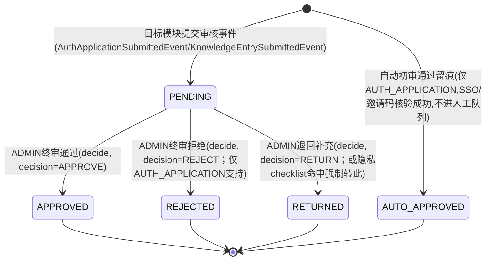

# M7 平台管理与内容治理（审核部分）实现说明与画图指引

> 对应代码目录：`backend/src/main/java/com/xju/sem/module/admin/`
> 对应设计基线：`docs/design/07_M7_平台管理与内容治理_详细设计.md`（以下简称"07文档"），并已按
> `docs/design/08_集成与一致性报告.md`/`09_设计修订说明.md` 的裁决与 `backend/src/main/resources/schema.sql`
> 的实际列（精确列以 schema.sql 为准）做了对齐与必要简化，差异详见 §4「假设与简化」。
>
> **范围声明**：本次任务只做"审核部分"——统一审核队列、认证终审、知识候选终审（含隐私
> checklist）、批量通过/退回、审核吞吐留痕。07 文档中的举报受理（`report`）、标签维护（`tag`）、
> 时间线模板/节点维护（`timeline_*`，且据 08 报告已裁决归 M6 owner）、机会终审（M5 尚未落地）、
> 贡献者认证、运营统计看板均不在本次范围内，未产出对应代码。

---

## 1. 模块功能说明（做什么、核心流程）

M7 审核部分是全平台"提交审核 → 人工终审 → 写回目标模块状态"这条闭环的**统一枢纽**，只服务
`ADMIN` 角色。用大白话说，它做三件事：

1. **把分散在各模块的"等待审核"事项收进一张队列表**：认证申请（M1）、知识候选（M3）提交审核
   后，各自发布一个 Java 事件（`AuthApplicationSubmittedEvent`/`KnowledgeEntrySubmittedEvent`），
   M7 被动监听并在自己的表 `audit_task` 里建一条记录——`AUTH_APPLICATION` 若 SSO/邀请码已自动
   核验通过，直接落 `AUTO_APPROVED` 留痕（不占用人工队列）；否则落 `PENDING` 进队列。ADMIN 打开
   P18 管理后台看到的"待审核列表"，不用分别跑去 M1、M3 各自的后台，一张表看全部。
2. **让 ADMIN 用一个按钮做终审决定，系统自动把结果同步回目标模块**：ADMIN 在 `audit_task` 详情
   页点"通过/退回/拒绝"，M7 不自己实现"认证通过后写回 `user.auth_status`"或"知识条目转
   `PUBLISHED`"这些业务规则（这是 M1/M3 自己的事），只是按 `target_type` 转发调用对方已声明的
   `approve`/`reject`/`returnForSupplement`/`returnToCandidate` 方法——本模块的 `audit_task`
   状态更新与目标模块的状态更新在同一个数据库事务里，要么一起成功要么一起失败，不会出现"任务
   显示已通过，但认证申请其实还卡在审核中"这种不一致。
3. **给知识候选的隐私红线加一道"系统提示 + 人工兜底"的双保险**：知识候选提交审核后，系统立刻
   跑一次正则扫描（手机号/邮箱/身份证号/"微信+数字"组合）和结构化字段完整性检查，结果存进
   `audit_task.auto_precheck`，供审核详情页预先提示"疑似含联系方式"；真正拍板的是 ADMIN 手动勾
   选的"三秒可判断" checklist（真实姓名/联系方式/可反向定位组合）——三项只要勾了一项，系统会
   **强制**把决定转成"退回"，哪怕 ADMIN 点的按钮是"通过"也拦下来，避免误操作放出隐私内容。

**核心跨模块协作**（不做的事情反而更能说明边界）：M7 不做认证核验算法、不做知识条目生命周期
规则，只在"提交"节点被动接事件、在"终审"节点主动转发调用；本模块自己只管好 `audit_task`
这一张表。

---

## 2. 代码结构（写了哪些类，一句话职责）

```
module/admin/
├── entity/
│   └── AuditTask.java                 审核任务实体（对应 audit_task 表）
├── enums/
│   ├── AuditTargetType.java           AUTH_APPLICATION/KNOWLEDGE_ENTRY/OPPORTUNITY/CONTRIBUTOR_CERT（校验用）
│   ├── AuditTaskStatus.java           PENDING/APPROVED/REJECTED/RETURNED/AUTO_APPROVED
│   ├── ReviewKind.java                NEW/REVISION/AUTO/NEW_FROM_HELP
│   ├── AuditDecision.java             APPROVE/RETURN/REJECT，含到 status 的映射
│   └── ReasonTemplate.java            标准理由模板常量（不建表，随代码迭代）
├── dto/
│   ├── ChecklistResult.java           "三秒可判断"隐私 checklist 勾选结果
│   ├── PreCheckResultDTO.java         自动预检结果（序列化进 auto_precheck 列）
│   ├── AuditTaskDTO.java              单条任务出参（decide 返回体）
│   ├── AuditTaskBriefDTO.java         队列列表行（含跨模块拼装的提交人/目标摘要）
│   ├── AuditTaskDetailDTO.java        任务详情（聚合目标实体完整 DTO + 预检结果）
│   ├── AuditTaskQuery.java            队列查询条件
│   ├── AuditQueueResponse.java        {records,total,page,size,countByType} 响应体
│   ├── DecideRequest.java / BatchDecideRequest.java  终审/批量终审请求体
│   └── BatchResultDTO.java / BatchResultItem.java    批量操作结果
├── mapper/
│   ├── AuditTaskMapper.java           BaseMapper + 状态CAS更新 + 按类型分组计数
│   └── TargetTypeCount.java           countPendingByType 查询结果投影（非持久化实体）
├── service/
│   ├── AuditTaskService.java          审核任务主接口
│   ├── PreCheckService.java           自动预检接口（纯函数式，便于单测）
│   └── AuditTargetHandler.java        终审分发策略接口（开闭原则：新增 target_type 只需新增实现类）
├── service/impl/
│   ├── AuditTaskServiceImpl.java      队列查询/详情聚合/终审CAS+分发/批量操作（业务主体）
│   ├── PreCheckServiceImpl.java       正则扫描 + 结构化字段完整性校验
│   ├── AuditTaskEventListener.java    监听 AuthApplicationSubmittedEvent/KnowledgeEntrySubmittedEvent
│   └── handler/
│       ├── AuthApplicationAuditHandler.java     转发调用 M1 AuthApplicationService
│       └── KnowledgeEntryAuditHandler.java      转发调用 M3 KnowledgeEntryService
└── controller/
    └── AuditTaskController.java       queue / {id} / {id}/decide / batch-decide
```

**暴露的跨模块契约**：本模块审核队列范围内不对外暴露新的跨模块 Service 契约（`audit_task` 的
查询/终审均是 ADMIN 通过 HTTP 直接操作，未来 M6"运营看板"若要读审核吞吐数据，建议届时在
`AuditTaskService` 上追加只读统计方法，本次不预先设计不会被消费的接口）。

**依赖的跨模块契约**（假定对方按同一份契约实现；`AuthApplicationService`/`KnowledgeEntryService`
已由 M1/M3 落地实现，`UserService.getBrief` 已由 M1 落地，`NotificationService` 尚未有任何模块
实现，与 M1/M3 现状一致，详见 §4「假设与简化」第 6 条）：

```java
void   AuthApplicationService.approve(Long appId, Long reviewerId);
void   AuthApplicationService.reject(Long appId, Long reviewerId, String reason);
void   AuthApplicationService.returnForSupplement(Long appId, Long reviewerId, String reason);
AuthApplicationDTO AuthApplicationService.getById(Long id);
void   KnowledgeEntryService.approve(Long entryId, Long reviewerId);
void   KnowledgeEntryService.returnToCandidate(Long entryId, Long reviewerId, String reason);
KnowledgeEntryDTO  KnowledgeEntryService.getById(Long id, Long viewerUserId, boolean viewerIsAdmin);
KnowledgeBriefDTO  KnowledgeEntryService.getBrief(Long id);
UserBriefDTO UserService.getBrief(Long userId);
void com.xju.sem.module.notification.service.NotificationService.send(Long userId, String type,
        String title, String content, String refType, Long refId);
```

**本模块唯一对外的 HTTP 入口，同时也是 M1 认证终审 / M3 知识候选终审在整个系统中唯一的 HTTP
入口**：`AuthApplicationController`/`KnowledgeEntryController` 的类注释均已明确声明"终审接口不
在本模块暴露，由 M7 治理端 Controller 调用"，故 `AuditTaskController` 的 `PATCH
/api/v1/audit-tasks/{id}/decide` 就是承接这一约定的落地实现，不再另建 07 文档 §5(a) 提到的
`/api/v1/auth-applications/{id}/approve` 等重复直连路由（理由见 §4「假设与简化」第 8 条）。

---

## 3. 建议在论文中绘制的软件工程图

### 图1：audit_task 统一审核状态机图
- 【图类型】状态图（State Diagram）
- 【放报告哪一章】详细设计 → M7 模块设计 → 审核任务生命周期状态机
- 【要画什么】5 个状态节点：PENDING、APPROVED、REJECTED、RETURNED、AUTO_APPROVED；两个初始
  伪状态入边（提交审核事件 → PENDING；自动核验通过 → AUTO_APPROVED，不经过 PENDING）；
  PENDING 引出的三条迁移分别标注触发动作"ADMIN终审通过/退回/拒绝"；全部为终态（无回边）。
- 【怎么画】按下方 mermaid 源码 1:1 转绘，并在图注强调"全部终态——同一 (target_type,
  target_id) 若被退回后重新提交，会产生**新一条** audit_task 记录，而不是复用旧行改状态，
  天然形成完整的多轮审核历史留痕"。
- 【工具建议】drawio（可直接粘贴 mermaid 语法用其 mermaid 插件渲染后微调）/ PowerDesigner 状态图



### 图2：统一审核队列 P18 管理后台用例图
- 【图类型】用例图（Use Case Diagram）
- 【放报告哪一章】需求分析 → M7 功能需求（审核部分）
- 【要画什么】参与者：ADMIN、"目标模块系统事件"（M1/M3，作为次要参与者/系统触发源）；用例：
  查看统一审核队列（按类型/状态筛选）、查看审核任务详情、终审认证申请（通过/退回/拒绝）、
  终审知识候选（勾选隐私 checklist → 通过/退回）、批量通过、批量退回；"系统事件"参与者连接
  用例"建立审核任务（PENDING/AUTO_APPROVED）"与"自动预检知识候选"。
- 【怎么画】ADMIN 的"终审知识候选"用例用 `<<include>>` 包含"三秒可判断隐私checklist校验"子
  用例，体现该校验对通过/退回两个分支都强制生效；"批量通过"/"批量退回"用例用 `<<extend>>`
  从"终审知识候选"扩展而来（同一决定逻辑的批处理变体）。
- 【工具建议】Visio / drawio 用例图模板

### 图3：ADMIN 终审知识候选活动图（带管理员泳道）
- 【图类型】活动图（Activity Diagram）
- 【放报告哪一章】详细设计 → 关键业务规则（对应 07 文档 §6.3）
- 【要画什么】三条泳道——"ADMIN"/"AuditTaskServiceImpl"/"目标模块Service(M1/M3)"。ADMIN 泳道：
  打开任务详情 → 查看自动预检提示 → 勾选/不勾选 checklist 三项 → 点击"通过"或"退回"按钮；
  AuditTaskServiceImpl 泳道：校验任务是否仍为 PENDING（否则拒绝并提示"已被处理"）→ 判定
  checklist 是否任一勾选 → 若命中：**忽略 ADMIN 实际点击的按钮**，强制置 decision=RETURN 并
  按优先级(真实姓名>联系方式>可定位组合)取标准理由 → CAS 更新 audit_task 状态 → 调用目标模块
  Handler；目标模块 Service 泳道：执行 approve/returnToCandidate 自身的状态机校验与写回 →
  成功/抛异常（异常则回滚整个事务，audit_task 状态一并回滚）→ 结束（发送审核结果通知）。
- 【怎么画】用泳道分栏、菱形表示判定分支，checklist 强制转退回的分支用醒目颜色（如红色）标出，
  体现"双重防呆"的设计意图；异常回滚路径用虚线箭头连回起点附近的"终止（整体回滚）"节点。
- 【工具建议】drawio 活动图（泳道模板）/ Visio

### 图4：AuditTaskEventListener 跨模块事件驱动时序图
- 【图类型】时序图（Sequence Diagram）
- 【放报告哪一章】详细设计 → 跨模块接口设计（对应 07 文档 §6.1）
- 【要画什么】对象生命线：`M3:KnowledgeEntryServiceImpl`、`ApplicationEventPublisher`、
  `M7:AuditTaskEventListener`、`M7:AuditTaskServiceImpl`、`M7:PreCheckServiceImpl`、
  `AuditTaskMapper`。
- 【怎么画】① M3 `submitForReview()` 内部 `doSubmit()` 置状态 REVIEWING 并 COMMIT 事务；
  ② 事务提交后触发 `@TransactionalEventListener(AFTER_COMMIT)`（画一条独立于 M3 事务的新调用
  箭头，标注"独立事务，失败仅记日志走人工补偿，不回滚M3的提交动作"）；③ 调用
  `AuditTaskService.createTask(KNOWLEDGE_ENTRY, entryId, authorId, NEW/REVISION)` 插入
  `audit_task`(PENDING)；④ 紧接着调用 `runPreCheck(taskId, entryId)`：内部先
  `KnowledgeEntryService.getById(entryId,null,true)` 回读正文，跑正则扫描，再
  `auditTaskMapper.updateById` 只写回 `auto_precheck` 一列。用虚实线区分"同步调用"与"事件
  驱动的异步下一跳"。
- 【工具建议】PlantUML/drawio 时序图（跨事务边界建议用虚线分隔框标注"事务A(M3)"/"事务B(M7)"）

### 图5：M7 审核部分领域类图
- 【图类型】类图（Class Diagram）
- 【放报告哪一章】详细设计 → 数据模型/领域模型
- 【要画什么】`AuditTask`（属性列到 targetType/targetId/submitterId/reviewKind/status/
  autoPrecheck/reviewerId/decisionNote/decidedAt）；`AuditTaskService`/`PreCheckService`/
  `AuditTargetHandler` 三个接口及其实现类；`AuditTargetHandler` 的两个实现类
  `AuthApplicationAuditHandler`/`KnowledgeEntryAuditHandler` 与 `AuditTaskServiceImpl` 之间画
  聚合关系（`Map<String, AuditTargetHandler>`）；`AuditTaskServiceImpl` 到
  `AuthApplicationService`/`KnowledgeEntryService`/`UserService`/`NotificationService` 画依赖
  箭头（虚线+`<<use>>`，标注"跨模块契约调用"）。
- 【怎么画】接口用 `<<interface>>` 构造型，Handler 实现类画实现关系（空心三角虚线）指向
  `AuditTargetHandler`；策略路由用"一对多聚合 + 按 targetType 分发"的图注说明开闭原则。
- 【工具建议】PowerDesigner（可从 schema.sql 反向工程再手工补充 Service 层）/ drawio

---

## 4. 关键实现点

### 4.1 状态机流转与"同一物理事务"原子性
`decide()` 的核心顺序：① `requireExisting` 取任务并校验 `status==PENDING`；② 若
`KNOWLEDGE_ENTRY` 且 checklist 任一勾选，强制改写 `decision`/`reasonCode`/`comment`；③
`auditTaskMapper.casDecide(...)`（`UPDATE ... WHERE id=? AND status='PENDING'`，影响行数
0 则说明已被并发处理，抛 `STATE_CONFLICT`）；④ 调用 `AuditTargetHandler.handle(...)`——
转发到 M1/M3 的 `approve`/`reject`/`returnForSupplement`/`returnToCandidate`。③④两步在同一
个 `@Transactional` 方法内，任一步失败（包括 M1/M3 自己的状态校验失败）都会让 Spring 把
③ 的 CAS 更新一并回滚，不会出现"audit_task 显示已通过，但认证申请其实还卡在 UNDER_REVIEW"
这种不一致（对应 07 文档 §6.4 的设计要点：终审侧刻意选择同步强一致，区别于提交侧的
`AFTER_COMMIT` 异步解耦）。

### 4.2 隐私 checklist 的"双重防呆"落地
`ChecklistResult.anyChecked()` 只要三项任一为 `true`，`decide()` 就会**无视** ADMIN 实际传入
的 `decision`（哪怕是 `APPROVE`），强制改写为 `RETURN`，并按优先级（真实姓名 > 联系方式 >
可反向定位组合）映射到 `ReasonTemplate` 取标准理由文案。这是后端最后一道防线；前端还应在
按钮上做"任一勾选则禁用通过按钮"的第一道防线（详见 07 文档 §7 UI 设计），二者共同构成"双重
防呆"，与 07 文档 §6.3 的措辞完全一致。

### 4.3 事务与异步边界
`AuditTaskEventListener` 的两个方法均标注 `@TransactionalEventListener(phase = AFTER_COMMIT)`，
在源事件（M1 认证提交 / M3 候选提交）所在事务**已提交后**的独立事务内执行，且整体包在
`try/catch` 里只记日志——本模块建 `audit_task` 失败不应该、也不会让"认证申请已提交成功"或
"知识候选已创建成功"这类已经落地的事实被回滚，与 M1/M3 已确立的跨模块事件解耦风格一致。

### 4.4 自调用（self-invocation）导致 `@Transactional` 失效的规避
`batchDecide()` 需要对每个 id 各自独立提交事务（单条失败不影响其余，07 文档 §6.9），但循环体
若直接写 `this.decide(...)`，Spring AOP 的事务代理只在"外部调用"时生效，同一实例内部方法调用
会绕过代理直接执行原始方法，`@Transactional` 注解形同虚设——这是 Spring 官方文档明确列出的
自调用限制。本实现的做法：`AuditTaskServiceImpl` 注入一个 `@Lazy @Autowired` 的自身接口引用
`self`（字段注入，故意不放进 Lombok `@RequiredArgsConstructor` 的构造器参数列表，因为该字段
非 `final`），循环体内改用 `self.decide(...)`——这次调用会重新进入 Spring 代理，从而让每次
`decide` 调用各自开启一个独立事务，符合设计要求。

### 4.5 auto_precheck 的存储形式：VARCHAR 列里存 JSON 文本
schema.sql 的 `audit_task.auto_precheck` 是 `VARCHAR(500)` 而非 JSON 列类型。`PreCheckServiceImpl`
用 `ObjectMapper`（与 `SecurityConfig` 里已有的用法一致，未引入新依赖）把 `PreCheckResultDTO`
序列化成 JSON 字符串写入该列，读取时再反序列化回结构化对象供详情页/列表页复用；序列化失败时
返回 `null` 而不是抛异常，因为预检结果本身只是"人工判断的辅助提示"，其存取失败不应该影响审核
主流程能否进行。

### 4.6 假设与简化（与 07 详细设计的主要差异，均已在对应代码注释中标注出处）
本次实现严格以 `schema.sql`（已按 08/09 文档 reconcile 的地基）与"本期只做审核队列"的任务
范围为准，做了如下简化：

1. **只注册两个 `AuditTargetHandler`**：`AUTH_APPLICATION`/`KNOWLEDGE_ENTRY` 有生产者事件与
   落地的目标模块 Service；`OPPORTUNITY`（M5 尚未落地）、`CONTRIBUTOR_CERT`（本次任务范围外）
   暂无 Handler 注册。`decide()` 对未注册的 `target_type` 会抛 `STATE_CONFLICT` 并提示"暂不
   支持终审"，而不是静默失败；待对应模块交付后，只需新增一个 `AuditTargetHandler` 实现类，
   不改动 `AuditTaskServiceImpl` 主流程（开闭原则）。
2. **`audit_task` 字段以 schema.sql 精简版为准**：不持有 07 文档 §3.1 设想的 `payload`/
   `pre_check_result`(JSON列)/`checklist_result`/`decision`/`decision_reason_code`/
   `decision_comment`/`submitted_at` 等列；`checklist_result` 的命中项已折叠进
   `decision_note` 文本（`[理由码]模板文案 + ADMIN补充说明`），不单独持久化结构化勾选结果；
   `submitted_at` 复用 `BaseEntity.createdAt`。状态机也相应精简为不含 `WITHDRAWN`（schema
   未开该状态值，"源申请被撤回联动关闭任务"场景本期不处理）。
3. **未实现举报（`report`）/标签（`tag`）/时间线模板维护**：按任务范围声明与 08 集成报告
   "timeline 三表归 M6 owner"的裁决，均不在本次交付物内，`module/admin` 目录下暂无对应代码。
4. **未实现机会终审/贡献者认证/运营统计看板**：`OPPORTUNITY`/`CONTRIBUTOR_CERT` 依赖的 M5
   （机会与组队）与贡献者认证功能均未落地，`OperationStatsService`/`AuditThroughputStatsDTO`
   等纯统计聚合契约本期不产出（`decided_at` 已在 CAS 更新时正确写入 `NOW()`，为未来统计留好
   了数据基础，满足任务条目⑦"定义审核吞吐:approve/reject 时 decided_at=now"的字面要求）。
5. **keyword 队列筛选为课程规模简化实现**：`target_type`/`status` 走数据库级分页查询（精确），
   `keyword` 因无法在不直接访问 M1/M3 表的前提下做跨模块联合查询，退化为对已解析的"提交人
   展示名/目标摘要"在当前页结果内做包含匹配——若数据量增长，应改为建立只读宽表或引入专门的
   搜索服务，本期属已知简化。
6. **`NotificationService` 未实现**：与 M1 `AuthApplicationServiceImpl`、M3
   `KnowledgeEntryServiceImpl` 现状完全一致——该接口目前在整个代码库里没有任何模块提供实现，
   三个模块均按同一份契约签名调用，假定后续由通知模块统一交付；审核结果通知发送失败会被
   `try/catch` 吞掉且只记警告日志，不影响审核主流程提交。
7. **未新建 `/api/v1/auth-applications/{id}/approve`、`/api/v1/knowledge-entries/{id}/approve`
   等 07 文档 §5(a) 罗列的"直连路由"**：这些路由与 `/api/v1/audit-tasks/{id}/decide` 是同一
   业务动作的两套入口，若都实现且各自独立（不经过同一份 `audit_task` CAS+分发逻辑），会出现
   "ADMIN 走直连路由终审了知识候选，但对应 audit_task 仍停留 PENDING、且绕过了隐私 checklist
   强制拦截"的一致性与合规风险；07 文档本身也把 §5(a) 定位为"完整列出路由避免读者跨文件拼接"
   的索引说明，而非独立机制。故本次只实现 `/api/v1/audit-tasks/*` 这一条统一入口，`decide()`
   内部按 `target_type` 分发即完整覆盖了 M1/M3 的终审动作，满足两模块"终审路由由 M7 提供"的
   既定分工。
8. **未做"批量操作前置校验每个 id 是否属于同一 target_type"以外的更强校验**：`batchDecide`
   会在循环内逐条核对任务的真实 `target_type` 是否与请求参数一致（不一致记为单条失败），但
   不会因为批量中出现一条不一致就整体拒绝——与 07 文档 §6.9"逐条独立事务、单条失败不影响
   其余"的原则保持一致。
