# 软件工程画图总纲（新疆大学校友圈与双圈成长导航平台 SEM）

> 本总纲汇编自 `docs/impl/图纲/` 下 6 个分组文件（A 可行性需求 / B 用例图 / C 概要结构ER / D 类图 / E 状态图 / F 时序活动算法）。所有类名/包名/表名/字段名/状态值/FR 编号/方法签名均取自真实设计文档（`docs/design/00~09_*.md`）与真实源码（`backend/src/main/java/com/xju/sem/**`、`backend/src/main/resources/schema.sql`），未编造。
>
> **编号规则**：全局连续编号 图1–图41，不重复、不跳号。原分组文件在 图14→图16、图21→图23 处留有 图15、图22 两个空号，本总纲按软件工程报告完整性从各章补足：补 **图15 系统流程图**（第四章）、**图22 common 包结构类图**（第六章），并为第七章测试补 **图41 登录与鉴权测试时序**。
>
> **勘误**：D 组文件末尾 图26 工具建议中提到的"图22 知识条目生命周期状态图"系笔误——知识条目生命周期状态图实为本总纲 **图28**；本总纲 **图22** 统一指 common 包结构类图。

---

## 一、总索引表（全 41 张）

| 图号 | 图名 | 图类型 | 放报告章节§ | 工具建议 |
|---|---|---|---|---|
| 图1 | 现有系统数据流图（现状） | 数据流图 DFD(0层近似) | 第二章 §3.1 | drawio/Visio（标准DFD符号），Mermaid 校验 |
| 图2 | 建议系统顶层数据流图（0层/上下文） | 数据流图 DFD | 第二章 §4.2 | drawio 或 Mermaid |
| 图3 | 系统总体业务流程图（逻辑主干） | 业务流程图/活动图 | 第四章 §3.1 | Mermaid 或 Visio |
| 图4 | 全局用例图 | 用例图 | 第四章 §3.2 | drawio（容器分组），备选 Visio |
| 图5 | M1 用户与认证 模块用例图 | 用例图 | 第四章 §3.3 | drawio，备选 Visio |
| 图6 | M2 成长画像与校友路径 模块用例图 | 用例图 | 第四章 §3.4 | drawio，备选 Visio |
| 图7 | M3 经验知识库 模块用例图 | 用例图 | 第四章 §3.5 | drawio，备选 Visio |
| 图8 | M4 结构化求助 模块用例图（★系统灵魂） | 用例图 | 第四章 §3.6 | drawio，备选 Visio |
| 图9 | M5 机会与组队 模块用例图 | 用例图 | 第四章 §3.7 | drawio（虚线框圈 Could 分区） |
| 图10 | M6 成长时间线 模块用例图 | 用例图 | 第四章 §3.8 | drawio，备选 Visio |
| 图11 | M7 平台管理与内容治理 模块用例图 | 用例图 | 第四章 §3.9 | drawio（泛化/include/extend 现成图形） |
| 图12 | 一层数据流图（7个加工） | 数据流图 DFD(1层) | 第四章 §3.2 | Visio/PowerDesigner，Mermaid draft |
| 图13 | 二层数据流图（核心闭环展开） | 数据流图 DFD(2层) | 第四章 §3.2 | Mermaid 或 PowerDesigner |
| 图14 | 新生落地活动图（带泳道） | 活动图 | 第四章 | Visio（标准泳道），Mermaid 校验 |
| 图15 | 系统流程图（物理处理流程） | 系统流程图/程序流程图 | 第四章 §3.1 | Visio 系统流程图模具，Mermaid 近似 |
| 图16 | 软件体系结构图（分层） | 软件结构图 | 第五章 §2.3 | Mermaid，Visio/drawio 加配色 |
| 图17 | 软件模块结构图（HIPO） | 软件结构图 | 第五章 §2.4 | Mermaid，Visio/PowerDesigner |
| 图18 | 全局 E-R 图主干（25实体） | E-R 图 | 第五章 §5.1 | Mermaid，PowerDesigner/drawio 精绘 |
| 图19 | E-R 分图-用户域 | E-R 图（含属性） | 第五章 §5.2 | Mermaid，PowerDesigner 物理模型 |
| 图20 | E-R 分图-内容域 | E-R 图（含属性） | 第五章 §5.3 | Mermaid，PowerDesigner |
| 图21 | 部署图（单机） | 部署图 UML | 第五章 §2.2 | Visio/drawio UML Deployment 模板 |
| 图22 | common 包结构类图 | 类图 | 第六章 §2.1 | Mermaid，Visio/drawio 加框标"横切" |
| 图23 | 全局分层类图 | 类图 | 第六章 §2.1 | Mermaid，Visio/drawio 加配色 |
| 图24 | 类图-认证域（M1） | 类图 | 第六章 §2.2 | Mermaid，Visio/PowerDesigner |
| 图25 | 类图-求助域（M4 ★灵魂） | 类图 | 第六章 §2.3 | Mermaid，Visio/drawio 高亮事件闭环 |
| 图26 | 类图-知识库域（M3） | 类图 | 第六章 §2.4 | Mermaid，配合图28 对照 |
| 图27 | 求助单状态机 help_ticket | 状态图 | 第六章 §详细设计(M4) | Mermaid，Visio/PowerDesigner |
| 图28 | 知识条目状态机 knowledge_entry | 状态图 | 第六章 §详细设计(M3) | Mermaid，Visio 高亮编辑重审环 |
| 图29 | 机会状态机 opportunity | 状态图 | 第六章 §详细设计(M5) | Mermaid，Visio 区分内推/非内推分支 |
| 图30 | 队伍状态机 team | 状态图 | 第六章 §详细设计(M5) | Mermaid，drawio 跨图连级联 |
| 图31 | 认证申请状态机 auth_application | 状态图 | 第六章 §详细设计(M1) | Mermaid，Visio 强调双担保汇合 |
| 图32 | 审核任务状态机 audit_task | 状态图 | 第六章 §详细设计(M7) | Mermaid，PowerDesigner 高亮强制改判 |
| 图33 | 核心闭环端到端时序 | 时序图 | 第六章 §核心闭环设计 | Mermaid，Visio 高亮 AFTER_COMMIT 异步 |
| 图34 | 登录与 JWT 鉴权时序 | 时序图 | 第六章 §详细设计(M1) | Mermaid（rect 分阶段），Visio |
| 图35 | 路由匹配与通知时序 | 时序图 | 第六章 §详细设计(M4) | Mermaid（loop/alt），Visio 贴权重表 |
| 图36 | 认证终审时序 | 时序图 | 第六章 §详细设计(M7) | Mermaid（rect 同事务框），Visio |
| 图37 | 知识候选审核活动图（管理员泳道） | 活动图 | 第六章 §详细设计(M7) | Mermaid（subgraph 泳道），Visio/drawio |
| 图38 | 组队申请与审批活动图（三泳道） | 活动图 | 第六章 §详细设计(M5) | Mermaid（subgraph 泳道），Visio |
| 图39 | 路由打分程序流程图 | 程序流程图 | 第六章 §详细设计(M4) | Mermaid，Visio/PowerDesigner 标准符号 |
| 图40 | 补救优先级计算程序流程图 | 程序流程图 | 第六章 §详细设计(M6) | Mermaid，Visio/PowerDesigner |
| 图41 | 登录与鉴权测试时序 | 时序图（测试） | 第七章 测试 | Mermaid，Postman/JUnit 用例表配套 |

### 统计（共 41 张）

| 图类型 | 张数 | 图号 |
|---|---|---|
| 数据流图 DFD | 4 | 图1、图2、图12、图13 |
| 用例图 | 8 | 图4–图11 |
| 业务流程图/程序流程图/系统流程图 | 4 | 图3、图15、图39、图40 |
| 活动图 | 3 | 图14、图37、图38 |
| 软件结构图 | 2 | 图16、图17 |
| 部署图 | 1 | 图21 |
| E-R 图 | 3 | 图18、图19、图20 |
| 类图 | 5 | 图22、图23、图24、图25、图26 |
| 状态图 | 6 | 图27–图32 |
| 时序图 | 5 | 图33、图34、图35、图36、图41 |
| **合计** | **41** | 图1–图41（连续，无重号无跳号） |

> 说明：原分组文件实收 38 张（图1–14/16–21/23–26/27–40，缺 图15、图22）。为满足"编号连续 + 覆盖第二/四/五/六/七章 + 总数 35–40 区间达标"，本总纲补 图15、图22 两张空号图与 图41 一张第七章测试图，合计 41 张。

---

## 二、按报告章节分组速查

| 报告章节 | 收录图 | 张数 |
|---|---|---|
| **第二章 可行性研究** | 图1 现有系统DFD、图2 建议系统顶层DFD | 2 |
| **第四章 需求分析** | 图3 业务流程图、图4–图11 用例图(8张)、图12 一层DFD、图13 二层DFD、图14 新生落地活动图、图15 系统流程图 | 13 |
| **第五章 概要设计** | 图16 体系结构图、图17 模块结构图、图18 全局E-R主干、图19 E-R用户域、图20 E-R内容域、图21 部署图 | 6 |
| **第六章 详细设计** | 图22–图26 类图(5张)、图27–图32 状态图(6张)、图33–图36 时序图(4张)、图37–图38 活动图(2张)、图39–图40 程序流程图(2张) | 19 |
| **第七章 测试** | 图41 登录与鉴权测试时序 | 1 |
| **合计** | | 41 |

- **第二章可行性研究**：图1、图2（2 张，均为 DFD，论证"现状痛点→建议系统"）。
- **第四章需求分析**：图3、图4、图5、图6、图7、图8、图9、图10、图11、图12、图13、图14、图15（13 张，用例图为主体，DFD 分层 + 活动图/系统流程图佐证）。
- **第五章概要设计**：图16、图17、图18、图19、图20、图21（6 张，结构图 + E-R + 部署）。
- **第六章详细设计**：图22、图23、图24、图25、图26、图27、图28、图29、图30、图31、图32、图33、图34、图35、图36、图37、图38、图39、图40（19 张，类图 + 状态图 + 时序图 + 活动图 + 程序流程图）。
- **第七章测试**：图41（1 张，测试时序）。

---

## 三、正文（按图号顺序整合，含元素清单/怎么画/可渲染源码/工具）

> 数据来源与"不做占位编造"的约束同各分组文件；每张图保留【图类型】【放报告】【元素清单】【怎么画】【可渲染源码或画法】【工具建议】六段。

---

### 图1 现有系统数据流图（现状）

- **图类型**：数据流图 DFD（0层，近似表达"人工/手工"流程，无系统加工）
- **放报告**：第二章 §3.1
- **要画什么（元素清单）**：
  - 外部实体：在校生（提问方）、毕业生/校友（应答方，凭个人意愿零散答复）、公众号运营者（学院官方，单向发布）
  - 加工（均为**人工动作**，非系统加工，用圆角框标注"人工"以区别于后续图12/13的系统加工）：
    - P1 在微信群/QQ群里发布求助消息
    - P2 群成员/校友零散应答（无模板、无结构、无时效标注）
    - P3 人工翻找聊天记录/共享文件（按关键词回忆定位，无全文检索）
    - P4 私聊单独咨询校友（一次性、不留痕、不可复用）
    - P5 公众号单向发布政策/活动图文（只读广播，无个性化匹配）
    - P6 个人整理笔记/网盘文档保存经验（私有，未沉淀为组织资产）
  - 数据存储（均为非结构化、无库表、无检索能力）：D1 微信群聊天记录、D2 QQ群共享文件、D3 公众号历史图文列表、D4 个人笔记/网盘文档
- **怎么画（结构描述）**：顶部横排 3 个外部实体矩形；中部纵向排列 6 个人工加工圆角框 P1–P6；底部横排 4 个数据存储。连线均按数据流方向画箭头并标注流名；末尾追加高亮批注框汇总现状痛点：**信息分散多平台、检索靠人工翻找、求助与解答无路由匹配、经验不结构化不沉淀、校友资源利用率低**。
- **可渲染源码**：

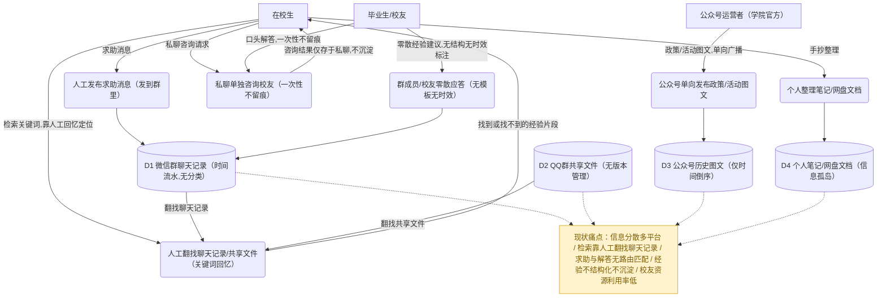

- **工具建议**：Mermaid（可直接渲染）；正式报告排版可导入 drawio 精修数据存储的"开口矩形"标准 DFD 符号。
- **对应代码/分析来源**：本图刻画系统建设前的人工现状（P1–P6 均为人工动作，无后端代码对应），痛点归纳依据 `docs/项目选题对抗评审报告.md` §一"总判决"（"微信群/公众号/小红书做不了结构化对比与沉淀"）与 `docs/design/00_总体架构与技术设计.md` 系统定位描述，非源码级溯源。

---

### 图2 建议系统顶层数据流图（0层）

- **图类型**：数据流图 DFD（0层/上下文图）
- **放报告**：第二章 §4.2
- **要画什么（元素清单）**：
  - 外部实体：在校生（STUDENT）、毕业生（ALUMNI）、管理员（ADMIN）；另加访客（GUEST，权限矩阵§5 明确列出，虚线只读）
  - 唯一加工：`0 新疆大学校友圈与双圈成长导航平台`（单一处理框，0层DFD只画一个加工）
  - 主要数据流（取自地基§5权限矩阵与各模块FR编号，双向标注）：
    - 在校生↔平台：注册/登录、认证申请材料、求助单/回答/追问/采纳、画像与成长标签、节点进度标记；平台回：JWT/认证结果/路由匹配通知/知识检索结果/双圈仪表盘
    - 毕业生↔平台：认证申请(邀请码/担保)、校友路径卡与可见性配置、机会发布；平台回：担保确认请求、去向统计与贡献者标识
    - 管理员↔平台：认证/知识候选/机会终审、举报处理、标签/时间线模板维护；平台回：统一审核队列/举报队列/运营看板
    - 访客↔平台（虚线）：只读浏览请求 / 公共FAQ与已发布知识只读内容
- **怎么画（结构描述）**：中心画一个圆（0层DFD惯例）标"0 平台"；四周环绕 4 个外部实体矩形（在校生/毕业生/管理员实线，访客虚线弱化）；每对实体与中心圆各画双向箭头（进/出分开），图注说明"双圈是视图层，不改变业务数据"。
- **可渲染源码**：

```mermaid
flowchart TB
  SYS(("0<br/>新疆大学校友圈与双圈<br/>成长导航平台"))
  STU["在校生 STUDENT"]
  ALU["毕业生 ALUMNI"]
  ADM["管理员 ADMIN"]
  GUE["访客 GUEST（认证前只读分层）"]

  STU -->|注册/登录信息(FR-M1-01/02)| SYS
  STU -->|认证申请材料(FR-M1-08)| SYS
  STU -->|求助单/回答/追问/采纳(FR-M4-01/06/08/10)| SYS
  STU -->|画像与成长标签(FR-M2-01/02)| SYS
  STU -->|节点进度标记(FR-M6-08)| SYS
  SYS -->|JWT令牌与用户信息| STU
  SYS -->|认证结果通知| STU
  SYS -->|路由匹配通知(FR-M4-02)| STU
  SYS -->|知识库检索结果(FR-M3-10)| STU
  SYS -->|双圈仪表盘/成长时间线视图(FR-M6-05)| STU

  ALU -->|认证申请(邀请码/担保材料)(FR-M1-09/10)| SYS
  ALU -->|校友路径卡与可见性配置(FR-M2-03/05)| SYS
  ALU -->|机会发布(FR-M5-01)| SYS
  SYS -->|担保确认请求通知(FR-M1-10)| ALU
  SYS -->|去向统计与贡献者标识(FR-M2-08/10)| ALU

  ADM -->|认证/知识候选/机会终审决定(FR-M7-03/04/08)| SYS
  ADM -->|举报处理决定(FR-M7-11)| SYS
  ADM -->|标签/时间线模板维护(FR-M7-13/15)| SYS
  SYS -->|统一审核队列与举报队列(FR-M7-01/10)| ADM
  SYS -->|运营数据统计看板(FR-M7-20)| ADM

  GUE -.->|只读浏览请求| SYS
  SYS -.->|公共FAQ/已发布知识只读内容| GUE
```

- **工具建议**：Mermaid 或 drawio（0层图元素少，drawio 更易画出标准圆形加工+矩形实体的教科书样式）。
- **对应代码/分析来源**：四类外部实体的读写边界对应 `docs/design/00_总体架构与技术设计.md` §5「角色与权限矩阵」（GUEST 只读 vs STUDENT/ALUMNI/ADMIN 分级读写）；图中各数据流标注的 FR 编号（FR-M1-01/02/08/09/10、FR-M4-01/02/06/10/11、FR-M2-01/03/05、FR-M7-01/03/04/08/10/11/13/20 等）逐条见 `docs/design/08_集成与一致性报告.md` §四「全局 FR 索引总表（117 条）」。

---

### 图3 系统总体业务流程图（主干）

- **图类型**：程序流程图/活动图（近似，单泳道，聚焦主干不分角色）
- **放报告**：第四章 §3.1
- **要画什么（元素清单）**：
  - 主干节点：注册（选择身份意向）→ 提交认证申请 → 认证结果判定 → 双圈仪表盘（scene=LIFE|STUDY）→ 当前诉求分支（查知识 / 发求助）
  - 查知识分支：知识库列表+全文搜索 → 知识条目详情+三态评价
  - 发求助分支（核心闭环）：发布求助单 → 路由匹配通知校友 → 模板化回答 → 追问循环(限次) → 采纳最佳回答 → 生成知识候选(CANDIDATE) → 管理员终审(隐私checklist) → 通过入库 PUBLISHED / 退回补充重审
  - 汇合终点：知识被时间线节点/搜索引用 → 成长时间线跟踪与补救优先级 → 循环回仪表盘
- **怎么画（结构描述）**：竖向主干流程图，起止用圆角"开始/结束"，判断用菱形，动作用矩形；"查知识"与"发求助"两条分支从同一菱形分岔，最终都汇入"成长时间线"节点后回仪表盘形成闭环。
- **可渲染源码**：

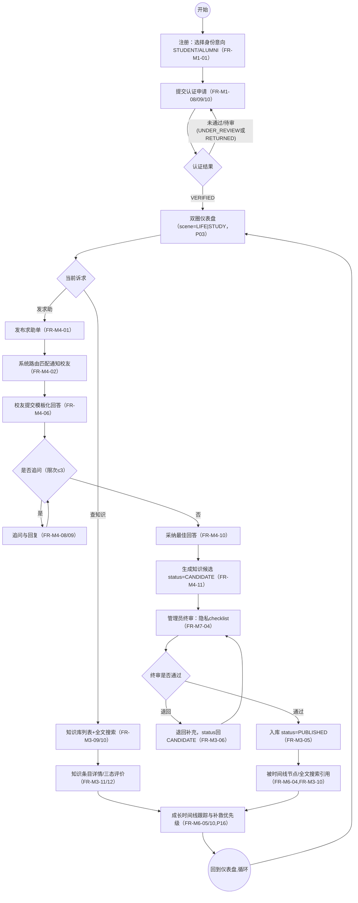

- **工具建议**：Mermaid 或 Visio（主干流程图，本图不分角色，Mermaid 足够）。
- **对应代码/分析来源**：认证判定分支对应 `module/user/service/impl/AuthApplicationServiceImpl.java` 的 `submit()`/`handleStudentSso()` 与 `AuthConst.AppStatus` 状态流转；发求助闭环对应 `module/help/service/impl/HelpTicketServiceImpl.java` 的 `createTicket()` → `HelpRouteServiceImpl.routeHelpTicket()` → `HelpAnswerServiceImpl.java` 的 `submitAnswer()`/`adopt()` → `module/knowledge/service/impl/KnowledgeEntryServiceImpl.java` 的 `createFromHelpAdoption()`；终审判定对应 `module/admin/service/impl/AuditTaskServiceImpl.java` 的 `decide()`；整体闭环叙述见 `docs/design/00_总体架构与技术设计.md` §7「核心闭环端到端时序」。

---

### 图4 全局用例图

- **图类型**：用例图（用例图 Mermaid 不擅长表达 include/extend，本组图4–图11 统一用 drawio/Visio "元素框+连线"清单，不提供 mermaid 源码）
- **放报告**：第四章 §3.2（需求分析总览）
- **要画什么（元素清单）**：
  - **参与者（4个）**：`GUEST`、`STUDENT`、`ALUMNI`、`ADMIN`。
  - **系统边界**：大矩形标题"成长导航平台"，内部按 M1–M7 七个模块分区（虚线框分组）。
  - M1（FR-M1-01/02/08/09/10/14/15）：用户注册、登录、提交在校生认证申请、提交毕业生认证申请(邀请码)、提交毕业生认证申请(人工+担保)、批量生成毕业生邀请码、认证终审
  - M2（FR-M2-01/03/06/09）：维护在校生画像、新建/编辑校友路径卡、浏览校友路径卡列表、路径推荐
  - M3（FR-M3-01/09/10/12）：创建知识条目、知识条目列表(分类筛选)、全文搜索、提交三态评价
  - M4★系统灵魂（FR-M4-01/02/06/10/11）：发布求助单、求助-校友路由匹配(系统自动)、提交模板化回答、采纳最佳回答、采纳后生成知识候选
  - M5（FR-M5-01/06/11/13）：发布机会、机会列表(类型筛选/即将截止)、发起队伍、申请加入队伍
  - M6（FR-M6-01/05/07/08）：维护时间线模板、查看我的成长时间线、选择/切换发展路线、标记节点个人进度
  - M7（FR-M7-01/09/11/13/20）：统一审核队列、提交举报、处理举报、标签维护、运营数据统计看板
  - **系统**参与者（定时任务/事件监听）：连"求助-校友路由匹配""知识候选自动完整性/隐私预检"两个系统自动用例。
- **怎么画（结构描述）**：
  1. 横向大矩形作系统边界，标题顶部居中"成长导航平台"。
  2. 内部 7 个虚线圆角框划分 M1–M7（参照地基§8依赖顺序 M1→M2/M4→M3/M5→M6→M7），每框放 3–6 个用例椭圆。
  3. 参与者：左侧从上到下 `GUEST`/`STUDENT`/`ALUMNI`；`ADMIN` 右侧单列（治理端与用户端分离）；"系统"放下方。
  4. 关联线：`GUEST` 连注册/登录/知识列表/全文搜索/机会列表（认证前只读分层）；`STUDENT` 连 M1–M6 对应用例；`ALUMNI` 连毕业生认证/路径卡/发布机会；`ADMIN` 只连 M7 与认证终审/批量邀请码。
  5. 核心闭环：加粗虚线箭头链把 M4"发布求助单→路由匹配→模板化回答→采纳→生成知识候选"→M3"创建知识条目(候选态)"→M7"统一审核队列"→M3"知识条目列表"串起，旁批注"核心闭环，重点演示"。
  6. include：`发布求助单`→`求助-校友路由匹配`；`采纳最佳回答`→`采纳后生成知识候选`；`提交在校生认证申请`→前置"自动核验"。
  7. extend：`认证终审`→虚线延伸"打回补充材料"(RETURNED 分支)。
- **可渲染源码或画法**：drawio/Visio 摆放（7个分组虚线框 + 4主体参与者 + 1系统参与者 + 约28个用例椭圆 + 1条加粗核心闭环链）。
- **工具建议**：drawio（分组框用"容器"功能天然支持）；备选 Visio。
- **对应代码/分析来源**：M1–M7 七个分组内的 28 个用例对应 `backend/src/main/java/com/xju/sem/module/{user,profile,knowledge,help,opportunity,timeline,admin}/controller` 下 26 个 `*Controller` 类的 REST 端点（如 `AuthController.register()/login()`、`HelpTicketController.createTicket()`、`AuditTaskController.decide()`）；FR 编号与优先级见 `docs/design/08_集成与一致性报告.md` §四「全局 FR 索引总表（117 条）」；核心闭环加粗链对应图8/图13 同一调用链（`HelpAnswerServiceImpl.adopt()` → `KnowledgeEntryServiceImpl.createFromHelpAdoption()` → `AuditTaskServiceImpl.decide()`）。

---

### 图5 M1 用户与认证 模块用例图

- **图类型**：用例图
- **放报告**：第四章 §3.3
- **要画什么（元素清单）**：
  - **参与者**：`GUEST`、`STUDENT`、`ALUMNI`、`ADMIN`；额外**系统**参与者（"模拟统一身份认证核验"、"担保超时"定时任务）。
  - **用例椭圆（FR-M1-01~17，17 条）**：1 用户注册(GUEST)、2 登录(GUEST)、3 Token刷新、4 登出、5 查看当前用户信息、6 修改基本信息、7 修改隐私设置、8 提交在校生认证申请(STUDENT)、9 提交毕业生认证申请(邀请码)(ALUMNI)、10 提交毕业生认证申请(人工+担保)(ALUMNI)、11 担保人确认/拒绝、12 查看认证进度、13 撤回/重新提交认证申请、14 批量生成毕业生邀请码(ADMIN)、15 认证终审(ADMIN,跨M7)、16 认证前只读权限校验(系统性公共用例)、17 禁用/启用账号(ADMIN)。
  - **系统自动用例**：模拟统一身份认证核验(`mockSsoVerify`)、担保超时提醒定时任务。
- **怎么画（结构描述）**：
  1. 边界标题"M1 用户与认证"。
  2. 左侧上到下 `GUEST`→`STUDENT`→`ALUMNI`；右侧 `ADMIN`；下方"系统"。
  3. 内部两纵列：左列"账号与会话"(1–7)、右列"分级身份认证"(8–15、17)；用例16 顶部中央（横跨全部写用例）。
  4. 关联线：`GUEST` 连1、2；三角色都连3–7；`STUDENT` 连8；`ALUMNI` 连9、10；`STUDENT`+`ALUMNI` 连11；申请人连12、13；`ADMIN` 连14、15、17。
  5. include：用例8→"模拟统一身份认证核验"；用例10→"查询可担保人候选(同专业已认证)"；用例1–15、17→用例16(认证前只读权限校验)。
  6. extend：用例15→"打回补充材料"(UNDER_REVIEW→RETURNED)；用例11→"两人均CONFIRMED后自动转人工终审"。
  7. "系统"连"模拟统一身份认证核验"与"担保超时提醒定时任务"。
- **可渲染源码或画法**：drawio/Visio 元素清单：4+1 参与者、17+2 用例椭圆、约 20 条关联/include/extend 连线。
- **工具建议**：drawio；备选 Visio。
- **对应代码/分析来源**：用例1–4对应 `module/user/controller/AuthController.java` 的 `register()/login()/refresh()/logout()`；用例5–7对应 `UserController.java` 的 `me()/updateMe()/updatePrivacy()`；用例8–13对应 `AuthApplicationController.java` 的 `submit()/myApplications()/detail()/withdraw()/resubmit()/guarantee()`（Service 层 `AuthApplicationServiceImpl` 的 `handleStudentSso()/handleStudentManual()/handleInviteClaim()/handleGuarantee()`）；用例14对应 `InviteCodeController.java` 的 `batch()`；FR-M1-01~17 见 `docs/design/08_集成与一致性报告.md` §四 FR 索引总表。

---

### 图6 M2 成长画像与校友路径 模块用例图

- **图类型**：用例图
- **放报告**：第四章 §3.4
- **要画什么（元素清单）**：
  - **参与者**：`STUDENT`、`ALUMNI`、`ADMIN`（浏览类用例用三者共同连接表达"全角色须登录"）。
  - **用例椭圆（FR-M2-01~11，11 条）**：1 维护在校生画像(STUDENT)、2 维护成长标签(STUDENT/ALUMNI)、3 新建/编辑校友路径卡(ALUMNI)、4 发布/撤回路径卡(ALUMNI)、5 配置字段级可见性(ALUMNI)、6 浏览校友路径卡列表、7 查看路径卡详情、8 按专业聚合去向统计、9 路径推荐(STUDENT)、10 展示贡献者标识与计数、11 路径卡举报下架/复核恢复(ADMIN,供M7调用)。
- **怎么画（结构描述）**：
  1. 边界标题"M2 成长画像与校友路径"。`STUDENT` 左上、`ALUMNI` 左下、`ADMIN` 右侧。
  2. 上区"画像与标签"(1、2、9、10)，下区"校友路径卡"(3、4、5、6、7、8、11)。
  3. 关联线：`STUDENT` 连1、2、9、6、7、8、10；`ALUMNI` 连2、3、4、5、6、7、8、10；`ADMIN` 连11、6、7、8。
  4. include：用例3→"去向类型分支必填校验"；用例7→"字段级可见性计算(SELF/SAME_MAJOR/PUBLIC 脱敏)"；用例8→"样本门槛(≥20)与二级维度k-匿名(≥5)校验"；用例9→"候选池构建+打分排序+多样性去重"。
  5. extend：用例4→"DRAFT↔PUBLISHED"；用例11→跨模块批注"由 M7 举报处理(dispatchReportAction)触发调用"。
- **可渲染源码或画法**：drawio/Visio：3 参与者、11 用例椭圆、约 15 条连线（含4条include、2条extend/跨模块批注）。
- **工具建议**：drawio；备选 Visio。
- **对应代码/分析来源**：用例1对应 `module/profile/controller/StudentProfileController.java` 的 `me()/updateMe()`；用例3–5对应 `AlumniPathCardController.java` 的创建/编辑/可见性端点（Service `AlumniPathCardServiceImpl`）；用例8对应 `MajorDestinationStatsController.java`；用例9对应 `PathRecommendationController.java`（Service `PathRecommendationServiceImpl`）；FR-M2-01~11 见 `docs/design/08_集成与一致性报告.md` §四 FR 索引总表。

---

### 图7 M3 经验知识库 模块用例图

- **图类型**：用例图
- **放报告**：第四章 §3.5
- **要画什么（元素清单）**：
  - **参与者**：`GUEST`、`STUDENT`、`ALUMNI`、`ADMIN`；**系统**参与者（M4采纳触发 + 三个定时任务）。
  - **用例椭圆（FR-M3-01~18，18 条）**：1 创建知识条目(原创)、2 采纳生成知识候选(系统,M4触发)、3 编辑知识条目、4 提交审核、5 知识候选终审通过(ADMIN,跨M7)、6 知识候选终审退回(ADMIN,跨M7)、7 手动下线、8 内容认领更新、9 知识条目列表(分类筛选,含GUEST)、10 全文搜索(含GUEST)、11 查看详情(含GUEST)、12 提交/更新三态评价、13 查看三态评价统计(含GUEST)、14 我的知识贡献列表、15 软删除知识条目、16 定时:过期自动降权(系统)、17 定时:三态反馈驱动降权与预警(系统)、18 定时:长期未维护释放认领(系统)。
- **怎么画（结构描述）**：
  1. 边界标题"M3 经验知识库"。`GUEST` 最左(只连读)；`STUDENT`/`ALUMNI` 左中；`ADMIN` 右；"系统"下方。
  2. 分三区：左"创建与编辑"(1、3、4、7、8、15)、中"检索与浏览"(9、10、11、13、14)、右"审核"(5、6)；下方"定时任务"横条放2、16、17、18。
  3. 关联线：`GUEST` 只连9、10、11、13；已认证三角色连1、3、4、7、8、12、14、15、9、10、11、13；`ADMIN` 单独连5、6。
  4. include：用例1→"公共信息导航强制外链校验(高时效信息不自存红线)"；用例10→"MySQL FULLTEXT(ngram)匹配,短关键词兜底LIKE"；用例12→"upsert+计数原子更新"；用例2→"自动调用submitForReview进入REVIEWING"。
  5. extend：用例3→"对PUBLISHED内容发起修订(轻量重审,直接转REVIEWING)"。
  6. 跨模块批注：用例2 旁批注"由 M4 `HelpAnswerService.adopt()` 调用 `KnowledgeEntryService.createFromHelpAdoption`(AFTER_COMMIT异步)触发"；"系统"连2、16、17、18。
- **可渲染源码或画法**：drawio/Visio：4+1 参与者、18 用例椭圆、约 22 条连线。
- **工具建议**：drawio；备选 Visio。
- **对应代码/分析来源**：用例1/3/4/7/9/10/11对应 `module/knowledge/controller/KnowledgeEntryController.java` 的 create/update/list/search/getById 端点（Service `KnowledgeEntryServiceImpl`）；用例2对应 `KnowledgeEntryServiceImpl.createFromHelpAdoption()`（由 M4 `HelpAnswerAdoptedListener` 触发）；用例12/13对应 `KnowledgeFeedbackController.java`；FR-M3-01~18 见 `docs/design/08_集成与一致性报告.md` §四 FR 索引总表。

---

### 图8 M4 结构化求助 模块用例图（系统灵魂/核心闭环枢纽）

- **图类型**：用例图
- **放报告**：第四章 §3.6
- **要画什么（元素清单）**：
  - **参与者**：`STUDENT`(主)、`ALUMNI`、`ADMIN`；**系统**参与者（路由匹配算法 + 两个定时任务）。
  - **用例椭圆（FR-M4-01~13，13 条）**：1 发布求助单、2 求助-校友路由匹配(系统,★验收核心)、3 路由重试与兜底升级(定时,系统)、4 浏览求助单列表(本专业高频)、5 查看求助单详情、6 提交模板化回答、7 编辑本人回答、8 提交追问(限次)、9 回复追问、10 采纳最佳回答、11 采纳后生成知识候选(系统,调M3)、12 关闭求助单(求助人/系统)、13 撤回求助单。
- **怎么画（结构描述）**：
  1. 边界标题"M4 结构化求助★核心闭环"。`STUDENT` 左上(兼求助人/回答人)、`ALUMNI` 左下、`ADMIN` 左中、"系统"右。
  2. 内部按时间轴横排：1→2→4/5→6→8/9→10→11→12/13；用例2、3、11 浅色底纹标"系统自动执行"。
  3. 关联线：三角色都连1、4、5、6、7；求助人连8、10、12、13；回答人连9。
  4. include：用例1→用例2(发布后同调用链自动触发,必然)；用例10→用例11(采纳提交后AFTER_COMMIT异步,必然)；用例8旁批注"限次校验(MAX_FOLLOWUP_PER_ANSWER=3)"。
  5. extend：用例3→用例2(仅"长时间零应答"触发)；用例12→"系统自动关闭"分支(超时无应答/采纳宽限期到期)。
  6. 跨模块批注：用例11 旁批注"调用 M3 `KnowledgeEntryService.createFromHelpAdoption`"；"系统"连2、3、11、12(自动分支)。
  7. 角落批注"系统灵魂：发求助→路由通知→回答→采纳→生成候选→审核入库"。
- **可渲染源码或画法**：drawio/Visio：3+1 参与者、13 用例椭圆、约 18 条连线（含3条include、2条extend）。
- **工具建议**：drawio；备选 Visio。
- **对应代码/分析来源**：用例1对应 `module/help/controller/HelpTicketController.java` 的 `createTicket()`（Service `HelpTicketServiceImpl.createTicket()`）；用例2对应 `module/help/service/impl/HelpRouteServiceImpl.java` 的 `routeHelpTicket()`（打分常量 `W_MAJOR`/`W_ALUMNI_IDENTITY`/`W_TRUST` 等）；用例6/7对应 `HelpAnswerController.java` 的 `submitAnswer()/editAnswer()`；用例8/9对应 `HelpFollowupController.java` 的 `submitFollowup()`；用例10对应 `HelpAnswerServiceImpl.adopt()`；用例11对应 `module/help/service/impl/HelpAnswerAdoptedListener.java` 调用 `KnowledgeEntryService.createFromHelpAdoption()`；FR-M4-01~13 见 `docs/design/08_集成与一致性报告.md` §四 FR 索引总表。

---

### 图9 M5 机会与组队 模块用例图

- **图类型**：用例图
- **放报告**：第四章 §3.7
- **要画什么（元素清单）**：
  - **参与者**：`ALUMNI`、`ADMIN`、`STUDENT`；**系统**参与者（机会状态推进与级联结束定时任务）。
  - **用例椭圆（FR-M5-01~24，24 条，其中 21~24 内推按 09设计修订说明标 Could 本期不落代码，图中虚线椭圆保留）**：
    - 机会：1 发布机会、2 编辑机会、3 机会终审(ADMIN,跨M7)、4 手动结束机会、5 机会强制下线/维护(ADMIN)、6 机会列表(类型筛选/即将截止)、7 机会详情查看、8 简单报名信令、9 定时:机会状态推进(系统)、10 定时:机会ENDED级联结束队伍(系统)
    - 队伍：11 发起队伍、12 编辑队伍信息(队长)、13 申请加入队伍、14 审批加入申请(队长)、15 退出队伍、16 移除成员(队长)、17 队伍状态流转(队长)、18 组队广场列表、19 队伍详情(含成员列表)、20 我发起/加入的队伍列表
    - 内推(Could,虚线)：21 申请内推、22 内推人更新进度、23 查看我的内推申请单(私密)、24 申请人撤回内推申请
- **怎么画（结构描述）**：
  1. 边界标题"M5 机会与组队"。`ALUMNI` 左上、`ADMIN` 右上、`STUDENT` 左下、"系统"右下。
  2. 分三区：上"机会"(1–10)、中"队伍"(11–20)、下"内推(Could)"(21–24,虚线大框标"本期不落代码,仅设计留存")。
  3. 关联线：`ALUMNI`/`ADMIN` 连1、2、4；`ADMIN` 单独连3、5；全角色连6、7；`STUDENT`/`ALUMNI` 连8、11、13、18、19、20；队长连12、14、16、17；已批准成员连15；内推相关连21、23、24。
  4. include：用例11→"校验机会team_required=1且状态∈{ONGOING,CLOSING_SOON}"；用例14→"current_count CAS防超员"；用例1→"referralAvailable=1时校验role=ALUMNI且type=INTERNSHIP"。
  5. extend：用例9→用例10(仅机会转ENDED级联)；用例21→"关联机会(可选)"；用例3→"拒绝后可编辑重提(S18)"。
  6. "系统"连9、10。
- **可渲染源码或画法**：drawio/Visio：3+1 参与者、24 用例椭圆(其中4个虚线Could)、约 26 条连线。
- **工具建议**：drawio（虚线框圈"内推Could分区"表达清晰）；备选 Visio。
- **对应代码/分析来源**：用例1–8对应 `module/opportunity/controller/OpportunityController.java` 的 list/closing-soon/getById/create/update/delete 端点（Service `OpportunityServiceImpl`）；用例11–20对应 `TeamController.java` 的 `/api/v1/teams` 系列端点（Service `TeamServiceImpl`/`TeamMemberServiceImpl`）；用例21–24（内推,虚线Could）对应 `backend/src/main/resources/schema.sql` 的 `referral_ticket` 表（仅建表未落 Controller/Service 代码，与图注"本期不落代码"一致）；FR-M5-01~24 见 `docs/design/08_集成与一致性报告.md` §四 FR 索引总表（FR-M5-21~24 标 Could）。

---

### 图10 M6 成长时间线 模块用例图

- **图类型**：用例图
- **放报告**：第四章 §3.8
- **要画什么（元素清单）**：
  - **参与者**：`STUDENT`、`ADMIN`；**系统**参与者（逾期判定与补救优先级计算，随请求实时计算，无独立定时任务）。
  - **用例椭圆（FR-M6-01~13，13 条）**：1 维护时间线模板(ADMIN)、2 发布/下线时间线模板(ADMIN)、3 维护时间线节点(ADMIN)、4 维护节点关联引用(ADMIN)、5 查看我的成长时间线(动态导航聚合视图,STUDENT)、6 预览分化路线内容(决策前对比)、7 选择/切换发展路线、8 标记/切换节点个人进度、9 逾期节点动态判定(系统)、10 生成补救优先级提示(系统)、11 查看整体完成度统计(个人视角)、12 查看专业级时间线完成度统计(ADMIN)、13 节点引用计数只读查询(系统,供他模块调用)。
- **怎么画（结构描述）**：
  1. 边界标题"M6 成长时间线"。`ADMIN` 左(模板/节点维护)、`STUDENT` 右(个人时间线)、"系统"下方。
  2. 分两区：左"模板与节点维护"(1、2、3、4、12)、右"学生端动态导航"(5、6、7、8、9、10、11)；用例13 底部(跨模块被调用)。
  3. 关联线：`ADMIN` 连1、2、3、4、12；`STUDENT` 连5、6、7、8、11。
  4. include：用例5→用例9(每次查看必算逾期)；用例5→用例10(聚合视图组装的一部分)；用例4→"按refType调用M2/M3/M5的existsXxx/getBrief校验ref_id存在性"。
  5. extend：用例7→"首次访问懒初始化"(仅UNDECIDED默认线首访触发)；用例2→"发布前置校验≥1个节点"。
  6. 跨模块批注：用例13 旁批注"供 M2/M3/M5 详情页展示'被N个时间线节点引用'"；"系统"连9、10、13。
- **可渲染源码或画法**：drawio/Visio：2+1 参与者、13 用例椭圆、约 16 条连线。
- **工具建议**：drawio；备选 Visio。
- **对应代码/分析来源**：用例1–4对应 `module/timeline/controller/TimelineTemplateController.java` 与 `TimelineNodeController.java` 的模板/节点/引用端点（Service `TimelineTemplateServiceImpl`/`TimelineNodeServiceImpl`/`TimelineNodeRefServiceImpl`）；用例5–11对应 `MyTimelineController.java` 的 `getMyTimeline()/getMySummaryCard()/previewRoute()/confirmRoute()/getRemediationHints()/getProgressSummary()`（Service `UserProgressServiceImpl`，含私有 `lazyInit()` 懒初始化）；用例12对应 `TimelineStatsController.java` 的 `by-major` 端点；FR-M6-01~13 见 `docs/design/08_集成与一致性报告.md` §四 FR 索引总表。

---

### 图11 M7 平台管理与内容治理 模块用例图

- **图类型**：用例图
- **放报告**：第四章 §3.9
- **要画什么（元素清单）**：
  - **参与者**：`ADMIN`(主)、`STUDENT`/`ALUMNI`(举报人/申请人)；**系统**参与者（审核事件监听、知识候选自动预检、审核吞吐量定时任务）。
  - **用例椭圆（FR-M7-01~21，21 条）**：1 统一审核队列、2 审核任务详情、3 认证申请人工终审、4 知识候选终审(隐私checklist驱动)、5 知识候选自动完整性/隐私预检(系统)、6 批量通过、7 批量退回、8 机会终审、9 提交举报(登录用户不含GUEST)、10 举报队列/详情(治理端)、11 处理举报、12 查看我提交的举报记录、13 标签维护、14 标签管理列表(含使用计数)、15 时间线模板维护(路由挂本模块/Service复用M6)、16 时间线节点维护(含关联引用)、17 机会内容管理入口(复用M5 CRUD)、18 申请贡献者认证(ALUMNI)、19 贡献者认证审核(ADMIN)、20 运营数据统计看板、21 定时:审核吞吐量快照与积压预警(系统)。
- **怎么画（结构描述）**：
  1. 边界标题"M7 平台管理与内容治理（P18管理后台）"。`ADMIN` 左；`STUDENT`/`ALUMNI` 右(仅连9、12、18)；"系统"下方。
  2. 按 P18 五个 Tab 分五区：Tab①统一审核队列(1、2、3、4、5、6、7、8)、Tab②举报(9、10、11、12)、Tab③标签体系(13、14)、Tab④时间线模板/节点/机会内容(15、16、17)、Tab⑤贡献者认证与运营统计(18、19、20、21)。
  3. 关联线：`ADMIN` 连1、2、3、4、6、7、8、10、11、13、14、15、16、17、19、20；举报人连9、12；`ALUMNI` 单独连18。
  4. **泛化(generalization)**：用例3、4、8、19 用空心三角箭头指向抽象父用例"统一终审决定(decide)"（对应 M7 §6.3 `decide()` 统一入口，四类目标共用 `audit_task` CAS+分发）。
  5. include：用例1→用例2(列表点击进详情)；用例11→"举报处理分发dispatchReportAction,按targetType调用M1/M2/M3/M4/M5对应下架方法"；用例9→"同一reporter对同一target的PENDING记录去重合并"。
  6. extend：用例4→"checklist任一勾选强制转退回"；用例6/7→用例3/4/8(批量本质是逐条调 `decide()`,仅 KNOWLEDGE_ENTRY/OPPORTUNITY 支持,AUTH_APPLICATION/CONTRIBUTOR_CERT 不支持,需批注30702错误码限制)。
  7. "系统"连5、21。
- **可渲染源码或画法**：drawio/Visio：2(+1泛化父用例)+1 参与者、21+1 用例椭圆、约 26 条连线（含4条泛化箭头、3条include、2条extend）。
- **工具建议**：drawio（泛化/include/extend 三种箭头样式在 drawio 用例图模板中都有现成图形）；备选 Visio。
- **对应代码/分析来源**：用例1–8对应 `module/admin/controller/AuditTaskController.java` 的 `list()/detail()/decide()`（Service `AuditTaskServiceImpl.decide()` 统一终审入口）；用例9–12对应 `ReportController.java`（Service `ReportServiceImpl.handle()`，类注释标注对应 `docs/design/07_M7_平台管理与内容治理_详细设计.md` §6.4 `dispatchReportAction` 设计概念）；用例13/14对应 `TagAdminController.java`/`TagController.java`；用例18/19对应 `ContributorCertController.java`（Service `ContributorCertServiceImpl`）；用例20对应 `StatsController.java` 的 `overview()/audit-throughput()`；FR-M7-01~21 见 `docs/design/08_集成与一致性报告.md` §四 FR 索引总表。

---

### 图12 一层数据流图（7个加工）

- **图类型**：数据流图 DFD（1层，按地基§8模块划分展开为7个加工）
- **放报告**：第四章 §3.2
- **要画什么（元素清单）**：
  - 外部实体：在校生（STUDENT）、毕业生（ALUMNI）、管理员（ADMIN）
  - 7个加工（对应地基§8模块）：1 用户与认证(M1)、2 画像与校友路径(M2)、3 经验知识库(M3)、4 结构化求助★(M4,系统灵魂)、5 机会与组队(M5)、6 成长时间线(M6)、7 平台管理与治理(M7)
  - 数据存储（按25表分组归并）：D1 `user/student_profile/alumni_profile/auth_application`、D2 `tag/user_tag/alumni_path_card/path_visibility`、D3 `knowledge_entry/knowledge_feedback`、D4 `help_ticket/help_answer/help_followup/help_route`、D5 `opportunity/team/team_member/referral_ticket`、D6 `timeline_template/timeline_node/timeline_node_ref/user_progress`、D7 `audit_task/report`、D0 `notification`(全局)
- **怎么画（结构描述）**：外部实体画在左侧；7个加工按地基§8依赖方向从上到下排列(1最上,4居中标★,7最下靠审核回路)；数据存储画在右侧对齐各自加工；模块间**弱耦合**依赖(只通过用户ID/标签/状态/关联ID/候选队列耦合)用虚线箭头,核心业务流用实线箭头。
- **可渲染源码**：

```mermaid
flowchart TB
  STU["在校生 STUDENT"]
  ALU["毕业生 ALUMNI"]
  ADM["管理员 ADMIN"]

  P1(("1 用户与认证"))
  P2(("2 画像与校友路径"))
  P3(("3 经验知识库"))
  P4(("4 结构化求助★"))
  P5(("5 机会与组队"))
  P6(("6 成长时间线"))
  P7(("7 平台管理与治理"))

  D1[("D1 user/student_profile/alumni_profile/auth_application")]
  D2[("D2 tag/user_tag/alumni_path_card/path_visibility")]
  D3[("D3 knowledge_entry/knowledge_feedback")]
  D4[("D4 help_ticket/help_answer/help_followup/help_route")]
  D5[("D5 opportunity/team/team_member/referral_ticket")]
  D6[("D6 timeline_template/timeline_node/timeline_node_ref/user_progress")]
  D7[("D7 audit_task/report")]
  D0[("D0 notification（全局）")]

  STU -->|注册/登录/认证申请| P1
  ALU -->|认证申请(邀请码/担保)| P1
  P1 --> D1
  P1 -->|JWT/认证结果| STU
  P1 -->|认证结果/担保通知| ALU
  P1 -.->|user_id/role/auth_status只读| P2
  P1 -.->|isVerified,major_tag_id/grade_level只读| P4
  P1 -.->|role/auth_status只读| P5
  P1 -.->|major_tag_id/grade_level只读| P6

  STU -->|维护画像/成长标签| P2
  ALU -->|校友路径卡/可见性配置| P2
  P2 --> D2
  P2 -->|画像详情/路径推荐/去向统计| STU
  P2 -->|路径卡详情/贡献者标识| ALU
  P2 -.->|标签匹配(GROWTH/MAJOR)只读| P4

  STU -->|求助单/追问/采纳| P4
  ALU -->|模板化回答| P4
  P4 --> D4
  P4 -->|路由通知/回答/追问| STU
  P4 -->|路由通知/回答| ALU
  P4 -->|采纳生成知识候选(FROM_HELP)| P3

  STU -->|创建/搜索/评价知识条目| P3
  ALU -->|创建/搜索/评价知识条目| P3
  ADM -->|创建知识条目| P3
  P3 --> D3
  P3 -->|检索结果/详情| STU
  P3 -->|检索结果/详情| ALU
  P3 -->|提交审核事件| P7
  P7 -->|终审决定| P3

  P1 -->|认证申请提交事件| P7
  P7 -->|终审决定| P1

  ALU -->|发布机会| P5
  ADM -->|发布官方机会/审批| P5
  P5 --> D5
  P5 -->|机会/队伍详情| STU
  P5 -->|机会/队伍详情| ALU
  P5 -->|机会提交审核事件| P7
  P7 -->|终审决定| P5

  P3 -.->|知识条目只读引用| P6
  P2 -.->|路径卡只读引用| P6
  P5 -.->|机会只读引用| P6
  STU -->|标记节点进度/选择路线| P6
  P6 --> D6
  P6 -->|时间线聚合视图/补救优先级| STU

  ADM -->|维护标签/时间线模板/处理举报| P7
  P7 --> D7
  P7 -->|维护| D2
  P7 -->|维护| D6
  P7 -->|审核队列/举报队列/统计看板| ADM

  P1 -.-> D0
  P3 -.-> D0
  P4 -.-> D0
  P5 -.-> D0
  P7 -.-> D0
  D0 -.->|站内通知| STU
  D0 -.->|站内通知| ALU
  D0 -.->|站内通知| ADM
```

- **工具建议**：Visio 或 PowerDesigner（正式提交建议画标准 DFD 符号：圆=加工、开口矩形=数据存储、矩形=外部实体）；draft 阶段用 Mermaid 校验数据流方向是否闭环一致。
- **对应代码/分析来源**：7 个加工分别对应 `module/user`、`module/profile`、`module/knowledge`、`module/help`、`module/opportunity`、`module/timeline`、`module/admin` 七个包下的 `*ServiceImpl` 集合（如加工4结构化求助对应 `HelpTicketServiceImpl`/`HelpRouteServiceImpl`/`HelpAnswerServiceImpl`）；模块划分与依赖顺序见 `docs/design/00_总体架构与技术设计.md` §8「模块划分与依赖关系」；D1–D7/D0 数据存储对应 `backend/src/main/resources/schema.sql` 中 `user`/`auth_application`、`tag`/`alumni_path_card`、`knowledge_entry`、`help_ticket`/`help_route`、`opportunity`/`team`、`timeline_template`/`user_progress`、`audit_task`/`report`、`notification` 等真实建表。

---

### 图13 二层数据流图（核心闭环展开）

- **图类型**：数据流图 DFD（2层，展开图12"加工4 结构化求助"与"加工3 经验知识库""加工7 平台管理与治理"围绕核心闭环的交互）
- **放报告**：第四章 §3.2
- **要画什么（元素清单）**：
  - 展开子加工（`模块.序号` 编号，对应真实 FR）：4.1 发布求助单、4.2 求助-校友路由匹配(标签打分/排序/取TopK)、4.3 提交模板化回答(前提/步骤/注意事项三段式)、4.4 追问/回复(限次校验)、4.5 采纳最佳回答、4.6 采纳后事件分发(AFTER_COMMIT异步)、3.1 采纳生成知识候选(`createFromHelpAdoption`,status=CANDIDATE,source_type=FROM_HELP)、7.1 知识候选自动完整性/隐私预检(正则扫描)、7.2 知识候选终审(隐私checklist,三项任一命中强制RETURN)、3.2 终审通过入库(PUBLISHED,weight_score=100)、3.3 终审退回补充(回CANDIDATE)、3.4 全文搜索/被时间线节点引用(FULLTEXT ngram)
  - 数据存储：D4.1 `help_ticket`、D4.2 `help_answer`(含 `knowledge_entry_id`)、D4.3 `help_followup`、D4.4 `help_route`、D3.1 `knowledge_entry`、D7.1 `audit_task`(`review_kind=NEW_FROM_HELP`)、D0 `notification`
  - 外部角色：求助人(在校生/毕业生)、应答校友、管理员
- **怎么画（结构描述）**：按闭环顺序自上而下画：求助人发起 → 4.1 → 4.2 → 通知应答校友 → 4.3 → 4.4(可选循环) → 4.5 采纳 → 4.6 事件分发 → 3.1 创建候选并回写 D4.2 → 7.1 预检 → 7.2 终审 → 分两支：命中隐私/不通过 → 3.3 退回；通过 → 3.2 入库 → 3.4 可搜索/被引用。每条数据流箭头标注实际字段变化（如 `status:OPEN→MATCHED`）。
- **可渲染源码**：

```mermaid
flowchart TB
  ASKER["求助人（在校生/毕业生）"]
  RESP["应答校友"]
  ADMIN["管理员 ADMIN"]

  P41("4.1 发布求助单")
  P42("4.2 求助-校友路由匹配（标签打分TopK）")
  P43("4.3 提交模板化回答")
  P44("4.4 追问/回复（限次≤3）")
  P45("4.5 采纳最佳回答")
  P46("4.6 采纳事件分发（AFTER_COMMIT异步）")
  P31("3.1 采纳生成知识候选（createFromHelpAdoption）")
  P71("7.1 知识候选自动预检（隐私/完整性正则扫描）")
  P72("7.2 知识候选终审（隐私checklist驱动）")
  P32("3.2 终审通过入库")
  P33("3.3 终审退回补充")
  P34("3.4 全文搜索/被时间线节点只读引用")

  D41[("D4.1 help_ticket")]
  D42[("D4.2 help_answer(含knowledge_entry_id)")]
  D43[("D4.3 help_followup")]
  D44[("D4.4 help_route")]
  D31[("D3.1 knowledge_entry")]
  D71[("D7.1 audit_task(review_kind=NEW_FROM_HELP)")]
  D0[("D0 notification")]

  ASKER -->|求助单:专业/年级/问题类型/方向(FR-M4-01)| P41 --> D41
  P41 --> P42
  P42 -->|写入help_route,batch_no=1| D44
  P42 -->|status:OPEN→MATCHED| D41
  P42 -->|通知:HELP_ROUTE_MATCHED| D0 -.->|站内通知| RESP

  RESP -->|前提/步骤/注意事项(FR-M4-06)| P43 --> D42
  P43 -->|status:MATCHED→ANSWERED| D41
  P43 -.-> D0 -.->|通知求助人| ASKER

  ASKER -->|追问content(限次,FR-M4-08)| P44
  RESP -->|回复content(FR-M4-09)| P44
  P44 --> D43
  P44 -.-> D0

  ASKER -->|采纳answerId(FR-M4-10)| P45
  P45 -->|is_adopted=1| D42
  P45 -->|adopted_answer_id,status:ANSWERED→ADOPTED| D41
  P45 --> P46 --> P31

  P31 -->|读回答正文| D42
  P31 -->|创建status=CANDIDATE,source_type=FROM_HELP,source_help_id=ticketId| D31
  P31 -->|回写knowledge_entry_id| D42
  P31 -->|自动提交审核status:CANDIDATE→REVIEWING| D31
  P31 -->|创建status=PENDING,review_kind=NEW_FROM_HELP| D71

  D71 --> P71 -->|写pre_check_result| D71
  P71 --> P72
  ADMIN -->|调阅详情+checklist勾选| P72
  P72 -->|checklist任一命中,强制RETURN| P33
  P33 -->|status:REVIEWING→CANDIDATE,附标准理由| D31
  P33 -.-> D0 -.->|通知作者补充| RESP

  P72 -->|三项均未命中,ADMIN选APPROVE| P32
  P32 -->|status:REVIEWING→PUBLISHED,published_at写入,weight_score=100| D31
  P32 --> P34
  P34 -->|FULLTEXT检索命中/timeline_node_ref只读引用| ASKER
```

- **工具建议**：Mermaid（可直接渲染验证闭环）；正式报告可用 PowerDesigner 按标准 DFD 符号重绘，突出"系统灵魂"闭环的验收核心地位。
- **对应代码/分析来源**：4.1 对应 `HelpTicketServiceImpl.createTicket()`；4.2 对应 `HelpRouteServiceImpl.routeHelpTicket()`（写入 `help_route`，`status:OPEN→MATCHED`）；4.3 对应 `HelpAnswerServiceImpl.submitAnswer()`；4.4 对应 `HelpFollowupServiceImpl.submitFollowup()`；4.5/4.6 对应 `HelpAnswerServiceImpl.adopt()` 与 `module/help/service/impl/HelpAnswerAdoptedListener.java`（`@TransactionalEventListener(AFTER_COMMIT)`）；3.1 对应 `KnowledgeEntryServiceImpl.createFromHelpAdoption()`；7.1 对应 `module/admin/service/impl/PreCheckServiceImpl.java` 的 `runPreCheck()`；7.2/3.2/3.3 对应 `AuditTaskServiceImpl.decide()` 与 `KnowledgeEntryServiceImpl` 的终审回写逻辑；数据存储对应 `schema.sql` 的 `help_ticket`/`help_answer`/`help_followup`/`help_route`/`knowledge_entry`/`audit_task`/`notification` 表。

---

### 图14 新生落地活动图（带泳道）

- **图类型**：活动图（UML Activity Diagram，带泳道，用 Mermaid flowchart 近似）
- **放报告**：第四章
- **要画什么（元素清单）**：
  - 泳道：新生（STUDENT）／系统／管理员（ADMIN）
  - 新生泳道：P01 注册(身份意向=STUDENT) → P02 填学号/姓名/学院/专业/年级提交在校生认证申请 → 收到认证结果通知重新登录换新 JWT → 查看 P03 首页仪表盘与 P16 成长时间线起始节点
  - 系统泳道：校验唯一性+BCrypt+创建 `user(role=STUDENT,auth_status=UNVERIFIED)`+空 `student_profile`+签发JWT → 创建 `auth_application(apply_method=STUDENT_SSO,status=PENDING)`+`mockSsoVerify` →（判定）→ 成功:`APPROVED`,回填 `student_profile`,`auth_status=VERIFIED`,异步 `audit_task(AUTO_APPROVED)`；失败:`sso_result=FAILED`,`UNDER_REVIEW`,`audit_task(PENDING)` 入人工队列 → 解析 `major_tag_id+grade_level` 对应时间线模板 → 懒初始化 `user_progress`(全节点NOT_STARTED) → 生成首页仪表盘默认视图(scene=LIFE)
  - 管理员泳道：打开统一审核队列 → 终审决定：通过则回写 `student_profile`+`auth_status=VERIFIED`；退回则 `status=RETURNED` 通知补充；拒绝则 `status=REJECTED`(终态)
- **怎么画（结构描述）**：横向三条泳道；起止圆角"开始/结束"；决策菱形；核验失败分支从系统泳道跨到管理员泳道走人工终审,终审"退回"跨回新生泳道形成补充重提循环,"拒绝"直接汇入结束；核验成功与终审"通过"汇合后统一进入"解析模板→懒初始化进度→生成仪表盘"串行动作。
- **可渲染源码**：

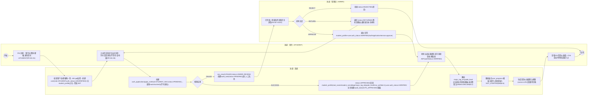

- **工具建议**：Visio（标准 UML 泳道活动图更规范）或 Mermaid（本仓库内直接渲染校验逻辑）；提交报告建议用 Visio 重绘为竖排三泳道的标准活动图样式。
- **对应代码/分析来源**：新生注册对应 `module/user/controller/AuthController.java` 的 `register()`（Service `UserServiceImpl`）；提交在校生认证申请对应 `AuthApplicationServiceImpl.submit()`→`handleStudentSso()`，核验调用 `module/user/service/impl/SsoMockService.java` 的 `verify(studentNo, realName)`（图中"mockSsoVerify"为该方法的业务别称,非字面方法名）；管理员终审对应 `module/admin/service/impl/AuditTaskServiceImpl.java` 的 `decide()`；懒初始化时间线进度对应 `module/timeline/service/impl/UserProgressServiceImpl.java` 内私有方法 `lazyInit()`（由 `getMyTimeline()` 触发）；`major_tag_id` 解析对应 `module/user/service/impl/MajorTagResolver.java` 的 `resolve()`。

---

### 图15 系统流程图（物理处理流程）〔本总纲补足〕

- **图类型**：系统流程图（System Flowchart，物理模型；描述"人工输入→前端→网关→应用服务器处理→数据库/文件介质→显示输出"的介质与处理流转，区别于图3的逻辑业务流程与图12的数据流分解）
- **放报告**：第四章 §3.1（与图3 业务流程图并列：图3 表达逻辑主干，图15 表达物理系统处理与存储介质）
- **要画什么（元素清单）**：
  - 人工操作（梯形符号）：用户手工录入求助单/回答/评价
  - 输入设备（键盘/表单，输入符号）：浏览器表单提交
  - 处理（矩形处理框）：前端 Vue3 SPA 表单校验与 JSON 组装、Nginx 反向代理转发、Spring Boot 应用服务器（`Filter→Controller→Service→Mapper`，业务规则+状态机+事务）、`@Scheduled` 定时任务处理（路由重试/到期扫描/机会归档）
  - 存储介质（磁盘符号）：MySQL `sem` 库（业务数据）、`/data/upload` 本地文件系统（证件/简历/头像）
  - 网络传输（通信箭头）：HTTPS 请求 `/api/*`
  - 显示（显示符号）：SPA 渲染列表/详情/站内通知
- **怎么画（结构描述）**：竖向系统流程图。顶部"人工操作(用户录入)"梯形 → "输入设备(表单提交)" → "前端处理(SPA校验组装)" → "网络传输(HTTPS)" → "Nginx反向代理" → "应用服务器处理(Filter→Controller→Service→Mapper)" 处理框；处理框双向连"MySQL磁盘"与"文件存储介质磁盘"两个存储符号；旁挂"定时任务处理"框（无人工触发，直接读写 MySQL）；应用处理结果经"网络传输"回"显示(SPA渲染)"最终回到用户。正式绘制须用系统流程图专用符号（人工操作梯形/处理矩形/磁盘介质/显示），Mermaid 仅作近似校验。
- **可渲染源码或画法**：

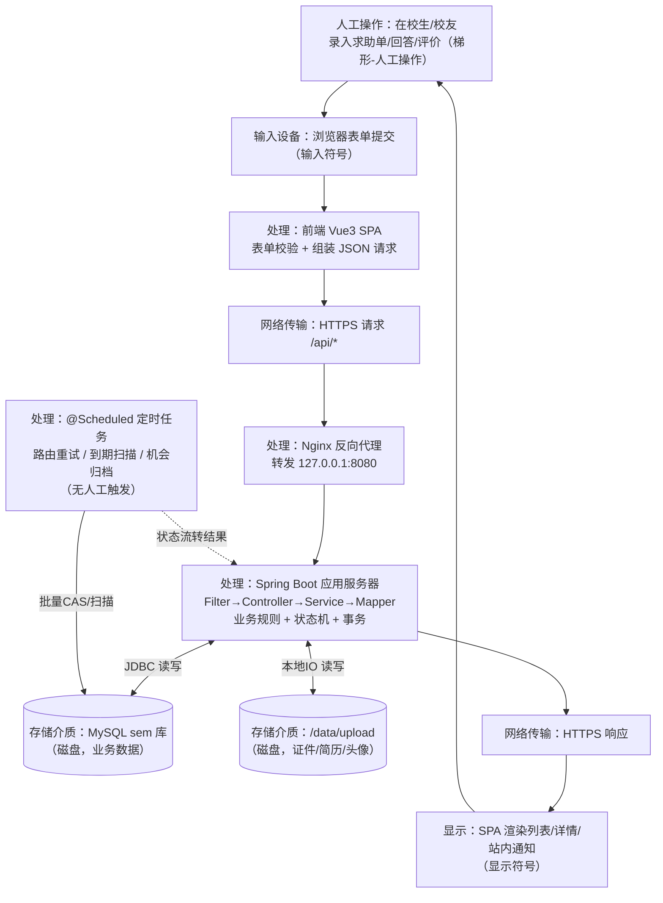

- **工具建议**：Visio "系统流程图"模具（人工操作梯形/处理矩形/磁盘介质/显示符号最规范）或 PowerDesigner；Mermaid 版仅用于校验介质与处理流转是否闭环。
- **对应代码/分析来源**：docs/design/00_总体架构与技术设计.md §2「系统总体架构」（Nginx→Spring Boot→MySQL 三层部署与 Filter→Controller→Service→Mapper 分层描述的原始出处）；backend/src/main/resources/application.yml 第42-43行 `file.upload.dir: ./data/upload`（对应"文件存储介质"符号；grep 全仓库未发现任何 Service/Controller 类实际读写该目录，属预留配置，尚无实现代码）；`@Scheduled` 定时任务实证"定时任务处理"框——`HelpRouteRetryJob.retryRouting()`（module/help，`fixedRate=30*60*1000`，路由重试）、`HelpTicketAutoCloseJob.autoClose()`（module/help，`cron="0 0 2 * * ?"`，超时/宽限期归档）、`OpportunityStatusScheduler.advanceStatus()`（module/opportunity，`fixedRate=600000`，机会状态归档）、`KnowledgeEntryExpiryScheduler.scanExpiredEntries()`（module/knowledge，`cron="0 30 2 * * ?"`，到期扫描）。

---

### 图16 软件体系结构图

- **图类型**：软件结构图（分层体系结构图）
- **放报告**：第五章 §2.3
- **要画什么（元素清单）**：
  - 客户端层：浏览器（Vue 3 SPA，Element Plus + Pinia + Vue Router + Axios）
  - 网关/静态层：Nginx（静态资源托管 + `/api/*` 反向代理）
  - 应用层（Spring Boot 3 / Java 17 单体）四段：`JwtAuthenticationFilter`（JWT 鉴权过滤器）→ `Controller`（REST，参数校验+转发）→ `Service`（业务规则+事务+状态机）→ `Mapper`（MyBatis-Plus，数据存取）
  - 数据层：`MySQL 8`（InnoDB，utf8mb4，`sem` 库）
  - 旁路依赖：本地文件存储 `/data/upload`（由 Service 层直接读写，不经 Mapper）
- **怎么画（结构描述）**：从上到下四层——客户端→Nginx→Spring Boot 应用(内部再分四层)→MySQL；从 Service 层单独引侧向箭头指向"文件存储"；浏览器↔Nginx 标注 HTTPS；Nginx↔Security 标注 `/api/*`；Controller/Service/Mapper 严格单向依赖。
- **可渲染源码或画法**：

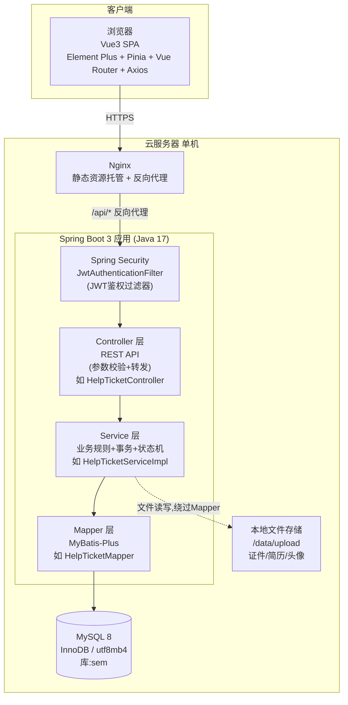

- **工具建议**：Mermaid（可直接渲染）；正式报告排版建议用 Visio/drawio 重绘一版加配色。
- **对应代码/分析来源**：docs/design/00_总体架构与技术设计.md §2「系统总体架构」（同款分层 flowchart 与"Controller 只做参数校验与转发；Service 承载业务规则/事务/所有状态机流转；Mapper 只做数据存取"分层职责原文出处）；backend/src/main/java/com/xju/sem/common/security/{SecurityConfig.java,JwtAuthenticationFilter.java}（JWT鉴权过滤器实体）；backend/src/main/java/com/xju/sem/module/help/{controller/HelpTicketController.java, service/impl/HelpTicketServiceImpl.java, mapper/HelpTicketMapper.java}（图中示例 Controller→Service→Mapper 链的真实类）；backend/src/main/resources/application.yml 第11行 `jdbc:mysql://localhost:3306/sem`（MySQL 8 数据层）。

---

### 图17 软件模块结构图

- **图类型**：软件结构图（HIPO / 模块结构树）
- **放报告**：第五章 §2.4
- **要画什么（元素清单）**：
  - 根节点：SEM 系统
  - 视图层（双圈，横切）：`Dashboard`（`scene=LIFE|STUDY` 切换，仅过滤首页聚合内容）
  - 7 个业务模块包（`com.xju.sem.module.*`），每个内部统一四段(controller/service/mapper/entity)：1 `user`(M1)、2 `profile`(M2)、3 `knowledge`(M3)、4 `help`(M4★灵魂)、5 `opportunity`(M5)、6 `timeline`(M6)、7 `admin`(M7)，各模块代表 Controller 见清单
  - 全局横切模块：`notification`（`NotificationController`）
  - common 地基包：`security`/`result`/`exception`/`config`/`BaseEntity`
- **怎么画（结构描述）**：顶层"双圈视图层"横跨全部业务模块；中层 7 个业务模块并列，module 间虚线箭头按§8依赖(`M1→M2`、`M1→M4`、`M2⇢M4`标签匹配、`M4→M3`采纳生成候选、`M3/M2/M5⇢M6`、`M1→M5`、`M7⇢M3/M1/M5/M6`)；notification 旁侧被各模块虚线"事件通知"指向；最底层 common 地基被全部模块依赖。
- **可渲染源码或画法**：

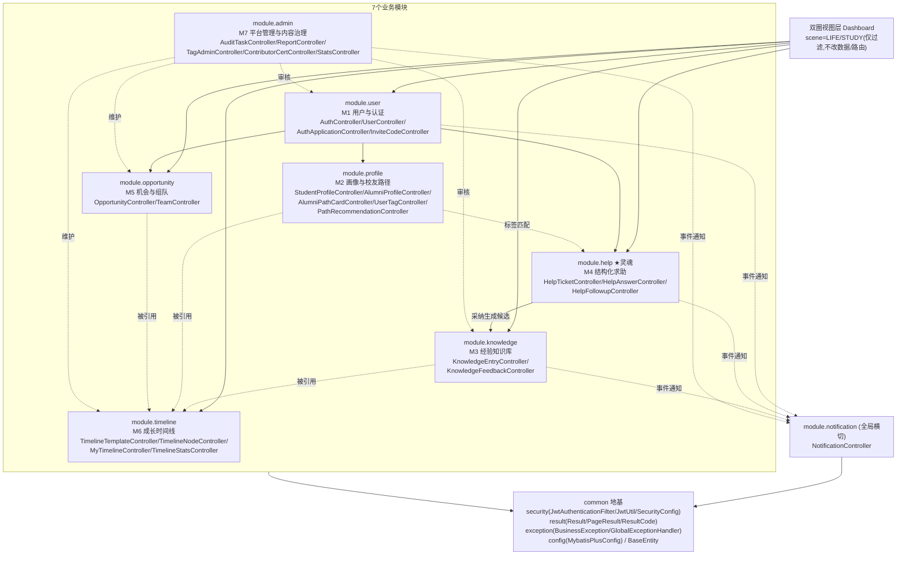

- **工具建议**：Mermaid 渲染；若需 HIPO 层次图纸质感，用 Visio/PowerDesigner 的组织结构图模板重排。
- **对应代码/分析来源**：docs/design/00_总体架构与技术设计.md §8「模块划分与依赖关系」（M1→M2/M1→M4/M2⇢M4/M4→M3/M3⇢M6/M7⇢M3/M7⇢M1 等依赖箭头的原始出处）；`backend/src/main/java/com/xju/sem/module/{user,profile,knowledge,help,opportunity,timeline,admin}/controller/` 下真实 Controller 类核对无误（如 module/user 下 `AuthController.java`/`UserController.java`/`AuthApplicationController.java`/`InviteCodeController.java`；module/admin 下 `AuditTaskController.java`/`ReportController.java`/`TagAdminController.java`/`ContributorCertController.java`/`StatsController.java` 均存在）；`module/notification/controller/NotificationController.java`（全局横切模块）；common 地基包见图22 溯源。

---

### 图18 全局E-R图主干

- **图类型**：E-R 图（全局主干，25 实体核心关系）
- **放报告**：第五章 §5.1
- **要画什么（元素清单）**：25 张核心表：`user`、`student_profile`、`alumni_profile`、`auth_application`、`tag`、`user_tag`、`alumni_path_card`、`path_visibility`、`knowledge_entry`、`knowledge_feedback`、`help_ticket`、`help_answer`、`help_followup`、`help_route`、`opportunity`、`team`、`team_member`、`referral_ticket`、`timeline_template`、`timeline_node`、`timeline_node_ref`、`user_progress`、`audit_task`、`report`、`notification`。
- **怎么画（结构描述）**：以 `user` 为中心辐射：`user 1--0..1 student_profile/alumni_profile`(互斥一对一档案)；`user 1--* auth_application`；`user 1--* user_tag *--1 tag`；`user 1--* alumni_path_card 1--* path_visibility`；`user 1--* knowledge_entry 1--* knowledge_feedback`；`help_ticket 1--* help_answer/help_followup/help_route`、`help_answer 0..1--0..1 knowledge_entry`(采纳生成候选,虚线弱引用)；`user 1--* opportunity 1--* team 1--* team_member`；`timeline_template 1--* timeline_node 1--* timeline_node_ref/user_progress`；`audit_task`/`report` 通过 `(target_type,target_id)` 弱引用多类对象；`user 1--* notification`。
- **可渲染源码或画法**：

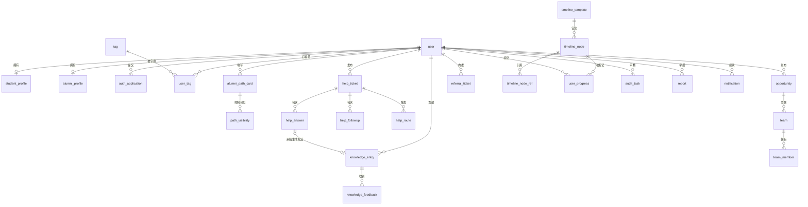

- **工具建议**：Mermaid（主干概览用）；细节字段版建议用 PowerDesigner/drawio 重绘物理 E-R 图（含字段类型），本图仅表达表间关系不列全字段。
- **对应代码/分析来源**：`backend/src/main/resources/schema.sql` 全部 25 张 `CREATE TABLE` 语句（`user`第12行/`student_profile`第28行/`alumni_profile`第52行/`auth_application`第74行/`tag`第112行/`user_tag`第126行/`notification`第137行/`alumni_path_card`第155行/`path_visibility`第190行/`knowledge_entry`第200行/`knowledge_feedback`第223行/`help_ticket`第238行/`help_answer`第256行/`help_followup`第272行/`help_route`第283行/`opportunity`第296行/`team`第314行/`team_member`第332行/`referral_ticket`第346行/`timeline_template`第363行/`timeline_node`第377行/`timeline_node_ref`第394行/`user_progress`第404行/`audit_task`第415行/`report`第434行，与图中25表清单逐一核对一致）；docs/design/00_总体架构与技术设计.md §3「全局数据模型」同款 erDiagram 与 25 表清单原始出处。

---

### 图19 E-R分图-用户域

- **图类型**：E-R 图（分图，含关键属性）
- **放报告**：第五章 §5.2（用户域）
- **要画什么（元素清单）**：`user`、`student_profile`、`alumni_profile`、`auth_application`、`tag`、`user_tag` 六张表，属性取自 `schema.sql`（`user`:role/auth_status/status/可见性；`student_profile`:student_no/major_tag_id/grade_level/gpa；`alumni_profile`:grad_year/degree_type/贡献计数；`auth_application`:verify_method/双担保/status 七态；`tag`:tag_type 六类；`user_tag`:tag_source）。
- **怎么画（结构描述）**：`user` 居中；`user 1--0..1 student_profile/alumni_profile`(互斥)；`user 1--0..* auth_application`(`guarantor1_id`/`guarantor2_id` 另两条弱引用指回 user,标"担保人")；`student_profile.major_tag_id/target_industry_tag_id`、`alumni_profile.major_tag_id` 指向 `tag`；`user`、`tag` 经 `user_tag` 多对多。
- **可渲染源码或画法**：

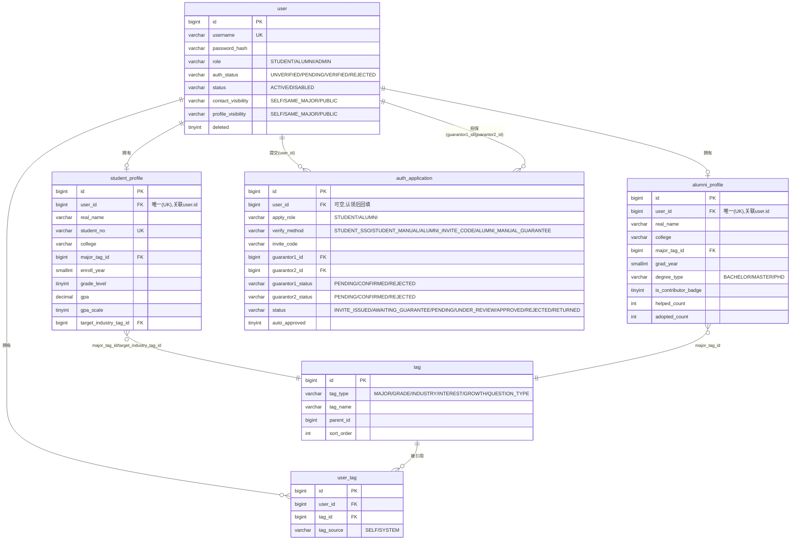

- **工具建议**：Mermaid（属性版 erDiagram 可直接渲染）；正式提交建议用 PowerDesigner 生成物理模型图并导出。
- **对应代码/分析来源**：`backend/src/main/resources/schema.sql` 的 `user`(第12行)/`student_profile`(第28行)/`alumni_profile`(第52行)/`auth_application`(第74行)/`tag`(第112行)/`user_tag`(第126行) 六张建表语句（字段与图中一致）；对应实体类 `module/user/entity/{User,StudentProfile,AlumniProfile,AuthApplication}.java` 与 `module/profile/entity/{Tag,UserTag}.java`；`docs/design/00_总体架构与技术设计.md` §3「全局数据模型」为同款用户域实体关系原始出处。

---

### 图20 E-R分图-内容域

- **图类型**：E-R 图（分图，含关键属性）
- **放报告**：第五章 §5.3（内容域：知识库 + 结构化求助 + 治理）
- **要画什么（元素清单）**：`knowledge_entry`、`help_ticket`、`help_answer`、`help_route`、`audit_task`（+`help_followup`）六张表，属性取自 `schema.sql`（`knowledge_entry`:category五类/status五态/source_type/source_help_id/version乐观锁/FULLTEXT；`help_ticket`:status五态/followup_count；`help_answer`:三段式/is_adopted/knowledge_entry_id回写；`help_route`:match_score/status四态/uk_ticket_user；`audit_task`:target_type四类多态/review_kind四类/status五态）。
- **怎么画（结构描述）**：`help_ticket` 居中；向下三条实线 1--*：→`help_answer`/`help_followup`/`help_route`；`help_route.matched_user_id→user` 虚线跨域；`help_answer→knowledge_entry` 0..1--0..1 虚线标"采纳后回写 knowledge_entry_id"；`knowledge_entry.source_help_id` 反向指回 `help_ticket`；`audit_task` 右侧,通过 `(target_type,target_id)` 虚线指向 `knowledge_entry`,箭头标"多态引用,仅存ID不建物理FK"。
- **可渲染源码或画法**：

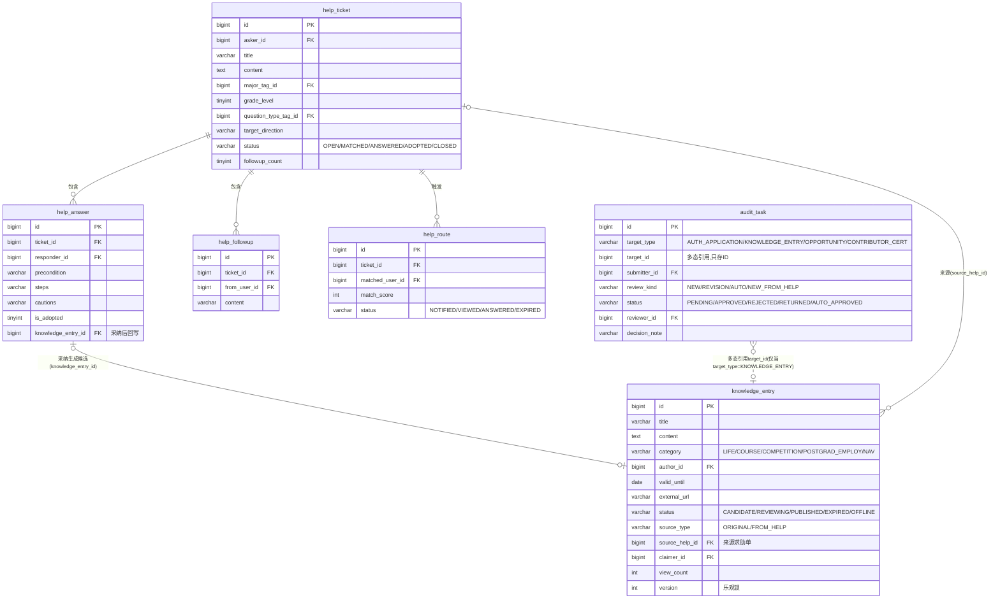

- **工具建议**：Mermaid（属性版 erDiagram）；`audit_task` 的多态弱引用不建议用物理 FK 表达，报告文字需配一句"target_type+target_id 组合引用，不建外键约束，体现低耦合"。
- **对应代码/分析来源**：`backend/src/main/resources/schema.sql` 的 `knowledge_entry`(第200行)/`knowledge_feedback`(第223行)/`help_ticket`(第238行)/`help_answer`(第256行)/`help_followup`(第272行)/`help_route`(第283行)/`audit_task`(第415行) 建表语句；对应实体类 `module/knowledge/entity/{KnowledgeEntry,KnowledgeFeedback}.java`、`module/help/entity/{HelpTicket,HelpAnswer,HelpFollowup,HelpRoute}.java`、`module/admin/entity/AuditTask.java`（`targetType`/`targetId` 多态字段，仅存ID不建FK）；`docs/design/00_总体架构与技术设计.md` §3「全局数据模型」。

---

### 图21 部署图

- **图类型**：部署图（UML Deployment Diagram，Mermaid 用 flowchart 近似表达节点+构件+通信路径）
- **放报告**：第五章 §2.2
- **要画什么（元素清单）**：单机部署（一台 2 核 4G 云服务器）：
  - 节点：`云服务器`(2核4G)；内构件：`Nginx`(托管前端 build + 反代 `/api`→`127.0.0.1:8080`)、`Spring Boot 应用 Jar`(`sem.jar`,监听8080,单体含 Security/Controller/Service/Mapper)、`MySQL 8`(`sem` 库,InnoDB,utf8mb4)、`/data/upload` 本地文件系统
  - 外部节点：`用户浏览器`(PC优先/移动自适应,公网 HTTPS)
  - 通信路径：浏览器⇄Nginx(HTTPS,443)；Nginx⇄SpringBoot(HTTP,反代8080,`/api/*`)；SpringBoot⇄MySQL(JDBC,3306)；SpringBoot⇄本地文件系统(本地IO)
- **怎么画（结构描述）**：最外层"云服务器"大节点框(`<<device>>`)内并列三构件 Nginx/SpringBoot Jar/MySQL；"本地文件系统"存储图标画在 Jar 旁标"本地IO"；框外"用户浏览器"节点用 HTTPS 线连 Nginx；各构件间标端口/协议。
- **可渲染源码或画法**：

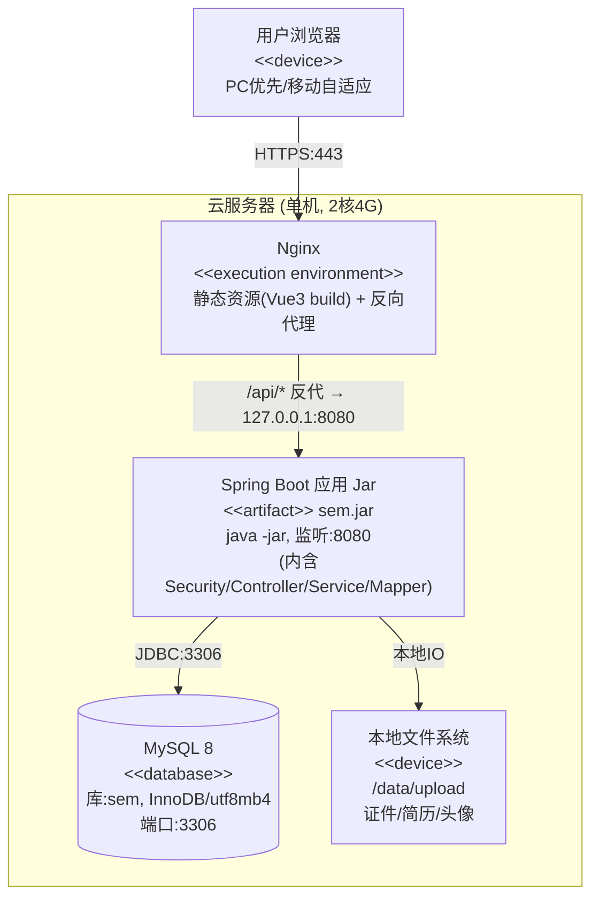

- **工具建议**：正式部署图建议用 Visio/drawio 的 UML Deployment 模板（带 `<<device>>`/`<<artifact>>` 构造型图标）重绘；Mermaid 版本用于快速预览与文档内嵌。
- **对应代码/分析来源**：`docs/design/00_总体架构与技术设计.md` §2「系统总体架构」的"部署视图"原文（一台2核4G云服务器/Nginx反代`/api`到8080/MySQL同机/上传文件存本地）；`backend/src/main/resources/application.yml` 第2行 `server.port: 8080`、第11行 `url: jdbc:mysql://localhost:3306/sem`、第42-43行 `sem.upload.dir: ./data/upload`（对应图中"本地文件系统"构件）。

---

### 图22 common 包结构类图〔本总纲补足〕

- **图类型**：类图（`com.xju.sem.common` 地基包内部结构，横切全部 7 个业务模块，是图23 全局分层类图的"公共层放大版"）
- **放报告**：第六章 §2.1（程序系统的结构 · 公共基础设施层）
- **要画什么（元素清单）**（均取自 `com.xju.sem.common.**` 真实源码，与图17/图23 一致）：
  - `config` 子包：`BaseEntity`（抽象基类：`id`/`deleted`/`createdAt`/`updatedAt`）、`MyMetaObjectHandler`（MyBatis-Plus 自动填充审计字段）、`MybatisPlusConfig`（分页插件装配）
  - `result` 子包：`Result<T>`（`code`/`message`/`data`；`ok`/`fail`）、`PageResult<T>`（`records`/`total`/`page`/`size`；`of`）、`ResultCode`（枚举：`SUCCESS`/`UNAUTHORIZED`/`FORBIDDEN`/`STATE_CONFLICT`/`OPTIMISTIC_LOCK`/`SERVER_ERROR`）
  - `exception` 子包：`BusinessException`（继承 `RuntimeException`，携带 `code`）、`GlobalExceptionHandler`（`@RestControllerAdvice`，统一转 `Result`）
  - `security` 子包：`JwtUtil`（`generate`/`parse`）、`JwtAuthenticationFilter`（`doFilterInternal`）、`SecurityConfig`（`filterChain`/`passwordEncoder`）、`LoginUser`（`isVerified`/`isAdmin`）、`SecurityUtil`（`currentUserId`/`currentLoginUser`）、`AuthGuard`（`requireVerified`/`requireAdmin`）
- **怎么画（结构描述）**：按 4 个子包（config/result/exception/security）分 4 个包框。`MyMetaObjectHandler` 依赖虚线指向 `BaseEntity`（自动填充审计字段）；`BusinessException` 继承实箭头指向 JDK `RuntimeException`、依赖 `ResultCode`（携带错误码）；`GlobalExceptionHandler` 依赖虚线指向 `BusinessException`（捕获）/`Result`（统一包装）/`ResultCode`（映射 HTTP 语义）；`PageResult` 常作 `Result.data` 载荷；安全链：`SecurityConfig →装配 JwtAuthenticationFilter →解析 JwtUtil`，`JwtAuthenticationFilter →构造 LoginUser`，`SecurityUtil`/`AuthGuard` 依赖 `LoginUser`。所有业务模块（图17 的 M1–M7 + notification）以"依赖 common"一条汇总箭头指向本包（本图内用一句 note 说明，不逐一连线）。
- **可渲染源码或画法**：

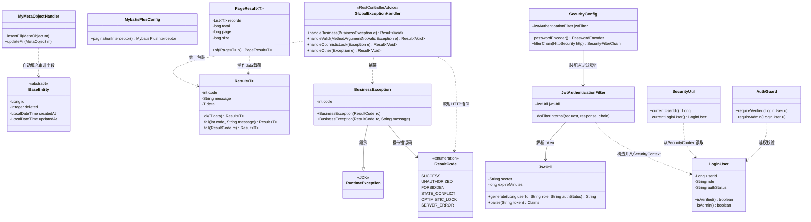

- **工具建议**：Mermaid（可直接渲染）；正式报告排版建议用 Visio/drawio 重绘并把整个 common 包加一个"横切关注点(Cross-cutting)"外框标注，与 M1–M7 业务层视觉区分。
- **对应代码/分析来源**：`backend/src/main/java/com/xju/sem/common/{BaseEntity.java,config/MyMetaObjectHandler.java,config/MybatisPlusConfig.java,result/Result.java,result/PageResult.java,result/ResultCode.java,exception/BusinessException.java,exception/GlobalExceptionHandler.java,security/JwtUtil.java,security/JwtAuthenticationFilter.java,security/SecurityConfig.java,security/LoginUser.java,security/SecurityUtil.java,security/AuthGuard.java}` 均为 common 地基包真实源码，类名/子包划分与图中一致。

---

### 图23 全局分层类图

- **图类型**：类图
- **放报告**：第六章 §2.1（程序系统的结构）
- **要画什么（元素清单）**：
  - **common 基础设施类**：`BaseEntity`、`Result<T>`、`PageResult<T>`、`ResultCode`、`BusinessException`、`GlobalExceptionHandler`、`JwtUtil`、`BaseMapper<T>`(MyBatis-Plus 框架接口)
  - **M4 求助域典型一条 "Controller→Service→ServiceImpl→Entity→Mapper" 链**（`module/help`）：`HelpTicketController`、`HelpTicketService`(接口)、`HelpTicketServiceImpl`、`HelpTicket`(继承 `BaseEntity`)、`HelpTicketMapper`(继承 `BaseMapper<HelpTicket>`)
- **怎么画（结构描述）**：左列 common 基础设施类(`JwtUtil` 置底,本图不与右侧链条连线,其调用方见图24)；右列从上到下典型链 `HelpTicketController → HelpTicketService`(实现虚箭头由 Impl 指向接口)`→ HelpTicketServiceImpl → HelpTicketMapper`(继承 `BaseMapper<HelpTicket>`)；`HelpTicket` 继承 `BaseEntity`；`BusinessException` 继承 `RuntimeException`,被 Impl"抛出"、被 `GlobalExceptionHandler`"捕获";`GlobalExceptionHandler`/`Controller` 依赖 `Result`。
- **可渲染源码或画法**：

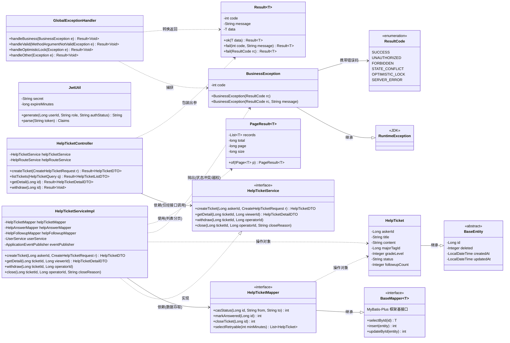

- **工具建议**：Mermaid（可直接渲染）；正式报告排版建议用 Visio/drawio 重绘一版加配色区分 common 层与业务层。
- **对应代码/分析来源**：common 基础设施类源码同图22；求助域示例链取自 `backend/src/main/java/com/xju/sem/module/help/{controller/HelpTicketController.java,service/HelpTicketService.java,service/impl/HelpTicketServiceImpl.java,entity/HelpTicket.java,mapper/HelpTicketMapper.java}`（`HelpTicket` 继承 `common.BaseEntity`，`HelpTicketMapper` 继承 MyBatis-Plus `BaseMapper<HelpTicket>`）；`docs/design/00_总体架构与技术设计.md` §2「系统总体架构」"分层职责"段（Controller/Service/Mapper 职责划分原文出处）。

---

### 图24 类图-认证域

- **图类型**：类图
- **放报告**：第六章 §2.2（程序系统的结构 · M1 用户与认证）
- **要画什么（元素清单）**（均取自 `module/user`）：
  - 实体：`User`（继承 `BaseEntity`）；`AuthApplication`（继承 `BaseEntity`）
  - 枚举：`Role`（`STUDENT`/`ALUMNI`/`ADMIN`）
  - Mapper：`UserMapper`、`AuthApplicationMapper`（继承 `BaseMapper<T>`）
  - 服务：`UserService`/`UserServiceImpl`；`AuthApplicationService`/`AuthApplicationServiceImpl`（依赖 `SsoMockService`/`InviteCodeAllocator`/`ApplicationEventPublisher`/`ObjectProvider<NotificationService>`）；`AuthTokenService`/`AuthTokenServiceImpl`（依赖 `JwtUtil`/`RefreshTokenProvider`/`UserService`）
  - 事件：`AuthApplicationSubmittedEvent`
  - 安全基础设施：`JwtUtil`/`JwtAuthenticationFilter`/`LoginUser`/`SecurityConfig`
  - Controller：`AuthController`/`AuthApplicationController`/`UserController`
  - 跨模块契约：`NotificationService`
- **怎么画（结构描述）**：顶部 `User`/`AuthApplication` 继承 `BaseEntity`；两 Mapper 继承 `BaseMapper<T>` 被对应 Impl 依赖。中层左列认证账号链：`AuthController → AuthTokenService/UserService`；`AuthTokenServiceImpl` 依赖 `JwtUtil`(签发)与 `UserService`(聚合档案)，`UserServiceImpl` 依赖 `UserMapper` 并指向 `Role`。中层右列认证申请链：`AuthApplicationController → AuthApplicationService`(实现虚线)，Impl 发布 `AuthApplicationSubmittedEvent`,跨模块依赖 `NotificationService`。底部安全过滤链：`SecurityConfig →装配 JwtAuthenticationFilter →解析 JwtUtil →构造 LoginUser`。
- **可渲染源码或画法**：

```mermaid
classDiagram
  direction TB

  class BaseEntity {
    <<abstract>>
    -Long id
    -Integer deleted
    -LocalDateTime createdAt
    -LocalDateTime updatedAt
  }
  class BaseMapper~T~ {
    <<interface>>
  }
  class Role {
    <<enumeration>>
    STUDENT
    ALUMNI
    ADMIN
  }

  class User {
    -String username
    -String passwordHash
    -String role
    -String authStatus
    -String status
    -String contactVisibility
    -String profileVisibility
  }
  class AuthApplication {
    -Long userId
    -String applyRole
    -String verifyMethod
    -String realName
    -String studentNo
    -String majorText
    -String inviteCode
    -Long guarantor1Id
    -Long guarantor2Id
    -String guarantor1Status
    -String guarantor2Status
    -String status
    -Integer autoApproved
    -String rejectReason
  }

  class UserMapper {
    <<interface>>
  }
  class AuthApplicationMapper {
    <<interface>>
  }

  class UserService {
    <<interface>>
    +register(RegisterRequest r) UserDTO
    +getBrief(Long userId) UserBriefDTO
    +isVerified(Long userId) boolean
    +getRole(Long userId) Role
    +searchGuarantorCandidates(String major, String keyword) List~UserBriefDTO~
    +disableUser(Long userId, String reason)
  }
  class UserServiceImpl {
    -UserMapper userMapper
    -StudentProfileMapper studentProfileMapper
    -AlumniProfileMapper alumniProfileMapper
    -PasswordEncoder passwordEncoder
    -MajorTagResolver majorTagResolver
    +register(RegisterRequest r) UserDTO
    +getRole(Long userId) Role
    +searchGuarantorCandidates(String major, String keyword) List~UserBriefDTO~
  }

  class AuthApplicationService {
    <<interface>>
    +submit(Long userId, SubmitAuthApplicationRequest r) AuthApplicationDTO
    +withdraw(Long id, Long userId) AuthApplicationDTO
    +confirmGuarantee(Long id, Long guarantorUserId, boolean approve) AuthApplicationDTO
    +approve(Long appId, Long reviewerId)
    +reject(Long appId, Long reviewerId, String reason)
    +returnForSupplement(Long appId, Long reviewerId, String reason)
    +batchCreateInviteCodes(BatchInviteCodeRequest r) List~String~
  }
  class AuthApplicationServiceImpl {
    -AuthApplicationMapper authApplicationMapper
    -UserMapper userMapper
    -SsoMockService ssoMockService
    -MajorTagResolver majorTagResolver
    -InviteCodeAllocator inviteCodeAllocator
    -ApplicationEventPublisher eventPublisher
    -ObjectProvider~NotificationService~ notificationServiceProvider
    +submit(Long userId, SubmitAuthApplicationRequest r) AuthApplicationDTO
    +approve(Long appId, Long reviewerId)
    +reject(Long appId, Long reviewerId, String reason)
    +confirmGuarantee(Long id, Long guarantorUserId, boolean approve) AuthApplicationDTO
  }
  class AuthApplicationSubmittedEvent {
    -Long appId
    -boolean autoApproved
  }
  class NotificationService {
    <<interface>>
    module.notification 跨模块契约
  }

  class AuthTokenService {
    <<interface>>
    +login(String username, String password) LoginResponse
    +issueFor(Long userId, String role, String authStatus) TokenPair
    +refresh(String refreshToken) TokenPair
  }
  class AuthTokenServiceImpl {
    -UserMapper userMapper
    -PasswordEncoder passwordEncoder
    -JwtUtil jwtUtil
    -RefreshTokenProvider refreshTokenProvider
    -UserService userService
    +login(String username, String password) LoginResponse
    +refresh(String refreshToken) TokenPair
  }

  class JwtUtil {
    -String secret
    -long expireMinutes
    +generate(Long userId, String role, String authStatus) String
    +parse(String token) Claims
  }
  class JwtAuthenticationFilter {
    -JwtUtil jwtUtil
    +doFilterInternal(request, response, chain)
  }
  class LoginUser {
    -Long userId
    -String role
    -String authStatus
    +isVerified() boolean
    +isAdmin() boolean
  }
  class SecurityConfig {
    -JwtAuthenticationFilter jwtFilter
    +passwordEncoder() PasswordEncoder
    +filterChain(HttpSecurity http) SecurityFilterChain
  }

  class AuthController {
    -UserService userService
    -AuthTokenService authTokenService
    +register(RegisterRequest r) Result~RegisterResponse~
    +login(LoginRequest r) Result~LoginResponse~
    +refresh(RefreshRequest r) Result~TokenPair~
  }
  class AuthApplicationController {
    -AuthApplicationService authApplicationService
    +submit(SubmitAuthApplicationRequest r) Result~AuthApplicationDTO~
    +getById(Long id) Result~AuthApplicationDTO~
  }
  class UserController {
    -UserService userService
    +me() Result~UserDTO~
    +updateProfile(UpdateProfileRequest r) Result~Void~
  }

  User --|> BaseEntity : 继承
  AuthApplication --|> BaseEntity : 继承
  UserMapper --|> BaseMapper~User~ : 继承
  AuthApplicationMapper --|> BaseMapper~AuthApplication~ : 继承
  UserServiceImpl ..|> UserService : 实现
  AuthApplicationServiceImpl ..|> AuthApplicationService : 实现
  AuthTokenServiceImpl ..|> AuthTokenService : 实现
  UserServiceImpl --> UserMapper : 依赖
  UserServiceImpl ..> Role : 返回类型
  AuthApplicationServiceImpl --> AuthApplicationMapper : 依赖
  AuthApplicationServiceImpl --> UserMapper : 只读依赖(回写authStatus)
  AuthApplicationServiceImpl ..> AuthApplicationSubmittedEvent : 提交后发布
  AuthApplicationServiceImpl --> NotificationService : 跨模块依赖(通知)
  AuthTokenServiceImpl --> UserMapper : 依赖
  AuthTokenServiceImpl --> JwtUtil : 依赖(签发access token)
  AuthTokenServiceImpl --> UserService : 依赖(登录后聚合User+Profile)
  JwtAuthenticationFilter --> JwtUtil : 依赖(解析token)
  JwtAuthenticationFilter ..> LoginUser : 构造并放入SecurityContext
  SecurityConfig --> JwtAuthenticationFilter : 装配进过滤器链
  AuthController --> UserService : 依赖
  AuthController --> AuthTokenService : 依赖
  AuthApplicationController --> AuthApplicationService : 依赖
  UserController --> UserService : 依赖
```

- **工具建议**：Mermaid（可直接渲染）；正式报告排版建议用 Visio/PowerDesigner 重绘，安全基础设施部分可单独加框标注"横切关注点"。
- **对应代码/分析来源**：`backend/src/main/java/com/xju/sem/module/user/{entity/User.java,entity/AuthApplication.java,constant/Role.java,mapper/UserMapper.java,mapper/AuthApplicationMapper.java,service/UserService.java,service/impl/UserServiceImpl.java,service/AuthApplicationService.java,service/impl/AuthApplicationServiceImpl.java,service/AuthTokenService.java,service/impl/AuthTokenServiceImpl.java,event/AuthApplicationSubmittedEvent.java,controller/AuthController.java,controller/AuthApplicationController.java,controller/UserController.java}`；安全链 `common/security/{JwtUtil.java,JwtAuthenticationFilter.java,LoginUser.java,SecurityConfig.java}`；FR-M1-01~17 见 `docs/design/08_集成与一致性报告.md` §四 FR 索引总表（同图5引用口径）。

---

### 图25 类图-求助域

- **图类型**：类图
- **放报告**：第六章 §2.3（程序系统的结构 · M4 结构化求助 ★系统灵魂）
- **要画什么（元素清单）**（均取自 `module/help`）：
  - 实体：`HelpTicket`（继承 `BaseEntity`）；`HelpAnswer`（继承 `BaseEntity`，`steps: List<String>`）；`HelpRoute`（**只实现 `Serializable`，不继承 `BaseEntity`**——表结构无 deleted/审计列）
  - 枚举：`HelpTicketStatus`、`HelpRouteStatus`
  - Mapper：`HelpTicketMapper`/`HelpAnswerMapper`/`HelpRouteMapper`（继承 `BaseMapper<T>`）
  - 服务：`HelpTicketService/Impl`；`HelpAnswerService/Impl`；`HelpRouteService/Impl`（★核心打分算法 §6.2 载体）
  - 事件与监听器：`HelpTicketCreatedEvent`/`HelpAnswerAdoptedEvent`；`HelpTicketCreatedListener`/`HelpAnswerAdoptedListener`
  - Controller：`HelpTicketController`/`HelpAnswerController`
  - 跨模块契约：`UserService`(M1)、`NotificationService`、`KnowledgeEntryService`(M3,采纳后生成候选)
- **怎么画（结构描述）**：顶部三实体：`HelpTicket`/`HelpAnswer` 继承 `BaseEntity`；`HelpRoute` 实现 `Serializable`(备注"表结构精简,无审计列")。三 Mapper 继承 `BaseMapper<T>`。中层三条 Service 链实现回接口并依赖 Mapper；跨模块依赖 `UserService`/`NotificationService`。底部事件闭环：`HelpTicketServiceImpl` 发布 `HelpTicketCreatedEvent`→`HelpTicketCreatedListener`→触发 `HelpRouteService.routeHelpTicket`；`HelpAnswerServiceImpl.adopt` 发布 `HelpAnswerAdoptedEvent`→`HelpAnswerAdoptedListener`→跨模块调 `KnowledgeEntryService`(闭环到 M3)。
- **可渲染源码或画法**：

```mermaid
classDiagram
  direction TB

  class BaseEntity {
    <<abstract>>
    -Long id
    -Integer deleted
    -LocalDateTime createdAt
    -LocalDateTime updatedAt
  }
  class Serializable {
    <<interface>>
    JDK 标记接口
  }
  class BaseMapper~T~ {
    <<interface>>
  }
  class HelpTicketStatus {
    <<enumeration>>
    OPEN
    MATCHED
    ANSWERED
    ADOPTED
    CLOSED
  }
  class HelpRouteStatus {
    <<enumeration>>
    NOTIFIED
    VIEWED
    ANSWERED
    EXPIRED
  }

  class HelpTicket {
    -Long askerId
    -String title
    -String content
    -Long majorTagId
    -Integer gradeLevel
    -Long questionTypeTagId
    -String targetDirection
    -String status
    -Integer followupCount
  }
  class HelpAnswer {
    -Long ticketId
    -Long responderId
    -String precondition
    -List~String~ steps
    -String cautions
    -Integer isAdopted
    -Long knowledgeEntryId
  }
  class HelpRoute {
    -Long id
    -Long ticketId
    -Long matchedUserId
    -Integer matchScore
    -String status
    -LocalDateTime notifiedAt
  }

  class HelpTicketMapper {
    <<interface>>
    +casStatus(Long id, String from, String to) int
    +markAnswered(Long id) int
    +closeTicket(Long id) int
    +selectRetryable(int minMinutes) List~HelpTicket~
  }
  class HelpAnswerMapper {
    <<interface>>
    +countAdopted(Long responderId, Long questionTypeTagId) int
    +countByTicket(Long ticketId) int
  }
  class HelpRouteMapper {
    <<interface>>
    +selectVerifiedAlumniByMajor(Long majorTagId) List~CandidateRow~
    +selectVerifiedSeniorStudentsByMajor(Long majorTagId, Integer minGradeLevel) List~CandidateRow~
    +listMatchedUserIds(Long ticketId) List~Long~
    +markResponded(Long ticketId, Long userId) int
  }

  class HelpTicketService {
    <<interface>>
    +createTicket(Long askerId, CreateHelpTicketRequest r) HelpTicketDTO
    +getDetail(Long ticketId, Long viewerId) HelpTicketDetailDTO
    +withdraw(Long ticketId, Long operatorId)
    +close(Long ticketId, Long operatorId, String closeReason)
    +hideTicket(Long ticketId, Long adminOperatorId, String reason)
  }
  class HelpTicketServiceImpl {
    -HelpTicketMapper helpTicketMapper
    -HelpAnswerMapper helpAnswerMapper
    -HelpFollowupMapper helpFollowupMapper
    -UserService userService
    -ApplicationEventPublisher eventPublisher
    +createTicket(Long askerId, CreateHelpTicketRequest r) HelpTicketDTO
    +withdraw(Long ticketId, Long operatorId)
    +close(Long ticketId, Long operatorId, String closeReason)
  }

  class HelpAnswerService {
    <<interface>>
    +submitAnswer(Long ticketId, Long responderId, SubmitAnswerRequest r) HelpAnswerDTO
    +editAnswer(Long answerId, Long operatorId, SubmitAnswerRequest r) HelpAnswerDTO
    +adopt(Long ticketId, Long answerId, Long operatorId)
    +getForCandidate(Long answerId) AnswerContentDTO
    +countAdopted(Long responderId, Long questionTypeTagId) int
  }
  class HelpAnswerServiceImpl {
    -HelpAnswerMapper helpAnswerMapper
    -HelpTicketMapper helpTicketMapper
    -HelpRouteMapper helpRouteMapper
    -NotificationService notificationService
    -UserService userService
    -ApplicationEventPublisher eventPublisher
    +submitAnswer(Long ticketId, Long responderId, SubmitAnswerRequest r) HelpAnswerDTO
    +adopt(Long ticketId, Long answerId, Long operatorId)
  }

  class HelpRouteService {
    <<interface>>
    +routeHelpTicket(Long ticketId, List~Long~ excludeUserIds)
    +listRoutes(Long ticketId, Long viewerId) List~HelpRouteDTO~
  }
  class HelpRouteServiceImpl {
    -HelpRouteMapper helpRouteMapper
    -HelpTicketMapper helpTicketMapper
    -HelpAnswerMapper helpAnswerMapper
    -NotificationService notificationService
    -UserService userService
    +routeHelpTicket(Long ticketId, List~Long~ excludeUserIds)
    +listRoutes(Long ticketId, Long viewerId) List~HelpRouteDTO~
  }

  class HelpTicketCreatedEvent {
    -Long ticketId
  }
  class HelpAnswerAdoptedEvent {
    -Long helpTicketId
    -Long helpAnswerId
    -Long authorId
  }
  class HelpTicketCreatedListener {
    -HelpRouteService helpRouteService
    +onTicketCreated(HelpTicketCreatedEvent e)
  }
  class HelpAnswerAdoptedListener {
    -KnowledgeEntryService knowledgeEntryService
    -HelpAnswerMapper helpAnswerMapper
    -HelpTicketMapper helpTicketMapper
    -NotificationService notificationService
    +onAnswerAdopted(HelpAnswerAdoptedEvent e)
  }

  class HelpTicketController {
    -HelpTicketService helpTicketService
    -HelpRouteService helpRouteService
    +createTicket(CreateHelpTicketRequest r) Result~HelpTicketDTO~
    +getDetail(Long id) Result~HelpTicketDetailDTO~
    +withdraw(Long id) Result~Void~
  }
  class HelpAnswerController {
    -HelpAnswerService helpAnswerService
    +submitAnswer(Long ticketId, SubmitAnswerRequest r) Result~HelpAnswerDTO~
    +editAnswer(Long id, SubmitAnswerRequest r) Result~HelpAnswerDTO~
  }

  class UserService {
    <<interface>>
    module.user 跨模块契约
  }
  class NotificationService {
    <<interface>>
    module.notification 跨模块契约
  }
  class KnowledgeEntryService {
    <<interface>>
    module.knowledge 跨模块契约
    +createFromHelpAdoption(Long helpTicketId, Long helpAnswerId, Long authorId) Long
  }

  HelpTicket --|> BaseEntity : 继承
  HelpAnswer --|> BaseEntity : 继承
  HelpRoute ..|> Serializable : 实现(不继承BaseEntity,无deleted/审计列)
  HelpTicketMapper --|> BaseMapper~HelpTicket~ : 继承
  HelpAnswerMapper --|> BaseMapper~HelpAnswer~ : 继承
  HelpRouteMapper --|> BaseMapper~HelpRoute~ : 继承
  HelpTicketServiceImpl ..|> HelpTicketService : 实现
  HelpAnswerServiceImpl ..|> HelpAnswerService : 实现
  HelpRouteServiceImpl ..|> HelpRouteService : 实现
  HelpTicketServiceImpl --> HelpTicketMapper : 依赖
  HelpTicketServiceImpl --> UserService : 跨模块依赖(档案快照)
  HelpTicketServiceImpl ..> HelpTicketCreatedEvent : 创建后发布
  HelpAnswerServiceImpl --> HelpAnswerMapper : 依赖
  HelpAnswerServiceImpl --> HelpTicketMapper : 依赖(markAnswered/casStatus)
  HelpAnswerServiceImpl --> NotificationService : 跨模块依赖(通知求助人)
  HelpAnswerServiceImpl ..> HelpAnswerAdoptedEvent : 采纳后发布
  HelpRouteServiceImpl --> HelpRouteMapper : 依赖
  HelpRouteServiceImpl --> HelpAnswerMapper : 依赖(countAdopted打分)
  HelpRouteServiceImpl --> NotificationService : 跨模块依赖(HELP_MATCH通知)
  HelpTicketCreatedListener ..> HelpTicketCreatedEvent : 监听
  HelpTicketCreatedListener --> HelpRouteService : 触发路由匹配
  HelpAnswerAdoptedListener ..> HelpAnswerAdoptedEvent : 监听(AFTER_COMMIT)
  HelpAnswerAdoptedListener --> KnowledgeEntryService : 跨模块依赖(生成知识候选)
  HelpTicketController --> HelpTicketService : 依赖
  HelpTicketController --> HelpRouteService : 依赖
  HelpAnswerController --> HelpAnswerService : 依赖
```

- **工具建议**：Mermaid（可直接渲染）；正式报告排版建议用 Visio/drawio 重绘，事件闭环部分（`HelpTicketCreatedEvent`/`HelpAnswerAdoptedEvent` 及监听器）可加高亮色框强调"系统灵魂"闭环枢纽。
- **对应代码/分析来源**：`backend/src/main/java/com/xju/sem/module/help/{entity/HelpTicket.java,entity/HelpAnswer.java,entity/HelpRoute.java,enums/HelpTicketStatus.java,enums/HelpRouteStatus.java,mapper/HelpTicketMapper.java,mapper/HelpAnswerMapper.java,mapper/HelpRouteMapper.java,service/impl/HelpTicketServiceImpl.java,service/impl/HelpAnswerServiceImpl.java,service/impl/HelpRouteServiceImpl.java,event/HelpTicketCreatedEvent.java,event/HelpAnswerAdoptedEvent.java,service/impl/HelpTicketCreatedListener.java,service/impl/HelpAnswerAdoptedListener.java,controller/HelpTicketController.java,controller/HelpAnswerController.java}`（`HelpRoute` 仅实现 `Serializable`，未继承 `BaseEntity`，与 `schema.sql` `help_route`(第283行) 无 deleted/审计列一致）；跨模块契约 `UserService`(M1)/`NotificationService`/`KnowledgeEntryService.createFromHelpAdoption()`(M3)。

---

### 图26 类图-知识库域

- **图类型**：类图
- **放报告**：第六章 §2.4（程序系统的结构 · M3 经验知识库）
- **要画什么（元素清单）**（均取自 `module/knowledge`）：
  - 实体：`KnowledgeEntry`（继承 `BaseEntity`，`@Version version` 乐观锁）；`KnowledgeFeedback`（继承 `BaseEntity`）
  - 枚举：`KnowledgeEntryStatus`、`SourceType`、`KnowledgeCategory`、`FeedbackType`
  - Mapper：`KnowledgeEntryMapper`/`KnowledgeFeedbackMapper`
  - **`KnowledgeEntryService` 状态机方法**：`create`/`createFromHelpAdoption`/`update`/`submitForReview`/`approve`/`returnToCandidate`/`claim`/`offline`/`delete`；`KnowledgeEntryServiceImpl`（依赖 `ExternalLinkValidator`/`HelpAnswerService`/`NotificationService`）
  - `KnowledgeFeedbackService`/`KnowledgeFeedbackServiceImpl`
  - 事件：`KnowledgeEntrySubmittedEvent`
  - 支撑类：`ExternalLinkValidator`(NAV外链校验)、`KnowledgeEntryExpiryScheduler`(`@Scheduled` 到期扫描)
  - Controller：`KnowledgeEntryController`/`KnowledgeFeedbackController`
  - 跨模块契约：`HelpAnswerService`(M4)、`NotificationService`
- **怎么画（结构描述）**：顶部 `KnowledgeEntry`/`KnowledgeFeedback` 继承 `BaseEntity`；`KnowledgeEntry` 依赖 `KnowledgeEntryStatus`/`KnowledgeCategory`/`SourceType` 三枚举，`KnowledgeFeedback` 依赖 `FeedbackType`。中层 `KnowledgeEntryService`(9 个状态机方法)与 Impl 实现虚线；Impl 依赖 `KnowledgeEntryMapper`/`ExternalLinkValidator`,跨模块依赖 `HelpAnswerService`(采纳内容自读)/`NotificationService`,发布 `KnowledgeEntrySubmittedEvent`。旁 `KnowledgeFeedbackService/Impl`。底部 `KnowledgeEntryExpiryScheduler` 依赖 Mapper/Notification(定时,不经 Controller)。
- **可渲染源码或画法**：

```mermaid
classDiagram
  direction TB

  class BaseEntity {
    <<abstract>>
    -Long id
    -Integer deleted
    -LocalDateTime createdAt
    -LocalDateTime updatedAt
  }
  class BaseMapper~T~ {
    <<interface>>
  }
  class KnowledgeEntryStatus {
    <<enumeration>>
    CANDIDATE
    REVIEWING
    PUBLISHED
    EXPIRED
    OFFLINE
  }
  class SourceType {
    <<enumeration>>
    ORIGINAL
    FROM_HELP
  }
  class KnowledgeCategory {
    <<enumeration>>
    LIFE
    COURSE
    COMPETITION
    POSTGRAD_EMPLOY
    NAV
  }
  class FeedbackType {
    <<enumeration>>
    USEFUL
    OUTDATED
    NEED_UPDATE
  }

  class KnowledgeEntry {
    -String title
    -String content
    -String category
    -Long authorId
    -String applicableScope
    -LocalDate validUntil
    -String externalUrl
    -String status
    -String sourceType
    -Long sourceHelpId
    -Long claimerId
    -Integer viewCount
    -Integer version
  }
  class KnowledgeFeedback {
    -Long entryId
    -Long userId
    -String feedbackType
    -String comment
  }

  class KnowledgeEntryMapper {
    <<interface>>
    +incrementViewCount(Long id) int
    +countBySourceHelpId(Long helpTicketId) int
    +fullTextSearch(page, keyword, category) IPage~KnowledgeEntry~
  }
  class KnowledgeFeedbackMapper {
    <<interface>>
    +countByType(Long entryId) List~FeedbackTypeCount~
  }

  class KnowledgeEntryService {
    <<interface>>
    +create(Long authorId, CreateKnowledgeEntryRequest r) KnowledgeEntryDTO
    +createFromHelpAdoption(Long helpTicketId, Long helpAnswerId, Long authorId) Long
    +update(Long id, Long userId, boolean isAdmin, UpdateKnowledgeEntryRequest r) KnowledgeEntryDTO
    +submitForReview(Long id, Long userId, boolean isAdmin) KnowledgeEntryDTO
    +approve(Long entryId, Long reviewerId)
    +returnToCandidate(Long entryId, Long reviewerId, String reason)
    +claim(Long id, Long userId) KnowledgeEntryDTO
    +offline(Long id, Long operatorId, boolean isAdmin, OfflineRequest r) KnowledgeEntryDTO
    +delete(Long id, Long operatorId, boolean isAdmin)
  }
  class KnowledgeEntryServiceImpl {
    -KnowledgeEntryMapper knowledgeEntryMapper
    -ExternalLinkValidator externalLinkValidator
    -ApplicationEventPublisher eventPublisher
    -HelpAnswerService helpAnswerService
    -NotificationService notificationService
    +create(Long authorId, CreateKnowledgeEntryRequest r) KnowledgeEntryDTO
    +createFromHelpAdoption(Long helpTicketId, Long helpAnswerId, Long authorId) Long
    +submitForReview(Long id, Long userId, boolean isAdmin) KnowledgeEntryDTO
    +approve(Long entryId, Long reviewerId)
    +returnToCandidate(Long entryId, Long reviewerId, String reason)
    +offline(Long id, Long operatorId, boolean isAdmin, OfflineRequest r) KnowledgeEntryDTO
  }
  class KnowledgeEntrySubmittedEvent {
    -Long entryId
    -Long authorId
    -boolean isRevision
  }

  class KnowledgeFeedbackService {
    <<interface>>
    +submitFeedback(Long entryId, Long userId, String feedbackType, String comment) KnowledgeFeedbackDTO
    +getSummary(Long entryId, Long viewerUserId) FeedbackSummaryDTO
  }
  class KnowledgeFeedbackServiceImpl {
    -KnowledgeFeedbackMapper feedbackMapper
    -KnowledgeEntryMapper entryMapper
    +submitFeedback(Long entryId, Long userId, String feedbackType, String comment) KnowledgeFeedbackDTO
    +getSummary(Long entryId, Long viewerUserId) FeedbackSummaryDTO
  }

  class ExternalLinkValidator {
    +validate(String category, String externalUrl)
  }
  class KnowledgeEntryExpiryScheduler {
    -KnowledgeEntryMapper knowledgeEntryMapper
    -NotificationService notificationService
    +expireOverdueEntries()
  }

  class KnowledgeEntryController {
    -KnowledgeEntryService knowledgeEntryService
    +list(String category) Result~PageResult~
    +search(String keyword, String category) Result~PageResult~
    +getById(Long id) Result~KnowledgeEntryDTO~
    +create(CreateKnowledgeEntryRequest r) Result~KnowledgeEntryDTO~
    +update(Long id, UpdateKnowledgeEntryRequest r) Result~KnowledgeEntryDTO~
  }
  class KnowledgeFeedbackController {
    -KnowledgeFeedbackService knowledgeFeedbackService
    +submit(Long id, SubmitFeedbackRequest r) Result~KnowledgeFeedbackDTO~
    +summary(Long id) Result~FeedbackSummaryDTO~
  }

  class HelpAnswerService {
    <<interface>>
    module.help 跨模块契约
    +getForCandidate(Long answerId) AnswerContentDTO
  }
  class NotificationService {
    <<interface>>
    module.notification 跨模块契约
  }

  KnowledgeEntry --|> BaseEntity : 继承
  KnowledgeFeedback --|> BaseEntity : 继承
  KnowledgeEntry ..> KnowledgeEntryStatus : status取值域
  KnowledgeEntry ..> KnowledgeCategory : category取值域
  KnowledgeEntry ..> SourceType : sourceType取值域
  KnowledgeFeedback ..> FeedbackType : feedbackType取值域
  KnowledgeEntryMapper --|> BaseMapper~KnowledgeEntry~ : 继承
  KnowledgeFeedbackMapper --|> BaseMapper~KnowledgeFeedback~ : 继承
  KnowledgeEntryServiceImpl ..|> KnowledgeEntryService : 实现
  KnowledgeFeedbackServiceImpl ..|> KnowledgeFeedbackService : 实现
  KnowledgeEntryServiceImpl --> KnowledgeEntryMapper : 依赖
  KnowledgeEntryServiceImpl --> ExternalLinkValidator : 依赖(NAV外链校验)
  KnowledgeEntryServiceImpl --> HelpAnswerService : 跨模块依赖(采纳内容自读)
  KnowledgeEntryServiceImpl --> NotificationService : 跨模块依赖
  KnowledgeEntryServiceImpl ..> KnowledgeEntrySubmittedEvent : 提交审核后发布
  KnowledgeFeedbackServiceImpl --> KnowledgeFeedbackMapper : 依赖
  KnowledgeFeedbackServiceImpl --> KnowledgeEntryMapper : 只读依赖(校验entry存在)
  KnowledgeEntryExpiryScheduler --> KnowledgeEntryMapper : 依赖(定时扫描到期)
  KnowledgeEntryExpiryScheduler --> NotificationService : 依赖(到期提醒)
  KnowledgeEntryController --> KnowledgeEntryService : 依赖
  KnowledgeFeedbackController --> KnowledgeFeedbackService : 依赖
```

- **工具建议**：Mermaid（可直接渲染）；正式报告排版建议配合图28（知识条目生命周期状态图）对照阅读，`KnowledgeEntryService` 状态机方法可在正文用表格补充"方法→状态迁移"映射。
- **对应代码/分析来源**：`backend/src/main/java/com/xju/sem/module/knowledge/{entity/KnowledgeEntry.java,entity/KnowledgeFeedback.java,enums/KnowledgeEntryStatus.java,enums/SourceType.java,enums/KnowledgeCategory.java,enums/FeedbackType.java,mapper/KnowledgeEntryMapper.java,mapper/KnowledgeFeedbackMapper.java,service/KnowledgeEntryService.java,service/impl/KnowledgeEntryServiceImpl.java,service/KnowledgeFeedbackService.java,service/impl/KnowledgeFeedbackServiceImpl.java,event/KnowledgeEntrySubmittedEvent.java,validator/ExternalLinkValidator.java,service/impl/KnowledgeEntryExpiryScheduler.java,controller/KnowledgeEntryController.java,controller/KnowledgeFeedbackController.java}`；跨模块依赖 `HelpAnswerService.getForCandidate()`(M4)/`NotificationService`。

---

### 图27 求助单状态机 help_ticket

- **图类型**：状态图
- **放报告**：第六章 §详细设计（M4 结构化求助，对应 `04_M4_结构化求助_详细设计.md` §4）
- **要画什么（元素清单）**：
  - 状态：`OPEN`(初始)、`MATCHED`、`ANSWERED`、`ADOPTED`、`CLOSED`(终态,不支持 reopen)。
  - 触发/动作（取自 `HelpTicketServiceImpl`/`HelpAnswerServiceImpl`/`HelpRouteServiceImpl`/`HelpTicketAutoCloseJob`）：`createTicket()` 初值 `OPEN`；`routeHelpTicket()` 命中≥1候选 CAS `OPEN→MATCHED`(幂等)；`submitAnswer()` 首答 `markAnswered()` `OPEN/MATCHED→ANSWERED`(幂等)；`adopt()` CAS `ANSWERED→ADOPTED`(不可换采纳)；`close()` 任意非 CLOSED→`CLOSED`；`HelpTicketAutoCloseJob`(每日02:00)：超7天未采纳→`CLOSED`、`ADOPTED` 满3天宽限→`CLOSED`；`withdraw()` 仅 `OPEN/MATCHED` 零回答时 `deleteById` 物理删除（退出状态机）。
- **怎么画（结构描述）**：`[*]→OPEN`；`OPEN→MATCHED`；`OPEN/MATCHED→ANSWERED`；`ANSWERED→ADOPTED`；四态各汇入 `CLOSED`(手动/超时/宽限)；`CLOSED→[*]`；`OPEN/MATCHED` 各引虚线到 `[*]` 标"撤回(仅零回答)→物理删除"。
- **可渲染源码或画法**：

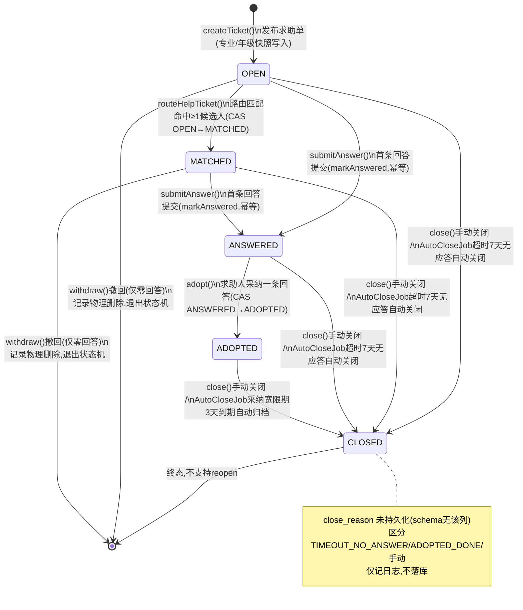

- **工具建议**：Mermaid（可直接渲染）；正式报告排版可用 Visio/PowerDesigner 状态图模板重绘。
- **对应代码/分析来源**：`backend/src/main/java/com/xju/sem/module/help/enums/HelpTicketStatus.java`（OPEN/MATCHED/ANSWERED/ADOPTED/CLOSED，`isValid()` 校验）；流转方法见 `service/impl/HelpTicketServiceImpl.java` 的 `createTicket()`/`withdraw()`/`close()`、`service/impl/HelpRouteServiceImpl.java` 的 `routeHelpTicket()`、`service/impl/HelpAnswerServiceImpl.java` 的 `submitAnswer()`/`adopt()`、`service/impl/HelpTicketAutoCloseJob.java` 的 `autoClose()`（`@Scheduled(cron="0 0 2 * * ?")`，含 `closeTimeout()`/`closeAdoptedGrace()`）；CAS 更新见 `mapper/HelpTicketMapper.java` 的 `casStatus()`/`markAnswered()`/`closeTicket()`；`backend/src/main/resources/schema.sql` `help_ticket.status`(第247行注释)。

---

### 图28 知识条目状态机 knowledge_entry

- **图类型**：状态图
- **放报告**：第六章 §详细设计（M3 经验知识库，对应 `03_M3_经验知识库_详细设计.md` §4）
- **要画什么（元素清单）**：
  - 状态：`CANDIDATE`(初始)、`REVIEWING`、`PUBLISHED`、`EXPIRED`、`OFFLINE`。**无绝对终态**——`EXPIRED`/`OFFLINE` 可编辑重提回 `REVIEWING`；记录终结靠与 `status` 正交的 `deleted` 软删。
  - 触发/动作：`create()`/`createFromHelpAdoption()` 初值 `CANDIDATE`；`submitForReview()` `CANDIDATE→REVIEWING`(新)或 `EXPIRED/OFFLINE→REVIEWING`(修订)；`approve()` `REVIEWING→PUBLISHED`；`returnToCandidate()` `REVIEWING→CANDIDATE`；`update()` 若原 `PUBLISHED` 强制 `PUBLISHED→REVIEWING`(轻量重审)；`offline()` `PUBLISHED/EXPIRED→OFFLINE`；`KnowledgeEntryExpiryScheduler`(每日02:30) `PUBLISHED→EXPIRED`。正交操作 `claim()`/`delete()` 不改 `status`。
- **怎么画（结构描述）**：`[*]→CANDIDATE`(两来源)；`CANDIDATE→REVIEWING`；`REVIEWING→PUBLISHED`/`REVIEWING→CANDIDATE`；`PUBLISHED→REVIEWING`(编辑触发重审环)；`PUBLISHED→EXPIRED`(定时)；`PUBLISHED/EXPIRED→OFFLINE`；`EXPIRED/OFFLINE→REVIEWING`(编辑后 submit)；不画收敛 `[*]`,note 说明"无绝对终态,靠 deleted 软删"。
- **可渲染源码或画法**：

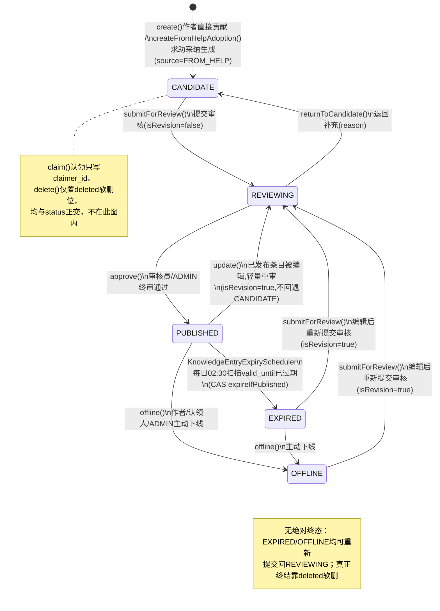

- **工具建议**：Mermaid 渲染；正式报告可用 Visio 重绘并高亮 `REVIEWING⇄PUBLISHED` 的编辑重审环。
- **对应代码/分析来源**：`backend/src/main/java/com/xju/sem/module/knowledge/enums/KnowledgeEntryStatus.java`（CANDIDATE/REVIEWING/PUBLISHED/EXPIRED/OFFLINE，注释含状态机全图）；流转方法见 `service/impl/KnowledgeEntryServiceImpl.java` 的 `create()`/`createFromHelpAdoption()`/`submitForReview()`/`approve()`/`returnToCandidate()`/`update()`/`offline()`/`claim()`/`delete()`；定时降级见 `service/impl/KnowledgeEntryExpiryScheduler.java` 的 `scanExpiredEntries()`（`@Scheduled(cron="0 30 2 * * ?")`）；`backend/src/main/resources/schema.sql` `knowledge_entry.status`(第209行注释)。

---

### 图29 机会状态机 opportunity

- **图类型**：状态图
- **放报告**：第六章 §详细设计（M5 机会与组队，对应 `05_M5_机会与组队_详细设计.md` §4.1）
- **要画什么（元素清单）**：
  - 状态：`PENDING_REVIEW`、`ONGOING`、`CLOSING_SOON`、`CLOSED`、`ENDED`(终态)、`REJECTED`(S18 独立终审拒绝态,可编辑重提)。六态单字段合并"审核门"与"对外时间窗口"两层语义。
  - 触发/动作：`create()` 内推类→`PENDING_REVIEW`,非内推→`computeStatusByTime()` 直判；`approve()` `PENDING_REVIEW→ONGOING/CLOSING_SOON`；`reject()` `PENDING_REVIEW→REJECTED`；`update()` `REJECTED→PENDING_REVIEW`(S18)等；`OpportunityStatusScheduler`(每10分钟) `ONGOING→CLOSING_SOON`(72h)、`→CLOSED`(deadline过)、`CLOSED→ENDED`(归档14天,级联结束队伍)；`end()` 任意非终态→`ENDED`。
- **怎么画（结构描述）**：`[*]` 分两支(内推→`PENDING_REVIEW`/非内推→按 deadline 直进 `ONGOING/CLOSING_SOON/CLOSED`)；`PENDING_REVIEW→ONGOING/CLOSING_SOON`/`→REJECTED`；`REJECTED→PENDING_REVIEW`(回边)；`ONGOING→CLOSING_SOON→CLOSED`；`CLOSED→ENDED`；`PENDING_REVIEW/REJECTED/ONGOING/CLOSING_SOON` 各引 `end()→ENDED`；`ENDED→[*]`。
- **可渲染源码或画法**：

```mermaid
stateDiagram-v2
    [*] --> PENDING_REVIEW : create()内推类(is_referral=1)\n发布,待终审
    [*] --> ONGOING : create()非内推,按deadline计算(未临近/已截止均由computeStatusByTime直判)

    PENDING_REVIEW --> ONGOING : approve()终审通过\n(computeStatusByTime按deadline计算)
    PENDING_REVIEW --> CLOSING_SOON : approve()终审通过\n(computeStatusByTime按deadline计算)
    PENDING_REVIEW --> REJECTED : reject()终审拒绝(S18独立终审态)
    REJECTED --> PENDING_REVIEW : update()发布人编辑后重新提交\n(S18,解除被拒不可重提限制)

    ONGOING --> CLOSING_SOON : OpportunityStatusScheduler\n每10分钟扫描,临近deadline(阈值72h)
    ONGOING --> CLOSED : OpportunityStatusScheduler\ndeadline已过(兜底)
    CLOSING_SOON --> CLOSED : OpportunityStatusScheduler\ndeadline已过

    CLOSED --> ENDED : OpportunityStatusScheduler\n超归档窗口14天自动归档(archiveIfClosed) /\nend()手动结束或ADMIN强制下线

    PENDING_REVIEW --> ENDED : end()发布人手动结束/ADMIN强制下线(不受状态限制)
    REJECTED --> ENDED : end()发布人手动结束/ADMIN强制下线
    ONGOING --> ENDED : end()发布人手动结束/ADMIN强制下线
    CLOSING_SOON --> ENDED : end()发布人手动结束/ADMIN强制下线

    ENDED --> [*] : 终态,不可再流转\n级联endAllByOpportunity()结束关联队伍

    note right of ONGOING
        非内推机会创建即按deadline计算状态，
        不经PENDING_REVIEW审核门
    end note
```

- **工具建议**：Mermaid 渲染；正式报告建议 Visio 重绘并把"内推 vs 非内推"两条创建分支用不同颜色区分。
- **对应代码/分析来源**：`backend/src/main/java/com/xju/sem/module/opportunity/enums/OpportunityStatus.java`（PENDING_REVIEW/ONGOING/CLOSING_SOON/CLOSED/ENDED/**REJECTED**，`REJECTED` 为 S18 独立终审拒绝态，类注释含状态机全图，`schema.sql` `opportunity.status`(第302行注释) 未列出但表结构未加约束）；流转方法见 `service/impl/OpportunityServiceImpl.java` 的 `create()`(内推走 `PENDING_REVIEW`,非内推 `computeStatusByTime()`)/`approve()`/`reject()`/`update()`/`end()`；定时任务见 `service/impl/OpportunityStatusScheduler.java` 的 `advanceStatus()`（`@Scheduled(fixedRate=600000)`，每10分钟）。

---

### 图30 队伍状态机 team

- **图类型**：状态图
- **放报告**：第六章 §详细设计（M5 机会与组队，对应 `05_M5_机会与组队_详细设计.md` §4.2）
- **要画什么（元素清单）**：
  - 状态：`RECRUITING`(初始)、`FULL`、`ONGOING`、`ENDED`(终态)。
  - 触发/动作：`createTeam()` 初值 `RECRUITING`(队长自动 JOINED,current_size=1)；`approve()` 满员 CAS `RECRUITING→FULL`(AUTO)；`lock()` 队长手动 `RECRUITING→FULL`(MANUAL_LOCK)；`start()` `FULL→ONGOING`；`quit()`/`remove()` 空出名额 CAS `FULL→RECRUITING`(隐式回退,无 full_reason 区分)；`end()` 任意非 ENDED→`ENDED`；`endAllByOpportunity()` 机会 ENDED 级联三态→`ENDED`。
- **怎么画（结构描述）**：`[*]→RECRUITING`；`RECRUITING→FULL`(审批满员/手动停招)；`FULL→ONGOING`；`FULL→RECRUITING`(回边,虚线标"隐式回退")；`RECRUITING/FULL→ENDED`(解散)；`ONGOING→ENDED`(完成/级联)；`ENDED→[*]`。
- **可渲染源码或画法**：

```mermaid
stateDiagram-v2
    [*] --> RECRUITING : createTeam()\n发起组队(队长自动JOINED,current_size=1)

    RECRUITING --> FULL : approve()审批使current_size达capacity自动转\n(AUTO) / lock()队长手动停止招募(MANUAL_LOCK)
    FULL --> RECRUITING : quit()成员退出 /\nremove()队长移除成员,空出名额自动回退

    FULL --> ONGOING : start()队长确认开始协作

    RECRUITING --> ENDED : end()队长解散
    FULL --> ENDED : end()队长解散
    ONGOING --> ENDED : end()队长标记完成 /\nendAllByOpportunity()所属机会ENDED级联结束

    ENDED --> [*] : 终态

    note right of FULL
        FULL→RECRUITING回退不区分
        AUTO满员或MANUAL_LOCK来源，
        统一回退(相对05设计的简化)
    end note
```

- **工具建议**：Mermaid 渲染；正式报告可用 drawio 重绘并把"级联结束"用跨图虚线连到图29 机会状态图的 `ENDED`。
- **对应代码/分析来源**：`backend/src/main/java/com/xju/sem/module/opportunity/enums/TeamStatus.java`（RECRUITING/FULL/ONGOING/ENDED，类注释含状态机全图）；流转方法见 `service/impl/TeamServiceImpl.java` 的 `createTeam()`/`lock()`/`start()`/`end()`/`endAllByOpportunity()` 与 `service/impl/TeamMemberServiceImpl.java` 的 `approve()`(满员CAS)/`quit()`/`remove()`(隐式回退)；CAS 更新均经 `mapper/TeamMapper.java` 的 `casStatus()`；`backend/src/main/resources/schema.sql` `team.status`(第323行注释)。

---

### 图31 认证申请状态机 auth_application

- **图类型**：状态图
- **放报告**：第六章 §详细设计（M1 用户与认证，对应 `01_M1_用户与认证_详细设计.md` §4）
- **要画什么（元素清单）**：
  - 状态：`INVITE_ISSUED`、`PENDING`、`AWAITING_GUARANTEE`、`UNDER_REVIEW`、`RETURNED`、`APPROVED`(终态)、`REJECTED`(终态)、`WITHDRAWN`(终态)、`EXPIRED`(schema 声明但当前代码未产生该迁移)。
  - 四条分级认证路径初态：`STUDENT_SSO` 插入即 `PENDING`,同事务按 `ssoMockService.verify()` 改写为 `APPROVED`(命中)或 `UNDER_REVIEW`(未命中)；`STUDENT_MANUAL` 插入即 `UNDER_REVIEW`；`ALUMNI_INVITE_CODE` CAS 认领成功即 `APPROVED`；`ALUMNI_MANUAL_GUARANTEE` 插入即 `AWAITING_GUARANTEE`。
  - 后续流转：`confirmGuarantee(approve=true)` 两人均 CONFIRMED 才 `AWAITING_GUARANTEE→UNDER_REVIEW`；`confirmGuarantee(approve=false)` 任一拒绝→`REJECTED`；`withdraw()` 仅 `PENDING/AWAITING_GUARANTEE→WITHDRAWN`；`approve/reject/returnForSupplement()` 仅 `UNDER_REVIEW` 可调；`resubmit()` 仅 `RETURNED` 按 `verify_method` 分支回流(邀请码路径不支持重提)。
- **怎么画（结构描述）**：四初始伪状态分别进 `INVITE_ISSUED`/`PENDING`/`UNDER_REVIEW`/`AWAITING_GUARANTEE`；`PENDING→APPROVED`/`→UNDER_REVIEW`；`INVITE_ISSUED→APPROVED`；`AWAITING_GUARANTEE→UNDER_REVIEW`/`→REJECTED`/`→WITHDRAWN`；`UNDER_REVIEW→APPROVED`/`→REJECTED`/`→RETURNED`；`RETURNED` 三条回边；`APPROVED`/`REJECTED`/`WITHDRAWN→[*]`；`EXPIRED` 悬空 note"声明未触达"。
- **可渲染源码或画法**：

```mermaid
stateDiagram-v2
    [*] --> INVITE_ISSUED : batchCreateInviteCodes()\n机构侧预生成邀请码(userId为空)
    [*] --> PENDING : submit(STUDENT_SSO)\n提交(同事务内瞬时态,即刻改写)
    [*] --> UNDER_REVIEW : submit(STUDENT_MANUAL)\n提交人工审核
    [*] --> AWAITING_GUARANTEE : submit(ALUMNI_MANUAL_GUARANTEE)\n提交,两担保人置PENDING

    PENDING --> APPROVED : handleStudentSso()\nssoMock roster命中,自动核验通过(autoApproved=1)
    PENDING --> UNDER_REVIEW : handleStudentSso()\nroster未命中,转人工审核

    INVITE_ISSUED --> APPROVED : handleInviteClaim()\nCAS认领邀请码成功(autoApproved=1)

    AWAITING_GUARANTEE --> UNDER_REVIEW : confirmGuarantee()\n两担保人均CONFIRMED
    AWAITING_GUARANTEE --> REJECTED : confirmGuarantee(approve=false)\n任一担保人拒绝,立即否决
    AWAITING_GUARANTEE --> WITHDRAWN : withdraw()\n申请人本人撤回

    UNDER_REVIEW --> APPROVED : approve()\nADMIN终审通过
    UNDER_REVIEW --> REJECTED : reject()\nADMIN终审拒绝
    UNDER_REVIEW --> RETURNED : returnForSupplement()\nADMIN退回补充材料

    RETURNED --> APPROVED : resubmit()\nSTUDENT_SSO重新核验命中,自动通过
    RETURNED --> UNDER_REVIEW : resubmit()\nSTUDENT_SSO未命中转人工 / STUDENT_MANUAL直接转人工
    RETURNED --> AWAITING_GUARANTEE : resubmit()\nALUMNI_MANUAL_GUARANTEE重置两担保人为PENDING

    APPROVED --> [*] : 终态
    REJECTED --> [*] : 终态(不同于机会REJECTED,本状态机不支持重提)
    WITHDRAWN --> [*] : 终态

    EXPIRED : EXPIRED(schema声明,当前代码\n无邀请码/申请超时任务产生该迁移)
```

- **工具建议**：Mermaid 渲染；正式报告建议 Visio 重绘并把"双担保 CONFIRMED 汇合"用菱形判定框强调（两路径均需 CONFIRMED 才汇入 `UNDER_REVIEW`）。
- **对应代码/分析来源**：`module/user/service/impl/AuthApplicationServiceImpl.java` 的 `submit()`→`handleStudentSso()`/`handleStudentManual()`/`handleInviteClaim()`/`handleGuarantee()`、`confirmGuarantee()`（双担保 CAS `casGuarantorStatus()`）、`withdraw()`/`approve()`/`reject()`/`returnForSupplement()`/`resubmit()`；状态常量见 `module/user/constant/AuthConst.java`；`backend/src/main/resources/schema.sql` 的 `auth_application`（第74行，`status`/`guarantor1_status`/`guarantor2_status` 字段）。

---

### 图32 审核任务状态机 audit_task

- **图类型**：状态图
- **放报告**：第六章 §详细设计（M7 平台管理与内容治理，对应 `07_M7_平台管理与内容治理_详细设计.md` §4）
- **要画什么（元素清单）**：
  - 状态：`PENDING`(人工队列初态)、`AUTO_APPROVED`(自动初审通过留痕,仅 `AUTH_APPLICATION` 使用,不入人工队列)、`APPROVED`、`REJECTED`、`RETURNED`(三者均终态)。
  - 触发/动作：`AuditTaskEventListener`(`@TransactionalEventListener(AFTER_COMMIT)`)监听：`onAuthApplicationSubmitted` 自动通过→`AUTO_APPROVED`,否则→`PENDING`；`onKnowledgeEntrySubmitted`→`PENDING`+同步 `runPreCheck()`；`onOpportunitySubmitted`→`PENDING`。`decide()` 仅 `PENDING` 可调；`KNOWLEDGE_ENTRY` 隐私 checklist(`hasRealName`/`hasContact`/`hasLocatableCombo`)任一命中**强制改判 RETURN**；否则 `APPROVE→APPROVED`/`REJECT→REJECTED`/`RETURN→RETURNED`,`casDecide()` CAS 前置 `PENDING`,同事务驱动目标实体流转。全部终态不支持重开,重新提交产生**新记录**。
- **怎么画（结构描述）**：两初始伪状态(`[*]→PENDING`/`[*]→AUTO_APPROVED`)；`PENDING→APPROVED`/`→REJECTED`/`→RETURNED`(含隐私 checklist 命中强制改判)；`APPROVED`/`REJECTED`/`RETURNED`/`AUTO_APPROVED→[*]`；note"目标实体重新提交新建一条任务"。
- **可渲染源码或画法**：

```mermaid
stateDiagram-v2
    [*] --> PENDING : createTask()\n目标模块提交审核事件(AFTER_COMMIT建任务,review_kind=NEW/REVISION)
    [*] --> AUTO_APPROVED : recordAutoApproved()\n仅AUTH_APPLICATION自动核验通过(SSO命中/邀请码认领)留痕,不入队

    PENDING --> APPROVED : decide(APPROVE)\nADMIN终审通过(casDecide CAS,同事务驱动目标实体approve())
    PENDING --> REJECTED : decide(REJECT)\nADMIN终审拒绝(同事务驱动目标实体reject())
    PENDING --> RETURNED : decide(RETURN)\nADMIN退回 / KNOWLEDGE_ENTRY隐私checklist\n(hasRealName/hasContact/hasLocatableCombo)任一命中强制改判(忽略原decision)

    APPROVED --> [*] : 终态
    REJECTED --> [*] : 终态
    RETURNED --> [*] : 终态
    AUTO_APPROVED --> [*] : 终态

    note right of PENDING
        全部终态不支持重新打开；
        目标实体重新提交(resubmit/update)
        会新建一条audit_task记录，
        不在旧记录上流转，形成多轮审核历史
    end note
```

- **工具建议**：Mermaid 渲染；正式报告可用 PowerDesigner 状态图模板重绘，并把"KNOWLEDGE_ENTRY隐私checklist强制改判"用带感叹号的判定分支高亮。
- **对应代码/分析来源**：`module/admin/service/impl/AuditTaskServiceImpl.java` 的 `createTask()`/`recordAutoApproved()`/`decide()`（隐私 checklist 强制改判见 `mapChecklistToReasonCode()`）；事件监听 `module/admin/service/impl/AuditTaskEventListener.java` 的 `onAuthApplicationSubmitted()`/`onKnowledgeEntrySubmitted()`/`onOpportunitySubmitted()`；状态枚举 `module/admin/enums/AuditTaskStatus.java`；`backend/src/main/resources/schema.sql` 的 `audit_task`（第415行，`status` 字段注释 PENDING/APPROVED/REJECTED/RETURNED/AUTO_APPROVED）。

---

### 图33 核心闭环端到端时序

- **图类型**：时序图
- **放报告**：第六章 §核心闭环设计（对应 `00_总体架构与技术设计.md` §7，方法级细化于 `04/03/07_*_详细设计.md`）
- **要画什么（元素清单）**：
  - 参与者/生命线：`在校生(提问)`、`系统前端/Controller层`、`HelpTicketService`、`HelpRouteService`、`NotificationService`、`校友(应答)`、`HelpAnswerService`、`HelpAnswerAdoptedListener`、`KnowledgeEntryService`、`AuditTaskEventListener`、`AuditTaskService`、`管理员`、`AuditTaskController`、`TimelineNodeRefService`。
  - 关键真实方法：①发布 `createTicket()`(OPEN)+发 `HelpTicketCreatedEvent`；②路由 `routeHelpTicket()`(打分/TopK/insert help_route/CAS OPEN→MATCHED)；③通知 `NotificationService.send(NOTIFY_HELP_MATCH)`；④回答 `submitAnswer()`(markAnswered CAS→ANSWERED)；⑤追问 `submitFollowup()`(原子自增,超限拒绝)；⑥采纳 `adopt()`(is_adopted=1,CAS ANSWERED→ADOPTED)+发 `HelpAnswerAdoptedEvent`；⑦生成候选 `createFromHelpAdoption()`(CANDIDATE→doSubmit→REVIEWING)；⑧建审核任务 `createTask()`+`runPreCheck()`；⑨审核通过 `decide(APPROVE)`(casDecide PENDING→APPROVED);⑩入库 `approve()`(REVIEWING→PUBLISHED)；⑪被引用 `existsPublished()`。
- **怎么画（结构描述）**：四条竖向生命线(在校生/系统/校友/管理员),系统内部用 `SYS->>SYS` 自消息+note 注真实类名；异步事件监听(`AFTER_COMMIT`)用虚线返回箭头或 note 标"事务提交后异步",区别同步实线。
- **可渲染源码或画法**：

```mermaid
sequenceDiagram
    participant S as 在校生(提问)
    participant SYS as 系统(Controller/Service)
    participant A as 校友(应答)
    participant AD as 管理员

    S->>SYS: HelpTicketController.create()\n发布求助单(专业/年级/问题类型/方向)
    SYS->>SYS: createTicket() status=OPEN\n事务提交,发布HelpTicketCreatedEvent

    Note over SYS: AFTER_COMMIT异步
    SYS-->>SYS: HelpTicketCreatedListener.onTicketCreated()\n→HelpRouteServiceImpl.routeHelpTicket()\n候选池分层+打分(W_MAJOR/W_ALUMNI/W_GRADE_GAP/W_EXPERTISE/W_TRUST)\n排序取TopK,插入help_route(NOTIFIED),CAS OPEN→MATCHED

    SYS-->>A: NotificationService.send(NOTIFY_HELP_MATCH)\n"有一条你可能能解答的求助"

    A->>SYS: HelpAnswerServiceImpl.submitAnswer()\n模板化回答(precondition/steps/cautions)\nmarkAnswered() CAS→ANSWERED
    SYS-->>S: 通知"你的求助收到新回答"

    S->>SYS: HelpFollowupServiceImpl.submitFollowup()\n追问(原子自增followup_count,超限拒绝)
    A->>SYS: submitFollowup()\n回答人补充(不计入限次)

    S->>SYS: HelpAnswerServiceImpl.adopt(ticketId,answerId)\n置is_adopted=1,CAS ANSWERED→ADOPTED\n事务提交,发布HelpAnswerAdoptedEvent

    Note over SYS: AFTER_COMMIT异步
    SYS-->>SYS: HelpAnswerAdoptedListener.onAnswerAdopted()\n→KnowledgeEntryServiceImpl.createFromHelpAdoption()\ninsert knowledge_entry(status=CANDIDATE,source=FROM_HELP)\n→doSubmit()自动提交,status→REVIEWING\n发布KnowledgeEntrySubmittedEvent
    SYS-->>A: 通知"你的回答被采纳"
    SYS-->>S: 通知"你已采纳最佳回答"

    Note over SYS: AFTER_COMMIT异步
    SYS-->>AD: AuditTaskEventListener.onKnowledgeEntrySubmitted()\n→AuditTaskService.createTask(KNOWLEDGE_ENTRY)建PENDING任务\n→runPreCheck()自动隐私预检写auto_precheck\n候选进入审核队列

    AD->>SYS: AuditTaskController.decide(id,APPROVE,checklistResult)\ncheckList三项未命中→维持APPROVE\ncasDecide(PENDING→APPROVED)
    SYS->>SYS: KnowledgeEntryAuditHandler.handle()\n→KnowledgeEntryService.approve(entryId,reviewerId)\nstatus: REVIEWING→PUBLISHED(入库)

    SYS-->>S: TimelineNodeRefService.existsPublished()\n该知识被时间线节点/知识库搜索引用(仅PUBLISHED可见)
```

- **工具建议**：Mermaid（可直接渲染）；正式报告展示建议用 Visio 重绘并把"AFTER_COMMIT 异步"三段用虚线框/泳道高亮，强调低耦合设计。
- **对应代码/分析来源**：`module/help/service/impl/HelpTicketServiceImpl.java` 的 `createTicket()`→`module/help/service/impl/HelpTicketCreatedListener.java`→`module/help/service/impl/HelpRouteServiceImpl.java` 的 `routeHelpTicket()`→`module/notification/service/impl/NotificationServiceImpl.java` 的 `send()`→`module/help/service/impl/HelpAnswerServiceImpl.java` 的 `submitAnswer()`/`adopt()`→`module/help/service/impl/HelpAnswerAdoptedListener.java`→`module/knowledge/service/impl/KnowledgeEntryServiceImpl.java` 的 `createFromHelpAdoption()`（内部 `doSubmit()`）→`module/admin/service/impl/AuditTaskEventListener.java` 的 `onKnowledgeEntrySubmitted()`→`module/admin/service/impl/AuditTaskServiceImpl.java` 的 `decide()`→`module/admin/service/impl/handler/KnowledgeEntryAuditHandler.java`→`KnowledgeEntryServiceImpl.approve()`；末端引用校验 `KnowledgeEntryServiceImpl.existsPublished()`（被 `module/timeline/service/impl/TimelineNodeRefServiceImpl.java` 跨模块调用）；整体闭环叙述见 `docs/design/00_总体架构与技术设计.md` §7。

---

### 图34 登录与JWT鉴权时序

- **图类型**：时序图
- **放报告**：第六章 §详细设计（M1 用户与认证，对应 `01_M1_用户与认证_详细设计.md` §6.5/§6.4）
- **要画什么（元素清单）**：
  - 参与者：`前端(Axios)`、`AuthController`、`AuthTokenServiceImpl`、`UserMapper/PasswordEncoder`、`JwtUtil`、`RefreshTokenProvider`、`SecurityConfig(白名单)`、`JwtAuthenticationFilter`、`SecurityContextHolder`、`业务Controller(@PreAuthorize)`。
  - 登录段(`AuthTokenServiceImpl.login`)：`selectOne(username)`→不存在/密码失败→`BAD_CREDENTIALS`；`status!=ACTIVE`→`ACCOUNT_DISABLED`；否则 `jwtUtil.generate(userId,role,authStatus)`+`refreshTokenProvider.generate(userId)`,返回 `LoginResponse`。
  - 白名单：`/api/v1/auth/register|login|refresh` 与 `GET /knowledge/**|tags/**` 免 token,其余 `authenticated()`。
  - 带 token 段(`JwtAuthenticationFilter.doFilterInternal`)：取 `Bearer <token>`→`jwtUtil.parse()`(签名/过期校验)→成功构造 `LoginUser` 写 `SecurityContextHolder`;失败 `clearContext()` **不拦截**放行当匿名。
  - 鉴权段：`@PreAuthorize("hasRole('ADMIN')")` 读 SecurityContext;未认证→`authenticationEntryPoint` 401;角色不匹配→`accessDeniedHandler` 403。
- **怎么画（结构描述）**：分两阶段用 `rect` 着色——①登录换 token；②后续带 token 请求(Filter→parse→写/清 Context→@PreAuthorize 判定→放行/403/401)。
- **可渲染源码或画法**：

```mermaid
sequenceDiagram
    participant FE as 前端(Axios拦截器)
    participant AC as AuthController
    participant ATS as AuthTokenServiceImpl
    participant UM as UserMapper/PasswordEncoder
    participant JWT as JwtUtil
    participant JF as JwtAuthenticationFilter
    participant SCH as SecurityContextHolder
    participant BC as 业务Controller(@PreAuthorize)

    rect rgb(240,240,255)
    Note over FE,JWT: 阶段①登录换取令牌
    FE->>AC: POST /api/v1/auth/login(username,password)
    AC->>ATS: login(username,password)
    ATS->>UM: selectOne(username) + passwordEncoder.matches()
    alt 用户不存在或密码不匹配
        UM-->>ATS: 校验失败
        ATS-->>AC: throw BusinessException(BAD_CREDENTIALS)
    else status!=ACTIVE
        ATS-->>AC: throw BusinessException(ACCOUNT_DISABLED)
    else 校验通过
        ATS->>JWT: generate(userId,role,authStatus)\nsub=userId,claim role/authStatus,expireMinutes
        JWT-->>ATS: access token
        ATS->>ATS: refreshTokenProvider.generate(userId)
        ATS-->>AC: LoginResponse(access,refresh,userDTO)
        AC-->>FE: 200 Result.ok(tokens)
    end
    end

    rect rgb(255,245,235)
    Note over FE,BC: 阶段②携带token的后续请求
    FE->>JF: 请求头 Authorization: Bearer <token>
    JF->>JWT: parse(token) 校验签名/过期
    alt 解析成功
        JWT-->>JF: Claims(sub,role,authStatus)
        JF->>SCH: setAuthentication(LoginUser,ROLE_+role)
    else 解析失败/无token
        JF->>SCH: clearContext()\n不拦截,交由后续规则当匿名处理
    end
    JF->>BC: chain.doFilter()放行
    BC->>BC: @PreAuthorize("hasRole('ADMIN')")\n读SecurityContextHolder判定
    alt 未认证
        BC-->>FE: authenticationEntryPoint→401 UNAUTHORIZED
    else 角色不匹配
        BC-->>FE: accessDeniedHandler→403 FORBIDDEN
    else 通过
        BC-->>FE: 200 正常业务响应
    end
    end
```

- **工具建议**：Mermaid（`rect`分阶段着色可直接渲染）；正式报告可用 Visio 重绘并把 `SecurityConfig` 白名单路径单独列一张附表。
- **对应代码/分析来源**：`module/user/controller/AuthController.java` 的 `login()`→`module/user/service/impl/AuthTokenServiceImpl.java` 的 `login()`（`UserMapper`+`PasswordEncoder`校验、`JwtUtil.generate()`、`RefreshTokenProvider.generate()`）；白名单与授权规则见 `common/security/SecurityConfig.java`；带 token 请求见 `common/security/JwtAuthenticationFilter.java` 的 `doFilterInternal()`（`JwtUtil.parse()`）；对应 `docs/design/01_M1_用户与认证_详细设计.md` §6.5/§6.4。

---

### 图35 路由匹配与通知时序

- **图类型**：时序图
- **放报告**：第六章 §详细设计（M4 结构化求助★灵魂，对应 `04_M4_结构化求助_详细设计.md` §6.2）
- **要画什么（元素清单）**：
  - 参与者：`HelpTicketCreatedListener`、`HelpRouteServiceImpl`、`HelpRouteMapper`、`HelpTicketMapper`、`HelpAnswerMapper`、`NotificationService`、`候选人(校友/学长/管理员兜底)`。
  - 真实调用链(`routeHelpTicket(ticketId, excludeUserIds)`)：①前置校验状态非 OPEN/MATCHED 跳过；②候选池分层(tier1 同专业校友+高年级学长→不足 MIN_POOL_SIZE=3 tier2 全平台校友→仍空 tier3 管理员)；③逐候选打分(专业+40/校友+15/年级差 gap*5 封顶3/同类型采纳 min(count,5)*6/总采纳 round(3*ln(1+total)))；④排序取 TopK(默认5,分数降序同分 userId 升序);⑤`insert(NOTIFIED)`(uk 冲突跳过)+`send(NOTIFY_HELP_MATCH)`(失败仅日志);⑥命中≥1人 `casStatus(OPEN,MATCHED)`。
- **怎么画（结构描述）**：单主时序,候选池分层查询用 `loop`,打分用 `loop`(对每个候选),落库+通知用 `loop`(对 TopK),通知发送用 `alt` 标"成功/异常仅日志"。
- **可渲染源码或画法**：

```mermaid
sequenceDiagram
    participant L as HelpTicketCreatedListener
    participant RS as HelpRouteServiceImpl
    participant HTM as HelpTicketMapper
    participant HRM as HelpRouteMapper
    participant HAM as HelpAnswerMapper
    participant NS as NotificationService
    participant U as 候选人(校友/学长/管理员兜底)

    L->>RS: routeHelpTicket(ticketId,excludeUserIds)
    RS->>HTM: selectById(ticketId)
    alt status不是OPEN/MATCHED
        RS-->>L: 跳过,记日志
    else
        RS->>HRM: listMatchedUserIds(ticketId)\n(已匹配过的排除)
        loop 候选池分层放宽
            RS->>HRM: selectVerifiedAlumniByMajor(majorTagId)\n+selectVerifiedSeniorStudentsByMajor(majorTagId,gradeLevel)
            Note over RS: 不足MIN_POOL_SIZE(3)→全平台校友兜底selectAllVerifiedAlumni()
            Note over RS: 仍为空→管理员兜底selectAnyAdmin()
        end
        loop 对候选池中每个候选人
            RS->>HAM: countAdopted(userId,questionTypeTagId)\n历史同类型采纳次数
            RS->>HAM: countAdopted(userId,null)\n历史总采纳次数(信任对数加权)
            RS->>RS: score()=W_MAJOR+W_ALUMNI_IDENTITY\n+gap*W_GRADE_GAP+expertise*W_EXPERTISE\n+round(W_TRUST*ln(1+total))
        end
        RS->>RS: 按score降序,同分userId升序\n取TopK(默认5)
        loop 对TopK每个中选人
            RS->>HRM: insert(route status=NOTIFIED)\n(uk_ticket_user冲突则跳过)
            RS->>NS: send(userId,NOTIFY_HELP_MATCH,\n"有一条你可能能解答的求助",...)
            NS-->>U: 站内通知送达
            alt 通知发送异常
                NS-->>RS: 仅记日志,不影响主流程
            end
        end
        RS->>HTM: casStatus(ticketId,OPEN,MATCHED)\n(命中≥1人才流转,已MATCHED则无副作用)
    end
```

- **工具建议**：Mermaid（`loop`/`alt`可直接渲染）；正式报告可用 Visio 重绘并把打分权重常量列成侧边表格贴在图旁。
- **对应代码/分析来源**：`module/help/service/impl/HelpTicketCreatedListener.java`→`module/help/service/impl/HelpRouteServiceImpl.java` 的 `routeHelpTicket()`/`score()`（打分常量 `W_MAJOR`/`W_ALUMNI_IDENTITY`/`W_GRADE_GAP`/`W_EXPERTISE`/`W_TRUST`）；候选池查询与落库见 `module/help/mapper/HelpRouteMapper.java` 的 `selectVerifiedAlumniByMajor()`/`selectVerifiedSeniorStudentsByMajor()`/`selectAllVerifiedAlumni()`/`selectAnyAdmin()`/`listMatchedUserIds()`；采纳次数统计见 `module/help/mapper/HelpAnswerMapper.java` 的 `countAdopted()`；通知发送见 `module/notification/service/impl/NotificationServiceImpl.java` 的 `send()`；对应 `docs/design/04_M4_结构化求助_详细设计.md` §6.2。

---

### 图36 认证终审时序

- **图类型**：时序图
- **放报告**：第六章 §详细设计（M7 平台管理与内容治理，对应 `07_*_详细设计.md` §6.1/§6.4；跨模块契约见 `01_*_详细设计.md` §8）
- **要画什么（元素清单）**：
  - 参与者：`管理员`、`AuditTaskController`、`AuditTaskServiceImpl`、`AuditTaskMapper`、`AuthApplicationAuditHandler`、`AuthApplicationServiceImpl`、`UserMapper`、`NotificationService`。
  - 真实调用链：①`decide(id,APPROVE,checklistResult=null,...)`(`@PreAuthorize ADMIN`,reviewerId=currentUserId)；②`requireExisting(id)` 非 PENDING 抛 `STATE_CONFLICT`；③AUTH_APPLICATION 无 checklist,`effectiveDecision=APPROVE`；④取 `AuthApplicationAuditHandler`；⑤`casDecide(id,PENDING→APPROVED,...)` 0 行抛 `STATE_CONFLICT`；⑥**同一物理事务**内 `handler.handle()`→`AuthApplicationService.approve(appId,reviewerId)`；⑦`approve()`：`casStatus(UNDER_REVIEW→APPROVED)`+`upsertStudentProfile/upsertAlumniProfile`+`setUserAuthStatus(VERIFIED)`+`notifyResult`；⑧任一异常整体回滚；⑨`notifySubmitter()` 再发 `AUDIT_RESULT` 通知。
- **怎么画（结构描述）**：单主时序,`casDecide` 与 `handler.handle()/approve()` 用同一事务框(`rect` note"同一物理事务,任一失败整体回滚");`approve()` 内对 `user` 写回用自消息标"写 user.auth_status=VERIFIED"。
- **可渲染源码或画法**：

```mermaid
sequenceDiagram
    participant AD as 管理员
    participant ATC as AuditTaskController
    participant ATS as AuditTaskServiceImpl
    participant ATM as AuditTaskMapper
    participant H as AuthApplicationAuditHandler
    participant AAS as AuthApplicationServiceImpl
    participant UM as UserMapper
    participant NS as NotificationService

    AD->>ATC: PATCH /audit-tasks/{id}/decide\n(decision=APPROVE,reasonCode,comment)
    Note over ATC: @PreAuthorize(hasRole ADMIN)\nreviewerId=SecurityUtil.currentUserId()
    ATC->>ATS: decide(id,reviewerId,APPROVE,null,reasonCode,comment)
    ATS->>ATM: requireExisting(id)=selectById
    alt status非PENDING
        ATS-->>ATC: throw STATE_CONFLICT
    else
        Note over ATS: AUTH_APPLICATION无checklist分支,\neffectiveDecision维持APPROVE
        ATS->>ATS: handlers.get("AUTH_APPLICATION")

        rect rgb(235,245,235)
        Note over ATS,UM: 同一物理事务:audit_task CAS + 目标实体approve()\n任一环节失败整体回滚
        ATS->>ATM: casDecide(id,PENDING→APPROVED,reviewerId,note)
        alt 0行(已被处理)
            ATM-->>ATS: throw STATE_CONFLICT
        else
            ATS->>H: handle(targetId,reviewerId,APPROVE,comment)
            H->>AAS: AuthApplicationService.approve(appId,reviewerId)
            AAS->>AAS: requireApp(appId)
            AAS->>AAS: casStatus(appId,UNDER_REVIEW→APPROVED)
            alt 0行(并发冲突)
                AAS-->>H: throw STATE_CONFLICT(整体回滚)
            else
                AAS->>AAS: upsertStudentProfile()/upsertAlumniProfile()\n按applyRole分支写画像
                AAS->>UM: setUserAuthStatus(user,VERIFIED)\n回写user.auth_status=VERIFIED
                AAS->>NS: notifyResult(userId,"身份认证已通过",\n"请重新登录以解锁完整功能")
            end
        end
        end

        ATS->>NS: notifySubmitter(submitterId,AUTH_APPLICATION,\ntargetId,APPROVE,comment)\n"审核已通过"(AUDIT_RESULT)
        ATS-->>ATC: AuditTaskDTO(已更新)
        ATC-->>AD: 200 Result.ok
    end
```

- **工具建议**：Mermaid（`rect`同事务框可直接渲染）；正式报告建议用 Visio 重绘并把"同一物理事务"框加粗边框强调不可分割性。
- **对应代码/分析来源**：`module/admin/controller/AuditTaskController.java` 的 `decide()`→`module/admin/service/impl/AuditTaskServiceImpl.java` 的 `decide()`（`casDecide`/`requireExisting`）→`module/admin/service/impl/handler/AuthApplicationAuditHandler.java`→`module/user/service/impl/AuthApplicationServiceImpl.java` 的 `approve()`（`casStatus`/`upsertStudentProfile()`/`upsertAlumniProfile()`/`setUserAuthStatus(VERIFIED)`/`notifyResult()`）；对应 `docs/design/07_M7_平台管理与内容治理_详细设计.md` §6.1/§6.4 与 `docs/design/01_M1_用户与认证_详细设计.md` §8。

---

### 图37 知识候选审核活动图（管理员泳道）

- **图类型**：活动图
- **放报告**：第六章 §详细设计（M7 平台管理与内容治理，对应 `07_*_详细设计.md` §6.2/§6.3）
- **要画什么（元素清单）**：
  - 泳道：`系统(事件驱动)` / `管理员(ADMIN)`。
  - 系统泳道：`KnowledgeEntrySubmittedEvent` → `onKnowledgeEntrySubmitted` → `createTask(KNOWLEDGE_ENTRY,PENDING)` → 同步 `runPreCheck()`(正则扫描手机号/邮箱/身份证号/"微信+数字" + 结构化字段完整性)写 `auto_precheck` JSON。
  - 管理员泳道：进 P18 审核队列 Tab① → 打开任务详情(含 `privacyAlert`) → 勾选三态 checklist → 提交 `decide(decision, checklistResult)`。
  - 判定分支：`checklistResult.anyChecked()==true`→**强制** `RETURN`(忽略原 decision),`reasonCode` 按 `hasRealName>hasContact>hasLocatableCombo`；否则按原 decision：`APPROVE`→`approve()`(REVIEWING→PUBLISHED)、`RETURN`→`returnToCandidate()`(REVIEWING→CANDIDATE)。收尾 `casDecide` 写状态 + `notifySubmitter()`。
- **怎么画（结构描述）**：两泳道竖排。系统泳道:start→事件→createTask→runPreCheck→写 auto_precheck→流向管理员泳道。管理员泳道:打开详情→勾选 checklist→菱形"anyChecked?"→是→强制 RETURN→returnToCandidate→合流;否→菱形"decision=APPROVE?"→是→approve;否→returnToCandidate→合流→casDecide→notifySubmitter→end。
- **可渲染源码或画法**：

```mermaid
flowchart TB
    subgraph SYS["系统(事件驱动)"]
        A0([知识候选提交审核\nKnowledgeEntrySubmittedEvent]) --> A1[AuditTaskService.createTask\n建audit_task,status=PENDING]
        A1 --> A2["PreCheckService.runPreCheck()\n正则扫描手机号/邮箱/身份证号/\n微信+数字组合 + 结构化字段完整性"]
        A2 --> A3[写回auto_precheck JSON]
    end

    subgraph ADMIN["管理员(ADMIN)"]
        A3 --> B1[打开审核任务详情\n(含privacyAlert预检提示)]
        B1 --> B2[勾选三态checklist\nhasRealName/hasContact/hasLocatableCombo]
        B2 --> C1{anyChecked\n三项任一命中?}
        C1 -- 是 --> D1[强制effectiveDecision=RETURN\n按优先级hasRealName>hasContact>hasLocatableCombo\n取reasonCode,忽略原decision]
        D1 --> D2[调用KnowledgeEntryService\n.returnToCandidate\nREVIEWING→CANDIDATE]
        C1 -- 否 --> C2{管理员原始decision\n=APPROVE?}
        C2 -- 是 --> E1[调用KnowledgeEntryService\n.approve\nREVIEWING→PUBLISHED]
        C2 -- 否(RETURN) --> D2
        D2 --> F1[casDecide写audit_task.status]
        E1 --> F1
        F1 --> F2[notifySubmitter\n通知提交人审核结果]
        F2 --> Z([end])
    end
```

- **工具建议**：Mermaid `flowchart`（用 subgraph 模拟泳道，可直接渲染）；正式报告建议用 Visio/drawio 泳道模板重绘，突出"checklist 强制改判"这一判定框。
- **对应代码/分析来源**：`module/admin/service/impl/AuditTaskServiceImpl.java` 的 `createTask()`/`runPreCheck()`（委托 `module/admin/service/impl/PreCheckServiceImpl.java` 的 `runPreCheck()`）与 `decide()`（checklist 强制改判逻辑 `mapChecklistToReasonCode()`）→`module/admin/service/impl/handler/KnowledgeEntryAuditHandler.java`→`module/knowledge/service/impl/KnowledgeEntryServiceImpl.java` 的 `approve()`/`returnToCandidate()`；对应 `docs/design/07_M7_平台管理与内容治理_详细设计.md` §6.2/§6.3。

---

### 图38 组队申请与审批活动图（申请人/队长泳道）

- **图类型**：活动图
- **放报告**：第六章 §详细设计（M5 机会与组队，对应 `05_*_详细设计.md` §6.5"申请加入与审批（并发抢最后一个名额的 CAS 保护）"）
- **要画什么（元素清单）**：
  - 泳道：`申请人` / `队长` / `系统(TeamMemberServiceImpl)`。
  - 申请人(`apply(teamId,userId)`)：校验非队长本人、`status=RECRUITING`、`isVerified()`(未认证抛 `NOT_VERIFIED`)、挂靠机会需 `opportunity.status∈{ONGOING,CLOSING_SOON}`；已存在 `REJECTED`/`LEFT` 记录允许原地 upsert 回 `APPLYING`,否则新建 `team_member(APPLYING)`;通知队长。
  - 队长(`approve`/`reject`)：`approve` 校验 `operatorId=leaderId`、队伍 `RECRUITING`、成员 `APPLYING`;`incrementIfBelowCapacity()`(0 行→`LIMIT_EXCEEDED`);`casJoinStatus(APPLYING→JOINED)`(0 行→`STATE_CONFLICT`);满员则 `casStatus(RECRUITING→FULL)`;通知申请人。`reject` CAS `APPLYING→REJECTED`,通知"可重新申请"。
- **怎么画（结构描述）**：三泳道。申请人:start→apply→菱形校验→否抛异常→end;是→写 team_member(APPLYING)→系统泳道通知队长→队长决策菱形→approve 分支(CAS increment→是否超容量→casJoinStatus→是否满员→FULL)→通知;reject 分支→CAS REJECTED→通知。
- **可渲染源码或画法**：

```mermaid
flowchart TB
    subgraph APPLICANT["申请人"]
        A0([发起申请\napply(teamId,userId)]) --> A1{队伍RECRUITING\n且已实名认证\n且非队长本人?}
        A1 -- 否 --> A2[抛异常拒绝\nSTATE_CONFLICT/NOT_VERIFIED]
        A1 -- 是 --> A3[写team_member\nstatus=APPLYING\n(或REJECTED/LEFT原地upsert)]
    end

    subgraph SYS["系统(TeamMemberServiceImpl)"]
        A3 --> N1[notifySafe通知队长\n"收到新的组队申请"]
    end

    subgraph LEADER["队长"]
        N1 --> L0{队长审批决定}
        L0 -- 通过approve --> L1[CAS incrementIfBelowCapacity\n原子递增current_size]
        L1 --> L2{0行=超容量?}
        L2 -- 是 --> L3[抛LIMIT_EXCEEDED\n队伍已满员]
        L2 -- 否 --> L4[CAS casJoinStatus\nAPPLYING→JOINED]
        L4 --> L5{0行=并发冲突?}
        L5 -- 是 --> L6[抛STATE_CONFLICT\n申请状态已变化]
        L5 -- 否 --> L7{currentSize>=capacity?}
        L7 -- 是 --> L8[CAS casStatus\nRECRUITING→FULL]
        L7 -- 否 --> L9[维持RECRUITING]
        L8 --> L10[notifySafe通知申请人\n"加入申请已通过"]
        L9 --> L10
        L0 -- 拒绝reject --> R1[CAS casJoinStatus\nAPPLYING→REJECTED]
        R1 --> R2[notifySafe通知申请人\n"未通过审批,可重新申请"]
    end

    L10 --> Z1([end])
    R2 --> Z2([end])
    A2 --> Z3([end])
    L3 --> Z3
    L6 --> Z3
```

- **工具建议**：Mermaid `flowchart`（subgraph模拟三泳道，可直接渲染）；正式报告建议用 Visio 泳道模板重绘并把两处 CAS（`incrementIfBelowCapacity`/`casJoinStatus`）标为同一事务框。
- **对应代码/分析来源**：`module/opportunity/service/impl/TeamMemberServiceImpl.java` 的 `apply()`/`approve()`/`reject()`（并发 CAS 见 `module/opportunity/mapper/TeamMapper.java` 的 `incrementIfBelowCapacity()`/`casStatus()` 与 `module/opportunity/mapper/TeamMemberMapper.java` 的 `casJoinStatus()`）；对应 `docs/design/05_M5_机会与组队_详细设计.md` §6.5。

---

### 图39 路由打分程序流程图

- **图类型**：程序流程图
- **放报告**：第六章 §详细设计（M4 结构化求助★灵魂，对应 `04_*_详细设计.md` §6.2，源码 `HelpRouteServiceImpl.routeHelpTicket()`/`score()`）
- **要画什么（元素清单）**：处理步骤严格对应代码顺序：①读 ticket,状态非 {OPEN,MATCHED}→结束；②构建 exclude(求助人自己+已匹配过的);③候选池分层(tier1 同专业校友+高年级学长→<MIN_POOL_SIZE(3) tier2 全平台校友→isEmpty tier3 管理员→仍空结束);④遍历打分 `score()`(专业+40/校友+15或学生年级差 min(gap,3)*5/同类型采纳 min(count,5)*6/总采纳 round(3*ln(1+total)));⑤分数降序同分 userId 升序;⑥取 min(topK=5,size);⑦遍历 winners:`insert()`(唯一键冲突跳过)→routed++→`notifySafe()`;⑧routed>0→`casStatus(OPEN→MATCHED)`。
- **怎么画（结构描述）**：标准程序流程图,起止圆角矩形,判定菱形,处理矩形,循环遍历+回边。主干:开始→读求助单→判状态→构建 exclude→候选池分层三级判定→遍历打分(内部四加分判定)→排序→取 TopK→遍历 winners 插入+通知(唯一键冲突跳过)→判 routed>0→CAS 流转→结束。
- **可渲染源码或画法**：

```mermaid
flowchart TD
    Start([开始 routeHelpTicket]) --> ReadTicket[读取help_ticket]
    ReadTicket --> StatusChk{status∈\n{OPEN,MATCHED}?}
    StatusChk -- 否 --> EndSkip([结束:跳过,记日志])
    StatusChk -- 是 --> BuildExclude[构建exclude集合\n求助人自己+已匹配过的用户]
    BuildExclude --> Tier1{majorTagId非空?}
    Tier1 -- 是 --> AddTier1[加入tier1候选:\n同专业校友+同专业高年级学长]
    Tier1 -- 否 --> Tier2Chk
    AddTier1 --> Tier2Chk{候选池size<\nMIN_POOL_SIZE(3)?}
    Tier2Chk -- 是 --> AddTier2[加入tier2候选:\n全平台已认证校友兜底]
    Tier2Chk -- 否 --> Tier3Chk
    AddTier2 --> Tier3Chk{候选池为空?}
    Tier3Chk -- 是 --> AddTier3[加入tier3候选:\n任一管理员兜底]
    Tier3Chk -- 否 --> PoolEmptyChk
    AddTier3 --> PoolEmptyChk{候选池仍为空?}
    PoolEmptyChk -- 是 --> EndNoCandidate([结束:无候选,记警告])
    PoolEmptyChk -- 否 --> LoopScore[遍历候选池,逐个打分score]

    subgraph SCORE["score(ticket,candidate)"]
        S1{专业相同?} -- 是 --> S1Y[+W_MAJOR 40]
        S1 -- 否 --> S2
        S1Y --> S2{候选人是校友?}
        S2 -- 是 --> S2Y[+W_ALUMNI_IDENTITY 15]
        S2 -- 否,是学生且年级差>0 --> S2N[+min(gap,3)*W_GRADE_GAP 5]
        S2Y --> S3
        S2N --> S3
        S3{问题类型标签非空\n且历史同类型被采纳>0?} -- 是 --> S3Y[+min(count,5)*W_EXPERTISE 6]
        S3 -- 否 --> S4
        S3Y --> S4{总采纳数>0?}
        S4 -- 是 --> S4Y[+round(W_TRUST 3 *ln(1+total))]
        S4 -- 否 --> S5[得分累加完成]
        S4Y --> S5
    end

    LoopScore --> S1
    S5 --> SortDesc[按score降序排序\n同分userId升序稳定排序]
    SortDesc --> TakeTopK[取min(topK默认5,size)条为winners]
    TakeTopK --> LoopWinner[遍历winners]
    LoopWinner --> InsertRoute{insert help_route\n唯一键uk_ticket_user冲突?}
    InsertRoute -- 是,跳过 --> LoopWinner
    InsertRoute -- 否 --> Notify[routed++\nnotifySafe发送站内通知]
    Notify --> LoopWinner
    LoopWinner --> RoutedChk{routed>0?}
    RoutedChk -- 是 --> CasMatch[CAS OPEN→MATCHED]
    RoutedChk -- 否 --> LogEnd
    CasMatch --> LogEnd[记日志:候选池N人,通知routed人]
    LogEnd --> End([结束])
```

- **工具建议**：Mermaid `flowchart`（subgraph 表达 score 子过程，可直接渲染）；正式报告建议用 Visio/PowerDesigner 标准程序流程图符号重绘。
- **对应代码/分析来源**：`module/help/service/impl/HelpRouteServiceImpl.java` 的 `routeHelpTicket()`/`score()`（权重常量 `W_MAJOR`(40)/`W_ALUMNI_IDENTITY`(15)/`W_GRADE_GAP`(5)/`W_EXPERTISE`(6)/`W_TRUST`(3)、`MIN_POOL_SIZE`(3)、`topK`）；对应 `docs/design/04_M4_结构化求助_详细设计.md` §6.2。

---

### 图40 补救优先级计算程序流程图

- **图类型**：程序流程图
- **放报告**：第六章 §详细设计（M6 成长时间线，对应 `06_*_详细设计.md` §6.5，源码 `UserProgressServiceImpl.remediation()`/`annotate()`/`tierOf()`）
- **要画什么（元素清单）**：处理步骤严格对应代码：①取 `enrollYear`/`currentStage`/`prev=currentStage.previous()`;②遍历模板全部 nodes:取 status(默认 NOT_STARTED),`DONE`→跳过；`annotate()` stage/suggestedMonth 缺失→不逾期返回,否则换算 suggestedDate 比较 `isOverdue()`;`!overdue`→跳过；`tierOf(monthsOverdue)`(<=1月 URGENT base100/<=3月 HIGH 70/<=6月 MEDIUM 40/>6月 LOW 10);`importance`(默认1);`recency`(节点 stage=当前或上一阶段→+10);`score=tier.base*importance+recency`;生成 `RemediationHintDTO` 加入 hints;③排序(priorityScore 降序→daysOverdue 升序→node.orderNo 升序);④取前 TOP_N(5)。
- **怎么画（结构描述）**：标准程序流程图,外层遍历 nodes 循环+回边;内部:status 判定(DONE 跳过)→逾期标注(缺字段/未逾期跳过)→tier 四选一→重要度→学期邻近度加分→计算 score→加入候选→循环后排序→截断 TopN→结束。
- **可渲染源码或画法**：

```mermaid
flowchart TD
    Start([开始 remediation]) --> InitCtx[取enrollYear/currentStage\nprev=currentStage.previous()]
    InitCtx --> LoopNode[遍历模板全部timeline_node]
    LoopNode --> DoneChk{该节点status=DONE?}
    DoneChk -- 是 --> LoopNode
    DoneChk -- 否 --> Annotate[annotate:换算suggestedDate\n(stage+suggestedMonth+enrollYear)]
    Annotate --> FieldChk{stage/suggestedMonth\n缺失?}
    FieldChk -- 是 --> LoopNode
    FieldChk -- 否 --> OverdueChk{suggestedDate早于\n当前YearMonth.now()?\n(isOverdue)}
    OverdueChk -- 否 --> LoopNode
    OverdueChk -- 是 --> CalcOverdue[算monthsOverdue/daysOverdue]
    CalcOverdue --> TierChk{monthsOverdue分档}
    TierChk -- "<=1月" --> T1[tier=URGENT,base=100]
    TierChk -- "<=3月" --> T2[tier=HIGH,base=70]
    TierChk -- "<=6月" --> T3[tier=MEDIUM,base=40]
    TierChk -- ">6月" --> T4[tier=LOW,base=10]
    T1 --> Importance
    T2 --> Importance
    T3 --> Importance
    T4 --> Importance
    Importance[取importance\n=node.importance或默认1] --> RecencyChk{node.stage=currentStage\n或=prev阶段?}
    RecencyChk -- 是 --> RecencyY[recency=RECENCY_BONUS 10]
    RecencyChk -- 否 --> RecencyN[recency=0]
    RecencyY --> ScoreCalc
    RecencyN --> ScoreCalc[score=tier.base*importance+recency]
    ScoreCalc --> AddHint[生成RemediationHintDTO\n加入hints列表]
    AddHint --> LoopNode
    LoopNode --> SortHints[遍历完成:\n排序priorityScore降序,\ntie-break daysOverdue升序,\n再tie-break node.orderNo升序]
    SortHints --> TakeTopN[截断取前TOP_N(5)条]
    TakeTopN --> End([返回补救提示列表])
```

- **工具建议**：Mermaid `flowchart`（可直接渲染）；正式报告建议用 Visio/PowerDesigner 重绘并把"tier分档四选一"用带阴影的判定框强调，突出"陈年旧账权重收敛"（`LOW`档 base 仅10）这一设计要点。
- **对应代码/分析来源**：`module/timeline/service/impl/UserProgressServiceImpl.java` 的 `remediation()`/`annotate()`/`tierOf()`（`TOP_N`(5)、`RECENCY_BONUS`(10) 常量）；对应 `docs/design/06_M6_成长时间线_详细设计.md` §6.5。

---

### 图41 登录与鉴权测试时序〔本总纲补足·第七章测试〕

- **图类型**：时序图（测试用例驱动，对应图34 登录与 JWT 鉴权时序的测试视角）
- **放报告**：第七章 测试（M1 用户与认证 · 登录与访问控制黑盒/集成测试）
- **要画什么（元素清单）**：
  - 参与者：`测试用例(JUnit5+MockMvc / Postman)`、`AuthController`、`AuthTokenServiceImpl`、`UserMapper/PasswordEncoder`、`JwtAuthenticationFilter`、`受保护业务Controller(如 AuditTaskController,@PreAuthorize ADMIN)`。
  - 六条测试用例（覆盖 `01_M1_用户与认证_详细设计.md` §6.4/§6.5 的正常与异常路径，断言取自真实 `ResultCode` 与 HTTP 语义）：
    - TC-LOGIN-01 正确凭据登录 → 期望 200 + `Result.code==0` 且 `data.access` 非空
    - TC-LOGIN-02 错误密码 → 期望 `Result.fail(BAD_CREDENTIALS)` 且无 token
    - TC-LOGIN-03 禁用账号(`status=DISABLED`) → 期望 `Result.fail(ACCOUNT_DISABLED)`
    - TC-AUTH-04 携带合法 ADMIN token 访问受保护接口 → 期望 200
    - TC-AUTH-05 无 token 访问受保护接口 → 期望 401 UNAUTHORIZED
    - TC-AUTH-06 越权(STUDENT token 访问 ADMIN 接口) → 期望 403 FORBIDDEN
- **怎么画（结构描述）**：以测试用例生命线为主动方,每条用例用 `Note over T` 分隔;登录类用例走 `AuthController→AuthTokenServiceImpl→UserMapper/PasswordEncoder`;鉴权类用例走 `JwtAuthenticationFilter→受保护 Controller` 的 `@PreAuthorize` 判定;每条用例末尾用测试自消息 `T->>T: assert ...` 标注断言,与图34 的运行时序一一对应(测试即对图34 各分支的用例化验证)。
- **可渲染源码或画法**：

```mermaid
sequenceDiagram
    participant T as 测试用例(JUnit5+MockMvc)
    participant AC as AuthController
    participant ATS as AuthTokenServiceImpl
    participant DB as UserMapper/PasswordEncoder
    participant JF as JwtAuthenticationFilter
    participant BC as AuditTaskController(@PreAuthorize ADMIN)

    Note over T: 用例TC-LOGIN-01 正确凭据登录
    T->>AC: POST /api/v1/auth/login(正确username/password)
    AC->>ATS: login()
    ATS->>DB: selectOne + matches() 校验通过
    ATS-->>AC: LoginResponse(access,refresh)
    AC-->>T: 200 Result.ok
    T->>T: assert code==0 且 data.access非空

    Note over T: 用例TC-LOGIN-02 错误密码
    T->>AC: POST /login(错误password)
    AC->>ATS: login()
    ATS->>DB: matches()失败
    ATS-->>AC: throw BAD_CREDENTIALS
    AC-->>T: Result.fail(BAD_CREDENTIALS)
    T->>T: assert code==BAD_CREDENTIALS码 且 无token

    Note over T: 用例TC-LOGIN-03 禁用账号
    T->>AC: POST /login(status=DISABLED用户)
    AC->>ATS: login()
    ATS-->>AC: throw ACCOUNT_DISABLED
    AC-->>T: Result.fail(ACCOUNT_DISABLED)
    T->>T: assert code==ACCOUNT_DISABLED码

    Note over T: 用例TC-AUTH-04 携带合法token访问受保护接口
    T->>JF: GET /api/v1/audit-tasks (Bearer 有效ADMIN token)
    JF->>JF: parse()成功,写SecurityContext(ROLE_ADMIN)
    JF->>BC: 放行
    BC-->>T: 200 正常响应
    T->>T: assert 200

    Note over T: 用例TC-AUTH-05 无token访问受保护接口
    T->>JF: GET /api/v1/audit-tasks (无Authorization头)
    JF->>JF: clearContext()匿名放行
    JF->>BC: @PreAuthorize判定失败
    BC-->>T: 401 UNAUTHORIZED
    T->>T: assert 401

    Note over T: 用例TC-AUTH-06 越权(STUDENT访问ADMIN接口)
    T->>JF: GET /api/v1/audit-tasks (Bearer STUDENT token)
    JF->>BC: 写SecurityContext(ROLE_STUDENT),放行到方法安全
    BC-->>T: 403 FORBIDDEN
    T->>T: assert 403
```

- **工具建议**：Mermaid（`Note`/自消息 assert 可直接渲染）；正式报告建议配一张测试用例表（用例号 / 输入 / 预期 `ResultCode` / 预期 HTTP 码 / 实测结果 / 通过?），与本时序图对照，作为第七章"黑盒测试用例设计"的图证。可用 Postman Collection 或 JUnit `MockMvc` 实测截图佐证。
- **对应代码/分析来源**：测试对象为 `module/user/controller/AuthController.java` 的 `login()`/`module/user/service/impl/AuthTokenServiceImpl.java` 的 `login()` 与 `common/security/{JwtAuthenticationFilter.java,JwtUtil.java,SecurityConfig.java}`（鉴权失败分支 `authenticationEntryPoint`/`accessDeniedHandler`）；对应图34 运行时序的用例化验证，测试设计口径见 `docs/design/01_M1_用户与认证_详细设计.md` §6.4/§6.5。

---

## 四、画图工具与导出建议

1. **Mermaid（本仓库内直接渲染的图）**：图1–3、图12–14、图15、图16–21、图22–26、图27–32、图33–41 均提供了可直接渲染的 mermaid 源码。
   - 在 [mermaid.live](https://mermaid.live) 粘贴源码渲染后，导出 **SVG**（矢量，论文首选，缩放不失真）或 **PNG**（位图，投影/预览用）。
   - 需要在 drawio 中二次精修的，mermaid.live 可"Export → 复制为 drawio 兼容格式"，或在 drawio 里 `Extras → Edit Diagram / Insert → Advanced → Mermaid` 直接粘贴 mermaid 源码转成可编辑图元。
2. **用例图（图4–图11）与 DFD（图1、图2、图12、图13）**：Mermaid 不擅长表达 include/extend/泛化与标准 DFD 开口矩形符号，**建议用 drawio 或 Visio** 按各图"元素清单 + 怎么画"的框线布局手绘：
   - 用例图：drawio 的 UML → Use Case 模具（参与者/椭圆/`<<include>>`/`<<extend>>`/泛化空心三角箭头齐全）；分组用 drawio 容器功能。
   - DFD：Visio/PowerDesigner 标准符号（圆=加工、开口矩形=数据存储、矩形=外部实体）；draft 阶段可先用 mermaid flowchart 校验数据流方向闭环一致再重绘。
3. **部署图（图21）**：Visio/drawio 的 UML Deployment 模具（`<<device>>`/`<<artifact>>`/`<<execution environment>>` 构造型节点）最规范。
4. **E-R 图（图18–图20）**：概览用 mermaid `erDiagram`；正式提交建议 **PowerDesigner** 生成物理数据模型（含字段类型/主外键/索引），或 drawio ER 模具重绘。
5. **状态图/时序图/类图/活动图/程序流程图（图22–图41）**：均可 mermaid 直接出图；对需要高亮的设计要点（AFTER_COMMIT 异步、同一物理事务框、隐私 checklist 强制改判、编辑重审环、tier 分档收敛）建议在 Visio/drawio 重绘时用配色/加粗边框/判定分支符号强调。
6. **论文图题编号**：正式报告图题编号**建议跟随本总纲**（图1–图41 连续编号），并在每章开头按"二、按报告章节分组速查"列出该章包含的图号，方便交叉引用（如"如图33 所示的核心闭环…"）。
7. **导出规格建议**：论文正文插图统一导出 **SVG 优先、PNG（≥300dpi）兜底**；宽幅图（图12 一层 DFD、图23/图24/图25/图26 类图、图33 端到端时序）在 Word/LaTeX 中建议横排（landscape）或拆分子图，避免缩放后文字不可读。
