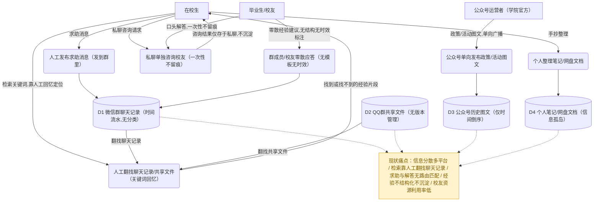
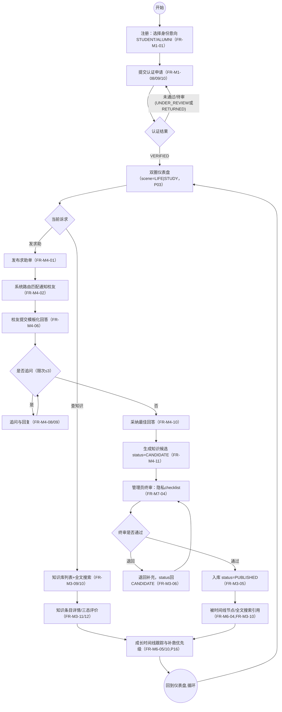
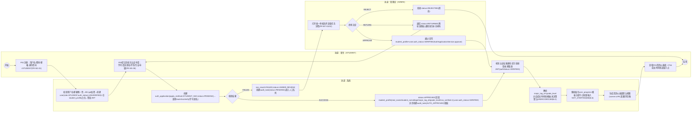

# A 可行性研究与总体数据流图（图1-3、图12-14）

> 来源：`docs/design/00_总体架构与技术设计.md`（地基文档，全局数据模型§3、API规范§4、权限矩阵§5、界面清单§6、核心闭环时序§7、模块依赖§8）与 `docs/design/09_设计修订说明.md`（v3.1 reconcile，字段以此为准，如 `major_tag_id`/`enroll_year`/`grade_level`/`help_answer.knowledge_entry_id`/`audit_task.review_kind` 增 `NEW_FROM_HELP`），并交叉核对 `docs/design/01/03/04/06/07_*_详细设计.md` 与 `backend/src/main/resources/schema.sql`。所有类名/字段名/状态值/FR 编号均取自上述真实文档，不做占位编造。

---

### 图1 现有系统数据流图（现状）

- **图类型**：数据流图 DFD（0层，近似表达"人工/手工"流程，无系统加工）
- **放报告**：第二章 §3.1
- **要画什么（元素清单）**：
  - 外部实体：在校生（提问方）、毕业生/校友（应答方，凭个人意愿零散答复）、公众号运营者（学院官方，单向发布）
  - 加工（均为**人工动作**，非系统加工，用圆角框标注"人工"以区别于后续图12/13的系统加工）：
    - P1 在微信群/QQ群里发布求助消息
    - P2 群成员/校友零散应答（无模板、无结构、无时效标注）
    - P3 人工翻找聊天记录/共享文件（按关键词回忆定位，无全文检索）
    - P4 私聊单独咨询校友（一次性、不留痕、不可复用）
    - P5 公众号单向发布政策/活动图文（只读广播，无个性化匹配）
    - P6 个人整理笔记/网盘文档保存经验（私有，未沉淀为组织资产）
  - 数据存储（均为非结构化、无库表、无检索能力）：D1 微信群聊天记录（时间流水，无分类无检索）、D2 QQ群共享文件（无版本管理，易混乱堆积）、D3 公众号历史图文列表（仅时间倒序）、D4 个人笔记/网盘文档（信息孤岛）
- **怎么画（结构描述）**：顶部横排 3 个外部实体矩形（在校生、毕业生/校友、公众号运营者）；中部纵向排列 6 个人工加工圆角框 P1–P6；底部横排 4 个数据存储（圆柱/开口矩形近似）。连线均按数据流方向画箭头并标注流名（如"求助消息""零散经验/建议，无结构无时效"）；末尾追加一个高亮批注框汇总现状痛点：**信息分散在多平台、检索靠人工翻找、求助与解答无路由匹配、经验不结构化不沉淀、校友资源利用率低**，呼应第二章"现状与问题"的论证素材。
- **可渲染源码**：



- **工具建议**：Mermaid（可直接渲染）；正式报告排版可导入 drawio 精修数据存储的"开口矩形"标准 DFD 符号。

---

### 图2 建议系统顶层数据流图（0层）

- **图类型**：数据流图 DFD（0层/上下文图）
- **放报告**：第二章 §4.2
- **要画什么（元素清单）**：
  - 外部实体：在校生（STUDENT）、毕业生（ALUMNI）、管理员（ADMIN）；另加访客（GUEST，权限矩阵§5 明确列出，虚线只读）
  - 唯一加工：`0 新疆大学校友圈与双圈成长导航平台`（单一处理框，0层DFD只画一个加工）
  - 主要数据流（均取自地基§5权限矩阵与各模块FR编号，双向标注）：
    - 在校生→平台：注册/登录信息（FR-M1-01/02）、认证申请材料（FR-M1-08）、求助单/回答/追问/采纳（FR-M4-01/06/08/10）、画像与成长标签（FR-M2-01/02）、节点进度标记（FR-M6-08）
    - 平台→在校生：JWT令牌与用户信息、认证结果通知、路由匹配通知（FR-M4-02）、知识库检索结果（FR-M3-10）、双圈仪表盘/成长时间线聚合视图（FR-M6-05）
    - 毕业生→平台：认证申请（邀请码/人工担保材料，FR-M1-09/10）、校友路径卡与可见性配置（FR-M2-03/05）、机会发布（FR-M5-01）
    - 平台→毕业生：担保确认请求通知（FR-M1-10）、去向统计与贡献者标识（FR-M2-08/10）
    - 管理员→平台：认证/知识候选/机会终审决定（FR-M7-03/04/08）、举报处理决定（FR-M7-11）、标签/时间线模板维护（FR-M7-13/15）
    - 平台→管理员：统一审核队列与举报队列（FR-M7-01/10）、运营数据统计看板（FR-M7-20）
    - 访客↔平台（虚线）：只读浏览请求 / 公共FAQ与已发布知识只读内容
- **怎么画（结构描述）**：中心画一个圆（0层DFD惯例，加工用圆/双圈），标注"0 平台"；四周环绕 4 个外部实体矩形（在校生、毕业生、管理员实线，访客虚线弱化表示"认证前只读分层"）；每对实体与中心圆之间各画双向箭头（进/出分开画两条，各自标注流名），保证"双圈是视图层，不改变业务数据"的定位在图注中说明。
- **可渲染源码**：

```mermaid
flowchart TB
  SYS(("0<br/>新疆大学校友圈与双圈<br/>成长导航平台"))
  STU["在校生 STUDENT"]
  ALU["毕业生 ALUMNI"]
  ADM["管理员 ADMIN"]
  GUE["访客 GUEST（认证前只读分层）"]

  STU -->|注册/登录信息(FR-M1-01/02)| SYS
  STU -->|认证申请材料(FR-M1-08)| SYS
  STU -->|求助单/回答/追问/采纳(FR-M4-01/06/08/10)| SYS
  STU -->|画像与成长标签(FR-M2-01/02)| SYS
  STU -->|节点进度标记(FR-M6-08)| SYS
  SYS -->|JWT令牌与用户信息| STU
  SYS -->|认证结果通知| STU
  SYS -->|路由匹配通知(FR-M4-02)| STU
  SYS -->|知识库检索结果(FR-M3-10)| STU
  SYS -->|双圈仪表盘/成长时间线视图(FR-M6-05)| STU

  ALU -->|认证申请(邀请码/担保材料)(FR-M1-09/10)| SYS
  ALU -->|校友路径卡与可见性配置(FR-M2-03/05)| SYS
  ALU -->|机会发布(FR-M5-01)| SYS
  SYS -->|担保确认请求通知(FR-M1-10)| ALU
  SYS -->|去向统计与贡献者标识(FR-M2-08/10)| ALU

  ADM -->|认证/知识候选/机会终审决定(FR-M7-03/04/08)| SYS
  ADM -->|举报处理决定(FR-M7-11)| SYS
  ADM -->|标签/时间线模板维护(FR-M7-13/15)| SYS
  SYS -->|统一审核队列与举报队列(FR-M7-01/10)| ADM
  SYS -->|运营数据统计看板(FR-M7-20)| ADM

  GUE -.->|只读浏览请求| SYS
  SYS -.->|公共FAQ/已发布知识只读内容| GUE
```

- **工具建议**：Mermaid 或 drawio（0层图元素少，drawio 更易画出标准圆形加工+矩形实体的教科书样式）。

---

### 图3 系统总体业务流程图（主干）

- **图类型**：程序流程图/活动图（近似，单泳道，聚焦主干不分角色）
- **放报告**：第四章 §3.1
- **要画什么（元素清单）**：
  - 主干节点：注册（选择身份意向 STUDENT/ALUMNI，FR-M1-01）→ 提交认证申请（FR-M1-08/09/10）→ 认证结果判定 → 双圈仪表盘（scene=LIFE|STUDY，P03）→ 当前诉求分支（查知识 / 发求助）
  - 查知识分支：知识库列表+全文搜索（FR-M3-09/10）→ 知识条目详情+三态评价（FR-M3-11/12）
  - 发求助分支（核心闭环，呼应地基§7时序）：发布求助单（FR-M4-01）→ 路由匹配通知校友（FR-M4-02）→ 模板化回答（FR-M4-06）→ 追问循环（FR-M4-08/09，限次）→ 采纳最佳回答（FR-M4-10）→ 生成知识候选（status=CANDIDATE，FR-M4-11）→ 管理员终审（隐私checklist，FR-M7-04）→ 通过则入库 PUBLISHED（FR-M3-05）/ 退回则补充重审（FR-M3-06）
  - 汇合终点：知识条目被时间线节点/搜索引用（FR-M6-04、FR-M3-10）→ 成长时间线跟踪与补救优先级（FR-M6-05/10，P16）→ 循环回仪表盘
- **怎么画（结构描述）**：竖向主干流程图，起止用圆角"开始/结束"，判断用菱形，动作用矩形；"查知识"与"发求助"两条分支从同一个菱形分岔，最终都汇入"成长时间线"节点后再回到仪表盘形成闭环（体现"注册认证→查知识/发求助→采纳沉淀→时间线导航"的主干定位）。
- **可渲染源码**：



- **工具建议**：Mermaid 或 Visio（主干流程图，Visio 泳道模板也可但本图不分角色，Mermaid 足够）。

---

### 图12 一层数据流图（7个加工）

- **图类型**：数据流图 DFD（1层，按地基§8模块划分展开为7个加工）
- **放报告**：第四章 §3.2
- **要画什么（元素清单）**：
  - 外部实体：在校生（STUDENT）、毕业生（ALUMNI）、管理员（ADMIN）
  - 7个加工（严格对应地基§8模块划分与命名）：
    1. 用户与认证（M1）
    2. 画像与校友路径（M2）
    3. 经验知识库（M3）
    4. 结构化求助★（M4，系统灵魂）
    5. 机会与组队（M5）
    6. 成长时间线（M6）
    7. 平台管理与治理（M7）
  - 主要数据存储（按地基§3全局数据模型25表分组归并）：D1 `user/student_profile/alumni_profile/auth_application`、D2 `tag/user_tag/alumni_path_card/path_visibility`、D3 `knowledge_entry/knowledge_feedback`、D4 `help_ticket/help_answer/help_followup/help_route`、D5 `opportunity/team/team_member/referral_ticket`、D6 `timeline_template/timeline_node/timeline_node_ref/user_progress`、D7 `audit_task/report`、D0 `notification`（全局）
- **怎么画（结构描述）**：外部实体（在校生/毕业生/管理员）画在图左侧；7个加工圆/圆角框按地基§8依赖方向从上到下大致排列（1在最上，4居中标★，7在最下靠近审核回路）；数据存储画在图右侧对齐各自所属加工；模块间**弱耦合**依赖（地基§8："只通过用户ID/标签/状态/关联ID/候选队列耦合"）用虚线箭头表示（如 1→2/4/5/6 的只读依赖、2→4 的标签匹配、3/2/5→6 的只读引用），核心业务流用实线箭头（如 4→3 采纳生成候选、3/1/5→7 提交审核事件、7→3/1/5 终审决定）。
- **可渲染源码**：

```mermaid
flowchart TB
  STU["在校生 STUDENT"]
  ALU["毕业生 ALUMNI"]
  ADM["管理员 ADMIN"]

  P1(("1 用户与认证"))
  P2(("2 画像与校友路径"))
  P3(("3 经验知识库"))
  P4(("4 结构化求助★"))
  P5(("5 机会与组队"))
  P6(("6 成长时间线"))
  P7(("7 平台管理与治理"))

  D1[("D1 user/student_profile/alumni_profile/auth_application")]
  D2[("D2 tag/user_tag/alumni_path_card/path_visibility")]
  D3[("D3 knowledge_entry/knowledge_feedback")]
  D4[("D4 help_ticket/help_answer/help_followup/help_route")]
  D5[("D5 opportunity/team/team_member/referral_ticket")]
  D6[("D6 timeline_template/timeline_node/timeline_node_ref/user_progress")]
  D7[("D7 audit_task/report")]
  D0[("D0 notification（全局）")]

  STU -->|注册/登录/认证申请| P1
  ALU -->|认证申请(邀请码/担保)| P1
  P1 --> D1
  P1 -->|JWT/认证结果| STU
  P1 -->|认证结果/担保通知| ALU
  P1 -.->|user_id/role/auth_status只读| P2
  P1 -.->|isVerified,major_tag_id/grade_level只读| P4
  P1 -.->|role/auth_status只读| P5
  P1 -.->|major_tag_id/grade_level只读| P6

  STU -->|维护画像/成长标签| P2
  ALU -->|校友路径卡/可见性配置| P2
  P2 --> D2
  P2 -->|画像详情/路径推荐/去向统计| STU
  P2 -->|路径卡详情/贡献者标识| ALU
  P2 -.->|标签匹配(GROWTH/MAJOR)只读| P4

  STU -->|求助单/追问/采纳| P4
  ALU -->|模板化回答| P4
  P4 --> D4
  P4 -->|路由通知/回答/追问| STU
  P4 -->|路由通知/回答| ALU
  P4 -->|采纳生成知识候选(FROM_HELP)| P3

  STU -->|创建/搜索/评价知识条目| P3
  ALU -->|创建/搜索/评价知识条目| P3
  ADM -->|创建知识条目| P3
  P3 --> D3
  P3 -->|检索结果/详情| STU
  P3 -->|检索结果/详情| ALU
  P3 -->|提交审核事件| P7
  P7 -->|终审决定| P3

  P1 -->|认证申请提交事件| P7
  P7 -->|终审决定| P1

  ALU -->|发布机会| P5
  ADM -->|发布官方机会/审批| P5
  P5 --> D5
  P5 -->|机会/队伍详情| STU
  P5 -->|机会/队伍详情| ALU
  P5 -->|机会提交审核事件| P7
  P7 -->|终审决定| P5

  P3 -.->|知识条目只读引用| P6
  P2 -.->|路径卡只读引用| P6
  P5 -.->|机会只读引用| P6
  STU -->|标记节点进度/选择路线| P6
  P6 --> D6
  P6 -->|时间线聚合视图/补救优先级| STU

  ADM -->|维护标签/时间线模板/处理举报| P7
  P7 --> D7
  P7 -->|维护| D2
  P7 -->|维护| D6
  P7 -->|审核队列/举报队列/统计看板| ADM

  P1 -.-> D0
  P3 -.-> D0
  P4 -.-> D0
  P5 -.-> D0
  P7 -.-> D0
  D0 -.->|站内通知| STU
  D0 -.->|站内通知| ALU
  D0 -.->|站内通知| ADM
```

- **工具建议**：Visio 或 PowerDesigner（正式提交建议用 PowerDesigner 画标准 DFD 符号：圆=加工、开口矩形=数据存储、矩形=外部实体）；draft 阶段用 Mermaid 校验数据流方向是否闭环一致。

---

### 图13 二层数据流图（核心闭环展开）

- **图类型**：数据流图 DFD（2层，展开图12中"加工4 结构化求助"与"加工3 经验知识库""加工7 平台管理与治理"围绕核心闭环的交互）
- **放报告**：第四章 §3.2
- **要画什么（元素清单）**：
  - 展开子加工（按 `模块.序号` 编号，对应真实 FR）：
    - 4.1 发布求助单（FR-M4-01）
    - 4.2 求助-校友路由匹配（标签打分/排序/取TopK算法，FR-M4-02 §6.2）
    - 4.3 提交模板化回答（前提/步骤/注意事项三段式，FR-M4-06）
    - 4.4 追问/回复（限次校验，FR-M4-08/09）
    - 4.5 采纳最佳回答（FR-M4-10）
    - 4.6 采纳后事件分发（`AFTER_COMMIT` 异步，FR-M4-11，09修订R3）
    - 3.1 采纳生成知识候选（`KnowledgeEntryService.createFromHelpAdoption`，status=CANDIDATE，source_type=FROM_HELP，FR-M3-02）
    - 7.1 知识候选自动完整性/隐私预检（正则扫描手机号/邮箱/微信QQ/身份证号模式，FR-M7-05）
    - 7.2 知识候选终审（隐私checklist驱动，三项任一命中强制RETURN，FR-M7-04）
    - 3.2 终审通过入库（status=PUBLISHED，published_at写入，weight_score重置100，FR-M3-05）
    - 3.3 终审退回补充（status回CANDIDATE，附标准理由，FR-M3-06）
    - 3.4 全文搜索/被时间线节点引用（FULLTEXT ngram，FR-M3-10；只读被 FR-M6-04 `timeline_node_ref` 引用）
  - 数据存储：D4.1 `help_ticket`、D4.2 `help_answer`（含回写字段 `knowledge_entry_id`）、D4.3 `help_followup`、D4.4 `help_route`、D3.1 `knowledge_entry`、D7.1 `audit_task`（`review_kind=NEW_FROM_HELP`）、D0 `notification`
  - 外部角色：求助人（在校生/毕业生）、应答校友、管理员
- **怎么画（结构描述）**：按闭环顺序自上而下画：求助人发起 → 4.1 → 4.2（内部读D2标签，本图省略只画结果）→ 通知应答校友 → 4.3 → 4.4（可选循环追问）→ 求助人 4.5 采纳 → 4.6 事件分发 → 3.1 创建候选并回写 D4.2 → 自动进入 7.1 预检 → 管理员 7.2 终审 → 分两支：命中隐私/不通过 → 3.3 退回（虚线回 3.1 供作者重新提交，回到 REVIEWING 前）；通过 → 3.2 入库 → 3.4 可搜索/被引用 → 反馈给求助人与在校生（时间线/搜索命中）。每条数据流箭头标注实际字段变化（如 `status:OPEN→MATCHED`），突出"这是系统灵魂闭环"的可验收特征。
- **可渲染源码**：

```mermaid
flowchart TB
  ASKER["求助人（在校生/毕业生）"]
  RESP["应答校友"]
  ADMIN["管理员 ADMIN"]

  P41("4.1 发布求助单")
  P42("4.2 求助-校友路由匹配（标签打分TopK）")
  P43("4.3 提交模板化回答")
  P44("4.4 追问/回复（限次≤3）")
  P45("4.5 采纳最佳回答")
  P46("4.6 采纳事件分发（AFTER_COMMIT异步）")
  P31("3.1 采纳生成知识候选（createFromHelpAdoption）")
  P71("7.1 知识候选自动预检（隐私/完整性正则扫描）")
  P72("7.2 知识候选终审（隐私checklist驱动）")
  P32("3.2 终审通过入库")
  P33("3.3 终审退回补充")
  P34("3.4 全文搜索/被时间线节点只读引用")

  D41[("D4.1 help_ticket")]
  D42[("D4.2 help_answer(含knowledge_entry_id)")]
  D43[("D4.3 help_followup")]
  D44[("D4.4 help_route")]
  D31[("D3.1 knowledge_entry")]
  D71[("D7.1 audit_task(review_kind=NEW_FROM_HELP)")]
  D0[("D0 notification")]

  ASKER -->|求助单:专业/年级/问题类型/方向(FR-M4-01)| P41 --> D41
  P41 --> P42
  P42 -->|写入help_route,batch_no=1| D44
  P42 -->|status:OPEN→MATCHED| D41
  P42 -->|通知:HELP_ROUTE_MATCHED| D0 -.->|站内通知| RESP

  RESP -->|前提/步骤/注意事项(FR-M4-06)| P43 --> D42
  P43 -->|status:MATCHED→ANSWERED| D41
  P43 -.-> D0 -.->|通知求助人| ASKER

  ASKER -->|追问content(限次,FR-M4-08)| P44
  RESP -->|回复content(FR-M4-09)| P44
  P44 --> D43
  P44 -.-> D0

  ASKER -->|采纳answerId(FR-M4-10)| P45
  P45 -->|is_adopted=1| D42
  P45 -->|adopted_answer_id,status:ANSWERED→ADOPTED| D41
  P45 --> P46 --> P31

  P31 -->|读回答正文| D42
  P31 -->|创建status=CANDIDATE,source_type=FROM_HELP,source_help_id=ticketId| D31
  P31 -->|回写knowledge_entry_id| D42
  P31 -->|自动提交审核status:CANDIDATE→REVIEWING| D31
  P31 -->|创建status=PENDING,review_kind=NEW_FROM_HELP| D71

  D71 --> P71 -->|写pre_check_result| D71
  P71 --> P72
  ADMIN -->|调阅详情+checklist勾选| P72
  P72 -->|checklist任一命中,强制RETURN| P33
  P33 -->|status:REVIEWING→CANDIDATE,附标准理由| D31
  P33 -.-> D0 -.->|通知作者补充| RESP

  P72 -->|三项均未命中,ADMIN选APPROVE| P32
  P32 -->|status:REVIEWING→PUBLISHED,published_at写入,weight_score=100| D31
  P32 --> P34
  P34 -->|FULLTEXT检索命中/timeline_node_ref只读引用| ASKER
```

- **工具建议**：Mermaid（可直接渲染验证闭环）；正式报告可用 PowerDesigner 按标准 DFD 符号重绘，突出"系统灵魂"闭环的验收核心地位。

---

### 图14 新生落地活动图（带泳道）

- **图类型**：活动图（UML Activity Diagram，带泳道，用 Mermaid flowchart 近似）
- **放报告**：第四章
- **要画什么（元素清单）**：
  - 泳道：新生（STUDENT）／系统／管理员（ADMIN）
  - 新生泳道动作：打开 P01 注册（选择身份意向=STUDENT，FR-M1-01）→ 跳转 P02 填写学号/真实姓名/学院/专业/年级提交在校生认证申请（FR-M1-08）→ 收到认证结果通知按提示重新登录换取新 JWT → 查看 P03 首页仪表盘与 P16 成长时间线起始节点
  - 系统泳道动作：校验用户名/邮箱唯一性+BCrypt加密+创建 `user(role=STUDENT,auth_status=UNVERIFIED)` 与空 `student_profile` 占位+签发JWT → 创建 `auth_application(apply_method=STUDENT_SSO,status=PENDING)` 并调用 `mockSsoVerify` 模拟核验 →（判定核验结果）→ 成功分支：`status=APPROVED`，回填 `student_profile(real_name/student_no/college/major_tag_id/grade_level/sso_verified=1)`，`user.auth_status=VERIFIED`，异步创建 `audit_task(AUTO_APPROVED)` 留痕；失败分支：`sso_result=FAILED`，`status=UNDER_REVIEW`，创建 `audit_task(status=PENDING)` 进入人工队列 → 解析 `major_tag_id+grade_level` 对应成长时间线模板（未决策默认 UNDECIDED 模板，M6§6.2）→ 懒初始化 `user_progress`（模板全部节点批量插入 NOT_STARTED，M6§6.6）→ 生成首页仪表盘默认视图（scene=LIFE，双圈可切换）
  - 管理员泳道动作：打开统一审核队列查看任务详情（FR-M7-01/02）→ 终审决定（通过/退回/拒绝，FR-M7-03/FR-M1-15）：通过则回写 `student_profile`+`auth_status=VERIFIED`；退回则 `status=RETURNED` 附标准理由通知新生补充（新生据此回到 P02 重新提交，FR-M1-13）；拒绝则 `status=REJECTED`（终态）
- **怎么画（结构描述）**：横向三条泳道（新生｜系统｜管理员），起止用圆角"开始/结束"；决策用菱形；核验失败分支从系统泳道跨到管理员泳道走人工终审，终审"退回"分支跨回新生泳道形成补充重提的循环，"拒绝"分支直接汇入结束；核验成功分支与终审"通过"分支汇合后统一进入"解析时间线模板→懒初始化进度→生成仪表盘"这条系统内部串行动作，最后汇入新生泳道"查看仪表盘"结束。
- **可渲染源码**：



- **工具建议**：Visio（标准 UML 泳道活动图更规范）或 Mermaid（本仓库内直接渲染校验逻辑）；提交报告建议用 Visio 重绘为竖排三泳道的标准活动图样式。
