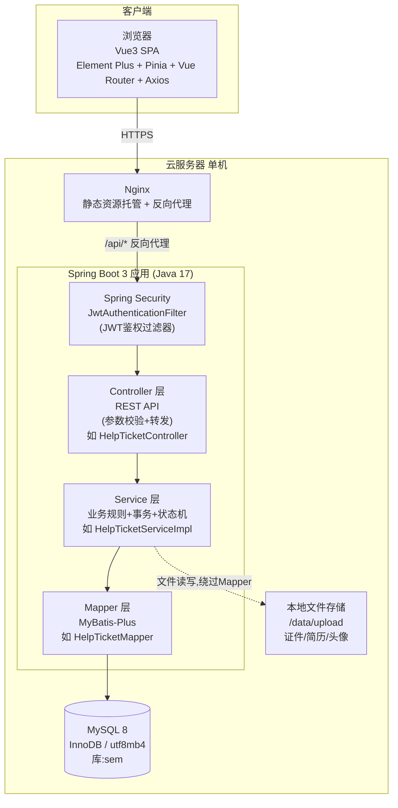
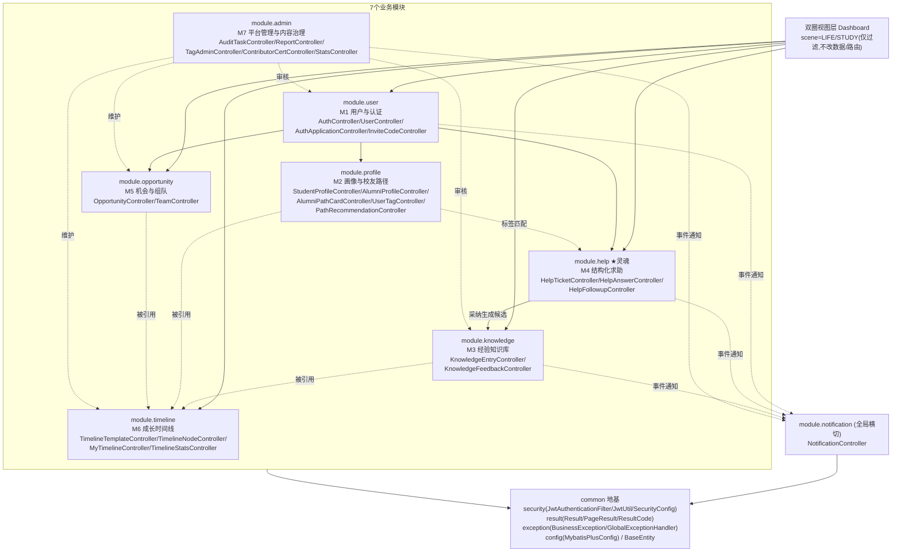
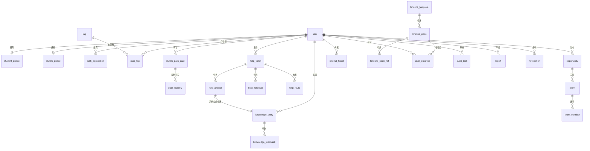
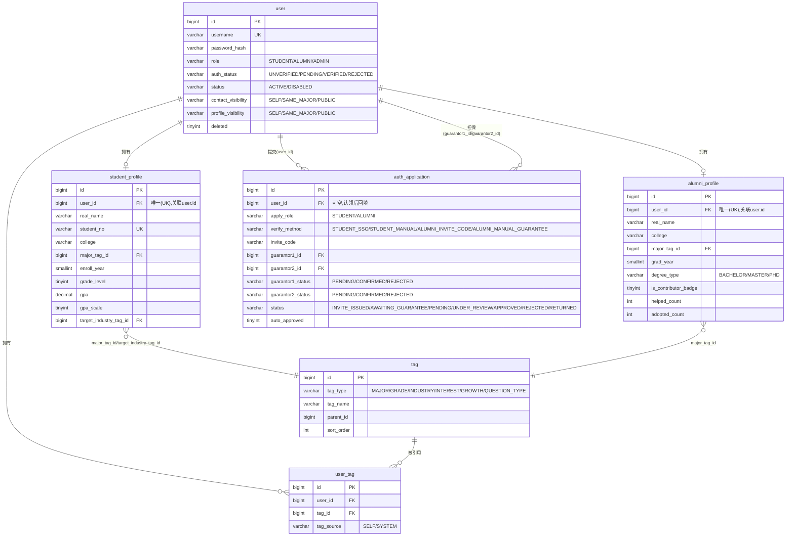
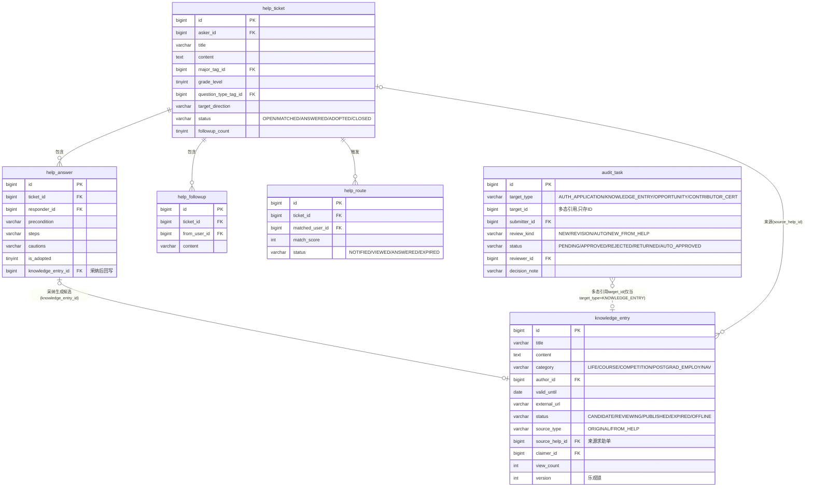
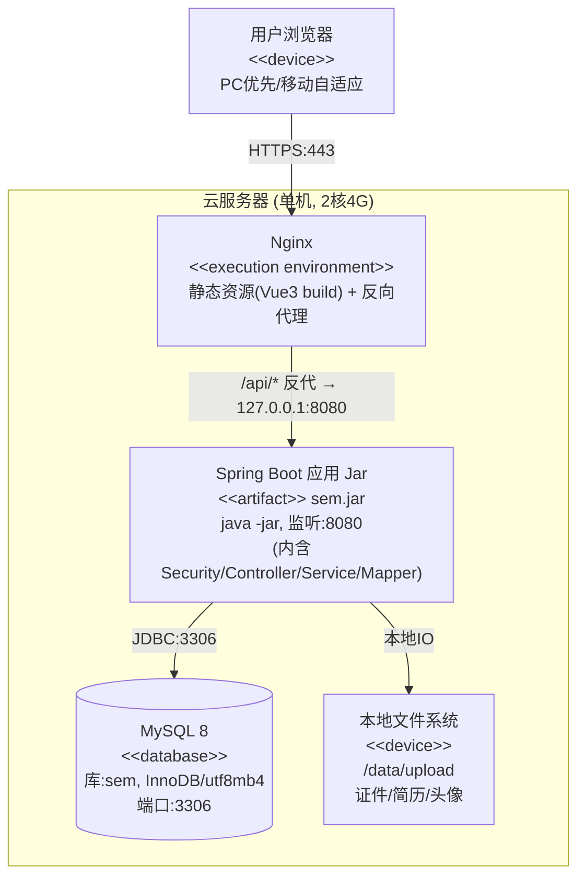

# C 概要设计：体系结构 / 模块结构 / E-R 图 / 部署图（图16-21）

> 数据来源：`docs/design/00_总体架构与技术设计.md`（技术选型/系统架构/全局数据模型/API规范）与 `backend/src/main/resources/schema.sql`（真实建表 DDL，v3.1）。类名、包名、表名、字段名、状态取值均取自上述两处真实文件，未编造。

---

### 图16 软件体系结构图

- **图类型**：软件结构图（分层体系结构图）
- **放报告**：第五章 §2.3
- **要画什么（元素清单）**：
  - 客户端层：浏览器（Vue 3 SPA，Element Plus + Pinia + Vue Router + Axios）
  - 网关/静态层：Nginx（静态资源托管 + `/api/*` 反向代理）
  - 应用层（Spring Boot 3 / Java 17 单体），自顶向下四段：
    - `Spring Security` 的 `JwtAuthenticationFilter`（JWT 鉴权过滤器，校验 `Authorization: Bearer <token>`）
    - `Controller` 层（REST API，仅做参数校验与转发，例：`HelpTicketController`、`KnowledgeEntryController`、`AuditTaskController`）
    - `Service` 层（业务规则 + 事务 + 状态机流转，例：`HelpTicketServiceImpl`、`KnowledgeEntryServiceImpl`）
    - `Mapper` 层（MyBatis-Plus，仅做数据存取，例：`HelpTicketMapper`）
  - 数据层：`MySQL 8`（InnoDB，utf8mb4，`sem` 库）
  - 旁路依赖：本地文件存储 `/data/upload`（证件/简历/头像，由 Service 层直接读写，不经 Mapper）
- **怎么画（结构描述）**：整体从上到下四层——客户端 → Nginx → Spring Boot 应用（内部再分四层：Security 过滤器 → Controller → Service → Mapper）→ MySQL；另外从 Service 层单独引一条侧向箭头指向"文件存储"，表示文件类操作绕过 Mapper 直接落盘。浏览器与 Nginx 之间标注 HTTPS；Nginx 与 Security 之间标注 `/api/*`；Controller/Service/Mapper 之间为严格单向依赖（不允许跨层反向调用，也不允许 Controller 直接调用其他模块的 Mapper）。
- **可渲染源码或画法**：

- **工具建议**：Mermaid（可直接渲染）；正式报告排版建议用 Visio/drawio 重绘一版加配色。

---

### 图17 软件模块结构图

- **图类型**：软件结构图（HIPO / 模块结构树）
- **放报告**：第五章 §2.4
- **要画什么（元素清单）**：
  - 根节点：SEM 系统（新疆大学校友圈与双圈成长导航平台）
  - 视图层（双圈，横切）：`Dashboard`（`scene=LIFE|STUDY` 切换，仅过滤首页聚合内容，不改变业务数据/路由结构）
  - 7 个业务模块包（对应后端 `com.xju.sem.module.*`），每个内部统一四段（controller/service/mapper/entity）：
    1. `user`（M1 用户与认证）：`AuthController`/`UserController`/`AuthApplicationController`/`InviteCodeController`
    2. `profile`（M2 画像与校友路径）：`StudentProfileController`/`AlumniProfileController`/`AlumniPathCardController`/`UserTagController`/`PathRecommendationController`/`MajorDestinationStatsController`
    3. `knowledge`（M3 经验知识库）：`KnowledgeEntryController`/`KnowledgeFeedbackController`
    4. `help`（M4 结构化求助★灵魂）：`HelpTicketController`/`HelpAnswerController`/`HelpFollowupController`
    5. `opportunity`（M5 机会与组队）：`OpportunityController`/`TeamController`
    6. `timeline`（M6 成长时间线）：`TimelineTemplateController`/`TimelineNodeController`/`MyTimelineController`/`TimelineStatsController`
    7. `admin`（M7 平台管理与内容治理）：`AuditTaskController`/`ReportController`/`TagAdminController`/`TagController`/`ContributorCertController`/`StatsController`
  - 全局横切模块：`notification`（`NotificationController`，被 help/knowledge/user 等模块事件触发）
  - common 地基包（`com.xju.sem.common`）：`security`（`JwtAuthenticationFilter`/`JwtUtil`/`SecurityConfig`/`LoginUser`/`AuthGuard`/`SecurityUtil`）、`result`（`Result`/`PageResult`/`ResultCode`）、`exception`（`BusinessException`/`GlobalExceptionHandler`）、`config`（`MybatisPlusConfig`/`MyMetaObjectHandler`）、`BaseEntity`（软删除/审计字段基类）
- **怎么画（结构描述）**：顶层画"双圈视图层"横跨全部业务模块（表示它只是过滤视角，不是独立数据层）；中层画 7 个业务模块并列（M1~M7），module 之间用虚线箭头按 00 文档§8依赖关系连（`M1→M2`、`M1→M4`、`M2⇢M4`标签"标签匹配"、`M4→M3`标签"采纳生成候选"、`M3⇢M6`、`M2⇢M6`、`M5⇢M6`、`M1→M5`、`M7⇢M3/M1/M5/M6`标签"审核/维护"）；notification 画在旁侧，被各业务模块以虚线"事件通知"指向；最底层画 common 地基，7 个业务模块 + notification 全部依赖 common（画一条汇总箭头"依赖"即可，不必逐一连线）。
- **可渲染源码或画法**：

- **工具建议**：Mermaid 渲染；若需 HIPO 层次图纸质感，用 Visio/PowerDesigner 的组织结构图模板重排。

---

### 图18 全局E-R图主干

- **图类型**：E-R 图（全局主干，25 实体核心关系）
- **放报告**：第五章 §5.1
- **要画什么（元素清单）**：25 张核心表（按 00 文档表#1-25）及其主外键关系：
  `user`、`student_profile`、`alumni_profile`、`auth_application`、`tag`、`user_tag`、`alumni_path_card`、`path_visibility`、`knowledge_entry`、`knowledge_feedback`、`help_ticket`、`help_answer`、`help_followup`、`help_route`、`opportunity`、`team`、`team_member`、`referral_ticket`、`timeline_template`、`timeline_node`、`timeline_node_ref`、`user_progress`、`audit_task`、`report`、`notification`。
- **怎么画（结构描述）**：以 `user` 为中心向外辐射：`user 1--0..1 student_profile`、`user 1--0..1 alumni_profile`（互斥的一对一档案）；`user 1--* auth_application`（提交认证）；`user 1--* user_tag *--1 tag`（多对多打标签，经关联表 user_tag）；`user 1--* alumni_path_card 1--* path_visibility`（路径卡→字段可见性配置）；`user 1--* knowledge_entry 1--* knowledge_feedback`（贡献知识→收到反馈）；`help_ticket 1--* help_answer`、`help_ticket 1--* help_followup`、`help_ticket 1--* help_route`、`help_answer 0..1--0..1 knowledge_entry`（采纳生成候选，虚线跨模块弱引用）；`user 1--* opportunity 1--* team 1--* team_member`；`timeline_template 1--* timeline_node`，`timeline_node 1--* timeline_node_ref`（只存ID，跨模块弱引用 ALUMNI_PATH_CARD/KNOWLEDGE_ENTRY/OPPORTUNITY），`timeline_node 1--* user_progress`；`user 1--* audit_task`（审核人）、`audit_task` 通过 `(target_type,target_id)` 弱引用 AUTH_APPLICATION/KNOWLEDGE_ENTRY/OPPORTUNITY/CONTRIBUTOR_CERT；`user 1--* report`（举报人，`target_type/target_id` 弱引用多类对象）；`user 1--* notification`（接收人）。
- **可渲染源码或画法**：

- **工具建议**：Mermaid（主干概览用）；细节字段版建议用 PowerDesigner/drawio 重绘物理 E-R 图（含字段类型），本图仅表达表间关系不列全字段。

---

### 图19 E-R分图-用户域

- **图类型**：E-R 图（分图，含关键属性）
- **放报告**：第五章 §5.2（用户域）
- **要画什么（元素清单）**：`user`、`student_profile`、`alumni_profile`、`auth_application`、`tag`、`user_tag` 六张表，属性取自 `schema.sql`：
  - `user`：`id(PK)`、`username(UK)`、`password_hash`、`role`(STUDENT/ALUMNI/ADMIN)、`auth_status`(UNVERIFIED/PENDING/VERIFIED/REJECTED)、`status`(ACTIVE/DISABLED)、`contact_visibility`、`profile_visibility`(均为 SELF/SAME_MAJOR/PUBLIC)、`deleted`、`created_at`、`updated_at`
  - `student_profile`：`id(PK)`、`user_id(UK,FK→user.id)`、`real_name`、`student_no(UK)`、`college`、`major_tag_id(FK→tag.id)`、`enroll_year`、`grade_level`、`gpa`、`gpa_scale`、`target_city`、`target_industry_tag_id(FK→tag.id)`、`bio`、`avatar_url`
  - `alumni_profile`：`id(PK)`、`user_id(UK,FK→user.id)`、`real_name`、`college`、`major_tag_id(FK→tag.id)`、`grad_year`、`degree_type`(BACHELOR/MASTER/PHD)、`is_contributor_badge`、`helped_count`、`adopted_count`、`honor_cert_url`
  - `auth_application`：`id(PK)`、`user_id(FK→user.id,可空)`、`apply_role`(STUDENT/ALUMNI)、`verify_method`(STUDENT_SSO/STUDENT_MANUAL/ALUMNI_INVITE_CODE/ALUMNI_MANUAL_GUARANTEE)、`real_name`、`student_no`、`major_text`、`college`、`evidence_url`、`invite_code`、`guarantor1_id(FK→user.id)`、`guarantor2_id(FK→user.id)`、`guarantor1_status`/`guarantor2_status`(PENDING/CONFIRMED/REJECTED)、`status`(INVITE_ISSUED/AWAITING_GUARANTEE/PENDING/UNDER_REVIEW/APPROVED/REJECTED/RETURNED)、`auto_approved`、`reject_reason`
  - `tag`：`id(PK)`、`tag_type`(MAJOR/GRADE/INDUSTRY/INTEREST/GROWTH/QUESTION_TYPE)、`tag_name`、`parent_id`、`sort_order`；唯一键 `(tag_type,tag_name,parent_id)`
  - `user_tag`：`id(PK)`、`user_id(FK→user.id)`、`tag_id(FK→tag.id)`、`tag_source`(SELF/SYSTEM)；唯一键 `(user_id,tag_id)`
- **怎么画（结构描述）**：`user` 居中；`user 1--0..1 student_profile`、`user 1--0..1 alumni_profile`（一对一，互斥）；`user 1--0..* auth_application`（认证申请，`guarantor1_id`/`guarantor2_id` 是 `auth_application` 指回 `user` 的另外两条弱引用线，标注"担保人"）；`student_profile.major_tag_id`/`target_industry_tag_id`、`alumni_profile.major_tag_id` 均指向 `tag`；`user`、`tag` 通过 `user_tag` 多对多关联（`user_tag` 画成关联实体，连接 user 与 tag 两端各一条 1--*）。
- **可渲染源码或画法**：

- **工具建议**：Mermaid（属性版 erDiagram 可直接渲染）；正式提交建议用 PowerDesigner 生成物理模型图并导出。

---

### 图20 E-R分图-内容域

- **图类型**：E-R 图（分图，含关键属性）
- **放报告**：第五章 §5.3（内容域：知识库 + 结构化求助 + 治理）
- **要画什么（元素清单）**：`knowledge_entry`、`help_ticket`、`help_answer`、`help_route`、`audit_task` 五张表，属性取自 `schema.sql`：
  - `knowledge_entry`：`id(PK)`、`title`、`content`、`category`(LIFE/COURSE/COMPETITION/POSTGRAD_EMPLOY/NAV)、`author_id(FK→user.id)`、`applicable_scope`、`valid_until`、`external_url`、`status`(CANDIDATE/REVIEWING/PUBLISHED/EXPIRED/OFFLINE)、`source_type`(ORIGINAL/FROM_HELP)、`source_help_id(FK→help_ticket.id)`、`claimer_id(FK→user.id)`、`view_count`、`version`(乐观锁)；`FULLTEXT ft_title_content`
  - `help_ticket`：`id(PK)`、`asker_id(FK→user.id)`、`title`、`content`、`major_tag_id(FK→tag.id)`、`grade_level`、`question_type_tag_id(FK→tag.id)`、`target_direction`、`status`(OPEN/MATCHED/ANSWERED/ADOPTED/CLOSED)、`followup_count`
  - `help_answer`：`id(PK)`、`ticket_id(FK→help_ticket.id)`、`responder_id(FK→user.id)`、`precondition`、`steps`、`cautions`、`is_adopted`、`knowledge_entry_id(FK→knowledge_entry.id，采纳后回写)`
  - `help_route`：`id(PK)`、`ticket_id(FK→help_ticket.id)`、`matched_user_id(FK→user.id)`、`match_score`、`status`(NOTIFIED/VIEWED/ANSWERED/EXPIRED)、`notified_at`；唯一键 `(ticket_id,matched_user_id)`
  - `audit_task`：`id(PK)`、`target_type`(AUTH_APPLICATION/KNOWLEDGE_ENTRY/OPPORTUNITY/CONTRIBUTOR_CERT)、`target_id`(弱引用,只存ID)、`submitter_id(FK→user.id)`、`review_kind`(NEW/REVISION/AUTO/NEW_FROM_HELP)、`status`(PENDING/APPROVED/REJECTED/RETURNED/AUTO_APPROVED)、`auto_precheck`、`reviewer_id(FK→user.id)`、`decision_note`、`decided_at`
  - 另画 `help_followup`（`id(PK)`、`ticket_id(FK)`、`from_user_id(FK→user.id)`、`content`）作为求助单的第三条分支，体现"链1"完整闭环。
- **怎么画（结构描述）**：`help_ticket` 居中；向下三条实线 1--*：`help_ticket→help_answer`、`help_ticket→help_followup`、`help_ticket→help_route`（`help_route.matched_user_id→user`另起一条虚线，因跨域引用 user 不在本分图展开，用注释框标注"引用用户域"）；`help_answer→knowledge_entry` 画成 0..1--0..1 虚线并标注"采纳后回写 knowledge_entry_id / 生成知识候选"；`knowledge_entry.source_help_id` 反向也指回 `help_ticket`（同一条链的另一端，用虚线双向或加说明"生成来源"）；`audit_task` 单独画在右侧，通过 `(target_type,target_id)` 以虚线分别指向 `knowledge_entry` 一个实体即可（因 target 是多态弱引用，箭头上标注"多态引用: AUTH_APPLICATION/KNOWLEDGE_ENTRY/OPPORTUNITY/CONTRIBUTOR_CERT，仅存ID不建物理FK"）。
- **可渲染源码或画法**：

- **工具建议**：Mermaid（属性版 erDiagram）；`audit_task` 的多态弱引用不建议用物理 FK 表达，报告文字需配一句"target_type+target_id 组合引用，不建外键约束，体现低耦合"。

---

### 图21 部署图

- **图类型**：部署图（UML Deployment Diagram，Mermaid 用 flowchart 近似表达节点+构件+通信路径）
- **放报告**：第五章 §2.2
- **要画什么（元素清单）**：单机部署，节点与构件如下（依据 00 文档 §1/§2 部署视图：一台 2 核 4G 云服务器）：
  - 物理/虚拟节点：`云服务器`（单台，2核4G）
  - 节点内构件：
    - `Nginx`：托管前端打包产物（Vue3 build 后的静态文件），并将 `/api` 请求反向代理到 `127.0.0.1:8080`
    - `Spring Boot 应用 Jar`：`java -jar sem.jar`，监听 `8080`，内含 Security/Controller/Service/Mapper 全部分层（单体部署，非拆分微服务）
    - `MySQL 8`：本机或独立实例，`sem` 库，InnoDB，utf8mb4
    - `本地文件系统 /data/upload`：证件、简历、头像等上传文件（演示期方案，未来可替换对象存储）
  - 外部节点：`用户浏览器`（PC优先/移动自适应，经公网 HTTPS 访问）
  - 通信路径与端口/协议标注：浏览器⇄Nginx（HTTPS,443）；Nginx⇄SpringBoot Jar（HTTP,反代到8080，路径`/api/*`）；SpringBoot Jar⇄MySQL（JDBC,3306）；SpringBoot Jar⇄本地文件系统（本地IO）
- **怎么画（结构描述）**：最外层画一个"云服务器"大节点框（`<<device>>` 构造型），框内并列放三个构件节点：Nginx、Spring Boot 应用 Jar、MySQL；再放一个"本地文件系统"存储图标（画在 Spring Boot Jar 旁，用直线连接标"本地IO"）；框外画"用户浏览器"节点，用一条带 `HTTPS` 标注的通信关联线连到 Nginx；Nginx 到 Spring Boot Jar 之间画一条带 `/api/* 反代→8080` 标注的线；Spring Boot Jar 到 MySQL 之间画一条带 `JDBC:3306` 标注的线。
- **可渲染源码或画法**：

- **工具建议**：正式部署图建议用 Visio/drawio 的 UML Deployment 模板（带 `<<device>>`/`<<artifact>>` 构造型图标）重绘；Mermaid 版本用于快速预览与文档内嵌。
