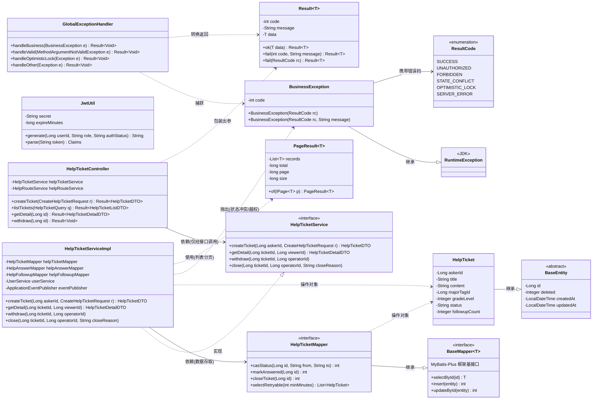

# D组 类图（图23-26）

> 数据来源：`backend/src/main/java/com/xju/sem/common/**`、`backend/src/main/java/com/xju/sem/module/{user,help,knowledge}/**` 真实源码（entity/service/service.impl/mapper/controller/event/enums）。类名、字段名、方法签名、依赖关系均取自上述真实文件，未编造；跨模块调用关系依据各 Service 接口 Javadoc 中标注的"跨模块契约方法"还原。

---

### 图23 全局分层类图

- **图类型**：类图
- **放报告**：第六章 §2.1（程序系统的结构）
- **要画什么（元素清单）**：
  - **common 基础设施类**（跨全部 7 个业务模块复用）：
    - `BaseEntity`（抽象基类，`common/BaseEntity.java`）：字段 `id`/`deleted`/`createdAt`/`updatedAt`
    - `Result<T>`（`common/result/Result.java`）：字段 `code`/`message`/`data`；静态工厂 `ok(data)`/`fail(code,message)`/`fail(ResultCode)`
    - `PageResult<T>`（`common/result/PageResult.java`）：字段 `records`/`total`/`page`/`size`；静态 `of(IPage<T>)`
    - `ResultCode`（枚举，`common/result/ResultCode.java`）：`SUCCESS`/`UNAUTHORIZED`/`FORBIDDEN`/`STATE_CONFLICT`/`OPTIMISTIC_LOCK`/`SERVER_ERROR` 等
    - `BusinessException`（`common/exception/BusinessException.java`）：继承 JDK `RuntimeException`，携带 `code`
    - `GlobalExceptionHandler`（`@RestControllerAdvice`）：把 `BusinessException`/校验异常/乐观锁异常统一转 `Result`
    - `JwtUtil`（`common/security/JwtUtil.java`）：`secret`/`expireMinutes`；`generate(userId,role,authStatus)`/`parse(token)`
    - `BaseMapper<T>`（MyBatis-Plus 框架接口，外部依赖，仅作继承落点）
  - **M4 求助域"Controller→Service→ServiceImpl→Entity→Mapper"典型一条链**（`module/help`）：
    - `HelpTicketController`：字段 `helpTicketService`/`helpRouteService`
    - `HelpTicketService`（接口）：`createTicket`/`getDetail`/`withdraw`/`close`
    - `HelpTicketServiceImpl`：字段 `helpTicketMapper`/`helpAnswerMapper`/`helpFollowupMapper`/`userService`/`eventPublisher`
    - `HelpTicket`（实体，继承 `BaseEntity`）：`askerId`/`title`/`content`/`majorTagId`/`status`/`followupCount`
    - `HelpTicketMapper`（接口，继承 `BaseMapper<HelpTicket>`）：`casStatus`/`markAnswered`/`closeTicket`/`selectRetryable`
- **怎么画（结构描述）**：画面左侧一列画 common 基础设施类（`BaseEntity`/`Result`/`PageResult`/`ResultCode`/`BusinessException`/`GlobalExceptionHandler`/`JwtUtil`/`BaseMapper<T>`，`JwtUtil` 单独置底，本图不与右侧链条连线，其真实调用方 `JwtAuthenticationFilter`/`SecurityConfig` 见图24）；右侧从上到下画典型一条链 `HelpTicketController → HelpTicketService`（虚线三角实现箭头由 `HelpTicketServiceImpl` 指向接口）`→ HelpTicketServiceImpl → HelpTicketMapper`，`HelpTicketMapper` 继承 `BaseMapper<HelpTicket>`；`HelpTicket` 单独画一个类框，用继承实箭头指向 `BaseEntity`，并从 `HelpTicketServiceImpl`/`HelpTicketMapper` 各拉一条依赖虚线指向 `HelpTicket`（表示两者都以它为操作对象，图中从简只保留 Mapper 泛型继承体现）；`BusinessException` 用继承实箭头指向 `RuntimeException`，并被 `HelpTicketServiceImpl` 以依赖虚线"抛出"指向、被 `GlobalExceptionHandler` 依赖虚线"捕获"指向；`GlobalExceptionHandler`/`HelpTicketController` 都以依赖虚线指向 `Result`（包装出参）。
- **可渲染源码或画法**：

- **工具建议**：Mermaid（可直接渲染）；正式报告排版建议用 Visio/drawio 重绘一版加配色区分 common 层与业务层。

---

### 图24 类图-认证域

- **图类型**：类图
- **放报告**：第六章 §2.2（程序系统的结构 · M1 用户与认证）
- **要画什么（元素清单）**（均取自 `module/user`）：
  - 实体：`User`（继承 `BaseEntity`：`username`/`passwordHash`/`role`/`authStatus`/`status`/`contactVisibility`/`profileVisibility`）；`AuthApplication`（继承 `BaseEntity`：`userId`/`applyRole`/`verifyMethod`/`realName`/`studentNo`/`majorText`/`inviteCode`/`guarantor1Id`/`guarantor2Id`/`guarantor1Status`/`guarantor2Status`/`status`/`autoApproved`/`rejectReason`）
  - 枚举：`Role`（`STUDENT`/`ALUMNI`/`ADMIN`，静态 `of(name)`）
  - Mapper：`UserMapper`、`AuthApplicationMapper`（均继承 `BaseMapper<T>`）
  - 服务接口与实现：`UserService`/`UserServiceImpl`（依赖 `UserMapper`/`StudentProfileMapper`/`AlumniProfileMapper`/`PasswordEncoder`/`MajorTagResolver`）；`AuthApplicationService`/`AuthApplicationServiceImpl`（依赖 `AuthApplicationMapper`/`UserMapper`/`SsoMockService`/`MajorTagResolver`/`InviteCodeAllocator`/`ApplicationEventPublisher`/`ObjectProvider<NotificationService>`）；`AuthTokenService`/`AuthTokenServiceImpl`（依赖 `UserMapper`/`PasswordEncoder`/`JwtUtil`/`RefreshTokenProvider`/`UserService`）
  - 事件：`AuthApplicationSubmittedEvent`（`appId`/`autoApproved`）
  - 安全基础设施：`JwtUtil`/`JwtAuthenticationFilter`/`LoginUser`/`SecurityConfig`
  - Controller：`AuthController`/`AuthApplicationController`/`UserController`
  - 跨模块契约：`NotificationService`（module.notification）
- **怎么画（结构描述）**：顶部画 `User`/`AuthApplication` 两个实体，均用继承实箭头指向 `BaseEntity`；两实体各自的 Mapper（`UserMapper`/`AuthApplicationMapper`）继承 `BaseMapper<T>` 并被对应 ServiceImpl 依赖。中层左列画认证账号链：`AuthController → AuthTokenService/UserService`；`AuthTokenServiceImpl` 依赖 `JwtUtil`（签发 token）与 `UserService`（登录后聚合档案），`UserServiceImpl` 依赖 `UserMapper` 并以依赖箭头指向 `Role`（`getRole` 返回类型）。中层右列画认证申请链：`AuthApplicationController → AuthApplicationService`（`AuthApplicationServiceImpl` 虚线实现），`AuthApplicationServiceImpl` 提交后依赖虚线指向 `AuthApplicationSubmittedEvent`（发布），并以跨模块依赖虚线指向 `NotificationService`。底部画安全过滤链：`SecurityConfig` 依赖箭头指向 `JwtAuthenticationFilter`（装配进过滤器链），`JwtAuthenticationFilter` 依赖 `JwtUtil`（解析 token）并依赖虚线构造 `LoginUser`。
- **可渲染源码或画法**：

```mermaid
classDiagram
  direction TB

  class BaseEntity {
    <<abstract>>
    -Long id
    -Integer deleted
    -LocalDateTime createdAt
    -LocalDateTime updatedAt
  }
  class BaseMapper~T~ {
    <<interface>>
  }
  class Role {
    <<enumeration>>
    STUDENT
    ALUMNI
    ADMIN
  }

  class User {
    -String username
    -String passwordHash
    -String role
    -String authStatus
    -String status
    -String contactVisibility
    -String profileVisibility
  }
  class AuthApplication {
    -Long userId
    -String applyRole
    -String verifyMethod
    -String realName
    -String studentNo
    -String majorText
    -String inviteCode
    -Long guarantor1Id
    -Long guarantor2Id
    -String guarantor1Status
    -String guarantor2Status
    -String status
    -Integer autoApproved
    -String rejectReason
  }

  class UserMapper {
    <<interface>>
  }
  class AuthApplicationMapper {
    <<interface>>
  }

  class UserService {
    <<interface>>
    +register(RegisterRequest r) UserDTO
    +getBrief(Long userId) UserBriefDTO
    +isVerified(Long userId) boolean
    +getRole(Long userId) Role
    +searchGuarantorCandidates(String major, String keyword) List~UserBriefDTO~
    +disableUser(Long userId, String reason)
  }
  class UserServiceImpl {
    -UserMapper userMapper
    -StudentProfileMapper studentProfileMapper
    -AlumniProfileMapper alumniProfileMapper
    -PasswordEncoder passwordEncoder
    -MajorTagResolver majorTagResolver
    +register(RegisterRequest r) UserDTO
    +getRole(Long userId) Role
    +searchGuarantorCandidates(String major, String keyword) List~UserBriefDTO~
  }

  class AuthApplicationService {
    <<interface>>
    +submit(Long userId, SubmitAuthApplicationRequest r) AuthApplicationDTO
    +withdraw(Long id, Long userId) AuthApplicationDTO
    +confirmGuarantee(Long id, Long guarantorUserId, boolean approve) AuthApplicationDTO
    +approve(Long appId, Long reviewerId)
    +reject(Long appId, Long reviewerId, String reason)
    +returnForSupplement(Long appId, Long reviewerId, String reason)
    +batchCreateInviteCodes(BatchInviteCodeRequest r) List~String~
  }
  class AuthApplicationServiceImpl {
    -AuthApplicationMapper authApplicationMapper
    -UserMapper userMapper
    -SsoMockService ssoMockService
    -MajorTagResolver majorTagResolver
    -InviteCodeAllocator inviteCodeAllocator
    -ApplicationEventPublisher eventPublisher
    -ObjectProvider~NotificationService~ notificationServiceProvider
    +submit(Long userId, SubmitAuthApplicationRequest r) AuthApplicationDTO
    +approve(Long appId, Long reviewerId)
    +reject(Long appId, Long reviewerId, String reason)
    +confirmGuarantee(Long id, Long guarantorUserId, boolean approve) AuthApplicationDTO
  }
  class AuthApplicationSubmittedEvent {
    -Long appId
    -boolean autoApproved
  }
  class NotificationService {
    <<interface>>
    module.notification 跨模块契约
  }

  class AuthTokenService {
    <<interface>>
    +login(String username, String password) LoginResponse
    +issueFor(Long userId, String role, String authStatus) TokenPair
    +refresh(String refreshToken) TokenPair
  }
  class AuthTokenServiceImpl {
    -UserMapper userMapper
    -PasswordEncoder passwordEncoder
    -JwtUtil jwtUtil
    -RefreshTokenProvider refreshTokenProvider
    -UserService userService
    +login(String username, String password) LoginResponse
    +refresh(String refreshToken) TokenPair
  }

  class JwtUtil {
    -String secret
    -long expireMinutes
    +generate(Long userId, String role, String authStatus) String
    +parse(String token) Claims
  }
  class JwtAuthenticationFilter {
    -JwtUtil jwtUtil
    +doFilterInternal(request, response, chain)
  }
  class LoginUser {
    -Long userId
    -String role
    -String authStatus
    +isVerified() boolean
    +isAdmin() boolean
  }
  class SecurityConfig {
    -JwtAuthenticationFilter jwtFilter
    +passwordEncoder() PasswordEncoder
    +filterChain(HttpSecurity http) SecurityFilterChain
  }

  class AuthController {
    -UserService userService
    -AuthTokenService authTokenService
    +register(RegisterRequest r) Result~RegisterResponse~
    +login(LoginRequest r) Result~LoginResponse~
    +refresh(RefreshRequest r) Result~TokenPair~
  }
  class AuthApplicationController {
    -AuthApplicationService authApplicationService
    +submit(SubmitAuthApplicationRequest r) Result~AuthApplicationDTO~
    +getById(Long id) Result~AuthApplicationDTO~
  }
  class UserController {
    -UserService userService
    +me() Result~UserDTO~
    +updateProfile(UpdateProfileRequest r) Result~Void~
  }

  User --|> BaseEntity : 继承
  AuthApplication --|> BaseEntity : 继承
  UserMapper --|> BaseMapper~User~ : 继承
  AuthApplicationMapper --|> BaseMapper~AuthApplication~ : 继承
  UserServiceImpl ..|> UserService : 实现
  AuthApplicationServiceImpl ..|> AuthApplicationService : 实现
  AuthTokenServiceImpl ..|> AuthTokenService : 实现
  UserServiceImpl --> UserMapper : 依赖
  UserServiceImpl ..> Role : 返回类型
  AuthApplicationServiceImpl --> AuthApplicationMapper : 依赖
  AuthApplicationServiceImpl --> UserMapper : 只读依赖(回写authStatus)
  AuthApplicationServiceImpl ..> AuthApplicationSubmittedEvent : 提交后发布
  AuthApplicationServiceImpl --> NotificationService : 跨模块依赖(通知)
  AuthTokenServiceImpl --> UserMapper : 依赖
  AuthTokenServiceImpl --> JwtUtil : 依赖(签发access token)
  AuthTokenServiceImpl --> UserService : 依赖(登录后聚合User+Profile)
  JwtAuthenticationFilter --> JwtUtil : 依赖(解析token)
  JwtAuthenticationFilter ..> LoginUser : 构造并放入SecurityContext
  SecurityConfig --> JwtAuthenticationFilter : 装配进过滤器链
  AuthController --> UserService : 依赖
  AuthController --> AuthTokenService : 依赖
  AuthApplicationController --> AuthApplicationService : 依赖
  UserController --> UserService : 依赖
```

- **工具建议**：Mermaid（可直接渲染）；正式报告排版建议用 Visio/PowerDesigner 重绘，安全基础设施部分可单独加框标注"横切关注点"。

---

### 图25 类图-求助域

- **图类型**：类图
- **放报告**：第六章 §2.3（程序系统的结构 · M4 结构化求助 ★系统灵魂）
- **要画什么（元素清单）**（均取自 `module/help`）：
  - 实体：`HelpTicket`（继承 `BaseEntity`：`askerId`/`title`/`content`/`majorTagId`/`gradeLevel`/`questionTypeTagId`/`targetDirection`/`status`/`followupCount`）；`HelpAnswer`（继承 `BaseEntity`：`ticketId`/`responderId`/`precondition`/`steps: List<String>`/`cautions`/`isAdopted`/`knowledgeEntryId`）；`HelpRoute`（**只实现 `Serializable`，不继承 `BaseEntity`**——表结构无 deleted/created_at/updated_at 列：`id`/`ticketId`/`matchedUserId`/`matchScore`/`status`/`notifiedAt`）
  - 枚举：`HelpTicketStatus`（`OPEN`/`MATCHED`/`ANSWERED`/`ADOPTED`/`CLOSED`）、`HelpRouteStatus`（`NOTIFIED`/`VIEWED`/`ANSWERED`/`EXPIRED`）
  - Mapper：`HelpTicketMapper`/`HelpAnswerMapper`/`HelpRouteMapper`（均继承 `BaseMapper<T>`）
  - 服务接口与实现：`HelpTicketService`/`HelpTicketServiceImpl`；`HelpAnswerService`/`HelpAnswerServiceImpl`；`HelpRouteService`/`HelpRouteServiceImpl`（路由 Service，★核心打分算法 §6.2 载体）
  - 采纳事件：`HelpTicketCreatedEvent`（`ticketId`）、`HelpAnswerAdoptedEvent`（`helpTicketId`/`helpAnswerId`/`authorId`）及其监听器 `HelpTicketCreatedListener`/`HelpAnswerAdoptedListener`
  - Controller：`HelpTicketController`/`HelpAnswerController`
  - 跨模块契约：`UserService`（M1，只读依赖档案）、`NotificationService`（M-通知）、`KnowledgeEntryService`（M3，采纳后生成知识候选）
- **怎么画（结构描述）**：顶部画三个实体：`HelpTicket`/`HelpAnswer` 均用继承实箭头指向 `BaseEntity`；`HelpRoute` 单独用实现虚箭头指向 `Serializable`（不连 `BaseEntity`，用备注标出"表结构精简，无审计列"）。三实体各自的 Mapper 继承 `BaseMapper<T>`。中层画三条 Service 链：`HelpTicketService/Impl`、`HelpAnswerService/Impl`、`HelpRouteService/Impl`，均以虚线三角"实现"箭头连回各自接口，并各自依赖箭头指向所需 Mapper；`HelpTicketServiceImpl`/`HelpAnswerServiceImpl`/`HelpRouteServiceImpl` 都以跨模块依赖虚线指向 `UserService`/`NotificationService`。底部画事件闭环：`HelpTicketServiceImpl` 创建后依赖虚线发布 `HelpTicketCreatedEvent`→`HelpTicketCreatedListener` 监听→依赖箭头触发 `HelpRouteService.routeHelpTicket`；`HelpAnswerServiceImpl.adopt` 采纳后依赖虚线发布 `HelpAnswerAdoptedEvent`→`HelpAnswerAdoptedListener` 监听→依赖箭头跨模块调用 `KnowledgeEntryService`（生成知识候选，闭环到 M3）。最上层画 `HelpTicketController`/`HelpAnswerController` 依赖各自 Service。
- **可渲染源码或画法**：

```mermaid
classDiagram
  direction TB

  class BaseEntity {
    <<abstract>>
    -Long id
    -Integer deleted
    -LocalDateTime createdAt
    -LocalDateTime updatedAt
  }
  class Serializable {
    <<interface>>
    JDK 标记接口
  }
  class BaseMapper~T~ {
    <<interface>>
  }
  class HelpTicketStatus {
    <<enumeration>>
    OPEN
    MATCHED
    ANSWERED
    ADOPTED
    CLOSED
  }
  class HelpRouteStatus {
    <<enumeration>>
    NOTIFIED
    VIEWED
    ANSWERED
    EXPIRED
  }

  class HelpTicket {
    -Long askerId
    -String title
    -String content
    -Long majorTagId
    -Integer gradeLevel
    -Long questionTypeTagId
    -String targetDirection
    -String status
    -Integer followupCount
  }
  class HelpAnswer {
    -Long ticketId
    -Long responderId
    -String precondition
    -List~String~ steps
    -String cautions
    -Integer isAdopted
    -Long knowledgeEntryId
  }
  class HelpRoute {
    -Long id
    -Long ticketId
    -Long matchedUserId
    -Integer matchScore
    -String status
    -LocalDateTime notifiedAt
  }

  class HelpTicketMapper {
    <<interface>>
    +casStatus(Long id, String from, String to) int
    +markAnswered(Long id) int
    +closeTicket(Long id) int
    +selectRetryable(int minMinutes) List~HelpTicket~
  }
  class HelpAnswerMapper {
    <<interface>>
    +countAdopted(Long responderId, Long questionTypeTagId) int
    +countByTicket(Long ticketId) int
  }
  class HelpRouteMapper {
    <<interface>>
    +selectVerifiedAlumniByMajor(Long majorTagId) List~CandidateRow~
    +selectVerifiedSeniorStudentsByMajor(Long majorTagId, Integer minGradeLevel) List~CandidateRow~
    +listMatchedUserIds(Long ticketId) List~Long~
    +markResponded(Long ticketId, Long userId) int
  }

  class HelpTicketService {
    <<interface>>
    +createTicket(Long askerId, CreateHelpTicketRequest r) HelpTicketDTO
    +getDetail(Long ticketId, Long viewerId) HelpTicketDetailDTO
    +withdraw(Long ticketId, Long operatorId)
    +close(Long ticketId, Long operatorId, String closeReason)
    +hideTicket(Long ticketId, Long adminOperatorId, String reason)
  }
  class HelpTicketServiceImpl {
    -HelpTicketMapper helpTicketMapper
    -HelpAnswerMapper helpAnswerMapper
    -HelpFollowupMapper helpFollowupMapper
    -UserService userService
    -ApplicationEventPublisher eventPublisher
    +createTicket(Long askerId, CreateHelpTicketRequest r) HelpTicketDTO
    +withdraw(Long ticketId, Long operatorId)
    +close(Long ticketId, Long operatorId, String closeReason)
  }

  class HelpAnswerService {
    <<interface>>
    +submitAnswer(Long ticketId, Long responderId, SubmitAnswerRequest r) HelpAnswerDTO
    +editAnswer(Long answerId, Long operatorId, SubmitAnswerRequest r) HelpAnswerDTO
    +adopt(Long ticketId, Long answerId, Long operatorId)
    +getForCandidate(Long answerId) AnswerContentDTO
    +countAdopted(Long responderId, Long questionTypeTagId) int
  }
  class HelpAnswerServiceImpl {
    -HelpAnswerMapper helpAnswerMapper
    -HelpTicketMapper helpTicketMapper
    -HelpRouteMapper helpRouteMapper
    -NotificationService notificationService
    -UserService userService
    -ApplicationEventPublisher eventPublisher
    +submitAnswer(Long ticketId, Long responderId, SubmitAnswerRequest r) HelpAnswerDTO
    +adopt(Long ticketId, Long answerId, Long operatorId)
  }

  class HelpRouteService {
    <<interface>>
    +routeHelpTicket(Long ticketId, List~Long~ excludeUserIds)
    +listRoutes(Long ticketId, Long viewerId) List~HelpRouteDTO~
  }
  class HelpRouteServiceImpl {
    -HelpRouteMapper helpRouteMapper
    -HelpTicketMapper helpTicketMapper
    -HelpAnswerMapper helpAnswerMapper
    -NotificationService notificationService
    -UserService userService
    +routeHelpTicket(Long ticketId, List~Long~ excludeUserIds)
    +listRoutes(Long ticketId, Long viewerId) List~HelpRouteDTO~
  }

  class HelpTicketCreatedEvent {
    -Long ticketId
  }
  class HelpAnswerAdoptedEvent {
    -Long helpTicketId
    -Long helpAnswerId
    -Long authorId
  }
  class HelpTicketCreatedListener {
    -HelpRouteService helpRouteService
    +onTicketCreated(HelpTicketCreatedEvent e)
  }
  class HelpAnswerAdoptedListener {
    -KnowledgeEntryService knowledgeEntryService
    -HelpAnswerMapper helpAnswerMapper
    -HelpTicketMapper helpTicketMapper
    -NotificationService notificationService
    +onAnswerAdopted(HelpAnswerAdoptedEvent e)
  }

  class HelpTicketController {
    -HelpTicketService helpTicketService
    -HelpRouteService helpRouteService
    +createTicket(CreateHelpTicketRequest r) Result~HelpTicketDTO~
    +getDetail(Long id) Result~HelpTicketDetailDTO~
    +withdraw(Long id) Result~Void~
  }
  class HelpAnswerController {
    -HelpAnswerService helpAnswerService
    +submitAnswer(Long ticketId, SubmitAnswerRequest r) Result~HelpAnswerDTO~
    +editAnswer(Long id, SubmitAnswerRequest r) Result~HelpAnswerDTO~
  }

  class UserService {
    <<interface>>
    module.user 跨模块契约
  }
  class NotificationService {
    <<interface>>
    module.notification 跨模块契约
  }
  class KnowledgeEntryService {
    <<interface>>
    module.knowledge 跨模块契约
    +createFromHelpAdoption(Long helpTicketId, Long helpAnswerId, Long authorId) Long
  }

  HelpTicket --|> BaseEntity : 继承
  HelpAnswer --|> BaseEntity : 继承
  HelpRoute ..|> Serializable : 实现(不继承BaseEntity,无deleted/审计列)
  HelpTicketMapper --|> BaseMapper~HelpTicket~ : 继承
  HelpAnswerMapper --|> BaseMapper~HelpAnswer~ : 继承
  HelpRouteMapper --|> BaseMapper~HelpRoute~ : 继承
  HelpTicketServiceImpl ..|> HelpTicketService : 实现
  HelpAnswerServiceImpl ..|> HelpAnswerService : 实现
  HelpRouteServiceImpl ..|> HelpRouteService : 实现
  HelpTicketServiceImpl --> HelpTicketMapper : 依赖
  HelpTicketServiceImpl --> UserService : 跨模块依赖(档案快照)
  HelpTicketServiceImpl ..> HelpTicketCreatedEvent : 创建后发布
  HelpAnswerServiceImpl --> HelpAnswerMapper : 依赖
  HelpAnswerServiceImpl --> HelpTicketMapper : 依赖(markAnswered/casStatus)
  HelpAnswerServiceImpl --> NotificationService : 跨模块依赖(通知求助人)
  HelpAnswerServiceImpl ..> HelpAnswerAdoptedEvent : 采纳后发布
  HelpRouteServiceImpl --> HelpRouteMapper : 依赖
  HelpRouteServiceImpl --> HelpAnswerMapper : 依赖(countAdopted打分)
  HelpRouteServiceImpl --> NotificationService : 跨模块依赖(HELP_MATCH通知)
  HelpTicketCreatedListener ..> HelpTicketCreatedEvent : 监听
  HelpTicketCreatedListener --> HelpRouteService : 触发路由匹配
  HelpAnswerAdoptedListener ..> HelpAnswerAdoptedEvent : 监听(AFTER_COMMIT)
  HelpAnswerAdoptedListener --> KnowledgeEntryService : 跨模块依赖(生成知识候选)
  HelpTicketController --> HelpTicketService : 依赖
  HelpTicketController --> HelpRouteService : 依赖
  HelpAnswerController --> HelpAnswerService : 依赖
```

- **工具建议**：Mermaid（可直接渲染）；正式报告排版建议用 Visio/drawio 重绘，事件闭环部分（`HelpTicketCreatedEvent`/`HelpAnswerAdoptedEvent` 及监听器）可加高亮色框强调"系统灵魂"闭环枢纽。

---

### 图26 类图-知识库域

- **图类型**：类图
- **放报告**：第六章 §2.4（程序系统的结构 · M3 经验知识库）
- **要画什么（元素清单）**（均取自 `module/knowledge`）：
  - 实体：`KnowledgeEntry`（继承 `BaseEntity`：`title`/`content`/`category`/`authorId`/`applicableScope`/`validUntil`/`externalUrl`/`status`/`sourceType`/`sourceHelpId`/`claimerId`/`viewCount`/`@Version version` 乐观锁）；`KnowledgeFeedback`（继承 `BaseEntity`：`entryId`/`userId`/`feedbackType`/`comment`）
  - 枚举：`KnowledgeEntryStatus`（`CANDIDATE`/`REVIEWING`/`PUBLISHED`/`EXPIRED`/`OFFLINE`）、`SourceType`（`ORIGINAL`/`FROM_HELP`）、`KnowledgeCategory`（`LIFE`/`COURSE`/`COMPETITION`/`POSTGRAD_EMPLOY`/`NAV`）、`FeedbackType`（`USEFUL`/`OUTDATED`/`NEED_UPDATE`）
  - Mapper：`KnowledgeEntryMapper`/`KnowledgeFeedbackMapper`（均继承 `BaseMapper<T>`）
  - **`KnowledgeEntryService` 状态机方法**（接口，跨模块契约方法签名不可变）：`create`/`createFromHelpAdoption`/`update`/`submitForReview`/`approve`/`returnToCandidate`/`claim`/`offline`/`delete`，及 `KnowledgeEntryServiceImpl`（依赖 `KnowledgeEntryMapper`/`ExternalLinkValidator`/`ApplicationEventPublisher`/`HelpAnswerService`/`NotificationService`）
  - `KnowledgeFeedbackService`/`KnowledgeFeedbackServiceImpl`（依赖 `KnowledgeFeedbackMapper`/`KnowledgeEntryMapper`）
  - 事件：`KnowledgeEntrySubmittedEvent`（`entryId`/`authorId`/`isRevision`）
  - 支撑类：`ExternalLinkValidator`（NAV 类目外链校验）、`KnowledgeEntryExpiryScheduler`（`@Scheduled` 到期扫描，依赖 `KnowledgeEntryMapper`/`NotificationService`）
  - Controller：`KnowledgeEntryController`/`KnowledgeFeedbackController`
  - 跨模块契约：`HelpAnswerService`（M4，采纳内容自读）、`NotificationService`
- **怎么画（结构描述）**：顶部画 `KnowledgeEntry`/`KnowledgeFeedback` 两实体，均用继承实箭头指向 `BaseEntity`；`KnowledgeEntry` 旁用依赖虚线分别指向 `KnowledgeEntryStatus`/`KnowledgeCategory`/`SourceType` 三个枚举（表示这三个字段的取值域），`KnowledgeFeedback` 依赖虚线指向 `FeedbackType`。两实体各自 Mapper 继承 `BaseMapper<T>`。中层画 `KnowledgeEntryService`（接口，突出状态机的 9 个方法尤其 `submitForReview/approve/returnToCandidate/offline/claim`）与 `KnowledgeEntryServiceImpl` 之间的实现虚线三角；`KnowledgeEntryServiceImpl` 依赖箭头指向 `KnowledgeEntryMapper`/`ExternalLinkValidator`，跨模块依赖虚线指向 `HelpAnswerService`（`createFromHelpAdoption` 内部自读回答正文）与 `NotificationService`；提交审核相关方法额外画一条依赖虚线指向 `KnowledgeEntrySubmittedEvent`（发布）。旁边画 `KnowledgeFeedbackService`/`KnowledgeFeedbackServiceImpl` 实现对，依赖 `KnowledgeFeedbackMapper` 与只读依赖 `KnowledgeEntryMapper`（校验条目存在）。底部画 `KnowledgeEntryExpiryScheduler` 依赖箭头指向 `KnowledgeEntryMapper`/`NotificationService`（定时任务，不经 Controller 触发）。最上层画 `KnowledgeEntryController`/`KnowledgeFeedbackController` 分别依赖对应 Service。
- **可渲染源码或画法**：

```mermaid
classDiagram
  direction TB

  class BaseEntity {
    <<abstract>>
    -Long id
    -Integer deleted
    -LocalDateTime createdAt
    -LocalDateTime updatedAt
  }
  class BaseMapper~T~ {
    <<interface>>
  }
  class KnowledgeEntryStatus {
    <<enumeration>>
    CANDIDATE
    REVIEWING
    PUBLISHED
    EXPIRED
    OFFLINE
  }
  class SourceType {
    <<enumeration>>
    ORIGINAL
    FROM_HELP
  }
  class KnowledgeCategory {
    <<enumeration>>
    LIFE
    COURSE
    COMPETITION
    POSTGRAD_EMPLOY
    NAV
  }
  class FeedbackType {
    <<enumeration>>
    USEFUL
    OUTDATED
    NEED_UPDATE
  }

  class KnowledgeEntry {
    -String title
    -String content
    -String category
    -Long authorId
    -String applicableScope
    -LocalDate validUntil
    -String externalUrl
    -String status
    -String sourceType
    -Long sourceHelpId
    -Long claimerId
    -Integer viewCount
    -Integer version
  }
  class KnowledgeFeedback {
    -Long entryId
    -Long userId
    -String feedbackType
    -String comment
  }

  class KnowledgeEntryMapper {
    <<interface>>
    +incrementViewCount(Long id) int
    +countBySourceHelpId(Long helpTicketId) int
    +fullTextSearch(page, keyword, category) IPage~KnowledgeEntry~
  }
  class KnowledgeFeedbackMapper {
    <<interface>>
    +countByType(Long entryId) List~FeedbackTypeCount~
  }

  class KnowledgeEntryService {
    <<interface>>
    +create(Long authorId, CreateKnowledgeEntryRequest r) KnowledgeEntryDTO
    +createFromHelpAdoption(Long helpTicketId, Long helpAnswerId, Long authorId) Long
    +update(Long id, Long userId, boolean isAdmin, UpdateKnowledgeEntryRequest r) KnowledgeEntryDTO
    +submitForReview(Long id, Long userId, boolean isAdmin) KnowledgeEntryDTO
    +approve(Long entryId, Long reviewerId)
    +returnToCandidate(Long entryId, Long reviewerId, String reason)
    +claim(Long id, Long userId) KnowledgeEntryDTO
    +offline(Long id, Long operatorId, boolean isAdmin, OfflineRequest r) KnowledgeEntryDTO
    +delete(Long id, Long operatorId, boolean isAdmin)
  }
  class KnowledgeEntryServiceImpl {
    -KnowledgeEntryMapper knowledgeEntryMapper
    -ExternalLinkValidator externalLinkValidator
    -ApplicationEventPublisher eventPublisher
    -HelpAnswerService helpAnswerService
    -NotificationService notificationService
    +create(Long authorId, CreateKnowledgeEntryRequest r) KnowledgeEntryDTO
    +createFromHelpAdoption(Long helpTicketId, Long helpAnswerId, Long authorId) Long
    +submitForReview(Long id, Long userId, boolean isAdmin) KnowledgeEntryDTO
    +approve(Long entryId, Long reviewerId)
    +returnToCandidate(Long entryId, Long reviewerId, String reason)
    +offline(Long id, Long operatorId, boolean isAdmin, OfflineRequest r) KnowledgeEntryDTO
  }
  class KnowledgeEntrySubmittedEvent {
    -Long entryId
    -Long authorId
    -boolean isRevision
  }

  class KnowledgeFeedbackService {
    <<interface>>
    +submitFeedback(Long entryId, Long userId, String feedbackType, String comment) KnowledgeFeedbackDTO
    +getSummary(Long entryId, Long viewerUserId) FeedbackSummaryDTO
  }
  class KnowledgeFeedbackServiceImpl {
    -KnowledgeFeedbackMapper feedbackMapper
    -KnowledgeEntryMapper entryMapper
    +submitFeedback(Long entryId, Long userId, String feedbackType, String comment) KnowledgeFeedbackDTO
    +getSummary(Long entryId, Long viewerUserId) FeedbackSummaryDTO
  }

  class ExternalLinkValidator {
    +validate(String category, String externalUrl)
  }
  class KnowledgeEntryExpiryScheduler {
    -KnowledgeEntryMapper knowledgeEntryMapper
    -NotificationService notificationService
    +expireOverdueEntries()
  }

  class KnowledgeEntryController {
    -KnowledgeEntryService knowledgeEntryService
    +list(String category) Result~PageResult~
    +search(String keyword, String category) Result~PageResult~
    +getById(Long id) Result~KnowledgeEntryDTO~
    +create(CreateKnowledgeEntryRequest r) Result~KnowledgeEntryDTO~
    +update(Long id, UpdateKnowledgeEntryRequest r) Result~KnowledgeEntryDTO~
  }
  class KnowledgeFeedbackController {
    -KnowledgeFeedbackService knowledgeFeedbackService
    +submit(Long id, SubmitFeedbackRequest r) Result~KnowledgeFeedbackDTO~
    +summary(Long id) Result~FeedbackSummaryDTO~
  }

  class HelpAnswerService {
    <<interface>>
    module.help 跨模块契约
    +getForCandidate(Long answerId) AnswerContentDTO
  }
  class NotificationService {
    <<interface>>
    module.notification 跨模块契约
  }

  KnowledgeEntry --|> BaseEntity : 继承
  KnowledgeFeedback --|> BaseEntity : 继承
  KnowledgeEntry ..> KnowledgeEntryStatus : status取值域
  KnowledgeEntry ..> KnowledgeCategory : category取值域
  KnowledgeEntry ..> SourceType : sourceType取值域
  KnowledgeFeedback ..> FeedbackType : feedbackType取值域
  KnowledgeEntryMapper --|> BaseMapper~KnowledgeEntry~ : 继承
  KnowledgeFeedbackMapper --|> BaseMapper~KnowledgeFeedback~ : 继承
  KnowledgeEntryServiceImpl ..|> KnowledgeEntryService : 实现
  KnowledgeFeedbackServiceImpl ..|> KnowledgeFeedbackService : 实现
  KnowledgeEntryServiceImpl --> KnowledgeEntryMapper : 依赖
  KnowledgeEntryServiceImpl --> ExternalLinkValidator : 依赖(NAV外链校验)
  KnowledgeEntryServiceImpl --> HelpAnswerService : 跨模块依赖(采纳内容自读)
  KnowledgeEntryServiceImpl --> NotificationService : 跨模块依赖
  KnowledgeEntryServiceImpl ..> KnowledgeEntrySubmittedEvent : 提交审核后发布
  KnowledgeFeedbackServiceImpl --> KnowledgeFeedbackMapper : 依赖
  KnowledgeFeedbackServiceImpl --> KnowledgeEntryMapper : 只读依赖(校验entry存在)
  KnowledgeEntryExpiryScheduler --> KnowledgeEntryMapper : 依赖(定时扫描到期)
  KnowledgeEntryExpiryScheduler --> NotificationService : 依赖(到期提醒)
  KnowledgeEntryController --> KnowledgeEntryService : 依赖
  KnowledgeFeedbackController --> KnowledgeFeedbackService : 依赖
```

- **工具建议**：Mermaid（可直接渲染）；正式报告排版建议配合图22（知识条目生命周期状态图，见 C/其他分组）对照阅读，`KnowledgeEntryService` 状态机方法可在正文用表格补充"方法→状态迁移"映射。
