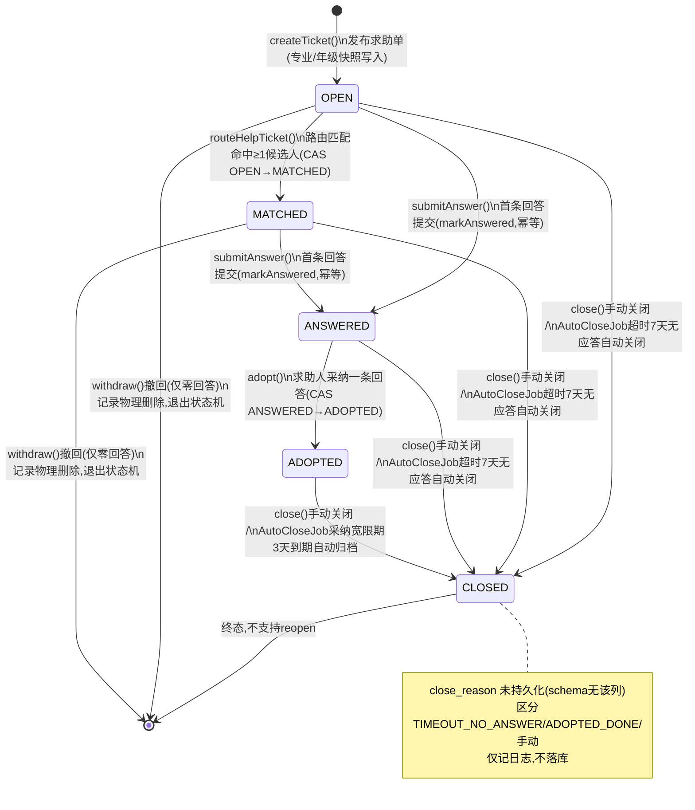
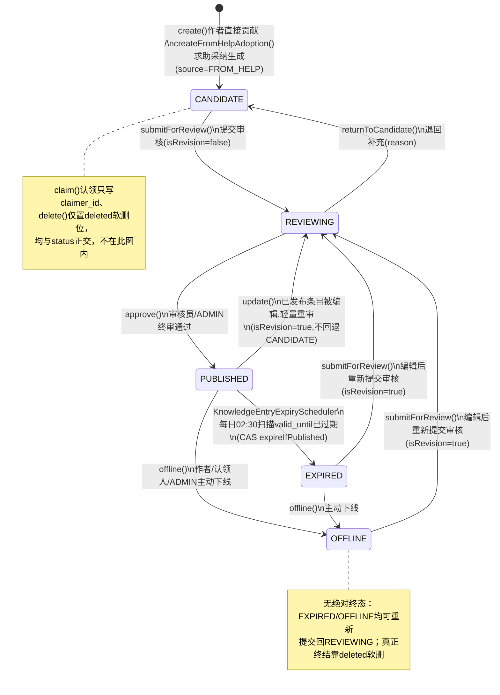
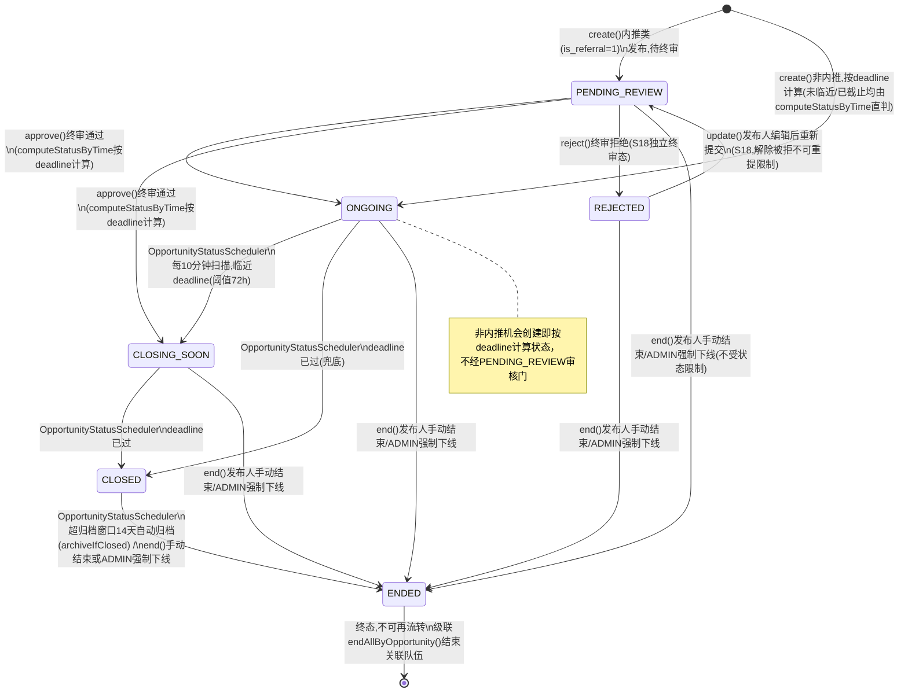
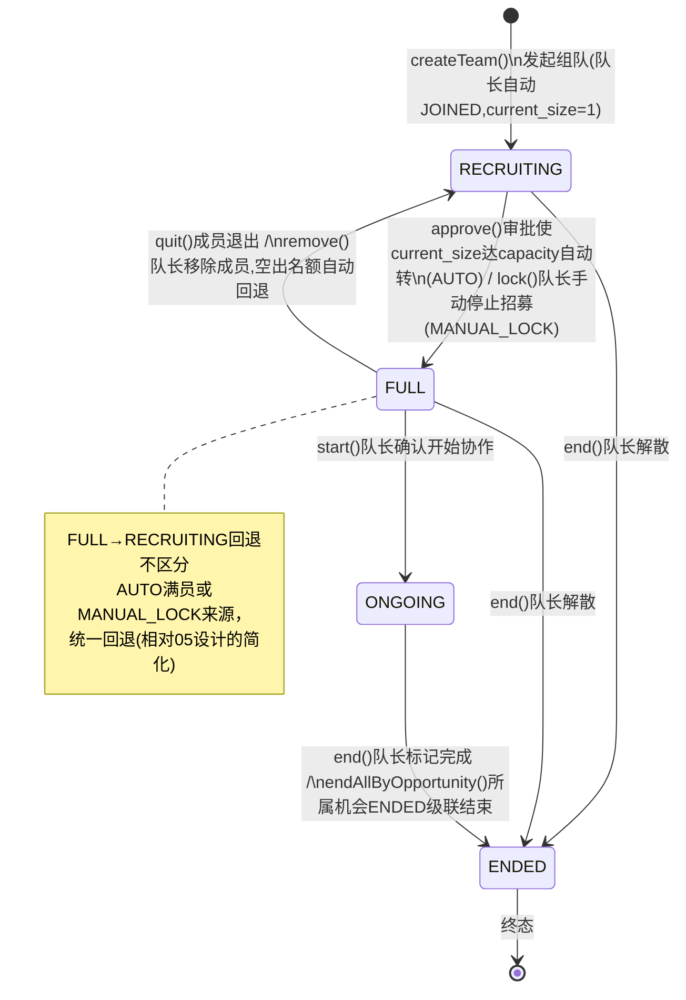
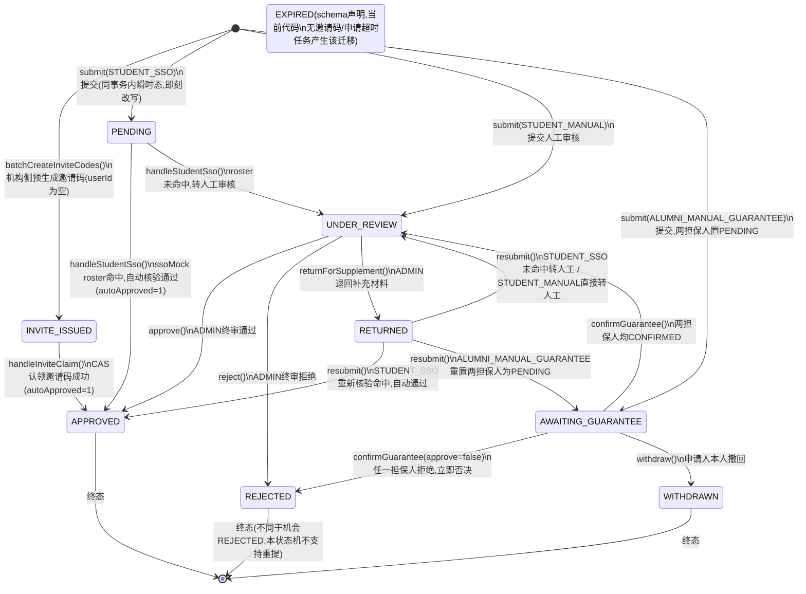
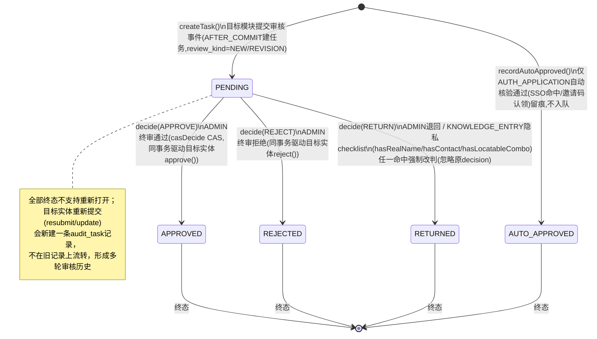

# E组 状态图（图27–图32）

> 数据来源：`backend/src/main/java/com/xju/sem/module/*/enums/*Status.java`（状态枚举取值与 javadoc 状态机注释）与对应 `service/impl/*ServiceImpl.java` / 定时任务类（真实迁移触发条件、CAS 前置态、级联动作）。状态名、方法名、CAS 前置/后置态、定时任务参数均取自上述真实代码，未编造；每张图末尾用 `note` 标注枚举里"声明但当前代码未触达"的取值，不假装其已实现。均放第六章 §详细设计（各图对应设计文档 `0X_MX_*_详细设计.md` §4 状态机小节，下文逐图标注）。

---

### 图27 求助单状态机 help_ticket

- **图类型**：状态图
- **放报告**：第六章 §详细设计（M4 结构化求助，对应 `04_M4_结构化求助_详细设计.md` §4）
- **要画什么（元素清单）**：
  - 状态：`OPEN`（初始，发布即置位）、`MATCHED`、`ANSWERED`、`ADOPTED`、`CLOSED`（终态，不支持 reopen）。
  - 触发/动作（均取自 `HelpTicketServiceImpl`/`HelpAnswerServiceImpl`/`HelpRouteServiceImpl`/`HelpTicketAutoCloseJob`）：
    - `createTicket()`：发布求助单，`status` 初值 `OPEN`，专业/年级从发布人档案只读快照写入。
    - `HelpRouteServiceImpl.routeHelpTicket()`：路由匹配（AFTER_COMMIT 异步）命中 ≥1 候选人 → CAS `OPEN→MATCHED`；已 `MATCHED` 时无副作用（幂等）。
    - `HelpAnswerServiceImpl.submitAnswer()`：首条回答到达 → `helpTicketMapper.markAnswered()`，`OPEN`/`MATCHED` → `ANSWERED`（幂等 CAS，已 `ANSWERED` 及以后不变）。
    - `HelpAnswerServiceImpl.adopt()`：求助人本人对某条回答执行采纳 → CAS `ANSWERED→ADOPTED`（仅此前置态允许，`is_adopted` 同事务写定，不支持更换已采纳回答）。
    - `HelpTicketServiceImpl.close(ticketId, operatorId, reason)`：求助人手动关闭，任意非 `CLOSED` 态 → `CLOSED`（`closeTicket()` SQL：`status<>'CLOSED'`）。
    - `HelpTicketAutoCloseJob`（每日 02:00 `@Scheduled`）：①超 7 天（`TIMEOUT_DAYS`）且从未采纳的 `OPEN`/`MATCHED`/`ANSWERED` 单按读到的原状态 CAS → `CLOSED`（超时无应答归档）；②`ADOPTED` 满 3 天（`ADOPTED_GRACE_DAYS`）宽限期 → CAS `ADOPTED→CLOSED`（采纳宽限期归档）。
    - `HelpTicketServiceImpl.withdraw(ticketId, operatorId)`：仅 `OPEN`/`MATCHED` 且零回答时允许，直接 `deleteById` 物理删除记录——**退出状态机而非流转到 `CLOSED`**。
- **怎么画（结构描述）**：初始伪状态 `[*]` 进入 `OPEN`；`OPEN --route命中≥1人--> MATCHED`；`OPEN`/`MATCHED` 各画一条 `--首条回答提交--> ANSWERED`；`ANSWERED --求助人采纳--> ADOPTED`；`OPEN`/`MATCHED`/`ANSWERED`/`ADOPTED` 四态各画一条汇入 `CLOSED`（分别标"手动关闭"或"超时/宽限期自动关闭"），`CLOSED` 再连到终止伪状态 `[*]`；另外从 `OPEN`、`MATCHED` 各引一条虚线直接到 `[*]`，标注"撤回（仅零回答）→ 记录物理删除"，用虚线/note 明确这不是常规状态迁移。
- **可渲染源码或画法**：

- **工具建议**：Mermaid（可直接渲染）；正式报告排版可用 Visio/PowerDesigner 状态图模板重绘。

---

### 图28 知识条目状态机 knowledge_entry

- **图类型**：状态图
- **放报告**：第六章 §详细设计（M3 经验知识库，对应 `03_M3_经验知识库_详细设计.md` §4）
- **要画什么（元素清单）**：
  - 状态：`CANDIDATE`（初始）、`REVIEWING`、`PUBLISHED`、`EXPIRED`、`OFFLINE`。**无绝对终态**——`EXPIRED`/`OFFLINE` 均可经编辑重新提交回 `REVIEWING`；真正的记录终结通过与 `status` 正交的 `deleted` 软删标记实现（`delete()`，不改变 `status` 值）。
  - 触发/动作（取自 `KnowledgeEntryServiceImpl`/`KnowledgeEntryExpiryScheduler`）：
    - `create()`：作者直接贡献，`status` 初值 `CANDIDATE`。
    - `createFromHelpAdoption()`：求助采纳（M4）自动生成候选，`status` 初值同样 `CANDIDATE`（`source=FROM_HELP`）。
    - `submitForReview(id)`：`CANDIDATE→REVIEWING`（`isRevision=false`）；`EXPIRED`/`OFFLINE→REVIEWING`（`isRevision=true`，编辑后重新提交）。
    - `approve(entryId, reviewerId)`：仅 `REVIEWING` 可调用，`REVIEWING→PUBLISHED`。
    - `returnToCandidate(entryId, reviewerId, reason)`：仅 `REVIEWING` 可调用，`REVIEWING→CANDIDATE`（退回补充）。
    - `update(id, ...)`：若原状态为 `PUBLISHED`（`wasPublished`），编辑后强制 `PUBLISHED→REVIEWING`（"修订视为轻量重审，不回退到 CANDIDATE 从头排队"），并发 `KnowledgeEntrySubmittedEvent(isRevision=true)`；若原状态为 `CANDIDATE` 则保持 `CANDIDATE`；若为 `EXPIRED`/`OFFLINE` 则保持不变（仍需调用 `submitForReview` 才进 `REVIEWING`）。
    - `offline(id, operatorId, isAdmin, request)`：作者/认领人/ADMIN 主动下线，`PUBLISHED`/`EXPIRED→OFFLINE`。
    - `KnowledgeEntryExpiryScheduler.scanExpiredEntries()`（每日 02:30 `@Scheduled`）：`valid_until` 已过期的 `PUBLISHED` 条目 CAS（`expireIfPublished`）→ `EXPIRED`，通知认领人/作者。
  - 正交操作（不改变 `status`，不画入状态机）：`claim(id, userId)` 仅写 `claimer_id`，`PUBLISHED`/`EXPIRED`/`OFFLINE` 下均可认领；`delete()` 仅置软删标记。
- **怎么画（结构描述）**：`[*] --> CANDIDATE`（标两个来源：作者贡献 / 求助采纳生成）；`CANDIDATE --提交审核--> REVIEWING`；`REVIEWING` 分叉两条：`--终审通过--> PUBLISHED`、`--退回--> CANDIDATE`（回边）；`PUBLISHED --发起修订(update时wasPublished)--> REVIEWING`（回边，形成 `REVIEWING⇄PUBLISHED` 之外的"编辑触发重审"环）；`PUBLISHED --valid_until到期(定时任务)--> EXPIRED`；`PUBLISHED`、`EXPIRED` 各画一条 `--offline()--> OFFLINE`；`EXPIRED`、`OFFLINE` 各画一条 `--编辑后submit()--> REVIEWING`（回边）；不画收敛到 `[*]` 的终止箭头，用 note 说明"无绝对终态，终结靠正交的 `deleted` 软删位"。
- **可渲染源码或画法**：

- **工具建议**：Mermaid 渲染；正式报告可用 Visio 重绘并高亮 `REVIEWING⇄PUBLISHED` 的编辑重审环。

---

### 图29 机会状态机 opportunity

- **图类型**：状态图
- **放报告**：第六章 §详细设计（M5 机会与组队，对应 `05_M5_机会与组队_详细设计.md` §4.1）
- **要画什么（元素清单）**：
  - 状态：`PENDING_REVIEW`、`ONGOING`、`CLOSING_SOON`、`CLOSED`、`ENDED`（终态）、`REJECTED`（S18 独立终审拒绝态，非终态，可编辑重提）。六态单字段合并表达"审核门"与"对外时间窗口"两层语义（`OpportunityStatus` javadoc）。
  - 触发/动作（取自 `OpportunityServiceImpl`/`OpportunityStatusScheduler`）：
    - `create()`：`is_referral=1`（内推类，仅认证校友发内推实习类或 ADMIN 代发）→ 初值 `PENDING_REVIEW`；否则**不经审核**，按 `computeStatusByTime(deadline)` 直接算出 `ONGOING`/`CLOSING_SOON`/`CLOSED` 之一。
    - `approve(id, reviewerId)`：仅 `PENDING_REVIEW` 可调用，CAS → `computeStatusByTime()` 结果（`ONGOING`/`CLOSING_SOON`）。
    - `reject(id, reviewerId, reason)`：仅 `PENDING_REVIEW` 可调用，CAS `PENDING_REVIEW→REJECTED`。
    - `update(id, ...)`：①`REJECTED` 态编辑提交，强制回 `PENDING_REVIEW` 重新终审（S18，解除"被拒不可重提"）；②非内推改为内推（`is_referral 0→1`）且当前不在 `PENDING_REVIEW`/`REJECTED`，强制回 `PENDING_REVIEW`（避免编辑绕过审核）；③其余情况按新 `deadline` 重算 `computeStatusByTime()`。
    - `OpportunityStatusScheduler.advanceStatus()`（每 10 分钟 `fixedRate`）：`ONGOING→CLOSING_SOON`（临近 deadline，阈值 `closingSoonHours=72h`）；`ONGOING`/`CLOSING_SOON→CLOSED`（deadline 已过，兜底）；`CLOSED→ENDED`（超归档窗口 `archiveDays=14` 天，CAS `archiveIfClosed`，级联 `teamService.endAllByOpportunity()`）。
    - `end(id, operatorId, isAdmin, reason)`：发布人手动结束，或 ADMIN 强制下线（不受状态限制，对 `ENDED` 幂等），任意非终态 → `ENDED`，级联结束关联队伍。
- **怎么画（结构描述）**：`[*]` 分两支：一支标"内推(is_referral=1)"进 `PENDING_REVIEW`，另一支标"非内推,按deadline直接计算"直接进 `ONGOING`/`CLOSING_SOON`/`CLOSED`（可合并画一个中间态标注三选一）；`PENDING_REVIEW --终审通过--> ONGOING/CLOSING_SOON`，`PENDING_REVIEW --终审拒绝--> REJECTED`，`REJECTED --编辑重新提交--> PENDING_REVIEW`（回边，S18）；`ONGOING --定时:临近deadline--> CLOSING_SOON --定时:deadline已过--> CLOSED`，`ONGOING --定时:deadline已过(兜底)--> CLOSED`；`CLOSED --定时:超归档窗口 或 手动/强制下线--> ENDED`；从 `PENDING_REVIEW`/`REJECTED`/`ONGOING`/`CLOSING_SOON` 各引一条 `--end()手动结束/强制下线--> ENDED`；`ENDED --> [*]` 终态。
- **可渲染源码或画法**：

- **工具建议**：Mermaid 渲染；正式报告建议 Visio 重绘并把"内推 vs 非内推"两条创建分支用不同颜色区分。

---

### 图30 队伍状态机 team

- **图类型**：状态图
- **放报告**：第六章 §详细设计（M5 机会与组队，对应 `05_M5_机会与组队_详细设计.md` §4.2）
- **要画什么（元素清单）**：
  - 状态：`RECRUITING`（初始）、`FULL`、`ONGOING`、`ENDED`（终态）。
  - 触发/动作（取自 `TeamServiceImpl`/`TeamMemberServiceImpl`）：
    - `createTeam(opportunityId, leaderId, request)`：发起组队，`status` 初值 `RECRUITING`，队长自动写入 `team_member`（`JOINED`），`current_size=1`。
    - `TeamMemberServiceImpl.approve(teamId, userId, operatorId)`：队长审批加入申请，`current_size` 原子自增（`incrementIfBelowCapacity`）；若审批后 `current_size>=capacity`，CAS `RECRUITING→FULL`（`full_reason=AUTO`，仅日志留痕）。
    - `TeamServiceImpl.lock(id, operatorId)`：队长手动停止招募，CAS `RECRUITING→FULL`（`full_reason=MANUAL_LOCK`）。
    - `TeamServiceImpl.start(id, operatorId)`：队长确认开始协作，CAS `FULL→ONGOING`。
    - `TeamMemberServiceImpl.quit(teamId, userId)` / `remove(teamId, userId, operatorId)`：成员退出/被移除，`current_size` 原子递减后尝试 CAS `FULL→RECRUITING`（空出名额即回退，schema 无 `full_reason` 列区分自动满员/手动锁定，本期统一回退，相对 05 详细设计"仅 AUTO 才回退"的简化）。
    - `TeamServiceImpl.end(id, operatorId, reason)`：队长标记完成/解散，任意非 `ENDED` 态 CAS → `ENDED`。
    - `TeamServiceImpl.endAllByOpportunity(opportunityId, reason)`：所属机会 `ENDED` 级联（`OpportunityStatusScheduler`/`OpportunityServiceImpl.end()` 触发），`RECRUITING`/`FULL`/`ONGOING` 三态队伍批量 CAS → `ENDED`。
- **怎么画（结构描述）**：`[*] --> RECRUITING`；`RECRUITING --审批满员(自动)/队长手动停止招募--> FULL`；`FULL --队长确认开始协作--> ONGOING`；`FULL --成员退出/被移除空出名额--> RECRUITING`（回边，虚线标注"隐式回退，无 full_reason 列区分来源"）；`RECRUITING`、`FULL` 各画一条 `--队长解散--> ENDED`；`ONGOING --队长标记完成/所属机会ENDED级联--> ENDED`；`ENDED --> [*]` 终态。
- **可渲染源码或画法**：

- **工具建议**：Mermaid 渲染；正式报告可用 drawio 重绘并把"级联结束"用跨图虚线连到图29 机会状态图的 `ENDED`。

---

### 图31 认证申请状态机 auth_application

- **图类型**：状态图
- **放报告**：第六章 §详细设计（M1 用户与认证，对应 `01_M1_用户与认证_详细设计.md` §4）
- **要画什么（元素清单）**：
  - 状态：`INVITE_ISSUED`（邀请码预生成初态）、`PENDING`（STUDENT_SSO 提交瞬时态）、`AWAITING_GUARANTEE`（双人担保等待态）、`UNDER_REVIEW`、`RETURNED`、`APPROVED`（终态）、`REJECTED`（终态）、`WITHDRAWN`（终态）、`EXPIRED`（schema 声明但当前代码未产生该迁移）。
  - 四条分级认证路径（`verify_method`）各自的初态（取自 `AuthApplicationServiceImpl.submit()`）：
    - `STUDENT_SSO`（`handleStudentSso`）：插入即 `status=PENDING`；同一事务内立即按 `ssoMockService.verify()` 结果二选一改写——命中 → `APPROVED`（`autoApproved=1`）；未命中 → `UNDER_REVIEW`。**`PENDING` 未提交前即被覆盖，外部事务不可见该中间值**。
    - `STUDENT_MANUAL`（`handleStudentManual`）：插入即 `status=UNDER_REVIEW`。
    - `ALUMNI_INVITE_CODE`（`handleInviteClaim`）：CAS 认领——`UPDATE ... WHERE invite_code=? AND status=INVITE_ISSUED` 成功即 `status=APPROVED`（`autoApproved=1`），跳过人工审核。
    - `ALUMNI_MANUAL_GUARANTEE`（`handleGuarantee`）：插入即 `status=AWAITING_GUARANTEE`，`guarantor1_status`/`guarantor2_status` 均置 `PENDING`。
  - 后续流转（取自 `AuthApplicationServiceImpl.confirmGuarantee()`/`withdraw()`/`resubmit()`/`approve()`/`reject()`/`returnForSupplement()`）：
    - `confirmGuarantee(id, guarantorUserId, approve=true)`：单个担保人 CAS 自身状态 `PENDING→CONFIRMED`；**两人均 `CONFIRMED`** 才整单 CAS `AWAITING_GUARANTEE→UNDER_REVIEW`，否则仅记录半确认、状态不变。
    - `confirmGuarantee(..., approve=false)`：任一担保人拒绝即刻否决——该担保人 CAS `PENDING→REJECTED`，整单 CAS `AWAITING_GUARANTEE→REJECTED`，申请人 `auth_status` 同步置 `REJECTED`。
    - `withdraw(id, userId)`：仅 `PENDING`/`AWAITING_GUARANTEE` 允许，CAS → `WITHDRAWN`。
    - `approve(appId, reviewerId)`：仅 `UNDER_REVIEW` 可调用（M7 终审），CAS → `APPROVED`。
    - `reject(appId, reviewerId, reason)`：仅 `UNDER_REVIEW` 可调用，CAS → `REJECTED`。
    - `returnForSupplement(appId, reviewerId, reason)`：仅 `UNDER_REVIEW` 可调用，CAS → `RETURNED`。
    - `resubmit(id, userId, req)`：仅 `RETURNED` 可调用，按 `verify_method` 分支——`STUDENT_SSO` 重新核验命中→`APPROVED`，未命中→`UNDER_REVIEW`；`STUDENT_MANUAL`→直接 `UNDER_REVIEW`；`ALUMNI_MANUAL_GUARANTEE`→重置两担保人状态为 `PENDING` 后回到 `AWAITING_GUARANTEE`；`ALUMNI_INVITE_CODE` 不支持重新提交（该路径永不进入 `RETURNED`）。
- **怎么画（结构描述）**：四个初始伪状态分支分别指向 `INVITE_ISSUED`、`PENDING`、`UNDER_REVIEW`、`AWAITING_GUARANTEE`；`PENDING` 引两条出边到 `APPROVED`（SSO 命中）与 `UNDER_REVIEW`（未命中）；`INVITE_ISSUED --CAS认领成功--> APPROVED`；`AWAITING_GUARANTEE` 引两条出边——`--两人均CONFIRMED--> UNDER_REVIEW`、`--任一担保人REJECTED--> REJECTED`；`AWAITING_GUARANTEE --withdraw()--> WITHDRAWN`；`UNDER_REVIEW` 引三条出边——`--approve()--> APPROVED`、`--reject()--> REJECTED`、`--returnForSupplement()--> RETURNED`；`RETURNED` 引三条回边——`--resubmit(SSO命中)--> APPROVED`、`--resubmit(SSO未命中/MANUAL)--> UNDER_REVIEW`、`--resubmit(GUARANTEE,重置担保人)--> AWAITING_GUARANTEE`；`APPROVED`/`REJECTED`/`WITHDRAWN` 各连一条到终止伪状态 `[*]`；`EXPIRED` 单独画一个悬空状态节点并用 note 标注"声明未触达"。
- **可渲染源码或画法**：

- **工具建议**：Mermaid 渲染；正式报告建议 Visio 重绘并把"双担保 CONFIRMED 汇合"用菱形判定框强调（两路径均需 CONFIRMED 才汇入 `UNDER_REVIEW`）。

---

### 图32 审核任务状态机 audit_task

- **图类型**：状态图
- **放报告**：第六章 §详细设计（M7 平台管理与内容治理，对应 `07_M7_平台管理与内容治理_详细设计.md` §4）
- **要画什么（元素清单）**：
  - 状态：`PENDING`（人工队列初态）、`AUTO_APPROVED`（自动初审通过留痕，仅 `AUTH_APPLICATION` 使用，不进入人工队列）、`APPROVED`、`REJECTED`、`RETURNED`（三者均为终态）。
  - 触发/动作（取自 `AuditTaskServiceImpl`/`AuditTaskEventListener`）：
    - `AuditTaskEventListener`（`@TransactionalEventListener(phase=AFTER_COMMIT)`）监听目标模块提交审核事件：
      - `onAuthApplicationSubmitted`：若 `event.isAutoApproved()`（SSO 命中/邀请码认领）→ `recordAutoApproved()` 建 `AUTO_APPROVED` 任务（`review_kind=AUTO`），不入队；否则 `createTask()` 建 `PENDING` 任务（`review_kind=NEW`）。
      - `onKnowledgeEntrySubmitted`：`createTask()` 建 `PENDING` 任务（`review_kind=NEW`/`REVISION` 按 `isRevision` 区分），随即同步跑 `runPreCheck()` 写回自动预检结果（`auto_precheck` 列）。
      - `onOpportunitySubmitted`：`createTask()` 建 `PENDING` 任务（`review_kind=NEW`，`target_type=OPPORTUNITY`）。
    - `AuditTaskServiceImpl.decide(id, reviewerId, decision, checklistResult, reasonCode, comment)`：仅 `PENDING` 可调用；若 `target_type=KNOWLEDGE_ENTRY` 且隐私 `checklist`（`hasRealName`/`hasContact`/`hasLocatableCombo`）任一命中，**强制改判为 `RETURN`**（忽略 ADMIN 实际传入的 `decision`，即使误选"通过"也拦截）；否则按 `decision` 走：`APPROVE→APPROVED`、`REJECT→REJECTED`、`RETURN→RETURNED`（`AuditDecision.toStatus()` 映射），`casDecide()` CAS 前置态 `PENDING`；同一物理事务内调用对应 `AuditTargetHandler.handle()` 驱动目标实体（`AuthApplicationService.approve/reject/returnForSupplement`、`KnowledgeEntryService.approve/returnToCandidate` 等）同步流转，任一环节失败整体回滚。
    - `batchDecide()`：逐条经 `self.decide()` 各自独立事务提交，单条失败不影响其余（非状态机本身的迁移，只是调用方式）。
  - 全部终态不支持"重新打开"；目标实体重新提交（如认证申请 `resubmit()`、知识条目 `update()` 触发的 `REVIEWING`）会产生**新的一条** `audit_task` 记录，天然形成多轮审核历史留痕（不在旧记录上流转）。
- **怎么画（结构描述）**：两个初始伪状态分支——`[*] --目标模块提交审核事件(非自动核验)--> PENDING`、`[*] --AUTH_APPLICATION自动核验通过(SSO/邀请码)--> AUTO_APPROVED`；`PENDING` 引三条出边——`--decide(APPROVE)--> APPROVED`、`--decide(REJECT)--> REJECTED`、`--decide(RETURN)或KNOWLEDGE_ENTRY隐私checklist命中强制改判--> RETURNED`；`APPROVED`/`REJECTED`/`RETURNED`/`AUTO_APPROVED` 各连一条到终止伪状态 `[*]`，并用 note 注明"目标实体重新提交会新建一条任务，不在本条记录上重开"。
- **可渲染源码或画法**：

- **工具建议**：Mermaid 渲染；正式报告可用 PowerDesigner 状态图模板重绘，并把"KNOWLEDGE_ENTRY隐私checklist强制改判"用带感叹号的判定分支高亮。
