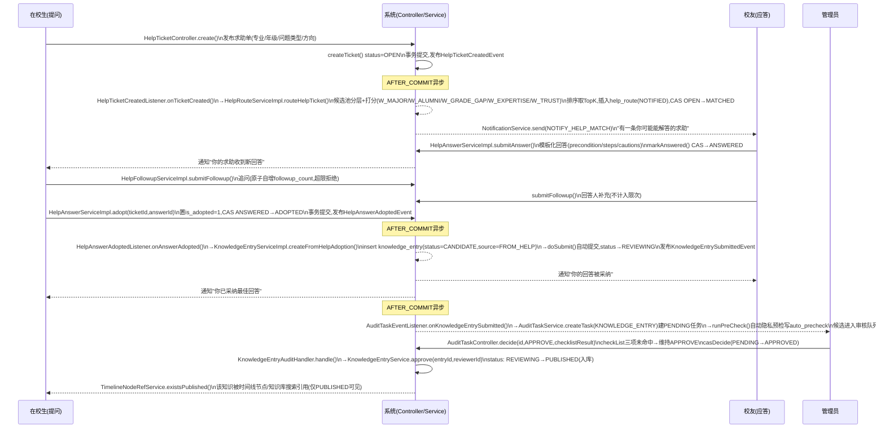
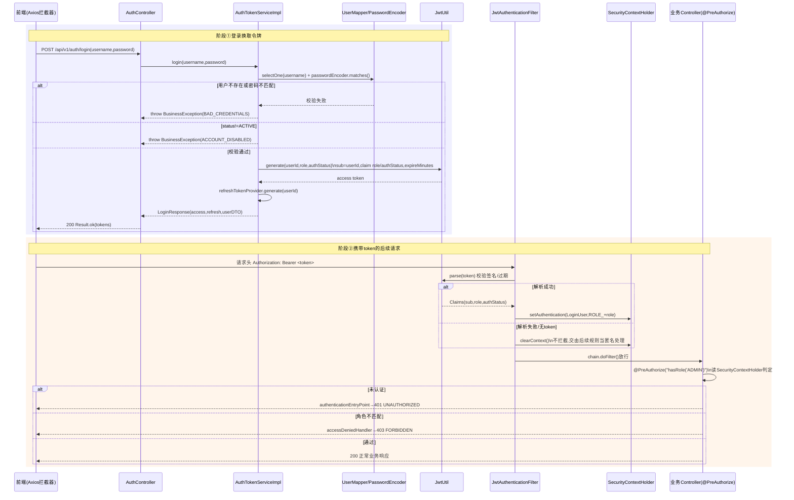
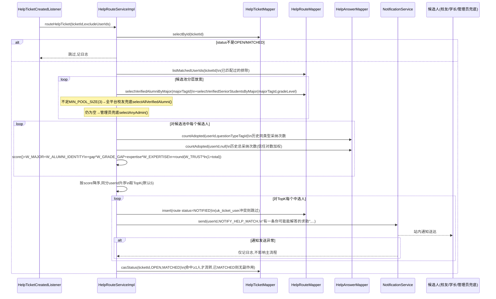
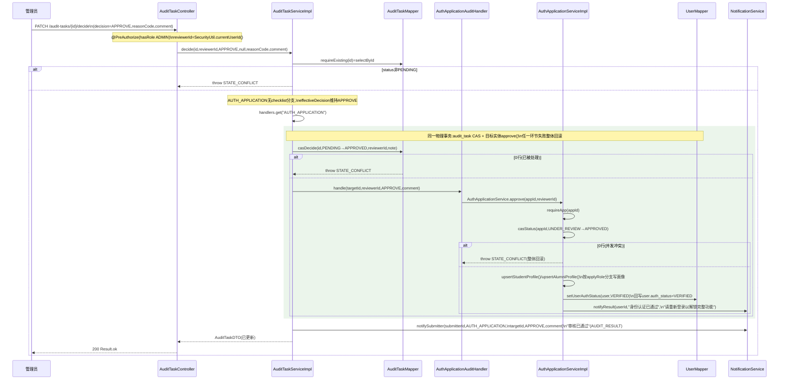

# F组 时序图/活动图/程序流程图（图33–图40）

> 数据来源：`docs/design/00_总体架构与技术设计.md` §7（核心闭环端到端时序）与 `backend/src/main/java/com/xju/sem/module/{help,user,admin,knowledge,timeline,notification,opportunity}` 下真实 Controller/Service/ServiceImpl/Listener 源码（方法名、CAS 前置态、事件监听 phase、打分权重常量、优先级公式均取自代码与 javadoc，未编造）。每张图末尾用 note/说明标出"设计简化点"（如异步 AFTER_COMMIT 语义、批量简化），不假装全同步实现。

---

### 图33 核心闭环端到端时序

- **图类型**：时序图
- **放报告**：第六章 §核心闭环设计（对应 `00_总体架构与技术设计.md` §7"核心闭环端到端时序"，落地方法级细化于 `04_M4_结构化求助_详细设计.md` §6.2/§6.4、`03_M3_经验知识库_详细设计.md` §6.3、`07_M7_平台管理与内容治理_详细设计.md` §6.1）
- **要画什么（元素清单）**：
  - 参与者/生命线：`在校生(提问)`、`系统前端/Controller层`、`HelpTicketService`、`HelpRouteService`、`NotificationService`、`校友(应答)`、`HelpAnswerService`、`HelpAnswerAdoptedListener`、`KnowledgeEntryService`、`AuditTaskEventListener`、`AuditTaskService`、`管理员`、`AuditTaskController`、`TimelineNodeRefService`。
  - 关键真实方法（逐段对应源码）：
    1. 发布：`HelpTicketController.create` → `HelpTicketServiceImpl.createTicket()`，`status` 初值 `OPEN`，事务提交后发布 `HelpTicketCreatedEvent`。
    2. 路由匹配：`HelpTicketCreatedListener.onTicketCreated`（`@TransactionalEventListener(AFTER_COMMIT)`）→ `HelpRouteServiceImpl.routeHelpTicket(ticketId, excludeUserIds)`——候选池分层构建（同专业校友/高年级学长→全平台校友兜底→管理员兜底）、逐候选打分（`W_MAJOR=40`/`W_ALUMNI_IDENTITY=15`/`W_GRADE_GAP`/`W_EXPERTISE`/`W_TRUST`）、排序取 TopK（默认 `topK=5`）、`helpRouteMapper.insert(route status=NOTIFIED)`、命中≥1人 CAS `OPEN→MATCHED`。
    3. 通知：`notificationService.send(userId, NOTIFY_HELP_MATCH, "有一条你可能能解答的求助", content, REF_HELP_TICKET, ticketId)`。
    4. 回答：`HelpAnswerController.submit` → `HelpAnswerServiceImpl.submitAnswer()`——校验不可答自己的单、去重、`helpTicketMapper.markAnswered()`（CAS→`ANSWERED`）、通知求助人。
    5. 追问：`HelpFollowupController` → `HelpFollowupServiceImpl.submitFollowup()`——原子自增 `followup_count`，达上限（`LIMIT_EXCEEDED`）则拒绝，回答人补充不计入限次。
    6. 采纳：`HelpAnswerController.adopt` → `HelpAnswerServiceImpl.adopt()`——置 `is_adopted=1` + CAS `ANSWERED→ADOPTED`，事务提交后发布 `HelpAnswerAdoptedEvent`。
    7. 生成候选：`HelpAnswerAdoptedListener.onAnswerAdopted`（`AFTER_COMMIT`）→ `KnowledgeEntryServiceImpl.createFromHelpAdoption(ticketId, answerId, authorId)`——插入 `knowledge_entry`（`status=CANDIDATE`，`source=FROM_HELP`，`source_help_id=ticketId`）后立即 `doSubmit()` 自动转 `REVIEWING` 并发 `KnowledgeEntrySubmittedEvent`；随后回写 `help_answer.knowledge_entry_id`，向求助人/回答人发 `ADOPT` 通知。
    8. 建审核任务：`AuditTaskEventListener.onKnowledgeEntrySubmitted`（`AFTER_COMMIT`）→ `AuditTaskService.createTask(KNOWLEDGE_ENTRY, entryId, authorId, reviewKind)` 建 `PENDING` 任务，同步 `runPreCheck()` 写 `auto_precheck`（隐私正则扫描）。
    9. 审核通过：管理员在 P18 调用 `AuditTaskController.decide` → `AuditTaskServiceImpl.decide(id, reviewerId, APPROVE, checklistResult,...)`——checklist 三项均未命中则维持 `APPROVE`，`casDecide(PENDING→APPROVED)`，同事务内 `KnowledgeEntryAuditHandler.handle()` → `KnowledgeEntryService.approve(entryId, reviewerId)`。
    10. 入库：`KnowledgeEntryServiceImpl.approve()`——仅 `REVIEWING` 可调用，`status: REVIEWING→PUBLISHED`。
    11. 被引用：`TimelineNodeRefServiceImpl.resolve()`/`refExists()` 对 `RefType.KNOWLEDGE_ENTRY` 调 `knowledgeEntryService.existsPublished(refId)`，仅 `PUBLISHED` 才在时间线节点/知识库搜索中可见。
- **怎么画（结构描述）**：四条竖向生命线（在校生/系统/校友/管理员），系统内部再分身份注明"HelpRouteService""KnowledgeEntryService""AuditTaskService"等（可用 `participant` 别名或 note 标注具体类名，避免生命线过多导致图混乱，主生命线仍是 `S/SYS/A/AD` 四个，系统内部调用用连续 `SYS->>SYS` 自消息+note 注明真实方法名）。异步事件监听（`AFTER_COMMIT`）用虚线返回箭头 `-->>` 或 note 标注"事务提交后异步"，区别于同步调用的实线 `->>`。
- **可渲染源码或画法**：

- **工具建议**：Mermaid（可直接渲染）；正式报告展示建议用 Visio 重绘并把"AFTER_COMMIT 异步"三段用虚线框/泳道高亮，强调低耦合设计。

---

### 图34 登录与JWT鉴权时序

- **图类型**：时序图
- **放报告**：第六章 §详细设计（M1 用户与认证，对应 `01_M1_用户与认证_详细设计.md` §6.5"JWT 设计与刷新"、§6.4"认证前只读分层"）
- **要画什么（元素清单）**：
  - 参与者：`前端(Axios)`、`AuthController`、`AuthTokenServiceImpl`、`UserMapper/PasswordEncoder`、`JwtUtil`、`RefreshTokenProvider`、`SecurityConfig(白名单)`、`JwtAuthenticationFilter`、`SecurityContextHolder`、`业务Controller(@PreAuthorize)`。
  - 登录段（真实代码 `AuthTokenServiceImpl.login`）：`userMapper.selectOne(username)` → 用户不存在或 `passwordEncoder.matches()` 失败 → 抛 `BAD_CREDENTIALS`；`status!=ACTIVE` → 抛 `ACCOUNT_DISABLED`；否则 `jwtUtil.generate(userId, role, authStatus)`（载荷 `sub=userId`, `claim role`, `claim authStatus`, 过期 `expireMinutes`）+ `refreshTokenProvider.generate(userId)`，返回 `LoginResponse(access, refresh, userDTO)`。
  - 白名单说明：`SecurityConfig` 中 `/api/v1/auth/register|login|refresh` 与 `GET /knowledge/**|tags/**` 免 token（`permitAll`），其余 `anyRequest().authenticated()`。
  - 携带 token 请求段（真实代码 `JwtAuthenticationFilter.doFilterInternal`）：取 `Authorization: Bearer <token>` header → `jwtUtil.parse(token)`（`Jwts.parser().verifyWith(key).parseSignedClaims`，签名/过期校验）→ 成功则取 `sub`/`role`/`authStatus` claim 构造 `LoginUser`，包一层 `UsernamePasswordAuthenticationToken(authorities=ROLE_+role)` 写入 `SecurityContextHolder`；失败（签名不对/过期/无 token）则 `SecurityContextHolder.clearContext()`，**不拦截**放行给后续规则当匿名处理。
  - 鉴权段：业务 Controller 方法上 `@PreAuthorize("hasRole('ADMIN')")`（如 `AuditTaskController`）由 Spring Method Security 读 `SecurityContextHolder` 的 authorities 判定；未认证访问需登录接口触发 `authenticationEntryPoint` 返回 `UNAUTHORIZED`；角色不匹配触发 `accessDeniedHandler` 返回 `FORBIDDEN`（均由 `SecurityConfig.write()` 统一写出 `Result.fail`）。
- **怎么画（结构描述）**：分两个阶段用 `rect`/分隔线区分——① 登录换 token（前端→AuthController→AuthTokenServiceImpl→UserMapper/PasswordEncoder 校验→JwtUtil.generate→返回双 token）；② 后续带 token 请求（前端→JwtAuthenticationFilter→JwtUtil.parse→成功分支写 SecurityContextHolder /失败分支 clearContext 放行→业务 Controller 的 @PreAuthorize 读取 SecurityContext 判定→放行或 403/401）。
- **可渲染源码或画法**：

- **工具建议**：Mermaid（`rect`分阶段着色可直接渲染）；正式报告可用 Visio 重绘并把 `SecurityConfig` 白名单路径单独列一张附表。

---

### 图35 路由匹配与通知时序

- **图类型**：时序图
- **放报告**：第六章 §详细设计（M4 结构化求助★灵魂，对应 `04_M4_结构化求助_详细设计.md` §6.2"求助-校友路由匹配算法"）
- **要画什么（元素清单）**：
  - 参与者：`HelpTicketCreatedListener`、`HelpRouteServiceImpl`、`HelpRouteMapper`、`HelpTicketMapper`、`HelpAnswerMapper`、`NotificationService`、`候选人(校友/学长/管理员兜底)`。
  - 真实调用链（`HelpRouteServiceImpl.routeHelpTicket(ticketId, excludeUserIds)`）：
    1. 前置校验：`helpTicketMapper.selectById(ticketId)`，状态非 `OPEN`/`MATCHED` 则跳过。
    2. 候选池构建（分层放宽）：`exclude` 集合（求助人自己 + `helpRouteMapper.listMatchedUserIds(ticketId)` 已匹配过的）；tier1 `helpRouteMapper.selectVerifiedAlumniByMajor(majorTagId)` + `selectVerifiedSeniorStudentsByMajor(majorTagId, gradeLevel)`；不足 `MIN_POOL_SIZE=3` → tier2 `selectAllVerifiedAlumni()`；仍为空 → tier3 `selectAnyAdmin()`。
    3. 逐候选打分 `score(ticket, candidate)`：专业相同 `+W_MAJOR(40)`；校友身份 `+W_ALUMNI_IDENTITY(15)`；同专业高年级学长按年级差 `gap*W_GRADE_GAP(5)`（封顶 `MAX_GRADE_GAP_COUNTED=3`）；`helpAnswerMapper.countAdopted(userId, questionTypeTagId)` 历史同类型被采纳次数 `*W_EXPERTISE(6)`（封顶5次）；`helpAnswerMapper.countAdopted(userId,null)` 总采纳数对数信任加权 `W_TRUST(3)*ln(1+total)`。
    4. 排序取 TopK：分数降序，同分按 `userId` 升序稳定排序，`topK` 默认 5（`sem.help.route-top-k`）。
    5. 落库+通知：`helpRouteMapper.insert(route status=NOTIFIED, notifiedAt=now)`（`uk_ticket_user` 唯一键冲突则跳过，兼容重试幂等）；`notificationService.send(userId, NOTIFY_HELP_MATCH, "有一条你可能能解答的求助", content, REF_HELP_TICKET, ticketId)`（通知失败仅记日志，不影响主流程）。
    6. 收尾：命中≥1人则 `helpTicketMapper.casStatus(ticketId, OPEN, MATCHED)`。
- **怎么画（结构描述）**：单一主时序，`HelpTicketCreatedListener` 触发 `HelpRouteServiceImpl`，内部对 Mapper 的多次查询用循环/`loop`框表示"候选池分层查询"，打分用 `loop`框表示"对每个候选人"，落库+通知用 `loop`框表示"对TopK每个中选人"，通知发送用 `alt`标注"成功/异常仅日志"。
- **可渲染源码或画法**：

- **工具建议**：Mermaid（`loop`/`alt`可直接渲染）；正式报告可用 Visio 重绘并把打分权重常量列成侧边表格贴在图旁。

---

### 图36 认证终审时序

- **图类型**：时序图
- **放报告**：第六章 §详细设计（M7 平台管理与内容治理，对应 `07_M7_平台管理与内容治理_详细设计.md` §6.1/§6.4；跨模块契约见 `01_M1_用户与认证_详细设计.md` §8）
- **要画什么（元素清单）**：
  - 参与者：`管理员`、`AuditTaskController`、`AuditTaskServiceImpl`、`AuditTaskMapper`、`AuthApplicationAuditHandler`、`AuthApplicationServiceImpl`、`UserMapper`、`NotificationService`。
  - 真实调用链：
    1. `AuditTaskController.decide(id, DecideRequest)`（`@PreAuthorize("hasRole('ADMIN')")`）→ `reviewerId=SecurityUtil.currentUserId()` → `AuditTaskServiceImpl.decide(id, reviewerId, APPROVE, checklistResult=null(非KNOWLEDGE_ENTRY无checklist), reasonCode, comment)`。
    2. `requireExisting(id)`：`auditTaskMapper.selectById`，非 `PENDING` 抛 `STATE_CONFLICT`。
    3. `AUTH_APPLICATION` 无 checklist 分支，`effectiveDecision=APPROVE` 不变。
    4. `handlers.get("AUTH_APPLICATION")` 取到 `AuthApplicationAuditHandler`。
    5. `auditTaskMapper.casDecide(id, PENDING, APPROVED, reviewerId, noteToStore)`——0 行则抛 `STATE_CONFLICT`（并发已处理）。
    6. **同一物理事务**内 `handler.handle(targetId, reviewerId, APPROVE, comment)` → `AuthApplicationAuditHandler.handle()` → `AuthApplicationService.approve(appId, reviewerId)`。
    7. `AuthApplicationServiceImpl.approve()`：`requireApp(appId)`；`casStatus(appId, UNDER_REVIEW, APPROVED, null)`——0 行抛 `STATE_CONFLICT`；按 `applyRole` 分支 `upsertStudentProfile()`/`upsertAlumniProfile()`；`setUserAuthStatus(user, VERIFIED)`（写 `user.auth_status`）；`notifyResult(userId, appId, "身份认证已通过", "...请重新登录以解锁完整功能。")`。
    8. 任一环节异常（如 `casDecide`/`approve` 内 CAS 失败）→ 整个事务回滚，不出现"任务已通过但 `user.auth_status` 未更新"的中间态。
    9. `AuditTaskServiceImpl.notifySubmitter()` 再发一条 `AUDIT_RESULT` 通知（与 M1 内部通知并存，双通道留痕）。
- **怎么画（结构描述）**：单主时序，`casDecide` 与 `handler.handle()`/`approve()` 用同一个事务框（`rect`/note标注"同一物理事务，任一失败整体回滚"）圈起来；`approve()`内部对 `user` 的写回写单独一条自消息标注"写 user.auth_status=VERIFIED"。
- **可渲染源码或画法**：

- **工具建议**：Mermaid（`rect`同事务框可直接渲染）；正式报告建议用 Visio 重绘并把"同一物理事务"框加粗边框强调不可分割性。

---

### 图37 知识候选审核活动图（管理员泳道）

- **图类型**：活动图
- **放报告**：第六章 §详细设计（M7 平台管理与内容治理，对应 `07_M7_平台管理与内容治理_详细设计.md` §6.2"知识候选结构化字段自动完整性/隐私预检"、§6.3"三秒可判断隐私 checklist 与强制退回规则"）
- **要画什么（元素清单）**：
  - 泳道：`系统(事件驱动)` / `管理员(ADMIN)`。
  - 系统泳道动作：`KnowledgeEntrySubmittedEvent` 触发 → `AuditTaskEventListener.onKnowledgeEntrySubmitted` → `AuditTaskService.createTask(KNOWLEDGE_ENTRY, PENDING)` → 同步 `runPreCheck()`（`PreCheckServiceImpl`：正则扫描手机号/邮箱/身份证号/"微信+数字"组合 + 结构化字段完整性）写 `auto_precheck` JSON。
  - 管理员泳道动作：进入 P18 审核队列 Tab① → 打开任务详情（含预检提示 `privacyAlert`）→ 勾选三态 checklist（`hasRealName`/`hasContact`/`hasLocatableCombo`）→ 提交决定 `decide(decision, checklistResult)`。
  - 判定分支（`AuditTaskServiceImpl.decide` 真实逻辑）：`checklistResult.anyChecked()==true` → **强制** `effectiveDecision=RETURN`（忽略管理员原本传入的 decision，即使误选"通过"），`reasonCode` 按优先级 `hasRealName > hasContact > hasLocatableCombo` 取 `mapChecklistToReasonCode()`；否则按管理员原始 `decision` 走：`APPROVE`→调 `KnowledgeEntryService.approve()`（`REVIEWING→PUBLISHED`）；`RETURN`→调 `KnowledgeEntryService.returnToCandidate()`（`REVIEWING→CANDIDATE`）。
  - 收尾：`casDecide` 写 `audit_task.status`，`notifySubmitter()` 通知提交人。
- **怎么画（结构描述）**：两泳道竖排。系统泳道：`(start)`→"知识候选提交审核事件"→"createTask()建PENDING任务"→"runPreCheck()自动扫描隐私正则+完整性"→"写auto_precheck"→流向管理员泳道。管理员泳道：→"打开审核详情(含预检提示)"→"勾选三态checklist"→菱形判定"anyChecked()?"→是→"强制RETURN,记录理由码"→"调用KnowledgeEntryService.returnToCandidate()"→合流；否→菱形判定"decision=APPROVE?"→是→"调用KnowledgeEntryService.approve()"；否→"调用returnToCandidate()"→合流→"casDecide写audit_task状态"→"notifySubmitter通知提交人"→`(end)`。
- **可渲染源码或画法**：
```mermaid
flowchart TB
    subgraph SYS["系统(事件驱动)"]
        A0([知识候选提交审核\nKnowledgeEntrySubmittedEvent]) --> A1[AuditTaskService.createTask\n建audit_task,status=PENDING]
        A1 --> A2["PreCheckService.runPreCheck()\n正则扫描手机号/邮箱/身份证号/\n微信+数字组合 + 结构化字段完整性"]
        A2 --> A3[写回auto_precheck JSON]
    end

    subgraph ADMIN["管理员(ADMIN)"]
        A3 --> B1[打开审核任务详情\n(含privacyAlert预检提示)]
        B1 --> B2[勾选三态checklist\nhasRealName/hasContact/hasLocatableCombo]
        B2 --> C1{anyChecked\n三项任一命中?}
        C1 -- 是 --> D1[强制effectiveDecision=RETURN\n按优先级hasRealName>hasContact>hasLocatableCombo\n取reasonCode,忽略原decision]
        D1 --> D2[调用KnowledgeEntryService\n.returnToCandidate\nREVIEWING→CANDIDATE]
        C1 -- 否 --> C2{管理员原始decision\n=APPROVE?}
        C2 -- 是 --> E1[调用KnowledgeEntryService\n.approve\nREVIEWING→PUBLISHED]
        C2 -- 否(RETURN) --> D2
        D2 --> F1[casDecide写audit_task.status]
        E1 --> F1
        F1 --> F2[notifySubmitter\n通知提交人审核结果]
        F2 --> Z([end])
    end
```
- **工具建议**：Mermaid `flowchart`（用 subgraph 模拟泳道，可直接渲染）；正式报告建议用 Visio/drawio 泳道模板重绘，突出"checklist 强制改判"这一判定框。

---

### 图38 组队申请与审批活动图（申请人/队长泳道）

- **图类型**：活动图
- **放报告**：第六章 §详细设计（M5 机会与组队，对应 `05_M5_机会与组队_详细设计.md` §6.5"申请加入与审批（并发抢最后一个名额的 CAS 保护）"）
- **要画什么（元素清单）**：
  - 泳道：`申请人` / `队长` / `系统(TeamMemberServiceImpl)`。
  - 申请人动作（`TeamMemberServiceImpl.apply(teamId, userId)`）：校验不是队长本人、队伍 `status=RECRUITING`、`userService.isVerified(userId)`（未认证抛 `NOT_VERIFIED`）、若挂靠机会需 `opportunity.status∈{ONGOING,CLOSING_SOON}`；已存在记录且为 `REJECTED`/`LEFT` 允许原地 upsert 回 `APPLYING` 重新申请，否则新建 `team_member(joinStatus=APPLYING)`；通知队长"收到新的组队申请"。
  - 队长动作（`approve`/`reject`）：`approve(teamId,userId,operatorId)`——校验 `operatorId=leaderId`、队伍仍 `RECRUITING`、成员记录存在且为 `APPLYING`；`teamMapper.incrementIfBelowCapacity(teamId)`（CAS 原子递增，0 行→`LIMIT_EXCEEDED`队伍已满）；`teamMemberMapper.casJoinStatus(APPLYING→JOINED)`（0 行→并发冲突 `STATE_CONFLICT`）；若递增后 `currentSize>=capacity` 则 `casStatus(RECRUITING→FULL)`；通知申请人"加入申请已通过"。`reject()`：仅 CAS `APPLYING→REJECTED`，通知"未通过审批，可重新申请"。
- **怎么画（结构描述）**：三泳道。申请人泳道：`(start)`→"申请加入队伍apply()"→菱形"队伍RECRUITING且已认证且非队长?"→否→"抛异常拒绝"→`(end)`；是→"写team_member(APPLYING)/原地upsert"→流向队长泳道"通知队长有新申请"→队长泳道决策菱形"队长审批"→"approve"分支：→"CAS incrementIfBelowCapacity"→菱形"是否超容量(0行)?"→是→"抛LIMIT_EXCEEDED"；否→"CAS casJoinStatus APPLYING→JOINED"→菱形"满员(currentSize>=capacity)?"→是→"CAS RECRUITING→FULL"→合流；否→合流→"通知申请人已通过"→`(end)`；"reject"分支：→"CAS APPLYING→REJECTED"→"通知申请人未通过,可重新申请"→`(end)`。
- **可渲染源码或画法**：
```mermaid
flowchart TB
    subgraph APPLICANT["申请人"]
        A0([发起申请\napply(teamId,userId)]) --> A1{队伍RECRUITING\n且已实名认证\n且非队长本人?}
        A1 -- 否 --> A2[抛异常拒绝\nSTATE_CONFLICT/NOT_VERIFIED]
        A1 -- 是 --> A3[写team_member\nstatus=APPLYING\n(或REJECTED/LEFT原地upsert)]
    end

    subgraph SYS["系统(TeamMemberServiceImpl)"]
        A3 --> N1[notifySafe通知队长\n"收到新的组队申请"]
    end

    subgraph LEADER["队长"]
        N1 --> L0{队长审批决定}
        L0 -- 通过approve --> L1[CAS incrementIfBelowCapacity\n原子递增current_size]
        L1 --> L2{0行=超容量?}
        L2 -- 是 --> L3[抛LIMIT_EXCEEDED\n队伍已满员]
        L2 -- 否 --> L4[CAS casJoinStatus\nAPPLYING→JOINED]
        L4 --> L5{0行=并发冲突?}
        L5 -- 是 --> L6[抛STATE_CONFLICT\n申请状态已变化]
        L5 -- 否 --> L7{currentSize>=capacity?}
        L7 -- 是 --> L8[CAS casStatus\nRECRUITING→FULL]
        L7 -- 否 --> L9[维持RECRUITING]
        L8 --> L10[notifySafe通知申请人\n"加入申请已通过"]
        L9 --> L10
        L0 -- 拒绝reject --> R1[CAS casJoinStatus\nAPPLYING→REJECTED]
        R1 --> R2[notifySafe通知申请人\n"未通过审批,可重新申请"]
    end

    L10 --> Z1([end])
    R2 --> Z2([end])
    A2 --> Z3([end])
    L3 --> Z3
    L6 --> Z3
```
- **工具建议**：Mermaid `flowchart`（subgraph模拟三泳道，可直接渲染）；正式报告建议用 Visio 泳道模板重绘并把两处 CAS（`incrementIfBelowCapacity`/`casJoinStatus`）标为同一事务框，强调"05 详细设计 §9 approve 单事务原子完成"。

---

### 图39 路由打分程序流程图

- **图类型**：程序流程图
- **放报告**：第六章 §详细设计（M4 结构化求助★灵魂，对应 `04_M4_结构化求助_详细设计.md` §6.2"求助-校友路由匹配算法"，源码 `HelpRouteServiceImpl.routeHelpTicket()`/`score()`）
- **要画什么（元素清单）**：
  - 处理步骤（严格对应 `HelpRouteServiceImpl` 代码顺序）：
    1. 读取求助单 `ticket`，`status` 不属于 `{OPEN,MATCHED}` → 直接结束（不路由）。
    2. 构建 `exclude` 集合：求助人自己 + 已匹配过的用户。
    3. 候选池分层构建：`majorTagId!=null` → tier1（同专业校友+同专业高年级学长，需 `gradeLevel!=null`）；`pool.size()<MIN_POOL_SIZE(3)` → tier2 全平台校友兜底；`pool.isEmpty()` → tier3 管理员兜底；仍为空 → 结束（无候选，记警告日志）。
    4. 遍历候选池，对每个候选人调用 `score(ticket, candidate)`：
       - 专业相同 → `+40`；
       - 候选人是校友 → `+15`；否则若候选人是学生且年级差>0 → `+min(gap,3)*5`；
       - 问题类型标签非空 → 查 `helpAnswerMapper.countAdopted(userId, questionTypeTagId)`，命中 → `+min(count,5)*6`；
       - 查总采纳数 `totalAdopted=countAdopted(userId,null)`，`>0` → `+round(3*ln(1+totalAdopted))`。
    5. 按分数降序排序（同分按 `userId` 升序稳定排序）。
    6. 取 `min(topK, size)` 条为 winners（`topK` 默认 5）。
    7. 遍历 winners：`helpRouteMapper.insert()`（唯一键冲突则跳过本条）→ 成功计数 `routed++` → `notifySafe()` 发送通知。
    8. `routed>0` → `casStatus(OPEN→MATCHED)`；结束，记日志"候选池N人，通知routed人"。
- **怎么画（结构描述）**：标准程序流程图，起止用圆角矩形，判定用菱形，处理用矩形，循环用"遍历"矩形+回边箭头。主干：开始→读求助单→判定状态→（否→结束）→构建exclude→候选池分层三级判定→（仍空→结束）→遍历候选池打分（内部四个加分判定并列）→排序→取TopK→遍历winners插入+通知（唯一键冲突分支跳过）→判定routed>0→CAS状态流转→结束。
- **可渲染源码或画法**：
```mermaid
flowchart TD
    Start([开始 routeHelpTicket]) --> ReadTicket[读取help_ticket]
    ReadTicket --> StatusChk{status∈\n{OPEN,MATCHED}?}
    StatusChk -- 否 --> EndSkip([结束:跳过,记日志])
    StatusChk -- 是 --> BuildExclude[构建exclude集合\n求助人自己+已匹配过的用户]
    BuildExclude --> Tier1{majorTagId非空?}
    Tier1 -- 是 --> AddTier1[加入tier1候选:\n同专业校友+同专业高年级学长]
    Tier1 -- 否 --> Tier2Chk
    AddTier1 --> Tier2Chk{候选池size<\nMIN_POOL_SIZE(3)?}
    Tier2Chk -- 是 --> AddTier2[加入tier2候选:\n全平台已认证校友兜底]
    Tier2Chk -- 否 --> Tier3Chk
    AddTier2 --> Tier3Chk{候选池为空?}
    Tier3Chk -- 是 --> AddTier3[加入tier3候选:\n任一管理员兜底]
    Tier3Chk -- 否 --> PoolEmptyChk
    AddTier3 --> PoolEmptyChk{候选池仍为空?}
    PoolEmptyChk -- 是 --> EndNoCandidate([结束:无候选,记警告])
    PoolEmptyChk -- 否 --> LoopScore[遍历候选池,逐个打分score]

    subgraph SCORE["score(ticket,candidate)"]
        S1{专业相同?} -- 是 --> S1Y[+W_MAJOR 40]
        S1 -- 否 --> S2
        S1Y --> S2{候选人是校友?}
        S2 -- 是 --> S2Y[+W_ALUMNI_IDENTITY 15]
        S2 -- 否,是学生且年级差>0 --> S2N[+min(gap,3)*W_GRADE_GAP 5]
        S2Y --> S3
        S2N --> S3
        S3{问题类型标签非空\n且历史同类型被采纳>0?} -- 是 --> S3Y[+min(count,5)*W_EXPERTISE 6]
        S3 -- 否 --> S4
        S3Y --> S4{总采纳数>0?}
        S4 -- 是 --> S4Y[+round(W_TRUST 3 *ln(1+total))]
        S4 -- 否 --> S5[得分累加完成]
        S4Y --> S5
    end

    LoopScore --> S1
    S5 --> SortDesc[按score降序排序\n同分userId升序稳定排序]
    SortDesc --> TakeTopK[取min(topK默认5,size)条为winners]
    TakeTopK --> LoopWinner[遍历winners]
    LoopWinner --> InsertRoute{insert help_route\n唯一键uk_ticket_user冲突?}
    InsertRoute -- 是,跳过 --> LoopWinner
    InsertRoute -- 否 --> Notify[routed++\nnotifySafe发送站内通知]
    Notify --> LoopWinner
    LoopWinner --> RoutedChk{routed>0?}
    RoutedChk -- 是 --> CasMatch[CAS OPEN→MATCHED]
    RoutedChk -- 否 --> LogEnd
    CasMatch --> LogEnd[记日志:候选池N人,通知routed人]
    LogEnd --> End([结束])
```
- **工具建议**：Mermaid `flowchart`（subgraph 表达 score 子过程，可直接渲染）；正式报告建议用 Visio/PowerDesigner 标准程序流程图符号（起止圆角矩形/菱形判定/矩形处理）重绘。

---

### 图40 补救优先级计算程序流程图

- **图类型**：程序流程图
- **放报告**：第六章 §详细设计（M6 成长时间线，对应 `06_M6_成长时间线_详细设计.md` §6.5"补救优先级算法（逾期分档 × 节点重要度 + 学期邻近度）"，源码 `UserProgressServiceImpl.remediation()`/`annotate()`/`tierOf()`）
- **要画什么（元素清单）**：
  - 处理步骤（严格对应代码顺序，方法 `remediation(Resolved res, List<TimelineNode> nodes, Map progressMap)`）：
    1. 取当前学生 `enrollYear`、`currentStage`、`prev=currentStage.previous()`。
    2. 遍历模板全部 `nodes`：
       - 取该节点进度 `status`（未标记默认 `NOT_STARTED`），`status=DONE` → 跳过（不进候选）。
       - `annotate(node, status, enrollYear)`：`stage`/`suggestedMonth` 缺失 → 不逾期返回；换算 `suggestedYearMonth`→`suggestedDate`（月末）；与当前 `YearMonth.now()` 比较 `isOverdue()` → 逾期则算 `monthsOverdue`/`daysOverdue`。
       - `!overdue` → 跳过。
       - `tierOf(monthsOverdue)`：`<=1月→URGENT,base=100`；`<=3月→HIGH,base=70`；`<=6月→MEDIUM,base=40`；`>6月→LOW,base=10`（陈年旧账权重收敛，避免霸榜）。
       - `importance = node.getImportance()`（缺省=1）。
       - `recency`：`currentStage`非空且节点所属`stage`等于当前阶段或上一阶段 → `+RECENCY_BONUS(10)`，否则 `0`。
       - `score = tier.base * importance + recency`。
       - 生成 `RemediationHintDTO`（含 `suggestedDate`/`monthsOverdue`/`daysOverdue`/`priorityTier`/`priorityScore`）加入 hints 列表。
    3. 排序：`priorityScore`降序 → 同分 `daysOverdue`升序（近期逾期优先）→ 同分 `node.orderNo`升序。
    4. 取前 `TOP_N(5)` 条返回。
- **怎么画（结构描述）**：标准程序流程图，外层"遍历nodes"用循环矩形+回边；内部依次：状态判定（DONE跳过）→逾期标注子过程（缺字段/未逾期均直接跳过，逾期才继续）→ tier分档判定（四选一）→重要度取值→学期邻近度加分判定→计算score→加入候选列表→循环结束后统一排序→截断TopN→结束。
- **可渲染源码或画法**：
```mermaid
flowchart TD
    Start([开始 remediation]) --> InitCtx[取enrollYear/currentStage\nprev=currentStage.previous()]
    InitCtx --> LoopNode[遍历模板全部timeline_node]
    LoopNode --> DoneChk{该节点status=DONE?}
    DoneChk -- 是 --> LoopNode
    DoneChk -- 否 --> Annotate[annotate:换算suggestedDate\n(stage+suggestedMonth+enrollYear)]
    Annotate --> FieldChk{stage/suggestedMonth\n缺失?}
    FieldChk -- 是 --> LoopNode
    FieldChk -- 否 --> OverdueChk{suggestedDate早于\n当前YearMonth.now()?\n(isOverdue)}
    OverdueChk -- 否 --> LoopNode
    OverdueChk -- 是 --> CalcOverdue[算monthsOverdue/daysOverdue]
    CalcOverdue --> TierChk{monthsOverdue分档}
    TierChk -- "<=1月" --> T1[tier=URGENT,base=100]
    TierChk -- "<=3月" --> T2[tier=HIGH,base=70]
    TierChk -- "<=6月" --> T3[tier=MEDIUM,base=40]
    TierChk -- ">6月" --> T4[tier=LOW,base=10]
    T1 --> Importance
    T2 --> Importance
    T3 --> Importance
    T4 --> Importance
    Importance[取importance\n=node.importance或默认1] --> RecencyChk{node.stage=currentStage\n或=prev阶段?}
    RecencyChk -- 是 --> RecencyY[recency=RECENCY_BONUS 10]
    RecencyChk -- 否 --> RecencyN[recency=0]
    RecencyY --> ScoreCalc
    RecencyN --> ScoreCalc[score=tier.base*importance+recency]
    ScoreCalc --> AddHint[生成RemediationHintDTO\n加入hints列表]
    AddHint --> LoopNode
    LoopNode --> SortHints[遍历完成:\n排序priorityScore降序,\ntie-break daysOverdue升序,\n再tie-break node.orderNo升序]
    SortHints --> TakeTopN[截断取前TOP_N(5)条]
    TakeTopN --> End([返回补救提示列表])
```
- **工具建议**：Mermaid `flowchart`（可直接渲染）；正式报告建议用 Visio/PowerDesigner 重绘并把"tier分档四选一"用带阴影的判定框强调，突出"陈年旧账权重收敛"这一设计要点（`LOW`档 base 仅10，避免长期逾期节点常年霸占TopN）。

