# 《XJourney-疆行》毕业论文写作指导（第1～5章）

> 说明：以下是**写作指导**，不是成文。每节给出 (a)写什么 / (b)怎么写 / (c)可引用素材 / (d)图表 / (e)给ChatGPT的扩写提示。所有类名/表名/字段/状态/数字均取自项目真实基准，禁止在扩写时臆造新事实；投资效益、进度日期等无法从项目基准中取得确切数值的地方，已标注为"占位，团队自行核实后填入"，扩写时不要让 ChatGPT 编造精确数字。图表全部使用 UML（活动图/用例图/类图/E-R图/包图），未使用数据流图（DFD）或结构化流程图/结构图，务必在扩写时保持这一约束。全文（含扩写稿）不得出现"演示模式/真实模式/演示态/未落库/假数据/未实现"等字样；点赞/收藏/评论/分享、活跃热力图/日历、生活圈发帖等后端未落地功能，只作为"界面交互元素/成长可视化展示/后续迭代方向"一笔带过，不描述其数据持久化与业务逻辑。

---

## 第1章 引言

### 1.1 开发目的

**(a) 写什么**
- 说明选题动机：新疆大学校友资源与在校生成长信息长期分散在辅导员口头、院系公众号、朋友圈、贴吧/论坛、私聊学长学姐等碎片化渠道，缺乏统一的沉淀与检索入口。
- 明确开发目的三层次：①为在校生提供结构化的求助-解答-知识沉淀闭环；②为校友与在校生之间搭建低门槛的经验传递与机会对接通道；③为学校/院系提供可治理、可审计的信息平台，替代无序的自发传播。
- 点出"学业圈（蓝）+ 生活圈（绿）"双圈概念在目的层面的落点：双圈是**同一平台内的前端视图划分**，而非两个独立系统，开发目的是用一套后端能力同时服务两类成长诉求。

**(b) 怎么写**
- 采用"痛点引出→目的陈述→范围界定"三段式，先用1-2个具体场景（如新生不知道去哪问选课/考研政策、求职学生找不到对口校友内推）引出问题，再归纳为3条并列开发目的，最后用一句话界定本次开发不解决什么（如不做社交泛化、不做纯娱乐内容）。
- 结尾呼应论文题名"XJourney-疆行"的双关含义：既是个人成长旅程（Journey），也是新大人（X=新疆大学）的信息与经验接力。

**(c) 可引用素材**
- 团队：东山越，5人（赵泽垒-统筹与建模制图、李卓言-前端、何月涛-后端与数据库、刘景岩-认证治理与交互、黄若麟-文档）。
- 定位一句话：新疆大学校友圈与双圈（学业圈/生活圈）成长导航平台。

**(d) 图表**
- 本节一般不放图，可用一句话过渡到 1.3 背景中的图2-1/2-2（现状痛点图）预告。

**(e) 给ChatGPT的扩写提示**
> "请以'新疆大学学生成长信息长期分散、检索成本高'为核心痛点场景，扩写开发目的段落，控制在600-800字，语气为工程立项陈述而非营销文案，不要出现具体不存在的调研数据。"

---

### 1.2 现状及意义

**(a) 写什么**
- 现状：分述学业圈现状（新生政策/选课/保研考研信息靠口耳相传）与生活圈现状（校友经验/内推机会靠朋友圈偶遇），指出两者共同问题——**信息不对称、检索成本高、经验无法沉淀复用**。
- 意义：从学生个人（降低试错成本）、校友群体（低成本回馈母校/建立校友网络粘性）、学校治理（信息平台数字化、可审计）三个层面分别陈述价值。

**(b) 怎么写**
- 先分别描述两个圈子的现状痛点（对应图2-1/2-2的预告文字），再用一个综合段落收束到"意义"，避免现状与意义混写。
- 意义部分建议用"对学生/对校友/对学校"三个小标题式分点，每点2-3句，避免空泛的"具有重要意义"式套话，落到具体可验证的效果（如"求助从盲目私聊转为结构化路由匹配，缩短获得可信答复的路径"）。

**(c) 可引用素材**
- 现状痛点对应真实功能设计：结构化求助（HelpTicket，含专业标签/问题类型标签/目标方向）+ 路由匹配算法（HelpRouteServiceImpl）正是为解决"求助找不到对的人"这一现状问题而设计。
- 知识沉淀闭环（采纳答案→异步生成知识候选→审核发布）体现"经验无法复用"这一现状问题的对应解法。

**(d) 图表**
- **图2-1** 现状信息流转示意图（学业圈）——建议在 1.2 中先文字预告，正式插图放在第2章。
- **图2-2** 现状信息流转示意图（生活圈）——同上。

**(e) 给ChatGPT的扩写提示**
> "请围绕'学业圈信息靠口耳相传、生活圈机会靠朋友圈偶遇'两条现状线，分别扩写现状描述各300字，再扩写'对学生/对校友/对学校'三层意义各150-200字，禁止使用'具有重大意义''势在必行'等空泛套话。"

---

### 1.3 背景

**(a) 写什么**
- 项目背景：课程性质（软件工程课程/毕业设计）、团队构成（东山越5人及分工）、选题来源（校园场景真实痛点而非虚构命题）。
- 技术背景：简要点出采用 B/S 前后端分离架构、Spring Boot 3 + Vue 3 技术路线选型的背景考虑（生态成熟、团队已有技能储备、便于快速迭代与真实环境联调）。
- 与后续章节的承接：说明第2章将展开可行性论证，第4-5章将展开面向对象需求与设计。

**(b) 怎么写**
- 三段式：项目来源与团队 → 技术选型背景（简述，不展开，详细留给第2/5章）→ 论文组织结构一句话导览（"本文第2章…第3章…第4章…第5章…"）。

**(c) 可引用素材**
- 技术栈：前端 Vue3+Vite+TypeScript+Element Plus+Pinia+Vue Router+Axios；后端 Spring Boot 3.2.5+Java17+Spring Security+JWT(HS384)+MyBatis-Plus 3.5.7+MySQL 8。
- 规模：后端379个Java文件、约2万行；前端67个文件、近8千行——用于说明"背景"部分的项目体量定位。

**(d) 图表**
- 本节通常不放独立图，可复用第3章的团队分工描述做铺垫。

**(e) 给ChatGPT的扩写提示**
> "请扩写项目背景段落，包含课程/团队来源、技术选型的简要背景理由（不展开细节）、论文章节组织导览，约500字，语气客观陈述。"

---

## 第2章 系统可行性分析

### 2.1 引言

**(a) 写什么**：编写目的（论证系统在技术/经济/社会三方面是否可行、界定建设范围）、背景（同1.3但更聚焦可行性研究本身）、术语定义（可行性研究、投资效益分析等标准术语）、参考资料（GB8567软件工程文档规范、团队前期调研记录）。

**(b) 怎么写**：按标准可行性研究报告模板开篇写法，4小段（目的/背景/定义/参考资料），每段2-4句，简明扼要。

**(c) 可引用素材**：可行性研究依据的现状材料同1.2。

**(d) 图表**：无。

**(e) 扩写提示**：
> "按GB8567可行性研究报告模板扩写'引言'一节，含编写目的、背景、术语定义、参考资料四个小段，共约400字。"

---

### 2.2 可行性研究的前提

**(a) 写什么**
- 要求：列出系统必须满足的核心要求（双圈信息统一入口、结构化求助与路由匹配、知识可沉淀可检索、身份可信治理）。
- 目标：明确项目在给定学期周期内的可验收目标（核心闭环打通、真实环境联调通过）。
- 条件、假定和限制：团队5人在校学生开发力量有限、开发周期为一学期、部署环境为可控的自建/云环境（WSL+MySQL验证）。
- 进行可行性研究的方法：文献与同类产品调研 + 团队技术栈评估 + 原型验证。
- 评价尺度：是否满足"核心闭环可在真实环境跑通"这一底线标准。

**(b) 怎么写**：用条目式短段落逐项对应写，每项3-5句，不需要展开论证（论证放在后面章节）。

**(c) 可引用素材**：WSL上Spring Boot3+MySQL8真实部署、真实数据入库，已验证注册登录/发求助/路由匹配/采纳→生成知识候选/关注/私信等核心闭环——可作为"评价尺度已达成"的佐证材料，但在本节只作为"前提设定"陈述，具体验证结果放在结论部分呼应。

**(d) 图表**：无。

**(e) 扩写提示**：
> "扩写'可行性研究的前提'一节，含要求/目标/条件假定和限制/研究方法/评价尺度五个小节，各150字左右，语气为项目立项文档口吻。"

---

### 2.3 对现有系统的分析

**(a) 写什么**
- "现有系统"在此指**现状的人工/分散信息渠道**（不是要替代的某个软件系统），需说明其处理流程、存在的问题、局限性。
- 明确两条现状线（学业圈信息获取、生活圈经验/机会获取）各自的流转路径与断点。
- 归纳现状问题类别：信息滞后、真伪难辨、检索困难、经验不可复用、缺乏统一身份信任机制。

**(b) 怎么写**
- 先用文字描述现状流转过程（谁→通过什么渠道→获得什么信息→存在什么问题），再用图2-1/2-2可视化，图文对照。
- 每条现状线后紧跟"问题小结"，为2.4"所建议的系统"的每一条解法做铺垫（一一对应，便于阅读者看出因果）。

**(c) 可引用素材**：见1.2现状描述；可扩展举例学业圈（新生政策、选课、保研考研经验）与生活圈（校友经验、内推机会）的具体现状场景。

**(d) 图表**
- **图2-1** 现状信息流转示意图（学业圈）
- **图2-2** 现状信息流转示意图（生活圈）

> 说明：这两张图是"对现状人工流程的描述性示意图"，不属于系统建模范畴，因此用普通示意图（非UML）表达是允许的；从第4章开始，凡涉及**待建系统本身**的流程/结构建模，一律使用UML活动图/用例图/类图，不使用数据流图。

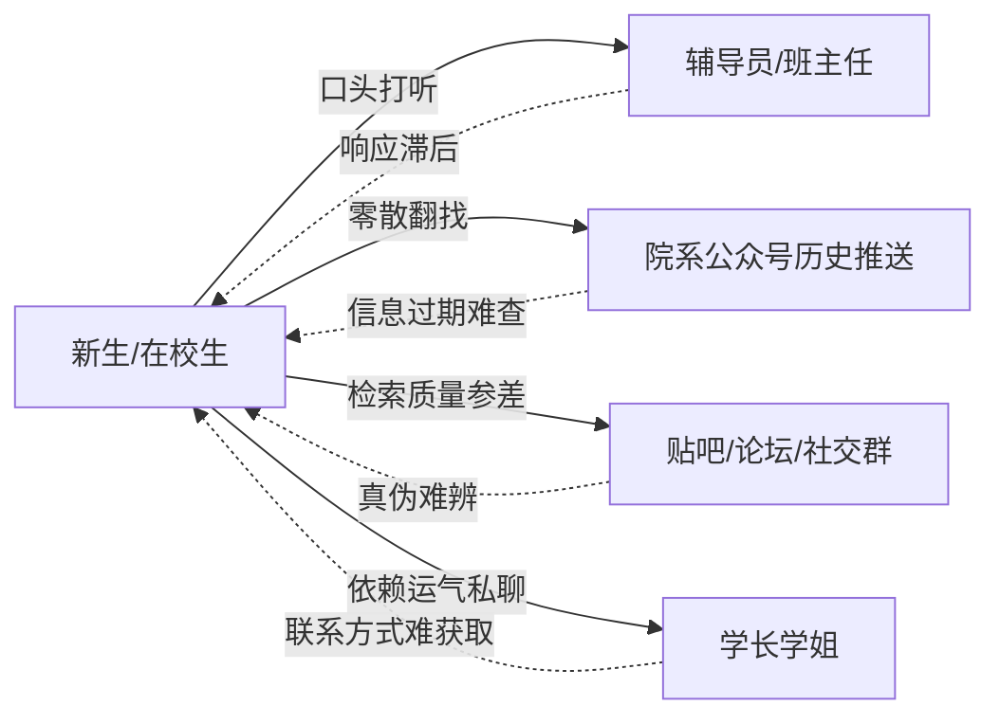
*图2-1 现状信息流转示意图（学业圈）*

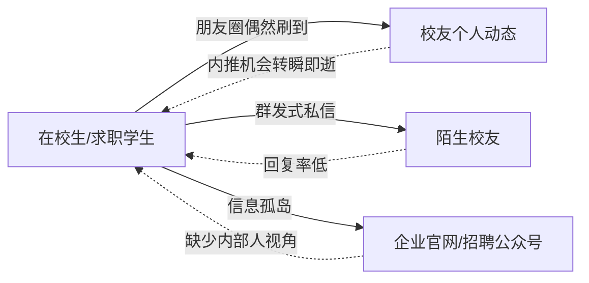
*图2-2 现状信息流转示意图（生活圈）*

**(e) 扩写提示**：
> "以图2-1、图2-2为依据，扩写'对现有（现状）系统的分析'一节约800字，逐条说明现状流转路径与其问题，并在段末归纳4-5类共性问题（信息滞后/真伪难辨/检索困难/经验不可复用/缺乏信任机制），不要虚构具体调研数字。"

---

### 2.4 所建议的系统

**(a) 写什么**
- 系统说明：统一平台以"账号体系+双圈信息组织"为核心，用结构化求助替代盲目私聊，用路由匹配算法替代"广撒网"，用知识沉淀替代"一次性回答即遗忘"。
- 支持的系统模式：B/S架构、前后端分离、云端可部署，支持PC/移动浏览器访问。
- 优缺点：优点对应2.3每条痛点逐一给出解法；缺点/局限如实说明（如冷启动阶段内容量依赖种子用户、算法依赖标签质量）。

**(b) 怎么写**
- 与2.3"问题→图"一一对应写"痛点→建议方案"，即每段先重述一个现状痛点，再说明系统如何解决，最后用图2-3串联整体建议流程。
- 优缺点部分坦诚写1-2条局限，体现工程严谨性，不要写成纯广告式全优。

**(c) 可引用素材**
- 结构化求助 + 路由匹配（专业40 + 校友身份15 + 年级差5×N封顶3 + 擅长度6×N封顶5 + 信任度3×log(N) 防头部垄断；候选池Tier1同专业/高年级校友，为空则Tier2管理员兜底，保证≥1次通知）。
- 采纳→异步生成知识候选（@TransactionalEventListener AFTER_COMMIT，事务提交后异步、防回滚脏数据）。
- 局限可写：算法效果依赖标签体系完备度、平台早期内容冷启动需运营激励。

**(d) 图表**
- **图2-3** 建议系统业务流程图（活动图）

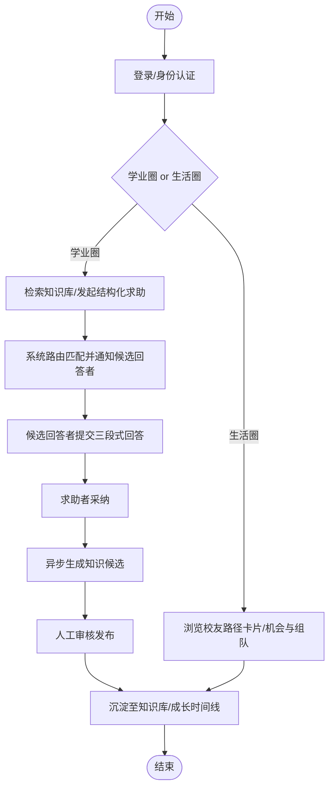
*图2-3 建议系统业务流程图（活动图）*

**(e) 扩写提示**：
> "依据图2-3与路由匹配算法（专业40+校友身份15+年级差5×N封顶3+擅长度6×N封顶5+信任度3×log(N)），扩写'所建议的系统'约900字，采用'痛点-解法'对应结构，并如实写1-2条现阶段局限（如冷启动依赖种子内容），不要全优化表述。"

---

### 2.5 可选择的其他系统方案

**(a) 写什么**
- 列出并比较2-3个替代方案，如：①继续沿用现有分散渠道+人工运营公众号；②采用通用校园社交App/第三方问答平台嫁接；③自建轻量论坛（无结构化路由）。
- 逐一说明为何最终未采用，落到"缺少结构化路由/缺少身份可信治理/无法定制双圈信息组织"等具体原因。

**(b) 怎么写**：三选一对比表或分点论述均可，建议每个方案控制在100-150字，突出"为什么不选它"而非泛泛而谈。

**(c) 可引用素材**：可对比"没有路由算法的传统论坛/问答区"与"本系统的Top-K加权路由+Tier2兜底"在响应确定性上的差异。

**(d) 图表**：可选，若篇幅需要可用简表对比（无需图号，可作为正文内小表）。

**(e) 扩写提示**：
> "扩写'可选择的其他系统方案'一节，对比至少2个替代方案（人工运营公众号方案、通用论坛/问答平台嫁接方案），每个方案说明其不足之处及未被采纳的具体原因，约500字。"

---

### 2.6 投资及效益分析

**(a) 写什么**
- 成本：人力成本（5人一学期开发工时，占位数字，团队自行核实填入）、技术成本（开源框架零授权费）、部署成本（云服务器/数据库象征性成本，或校内环境）。
- 效益：非货币化效益为主——信息不对称改善、校友网络粘性提升、迎新与就业服务数字化的潜在价值；可与"继续现状"方案做定性对比（时间成本节省、答复确定性提升）。
- 结论：说明经济上可行的理由（开源技术栈+现有开发环境，边际成本低）。

**(b) 怎么写**
- 明确本项目属课程/毕业设计性质，不做严格财务NPV/ROI核算，采用"成本要素清单+定性效益论证"的写法即可，避免编造精确金额。
- 凡涉及具体人月/金额数字处标注"（此处数字为示例占位，请按团队实际投入工时/云资源报价填写）"，防止扩写时被AI编造虚假精确数据。

**(c) 可引用素材**：技术栈全部开源（Spring Boot/Vue3/MySQL/MyBatis-Plus等均无授权费），这是经济可行性的直接依据。

**(d) 图表**：可选一张简单成本构成饼图/表格（非必须，篇幅紧张可省略）。

**(e) 扩写提示**：
> "扩写'投资及效益分析'一节，成本部分列人力/技术/部署三类成本要素（不编造具体金额，标注为团队自行核算占位），效益部分做定性论证（信息对称性提升、校友粘性、治理数字化价值），约600字。"

---

### 2.7 社会因素方面的可行性

**(a) 写什么**
- 法律与合规：不涉及侵权内容（UIKit与场景背景插画为团队自研原创），用户数据处理遵循最小可见原则（contactVisibility/profileVisibility）。
- 用户可接受性：贴合在校生/校友的既有使用习惯（登录后即用，学习成本低）。
- 社会价值：促进校友反哺母校生态、缓解新生信息不对称带来的教育公平问题。

**(b) 怎么写**：分"合规性/可接受性/社会价值"三小段展开，每段3-5句，落到具体机制（不是空泛表态）。

**(c) 可引用素材**
- 隐私：contactVisibility/profileVisibility 最小可见控制；知识候选发布前隐私预检（敏感词/真实姓名/联系方式）+人工审核。
- 原创：自研UIKit组件库（30个组件）+ 18张自制场景背景插画（绿色雕塑/蓝色雕塑等，呼应双圈品牌意象），不存在版权风险。

**(d) 图表**：无。

**(e) 扩写提示**：
> "扩写'社会因素方面的可行性'一节，分合规性（隐私可见性控制+知识候选隐私预检+原创视觉资产）、用户可接受性、社会价值三部分，约500字。"

---

### 2.8 结论意见

**(a) 写什么**：总结技术/经济/社会三方面均可行，明确系统建设范围（即9个业务模块的边界：user/profile/knowledge/help/opportunity/timeline/admin/notification/social），并给出"建议立项开发"的结论。

**(b) 怎么写**：先三句话分别呼应2.4/2.6/2.7的可行性结论，再用一段界定建设范围（列出9模块名称+一句话职责），最后一句结论性表态。

**(c) 可引用素材**：9模块：user（用户与认证）、profile（学生/校友档案）、knowledge（知识库）、help（求助与路由）、opportunity（机会组队）、timeline（成长时间线）、admin（平台治理）、notification（通知）、social（关注/私信/徽章）。

**(d) 图表**：**表2-1** 可行性分析责任矩阵（RACI）。

| 任务/成员 | 赵泽垒(统筹/图) | 李卓言(前端) | 何月涛(后端/数据库) | 刘景岩(认证治理/交互) | 黄若麟(文档) |
|---|---|---|---|---|---|
| 现状调研与问题归纳 | A | C | C | C | R |
| 技术可行性评估 | C | C | R/A | C | I |
| 经济可行性评估 | R/A | I | C | I | C |
| 社会因素可行性评估 | C | I | I | R/A | C |
| 系统建设范围界定 | R/A | C | C | C | C |
| 可行性报告撰写与统稿 | C | I | I | I | R/A |

*表2-1 可行性分析责任矩阵（RACI：R负责/A批准/C咨询/I知情）*

**(e) 扩写提示**：
> "依据表2-1与9模块划分，扩写'结论意见'一节约400字，先总结三方面可行性结论，再界定系统建设范围，末句给出立项建议。"

---

## 第3章 系统开发计划

### 3.1 引言

**(a) 写什么**：说明本章目的（明确项目实施的人员组织、进度安排与支持条件），与第2章可行性结论的承接关系。

**(b) 怎么写**：2-3句话，简短过渡即可。

**(d) 图表**：无。

**(e) 扩写提示**：
> "扩写系统开发计划'引言'一节，200字以内，说明本章承接可行性研究结论、明确实施安排。"

---

### 3.2 项目概述

**(a) 写什么**
- 任务目标：本学期内完成9模块核心闭环的设计、开发与真实环境联调。
- 条件、假定和限制：5人学生团队、课余开发、部署验证环境为WSL+MySQL。
- 产品交付形式：可运行的B/S系统（前端+后端+数据库）+ 论文文档。
- 交付期限：占位（按课程/答辩时间节点填写）。

**(b) 怎么写**：条目式短段，每项2-3句。

**(d) 图表**：无（进度细节留给3.3的图3-1）。

**(e) 扩写提示**：
> "扩写'项目概述'一节，含任务目标/条件假定和限制/产品交付形式/交付期限四个小段，约400字，交付期限处标注为按实际课程节点填写的占位。"

---

### 3.3 实施计划（人员分工与进度）

**(a) 写什么**
- 人员组织：5人业务域分工——赵泽垒（统筹协调+全部UML建图）、李卓言（前端：Vue3+UIKit+19页面）、何月涛（后端+数据库：9模块Controller/Service/Mapper+路由算法）、刘景岩（认证治理+交互：JWT/RBAC/权限治理+可用性）、黄若麟（文档：需求/设计文档+论文统稿）。
- 进度安排：需求与可行性 → UML建模 → 概要设计（架构/E-R）→ 并行开发（前端/后端）→ 联调（真实环境）→ 文档定稿。

**(b) 怎么写**：先文字说明分工原则（按模块/职责划分而非按人力平均切割），再用图3-1甘特图展示时间线，图文对照。

**(c) 可引用素材**：团队与分工同前；WSL上Spring Boot3+MySQL8真实环境联调作为进度中的关键里程碑节点。

**(d) 图表**：**图3-1** 项目实施甘特图。

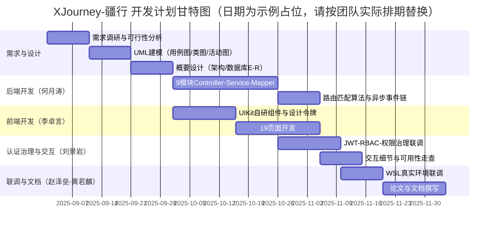
*图3-1 项目实施甘特图*

**(e) 扩写提示**：
> "依据图3-1与5人分工（赵泽垒统筹/图、李卓言前端、何月涛后端数据库、刘景岩认证治理交互、黄若麟文档），扩写'实施计划'一节约700字，先说明分工原则，再逐阶段说明进度安排，并点出'WSL真实环境联调通过核心闭环'作为关键里程碑。"

---

### 3.4 支持条件

**(a) 写什么**：开发环境（IDE、Node/Java版本等）、运行环境（MySQL8、云服务器/本地WSL）、人员培训（无需专项培训，团队既有技能栈覆盖）、协作工具（Git版本管理等）。

**(b) 怎么写**：分"开发条件/运行条件/协作条件"三小段列举。

**(c) 可引用素材**：技术栈同1.3；MySQL8+Spring Boot3.2.5+Java17的真实联调环境。

**(d) 图表**：无。

**(e) 扩写提示**：
> "扩写'支持条件'一节约300字，分开发环境、运行环境、协作工具三部分说明。"

---

## 第4章 系统需求分析（面向对象方法）

> 硬性约束：本章及全篇系统建模只用UML（用例图/类图/活动图），不使用数据流图与结构化流程图。

### 4.1 引言

**(a) 写什么**：编写目的、本系统采用面向对象方法学的说明（用例驱动+领域建模）、术语定义（用例/参与者/领域概念类/活动图等）、参考资料（第2、3章成果）。

**(b) 怎么写**：标准SRS开篇四段式。

**(d) 图表**：无。

**(e) 扩写提示**：
> "按面向对象SRS模板扩写'引言'一节约400字，说明本章采用用例驱动+领域建模的分析方法，不使用数据流图。"

---

### 4.2 任务概述

> 本节对应模板"2 任务概述→2.1 目标→2.1.1～2.1.6"的层级结构。

**(a) 写什么（对应各子节）**
- **2.1.1 开发意图**：解决新大校友与在校生成长信息分散、求助无门、经验不可复用的问题，构建统一的双圈成长导航平台。
- **2.1.2 应用目标**：面向在校生与校友，实现"检索有知识、求助有回应、成长可追踪、治理可信任"四个可验证目标。
- **2.1.3 产品描述**：B/S架构Web应用，前后端分离，统一响应体`Result{code,message,data}`，接口前缀`/api/v1`。
- **2.1.4 产品功能**：登录注册+JWT鉴权、知识库检索与三态评价（有用/已过时/需更新）、结构化求助与路由匹配、机会组队、成长时间线、通知、平台治理（运营看板/审核/举报/标签）、身份认证申请、关注、私信消息中心、徽章、他人主页浏览。个人主页上的可视化展示（如活跃度呈现等）作为界面表现层的成长可视化扩展方向一笔带过，不展开其后端持久化逻辑。
- **2.1.5 用户特点/运行环境**（模板项，简写）：用户为在校生与校友两类角色，均具备基本网页操作能力；运行环境为主流浏览器+MySQL8后端。
- **2.1.6 安全性**（模板单列小节，重点展开）：见下方素材，需完整成段落。

**(b) 怎么写**
- 2.1.1-2.1.4按"意图→目标→产品是什么→产品能做什么"递进展开，每小节150-250字。
- **2.1.6安全性独立成段**，建议按"鉴权机制→权限模型→存储安全→越权防护→数据防注入→隐私可见性→异常处理"七点展开，每点2-3句，落到具体机制名称，不写空泛的"系统具有较高安全性"。

**(c) 可引用素材（重点：2.1.6安全性）**
1. JWT（HS384）无状态鉴权 + accessToken/refreshToken双令牌；请求头`Authorization: Bearer`；服务端STATELESS。
2. Spring Security + RBAC 四角色 + `authStatus`认证分级；方法级`@PreAuthorize("@authGuard.isLogin()")`/`isVerified()`，全系统96处方法级校验。
3. 密码BCrypt加密存储（`PasswordEncoder`，不存明文）。
4. 越权防护：通知/私信/徽章等接口仅操作"当前登录用户自己"（`SecurityUtil.currentUserId()`校验），自关注拦截+幂等处理。
5. MyBatis参数化防SQL注入；逻辑删除`deleted`字段，自定义SQL手动带`deleted=0`。
6. 隐私：`contactVisibility`/`profileVisibility`最小可见控制；知识候选发布前隐私预检（敏感词/真实姓名/联系方式）+人工审核。
7. 全局异常处理（`GlobalExceptionHandler`）统一响应不泄漏堆栈；未认证请求前只读；401拦截器清token跳登录。

**(d) 图表**：本节一般不放图。

**(e) 扩写提示**：
> "依据上述七点安全机制素材，扩写'2.1.6 安全性'一节约500-600字，逐点展开为完整段落，每点须点出具体技术手段（JWT/HS384、RBAC、BCrypt、@PreAuthorize、MyBatis参数化、contactVisibility/profileVisibility、GlobalExceptionHandler），不得使用空泛表述替代具体机制名。另扩写2.1.1-2.1.5各150-250字。"

---

### 4.3 具体需求分析

> 本节对应模板"3 具体需求分析→3.1系统流程图/3.2用例模型/3.3数据字典/3.4领域概念类图/3.5核心业务活动图"，其中**3.2用例模型须给出用例叙述表**，**3.3数据字典须为"数据项/领域对象属性字典"**（面向对象改造，字段级条目，非数据流条目）。

#### 3.1 系统流程图（业务主流程活动图）

**(a) 写什么**：以活动图表达用户从登录到完成核心任务的总体业务主线，覆盖双圈两条分支并在成长时间线处收敛。

**(b) 怎么写**：先文字描述主干路径（登录认证→选择圈子→核心操作→通知/治理贯穿），图随后。可与图2-3区分：图2-3是"建议系统"层面的简版，本节图4-1是"需求分析"层面更贴近真实页面导航的展开版。

**(d) 图表**：**图4-1** 总体业务流程图（活动图）。

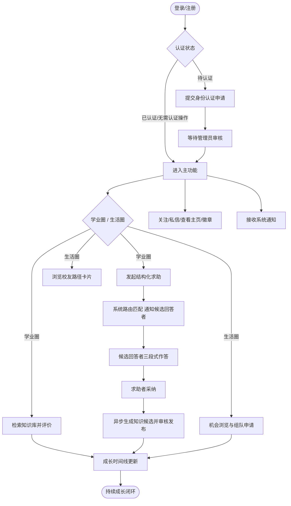
*图4-1 总体业务流程图（活动图）*

**(e) 扩写提示**：
> "依据图4-1扩写'系统流程图'一节约600字，按登录认证、双圈分支、通知贯穿三部分说明活动图各分支的触发条件与状态迁移。"

#### 3.2 用例模型（含用例叙述表）

**(a) 写什么**
- 给出系统总体用例图，以及学生端/校友端/管理员端三张细化用例图。
- 给出**用例叙述表**的标准格式，并至少完整示范1个用例。
- 说明5位成员各自撰写哪几个核心用例叙述（分工需落到具体用例名）。

**(b) 怎么写**
- 先放总体用例图（图4-2），再分三端细化图（图4-3～4-5），每张图后跟1段文字说明该端核心用例的业务含义。
- 用例叙述表统一表头：**用例名称/撰写者/参与者/目的/前置条件/后置条件/事件流（参与者操作|系统响应两列）/候选事件流/特殊需求**。正文只需完整写1-2个示范用例，其余用例在扩写阶段由撰写人按同一表头补齐。

**(c) 可引用素材 / 分工**

**表4-3 五人用例叙述分工表**

| 成员 | 负责视角 | 撰写的用例叙述 |
|---|---|---|
| 赵泽垒（统筹/图） | 全局视角，负责图4-2～4-7全部UML绘制 | 浏览成长时间线；查看运营看板统计 |
| 李卓言（前端） | 用户交互视角 | 注册与登录；发起结构化求助；关注用户；查看他人主页 |
| 何月涛（后端/数据库） | 核心业务逻辑视角 | 路由匹配通知候选回答者；提交三段式回答并采纳；生成知识候选；发送/接收私信 |
| 刘景岩（认证治理/交互） | 认证与治理视角 | 提交身份认证申请；审核知识候选/认证申请；举报与处理 |
| 黄若麟（文档） | 内容与文档统稿视角 | 检索知识库并评价；接收系统通知；负责数据字典与用例叙述表汇编统稿 |

**表4-2 用例叙述表示例——"发起结构化求助"**

| 要素 | 内容 |
|---|---|
| 用例名称 | 发起结构化求助 |
| 撰写者 | 李卓言 |
| 参与者 | 学生/校友（求助者） |
| 目的 | 求助者按结构化字段（专业标签、问题类型标签、目标方向）提交求助单，便于系统进行精准路由匹配 |
| 前置条件 | 用户已登录 |
| 后置条件 | 生成一条状态为`OPEN`的`HelpTicket`记录，触发后续路由匹配流程 |
| 事件流 | 见下表 |
| 候选事件流 | 若必填项缺失或标签非法，系统提示错误并阻止提交，不创建记录 |
| 特殊需求 | 表单提交到状态置为`OPEN`应有可接受的交互响应时间；路由匹配可异步执行，不阻塞主流程 |

| 参与者操作 | 系统响应 |
|---|---|
| ① 点击"发起求助" | 展示结构化表单（标题/内容/专业标签/问题类型标签/目标方向） |
| ② 填写并提交 | 校验必填项与标签合法性 |
| — | 创建`HelpTicket`记录，状态置为`OPEN` |
| — | 异步触发`HelpRouteServiceImpl`计算候选回答者权重并生成通知，状态转为`MATCHED` |

**(d) 图表**
- **图4-2** 系统总体用例图；**图4-3** 学生端用例图；**图4-4** 校友端用例图；**图4-5** 管理员端用例图。

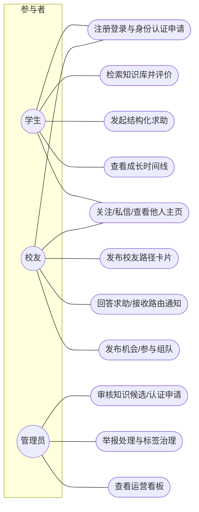
*图4-2 系统总体用例图*

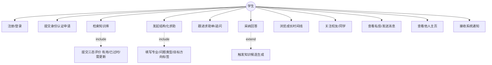
*图4-3 学生端用例图*

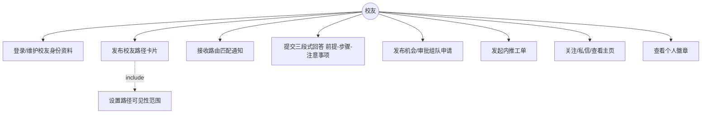
*图4-4 校友端用例图*

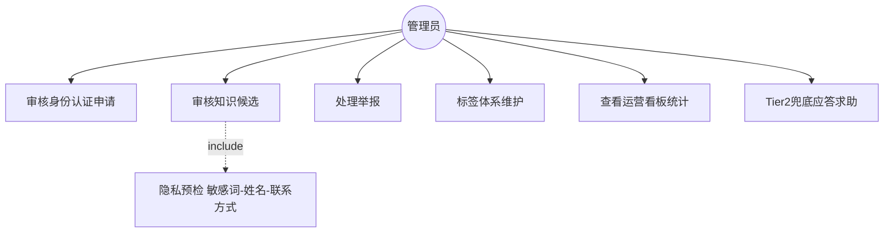
*图4-5 管理员端用例图*

**(e) 扩写提示**：
> "依据图4-2～4-5与表4-3分工，为表4-3中每位成员负责的全部用例逐一撰写完整用例叙述表（参照表4-2的'发起结构化求助'格式），每个用例含参与者/目的/前置后置条件/事件流两列表/候选事件流/特殊需求，事件流不少于3步，禁止编造与真实系统状态机（OPEN/MATCHED/ANSWERED/ADOPTED/CLOSED等）矛盾的状态描述。"

#### 3.3 数据字典（数据项/领域对象属性字典）

**(a) 写什么**：面向对象方法下数据字典改造为"领域对象属性字典"，逐字段列出核心领域对象（User/HelpTicket/HelpAnswer/KnowledgeEntry/Message/UserBadge等）的属性名、含义、类型、约束、备注，而非结构化分析中的数据流条目。

**(b) 怎么写**：以图4-6领域概念类图中的每个类为单位，各建一张"属性字典表"，表头统一：**序号/属性名/中文含义/数据类型/约束或取值范围/备注**。正文完整示范1-2个对象，其余对象在扩写阶段按同表头补齐。

**(c) 可引用素材（示范对象：HelpTicket）**

**表4-1 数据项/领域对象属性字典示例——HelpTicket**

| 序号 | 属性名 | 中文含义 | 数据类型 | 约束/取值范围 | 备注 |
|---|---|---|---|---|---|
| 1 | id | 求助单ID | Long | 主键，自增 | 继承自BaseEntity |
| 2 | askerId | 求助者用户ID | Long | 非空，外键关联User | — |
| 3 | title | 求助标题 | String | 非空 | — |
| 4 | content | 求助内容 | String(Text) | 非空 | 支持长文本 |
| 5 | majorTagId | 专业标签ID | Long | 外键关联Tag | 用于路由匹配权重计算 |
| 6 | questionTypeTagId | 问题类型标签ID | Long | 外键关联Tag | 用于擅长度匹配 |
| 7 | targetDirection | 目标方向 | String | 枚举值 | 如考研/保研/求职等 |
| 8 | status | 求助单状态 | String | OPEN/MATCHED/ANSWERED/ADOPTED/CLOSED | 状态机字段 |
| 9 | followupCount | 追问次数 | Integer | 非负整数，默认0 | — |
| 10 | deleted | 逻辑删除标记 | Boolean | 默认false | 继承自BaseEntity |
| 11 | createdAt/updatedAt | 创建/更新时间 | DateTime | 系统自动维护 | 继承自BaseEntity |

**(d) 图表**：本节以表为主，无需单独配图；可标注"字段来源见图4-6领域概念类图"。

**(e) 扩写提示**：
> "参照表4-1的表头（序号/属性名/中文含义/数据类型/约束或取值范围/备注），为图4-6领域概念类图中的User、HelpAnswer、KnowledgeEntry、Message、UserBadge等其余核心领域对象各补一张完整的属性字典表，字段需与已知真实字段（如KnowledgeEntry的title/content/category/authorId/status/sourceType/sourceHelpId/viewCount/version）保持一致，不得新增未在基准信息中出现的字段。"

#### 3.4 领域概念类图

**(a) 写什么**：给出核心业务领域的概念类及其关联关系，体现面向对象分析（而非物理数据库表）视角。

**(b) 怎么写**：先文字说明领域内几个核心聚合（用户与身份、求助与知识、社交互动、成长时间线、治理审核），再给图4-6，图后逐一说明关键关联的业务含义（如HelpAnswer被采纳后生成KnowledgeEntry这一关联，对应异步事件链）。

**(d) 图表**：**图4-6** 领域概念类图。

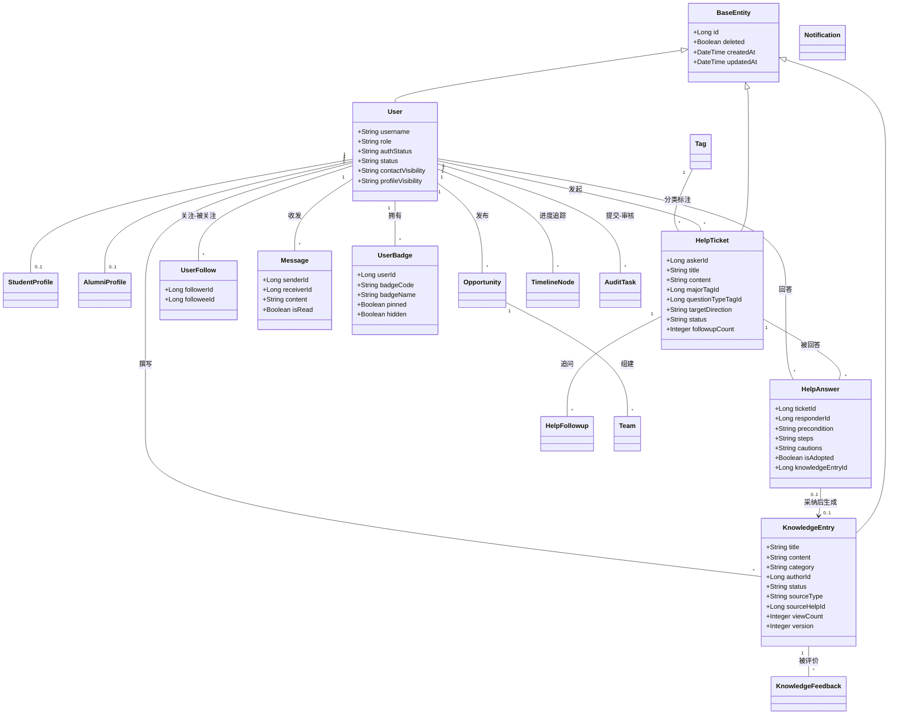
*图4-6 领域概念类图*

**(e) 扩写提示**：
> "依据图4-6扩写'领域概念类图'说明文字约600字，重点解释User-HelpTicket-HelpAnswer-KnowledgeEntry这条主链上的关联语义（尤其HelpAnswer采纳后生成KnowledgeEntry的0..1关联），以及UserFollow/Message的自关联设计原因。"

#### 3.5 核心业务活动图

**(a) 写什么**：以泳道活动图展开"求助-路由匹配-采纳-知识沉淀"这条系统最核心的业务闭环，比4-1更细，须体现异步事件链与状态迁移。

**(b) 怎么写**：图前用一段文字点名四个泳道角色（求助者/系统路由算法/候选回答者/审核员），图后用一段文字解释关键设计点（AFTER_COMMIT异步、Tier2兜底、乐观锁）。

**(c) 可引用素材**
- 路由匹配权重：`W_MAJOR=40 + W_ALUMNI_IDENTITY=15 + W_GRADE_GAP=5×年级差(封顶3) + W_EXPERTISE=6×同类型被采纳次数(封顶5) + W_TRUST=3×log(累计被采纳数)`；候选池Tier1同专业+高年级校友（排除本人/已匹配），为空则Tier2任一管理员兜底，降序取Top-K通知。
- 采纳→`@TransactionalEventListener(AFTER_COMMIT)`异步`HelpAnswerAdoptedEvent`→`createFromHelpAdoption`生成知识候选（CANDIDATE）+回写→审核→PUBLISHED。
- `knowledge_entry`乐观锁`version`字段，用于并发编辑场景。

**(d) 图表**：**图4-7** 核心业务活动图（求助-路由-采纳-知识沉淀）。

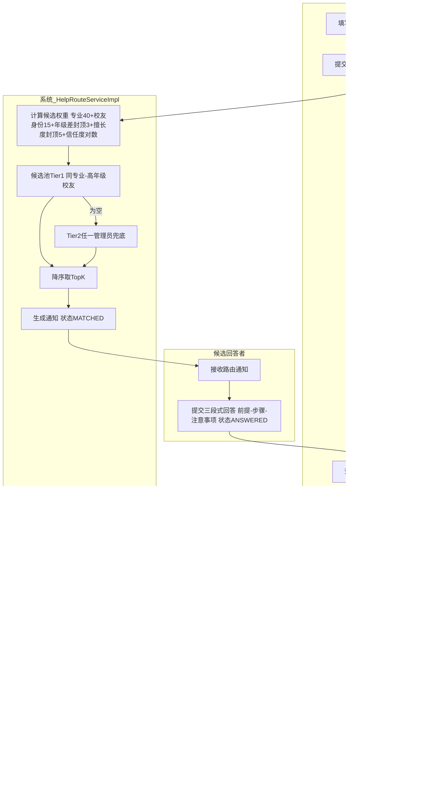
*图4-7 核心业务活动图（求助-路由-采纳-知识沉淀）*

**(e) 扩写提示**：
> "依据图4-7与路由算法/异步事件素材，扩写'核心业务活动图'说明文字约700字，重点解释三点设计动机：①为何用AFTER_COMMIT异步而非同步生成知识候选（防回滚脏数据、不阻塞主流程）；②Tier2兜底如何保证≥1次通知；③信息取log的信任度权重如何防止头部校友垄断。"

---

### 4.4 需求分析总结

**(a) 写什么**：总结需求分析成果（用例模型覆盖的角色与用例数量、领域模型覆盖的核心对象、核心业务闭环已梳理清楚），并过渡到第5章概要设计。

**(b) 怎么写**：一段总结+一句承接第5章的话，200-300字即可。

**(d) 图表**：无，可放"图表索引小结"引用图4-2～4-7。

**(e) 扩写提示**：
> "扩写'需求分析总结'一节约300字，总结三端用例覆盖、领域概念类图覆盖的核心对象、核心业务闭环，并承接过渡到第5章概要设计。"

---

## 第5章 系统概要设计

### 5.1 引言

**(a) 写什么**：概要设计目的（把需求分析的用例/领域模型转化为可实现的架构与数据库结构）、与第4章的对应关系、术语定义（三层架构/RESTful/E-R图/包图）。

**(b) 怎么写**：3-4句话过渡即可。

**(e) 扩写提示**：
> "扩写第5章'引言'约300字，说明概要设计如何承接第4章用例模型与领域概念类图。"

---

### 5.2 总体设计

#### 2.1 架构设计

**(a) 写什么**：B/S前后端分离；后端三层`Controller→Service(interface)→ServiceImpl→Mapper`；技术栈落点（Vue3生态、Spring Boot3生态）；点出自研UIKit与JWT安全在架构图中的位置。

**(b) 怎么写**：图先行（图5-1），图后逐层说明：表现层→安全网关层→业务层→持久层→数据层，每层2-3句，说明该层承担的职责与选用理由。

**(c) 可引用素材**：规模——后端379个Java文件/约2万行，前端67个文件/近8千行，用于说明架构的工程体量。

**(d) 图表**：**图5-1** 系统总体架构图。

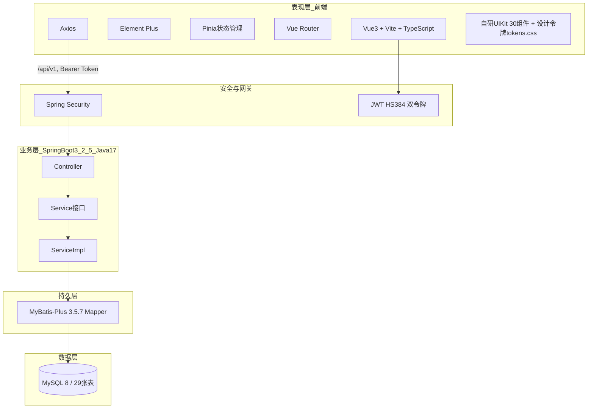
*图5-1 系统总体架构图*

**(e) 扩写提示**：
> "依据图5-1扩写'架构设计'一节约700字，逐层说明表现层/安全网关层/业务层/持久层/数据层的职责，并说明自研UIKit在表现层的定位（30个组件覆盖base输入控件/cards内容卡/navigation/feedback/states/brand，配合tokens.css设计令牌统一双圈品牌视觉），以及JWT+Spring Security在架构中的位置。"

#### 2.2 软件结构（包图）

**(a) 写什么**：以包图/类图形式表达9个业务模块的划分与依赖关系（不使用"结构图"这一结构化设计术语）。

**(b) 怎么写**：图先行（图5-2），图后说明依赖关系设计原则（如admin模块横切治理user/knowledge/help/social，help依赖notification实现路由通知）。

**(d) 图表**：**图5-2** 功能模块图（包图）。

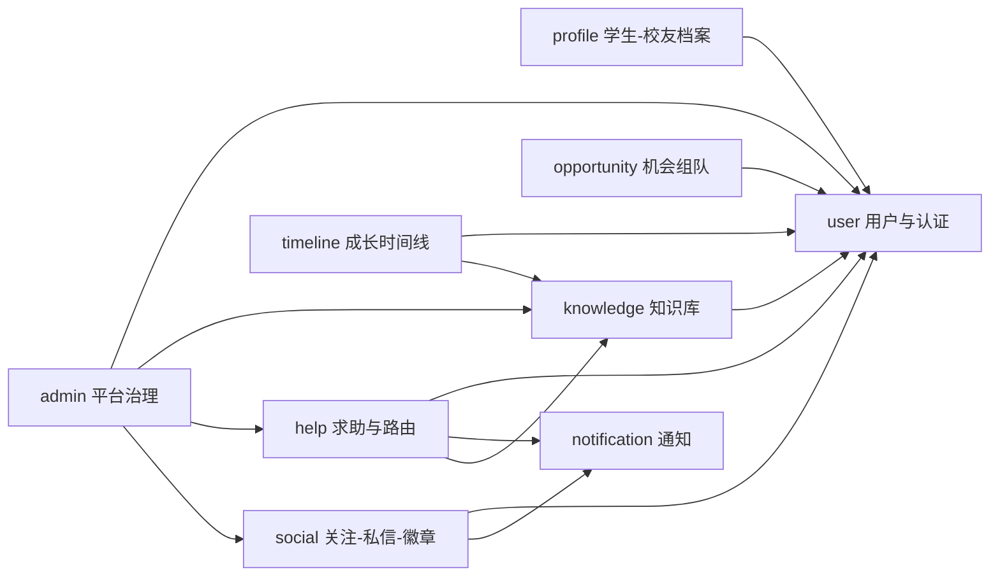
*图5-2 功能模块图（包图）*

**(e) 扩写提示**：
> "依据图5-2扩写'软件结构'一节约500字，说明9个module包的职责边界与依赖关系设计原则（admin横切治理、help依赖notification与knowledge、social依赖user与notification）。"

---

### 5.3 接口设计

#### 3.1 用户接口

**(a) 写什么**：说明前端19个页面（views）作为用户交互入口，统一交互规范（自研UIKit组件+设计令牌）、统一响应结构对前端的呈现方式（错误提示、加载态等由UIKit的feedback/states组件统一承载）。

**(c) 可引用素材**：19页面：Login、Register、Dashboard、KnowledgeList、KnowledgeDetail、HelpList、HelpCreate、HelpDetail、OpportunityList、Timeline、Profile、Notifications、UserProfile、MessageCenter、AuthApply、admin/AdminDashboard、admin/AuditQueue、admin/ReportManage、admin/TagManage。

**(d) 图表**：可选一张页面-模块映射表（非必须图号）。

**(e) 扩写提示**：
> "列出19个页面并各用一句话说明其承载的用户接口职责，约500字，风格为设计说明书条目式。"

#### 3.2 外部接口

**(a) 写什么**：如实说明当前版本外部（第三方系统）接口的现状——若确无第三方直接对接，应明确写"本系统当前版本外部接口以最小化为主，暂无第三方系统直接对接，后续迭代可考虑接入企业微信/短信网关/对象存储等"，不要虚构不存在的第三方集成。

**(e) 扩写提示**：
> "按模板要求写'外部接口'一节约200字，如实说明当前版本无强制第三方系统依赖，并展望后续可能的外部接口扩展方向（不承诺已实现）。"

#### 3.3 内部接口

**(a) 写什么**：模块间通过Service接口调用的方式，如help模块调用notification模块的服务接口发送路由通知；help模块采纳后调用knowledge模块生成知识候选（经由异步事件解耦而非直接同步调用）；admin模块调用user/knowledge/help/social的审核相关方法。

**(d) 图表**：**表5-2/5-3** 可合并为一张"内部接口清单表"，列出关键跨模块Service调用点。

| 调用方模块 | 被调方模块 | 调用方式 | 用途 |
|---|---|---|---|
| help | notification | 同步Service调用 | 路由匹配后创建通知 |
| help | knowledge | 异步事件（AFTER_COMMIT） | 采纳后生成知识候选 |
| social | user | 同步Service调用 | 关注/私信操作前的用户校验 |
| social | notification | 同步Service调用 | 新消息/新关注提醒 |
| admin | knowledge/help/social/user | 同步Service调用 | 审核、举报处理、治理操作 |

*表5-3 内部接口清单（示例，其余接口按同表头补充）*

**(e) 扩写提示**：
> "依据上方内部接口清单表，扩写'内部接口'一节约500字，重点解释help到knowledge为何采用异步事件而非直接同步调用（解耦、防止事务回滚导致脏数据、不阻塞主流程响应）。"

---

### 5.4 运行设计

#### 4.1 运行模块组合

**(a) 写什么**：说明典型业务场景下涉及哪些模块协同运行，如"发起求助"场景组合了help+notification+user三个模块；"知识沉淀"场景组合了help+knowledge+admin三个模块。

**(d) 图表**：可用文字列举3-4个典型场景的模块组合，无需单独图号。

**(e) 扩写提示**：
> "列举3个典型业务场景（发起求助并被采纳、知识候选审核发布、关注与私信）各自涉及的模块组合与运行顺序，约400字。"

#### 4.2 运行控制

**(a) 写什么**：说明系统运行时的控制机制——统一响应`Result{code,message,data}`作为运行控制的统一出口、`GlobalExceptionHandler`统一异常拦截、401拦截器控制未登录跳转、方法级`@PreAuthorize`控制权限运行边界。

**(e) 扩写提示**：
> "扩写'运行控制'一节约400字，说明统一响应结构、全局异常处理、401拦截跳转、方法级权限校验四种运行控制机制如何共同保障系统运行时的一致性与安全性。"

---

### 5.5 数据库设计

#### 5.1 概念结构设计（E-R图）

**(a) 写什么**：给出29张表的概念E-R模型，覆盖9大模块的数据组织。

**(b) 怎么写**：图先行（图5-3），图后按模块分组说明关系设计要点（如user_follow/message的自关联设计、help_answer到knowledge_entry的0..1生成关系、audit_task的多目标类型审核设计）。

**(d) 图表**：**图5-3** 数据库E-R图（29表）。

```mermaid
erDiagram
    USER ||--o| STUDENT_PROFILE : has
    USER ||--o| ALUMNI_PROFILE : has
    USER ||--o{ AUTH_APPLICATION : submits
    AUTH_APPLICATION }o--o| MOCK_STUDENT_ROSTER : validated_by
    USER ||--o{ USER_TAG : tagged_by
    TAG ||--o{ USER_TAG : used_in
    USER ||--o{ NOTIFICATION : receives
    USER ||--o{ ALUMNI_PATH_CARD : publishes
    ALUMNI_PATH_CARD ||--o{ PATH_VISIBILITY : controls
    USER ||--o{ KNOWLEDGE_ENTRY : authors
    KNOWLEDGE_ENTRY ||--o{ KNOWLEDGE_FEEDBACK : receives
    USER ||--o{ KNOWLEDGE_FEEDBACK : gives
    USER ||--o{ HELP_TICKET : creates
    TAG ||--o{ HELP_TICKET : classifies
    HELP_TICKET ||--o{ HELP_ANSWER : has
    USER ||--o{ HELP_ANSWER : responds
    HELP_ANSWER |o--o| KNOWLEDGE_ENTRY : generates
    HELP_TICKET ||--o{ HELP_FOLLOWUP : has
    HELP_TICKET ||--o{ HELP_ROUTE : routes
    USER ||--o{ HELP_ROUTE : candidate
    USER ||--o{ OPPORTUNITY : publishes
    OPPORTUNITY ||--o{ TEAM : forms
    TEAM ||--o{ TEAM_MEMBER : has
    USER ||--o{ TEAM_MEMBER : joins
    USER ||--o{ REFERRAL_TICKET : requests
    OPPORTUNITY ||--o{ REFERRAL_TICKET : refers
    TIMELINE_TEMPLATE ||--o{ TIMELINE_NODE : contains
    TIMELINE_NODE ||--o{ TIMELINE_NODE_REF : references
    KNOWLEDGE_ENTRY |o--o{ TIMELINE_NODE_REF : referenced_by
    USER ||--o{ USER_PROGRESS : tracks
    TIMELINE_NODE ||--o{ USER_PROGRESS : progressed_by
    USER ||--o{ AUDIT_TASK : submits_for_audit
    USER ||--o{ REPORT : reports
    USER ||--o{ USER_FOLLOW : follows
    USER ||--o{ MESSAGE : sends
    USER ||--o{ USER_BADGE : owns
```
*图5-3 数据库E-R图（29表，共9大模块）*

> 注：`AUDIT_TASK`/`REPORT`/`TIMELINE_NODE_REF`在实际实现中可能采用"目标类型+目标ID"的多态关联（一张审核/举报/引用表服务多种业务对象），本图为简化表达；扩写时请以团队实际建表SQL/DDL为准核对基数关系。

**(e) 扩写提示**：
> "依据图5-3，按9个模块分组扩写'概念结构设计'说明文字约1000字，每组说明2-3条关键关系的业务含义，重点解释：①HelpAnswer到KnowledgeEntry的0..1生成关系如何对应AFTER_COMMIT异步事件；②AuditTask/Report可能采用的多态目标关联设计思路；③UserFollow/Message的自关联表设计。不要在此环节改变已给出的表名和模块分类。"

#### 5.2 逻辑结构设计

**(a) 写什么**：将E-R模型转化为逻辑表结构的原则说明——统一主键`id`自增、统一继承`BaseEntity`字段（`deleted`/`createdAt`/`updatedAt`）、状态字段统一用字符串枚举而非独立状态表、多对多关系用中间表（如user_tag、team_member）。

**(d) 图表**：**表5-1** 数据库表汇总表。

| 模块 | 表名 | 中文名 | 核心字段（示例） |
|---|---|---|---|
| user | user | 用户 | id, username, role, authStatus, status, contactVisibility, profileVisibility |
| user | auth_application | 身份认证申请 | userId, status |
| user | mock_student_roster | 学籍名册（校验用） | studentId, name |
| profile | student_profile | 学生档案 | userId, grade, major |
| profile | alumni_profile | 校友档案 | userId, graduationYear |
| knowledge | tag | 标签 | name, category |
| knowledge | user_tag | 用户-标签关联 | userId, tagId |
| knowledge | knowledge_entry | 知识条目 | title, content, category, authorId, status, sourceType, sourceHelpId, viewCount, version |
| knowledge | knowledge_feedback | 知识反馈 | entryId, userId, feedbackType |
| help | help_ticket | 求助单 | askerId, title, content, majorTagId, questionTypeTagId, targetDirection, status, followupCount |
| help | help_answer | 求助回答 | ticketId, responderId, precondition, steps, cautions, isAdopted, knowledgeEntryId |
| help | help_followup | 求助追问 | ticketId, userId |
| help | help_route | 路由记录 | ticketId, candidateUserId, weight |
| opportunity | opportunity | 机会 | publisherId, title |
| opportunity | team | 组队 | opportunityId |
| opportunity | team_member | 组队成员 | teamId, userId |
| opportunity | referral_ticket | 内推工单 | requesterId, opportunityId |
| timeline | timeline_template | 时间线模板 | name |
| timeline | timeline_node | 时间线节点 | templateId, title |
| timeline | timeline_node_ref | 时间线节点引用 | nodeId, refType, refId |
| timeline | user_progress | 用户进度 | userId, nodeId, status |
| admin | audit_task | 审核任务 | targetType, targetId, status |
| admin | report | 举报 | reporterId, targetType, targetId |
| notification | notification | 通知 | receiverId, content, isRead |
| social | user_follow | 关注 | followerId, followeeId |
| social | message | 私信 | senderId, receiverId, content, isRead |
| social | user_badge | 徽章 | userId, badgeCode, badgeName, pinned, hidden |
| profile | alumni_path_card | 校友路径卡片 | userId(creator), title |
| profile | path_visibility | 路径可见性 | pathCardId, viewerScope |

*表5-1 数据库表汇总表（29表，按9模块分组）*

**(e) 扩写提示**：
> "依据表5-1扩写'逻辑结构设计'一节约500字，说明统一主键/继承字段/状态字段用字符串枚举/多对多用中间表四条设计原则，并各举1个真实表名为例。"

#### 5.3 物理结构设计（表结构表）

**(a) 写什么**：给出1-2张核心表的完整物理表结构表（字段/类型/长度/约束/说明），作为示范，其余表按同格式在附录补齐。

**(d) 图表**：**表5-4** 数据表物理结构示例（help_ticket）。

| 字段名 | 数据类型 | 长度/精度 | 约束 | 说明 |
|---|---|---|---|---|
| id | BIGINT | — | PK, AUTO_INCREMENT | 主键 |
| asker_id | BIGINT | — | NOT NULL, FK→user.id | 求助者 |
| title | VARCHAR | 200 | NOT NULL | 标题 |
| content | TEXT | — | NOT NULL | 内容 |
| major_tag_id | BIGINT | — | FK→tag.id | 专业标签 |
| question_type_tag_id | BIGINT | — | FK→tag.id | 问题类型标签 |
| target_direction | VARCHAR | 50 | NULL | 目标方向枚举 |
| status | VARCHAR | 20 | NOT NULL, DEFAULT 'OPEN' | 状态机字段 |
| followup_count | INT | — | DEFAULT 0 | 追问计数 |
| deleted | TINYINT | 1 | DEFAULT 0 | 逻辑删除 |
| created_at / updated_at | DATETIME | — | NOT NULL | 审计字段 |

*表5-4 数据表物理结构示例（help_ticket，字段长度为示例值，以实际建表SQL为准）*

**(e) 扩写提示**：
> "参照表5-4的表头（字段名/数据类型/长度精度/约束/说明），为user、knowledge_entry、message、user_badge等其余核心表各补一张完整物理结构表，字段需与已知真实字段和状态机取值（如knowledge_entry状态CANDIDATE/REVIEWING/PUBLISHED/EXPIRED/OFFLINE）保持一致，长度精度可标注为示例值待核实。"

---

### 5.6 出错处理

#### 6.1 出错信息表

**(a) 写什么**：列出系统统一异常处理下的典型错误场景与响应设计（不泄漏堆栈信息）。

**(d) 图表**：**表5-5** 出错信息表。

| 场景 | 触发条件（示例） | 统一响应处理 |
|---|---|---|
| 未登录访问受保护接口 | 缺失/过期Bearer Token | 401拦截器清token并跳转登录 |
| 越权访问他人资源 | 操作非当前登录用户自身数据 | `@PreAuthorize`拒绝，返回权限错误 |
| 未认证用户执行需认证操作 | `authStatus`未达`isVerified()`要求 | `@authGuard.isVerified()`拦截 |
| 状态机非法跃迁 | 如对已CLOSED的求助单重复采纳 | Service层校验拒绝并返回业务错误码 |
| 并发编辑冲突 | knowledge_entry乐观锁version不一致 | 更新失败，提示重新获取最新版本 |
| 参数校验失败 | 必填字段缺失/标签非法 | 统一参数校验异常，返回字段级错误信息 |
| 系统内部异常 | 未预期的运行时异常 | `GlobalExceptionHandler`捕获，返回统一错误响应，不泄漏堆栈 |

*表5-5 出错信息表（示例，具体错误码以GlobalExceptionHandler实际定义为准）*

**(e) 扩写提示**：
> "依据表5-5扩写'出错信息表'说明文字约400字，逐条解释每类错误场景对应的安全设计动机（越权防护、状态机保护、乐观锁并发控制、异常信息脱敏）。"

#### 6.2 补救措施

**(a) 写什么**：说明系统层面的容错与补救设计——逻辑删除（`deleted`字段）可恢复而非物理删除、乐观锁失败提示重试、Tier2兜底保证求助至少有1次通知不至于"无人响应"、审核驳回（`REJECTED`/`RETURNED`）可退回重新提交而非终止流程。

**(e) 扩写提示**：
> "扩写'补救措施'一节约400字，说明逻辑删除可恢复、乐观锁失败可重试、路由Tier2兜底保证≥1次通知、审核RETURNED状态可退回重提交四类补救设计，落到具体状态机取值。"

---

## 附：全篇图表索引（供扩写时核对编号一致性）

| 编号 | 名称 | 所在章节 |
|---|---|---|
| 图2-1 | 现状信息流转示意图（学业圈） | 2.3 |
| 图2-2 | 现状信息流转示意图（生活圈） | 2.3 |
| 图2-3 | 建议系统业务流程图（活动图） | 2.4 |
| 表2-1 | 可行性分析责任矩阵（RACI） | 2.8 |
| 图3-1 | 项目实施甘特图 | 3.3 |
| 图4-1 | 总体业务流程图（活动图） | 4.3 §3.1 |
| 图4-2～4-5 | 系统总体/学生端/校友端/管理员端用例图 | 4.3 §3.2 |
| 表4-2 | 用例叙述表示例 | 4.3 §3.2 |
| 表4-3 | 五人用例叙述分工表 | 4.3 §3.2 |
| 表4-1 | 数据项/领域对象属性字典示例 | 4.3 §3.3 |
| 图4-6 | 领域概念类图 | 4.3 §3.4 |
| 图4-7 | 核心业务活动图 | 4.3 §3.5 |
| 图5-1 | 系统总体架构图 | 5.2 §2.1 |
| 图5-2 | 功能模块图（包图） | 5.2 §2.2 |
| 表5-3 | 内部接口清单 | 5.3 §3.3 |
| 图5-3 | 数据库E-R图（29表） | 5.5 §5.1 |
| 表5-1 | 数据库表汇总表 | 5.5 §5.2 |
| 表5-4 | 数据表物理结构示例 | 5.5 §5.3 |
| 表5-5 | 出错信息表 | 5.6 §6.1 |

---

## 使用建议（交给ChatGPT前的注意事项）

1. 逐节喂入本指导中的 (a)-(e)，并附上对应真实素材原文，要求ChatGPT"只按给定素材展开，不得新增未提及的类名/表名/字段/数字"。
2. 涉及占位数字（甘特图日期、投资效益金额、交付期限）的地方，扩写前先让团队自己填入真实值，再喂给ChatGPT，避免AI编造虚假精确数据。
3. 通篇检查禁用词：演示模式、真实模式、演示态、未落库、假数据、未实现——扩写稿交付前需全文检索确认未出现。
4. 检查未落地功能（点赞/收藏/评论/分享、活跃热力图/日历、生活圈发帖）是否被误写成"已实现的后端功能"，若出现须改写为界面交互/成长可视化/后续迭代方向的一笔带过表述。
5. 检查图号/表号在全文引用处与本索引一致，避免ChatGPT扩写时打乱编号。