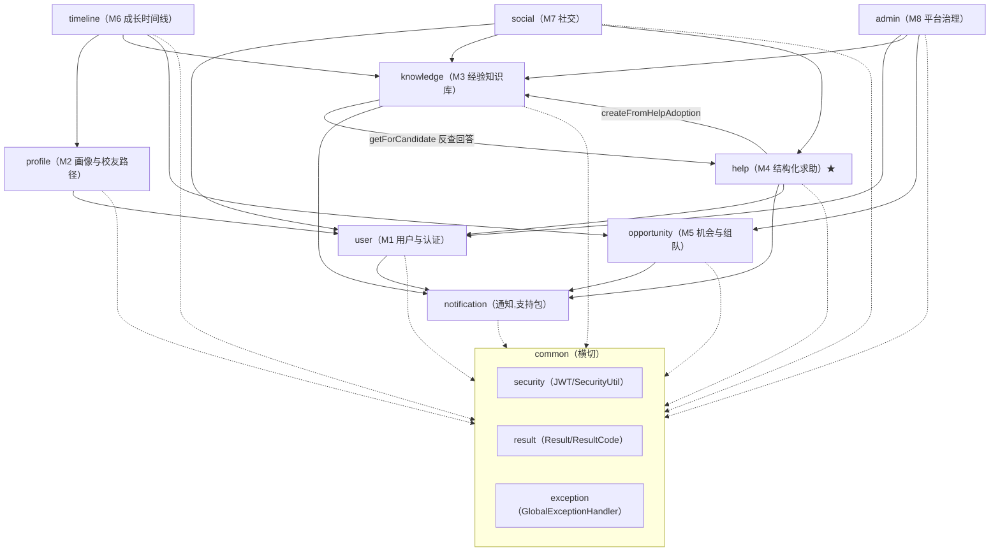
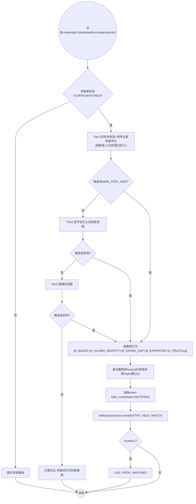
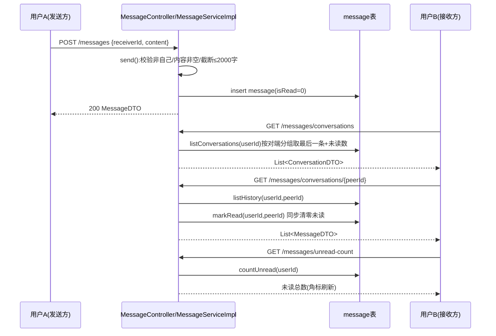
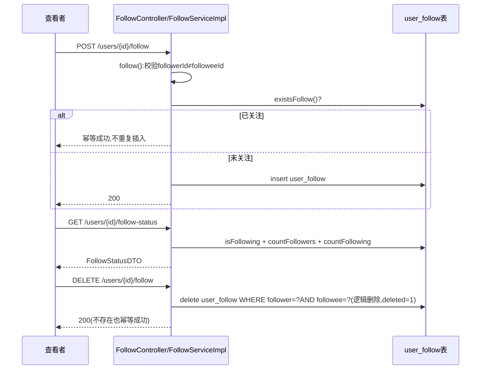
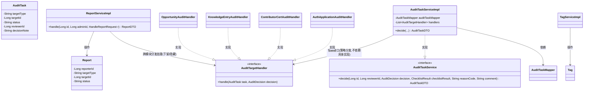

# 《XJourney-疆行》论文第六～九章 写作指导

> 本指导供你直接喂给 ChatGPT 扩写。所有类名/包名/表名/字段名/状态值/方法签名均已对照 `backend/src/main/java/com/xju/sem/**` 真实源码核对，未编造。图号采用**章内独立编号**（图6-1…图6-N，图7-1…，与项目里已有的全局图1–41 编号是两套体系，二者可并存：图6 系列可直接复用/改编 `docs/impl/图纲/` 里已经画好的对应图，只需把图号从"图24/图33/图34…"改成"图6-X"）。

## 0. 写作红线（每节都要遵守）

1. **只用 UML**：类图/包图/用例图/时序图/活动图/状态图。**绝不出现**数据流图（DFD）、结构化流程图、模块结构图这类结构化分析产物。M4 的"路由算法"不要画成程序流程图——权重打分逻辑写成**伪代码**放进函数设计表的"算法描述"列，路由**流程**画成活动图（图6-7）。
2. **口径统一**：全篇不出现"演示模式/真实模式/演示态/未落库/假数据/未实现"等字样，通篇按一个完整系统撰写。点赞/收藏/评论/分享/活跃热力图/活跃日历/生活圈发帖——**不写成已实现的后端功能**，只在界面设计/成长可视化/展望里一笔带过。
3. **术语统一**：求助单/回答/追问/采纳/知识条目/机会/队伍/时间线节点/关注/私信/徽章，不用"帖子/点赞/广场/动态"。
4. **责任人标注是建议值**：下文"负责人"列基于你给的角色描述（赵泽垒-统筹+图，李卓言-前端，何月涛-后端+数据库，刘景岩-认证治理交互，黄若麟-文档）反推的**示例分工**，不是我替你们认定的事实，交给 ChatGPT 前请按真实分工替换姓名。

---

# 六、系统详细设计（重心，建议 35-40 页）

## 6.1 引言

**(a) 要点**：本章任务=把第五章概要设计落到"类/函数/界面/代码"颗粒度；说明详细设计遵循 Controller→Service(接口)→ServiceImpl→Mapper→Entity 的分层约定，状态机统一收敛在 ServiceImpl，Controller 只做参数校验+编排。
**(b) 结构**：一段话总起 + 一张"本章内容地图"小表（模块×图号×表号）。
**(c) 素材**：后端规模"379 个 Java 文件、约 2 万行"；统一响应 `Result{code,message,data}`；`SecurityUtil.currentUserId()` 从 JWT 取当前用户，杜绝前端传 userId 造成越权。
**(d) 配图**：无独立图，用表列出本章图6-1～6-14 索引。
**(e) 扩写提示**：给 ChatGPT——"用 150-200 字说明详细设计阶段的目标、与概要设计的衔接关系，并列出本章的组织方式（先结构后模块后界面后实现结果）"。

---

## 6.2 程序系统的结构（硬性要求）

**(a) 要点**：
- 用**包图**表达 9 个模块包（`user/profile/knowledge/help/opportunity/timeline/admin/notification/social`）+ 1 个横切公共包 `common`（`security/result/exception/config`）。
- 说明包间依赖方向：业务模块**不互相持有具体实现类**，只依赖对方暴露的 Service 接口（弱耦合），跨模块调用集中在少数几条边上。
- 给出【表6-1 系统模块和代码对应关系】。

**(b) 结构**：先一段总述分层架构（Controller/Service/Mapper 三层 + Spring 事件总线做跨模块解耦），再放图6-1，再放表6-1。

**(c) 素材（真实包依赖，取自源码 import）**：
- `help → knowledge`：`HelpAnswerAdoptedListener` 调 `KnowledgeEntryService.createFromHelpAdoption`
- `help → notification`, `help → user`（`HelpRouteServiceImpl` 依赖 `UserService`）
- `knowledge → help`：`createFromHelpAdoption` 反向读 `HelpAnswerService.getForCandidate`
- `admin → user/knowledge/opportunity`：4 个 `*AuditHandler`（`AuthApplicationAuditHandler`/`ContributorCertAuditHandler`/`KnowledgeEntryAuditHandler`/`OpportunityAuditHandler`）
- `social → user/knowledge/help`：`ProfileViewMapper` 手写 SQL 多表 JOIN（不新建表，直连 `user/student_profile/alumni_profile/tag/user_tag/user_follow/user_badge/knowledge_entry/help_ticket`）
- `timeline → profile/knowledge/opportunity`：`TimelineNodeRefService` 按 `RefType` 只读校验引用是否存在
- `notification`：叶子包，被 user/knowledge/help/opportunity/admin 共同依赖，自身不反向依赖任何业务包
- `common`：所有包横切依赖（`BaseEntity`、`JwtUtil`、`Result`、`GlobalExceptionHandler`）

**(d) 配图**：**图6-1 系统模块包图（9 包结构）**

【表6-1 系统模块和代码对应关系】

| 模块定义（包路径） | 模块说明 | 负责人（示例） |
|---|---|---|
| `com.xju.sem.module.user` | M1 用户与认证：注册登录、JWT 双令牌、认证申请（学生SSO/邀请码/人工担保） | 刘景岩 |
| `com.xju.sem.module.profile` | M2 成长画像与校友路径：在校生画像、校友路径卡、可见性配置、路径推荐 | 赵泽垒 |
| `com.xju.sem.module.knowledge` | M3 经验知识库：五分类知识条目、三态评价、候选审核流转 | 何月涛 |
| `com.xju.sem.module.help` | M4 结构化求助（★系统灵魂）：求助单、路由匹配、三段式回答、采纳 | 何月涛 |
| `com.xju.sem.module.opportunity` | M5 机会与组队：机会发布终审、组队申请审批 | 何月涛 |
| `com.xju.sem.module.timeline` | M6 成长时间线：模板/节点、个人进度、补救优先级 | 赵泽垒 |
| `com.xju.sem.module.social` | M7 社交：关注、私信消息中心、他人主页、徽章 | 李卓言 |
| `com.xju.sem.module.admin` | M8 平台治理：统一审核队列、举报、标签、运营看板 | 刘景岩 |
| `com.xju.sem.module.notification` | 站内通知（支持包，被 M1/M3/M4/M5/M8 共同调用） | 何月涛 |

**(e) 扩写提示**："基于该包图与表格，写 400-500 字论述本系统的模块划分原则（高内聚低耦合、跨模块只依赖接口不依赖实现）、依赖方向为何避免循环依赖（举 `HelpAnswerAdoptedListener` 独立成 `@Component` 而非直接写进 `HelpAnswerServiceImpl` 打断构造器循环依赖的例子）。"

---

## 6.3 设计说明（按模块，每人写自己模块）

> 每个模块统一给：职责 / 核心类（Controller-Service-Impl-Mapper-Entity）/ 关键设计点 / 配图 / 函数设计表（示范其一）。

### 6.3.1 M1 用户与认证

**职责**：账号与会话（注册/登录/刷新/登出）+ 分级身份认证（学生SSO模拟核验、邀请码、人工双担保）+ 正交权限模型（role×authStatus）。

**核心类**：
- Controller：`AuthController`、`AuthApplicationController`、`UserController`、`InviteCodeController`
- Service/Impl：`UserService/UserServiceImpl`、`AuthApplicationService/AuthApplicationServiceImpl`、`AuthTokenService/AuthTokenServiceImpl`；支撑类 `SsoMockService`、`InviteCodeAllocator`、`MajorTagResolver`、`RefreshTokenProvider`
- Mapper：`UserMapper`、`AuthApplicationMapper`、`StudentProfileMapper`、`AlumniProfileMapper`
- Entity：`User`（`username/passwordHash/role/authStatus/status/contactVisibility/profileVisibility`，继承 `BaseEntity`）、`AuthApplication`（`userId/applyRole/verifyMethod/realName/studentNo/majorText/inviteCode/guarantor1Id/guarantor2Id/guarantor1Status/guarantor2Status/status`）
- 安全基础设施：`JwtUtil`、`JwtAuthenticationFilter`、`LoginUser`、`AuthGuard`、`SecurityConfig`

**关键设计点**：
1. 双令牌：`jwtUtil.generate(userId, role, authStatus)`（HS384，载荷含 `sub/role/authStatus`）+ `refreshTokenProvider.generate(userId)` 独立签发。
2. `AuthGuard.isLogin()/isVerified()` 供 `@PreAuthorize` 复用，"已登录未认证"在写操作上等价访客。
3. 密码 BCrypt（`PasswordEncoder`），`AuthTokenServiceImpl.login()` 先查用户名再 `passwordEncoder.matches()`，失败统一抛 `BAD_CREDENTIALS`（不泄漏"用户名不存在"还是"密码错"）。
4. 认证走**分级**：学生走模拟统一身份核验（`SsoMockService.mockSsoVerify`）；校友走邀请码或"人工材料+双担保人确认后转人工终审"。
5. `JwtAuthenticationFilter` 解析失败**不拦截**，只 `clearContext()` 交给后续 `@PreAuthorize` 当匿名处理，401/403 由 `authenticationEntryPoint`/`accessDeniedHandler` 统一走 `Result.fail`。

**配图**：
- **图6-2 登录与 JWT 鉴权时序图** —— 直接复用 `docs/impl/图纲/F_时序活动算法.md` 的「图34 登录与JWT鉴权时序」全部内容（两阶段 `rect`：①登录换令牌 ②带令牌请求鉴权），只改图号。
- **图6-3 认证域类图** —— 直接复用 `docs/impl/图纲/D_类图.md` 的「图24 类图-认证域」，只改图号。

【表6-2 函数设计表 —— `login`（示范）】

| 项 | 内容 |
|---|---|
| 函数名 | `login` |
| 所属类 | `AuthTokenServiceImpl implements AuthTokenService` |
| 设计人 | 刘景岩 |
| 参数 | `username`（`String`，登录名/学号）、`password`（`String`，明文密码） |
| 返回值 | `LoginResponse`（含 `accessToken: String`、`refreshToken: String`、`user: UserDTO`） |
| 功能描述 | 校验用户名密码，签发 access/refresh 双令牌并返回脱敏用户信息 |
| 算法描述 | ① 按 `username` 查 `user` 表；② 用户不存在或 `!passwordEncoder.matches(password, passwordHash)` → 抛 `BAD_CREDENTIALS`；③ `status != ACTIVE` → 抛 `ACCOUNT_DISABLED`；④ `jwtUtil.generate(id, role, authStatus)` 生成 access token（HS384，载荷 `sub/role/authStatus`）；⑤ `refreshTokenProvider.generate(id)` 生成 refresh token；⑥ 组装 `LoginResponse` 返回 |
| 输入 | HTTP `POST /api/v1/auth/login {username, password}` |
| 输出 | `Result<LoginResponse>` |
| 测试要点 | 正确凭证返回双令牌；密码错/用户名不存在均返回同一错误码（防用户名枚举）；`status=DISABLED` 账号被拒；access token 解出的 `role/authStatus` 与库内一致 |

**(e) 扩写提示**："以表6-2为模板，为 `register`、`AuthApplicationServiceImpl.submit`、`confirmGuarantee` 各出一张函数设计表，`confirmGuarantee` 的算法描述要写清楚'两名担保人均 CONFIRMED 后自动转人工终审队列'这条业务规则。"

---

### 6.3.2 M2 成长画像与校友路径

**职责**：在校生成长画像维护、成长标签、校友路径卡（含字段级可见性）、路径推荐、按专业去向统计。

**核心类**：
- Controller：`StudentProfileController`、`AlumniProfileController`、`AlumniPathCardController`、`UserTagController`、`PathRecommendationController`、`MajorDestinationStatsController`
- Service/Impl：`StudentProfileService/Impl`、`AlumniPathCardService/Impl`、`ProfileQueryService/Impl`、`PathRecommendationService/Impl`、`UserTagService/Impl`、`MajorDestinationStatsService/Impl`；支撑类 `PathCardVisibilityResolver`、`GradeLevelRecalcJob`
- Mapper：`AlumniPathCardMapper`、`PathVisibilityMapper`、`UserTagMapper`、`TagReadMapper`
- Entity：`AlumniPathCard`、`PathVisibility`、`UserTag`、`Tag`

**关键设计点**：
1. 字段级可见性：`Visibility` 枚举 `SELF/SAME_MAJOR/PUBLIC`，`PathCardVisibilityResolver` 按查看者与卡主关系做脱敏计算，而非整卡开关。
2. 去向统计走**聚合脱敏**（样本门槛+二级维度 k-匿名），不暴露个体路径。
3. `GradeLevelRecalcJob` 定时重算在读年级，供 M4 路由打分的"年级差"使用。

> **说明**：M2 未在你给的清单里列专属图号，建议不强行加图——它的用例图/E-R 已在第四/五章覆盖，本节以【核心类清单 + 关键设计点 + 表6-3 函数设计表】呈现即可；如篇幅需要，可选补一张"路径卡可见性计算活动图"，不占用图6-4起的编号（可命名为图6-3b）。

**(e) 扩写提示**："按 M1 的函数设计表格式，为 `AlumniPathCardServiceImpl` 的创建/发布/可见性配置方法和 `PathRecommendationServiceImpl` 的推荐算法各出一张表，推荐算法的'算法描述'写成伪代码：候选池构建→按标签匹配打分→多样性去重→取TopN。"

---

### 6.3.3 M3 经验知识库

**职责**：五分类知识条目（`LIFE/COURSE/COMPETITION/POSTGRAD_EMPLOY/NAV`）全生命周期管理、三态评价（`USEFUL/OUTDATED/NEED_UPDATE`）、全文检索、承接 M4 采纳生成的候选。

**核心类**：
- Controller：`KnowledgeEntryController`、`KnowledgeFeedbackController`
- Service/Impl：`KnowledgeEntryService/KnowledgeEntryServiceImpl`（依赖 `KnowledgeEntryMapper`/`ExternalLinkValidator`/`ApplicationEventPublisher`/`HelpAnswerService`/`NotificationService`）、`KnowledgeFeedbackService/Impl`；支撑类 `ExternalLinkValidator`（NAV类目外链强校验）、`KnowledgeEntryExpiryScheduler`
- Mapper：`KnowledgeEntryMapper`、`KnowledgeFeedbackMapper`
- Entity：`KnowledgeEntry`（`title/content/category/authorId/sourceType/sourceHelpId/status/viewCount/version` 乐观锁）、`KnowledgeFeedback`（`entryId/userId/feedbackType/comment`）

**关键设计点**：
1. 状态机 `CANDIDATE→REVIEWING→PUBLISHED/EXPIRED/OFFLINE`，无绝对终态——`EXPIRED/OFFLINE` 经认领人编辑后可回到 `REVIEWING` 重新流转，真正的记录终结靠与 `status` 正交的 `deleted` 软删。
2. `version` 乐观锁应对并发编辑冲突。
3. `createFromHelpAdoption` 与用户主动 `submitForReview` 共用私有方法 `doSubmit()`，采纳后**自动**提交审核（不停在 CANDIDATE 等人点提交，防候选流失）。
4. 三态评价 `upsert`：同一 `(entry_id, user_id)` 唯一，切换评价态是原子计数更新而非简单插入。
5. 全文检索：MySQL FULLTEXT + ngram 中文分词，短关键词兜底 LIKE。

**配图**：
- **图6-4 知识域类图** —— 复用 `docs/impl/图纲/D_类图.md` 的「图26 类图-知识库域」，只改图号。
- **图6-5 知识候选审核活动图（管理员泳道）** —— 复用 `docs/impl/图纲/F_时序活动算法.md` 的「图37 知识候选审核活动图」，只改图号（含"checklist 三项任一命中强制转 RETURN"这一关键判定框，是你的安全亮点素材）。

【表6-3 函数设计表 —— `createFromHelpAdoption`（示范）】

| 项 | 内容 |
|---|---|
| 函数名 | `createFromHelpAdoption` |
| 所属类 | `KnowledgeEntryServiceImpl implements KnowledgeEntryService` |
| 设计人 | 何月涛 |
| 参数 | `helpTicketId`（`Long`）、`helpAnswerId`（`Long`）、`authorId`（`Long`，回答人） |
| 返回值 | `entryId`（`Long`，新建知识候选主键） |
| 功能描述 | 由 M4 采纳事件触发，把已采纳的三段式回答转成一条 `CANDIDATE` 知识条目并自动提交审核 |
| 算法描述 | ① 若 `knowledge_entry.source_help_id=helpTicketId` 已存在记录 → 抛 `DUPLICATE`（防重复生成）；② 调 `HelpAnswerService.getForCandidate(helpAnswerId)` 读回答正文（前提/步骤/注意事项拼装为 `content`）；③ 组装 `KnowledgeEntry`：`title` 取求助单标题（截断150字）、`category` 默认 `LIFE`（作者后续自行改正确分类）、`sourceType=FROM_HELP`、`sourceHelpId=helpTicketId`、`status=CANDIDATE`、`version=0`；④ `insert`；⑤ 调私有 `doSubmit()`：`status→REVIEWING` 并发布 `KnowledgeEntrySubmittedEvent`；⑥ 返回新 `entryId`（供上层监听器回写 `help_answer.knowledge_entry_id`） |
| 输入 | 由 `HelpAnswerAdoptedListener.onAnswerAdopted`（`@TransactionalEventListener(AFTER_COMMIT)`）内部调用，非 HTTP 直接暴露 |
| 输出 | 新建 `knowledge_entry` 记录（`CANDIDATE→REVIEWING`）+ 审核任务将由 `AuditTaskEventListener` 监听 `KnowledgeEntrySubmittedEvent` 另行创建 |
| 测试要点 | 同一求助单重复触发应报重复错误；生成条目 `sourceType/sourceHelpId` 正确；生成后立即处于 `REVIEWING` 而非停留 `CANDIDATE`；`help_answer.knowledge_entry_id` 被正确回写 |

**(e) 扩写提示**："以表6-3为模板，为 `submitForReview`、`approve`、`search`（全文检索）各出一张函数设计表，`search` 的算法描述要写清楚 FULLTEXT boolean mode 匹配失败后如何降级为 LIKE 兜底。"

---

### 6.3.4 M4 结构化求助（★系统灵魂，核心闭环枢纽）

**职责**：求助单发布、校友路由匹配、三段式回答（前提/步骤/注意事项）、追问（限次）、采纳并触发知识候选生成。

**核心类**：
- Controller：`HelpTicketController`、`HelpAnswerController`、`HelpFollowupController`
- Service/Impl：`HelpTicketService/Impl`、`HelpRouteService/Impl`、`HelpAnswerService/Impl`、`HelpFollowupService/Impl`；定时任务 `HelpTicketAutoCloseJob`、`HelpRouteRetryJob`；事件监听器 `HelpTicketCreatedListener`、`HelpAnswerAdoptedListener`
- Mapper：`HelpTicketMapper`（含 `casStatus` CAS 更新）、`HelpAnswerMapper`、`HelpFollowupMapper`、`HelpRouteMapper`
- Entity：`HelpTicket`（`askerId/title/content/majorTagId/gradeLevel/questionTypeTagId/targetDirection/status/followupCount`）、`HelpAnswer`（`ticketId/responderId/precondition/steps(JSON数组)/cautions/isAdopted/knowledgeEntryId`）、`HelpRoute`（`ticketId/matchedUserId/matchScore/status`）

**关键设计点**：
1. **无 `version` 列**，状态流转用"带 `WHERE status=?` 条件的 CAS UPDATE"（`helpTicketMapper.casStatus`），受影响行数为 0 即判并发冲突，效果等价乐观锁。
2. 路由匹配三层候选池放宽：Tier1 同专业校友+同专业高年级学长 → Tier2 全平台校友兜底 → Tier3 管理员兜底，保证**至少通知到 1 人**。
3. 整数加权打分：`W_MAJOR=40 + W_ALUMNI_IDENTITY=15 + W_GRADE_GAP(5×年级差,封顶3) + W_EXPERTISE(6×同问题类型被采纳次数,封顶5) + W_TRUST(3×log(累计被采纳数))`，`W_TRUST` 用对数防头部校友垄断通知位。
4. 采纳后 `eventPublisher.publishEvent(new HelpAnswerAdoptedEvent(...))`，由 `HelpAnswerAdoptedListener`（`@TransactionalEventListener(AFTER_COMMIT)`）在**事务提交后异步**触发 M3 生成候选——任一步失败只记日志走补偿，绝不回滚已完成的"采纳"动作。
5. `HelpAnswer.steps` 用 `JacksonTypeHandler` 把有序步骤数组映射成 JSON 文本落库。

**配图**：
- **图6-6 求助单状态机** —— 复用 `docs/impl/图纲/E_状态图.md` 的「图27 求助单状态机」，只改图号（含"撤回=物理删除退出状态机，非流转到 CLOSED"这一易考点）。
- **图6-7 路由匹配活动图（UML 活动图，新画）**：候选池分层构建→逐候选打分→排序取TopK→落库+发通知→CAS 更新求助单状态；元素与文字说明来自 `HelpRouteServiceImpl.routeHelpTicket()` 真实代码逻辑（见 §6.3.4 关键设计点2/3）。
- **图6-8 核心闭环端到端时序图** —— 复用 `docs/impl/图纲/F_时序活动算法.md` 的「图33 核心闭环端到端时序」，只改图号（**重点**：用 `rect`/`Note` 高亮两处 `AFTER_COMMIT` 异步边界，这是你的最大工程亮点）。

图6-7 建议画法（UML 活动图，可直接渲染）：

【表6-4 函数设计表 —— `routeHelpTicket`（示范）】

| 项 | 内容 |
|---|---|
| 函数名 | `routeHelpTicket` |
| 所属类 | `HelpRouteServiceImpl implements HelpRouteService` |
| 设计人 | 何月涛 |
| 参数 | `ticketId`（`Long`）、`excludeUserIds`（`List<Long>`，本轮排除的用户，用于重试轮跳过已匹配人） |
| 返回值 | `void`（副作用：写入 `help_route` 记录 + 发送通知 + 可能推进求助单状态） |
| 功能描述 | 为一条求助单构建候选校友池、按整数加权打分、取 Top-K 通知，并在命中≥1人时把求助单状态从 `OPEN` 推进到 `MATCHED` |
| 算法描述 | 伪代码： `if ticket.status ∉ {OPEN,MATCHED}: return` `pool = Tier1(同专业校友∪同专业高年级学长, 排除本人/已匹配)` `if pool.size < MIN_POOL_SIZE: pool += Tier2(全平台校友)` `if pool.isEmpty(): pool += Tier3(任一管理员)` `for c in pool: score[c] = 40·[同专业] + 15·[校友身份] + 5·min(年级差,3) + 6·min(同问题类型被采纳次数,5) + 3·log(累计被采纳数+1)` `winners = sort(score, desc).take(topK=5)` `for w in winners: insert help_route(NOTIFIED); notify(w)` `if winners.size ≥ 1: CAS(status: OPEN→MATCHED)` |
| 输入 | 由 `HelpTicketCreatedListener`（发布后 AFTER_COMMIT）或 `HelpRouteRetryJob`（定时兜底重试）内部调用 |
| 输出 | `help_route` 新记录若干条 + 站内通知若干条 + 求助单状态可能变更 |
| 测试要点 | 同专业候选不足触发降级到全平台兜底；候选池为空触发管理员兜底（保证≥1次通知）；TopK 排序在同分时按 userId 升序稳定；重复调用同一 ticket（重试轮）不重复通知已匹配人（`exclude` 生效） |

**(e) 扩写提示**："以表6-4为模板，为 `HelpTicketServiceImpl.createTicket`、`HelpAnswerServiceImpl.adopt`、`HelpFollowupServiceImpl.submitFollowup` 各出一张函数设计表，`adopt` 要写清楚'置 is_adopted+CAS 状态'与'发布 AFTER_COMMIT 事件'两段的事务边界差异。"

---

### 6.3.5 M5 机会与组队

**职责**：机会（实习/内推等）发布与终审、组队发起、加入申请与审批（并发抢名额保护）。

**核心类**：
- Controller：`OpportunityController`、`TeamController`
- Service/Impl：`OpportunityService/OpportunityServiceImpl`、`TeamService/TeamServiceImpl`、`TeamMemberService/TeamMemberServiceImpl`；定时任务 `OpportunityStatusScheduler`
- Mapper：`OpportunityMapper`、`TeamMapper`、`TeamMemberMapper`
- Entity：`Opportunity`（`status`: `PENDING_REVIEW/ONGOING/CLOSING_SOON/CLOSED/ENDED/REJECTED`）、`Team`（`status`: `RECRUITING/FULL/ONGOING/ENDED`）、`TeamMember`（`joinStatus/role`）

**关键设计点**：
1. 机会六态单字段合并"审核门"与"对外时间窗口"两层语义（较概要设计的双字段方案做了工程裁剪，写在"假设与简化"里，不隐瞒）。
2. `REJECTED` 是独立终审拒绝态而非直接归档 `ENDED`：发布人可编辑后重新提交回 `PENDING_REVIEW`，避免"被拒不可重提"。
3. `TeamMemberServiceImpl.approve` 用 `current_count` **CAS 防超员**（并发抢最后一个名额）。
4. 机会 `ENDED` 级联结束其下所有队伍（`endAllByOpportunity`）。

**配图**：**图6-9 机会与组队域类图（新画）**——`Opportunity`/`Team`/`TeamMember` 三实体 + 各自 Service/Impl/Mapper/Controller，关系箭头体现 `TeamServiceImpl.endAllByOpportunity` 对 `Team` 的级联依赖。可参照图6-3/6-4 的 mermaid `classDiagram` 写法自行补全字段。

**(e) 扩写提示**："画一张 mermaid classDiagram：`Opportunity`(status/type/publisherId/deadline) 与 `Team`(status/opportunityId/leaderId/currentCount) 一对多，`Team` 与 `TeamMember`(joinStatus/role) 一对多；`OpportunityServiceImpl`/`TeamServiceImpl`/`TeamMemberServiceImpl` 分别实现对应接口并依赖各自 Mapper；再补一张组队申请与审批活动图（可直接复用 `docs/impl/图纲/F_时序活动算法.md` 图38，泳道=申请人/队长/系统，突出 CAS 抢名额判定框）。"

---

### 6.3.6 M6 成长时间线

**职责**：时间线模板与节点维护、个人进度懒初始化、发展路线切换（未决策通用线 vs 4 条分化线）、补救优先级提示。

**核心类**：
- Controller：`TimelineTemplateController`、`TimelineNodeController`、`MyTimelineController`、`TimelineStatsController`
- Service/Impl：`TimelineTemplateService/Impl`、`TimelineNodeService/Impl`、`TimelineNodeRefService/Impl`、`UserProgressService/UserProgressServiceImpl`；支撑类 `TimelineCalendarUtil`（按 `enrollYear` 换算学期绝对时点）
- Mapper：`TimelineTemplateMapper`、`TimelineNodeMapper`、`TimelineNodeRefMapper`、`UserProgressMapper`
- Entity：`TimelineTemplate`（`routeType`）、`TimelineNode`（`stage`）、`TimelineNodeRef`（`refType/refId`）、`UserProgress`（`status: NOT_STARTED/DONE`）
- 枚举：`Stage`（`GRADE1_1`…`GRADE4_2` 共8学期，携带 `order/fall/yearOffset`）、`RouteType`（`UNDECIDED/POSTGRAD/EMPLOY/COMPETITION/CIVIL`）

**关键设计点**：
1. 首次访问懒初始化：`UNDECIDED` 通用线大一~大二上自动生效，无需学生任何前置操作；`UserProgressServiceImpl.getMyTimeline` 内部触发懒初始化（模板全部节点批量插入 `NOT_STARTED`）。
2. 补救优先级：核心函数 `getRemediationHints(userId)` → `RemediationHintDTO`，按"逾期程度+学期邻近度"生成提示（`Stage.previous()` 供邻近度计算）。
3. `TimelineNodeRefService.existsPublished/existsXxx` 对 `RefType`（引用 M2/M3/M5）做跨模块只读存在性校验，保证节点引用的知识条目必须是 `PUBLISHED` 态才可见。
4. 进度态双向可切换、无终态（`NOT_STARTED↔DONE`），与其余"状态机不可逆"模块形成对比，写作时可点出这一设计差异的合理性（个人进度允许用户纠错）。

**配图**：**图6-10 成长时间线域类图（新画）**——`TimelineTemplate`/`TimelineNode`/`TimelineNodeRef`/`UserProgress` 四实体 + `Stage`/`RouteType`/`ProgressStatus` 三枚举 + `UserProgressServiceImpl` 依赖 `TimelineCalendarUtil` 与跨模块 `existsPublished` 依赖。

【表6-5（可选） M6 建议函数设计表清单】：`getMyTimeline`（聚合视图组装）、`confirmRoute`（分化路线决策）、`getRemediationHints`（补救优先级，算法描述用伪代码写"逾期天数×权重 + 学期邻近度×权重排序取Top N"）。

**(e) 扩写提示**："为 `getRemediationHints` 出一张函数设计表，算法描述部分用伪代码表达：遍历用户 NOT_STARTED 节点→计算逾期天数（当前学期序号-节点所属学期序号）→按'逾期程度降序，学期邻近度升序'排序→取 TopN 生成提示。"

---

### 6.3.7 M7 社交（关注/私信消息中心/他人主页/徽章，真实新增）

**职责**：用户间关注关系维护、私信会话（消息中心）、公开主页聚合展示、徽章展示与置顶/隐藏管理。

**核心类**：
- Controller：`FollowController`、`MessageController`、`BadgeController`、`PublicProfileController`
- Service/Impl：`FollowService/FollowServiceImpl`、`MessageService/MessageServiceImpl`、`BadgeService/BadgeServiceImpl`、`PublicProfileService/PublicProfileServiceImpl`
- Mapper：`UserFollowMapper`、`MessageMapper`（含会话聚合 SQL `listConversations`）、`UserBadgeMapper`、`ProfileViewMapper`（不 extends `BaseMapper`，纯只读多表 JOIN 投影）
- Entity：`UserFollow`（`followerId/followeeId`）、`Message`（`senderId/receiverId/content/isRead`）、`UserBadge`（`userId/badgeCode/badgeName/icon/pinned/hidden/awardedAt`）

**关键设计点**：
1. 接口路径：`POST/DELETE /users/{id}/follow`、`GET /users/{id}/follow-status`；`GET/POST /messages`（`/conversations`、`/conversations/{peerId}`、`/unread-count`、`PATCH .../read`）；`GET /users/{id}/badges`、`GET /users/me/badges`、`PATCH /badges/{id}`；他人主页 `GET /users/{id}/public`。
2. **越权防护**：`MessageController` 全部接口只用 `SecurityUtil.currentUserId()` 取当前用户，**不接受也不需要 userId 入参**，从接口设计上杜绝越权查看/标记他人会话。
3. **自关注拦截+幂等**：`FollowServiceImpl.follow` 校验 `followerId.equals(followeeId)` 拦截自关注；重复关注直接返回（幂等成功）；`unfollow` 对不存在的关注关系也幂等成功（逻辑删除）。
4. **私信会话聚合**：`MessageMapper.listConversations` 一条 SQL 按对端分组取最后一条消息+未读数，避免 N+1 查询。
5. `BadgeServiceImpl.setFlags`：**未传字段沿用既有值**（只覆盖入参显式给出的字段），并校验 `userId.equals(existing.getUserId())` 防止操作他人徽章。
6. `PublicProfileServiceImpl.getPublicProfile` 聚合基础信息（`user`+`student_profile`/`alumni_profile` COALESCE）、标签、公开徽章（`hidden=0`，置顶优先排序）、粉丝/关注数、当前查看者是否已关注、发布数（`knowledge_entry`+`help_ticket` 计数）——**发布数只统计已有后端持久化的知识条目和求助单，不含点赞/收藏/热力图等界面交互元素**（写作时严格照此措辞，不要把这些包装成已实现能力）。

**配图**：
- **图6-11 社交域类图（新画）**：`UserFollow`/`Message`/`UserBadge` 三实体 + 四个 Controller + 四个 Service/Impl + `ProfileViewMapper` 跨表投影关系（依赖虚线指向 `user/student_profile/alumni_profile/tag/user_tag/knowledge_entry/help_ticket`，标注"跨模块只读 JOIN，不建新表"）。
- **图6-12 私信时序图（新画）**：发送私信 `send()` → 查看会话列表 `conversations()` → 打开会话 `history()`（顺带 `markRead`）→ 未读数刷新 `unreadCount()`。
- **图6-13 关注时序图（新画）**：关注 `follow()`（幂等分支）→ 查看关注状态 `followStatus()` → 取消关注 `unfollow()`（逻辑删除幂等分支）。

图6-12 建议画法：

图6-13 建议画法：

【表6-6 函数设计表 —— `conversations`（示范）】

| 项 | 内容 |
|---|---|
| 函数名 | `conversations` |
| 所属类 | `MessageServiceImpl implements MessageService` |
| 设计人 | 李卓言 / 何月涛 |
| 参数 | `userId`（`Long`，当前登录用户，取自 `SecurityUtil.currentUserId()`，非前端传入） |
| 返回值 | `List<ConversationDTO>`（每项含对端用户信息、最后一条消息摘要、未读数），按最后消息时间倒序 |
| 功能描述 | 聚合当前用户参与的所有私信会话，供消息中心列表页展示 |
| 算法描述 | 单条聚合 SQL：`GROUP BY 对端用户ID`，取每组 `created_at` 最大的一条作为"最后消息"，同时 `SUM(CASE WHEN receiver_id=userId AND is_read=0 THEN 1 ELSE 0 END)` 计未读数，结果按最后消息时间 `DESC` 排序 |
| 输入 | HTTP `GET /api/v1/messages/conversations`（`@PreAuthorize("@authGuard.isLogin()")`） |
| 输出 | `Result<List<ConversationDTO>>` |
| 测试要点 | 与多人有会话时返回多条，按最后消息时间倒序；未读数只统计"对方发给我且未读"的消息；无会话返回空列表而非报错 |

**(e) 扩写提示**："以表6-6为模板，为 `FollowServiceImpl.follow`（重点写幂等/自关注拦截两条分支）、`BadgeServiceImpl.setFlags`（重点写'未传字段沿用既有值'与'越权校验'两条分支）各出一张函数设计表。"

---

### 6.3.8 M8 平台治理

**职责**：统一审核队列（认证申请/知识候选/机会/贡献者认证四类目标共用终审入口）、举报处理、标签体系维护、运营数据统计看板。

**核心类**：
- Controller：`AuditTaskController`、`ReportController`、`TagAdminController`、`TagController`、`StatsController`、`ContributorCertController`
- Service/Impl：`AuditTaskService/AuditTaskServiceImpl`（统一 `decide()` 入口）、`ReportService/ReportServiceImpl`、`TagAdminService/TagQueryService/TagServiceImpl`、`OperationStatsService/Impl`、`PreCheckService/PreCheckServiceImpl`、`ContributorCertService/Impl`；四个目标处理器 `AuthApplicationAuditHandler`/`ContributorCertAuditHandler`/`KnowledgeEntryAuditHandler`/`OpportunityAuditHandler`（策略模式，按 `AuditTargetType` 分发）
- Mapper：`AuditTaskMapper`、`ReportMapper`、`TagMapper`
- Entity：`AuditTask`（`targetType/targetId/status/reviewerId/decisionNote`）、`Report`（`reporterId/targetType/targetId/reasonType/status`）、`Tag`（`tagName/tagType`）

**关键设计点**：
1. `AuditTaskServiceImpl.decide` 是**统一终审入口**：认证申请/知识候选/机会/贡献者认证四类目标共用同一 CAS 状态流转（`PENDING→APPROVED/REJECTED/RETURNED`），按 `targetType` 分发给对应 `AuditTargetHandler`——典型的**策略模式**，新增审核目标类型只需新增一个 Handler，不改 `decide()` 本体。
2. 知识候选终审有**强制改判**规则：`ChecklistResult` 三项（`hasRealName/hasContact/hasLocatableCombo`）任一命中 → 强制 `effectiveDecision=RETURN`，**忽略管理员原本传入的 decision**（即使误选"通过"也拦截），这是安全亮点素材，务必写进论文。
3. `PreCheckServiceImpl.runPreCheck` 正则扫描手机号/邮箱/身份证号/"微信+数字"组合，审核详情页展示 `privacyAlert` 预检提示辅助人工判断。
4. 举报处理 `ReportServiceImpl.handle` 按 `targetType` 分发到对应模块的下架/隐藏方法（举报处理与内容治理解耦）。
5. 全部审核类接口方法级 `@PreAuthorize("hasRole('ADMIN')")`，与 96 处方法级 `@PreAuthorize` 总量呼应。

**配图**：**图6-14 平台治理域类图（新画）**——核心是 `AuditTask` + `AuditTargetHandler`（接口）+ 四个实现类的策略模式关系，`AuditTaskServiceImpl.decide` 依赖箭头指向 `AuditTargetHandler` 接口（而非具体实现，体现开闭原则）；另画 `Report`/`Tag` 两条附属链。

【表6-7（可选） M8 建议函数设计表清单】：`decide`（按表6-4格式，算法描述重点写"checklist 强制改判"分支）、`ReportServiceImpl.handle`。

**(e) 扩写提示**："为 `AuditTaskServiceImpl.decide` 出一张函数设计表，算法描述用伪代码表达三条分支：目标为 KNOWLEDGE_ENTRY 且 checklist 命中→强制RETURN；否则按管理员传入的 decision 分发给对应 Handler；最后 CAS 写状态+通知提交人。"

---

## 6.4 界面设计（硬性要求：至少 5 个，实际 19 个，标负责人）

**(a) 要点**：给全量 19 页面清单表（表6-8），从中选 10-12 个重点做详细截图+说明，覆盖"管理后台/消息中心/他人主页/认证"。
**(b) 结构**：先放全量清单表，再逐个重点页面给"页面用途 1 句话 + 关键交互点 + 截图 + 负责人"。

**(c) 素材**：前端 `frontend/src/views/`，双圈视觉（学业圈蓝/生活圈绿）+ 自研 UIKit（`components/uikit` 30 组件：13 基础输入控件/5 内容卡/5 导航/4 反馈/2 状态/1 品牌）+ 18 张自制场景背景（绿色雕塑/蓝色雕塑/生活圈/学业圈/检索/草地等）统一登录/首页/检索/管理后台/主页视觉。管理后台侧共 4 个路由页面，但 `AdminDashboard` 内含多 Tab（审核队列/举报/标签/时间线模板与机会内容/贡献者认证与运营统计），功能上覆盖 5 大治理域。

【表6-8 页面清单（19 个，负责人为示例）】

| 序号 | 页面 | 路径文件 | 归属模块 | 负责人（示例） |
|---|---|---|---|---|
| 1 | 登录 | `Login.vue` | M1 | 李卓言 |
| 2 | 注册 | `Register.vue` | M1 | 李卓言 |
| 3 | 首页仪表盘（双圈） | `Dashboard.vue` | 通用 | 赵泽垒 |
| 4 | 认证申请 | `AuthApply.vue` | M1 | 刘景岩 |
| 5 | 知识库列表 | `KnowledgeList.vue` | M3 | 何月涛 |
| 6 | 知识条目详情 | `KnowledgeDetail.vue` | M3 | 何月涛 |
| 7 | 求助列表 | `HelpList.vue` | M4 | 何月涛 |
| 8 | 发布求助 | `HelpCreate.vue` | M4 | 何月涛 |
| 9 | 求助详情（含采纳） | `HelpDetail.vue` | M4 | 何月涛 |
| 10 | 机会列表 | `OpportunityList.vue` | M5 | 何月涛 |
| 11 | 成长时间线 | `Timeline.vue` | M6 | 赵泽垒 |
| 12 | 个人主页（含徽章） | `Profile.vue` | M2/M7 | 李卓言 |
| 13 | 通知中心 | `Notifications.vue` | 通用 | 李卓言 |
| 14 | 他人主页 | `UserProfile.vue` | M7 | 李卓言 |
| 15 | 消息中心 | `MessageCenter.vue` | M7 | 李卓言 |
| 16 | 管理后台-运营看板 | `admin/AdminDashboard.vue` | M8 | 刘景岩 |
| 17 | 管理后台-审核队列 | `admin/AuditQueue.vue` | M8 | 刘景岩 |
| 18 | 管理后台-举报处理 | `admin/ReportManage.vue` | M8 | 刘景岩 |
| 19 | 管理后台-标签管理 | `admin/TagManage.vue` | M8 | 刘景岩 |

**建议重点截图 10-12 页**（图6-15～图6-26，每页一句用途说明）：

| 图号 | 页面 | 关键交互点（写作抓手） |
|---|---|---|
| 图6-15 | 登录 | 蓝色雕塑背景+双圈品牌视觉，登录失败统一错误提示（不暴露"用户名不存在"） |
| 图6-16 | 认证申请 | 学生SSO/邀请码/人工双担保三种申请方式切换，进度追踪 |
| 图6-17 | 首页仪表盘 | 双圈（学业圈蓝/生活圈绿）切换，自研 UIKit 卡片组件 |
| 图6-18 | 求助详情 | 三段式回答展示、追问循环、"采纳"按钮触发核心闭环 |
| 图6-19 | 知识条目详情 | 三态评价按钮（有用/已过时/需更新）、来源标注（原创/采纳转化） |
| 图6-20 | 消息中心 | 会话列表未读角标、会话详情自动清零未读 |
| 图6-21 | 他人主页 | 关注按钮状态切换、公开徽章墙（置顶优先）、粉丝/关注数 |
| 图6-22 | 个人主页 | 我的全部徽章（含隐藏）、置顶/隐藏开关 |
| 图6-23 | 管理后台-运营看板 | 审核吞吐量统计、积压预警 |
| 图6-24 | 管理后台-审核队列 | 隐私 checklist 三选项、强制退回提示 |
| 图6-25 | 管理后台-举报处理 | 按 targetType 分发处理动作 |
| 图6-26 | 管理后台-标签管理 | 标签使用计数、类型筛选 |

其余 7 个页面（注册/知识库列表/求助列表/发布求助/机会列表/成长时间线/通知中心）在正文中以表6-8 清单形式列出，不单独展开截图，说明"篇幅所限，选取代表性界面详述，全部页面清单见表6-8"。

**(e) 扩写提示**："为图6-15～图6-26 中的每一张，写 80-120 字说明：页面定位+核心交互流程+对应哪条 FR/哪个 Controller 端点。"

---

## 6.5 实现结果（每人贴自己模块的运行截图 + 核心代码）

**(a) 要点**：每位同学按 §6.3 认领的模块，贴 2-4 张真实运行截图 + 1-2 段核心代码（优先贴本节表6-2~6-7 demo 过的函数）+ 3-5 句简述。
**(b) 结构**：按人分小节（"6.5.1 何月涛：M3/M4 实现结果"…），每节固定"截图→代码→简述"三段式，避免和 §6.3 的设计说明重复贴大段代码——这里贴的是**跑起来的效果**，配合代码证明设计落地。
**(c) 素材**：可直接引用 §6.3 各模块给出的函数设计表代码逻辑；如做过 WSL 真实环境联调，可注明"经 WSL 部署 Spring Boot3 + MySQL8 真实数据验证"，但不要写"演示态/真实态"这类字眼，直接说"已在测试环境验证通过"。
**(d) 配图**：不单独编号，标题写"图 X（可用 6-27 起顺延编号）某某功能运行截图"即可，或每人小节内部用"(a)(b)(c)"子图编号。
**(e) 扩写提示**："基于 §6.3.4 的 `routeHelpTicket` 函数设计表和求助详情页截图，写 200 字实现结果说明：贴代码片段（打分常量定义+核心打分循环），描述截图中展示的路由通知效果。"

---

# 七、系统测试（建议 6-8 页）

## 7.2 测试概要

**(a) 要点**：测试标识符表 + 与"测试计划"的差异说明（如有）。
**(c) 素材**：静态审查参考 `docs/impl/00c_静态审查报告.md`；真实环境联调参考"WSL 上 Spring Boot3+MySQL8 部署，真实数据入库"。
**(d) 配图**：**图7-1 登录与鉴权测试时序图**（可复用图6-2 的时序骨架，标注每一步对应的断言点）。

【表7-1 测试标识符与内容】

| 标识符 | 测试内容 | 对应模块 | 测试方式 |
|---|---|---|---|
| T01 | 登录与 JWT 鉴权 | M1 | 静态审查 + 联调 |
| T02 | 认证申请全流程（SSO/邀请码/双担保） | M1 | 静态审查 |
| T03 | 求助→路由→回答→采纳→生成知识候选闭环 | M4→M3 | 静态审查 + 联调 |
| T04 | 知识库三态评价与全文检索 | M3 | 静态审查 |
| T05 | 关注/取关 | M7 | 静态审查 + 联调 |
| T06 | 私信会话与未读清零 | M7 | 静态审查 + 联调 |
| T07 | 查看他人主页 | M7 | 静态审查 |
| T08 | 徽章置顶/隐藏 | M7 | 静态审查 |
| T09 | 管理后台：审核队列/举报处理/标签管理 | M8 | 静态审查 |
| T10 | 机会与组队状态机 | M5 | 静态审查 |
| T11 | 越权（IDOR）与权限矩阵 | 通用 | 静态审查 |

> **重要**：T01/T03/T05/T06 这四项在实际 WSL 联调中确有验证记录（注册登录/发求助/路由匹配/采纳生成候选/关注/私信）；其余各项在你们真正跑过测试后再据实填写"实际情况"列，不要照抄示例把未跑过的场景写成"已通过"。

## 7.3 测试结果及发现

**(a) 要点**：每项用【表7-X 测试用例表】，列：测试用例/测试用例ID/输入或动作/期望输出/实际情况。下面给 8 个你点名场景的**示范填法**（2-3 行/表），"实际情况"列请用你们团队真实跑出来的结果替换。

【表7-2 登录测试用例表】

| 测试用例 | 用例ID | 输入或动作 | 期望输出 | 实际情况 |
|---|---|---|---|---|
| 正确凭证登录 | TC-LOGIN-01 | `POST /auth/login {username:已注册学号, password:正确密码}` | 200，返回 access/refresh 双令牌 + 用户信息 | [据实填写] |
| 密码错误 | TC-LOGIN-02 | 同用户名，密码错误 | `BAD_CREDENTIALS`，不区分"用户名不存在"还是"密码错" | [据实填写] |
| 账号被禁用 | TC-LOGIN-03 | `status=DISABLED` 账号正确凭证 | `ACCOUNT_DISABLED` | [据实填写] |

【表7-3 求助-采纳闭环测试用例表】

| 测试用例 | 用例ID | 输入或动作 | 期望输出 | 实际情况 |
|---|---|---|---|---|
| 发布求助单触发路由 | TC-HELP-01 | 在校生发布求助单（含专业/年级/问题类型） | `status=OPEN`→路由匹配后 `MATCHED`，候选校友收到站内通知 | [据实填写] |
| 采纳回答生成知识候选 | TC-HELP-02 | 求助人对已提交回答执行采纳 | `help_ticket.status→ADOPTED`；异步生成 `knowledge_entry(CANDIDATE→REVIEWING)`；`help_answer.knowledge_entry_id` 被回写 | [据实填写] |
| 重复采纳被拒绝 | TC-HELP-03 | 对已采纳的求助单再次调采纳 | `STATE_CONFLICT`，不产生第二条知识候选 | [据实填写] |

【表7-4 关注/取关测试用例表】

| 测试用例 | 用例ID | 输入或动作 | 期望输出 | 实际情况 |
|---|---|---|---|---|
| 关注他人 | TC-FLW-01 | `POST /users/{id}/follow` | 200，`follow-status` 返回 `following=true`，粉丝数+1 | [据实填写] |
| 重复关注幂等 | TC-FLW-02 | 已关注状态下再次调用 `follow` | 200，不产生重复记录，粉丝数不变 | [据实填写] |
| 自关注被拦截 | TC-FLW-03 | 对自己 `id` 调用 `follow` | `PARAM_INVALID`，"不能关注自己" | [据实填写] |
| 取消关注 | TC-FLW-04 | `DELETE /users/{id}/follow` | 200，`following=false`，粉丝数-1；对不存在的关系也幂等成功 | [据实填写] |

【表7-5 私信未读清零测试用例表】

| 测试用例 | 用例ID | 输入或动作 | 期望输出 | 实际情况 |
|---|---|---|---|---|
| 发送私信产生未读 | TC-MSG-01 | A 发消息给 B | B 的 `unread-count` +1 | [据实填写] |
| 打开会话自动清零 | TC-MSG-02 | B `GET /messages/conversations/{A}` | 返回历史消息的同时 `markRead`，B 的未读数归零 | [据实填写] |
| 越权读取他人会话 | TC-MSG-03 | C 尝试用自己 token 拉取 A-B 的会话（接口不接受 userId 参数） | 只能拿到 C 自己的会话，无法查看/标记 A-B 会话 | [据实填写] |

【表7-6 查看他人主页测试用例表】

| 测试用例 | 用例ID | 输入或动作 | 期望输出 | 实际情况 |
|---|---|---|---|---|
| 查看已认证用户主页 | TC-PUB-01 | `GET /users/{id}/public` | 返回基础信息/标签/公开徽章（`hidden=0`,置顶优先）/粉丝关注数/是否已关注/发布数 | [据实填写] |
| 隐藏徽章不出现在他人视角 | TC-PUB-02 | 目标用户有 1 个 `hidden=1` 徽章 | 返回的 `badges` 列表不含该隐藏徽章 | [据实填写] |
| 未登录访问 | TC-PUB-03 | 未带 token 访问 | 401（接口标 `@authGuard.isLogin()`） | [据实填写] |

【表7-7 徽章置顶/隐藏测试用例表】

| 测试用例 | 用例ID | 输入或动作 | 期望输出 | 实际情况 |
|---|---|---|---|---|
| 置顶自己的徽章 | TC-BDG-01 | `PATCH /badges/{id} {pinned:true}` | 200，`hidden` 沿用原值不变 | [据实填写] |
| 操作他人徽章被拒绝 | TC-BDG-02 | 用 A 的 token 操作 B 的徽章 id | `FORBIDDEN`，"无权限操作他人徽章" | [据实填写] |
| 隐藏后他人主页不可见 | TC-BDG-03 | `hidden=true` 后查看该用户 `/public` | 该徽章不出现在返回列表中 | [据实填写] |

【表7-8 管理后台（审核/举报/标签）测试用例表】

| 测试用例 | 用例ID | 输入或动作 | 期望输出 | 实际情况 |
|---|---|---|---|---|
| checklist 命中强制退回 | TC-ADM-01 | 管理员对知识候选选"通过"但勾选 `hasContact` | 系统忽略"通过"，强制 `RETURN`，写标准理由码 | [据实填写] |
| 非管理员访问审核队列 | TC-ADM-02 | `STUDENT` token 访问 `AuditTaskController` | 403（`@PreAuthorize hasRole('ADMIN')`） | [据实填写] |
| 举报处理分发下架 | TC-ADM-03 | 管理员对知识条目类举报执行"下架" | 对应知识条目状态被下架，举报状态转 `HANDLED` | [据实填写] |
| 标签使用计数 | TC-ADM-04 | 标签管理列表查询 | 每个标签展示真实使用计数 | [据实填写] |

【表7-9 认证申请测试用例表】

| 测试用例 | 用例ID | 输入或动作 | 期望输出 | 实际情况 |
|---|---|---|---|---|
| 学生SSO模拟核验通过 | TC-AUTH-01 | 提交学号+姓名，`mockSsoVerify` 命中 | `status=APPROVED`，`user.authStatus=VERIFIED`，回填 `student_profile` | [据实填写] |
| SSO核验失败转人工 | TC-AUTH-02 | 学号/姓名不匹配预置花名册 | `status=UNDER_REVIEW`，进入人工审核队列 | [据实填写] |
| 双担保未齐全不转终审 | TC-AUTH-03 | 校友人工申请仅 1 名担保人确认 | 申请仍停留待担保态，不进入管理员终审队列 | [据实填写] |

## 7.4 对软件功能的结论

**(a) 要点**：逐功能给"能力/限制"。用表格，8 个模块各一行。
**(c) 素材示例**："M7 社交：能力=关注/私信/他人主页/徽章闭环可用，越权防护到位；限制=未提供消息撤回/免打扰设置"；"M5：能力=机会与队伍状态机完整；限制=内推子流程（`referral_ticket`）仅建表未开放入口"。

## 7.5 分析摘要

**5.1 能力**：8 模块功能点+核心闭环+安全机制概述（复用引言/亮点素材）。

**5.2 缺陷和限制**（诚实但措辞得体，不出现"未实现/演示"字样，框成"当前版本范围/后续方向"）：
- 内推申请子流程（`referral_ticket` 表）本期未开放操作入口；
- 机会状态未拆分为"审核门"与"时间窗口"两个正交字段，现用单一 `status` 六态合并表达；
- 点赞/收藏/评论/分享、活跃热力图、活跃日历目前作为界面交互元素与成长可视化展示方向，尚未沉淀为持久化业务能力；
- 部分定时任务（如审核吞吐量快照）为简化实现。

**5.3 建议**（表格：修改方法/紧迫程度/工作量/负责人，给 2-3 行示例）：

| 建议 | 修改方法 | 紧迫程度 | 工作量 | 负责人 |
|---|---|---|---|---|
| 开放内推申请入口 | 补 `ReferralTicketController/Service`，复用现有 `referral_ticket` 表结构 | 中 | 2人日 | 何月涛 |
| 机会审核态正交化 | 拆 `status`/`audit_status` 双字段并做数据迁移 | 低 | 3人日 | 何月涛 |
| 点赞/收藏落库 | 新建轻量表+接口，前端已有交互元素待接后端 | 低 | 3人日 | 何月涛+李卓言 |

**5.4 评价**：结合表7-2~7-9 实测结果，给出"核心闭环（发求助→采纳→生成知识候选）与社交三件套（关注/私信/主页）均已跑通，达到课程交付标准"的结论段（据实调整）。

## 7.6 测试资源消耗

**(c) 素材**：环境（本地开发机+WSL Spring Boot3+MySQL8）、人力（5人×若干天静态审查+联调）、时间窗口。按真实投入据实填写，不需要虚构精确数字，用区间/量级表述即可。

---

# 八、用户操作手册（建议 3-4 页）

## 8.1 引言

**(a) 要点**：编写目的（帮助用户快速上手）/适用范围（在校生、毕业生、管理员三类用户）/版权声明（本手册配套《XJourney-疆行》课程实践项目，供教学与内部使用）。

## 8.2 安装与卸载

**(c) 素材**：
- 环境要求：JDK 17、MySQL 8、Node.js（前端构建）、现代浏览器。
- 安装步骤：① 建库并执行 `schema.sql`；② 配置后端 `application.yml` 数据库连接；③ `mvn` 打包/启动后端 Jar；④ 前端 `npm install && npm run build`（或 `npm run dev` 本地预览）；⑤ 浏览器访问前端地址。
- 卸载：停止前后端进程、删除数据库、清理 `node_modules`/构建产物。

## 8.3 使用说明（按你指定顺序：登录→发求助→采纳→关注→私信→管理后台→认证）

**(a) 要点**：每个功能给"功能描述/用户界面（复用图6-15~26 截图，注明"见图6-X"，不必重复截图）/操作步骤（编号列表）"。

示范条目（其余 5 个照此格式扩写）：

**① 登录**
- 功能描述：已注册用户凭学号/邮箱+密码登录，获取访问令牌。
- 用户界面：见图6-15。
- 操作步骤：1）打开登录页；2）输入用户名密码；3）点击登录；4）成功后跳转首页仪表盘。

**② 发求助**
- 功能描述：在校生/毕业生发布结构化求助单，系统自动路由匹配合适的校友。
- 用户界面：见图6-17（入口）。
- 操作步骤：1）首页点击"发求助"；2）填写标题/详情/专业方向/问题类型；3）提交后单据进入 `OPEN` 态；4）系统自动路由，候选校友收到通知。

**③ 采纳**
- 功能描述：求助人对收到的回答选择最佳答案，触发知识沉淀。
- 用户界面：见图6-18。
- 操作步骤：1）进入求助详情页；2）查看各条三段式回答；3）点击"采纳"；4）系统异步生成知识候选并进入审核。

**④ 关注**：功能描述+见图6-21+步骤（进入他人主页→点击关注按钮→按钮状态切换）。

**⑤ 私信**：功能描述+见图6-20+步骤（消息中心→选择/开启会话→输入内容发送→未读角标自动清零）。

**⑥ 管理后台**：功能描述+见图6-23~26+步骤（管理员登录→进入管理后台→选择审核队列/举报/标签 Tab→执行终审/处理/维护操作）。

**⑦ 认证**：功能描述+见图6-16+步骤（在校生SSO模拟核验或毕业生邀请码/人工双担保→提交→查看认证进度）。

**(e) 扩写提示**："按上面①-⑦的骨架，把每一条扩写到150-200字，操作步骤保持编号列表，语言面向非技术终端用户（不出现类名/接口路径）。"

---

# 九、总结与展望（建议 1-2 页）

**(a) 要点**：
- 已实现功能总结：8 大模块（M1-M8）功能点一段式概述+核心闭环强调。
- 工程亮点回顾：AFTER_COMMIT 异步事件闭环、校友路由整数加权算法（Top-K+对数信任防垄断+Tier2兜底）、自研 UIKit（30组件）与 18 张场景背景、乐观锁与多状态机、正交权限模型+96处方法级鉴权、私信会话聚合SQL、全文检索、WSL 真实环境联调。
- 安全性回顾：JWT无状态鉴权、BCrypt、越权防护（消息/徽章接口只操作自己）、参数化防注入、隐私字段可见性分级+人工审核、统一异常处理不泄漏堆栈。
- 系统局限：与 §7.5.2 一致口径（内推未开放入口、机会审核态待正交化、部分互动能力为界面元素）。
- 未来可扩展方向：真实统一身份认证对接（替换模拟核验）、内推流程落地、点赞/收藏/评论/分享后端化、路径推荐引擎完整化、机会审核态正交拆分。

**(e) 扩写提示**："基于上述五点，写 500-600 字总结与展望段落，先总结已完成工作（呼应第六章35+页的详细设计与实现结果），再客观陈述局限，最后展望2-3个具体可落地的下一步方向，语气克制不夸大。"

---

## 附：本指导的图号总清单（章内编号）

| 图号 | 图名 | 状态 |
|---|---|---|
| 图6-1 | 系统模块包图（9包结构） | 新画（已给 mermaid） |
| 图6-2 | 登录与JWT鉴权时序图 | 复用 `F_时序活动算法.md` 图34 |
| 图6-3 | 认证域类图 | 复用 `D_类图.md` 图24 |
| 图6-4 | 知识域类图 | 复用 `D_类图.md` 图26 |
| 图6-5 | 知识候选审核活动图 | 复用 `F_时序活动算法.md` 图37 |
| 图6-6 | 求助单状态机 | 复用 `E_状态图.md` 图27 |
| 图6-7 | 路由匹配活动图 | 新画（已给 mermaid，UML活动图非流程图） |
| 图6-8 | 核心闭环端到端时序图 | 复用 `F_时序活动算法.md` 图33 |
| 图6-9 | 机会与组队域类图 | 新画（提示已给） |
| 图6-10 | 成长时间线域类图 | 新画（提示已给） |
| 图6-11 | 社交域类图 | 新画（提示已给） |
| 图6-12 | 私信时序图 | 新画（已给 mermaid） |
| 图6-13 | 关注时序图 | 新画（已给 mermaid） |
| 图6-14 | 平台治理域类图 | 新画（已给 mermaid） |
| 图6-15～6-26 | 12张重点界面截图 | 真实运行截图 |
| 图7-1 | 登录与鉴权测试时序图 | 可复用图6-2骨架标测试断言点 |

---

**核心信息来源**：`backend/src/main/java/com/xju/sem/module/{user,profile,knowledge,help,opportunity,timeline,admin,notification,social}/**`（本次逐文件核对了 Controller/Service/ServiceImpl/Mapper/Entity/枚举真实代码）、`docs/impl/图纲/{D_类图,E_状态图,F_时序活动算法}.md`（可直接复用改编的既有图）、`docs/论文大纲_初版.md`、`docs/impl/图目录_画图总纲.md`（旧版全局图号体系，与本指导的章内图号可对照）。

若需要，我可以继续把 §6.3 里"建议函数设计表清单"的条目（M2/M5/M6/M8 各 2-3 个）逐一填成完整表格，或者把 §7.3 的 8 张测试用例表按你们真实跑测结果反填"实际情况"列。