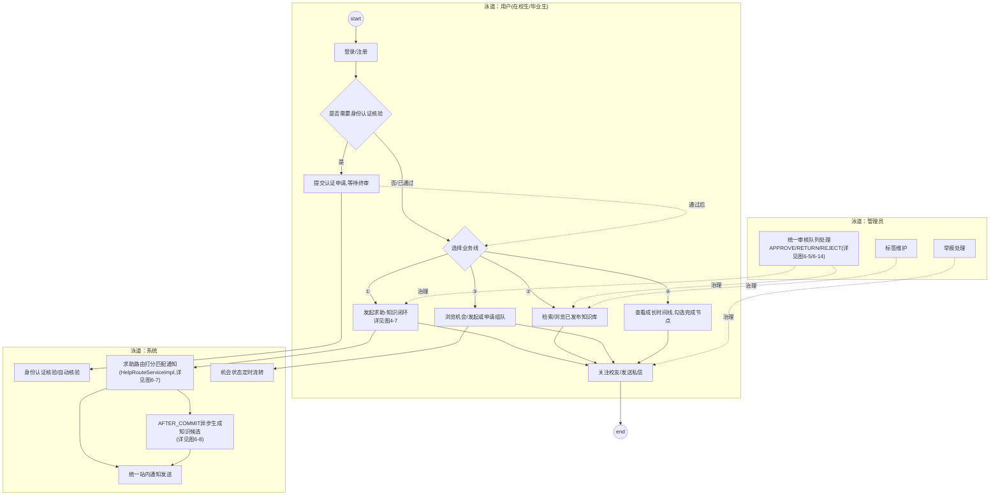
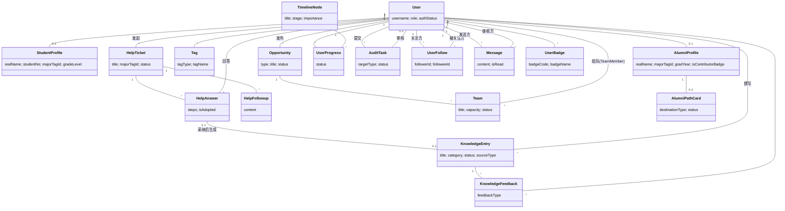
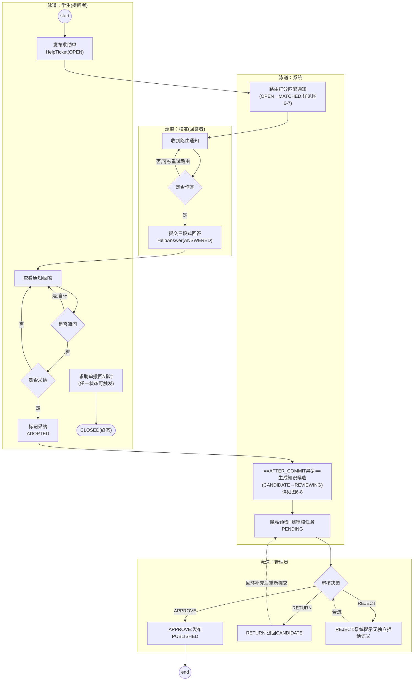
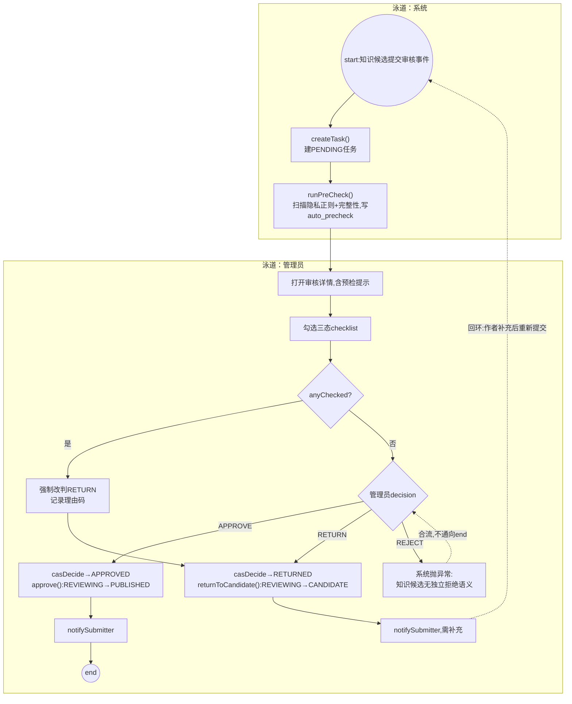
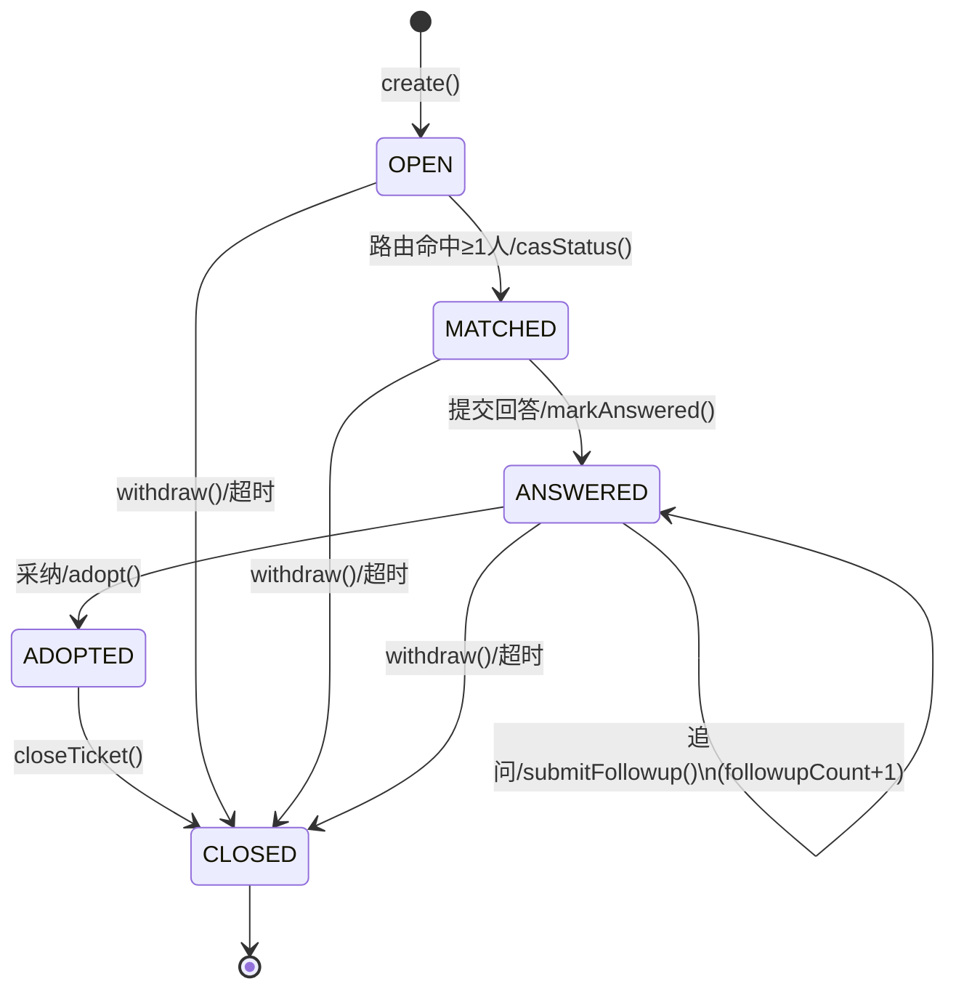
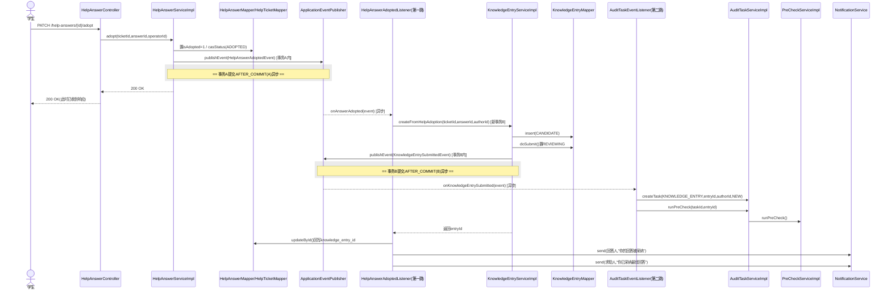
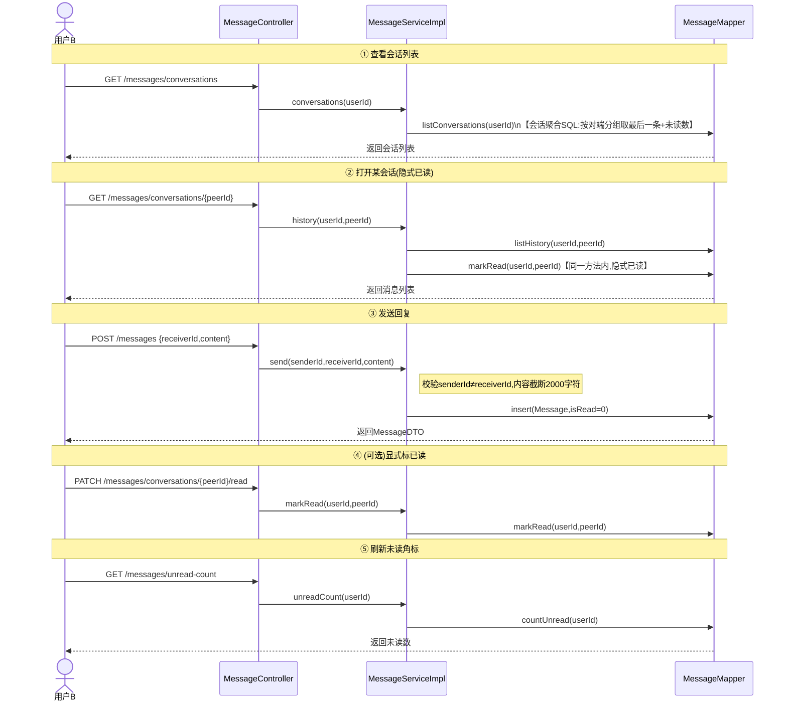
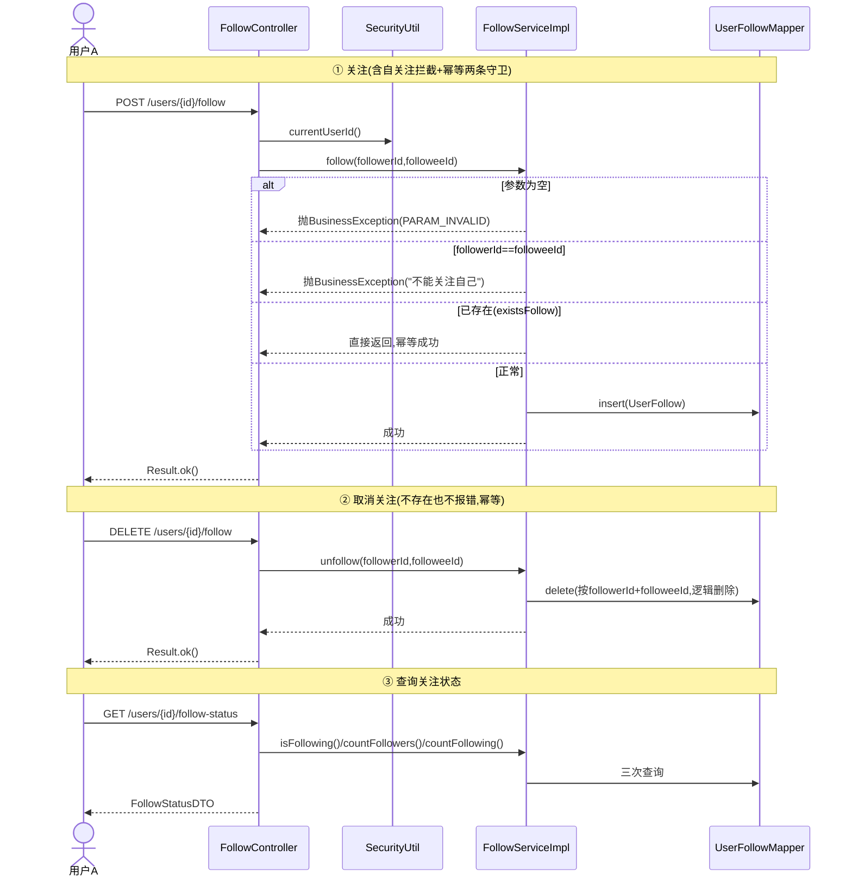

```mermaid
classDiagram
  class AuditTargetHandler {
    <<interface>>
    +targetType() String
    +supportsBatch() boolean
    +handle(Long targetId, Long reviewerId, AuditDecision decision, String comment) void
  }
  class AuthApplicationAuditHandler
  class KnowledgeEntryAuditHandler {
    +handle(...) : APPROVE→approve()/RETURN→returnToCandidate()/REJECT→抛异常(不支持)
  }
  class OpportunityAuditHandler
  class ContributorCertAuditHandler

  class AuditTask {
    targetType; targetId; submitterId; reviewKind; status; autoPrecheck; reviewerId;
    decisionNote; decidedAt
  }
  class Report { targetType; targetId; reporterId; reason; status; handlerId; handleNote }
  class Tag { tagType; tagName; parentId; sortOrder }

  class AuditTaskService { <<interface>> }
  class AuditTaskServiceImpl {
    -Map~String,AuditTargetHandler~ handlers
    +createTask()
    +recordAutoApproved()
    +runPreCheck()
    +decide()
    +batchDecide()
  }
  class AuditTaskEventListener {
    +onAuthApplicationSubmitted()
    +onKnowledgeEntrySubmitted()
    +onOpportunitySubmitted()
  }
  class PreCheckService { <<interface>> }
  class PreCheckServiceImpl
  class AuditTaskController

  AuthApplicationAuditHandler ..|> AuditTargetHandler
  KnowledgeEntryAuditHandler ..|> AuditTargetHandler
  OpportunityAuditHandler ..|> AuditTargetHandler
  ContributorCertAuditHandler ..|> AuditTargetHandler
  AuditTaskServiceImpl ..|> AuditTaskService
  AuditTaskServiceImpl "1" o-- "*" AuditTargetHandler : 聚合,按targetType分发
  AuditTaskServiceImpl --> AuditTaskMapper
  AuditTaskEventListener --> AuditTaskService
  AuditTaskController --> AuditTaskService
  AuditTaskServiceImpl ..> PreCheckService : 依赖(runPreCheck)
```

# G组 新增16图：总体业务/领域模型/核心流程/社交域/治理域补全

> **方法学约束**：全篇只用 UML（类图/活动图/时序图/状态图），E-R 图作为数据库概念设计单独保留；不出现数据流图（DFD）、程序流程图、结构化模块图。与旧大纲（`docs/论文大纲_初版.md`，v1初稿仍含DFD/程序流程图条目）冲突之处，以本文件为准——DFD类条目已被面向对象方法学的活动图/类图/领域概念模型整体替代。

## 0 本组图章节定位总表

| 图号 | 图题 | 图类型 | 放置章节 | 与旧图关系 |
|---|---|---|---|---|
| 图2-3 | 系统总体业务活动图 | UML活动图 | 二 可行性研究 §4.2 处理流程和数据流程 | 替代旧"图2 建议系统顶层数据流图" |
| 图4-6 | 领域概念类图（分析级） | UML类图（概念级） | 四 需求分析 §3.2 用例模型与领域概念模型 | 替代旧"图12/13 一层/二层DFD" |
| 图4-7 | 核心业务活动图（求助→采纳→生成候选→审核→发布） | UML活动图 | 四 需求分析 §3.2 | 替代旧"图14 新生落地活动图"位置 |
| 图5-3 | 系统E-R图（29表突出核心域） | E-R图 | 五 概要设计 §5.1 概念结构设计 | 合并旧"图18/19/20"三张分体E-R为一张 |
| 图6-3 | 用户认证模块类图 | UML类图 | 六 详细设计 §6.2 认证域(M1) | 更新旧图24 |
| 图6-4 | 知识库模块类图 | UML类图 | 六 详细设计 §6.3 知识库域(M3) | 更新旧图26 |
| 图6-5 | 知识候选审核活动图（系统/管理员两泳道） | UML活动图 | 六 详细设计 §6.3 | 替代旧图37，补全REJECT守卫分支 |
| 图6-6 | 结构化求助单状态图 | UML状态图 | 六 详细设计 §6.4 求助域(M4) | 更新旧图27 |
| 图6-7 | 校友路由匹配活动图（含权重公式） | UML活动图 | 六 详细设计 §6.4 | 替代旧图39"程序流程图"（结构化工具，按硬规则改活动图） |
| 图6-8 | 核心业务闭环时序图（AFTER_COMMIT异步） | UML时序图 | 六 详细设计 §6.4 | 更新旧图33，补全两跳异步链 |
| 图6-9 | 机会与组队模块类图 | UML类图 | 六 详细设计 §6.5 机会与组队域(M5) | 新绘 |
| 图6-10 | 成长时间线模块类图 | UML类图 | 六 详细设计 §6.6 成长时间线域(M6) | 新绘 |
| 图6-11 | 社交模块类图（四组） | UML类图 | 六 详细设计 §6.7 社交域（新增小节） | 全新模块 |
| 图6-12 | 私信消息中心时序图 | UML时序图 | 六 详细设计 §6.7 | 全新 |
| 图6-13 | 关注时序图 | UML时序图 | 六 详细设计 §6.7 | 全新 |
| 图6-14 | 平台治理模块类图 | UML类图 | 六 详细设计 §6.8 管理与治理域(M7) | 补全并突出`AuditTargetHandler`策略模式 |

> 章节编号口径：把六"详细设计§3设计说明"的域顺序调整为"认证→知识库→求助→机会组队→时间线→社交→治理"（原大纲为"认证→求助→知识库…"），因图6-5审核流程与图6-4知识库类图强耦合，放在其后叙述更连贯；并新插入"社交域"小节。若定稿仍想保留原域顺序，只需替换上表"放置章节"列，不影响图内容本身。

## 通用Visio操作说明（各图公共前提）

- **类图**：`文件→新建→类别"软件和数据库"→模板"UML模型图"`，模具勾选 **UML 静态结构**；继承=空心三角实线，接口实现=空心三角虚线，依赖=虚线开箭头，关联=实线（可加多重性），聚合=空心菱形，组合=实心菱形。
- **活动图**：同模板勾选 **UML 活动**；需要泳道时另开 `类别"流程图"→模具"跨职能流程图"` 拖泳道容器打底，把UML活动的动作/判定形状拖入对应泳道，两个模具混用。
- **时序图**：勾选 **UML 时序**；Visio自带模具对"交互框(alt/loop)"和"事务提交分隔线"支持弱，统一用"矩形虚线框+文字标签"手工模拟。
- **状态图**：勾选 **UML 状态机**：初始伪状态(实心圆)/状态(圆角矩形)/终止状态(靶心圆)/转移(带"事件/守卫"标签箭头)。
- **E-R图**：`类别"软件和数据库"→模板"数据库模型图"`，模具 **Entity Relationship**，Crow's Foot记法，29表太多用色块先分6域再拖实体。
- **工具链**：先把mermaid源码粘到 `https://mermaid.live` 渲染核对结构，再用Visio对应模具1:1重绘、配色区分域。

---

## 图2-3 系统总体业务活动图

- **图类型**：UML活动图。原题"业务流程图"按硬规则（业务流程一律用活动图，不用流程图）改画为活动图。
- **放哪节**：二 可行性研究 §4.2 处理流程和数据流程（替代结构化分析的顶层数据流图）。
- **Visio模具**：UML活动 + 跨职能流程图（三泳道：用户/系统/管理员）。
- **元素清单**：三泳道`用户(在校生/毕业生)`/`系统`/`管理员`。用户泳道：注册登录→(可选)认证申请→判定分叉四条业务线：①发起求助-知识闭环(折叠,详见图4-7)②检索浏览知识库③机会与组队④成长时间线；旁支：关注/私信。系统泳道：认证核验、路由匹配通知(详见图6-7)、AFTER_COMMIT异步生成知识候选(详见图6-8)、机会状态定时流转、统一通知发送。管理员泳道：审核队列(详见图6-5/6-14)、标签维护、举报处理。
- **关系流转**：start→登录/注册→判定是否需认证核验→(是)提交申请等终审→合流→判定分叉四条业务线（求助线只画折叠动作，不与图4-7重复）→均可触达关注/私信旁支→汇合→管理员治理贯穿全程→end（循环回登录后可选业务）。
- **AI画图提示词**：

```
你是一名精通UML与Visio制图的助手。请严格按以下真实项目基准信息绘制一张 UML活动图（不是传统
流程图），标题《系统总体业务活动图》，图号2-3，不要增加基准之外的臆造动作/角色。

【项目背景】
《新疆大学校友圈与双圈成长导航平台》是B/S前后端分离的校园成长导航系统，核心业务是"结构化
求助→校友回答→采纳→沉淀为知识条目→审核发布"的知识沉淀闭环，同时提供机会与组队、成长时间线、
关注/私信/徽章等社交功能，由管理员统一治理内容。

【图类型与规范】
UML活动图，三泳道：用户(在校生/毕业生)/系统/管理员。只用：黑色实心圆(初始)、靶心圆(结束)、
圆角矩形(动作)、菱形(判定/合并)、箭头(控制流,可加标签)。

【泳道与动作清单】
用户泳道：登录/注册→(可选)提交身份认证申请→判定分叉→①发起求助-知识闭环(折叠动作,展开见
另一张"核心业务活动图")②检索/浏览已发布知识库③浏览机会/发起或申请组队④查看成长时间线并
勾选完成节点；旁支：关注校友、发送私信。
系统泳道：身份认证核验、求助路由打分匹配通知(详见另一张"路由匹配活动图")、采纳后异步生成
知识候选、机会状态定时流转、统一站内通知发送。
管理员泳道：统一审核队列处理(APPROVE/RETURN/REJECT)、标签维护、举报处理。

【流转关系】
start→登录/注册→判定"是否需要认证核验"→是→提交申请等待终审；否/通过后→合流→判定分叉进
四条业务线(标好序号①②③④)→各线均可触达"关注/私信"旁支→汇合→管理员治理贯穿全程(与四条业务
线之间画依赖/审核箭头)→end(循环回"登录后可选业务")。

【输出要求】
1. 输出一份可在 https://mermaid.live 直接渲染的 mermaid flowchart 源码（subgraph模拟三泳道）；
2. 额外输出"Visio绘制清单"：模具名称(UML活动+跨职能流程图)、每个形状对应的动作、连接线类型；
3. 不要新增基准未提供的动作、角色或分支。

参考 mermaid 源码：

```

---

## 图4-6 领域概念类图（分析级，替代顶层DFD）

- **图类型**：UML类图（分析级/概念类图，Domain Model，只画类名+关键属性，不画方法）。
- **放哪节**：四 需求分析 §3.2 用例模型与领域概念模型（紧接用例图之后，替代一层/二层DFD角色）。
- **Visio模具**：UML静态结构，只用Class+Association/Generalization，不需要Interface/Package。
- **元素清单（18个领域概念）**：`User`(username,role,authStatus)、`StudentProfile`(realName,studentNo,majorTagId,gradeLevel)、`AlumniProfile`(realName,majorTagId,gradYear,isContributorBadge)、`Tag`(tagType,tagName)、`HelpTicket`(title,majorTagId,status)、`HelpAnswer`(steps,isAdopted)、`HelpFollowup`(content)、`KnowledgeEntry`(title,category,status,sourceType)、`KnowledgeFeedback`(feedbackType)、`Opportunity`(type,title,status)、`Team`(title,capacity,status)、`TimelineNode`(title,stage,importance)、`UserProgress`(status)、`AuditTask`(targetType,status)、`UserFollow`(followerId,followeeId)、`Message`(content,isRead)、`UserBadge`(badgeCode,badgeName)、`AlumniPathCard`(destinationType,status)。
- **关系流转**：User 1--0..1 StudentProfile/AlumniProfile；AlumniProfile 1--0..2 AlumniPathCard；User 1--* HelpTicket(发起)；HelpTicket 1--* HelpAnswer/HelpFollowup；User 1--* HelpAnswer(回答)；HelpAnswer 0..1--0..1 KnowledgeEntry(采纳后生成)；User 1--* KnowledgeEntry(撰写)；KnowledgeEntry 1--* KnowledgeFeedback；User 1--* KnowledgeFeedback；User 1--* Opportunity(发布)；Opportunity 1--* Team；Team *--* User(经TeamMember)；User 1--* UserProgress；TimelineNode 1--* UserProgress；User 1--* AuditTask(提交/审核两条)；User 1--* UserFollow(自关联follower/followee)；User 1--* Message(自关联sender/receiver)；User 1--* UserBadge；User *--* Tag(经UserTag)。
- **AI画图提示词**：

```
你是一名精通UML与Visio制图的助手。请按以下真实项目基准绘制一张"分析级"UML类图，标题
《领域概念类图》，图号4-6，用于需求分析阶段（不画方法、不画Controller/Service/Mapper实现层
类，只画业务领域名词及关系），不要增加基准之外的类或属性。

【项目背景】
系统涉及"用户与认证""求助与知识沉淀""机会与组队""成长时间线""治理""社交"六大业务域，
数据库共29张表，本图挑选18个最能代表业务语义的核心领域概念。

【图类型与规范】
UML类图（分析级）。每个类只画"类名"+2~4个关键属性两段，不画方法段。关系用关联线(标注角色名/
多重性)，不使用继承。

【类与关键属性】
User(username,role,authStatus) / StudentProfile(realName,studentNo,majorTagId,gradeLevel) /
AlumniProfile(realName,majorTagId,gradYear,isContributorBadge) / Tag(tagType,tagName) /
HelpTicket(title,majorTagId,status) / HelpAnswer(steps,isAdopted) / HelpFollowup(content) /
KnowledgeEntry(title,category,status,sourceType) / KnowledgeFeedback(feedbackType) /
Opportunity(type,title,status) / Team(title,capacity,status) / TimelineNode(title,stage,importance) /
UserProgress(status) / AuditTask(targetType,status) / UserFollow(followerId,followeeId) /
Message(content,isRead) / UserBadge(badgeCode,badgeName) / AlumniPathCard(destinationType,status)

【关系与多重性】
User 1--0..1 StudentProfile；User 1--0..1 AlumniProfile；AlumniProfile 1--0..2 AlumniPathCard；
User 1--* HelpTicket(发起)；HelpTicket 1--* HelpAnswer；HelpTicket 1--* HelpFollowup；
User 1--* HelpAnswer(回答)；HelpAnswer 0..1--0..1 KnowledgeEntry(采纳后生成)；
User 1--* KnowledgeEntry(撰写)；KnowledgeEntry 1--* KnowledgeFeedback；User 1--* KnowledgeFeedback；
User 1--* Opportunity(发布)；Opportunity 1--* Team；Team *--* User(通过TeamMember关联类)；
User 1--* UserProgress；TimelineNode 1--* UserProgress；User 1--* AuditTask(提交)；
User 0..1--* AuditTask(审核)；User 1--* UserFollow(自关联,关注方/被关注方两个角色)；
User 1--* Message(自关联,发送方/接收方两个角色)；User 1--* UserBadge；User *--* Tag(通过UserTag)。

【输出要求】
1. 输出可在 https://mermaid.live 渲染的 mermaid classDiagram 源码；
2. 额外输出"Visio绘制清单"：18个Class形状+对应关联线/角色标签/多重性；
3. 不要增加基准未列出的属性或类；自关联(User对UserFollow/Message)务必标出两个不同角色名。

参考 mermaid 源码：

```

---

## 图4-7 核心业务活动图（求助→采纳→生成候选→审核→发布）

- **图类型**：UML活动图。
- **放哪节**：四 需求分析 §3.2（紧接用例模型之后；图2-3中折叠动作在本图展开）。
- **Visio模具**：UML活动 + 跨职能流程图（四泳道：学生/校友/系统/管理员）。
- **元素清单**：学生泳道：发布求助单(OPEN)→查看回答→(可选)追问→采纳。校友泳道：收通知→判定是否作答→提交三段式回答(ANSWERED)。系统泳道：路由匹配通知(OPEN→MATCHED,详见图6-7)→AFTER_COMMIT异步生成知识候选(CANDIDATE→REVIEWING,详见图6-8)→隐私预检→建审核任务(PENDING)。管理员泳道：审核决策(APPROVE/RETURN/REJECT,RETURN细节见图6-5)。
- **关系流转**：start→学生发布求助单→系统路由匹配通知→校友查看→判定是否作答(否→可被重试路由)→是→提交回答→学生查看→判定是否追问(是,自环)→判定是否采纳(否→保持ANSWERED)→是→标记采纳→系统AFTER_COMMIT异步生成候选→隐私预检+建审核任务→管理员审核决策三分支：APPROVE→发布→end；RETURN→退回CANDIDATE，回环连回"隐私预检"节点；REJECT→系统提示无独立拒绝语义，合流回决策点。另一条独立分支：求助单在OPEN/MATCHED/ANSWERED任一状态可撤回/超时直接CLOSED，与采纳主干并列。
- **AI画图提示词**：

```
你是一名精通UML与Visio制图的助手。请按以下真实项目基准绘制一张UML活动图，标题《核心业务活动图
（求助→采纳→生成候选→审核→发布）》，图号4-7，四条泳道，不要增加基准之外的分支或角色。

【项目背景】
这是本系统"系统灵魂"闭环：学生发结构化求助单→系统按权重算法路由给最合适的校友→校友三段式
作答→学生采纳→系统在事务提交后异步把回答转化为知识候选→管理员审核→发布为可检索的知识条目。

【泳道与动作】
学生(提问者)：发布求助单(HelpTicket,OPEN)→查看通知/回答→(可选)追问→采纳最佳回答。
校友(回答者)：收到路由通知→判定是否作答→提交三段式回答(precondition/steps/cautions,ANSWERED)。
系统：路由打分匹配通知(OPEN→MATCHED)→采纳后AFTER_COMMIT异步生成知识候选
(CANDIDATE→REVIEWING)→隐私预检→建审核任务(PENDING)。
管理员：处理审核队列→决策分三支APPROVE/RETURN/REJECT。

【流转关系，含判定与回环】
start→学生:发布求助单(OPEN)→系统:路由匹配通知(OPEN→MATCHED)→校友:查看通知→
判定"是否作答"→否→(可被重试路由,虚线回边)；是→校友:提交回答(ANSWERED)→学生:查看回答→
判定"是否追问"→是(自环)→提交追问,followupCount+1,回到"查看回答"；否→
判定"是否采纳"→否→保持ANSWERED；是→学生:标记采纳(ADOPTED)→
系统:"==AFTER_COMMIT异步=="生成知识候选(CANDIDATE→REVIEWING)→系统:隐私预检+建审核任务(PENDING)→
管理员:审核决策→三分支：APPROVE→知识条目发布(PUBLISHED)→end；
RETURN→退回作者补充(REVIEWING→CANDIDATE)，回指到"隐私预检"节点形成回环；
REJECT→系统提示"知识候选无独立拒绝语义，仅支持通过/退回"，合流回"审核决策"节点。
另一条独立分支：求助单在OPEN/MATCHED/ANSWERED任一状态可"撤回/超时"直接到CLOSED(终态)，
与采纳主干并列，不要漏画。

【输出要求】
1. 输出可在 https://mermaid.live 渲染的 mermaid flowchart 源码（subgraph模拟四泳道）；
2. 额外输出"Visio绘制清单"：形状清单+每个动作所在泳道+判定框分支标签+回环箭头位置；
3. 不要省略"求助单撤回/超时→CLOSED"分支，也不要省略RETURN的回环箭头。

参考 mermaid 源码：

```

---

## 图5-3 系统E-R图（29表突出核心域）

- **图类型**：E-R图（数据库概念结构设计，方法学允许保留）。
- **放哪节**：五 概要设计 §5.1 概念结构设计（E-R图）。
- **Visio模具**：数据库模型图模板→模具Entity Relationship，Crow's Foot记法；29实体先分6域用色块打底，核心域(求助+知识)加粗突出。
- **元素清单（29表按6域，与schema.sql完全一致）**：用户与认证域(7)：user/student_profile/alumni_profile/auth_application/mock_student_roster/tag/user_tag。求助与知识域(6,核心域)：knowledge_entry/knowledge_feedback/help_ticket/help_answer/help_followup/help_route。机会与组队域(4)：opportunity/team/team_member/referral_ticket。成长与路径域(6)：alumni_path_card/path_visibility/timeline_template/timeline_node/timeline_node_ref/user_progress。治理与通知域(3)：audit_task/report/notification。社交域(3,新增)：user_follow/message/user_badge。多态引用(虚线+注释,不建物理外键)：timeline_node_ref.ref_id、audit_task.target_id、report.target_id、notification.ref_id。
- **关系流转**：user 1--0..1 student_profile/alumni_profile；user 1--* auth_application；alumni_profile 1--* alumni_path_card 1--* path_visibility；user *--* tag(经user_tag)；user 1--* help_ticket(asker)→1--* help_answer/help_followup/help_route；user 1--* help_answer(responder)/help_route(matchedUser)；user 1--* knowledge_entry(author)→1--* knowledge_feedback；help_ticket 1--0..1 knowledge_entry(来源)；help_answer 1--0..1 knowledge_entry(回写)；user 1--* opportunity(publisher)→1--* team→1--* team_member←*--user；opportunity 1--* referral_ticket；tag 1--* timeline_template→1--* timeline_node→1--* timeline_node_ref(多态)；user *--* timeline_node(经user_progress)；user 1--* audit_task/report/notification(均含多态target)；user 1--* user_follow(自关联)/message(自关联)/user_badge。
- **AI画图提示词**：

```
你是一名精通数据库建模与Visio制图的助手。请按以下真实schema.sql基准绘制一张E-R图(Crow's
Foot记法)，标题《系统E-R图（29表，突出核心域）》，图号5-3，不要增加基准之外的表或字段。

【项目背景】
数据库共29张表，划分为6个业务域：用户与认证(7)/求助与知识(6,核心域)/机会与组队(4)/
成长与路径(6)/治理与通知(3)/社交(3)。请用色块或分组框区分6个域，核心域(求助+知识)边框加粗。

【29个实体，逐个只列PK/关键FK/1-2个定义性字段(完整字段以物理设计章节为准)】
用户与认证域：user(id,username,role,authStatus) / student_profile(user_id FK,realName,studentNo) /
alumni_profile(user_id FK,realName,gradYear) / auth_application(user_id FK,status) /
mock_student_roster(studentNo PK,realName) / tag(id,tagType,tagName) / user_tag(user_id FK,tag_id FK)
求助与知识域(核心)：knowledge_entry(id,title,authorId FK,status,sourceHelpId FK) /
knowledge_feedback(entry_id FK,user_id FK,feedbackType) / help_ticket(id,askerId FK,status) /
help_answer(ticket_id FK,responderId FK,isAdopted,knowledgeEntryId FK) /
help_followup(ticket_id FK,fromUserId FK) / help_route(ticket_id FK,matchedUserId FK,matchScore)
机会与组队域：opportunity(id,publisherId FK,status) / team(id,opportunityId FK,leaderId FK,status) /
team_member(team_id FK,user_id FK,joinStatus) / referral_ticket(referrerId FK,applicantId FK,
opportunityId FK,status)
成长与路径域：alumni_path_card(user_id FK,destinationType,status) / path_visibility(path_card_id FK,
fieldGroup,visibility) / timeline_template(id,majorTagId FK,routeType) /
timeline_node(template_id FK,stage) / timeline_node_ref(node_id FK,refType,refId多态) /
user_progress(user_id FK,node_id FK,status)
治理与通知域：audit_task(id,targetType,targetId多态,submitterId FK,reviewerId FK,status) /
report(targetType,targetId多态,reporterId FK,status) / notification(user_id FK,type,refId多态,isRead)
社交域(新增)：user_follow(followerId FK,followeeId FK) / message(senderId FK,receiverId FK,isRead) /
user_badge(user_id FK,badgeCode,pinned,hidden)

【关系】
user 1--0..1 student_profile；user 1--0..1 alumni_profile；user 1--* auth_application；
alumni_profile 1--* alumni_path_card；alumni_path_card 1--* path_visibility；
user *--* tag(经user_tag)；user 1--* help_ticket(asker)；help_ticket 1--* help_answer；
help_ticket 1--* help_followup；help_ticket 1--* help_route；user 1--* help_answer(responder)；
user 1--* help_route(matchedUser)；user 1--* knowledge_entry(author)；
knowledge_entry 1--* knowledge_feedback；help_ticket 1--0..1 knowledge_entry(来源)；
help_answer 1--0..1 knowledge_entry(回写)；user 1--* opportunity(publisher)；
opportunity 1--* team；team *--* user(经team_member)；opportunity 1--* referral_ticket；
user 1--* referral_ticket(applicant/referrer两条)；tag 1--* timeline_template；
timeline_template 1--* timeline_node；timeline_node 1--* timeline_node_ref(多态,虚线+注释)；
user *--* timeline_node(经user_progress)；user 1--* audit_task(submitter/reviewer两条,多态target
虚线+注释)；user 1--* report(reporter,多态target虚线+注释)；user 1--* notification(多态ref虚线+
注释)；user 1--* user_follow(follower/followee两个自关联角色)；user 1--* message(sender/receiver
两个自关联角色)；user 1--* user_badge。

【输出要求】
1. 输出可在 https://mermaid.live 渲染的 mermaid erDiagram 源码；
2. 额外输出"Visio绘制清单"：29实体形状+6分组色块+核心域加粗标注+多态引用虚线画法；
3. 多态外键不要画成普通实线外键，务必用虚线+注释"多态,按type字段指向不同表"。

参考 mermaid 源码：
```mermaid
erDiagram
  user ||--o| student_profile : has
  user ||--o| alumni_profile : has
  user ||--o{ auth_application : submits
  alumni_profile ||--o{ alumni_path_card : has
  alumni_path_card ||--o{ path_visibility : has
  user ||--o{ user_tag : has
  tag ||--o{ user_tag : tagged
  user ||--o{ help_ticket : asks
  help_ticket ||--o{ help_answer : answered_by
  help_ticket ||--o{ help_followup : followed_up
  help_ticket ||--o{ help_route : routed
  user ||--o{ help_answer : responds
  user ||--o{ help_route : matched
  user ||--o{ knowledge_entry : authors
  knowledge_entry ||--o{ knowledge_feedback : feedback
  help_ticket ||--o| knowledge_entry : source_of
  help_answer ||--o| knowledge_entry : generates
  user ||--o{ opportunity : publishes
  opportunity ||--o{ team : has
  team ||--o{ team_member : has
  user ||--o{ team_member : joins
  opportunity ||--o{ referral_ticket : has
  user ||--o{ referral_ticket : applies
  tag ||--o{ timeline_template : scoped_by
  timeline_template ||--o{ timeline_node : has
  timeline_node ||--o{ timeline_node_ref : refs
  user ||--o{ user_progress : tracks
  timeline_node ||--o{ user_progress : tracked_by
  user ||--o{ audit_task : submits
  user ||--o{ report : reports
  user ||--o{ notification : receives
  user ||--o{ user_follow : follows
  user ||--o{ message : sends
  user ||--o{ user_badge : owns

  user { bigint id PK; varchar username; varchar role; varchar authStatus }
  knowledge_entry { bigint id PK; varchar title; bigint authorId FK; varchar status }
  help_ticket { bigint id PK; bigint askerId FK; varchar status }
  audit_task { bigint id PK; varchar targetType; bigint targetId "多态,非物理FK"; varchar status }
```
```

---

## 图6-3 用户认证模块类图

- **图类型**：UML类图。
- **放哪节**：六 详细设计 §6.2 认证域(M1)。
- **Visio模具**：UML静态结构。
- **元素清单**：`User`(继承BaseEntity: username,passwordHash,role,authStatus,status,contactVisibility,profileVisibility)；`StudentProfile`(userId,realName,studentNo,majorTagId,gradeLevel,gpa)；`AlumniProfile`(userId,realName,majorTagId,gradYear,degreeType,isContributorBadge,helpedCount,adoptedCount)；`AuthApplication`(继承BaseEntity: userId,applyRole,verifyMethod,guarantor1Id,guarantor2Id,guarantor1Status,guarantor2Status,status,autoApproved)；`MockStudentRoster`(studentNo PK,realName,college,majorName)。`AuthController`(register/login/refresh/logout)、`AuthApplicationController`、`UserController`、`InviteCodeController`。`AuthApplicationService`/`AuthApplicationServiceImpl`(submit/confirmGuarantee/withdraw/resubmit/approve/reject/returnForSupplement)；`AuthTokenService`/`AuthTokenServiceImpl`；`JwtUtil`(generate(userId,role,authStatus)/parse(token))；`SecurityUtil`(currentUserId())；事件`AuthApplicationSubmittedEvent`(appId,autoApproved)。
- **关系流转**：User 1--0..1 StudentProfile/AlumniProfile；AuthApplication *--1 User(申请人)/*--0..1 User(担保人1/2)；AuthApplicationServiceImpl实现接口、依赖Mapper、发布事件；AuthTokenServiceImpl依赖JwtUtil。
- **AI画图提示词**：

```
你是一名精通UML与Visio制图的助手。请按以下真实源码信息绘制一张详细设计级UML类图，标题
《用户认证模块类图》，图号6-3，不要增加基准之外的类/字段/方法。

【项目背景】
认证模块负责登录注册(JWT无状态鉴权)与身份认证申请(在校生/毕业生两种申请路径，毕业生走
"双人担保确认"或"邀请码"，SSO/邀请码可自动通过)。

【类清单】
实体：User(继承BaseEntity: id/deleted/createdAt/updatedAt; +username,passwordHash,role,authStatus,
status,contactVisibility,profileVisibility) / StudentProfile(userId,realName,studentNo,majorTagId,
gradeLevel,gpa) / AlumniProfile(userId,realName,majorTagId,gradYear,degreeType,isContributorBadge,
helpedCount,adoptedCount) / AuthApplication(继承BaseEntity; userId,applyRole,verifyMethod,
guarantor1Id,guarantor2Id,guarantor1Status,guarantor2Status,status,autoApproved) /
MockStudentRoster(studentNo PK,realName,college,majorName)。
Controller：AuthController(+register()/+login()/+refresh()/+logout()) / AuthApplicationController /
UserController / InviteCodeController。
Service：AuthApplicationService<<interface>> / AuthApplicationServiceImpl(+submit()/
+confirmGuarantee()/+withdraw()/+resubmit()/+approve()/+reject()/+returnForSupplement()) /
AuthTokenService<<interface>> / AuthTokenServiceImpl / UserService<<interface>> / UserServiceImpl。
common层：JwtUtil(-secret,-expireMinutes; +generate(Long userId,String role,String authStatus):String;
+parse(String token):Claims) / SecurityUtil(+currentUserId():Long,静态方法)。
事件：AuthApplicationSubmittedEvent(appId,autoApproved)。

【关系】
User 1--0..1 StudentProfile；User 1--0..1 AlumniProfile；AuthApplication *--1 User(申请人)；
AuthApplication *--0..1 User(担保人1)；AuthApplication *--0..1 User(担保人2)；
AuthApplicationServiceImpl ..|> AuthApplicationService(实现)；
AuthApplicationServiceImpl --> AuthApplicationMapper(依赖)；
AuthApplicationServiceImpl ..> AuthApplicationSubmittedEvent(发布)；
AuthController --> AuthTokenService(依赖)；AuthTokenServiceImpl --> JwtUtil(依赖)；
AuthApplicationController --> AuthApplicationService(仅经接口调用)；
AuthApplicationServiceImpl ..> MockStudentRoster(依赖,核验查询)。

【输出要求】
1. 输出可在 https://mermaid.live 渲染的 mermaid classDiagram 源码；
2. 额外输出"Visio绘制清单"：形状+构造型(<<interface>>)+连接线类型对照表；
3. 不要给User加密码明文字段，保留passwordHash字段名以体现"不存明文，BCrypt"这一安全设计点。
```
```

---

## 图6-4 知识库模块类图

- **图类型**：UML类图。
- **放哪节**：六 详细设计 §6.3 知识库域(M3)。
- **Visio模具**：UML静态结构。
- **元素清单**：`KnowledgeEntry`(继承BaseEntity: title,content,category,authorId,applicableScope,validUntil,externalUrl,status[CANDIDATE/REVIEWING/PUBLISHED/EXPIRED/OFFLINE],sourceType[ORIGINAL/FROM_HELP],sourceHelpId,claimerId,viewCount,version)；`KnowledgeFeedback`(继承BaseEntity: entryId,userId,feedbackType[USEFUL/OUTDATED/NEED_UPDATE],comment)。`KnowledgeEntryController`/`KnowledgeEntryService`/`KnowledgeEntryServiceImpl`(create/createFromHelpAdoption/getById/list/search/submitForReview/approve/returnToCandidate/offline)；`KnowledgeEntryMapper`(继承BaseMapper：countBySourceHelpId/incrementViewCount/全文检索)；跨模块依赖`HelpAnswerService.getForCandidate()`；事件`KnowledgeEntrySubmittedEvent`(entryId,authorId,isRevision)。
- **关系流转**：KnowledgeEntry 1--* KnowledgeFeedback；ServiceImpl依赖Mapper、依赖HelpAnswerService(跨模块契约)、发布事件。
- **AI画图提示词**：

```
你是一名精通UML与Visio制图的助手。请按以下真实源码信息绘制一张详细设计级UML类图，标题
《知识库模块类图》，图号6-4，不要增加基准之外的类/字段/方法。

【项目背景】
知识库模块承载"原创发布"与"求助采纳自动转化"两种知识条目来源，含五态状态机
(CANDIDATE/REVIEWING/PUBLISHED/EXPIRED/OFFLINE)、乐观锁并发编辑、三态用户反馈、
MySQL FULLTEXT+ngram中文全文检索。

【类清单】
实体：KnowledgeEntry(继承BaseEntity; title,content,category,authorId,applicableScope,validUntil,
externalUrl,status,sourceType,sourceHelpId,claimerId,viewCount,version) /
KnowledgeFeedback(继承BaseEntity; entryId,userId,feedbackType,comment)。
Controller/Service：KnowledgeEntryController / KnowledgeEntryService<<interface>> /
KnowledgeEntryServiceImpl(+create()/+createFromHelpAdoption(Long helpTicketId,Long helpAnswerId,
Long authorId):Long/+getById()/+list()/+search()/+submitForReview()/+approve()/
+returnToCandidate()/+offline()) / KnowledgeFeedbackController / KnowledgeFeedbackService<<interface>>
/ KnowledgeFeedbackServiceImpl。
Mapper：KnowledgeEntryMapper<<interface>>(继承BaseMapper~KnowledgeEntry~; +countBySourceHelpId()/
+incrementViewCount()/+searchByFulltext())。
跨模块依赖：HelpAnswerService<<interface>>(+getForCandidate(Long helpAnswerId))。
事件：KnowledgeEntrySubmittedEvent(entryId,authorId,isRevision)。

【关系】
KnowledgeEntry 1--* KnowledgeFeedback；KnowledgeEntry --|> BaseEntity；
KnowledgeEntryMapper --|> BaseMapper~KnowledgeEntry~；
KnowledgeEntryServiceImpl ..|> KnowledgeEntryService；KnowledgeEntryServiceImpl --> KnowledgeEntryMapper；
KnowledgeEntryServiceImpl ..> HelpAnswerService(跨模块契约依赖)；
KnowledgeEntryServiceImpl ..> KnowledgeEntrySubmittedEvent(发布)；
KnowledgeEntryController --> KnowledgeEntryService(仅经接口调用)。

【输出要求】
1. 输出可在 https://mermaid.live 渲染的 mermaid classDiagram 源码；
2. 额外输出"Visio绘制清单"；
3. version字段务必标注"乐观锁"，sourceHelpId/sourceType务必标注"求助采纳来源回填"含义。
```
```

---

## 图6-5 知识候选审核活动图（系统/管理员两泳道，APPROVE/RETURN回环/REJECT）

- **图类型**：UML活动图。**关键真实细节**：`AuditDecision`枚举含APPROVE/RETURN/REJECT三值，但真实`KnowledgeEntryAuditHandler`源码对KNOWLEDGE_ENTRY目标类型**显式禁用REJECT**（"知识候选无独立拒绝语义，仅支持通过/退回"，抛`BusinessException`）。因此REJECT在本图**不是终态分支**，而是"系统守卫拦截→提示错误→回到决策点"。
- **放哪节**：六 详细设计 §6.3（紧接图6-4之后；AuditTask类结构详见图6-14）。
- **Visio模具**：UML活动 + 跨职能流程图（两泳道：系统/管理员）。
- **元素清单**：系统泳道：`KnowledgeEntrySubmittedEvent`触发(AFTER_COMMIT)→`AuditTaskEventListener.onKnowledgeEntrySubmitted()`→`createTask(KNOWLEDGE_ENTRY,PENDING)`→同步`runPreCheck()`(`PreCheckServiceImpl`正则扫描手机号/邮箱/身份证号/微信组合+完整性)。管理员泳道：进队列→打开详情(含预检提示)→勾选三态checklist(hasRealName/hasContact/hasLocatableCombo)→`decide(decision,checklistResult)`。
- **关系流转**：判定`anyChecked()`→是→强制`RETURN`；否→按管理员decision三分支：APPROVE→casDecide APPROVED→`approve()`(REVIEWING→PUBLISHED)→通知→end；RETURN(两来源)→casDecide RETURNED→`returnToCandidate()`(REVIEWING→CANDIDATE)→通知→回环连回系统泳道起点；REJECT→抛异常→提示错误→合流回决策点(不通向end)。
- **AI画图提示词**：

```
你是一名精通UML与Visio制图的助手。请按以下真实源码信息绘制一张UML活动图，标题
《知识候选审核活动图（系统/管理员两泳道）》，图号6-5，两条泳道，不要增加基准之外的分支，
尤其不要把REJECT画成正常终态分支——真实代码里REJECT对"知识候选"这个目标类型是被显式拒绝的
非法操作，图中必须体现这一点。

【项目背景】
知识候选(KnowledgeEntry,REVIEWING态)提交审核后，系统先跑自动隐私预检，再进人工审核队列；
管理员可在三态checklist(是否含真实姓名/联系方式/可定位组合)任一勾选时，系统会强制把决定改判
为RETURN，忽略管理员原本选的按钮；管理员正常决策只有APPROVE(发布)和RETURN(退回补充)两个真正
生效的分支，若尝试REJECT，系统会直接抛业务异常拒绝这次操作。

【泳道与动作】
系统泳道：知识候选提交审核事件(AFTER_COMMIT触发)→createTask()建PENDING任务→
runPreCheck()自动扫描隐私正则+完整性，写auto_precheck。
管理员泳道：打开审核详情(含预检提示)→勾选三态checklist(hasRealName/hasContact/
hasLocatableCombo)→判定anyChecked()→是→强制改判RETURN(记录理由码)；否→按管理员实际decision
判定→APPROVE/RETURN/REJECT三分支。

【三分支处理，务必准确】
APPROVE：casDecide(PENDING→APPROVED)→KnowledgeEntryService.approve()(REVIEWING→PUBLISHED)→
notifySubmitter→end。
RETURN(两个来源都指向这里)：casDecide(PENDING→RETURNED)→KnowledgeEntryService.returnToCandidate()
(REVIEWING→CANDIDATE)→notifySubmitter(需补充)→作者补充后重新提交，画一条回环箭头连回
"系统泳道:知识候选提交审核事件"起点。
REJECT：系统抛BusinessException("知识候选无独立拒绝语义，仅支持通过/退回")→系统提示错误→
合流回"管理员:判定decision"节点重新选择，这条分支不通向end。

【输出要求】
1. 输出可在 https://mermaid.live 渲染的 mermaid flowchart 源码(subgraph模拟两泳道)；
2. 额外输出"Visio绘制清单"：判定框标签、checklist强制改判的连线画法、REJECT不通向终态的连线画法；
3. 严禁把REJECT画成"知识条目下线/拒绝发布"这类终态，这是与代码不符的常见臆造错误。

参考 mermaid 源码：

```

---

## 图6-6 结构化求助单状态图

- **图类型**：UML状态图。
- **放哪节**：六 详细设计 §6.4 求助域(M4，系统灵魂)。
- **Visio模具**：UML状态机。
- **元素清单**：状态OPEN(初始)→MATCHED→ANSWERED→ADOPTED→CLOSED(终态)。触发方法：`create()`、`routeHelpTicket()`命中后`casStatus(OPEN,MATCHED)`、`markAnswered()`→ANSWERED(自环:`submitFollowup()`只加followupCount)、`adopt()`→ADOPTED、`closeTicket()`→CLOSED、`withdraw()`或超时重试任务可从任一中间态直接转CLOSED。
- **关系流转**：`[*]→OPEN→MATCHED→ANSWERED(自环)→ADOPTED→CLOSED→[*]`；OPEN/MATCHED/ANSWERED均可直接`→CLOSED`(withdraw/超时)。
- **AI画图提示词**：

```
你是一名精通UML与Visio制图的助手。请按以下真实源码状态枚举绘制一张UML状态图，标题
《结构化求助单状态图》，图号6-6，不要增加基准之外的状态或转移。

【项目背景】
求助单(HelpTicket)是系统核心闭环的起点实体，status字段真实枚举为
OPEN/MATCHED/ANSWERED/ADOPTED/CLOSED，CLOSED为唯一终态，可由正常采纳流程到达，也可由
撤回/超时从中间任一状态直接到达。

【状态与转移】
[*] --> OPEN : create()
OPEN --> MATCHED : 路由命中≥1候选人 / casStatus()
MATCHED --> ANSWERED : 提交回答 / markAnswered()
ANSWERED --> ANSWERED : 追问 / submitFollowup() (自环,只followupCount+1,不改变主状态)
ANSWERED --> ADOPTED : 采纳 / adopt()
ADOPTED --> CLOSED : closeTicket()
OPEN --> CLOSED : withdraw() 或 超时未匹配
MATCHED --> CLOSED : withdraw() 或 超时未回答
ANSWERED --> CLOSED : withdraw() 或 超时未采纳
CLOSED --> [*]

【输出要求】
1. 输出可在 https://mermaid.live 渲染的 mermaid stateDiagram-v2 源码；
2. 额外输出"Visio绘制清单"：初始伪状态/5个状态框/终止状态/9条转移线(含1条自环+3条撤回/超时线)的
   摆放建议(建议把撤回/超时3条线画在图下方，与主干采纳路径视觉区分开)；
3. ANSWERED的自环务必画出，不要漏掉；不要给CLOSED画出任何离开的转移(它是终态)。

参考 mermaid 源码：

```

---

## 图6-7 校友路由匹配活动图（含权重公式）

- **图类型**：UML活动图（替代旧"程序流程图"）。
- **放哪节**：六 详细设计 §6.4 求助域(M4)。
- **Visio模具**：UML活动(单泳道)+一个Note形状放权重公式。
- **元素清单**：**三层候选池**（比常见简化描述多一层）：Tier1同专业已认证校友+同专业高年级学长(排除本人/已匹配)；Tier2不足`MIN_POOL_SIZE=3`人则全平台已认证校友兜底；Tier3仍为空则任一管理员兜底。打分维度：`W_MAJOR=40`、`W_ALUMNI_IDENTITY=15`、`W_GRADE_GAP=5`/级封顶3级、`W_EXPERTISE=6`/次封顶5次、`W_TRUST=3×ln(1+累计被采纳数)`。
- **关系流转**：判定状态OPEN/MATCHED→构建排除集合→Tier1查询→判定size<3→Tier2→判定仍空→Tier3→判定仍空→记录日志结束；否则汇合→逐候选打分→降序排序→取TopK→写help_route+发通知→判定命中数>0→casStatus(OPEN→MATCHED)。
- **AI画图提示词**：

```
你是一名精通UML与Visio制图的助手。请按以下真实源码算法逻辑绘制一张UML活动图（不是程序流程图，
面向对象方法学要求算法流程也用活动图表达），标题《校友路由匹配活动图（含权重公式）》，图号6-7，
不要增加基准之外的分支或简化掉三层候选池中的任何一层。

【项目背景】
这是本系统"系统灵魂"算法：求助单创建/重试时，为其匹配最合适的校友并发通知。候选池采用三层
逐级放宽策略，保证"至少通知到1人"这一验收标准恒成立；打分维度全部是Service层具名常量，不是
硬编码魔法数。

【三层候选池，按顺序，不要省略任何一层】
Tier1：同专业已认证校友 + 同专业高年级学长（先排除求助人本人和已匹配过的人）。
判定候选池是否 < MIN_POOL_SIZE(3人)：是→进入Tier2：全平台已认证校友兜底。
判定候选池是否仍为空：是→进入Tier3：任一管理员兜底（保证≥1次通知）。
判定候选池仍为空：是→记录日志，本轮不产生路由，直接结束。

【打分维度与权重公式，逐候选计算，务必把公式画成一个Note注释框】
score = W_MAJOR(专业相同,+40)
      + [候选人是校友身份?+W_ALUMNI_IDENTITY(15) : 否则若候选人是同专业在校生且年级差>0,
        +W_GRADE_GAP(5)×min(年级差,3)]
      + [该问题类型历史被采纳次数>0? +W_EXPERTISE(6)×min(次数,5) : 0]
      + round(W_TRUST(3)×ln(1+候选人累计被采纳总次数))   // 对数缩放,防头部垄断,不封顶

【打分之后】
按分数降序(同分按userId升序)排序→取TopK(默认5)→逐条写help_route记录(status=NOTIFIED)→
调用NotificationService发通知→判定命中人数>0→是→casStatus(OPEN→MATCHED)；否→直接结束。

【输出要求】
1. 输出可在 https://mermaid.live 渲染的 mermaid flowchart 源码，用一个矩形节点单独放公式文字模拟
   Note注释；
2. 额外输出"Visio绘制清单"：判定框/循环回边/公式Note的摆放建议；
3. 三层候选池的三个判定框不要合并成一个，必须依次画出，这是本图区别于常见简化版本的关键点。

参考 mermaid 源码：
```mermaid
flowchart TD
  s0((start:routeHelpTicket)) --> s1{求助单状态OPEN/MATCHED?}
  s1 -->|否| eEnd1((end,跳过))
  s1 -->|是| s2[构建排除集合:本人+已匹配过的人]
  s2 --> s3["Tier1:同专业已认证校友\n+同专业高年级学长"]
  s3 --> j1{候选池size小于MIN_POOL_SIZE=3?}
  j1 -->|是| s4[Tier2:全平台已认证校友兜底]
  j1 -->|否| merge1[汇合]
  s4 --> j2{候选池仍为空?}
  j2 -->|是| s5[Tier3:任一管理员兜底]
  j2 -->|否| merge1
  s5 --> j3{候选池仍为空?}
  j3 -->|是| s6[记录日志,本轮不产生路由] --> eEnd2((end))
  j3 -->|否| merge1
  merge1 --> note["【权重公式】\nscore = 专业一致?40:0\n+ 校友身份?15:同专业年级差×5(封顶3级)\n+ 该类型历史被采纳次数×6(封顶5次)\n+ round(3×ln(1+累计被采纳数))"]
  note --> s7[逐候选计算score] --> s8[按分数降序,同分userId升序排序] --> s9[取TopK,默认5]
  s9 --> s10[逐条写help_route(NOTIFIED)+发通知]
  s10 --> j4{命中人数大于0?}
  j4 -->|是| s11[casStatus:OPEN→MATCHED] --> eEnd3((end))
  j4 -->|否| eEnd3
```
```

---

## 图6-8 核心业务闭环时序图（AFTER_COMMIT异步）

- **图类型**：UML时序图。**关键真实细节**：真实代码是**两跳独立`@TransactionalEventListener(AFTER_COMMIT)`**串联（采纳事务提交→第一跳异步生成知识候选，其内部又是独立事务→该事务提交→第二跳异步建审核任务），不是常见简化的"一跳"。
- **放哪节**：六 详细设计 §6.4（求助域端到端收尾，横跨求助→知识库→治理三域）。
- **Visio模具**：UML时序；两处事务提交用虚线分隔条+`== AFTER_COMMIT 异步 ==`标签模拟。
- **元素清单**：学生Actor、`HelpAnswerController`、`HelpAnswerServiceImpl`、`HelpAnswerMapper`/`HelpTicketMapper`、`ApplicationEventPublisher`、`HelpAnswerAdoptedListener`(第一跳)、`KnowledgeEntryServiceImpl`、`KnowledgeEntryMapper`、`AuditTaskEventListener`(第二跳)、`AuditTaskServiceImpl`、`PreCheckServiceImpl`、`NotificationService`。
- **关系流转**：adopt()内置isAdopted+casStatus(ADOPTED)+发布`HelpAnswerAdoptedEvent`(事务A内)→事务A提交(AFTER_COMMIT)→`HelpAnswerAdoptedListener.onAnswerAdopted()`→`createFromHelpAdoption()`(新事务B: insert CANDIDATE→doSubmit置REVIEWING→发布`KnowledgeEntrySubmittedEvent`)→事务B提交(AFTER_COMMIT)→`AuditTaskEventListener.onKnowledgeEntrySubmitted()`→`createTask()`+`runPreCheck()`；回到Listener：回写knowledge_entry_id+发两条通知。学生请求在事务A提交后立即收到200 OK，不等待后续异步链。
- **AI画图提示词**：

```
你是一名精通UML与Visio制图的助手。请按以下真实源码调用顺序绘制一张UML时序图，标题
《核心业务闭环时序图（AFTER_COMMIT异步）》，图号6-8，不要简化掉"两跳AFTER_COMMIT"这个关键点
（很多资料会把它简化成一跳，这是与代码不符的常见错误）。

【项目背景】
"采纳回答→生成知识候选→建审核任务"这条链路由两个独立的@TransactionalEventListener
(phase=AFTER_COMMIT)串联而成：第一跳在"采纳"事务提交后触发，去调用M3生成知识候选的方法；
该方法自身又开一个新事务，内部又发布了第二个事件，在这个新事务提交后才触发第二跳，去M7建
审核任务。三个模块（M4求助/M3知识库/M7治理）通过这两跳事件实现完全解耦，任一跳失败都不会
回滚已经完成的用户动作（只记日志走补偿）。

【参与者】
学生(Actor)、HelpAnswerController、HelpAnswerServiceImpl、HelpAnswerMapper、HelpTicketMapper、
ApplicationEventPublisher、HelpAnswerAdoptedListener(第一跳)、KnowledgeEntryServiceImpl、
KnowledgeEntryMapper、AuditTaskEventListener(第二跳)、AuditTaskServiceImpl、PreCheckServiceImpl、
NotificationService。

【严格按此顺序绘制】
1. 学生 -> HelpAnswerController: PATCH /help-answers/{id}/adopt
2. HelpAnswerController -> HelpAnswerServiceImpl: adopt(ticketId,answerId,operatorId)
3. HelpAnswerServiceImpl -> HelpAnswerMapper: 置isAdopted=1
   HelpAnswerServiceImpl -> HelpTicketMapper: casStatus(...,ADOPTED)
4. HelpAnswerServiceImpl -> ApplicationEventPublisher: publishEvent(HelpAnswerAdoptedEvent) [事务A内]
5. == 事务A提交,AFTER_COMMIT(A)异步 ==
6. (异步) ApplicationEventPublisher -->> HelpAnswerAdoptedListener: onAnswerAdopted(event)
7. HelpAnswerAdoptedListener -> KnowledgeEntryServiceImpl: createFromHelpAdoption(ticketId,answerId,
   authorId) [新事务B]
   KnowledgeEntryServiceImpl -> KnowledgeEntryMapper: insert(CANDIDATE)
   KnowledgeEntryServiceImpl -> KnowledgeEntryMapper: doSubmit()置REVIEWING
   KnowledgeEntryServiceImpl -> ApplicationEventPublisher: publishEvent(KnowledgeEntrySubmittedEvent)
   [事务B内]
   == 事务B提交,AFTER_COMMIT(B)异步 ==
8. (异步) ApplicationEventPublisher -->> AuditTaskEventListener: onKnowledgeEntrySubmitted(event)
   AuditTaskEventListener -> AuditTaskServiceImpl: createTask(KNOWLEDGE_ENTRY,entryId,authorId,NEW)
   AuditTaskEventListener -> AuditTaskServiceImpl: runPreCheck(taskId,entryId)
   AuditTaskServiceImpl -> PreCheckServiceImpl: runPreCheck()
9. KnowledgeEntryServiceImpl -->> HelpAnswerAdoptedListener: 返回entryId
   HelpAnswerAdoptedListener -> HelpAnswerMapper: updateById()回写knowledge_entry_id
10. HelpAnswerAdoptedListener -> NotificationService: send(回答人,"你的回答被采纳")
    HelpAnswerAdoptedListener -> NotificationService: send(求助人,"你已采纳最佳回答")
11. HelpAnswerServiceImpl -->> 学生: 200 OK  【标注:此返回紧跟步骤5,不等待步骤6~10】

【输出要求】
1. 输出可在 https://mermaid.live 渲染的 mermaid sequenceDiagram 源码，用rect色块或Note标出两处
   AFTER_COMMIT分隔；
2. 额外输出"Visio绘制清单"：生命线清单+两条虚线分隔条的画法+"学生200 OK紧跟步骤5"这条返回箭头
   要单独画出，不要画在整条链路最后；
3. 不要把两跳AFTER_COMMIT合并成一跳。

参考 mermaid 源码：

```

---

## 图6-9 机会与组队模块类图

- **图类型**：UML类图。
- **放哪节**：六 详细设计 §6.5 机会与组队域(M5)。
- **Visio模具**：UML静态结构。
- **元素清单**：`Opportunity`(继承BaseEntity: type[COMPETITION/INNOVATION/INTERNSHIP/LECTURE],title,description,deadline,status[PENDING_REVIEW/ONGOING/CLOSING_SOON/CLOSED/ENDED],publisherId,isReferral,teamRequired)；`Team`(继承BaseEntity: opportunityId可空,leaderId,title,description,needDesc,capacity,currentSize,status[RECRUITING/FULL/ONGOING/ENDED])；`TeamMember`(继承BaseEntity: teamId,userId,memberRole[LEADER/MEMBER],joinStatus[APPLYING/JOINED/REJECTED/LEFT])；`ReferralTicket`(继承BaseEntity: referrerId,applicantId,opportunityId,resumeUrl,status,标注`<<Could,本期不实现业务>>`)。`OpportunityController`/`OpportunityServiceImpl`(create/update/getById/list/listClosingSoon/approve/reject/end/applySignal/delete)；`TeamMemberServiceImpl`(apply/approve/reject/quit/remove/listMembers)；`OpportunityStatusScheduler`(定时任务)；事件`OpportunitySubmittedEvent`(opportunityId,publisherId)。
- **关系流转**：Opportunity 1--* Team 1--* TeamMember；ReferralTicket *--0..1 Opportunity；ServiceImpl发布事件、Scheduler依赖Mapper定时更新status、approve()内CAS更新currentSize。
- **AI画图提示词**：

```
你是一名精通UML与Visio制图的助手。请按以下真实源码信息绘制一张详细设计级UML类图，标题
《机会与组队模块类图》，图号6-9，不要增加基准之外的类/字段/方法。ReferralTicket(内推工单)
本期不实现具体业务逻辑，只作为数据结构画出，用<<Could,未实现业务逻辑>>构造型标注，不要给它
画Service方法。

【类清单】
Opportunity(继承BaseEntity; type,title,description,deadline,status,publisherId,isReferral,
teamRequired) / Team(继承BaseEntity; opportunityId可空,leaderId,title,description,needDesc,
capacity,currentSize,status) / TeamMember(继承BaseEntity; teamId,userId,memberRole,joinStatus) /
ReferralTicket(继承BaseEntity; referrerId,applicantId,opportunityId,resumeUrl,status)
<<Could,未实现业务逻辑>>。
OpportunityController / OpportunityService<<interface>> / OpportunityServiceImpl(+create()/
+update()/+getById()/+list()/+listClosingSoon()/+approve()/+reject()/+end()/+applySignal()/
+delete())。
TeamController / TeamService<<interface>> / TeamServiceImpl。
TeamMemberService<<interface>> / TeamMemberServiceImpl(+apply()/+approve()/+reject()/+quit()/
+remove()/+listMembers())。
OpportunityStatusScheduler(<<Scheduled>>定时任务)。
事件：OpportunitySubmittedEvent(opportunityId,publisherId)。

【关系】
Opportunity 1--* Team；Team 1--* TeamMember；ReferralTicket *--0..1 Opportunity(可空)；
OpportunityServiceImpl ..> OpportunitySubmittedEvent(发布)；
OpportunityStatusScheduler ..> OpportunityMapper(依赖,定时批量更新status)；
TeamMemberServiceImpl ..> TeamMapper(依赖,approve()内CAS更新currentSize)。

【输出要求】
1. 输出可在 https://mermaid.live 渲染的 mermaid classDiagram 源码；
2. 额外输出"Visio绘制清单"；
3. ReferralTicket务必标注<<Could>>构造型并用虚线边框或灰色区分，体现"数据结构已建但业务未实现"
   这一诚实标注，不要把它画成和其他三个类一样"完整实现"的观感。
```
```

---

## 图6-10 成长时间线模块类图

- **图类型**：UML类图。
- **放哪节**：六 详细设计 §6.6 成长时间线域(M6)。
- **Visio模具**：UML静态结构。
- **元素清单**：`TimelineTemplate`(继承BaseEntity: majorTagId可空,routeType[UNDECIDED/POSTGRAD/EMPLOY/COMPETITION/CIVIL],name,status[DRAFT/PUBLISHED/OFFLINE],createdBy)；`TimelineNode`(继承BaseEntity: templateId,title,stage,suggestedTime,suggestedMonth,importance,orderNo,description)；`TimelineNodeRef`(轻量表: nodeId,refType[ALUMNI_PATH_CARD/KNOWLEDGE_ENTRY/OPPORTUNITY],refId多态)；`UserProgress`(轻量表: userId,nodeId,status[NOT_STARTED/DONE],markedAt)。`UserProgressServiceImpl`(getMyTimeline/getMySummaryCard/previewRoute/confirmRoute/markProgress/**getRemediationHints**/getProgressSummary)。
- **关系流转**：TimelineTemplate 1--* TimelineNode 1--* TimelineNodeRef(多态,虚线)；TimelineNode 1--* UserProgress *--1 User；`getRemediationHints()`依赖UserProgressMapper+TimelineNodeMapper计算补救优先级。
- **AI画图提示词**：

```
你是一名精通UML与Visio制图的助手。请按以下真实源码信息绘制一张详细设计级UML类图，标题
《成长时间线模块类图》，图号6-10，不要增加基准之外的类/字段/方法。

【类清单】
TimelineTemplate(继承BaseEntity; majorTagId可空,routeType,name,status,createdBy) /
TimelineNode(继承BaseEntity; templateId,title,stage,suggestedTime,suggestedMonth,importance,
orderNo,description) / TimelineNodeRef(轻量表,仅id; nodeId,refType,refId多态) /
UserProgress(轻量表,仅id; userId,nodeId,status,markedAt)。
TimelineTemplateController / TimelineTemplateService<<interface>> / TimelineTemplateServiceImpl。
TimelineNodeController / TimelineNodeService<<interface>> / TimelineNodeServiceImpl。
TimelineNodeRefService<<interface>>(+replaceNodeRefs()) / TimelineNodeRefServiceImpl。
MyTimelineController / UserProgressService<<interface>> / UserProgressServiceImpl(+getMyTimeline()/
+getMySummaryCard()/+previewRoute()/+confirmRoute()/+markProgress()/+getRemediationHints()/
+getProgressSummary())。
TimelineStatsController(只读聚合统计)。

【关系】
TimelineTemplate 1--* TimelineNode；TimelineNode 1--* TimelineNodeRef(多态,虚线依赖+
<<polymorphic>>注释，指向AlumniPathCard/KnowledgeEntry/Opportunity三者之一,只存ID不复制内容)；
TimelineNode 1--* UserProgress；User 1--* UserProgress；
UserProgressServiceImpl ..> UserProgressMapper(依赖)；
UserProgressServiceImpl ..> TimelineNodeMapper(依赖,getRemediationHints()需联合查询)。

【输出要求】
1. 输出可在 https://mermaid.live 渲染的 mermaid classDiagram 源码；
2. 额外输出"Visio绘制清单"；
3. TimelineNodeRef的refId关联务必标<<polymorphic>>虚线，不要画成指向某一个具体实体的实线关联，
   因为它可能指向三种不同的目标表之一。getRemediationHints()是"补救优先级"算法的真实方法名，
   不要写成旧版本"remediation()"简写。
```
```

---

## 图6-11 社交模块类图（UserFollow/Message/UserBadge/PublicProfile 四组）

- **图类型**：UML类图。**全新模块**，此前旧图目录未收录。
- **放哪节**：六 详细设计 §6.7 社交域（新增小节）。
- **Visio模具**：UML静态结构，四组各用分组矩形框圈起。
- **元素清单**：①`UserFollow`(继承BaseEntity: followerId,followeeId)，`FollowServiceImpl`(follow内含**自关注拦截**+**幂等**、unfollow逻辑删除不存在也不报错)。②`Message`(继承BaseEntity: senderId,receiverId,content,isRead)，`MessageServiceImpl`(send校验senderId≠receiverId+内容截断2000、history取历史**隐式已读**、另有独立markRead接口)，`MessageMapper.listConversations()`**会话聚合SQL**。③`UserBadge`(继承BaseEntity: userId,badgeCode,badgeName,icon,pinned,hidden,awardedAt)。④`PublicProfileServiceImpl`(聚合baseInfo+tags+badges+followerCount+followingCount+following+postCount，经`ProfileViewMapper`统一只读聚合，不直接依赖Follow/Badge模块Service)。
- **关系流转**：User自关联UserFollow(follower/followee)、自关联Message(sender/receiver)；User 1--* UserBadge；PublicProfileServiceImpl依赖ProfileViewMapper(聚合读,降耦合)。
- **AI画图提示词**：

```
你是一名精通UML与Visio制图的助手。请按以下真实源码信息绘制一张详细设计级UML类图，标题
《社交模块类图（UserFollow/Message/UserBadge/PublicProfile 四组）》，图号6-11，分四个分组框，
不要增加基准之外的类/字段/方法，尤其注意：关注(follow)操作在真实代码里不发送任何通知，不要
画NotificationService依赖到FollowServiceImpl上。

【项目背景】
社交模块是本项目最新增的模块，含关注关系、站内私信、用户徽章、公开主页(他人主页聚合视图)
四个子能力，全部走"只操作当前登录用户自己"的越权防护模式。

【分组①UserFollow】
UserFollow(继承BaseEntity; followerId,followeeId)。
FollowController(+follow():POST /users/{id}/follow / +unfollow():DELETE同路径 /
+followStatus():GET /users/{id}/follow-status)。
FollowService<<interface>> / FollowServiceImpl(+follow(followerId,followeeId):校验非空→
自关注拦截(相等则抛异常)→幂等(已关注直接返回)→insert / +unfollow():逻辑删除,不存在也不报错 /
+isFollowing() / +countFollowers() / +countFollowing())。
UserFollowMapper(+existsFollow() / +countFollowers() / +countFollowing())。

【分组②Message】
Message(继承BaseEntity; senderId,receiverId,content,isRead)。
MessageController(+conversations():GET /conversations / +history(peerId):GET
/conversations/{peerId} / +send():POST / +markRead(peerId):PATCH
/conversations/{peerId}/read / +unreadCount():GET /unread-count)。
MessageService<<interface>> / MessageServiceImpl(+send():校验sender≠receiver,内容截断2000字符 /
+conversations() / +history():取历史同时隐式标记已读 / +markRead():显式已读 / +unreadCount())。
MessageMapper(+listConversations():会话聚合SQL,按对端分组取最后一条+未读数 / +listHistory() /
+markRead() / +countUnread())。

【分组③UserBadge】
UserBadge(继承BaseEntity; userId,badgeCode,badgeName,icon,pinned,hidden,awardedAt)。
BadgeController(+listPublic(id):GET /users/{id}/badges,只返回hidden=0 / +listMine():GET
/users/me/badges,含隐藏 / +updateFlags(id):PATCH /badges/{id})。
BadgeService<<interface>> / BadgeServiceImpl(+listPublic() / +listMine() / +setFlags())。
UserBadgeMapper。

【分组④PublicProfile(聚合视图,非独立表)】
PublicProfileController(+getPublicProfile(id):GET /users/{id}/public)。
PublicProfileService<<interface>> / PublicProfileServiceImpl(+getPublicProfile(viewerId,
targetId):聚合baseInfo+tags+badges+followerCount+followingCount+following+postCount)。
ProfileViewMapper(只读聚合: +baseInfo() / +tags() / +badges() / +countFollowers() /
+countFollowing() / +isFollowing() / +postCount())。
PublicUserDTO(输出DTO,非entity,可用<<DTO>>构造型标注)。

【关系】
User 1--* UserFollow(自关联,follower角色)；UserFollow *--1 User(自关联,followee角色)；
User 1--* Message(自关联,sender角色)；Message *--1 User(自关联,receiver角色)；
User 1--* UserBadge；PublicProfileServiceImpl --> ProfileViewMapper(依赖,聚合读，不直接依赖
Follow/Badge模块Service)；FollowServiceImpl --> UserFollowMapper；MessageServiceImpl -->
MessageMapper；BadgeServiceImpl --> UserBadgeMapper；四个XxxServiceImpl均..|>各自接口。

【输出要求】
1. 输出可在 https://mermaid.live 渲染的 mermaid classDiagram 源码，用注释或分组框区分四组；
2. 额外输出"Visio绘制清单"：四个分组矩形框+组内形状+跨组关系线；
3. 不要给FollowServiceImpl画任何NotificationService依赖线，也不要漏掉User对UserFollow/Message
   的两个自关联角色名。
```
```

---

## 图6-12 私信消息中心时序图

- **图类型**：UML时序图。全新模块。
- **放哪节**：六 详细设计 §6.7 社交域。
- **Visio模具**：UML时序。
- **元素清单/流转**：①查看会话列表→`conversations()`→`listConversations()`会话聚合SQL；②打开会话→`history(peerId)`→`listHistory()`+同方法内`markRead()`**隐式已读**；③发送回复→`send()`(校验senderId≠receiverId,内容截断2000)→`insert(isRead=0)`；④(可选)显式已读→`markRead(peerId)` PATCH；⑤刷新角标→`unreadCount()`→`countUnread()`。
- **AI画图提示词**：

```
你是一名精通UML与Visio制图的助手。请按以下真实源码调用顺序绘制一张UML时序图，标题
《私信消息中心时序图》，图号6-12，不要增加基准之外的步骤。

【项目背景】
消息中心只操作"当前登录用户自己"的会话，不接受也不需要userId入参(从JWT/SecurityContext取)，
防止越权查看/标记他人消息。取会话历史时会隐式把对方发来的消息标记已读，另外还有一个独立的
显式已读PATCH接口。

【参与者】
用户B(Actor)、MessageController、MessageServiceImpl、MessageMapper。

【按此顺序绘制五段交互】
1. 查看会话列表：用户B->>MessageController: GET /messages/conversations
   MessageController->>MessageServiceImpl: conversations(userId)
   MessageServiceImpl->>MessageMapper: listConversations(userId) 【会话聚合SQL:按对端分组取
   最后一条+未读数】
   MessageMapper-->>用户B: 返回会话列表
2. 打开某会话(隐式已读)：用户B->>MessageController: GET /messages/conversations/{peerId}
   MessageController->>MessageServiceImpl: history(userId,peerId)
   MessageServiceImpl->>MessageMapper: listHistory(userId,peerId) 【双向查询】
   MessageServiceImpl->>MessageMapper: markRead(userId,peerId) 【同一方法内,隐式已读】
   MessageMapper-->>用户B: 返回消息列表
3. 发送回复：用户B->>MessageController: POST /messages {receiverId,content}
   MessageController->>MessageServiceImpl: send(senderId,receiverId,content)
   Note: 校验senderId≠receiverId(不能给自己发私信),content超2000字符截断
   MessageServiceImpl->>MessageMapper: insert(Message,isRead=0)
   MessageMapper-->>用户B: 返回MessageDTO
4. (可选)显式标已读：用户B->>MessageController: PATCH /messages/conversations/{peerId}/read
   MessageController->>MessageServiceImpl: markRead(userId,peerId)
   MessageServiceImpl->>MessageMapper: markRead(userId,peerId)
5. 刷新未读角标：用户B->>MessageController: GET /messages/unread-count
   MessageController->>MessageServiceImpl: unreadCount(userId)
   MessageServiceImpl->>MessageMapper: countUnread(userId)
   MessageMapper-->>用户B: 返回未读数

【输出要求】
1. 输出可在 https://mermaid.live 渲染的 mermaid sequenceDiagram 源码，五段交互可用Note分隔标号；
2. 额外输出"Visio绘制清单"；
3. 第2段"隐式已读"务必和第4段"显式已读接口"都画出来，说明两者是两条不同的代码路径，不要合并
   成一步。

参考 mermaid 源码：

```

---

## 图6-13 关注时序图

- **图类型**：UML时序图。全新模块。**注意**：真实代码里关注/取关都不调用`NotificationService`，不可画出通知步骤。
- **放哪节**：六 详细设计 §6.7 社交域。
- **Visio模具**：UML时序。
- **元素清单/流转**：①关注→守卫1参数非空→守卫2自关注拦截(相等则抛异常)→守卫3幂等(已存在直接返回)→insert；②取关→逻辑删除,不存在也不报错(幂等)；③查询状态→组装`FollowStatusDTO`。
- **AI画图提示词**：

```
你是一名精通UML与Visio制图的助手。请按以下真实源码调用顺序绘制一张UML时序图，标题
《关注时序图》，图号6-13，不要增加基准之外的步骤——尤其不要画出任何NotificationService通知
步骤，真实代码里关注/取消关注都不发通知，这是与图6-12(私信)的关键区别，不能张冠李戴。

【项目背景】
关注功能只有三个接口：关注、取消关注、查询关注状态(含粉丝数/关注数)。核心是两条真实存在的
守卫逻辑：不能关注自己(自关注拦截)、重复关注时幂等成功(不重复插入,也不报错)。

【参与者】
用户A(Actor)、FollowController、SecurityUtil、FollowServiceImpl、UserFollowMapper。

【三段分支，按此顺序绘制】
① 关注：用户A->>FollowController: POST /users/{id}/follow
  FollowController->>SecurityUtil: currentUserId()
  FollowController->>FollowServiceImpl: follow(followerId,followeeId)
  alt followerId或followeeId为空
    FollowServiceImpl-->>FollowController: 抛BusinessException(PARAM_INVALID)
  else followerId等于followeeId(自关注)
    FollowServiceImpl-->>FollowController: 抛BusinessException("不能关注自己")
  else 已存在关注关系(UserFollowMapper.existsFollow)
    FollowServiceImpl-->>FollowController: 直接返回,幂等成功,不重复插入
  else 正常
    FollowServiceImpl->>UserFollowMapper: insert(UserFollow)
    FollowServiceImpl-->>FollowController: 成功
  end
  FollowController-->>用户A: Result.ok()

② 取消关注：用户A->>FollowController: DELETE /users/{id}/follow
  FollowController->>FollowServiceImpl: unfollow(followerId,followeeId)
  FollowServiceImpl->>UserFollowMapper: delete(按followerId+followeeId匹配,逻辑删除)
  Note: 关系不存在也不报错,幂等成功
  FollowServiceImpl-->>FollowController: 成功
  FollowController-->>用户A: Result.ok()

③ 查询关注状态：用户A->>FollowController: GET /users/{id}/follow-status
  FollowController->>FollowServiceImpl: isFollowing()/countFollowers()/countFollowing()
  FollowServiceImpl->>UserFollowMapper: 三次查询
  FollowController-->>用户A: FollowStatusDTO{following,followerCount,followingCount}

【输出要求】
1. 输出可在 https://mermaid.live 渲染的 mermaid sequenceDiagram 源码，①分支的三个守卫用alt/else
   分组画出；
2. 额外输出"Visio绘制清单"：Visio自带UML时序模具对alt分组框支持较弱，建议手工画一个大矩形虚线
   框圈住①分支的判定，框角标"alt"文字；
3. 严禁出现NotificationService相关的生命线或消息箭头。

参考 mermaid 源码：

```

---

## 图6-14 平台治理模块类图

- **图类型**：UML类图。重点呈现**策略模式**(`AuditTargetHandler`接口+4个实现类)。
- **放哪节**：六 详细设计 §6.8 管理与治理域(M7)。
- **Visio模具**：UML静态结构，`AuditTargetHandler`用`<<interface>>`构造型，4条实现虚线空心三角箭头。
- **元素清单**：`AuditTask`(继承BaseEntity: targetType[AUTH_APPLICATION/KNOWLEDGE_ENTRY/OPPORTUNITY/CONTRIBUTOR_CERT],targetId,submitterId,reviewKind[NEW/REVISION/AUTO/NEW_FROM_HELP],status[PENDING/APPROVED/REJECTED/RETURNED/AUTO_APPROVED],autoPrecheck,reviewerId,decisionNote,decidedAt)；`Report`(继承BaseEntity)；`Tag`(继承BaseEntity)。策略接口`AuditTargetHandler`(targetType()/supportsBatch()/handle())；四实现：`AuthApplicationAuditHandler`/`KnowledgeEntryAuditHandler`(APPROVE→approve();RETURN→returnToCandidate();REJECT→抛异常)/`OpportunityAuditHandler`/`ContributorCertAuditHandler`。`AuditTaskServiceImpl`(持有`Map<String,AuditTargetHandler> handlers`)；`AuditTaskEventListener`(3个AFTER_COMMIT监听方法)；`PreCheckServiceImpl`；`OperationStatsServiceImpl`(运营看板)。
- **关系流转**：`AuditTaskServiceImpl "1" o-- "*" AuditTargetHandler`(聚合)；4个Handler均`..|> AuditTargetHandler`(策略模式核心)；AuditTask与Report不直接关联，仅各自用`<<polymorphic target>>`注释标出。
- **AI画图提示词**：

```
你是一名精通UML与Visio制图的助手。请按以下真实源码信息绘制一张详细设计级UML类图，标题
《平台治理模块类图》，图号6-14，重点突出"策略模式"(AuditTargetHandler接口+4个实现类)这个OO
设计亮点，不要增加基准之外的类/字段/方法。

【项目背景】
治理模块用一个统一的AuditTask队列处理四种不同目标类型(认证申请/知识候选/机会/贡献者认证)的
审核，核心设计是"策略模式"：AuditTaskServiceImpl不用if-else判断目标类型，而是持有一个
Map<String,AuditTargetHandler>，按targetType动态分发给对应的Handler实现类去处理业务变更，
四个模块各自的approve/reject/return逻辑完全解耦在各自Handler里。

【类清单】
实体：AuditTask(继承BaseEntity; targetType,targetId,submitterId,reviewKind,status,autoPrecheck,
reviewerId,decisionNote,decidedAt) / Report(继承BaseEntity; targetType,targetId,reporterId,reason,
status,handlerId,handleNote) / Tag(继承BaseEntity; tagType,tagName,parentId,sortOrder)。
策略接口：AuditTargetHandler<<interface>>(+targetType():String / +supportsBatch():boolean /
+handle(Long targetId,Long reviewerId,AuditDecision decision,String comment):void)。
四个实现类：AuthApplicationAuditHandler / KnowledgeEntryAuditHandler(APPROVE调用
knowledgeEntryService.approve();RETURN调用returnToCandidate();REJECT抛异常"知识候选无独立拒绝
语义,仅支持通过/退回") / OpportunityAuditHandler / ContributorCertAuditHandler。
AuditTaskController / AuditTaskService<<interface>> / AuditTaskServiceImpl(-handlers:
Map~String,AuditTargetHandler~; +createTask()/+recordAutoApproved()/+runPreCheck()/+decide()/
+batchDecide())。
AuditTaskEventListener(+onAuthApplicationSubmitted() / +onKnowledgeEntrySubmitted() /
+onOpportunitySubmitted(),均<<TransactionalEventListener,AFTER_COMMIT>>)。
PreCheckService<<interface>> / PreCheckServiceImpl。
ReportController / ReportService<<interface>> / ReportServiceImpl。
TagAdminController / TagController / TagService<<interface>> / TagServiceImpl。
OperationStatsService<<interface>> / OperationStatsServiceImpl(运营看板只读聚合)。

【关系，策略模式是重点】
AuditTaskServiceImpl "1" o-- "*" AuditTargetHandler (聚合,注入List后按targetType()建Map)；
AuthApplicationAuditHandler ..|> AuditTargetHandler；
KnowledgeEntryAuditHandler ..|> AuditTargetHandler；
OpportunityAuditHandler ..|> AuditTargetHandler；
ContributorCertAuditHandler ..|> AuditTargetHandler；
(以上4条实现虚线空心三角箭头是本图视觉重点，建议把AuditTargetHandler放在图正中央,
4个实现类环绕排列,呈放射状)
AuditTaskServiceImpl --> AuditTaskMapper(依赖,casDecide原子CAS)；
AuditTaskEventListener --> AuditTaskService(依赖)；
AuditTask与Report之间不画直接关联线,只各自用<<polymorphic target>>注释标出多态目标语义。

【输出要求】
1. 输出可在 https://mermaid.live 渲染的 mermaid classDiagram 源码；
2. 额外输出"Visio绘制清单"：策略接口放中央+4个实现类环绕的排版建议、聚合菱形与实现三角的
   区分画法；
3. KnowledgeEntryAuditHandler的REJECT分支务必在类的方法描述里体现"抛异常,不支持"这一信息，
   与图6-5活动图的REJECT守卫逻辑保持一致，不要自相矛盾。

参考 mermaid 源码：

```

---

## 附：图表速查表

| 图号 | 图题 | 类型 | 章节 |
|---|---|---|---|
| 图2-3 | 系统总体业务活动图 | 活动图 | 二§4.2 |
| 图4-6 | 领域概念类图 | 类图(分析级) | 四§3.2 |
| 图4-7 | 核心业务活动图 | 活动图 | 四§3.2 |
| 图5-3 | 系统E-R图 | E-R图 | 五§5.1 |
| 图6-3 | 用户认证模块类图 | 类图 | 六§6.2 |
| 图6-4 | 知识库模块类图 | 类图 | 六§6.3 |
| 图6-5 | 知识候选审核活动图 | 活动图 | 六§6.3 |
| 图6-6 | 结构化求助单状态图 | 状态图 | 六§6.4 |
| 图6-7 | 校友路由匹配活动图 | 活动图 | 六§6.4 |
| 图6-8 | 核心业务闭环时序图 | 时序图 | 六§6.4 |
| 图6-9 | 机会与组队模块类图 | 类图 | 六§6.5 |
| 图6-10 | 成长时间线模块类图 | 类图 | 六§6.6 |
| 图6-11 | 社交模块类图 | 类图 | 六§6.7 |
| 图6-12 | 私信消息中心时序图 | 时序图 | 六§6.7 |
| 图6-13 | 关注时序图 | 时序图 | 六§6.7 |
| 图6-14 | 平台治理模块类图 | 类图 | 六§6.8 |

---

**说明**：本次核对过程中发现两处旧图纲需要"打脸式勘误"，已直接体现在图6-5、图6-8内容里：(1) 知识候选审核的REJECT在真实代码里对KNOWLEDGE_ENTRY目标类型是被显式禁用的（`KnowledgeEntryAuditHandler`抛异常），不是一个正常终态分支；(2) 采纳→知识候选的AFTER_COMMIT异步链实际是两跳（`HelpAnswerAdoptedListener`→`AuditTaskEventListener`），不是常被简化描述的一跳。这两点均已在对应图的"元素清单/关系流转"与提示词里specifically标注，避免论文正文与代码不符被答辩问穿。

文件路径：`/home/winbeau/zhuoyan_lee/SEM/docs/impl/图纲/G_新增16图_社交治理与核心流程.md`